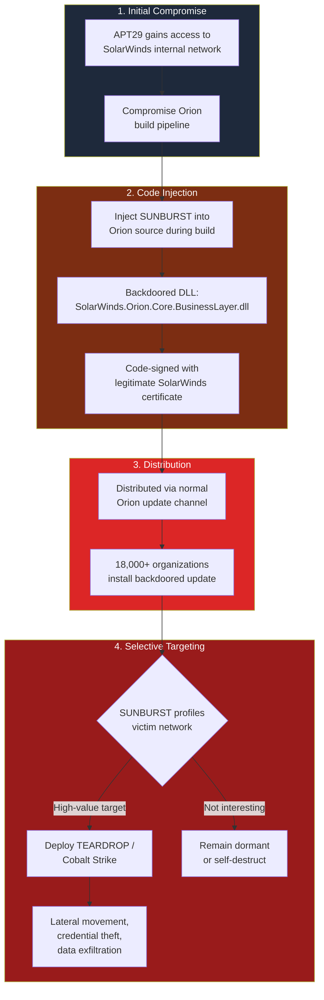
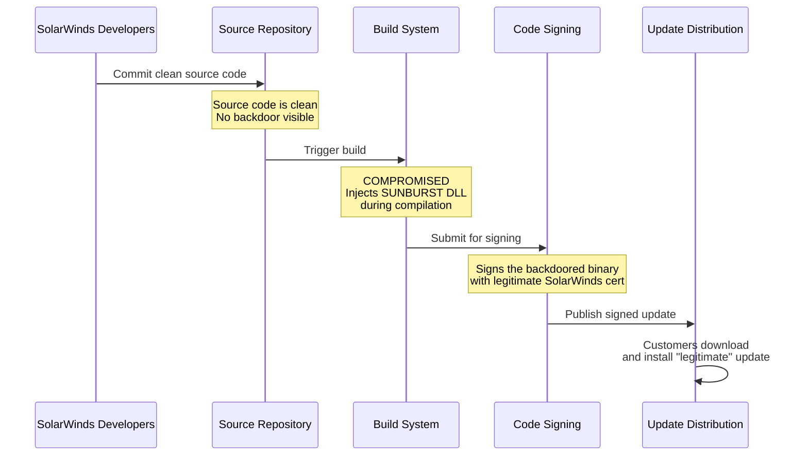
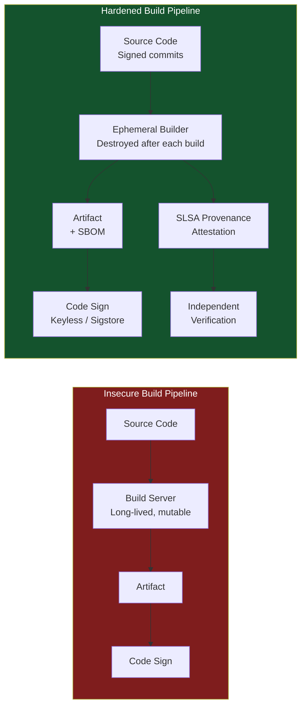

# SolarWinds Supply Chain Attack (2020)

In December 2020, cybersecurity firm FireEye (now Mandiant) disclosed that it had been breached. The investigation revealed something far larger: the attackers — attributed to Russia's SVR intelligence service (APT29/Cozy Bear) — had compromised the build system of SolarWinds, a major IT monitoring software vendor. Through a backdoored update to SolarWinds Orion, the malware known as SUNBURST was distributed to approximately **18,000 organizations**, including the US Treasury, Department of Homeland Security, Department of State, and Fortune 500 companies.

This was the most significant supply chain attack in history at the time of its discovery, and it fundamentally changed how the industry thinks about build system security.

**Related**: [Supply Chain Security](/security/supply-chain/) | [XZ Backdoor](/security/exploits/xz-backdoor-2024) | [Security Overview](/security/)

---

## Attack Overview



---

## Timeline

| Date | Event |
|------|-------|
| **Oct 2019** | APT29 gains access to SolarWinds network (estimated) |
| **Feb 2020** | SUNBURST code injected into Orion build process |
| **Mar 2020** | Backdoored Orion updates (2019.4 HF5 through 2020.2.1) begin shipping |
| **Mar-Dec 2020** | SUNBURST active in 18,000+ networks, selectively deploying second-stage payloads |
| **Dec 8, 2020** | FireEye discloses breach, attributes to nation-state actor |
| **Dec 13, 2020** | SolarWinds advisory published; CISA issues Emergency Directive 21-01 |
| **Dec 17, 2020** | Microsoft, FireEye, GoDaddy seize SUNBURST C2 domain to create killswitch |
| **Jan 2021** | US government attributes attack to SVR (Russian intelligence) |
| **Oct 2023** | SEC charges SolarWinds CISO with fraud for misleading investors about security posture |

---

## How SUNBURST Evaded Detection

The SUNBURST malware was sophisticated specifically in its evasion techniques. It was designed to be invisible to security tools, analysts, and automated scanning.

### Evasion Technique 1: Delayed Execution

```csharp
// Simplified representation of SUNBURST's delay mechanism
// The actual code was obfuscated but functionally equivalent

// SUNBURST waited 12-14 DAYS before doing anything
// This defeated sandbox analysis (sandboxes typically run for minutes)
private void Initialize()
{
    var lastWriteTime = File.GetLastWriteTime(
        Assembly.GetExecutingAssembly().Location);
    var threshold = lastWriteTime.AddDays(
        new Random().Next(12, 14));               // [!code warning]

    if (DateTime.Now < threshold)
        return;  // Stay dormant — too soon after installation

    // Only then begin C2 communication
    BeginBeaconing();
}
```

### Evasion Technique 2: Environment Checks

```csharp
// SUNBURST checked if it was running in a security researcher's
// environment and would DEACTIVATE itself if it detected:

private bool IsAnalysisEnvironment()
{
    // Check for security tools in running processes
    var blockedProcesses = new[] {
        "apimonitor", "dnspy", "fiddler", "wireshark",    // [!code error]
        "autoruns", "procmon", "procexp", "sysmon"         // [!code error]
    };

    // Check for security vendor drivers
    var blockedDrivers = new[] {
        "cybkerneltracker.sys",  // CrowdStrike
        "carbonblackk.sys",     // Carbon Black
        "eset", "avg", "avast"  // Antivirus
    };

    // Check if domain is a known security company
    var domain = GetADDomain();
    var blockedDomains = new[] {
        "swdev.local", "swdev.dmz",      // SolarWinds internal
        "lab.local", "test.local",       // Test environments
        "malware", "sandbox", "virus"    // Analysis environments
    };

    return ProcessExists(blockedProcesses)
        || DriverExists(blockedDrivers)
        || DomainMatches(blockedDomains);
}
```

::: danger Self-Preservation Logic
SUNBURST would permanently disable itself if it detected security analysis tools. This means that the very organizations most likely to detect it (those running EDR/monitoring) might have their copy deactivate, making detection even harder. The malware was designed to survive only in environments where it would not be noticed.
:::

### Evasion Technique 3: Domain Generation Algorithm (DGA)

SUNBURST did not connect to hardcoded C2 servers. Instead, it encoded information about the victim into DNS queries to a legitimate-looking domain:

```
# SUNBURST C2 communication via DNS
# The subdomain encodes victim identity + status

# Beacon format:
# <encoded-victim-data>.appsync-api.eu-west-1.avsvmcloud.com

# The domain looks like an AWS service endpoint
# DNS queries are rarely blocked or monitored
# The encoded subdomain tells attackers WHO is calling

# Example (not real):
7u3s4ibjt3rjt3s.appsync-api.eu-west-1.avsvmcloud.com
```

The attackers controlled `avsvmcloud.com` and used DNS responses to signal whether to activate the second stage, remain dormant, or self-destruct.

### Evasion Technique 4: Living Off the Land

Once the second stage was deployed in high-value targets, the attackers used legitimate tools and protocols:

| Technique | What They Used | Why It Evades Detection |
|-----------|---------------|------------------------|
| **Token theft** | Forged SAML tokens | Looked like legitimate SSO authentication |
| **Trusted protocols** | HTTPS to legitimate cloud services | Blended with normal traffic |
| **Existing tools** | PowerShell, WMI, scheduled tasks | No malware to detect — these are admin tools |
| **API access** | OAuth tokens to read email via Graph API | Appeared as normal application access |

---

## The Build System Compromise

This is the most operationally significant aspect of the attack. The attackers did not simply inject code into the source repository. They compromised the **build pipeline** itself.



### Why Source Code Review Would Not Have Caught It

The SUNBURST code was injected **during the build process**, not committed to the source repository. The build system was modified to:

1. Compile the legitimate Orion source code
2. Inject the SUNBURST payload into the compiled binary
3. Submit the backdoored binary for code signing
4. The signed binary was distributed as a legitimate update

This means:
- Code reviewers examining the source repo saw clean code
- The backdoor only existed in the compiled artifacts
- Code signing made the backdoored update look legitimate
- Update mechanisms distributed it automatically

::: tip Defense: Reproducible and Verified Builds
If SolarWinds had used reproducible builds with SLSA provenance, anyone could have independently compiled the source and compared the result against the distributed binary. The mismatch would have been immediately detected. See [Supply Chain Security](/security/supply-chain/) for implementing SLSA.
:::

---

## Scope of the Breach

### Confirmed Affected Organizations

| Sector | Notable Victims |
|--------|----------------|
| **US Government** | Treasury, Commerce, Homeland Security, State, Energy, NIH |
| **Technology** | Microsoft, Intel, Cisco, VMware, Belkin |
| **Security** | FireEye (discovered the breach), Malwarebytes, Mimecast |
| **Consulting** | Deloitte, KPMG |
| **Telecom** | Cox Communications, Charter |
| **Healthcare** | Multiple hospitals (undisclosed) |

### By the Numbers

| Metric | Value |
|--------|-------|
| Organizations that installed backdoored update | ~18,000 |
| Organizations actively targeted (second-stage deployed) | ~100 |
| Duration of undetected access | ~9 months |
| Estimated cost to US government agencies | $100M+ in remediation |
| SEC fine to SolarWinds | Ongoing litigation |

---

## Build System Security Lessons

### What Should Change



::: tip Build Security Controls
1. **Ephemeral build environments**: Build servers should be destroyed and recreated for each build. Persistent build servers can be compromised and modified.
2. **Hermetic builds**: Builds should be fully determined by source code and declared dependencies. No network access during build.
3. **Two-person review for build config**: Changes to CI/CD pipelines should require the same rigor as code changes.
4. **Build provenance**: Generate SLSA attestations that cryptographically link the artifact to its source code, builder, and build process.
5. **Reproducible builds**: Anyone should be able to build from source and get the identical artifact. If they cannot, something was injected.
6. **Separate signing from building**: The entity that builds should not be the entity that signs. Signing should require independent verification.
:::

### Detecting Build Compromise

```bash
# Verify build artifact matches source
# If you use reproducible builds, you can independently verify

# Compare distributed binary hash against independent build
sha256sum downloaded-artifact.dll
sha256sum independently-built-artifact.dll
# If they differ → potential compromise

# Check code signing certificate details
# On Windows
signtool verify /v /pa SolarWinds.Orion.Core.BusinessLayer.dll

# Verify SLSA provenance (modern approach)
slsa-verifier verify-artifact \
  --source-uri github.com/org/repo \
  --source-tag v1.2.3 \
  artifact.tar.gz
```

---

## Incident Response Lessons

### For Defenders During Active Supply Chain Compromise

| Phase | Action |
|-------|--------|
| **Identification** | Do not just check for the known IOCs — assume the attacker has tools you have not found yet |
| **Containment** | Isolate affected systems but do not alert the attacker by suddenly blocking C2 (coordinate with law enforcement) |
| **Eradication** | Rebuild from known-good images. Do NOT simply remove the backdoor and keep running. |
| **Recovery** | Rotate ALL credentials that the compromised system could have accessed. Assume all secrets are compromised. |
| **Lessons learned** | Audit build pipelines, implement SLSA, require reproducible builds |

::: warning Assume Total Compromise
In a supply chain attack, you cannot trust anything the compromised software had access to. If SolarWinds Orion monitored your network, the attacker could see everything Orion could see — every server, every credential, every configuration. You must rotate every secret and rebuild every system that was within the blast radius.
:::

---

## Key Takeaways

| Lesson | Implication |
|--------|------------|
| Build systems are high-value targets | Compromising the build is more efficient than compromising the source |
| Code signing does not imply code integrity | A signed binary is only as trustworthy as the build that produced it |
| Update mechanisms are distribution channels for attackers | The very mechanism meant to patch vulnerabilities delivered the malware |
| Dwell time matters | 9 months of undetected access meant the attackers could steal anything |
| Detection failed at every layer | Antivirus, EDR, network monitoring — all missed SUNBURST initially |
| Supply chain attacks affect the entire ecosystem | One vendor compromise cascaded to 18,000 organizations |

---

## Further Reading

- [Supply Chain Security](/security/supply-chain/) — SLSA, SBOMs, Sigstore, and the frameworks designed to prevent this class of attack
- [XZ Utils Backdoor](/security/exploits/xz-backdoor-2024) — a more recent supply chain attack using social engineering instead of build compromise
- [Log4Shell](/security/exploits/log4shell) — a different supply chain problem: a vulnerability in a ubiquitous transitive dependency
- [Exploits Overview](/security/exploits/) — taxonomy and context for all exploit case studies
