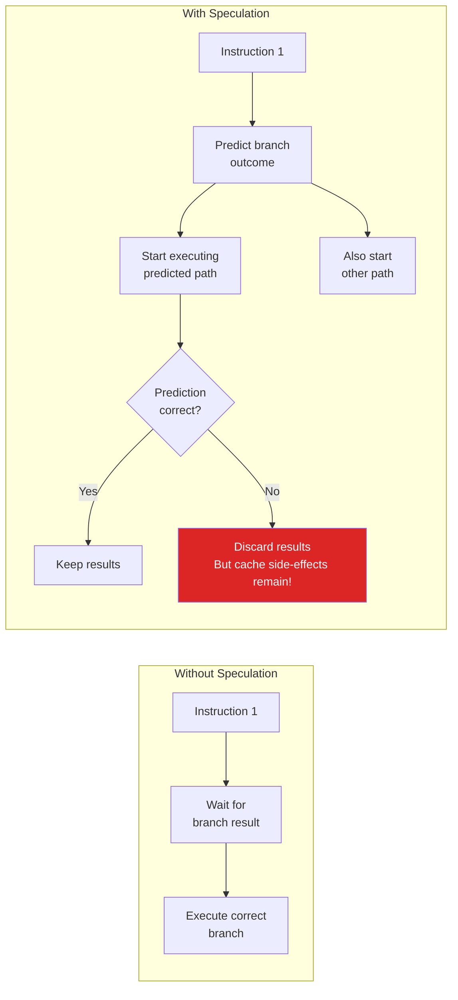
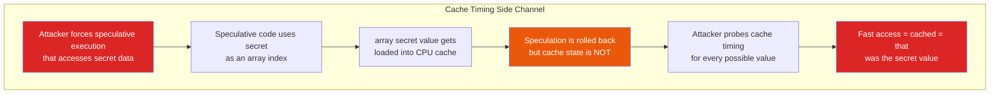
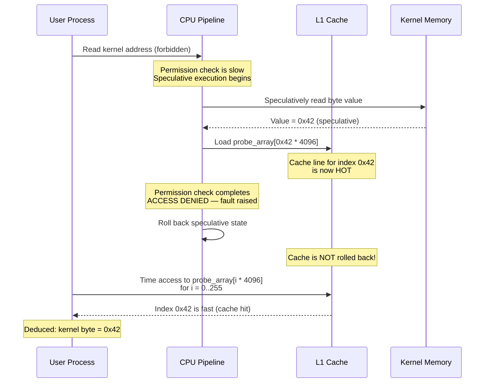
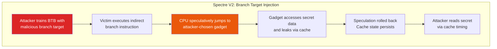
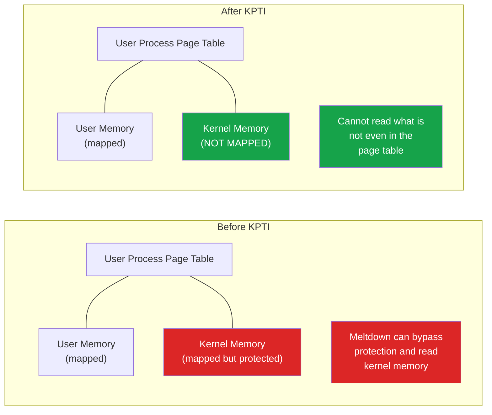

# Spectre & Meltdown

In January 2018, three research teams independently disclosed a class of vulnerabilities that shattered a fundamental assumption in computing: that the CPU itself is trustworthy. Meltdown (CVE-2017-5754) and Spectre (CVE-2017-5753, CVE-2017-5715) exploit **speculative execution** — a performance optimization present in virtually every modern CPU — to leak data across security boundaries.

These are not software bugs. They are **hardware design flaws** in how CPUs execute instructions, and they affect Intel, AMD, ARM, and other architectures to varying degrees. The mitigations imposed measurable performance penalties that the industry continues to bear.

**Related**: [Security Overview](/security/) | [Heartbleed](/security/exploits/heartbleed) | [Exploits Overview](/security/exploits/)

---

## Background: How CPUs Optimize Execution

Modern CPUs execute instructions far faster than memory can deliver data. To keep the pipeline full, CPUs use two key optimizations that Spectre and Meltdown exploit:

### Speculative Execution



When the CPU encounters a conditional branch (like an `if` statement), it does not wait for the condition to resolve. Instead, it **predicts** which branch will be taken and starts executing it. If the prediction is right, execution continues seamlessly. If wrong, the results are discarded.

The critical insight: **discarded speculative results leave observable traces in the CPU cache**.

### The CPU Cache Side Channel



---

## Meltdown (CVE-2017-5754)

### What It Does

Meltdown allows a **user-space process to read kernel memory**. The kernel is supposed to be completely isolated from user programs — it contains page tables, cryptographic keys, passwords of other processes, and the entire physical memory mapping. Meltdown breaks this isolation.

### How It Works

```c
// Conceptual Meltdown attack (simplified)
// This code runs in USER space but reads KERNEL memory

// Step 1: Flush the probe array from cache
for (int i = 0; i < 256; i++)
    flush(probe_array[i * PAGE_SIZE]);

// Step 2: Speculatively access kernel memory
// This instruction WILL raise a fault (segfault)
// But before the fault is delivered, the CPU speculatively executes...
char kernel_byte = *(char*)KERNEL_ADDRESS;          // [!code error]

// Step 3: Use the secret value as an index (speculative)
// This loads probe_array[kernel_byte * PAGE_SIZE] into cache
char dummy = probe_array[kernel_byte * PAGE_SIZE];  // [!code error]

// Step 4: The fault is delivered, speculative results discarded
// BUT the cache state change from Step 3 PERSISTS

// Step 5: Time access to each element of probe_array
for (int i = 0; i < 256; i++) {
    int time = time_access(probe_array[i * PAGE_SIZE]);
    if (time < CACHE_HIT_THRESHOLD) {
        // This index was cached — it is the value of kernel_byte!
        printf("Kernel byte: %d\n", i);             // [!code highlight]
    }
}
```

### Meltdown Attack Flow



### Which CPUs Are Affected

| Vendor | Affected | Notes |
|--------|----------|-------|
| **Intel** | Nearly all (1995-2018) | Most severely affected |
| **AMD** | Not affected by Meltdown | Different microarchitecture |
| **ARM** | Cortex-A75 and some others | Limited impact |
| **Apple** | M-series partially affected | Custom mitigation in silicon |

---

## Spectre (CVE-2017-5753, CVE-2017-5715)

Spectre is harder to exploit than Meltdown but also harder to mitigate because it exploits a more fundamental mechanism: **branch prediction**.

### Spectre Variant 1: Bounds Check Bypass

The attacker trains the CPU's branch predictor to expect a bounds check will pass, then provides an out-of-bounds index that the CPU speculatively uses before the check completes.

```c
// Vulnerable code pattern — extremely common in any language
if (index < array_size) {                          // Bounds check
    char value = array[index];                     // Speculatively executed
    char dummy = probe_array[value * PAGE_SIZE];   // Leaks 'value' via cache
}

// Attack:
// 1. Call this function many times with valid indices
//    → Branch predictor learns: "the check always passes"
// 2. Call with index = MALICIOUS_OUT_OF_BOUNDS_INDEX
//    → Branch predictor speculates: "check will pass"
//    → CPU speculatively reads array[malicious_index]
//    → That out-of-bounds read accesses SECRET data
//    → probe_array[SECRET * PAGE_SIZE] gets cached
//    → Speculation rolled back, but cache state persists
//    → Attacker probes cache to determine SECRET
```

### Spectre Variant 2: Branch Target Injection

The attacker poisons the Branch Target Buffer (BTB) to redirect speculative execution to a "gadget" — a sequence of existing code that leaks data through cache side effects.



### Which CPUs Are Affected

| Variant | Intel | AMD | ARM |
|---------|-------|-----|-----|
| **Spectre V1** (Bounds Check Bypass) | Yes | Yes | Yes |
| **Spectre V2** (Branch Target Injection) | Yes | Yes | Yes |
| **Meltdown** | Yes | No | Some |

---

## Mitigations

### Software Mitigations

| Mitigation | Targets | How It Works | Performance Cost |
|-----------|---------|-------------|-----------------|
| **KPTI** (Kernel Page Table Isolation) | Meltdown | Separate page tables for kernel and user space; kernel addresses not mapped in user space | 5-30% on syscall-heavy workloads |
| **Retpoline** | Spectre V2 | Replace indirect branches with return trampolines that confuse branch predictor | 5-15% on some workloads |
| **IBRS/IBPB** | Spectre V2 | CPU microcode updates that flush/restrict branch prediction state | 2-10% |
| **LFENCE** barriers | Spectre V1 | Insert serializing instructions after bounds checks | Minimal per-instance |
| **Site isolation** (browsers) | Spectre V1 in JS | Separate processes for different origins | Memory overhead (~10-20%) |

### KPTI (Kernel Page Table Isolation)



::: warning The Performance Tax
KPTI requires flushing TLB entries on every syscall (context switch between user and kernel). For workloads with heavy syscall usage (database servers, I/O-heavy applications), this imposes a **5-30% performance penalty**. This is a permanent cost that every Linux and Windows system now pays.

Newer Intel CPUs include Process Context Identifiers (PCIDs) that reduce the TLB flush overhead, bringing the penalty closer to 1-5%.
:::

### Retpoline (Return Trampoline)

```asm
; Normal indirect branch (vulnerable to Spectre V2)
jmp *%rax          ; CPU speculatively follows trained BTB entry

; Retpoline replacement
call retpoline_target
capture_spec:
    pause                   ; Speculative execution lands here
    lfence                  ; Serializing — stops speculation
    jmp capture_spec        ; Infinite loop (never actually reached)
retpoline_target:
    mov %rax, (%rsp)       ; Overwrite return address with actual target
    ret                     ; Return to actual target via return stack
                           ; Branch predictor cannot be trained for this
```

---

## Real-World Impact

### Performance Benchmarks After Mitigations

| Workload Type | Performance Impact | Why |
|--------------|-------------------|-----|
| **Database (PostgreSQL)** | 7-17% slower | Heavy syscall usage, context switching |
| **I/O intensive** | 10-30% slower | Frequent kernel transitions |
| **Compute-bound** | 1-3% slower | Rarely enters kernel |
| **Web servers** | 5-10% slower | Network I/O, file serving |
| **Compilation** | 5-8% slower | File I/O, process spawning |
| **Cloud VMs** | 10-20% slower | Hypervisor transitions compound the cost |

### Cloud Provider Response

| Provider | Action |
|----------|--------|
| **AWS** | Patched hypervisors, offered Nitro Enclaves for sensitive workloads |
| **Google Cloud** | Developed and deployed retpoline, open-sourced the technique |
| **Azure** | Patched hypervisor, recommended customer OS updates |
| **All providers** | Absorbed the performance overhead (customers pay indirectly through higher resource usage) |

---

## Later Variants

Spectre and Meltdown opened the floodgates for CPU side-channel research. The original vulnerabilities spawned an entire field:

| Variant | CVE | Year | What It Does |
|---------|-----|------|-------------|
| **Spectre V1** | CVE-2017-5753 | 2018 | Bounds check bypass |
| **Spectre V2** | CVE-2017-5715 | 2018 | Branch target injection |
| **Meltdown** | CVE-2017-5754 | 2018 | Rogue data cache load |
| **Spectre-NG / V3a** | CVE-2018-3640 | 2018 | Rogue system register read |
| **Spectre V4** | CVE-2018-3639 | 2018 | Speculative store bypass |
| **Foreshadow (L1TF)** | CVE-2018-3615 | 2018 | L1 terminal fault (SGX, VMs) |
| **ZombieLoad (MDS)** | CVE-2019-11091 | 2019 | Microarchitectural data sampling |
| **RIDL** | CVE-2018-12130 | 2019 | Rogue in-flight data load |
| **Downfall (GDS)** | CVE-2022-40982 | 2023 | Gather data sampling (AVX) |
| **Inception** | CVE-2023-20569 | 2023 | Phantom speculation (AMD) |

---

## Defense Strategies

::: tip For Application Developers
1. **Keep OS and firmware updated**: Most Spectre/Meltdown mitigations are delivered via OS kernel updates and CPU microcode updates. Apply them promptly.
2. **Use constant-time algorithms for secrets**: Avoid branching or memory access patterns that depend on secret values (already good practice for timing attacks).
3. **Enable site isolation in browsers**: Modern browsers isolate different sites into separate processes specifically because of Spectre.
4. **Use hardware security features**: Intel SGX (with caveats), AMD SEV, ARM TrustZone for sensitive computations.
5. **Consider the performance budget**: If your workload is syscall-heavy, budget 10-20% overhead for mitigations.
:::

::: danger For Cloud and Infrastructure Engineers
- **Hyperthreading (SMT) can leak data between threads**: Consider disabling SMT on hosts processing sensitive data (significant performance cost)
- **VM escape via side-channels is real**: Foreshadow/L1TF specifically targets VM isolation
- **Microcode updates are as important as OS patches**: CPU vendors release microcode updates that must be deployed to firmware
- **Containers share a kernel**: Spectre attacks between containers on the same host are feasible — consider VM-level isolation (Kata Containers, Firecracker) for untrusted workloads
:::

---

## Key Takeaways

| Lesson | Implication |
|--------|------------|
| Hardware is not trustworthy by default | CPUs optimize for performance, not security — speculative execution trades security for speed |
| Side channels are a real attack vector | You do not need a memory corruption bug to leak data — timing differences are enough |
| Mitigations have permanent costs | The industry pays a 5-30% performance tax for Spectre/Meltdown mitigations indefinitely |
| Shared infrastructure amplifies risk | Cloud VMs, containers, and hyperthreading increase the attack surface for side-channel leaks |
| Research does not stop | Each new CPU generation brings new side-channel variants — this is an ongoing arms race |
| The software/hardware contract was broken | Operating systems assumed the CPU enforced memory isolation correctly; it did not |

---

## Further Reading

- [Dirty Pipe & Linux Kernel Exploits](/security/exploits/dirty-pipe) — kernel-level vulnerabilities and privilege escalation
- [Container Escapes](/security/exploits/container-escapes) — why containers are not security boundaries (especially relevant with Spectre)
- [Heartbleed](/security/exploits/heartbleed) — another case of data leakage from memory, but via software bugs
- [Cryptographic Attacks](/security/exploits/crypto-attacks) — timing attacks are the same class of side-channel
- [Exploits Overview](/security/exploits/) — taxonomy and context for all exploit case studies
