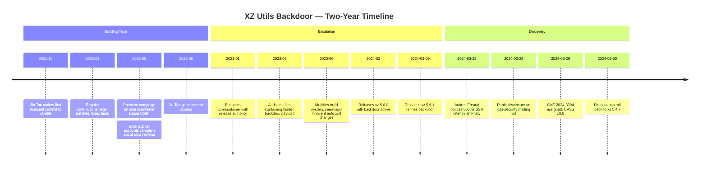
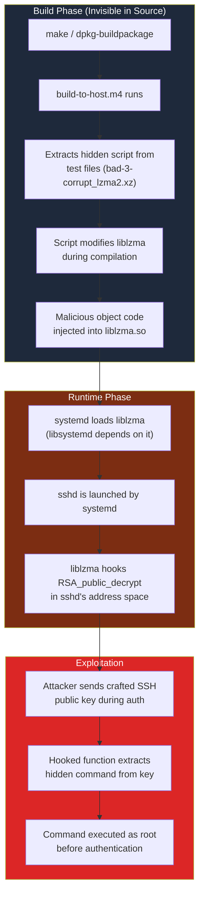
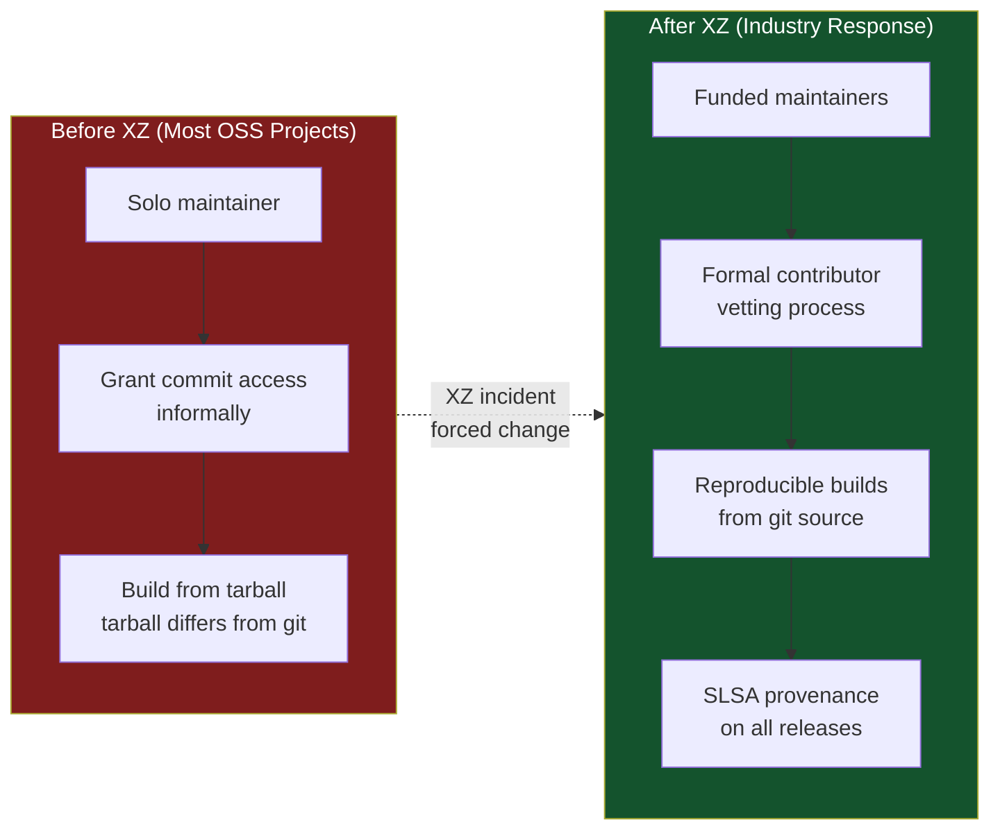

# The XZ Utils Backdoor (CVE-2024-3094)

On March 29, 2024, Microsoft engineer Andres Freund posted to the oss-security mailing list that he had discovered a backdoor in xz/liblzma, a ubiquitous compression library used by virtually every Linux distribution. The backdoor had been planted by a contributor known as "Jia Tan" who had spent over two years building trust, becoming a co-maintainer, and gradually injecting malicious code that would have given attackers unauthorized access to any system running an affected SSH daemon.

This was not a technical exploit in the traditional sense. It was a **social engineering attack on the open source supply chain**, and it nearly succeeded in compromising the entire Linux ecosystem.

**Related**: [Supply Chain Security](/security/supply-chain/) | [Security Overview](/security/) | [SolarWinds](/security/exploits/solarwinds)

---

## The Attack Timeline



---

## The Social Engineering Campaign

### Phase 1 — Targeting the Maintainer

Lasse Collin had been the sole maintainer of xz-utils for years. Open source maintainer burnout is well-documented, and Jia Tan (likely a state-sponsored group operating under a pseudonym) exploited this methodically:

1. **Sock puppet pressure**: Multiple fake accounts emailed the xz-devel mailing list demanding faster releases and criticizing Lasse for slow patch reviews. Messages like "Progress will not happen until there is new maintainer" appeared from different accounts.
2. **Helpful contributions**: Simultaneously, Jia Tan submitted high-quality patches — legitimate bug fixes, test improvements, documentation updates. Every contribution built trust.
3. **Gradual authority transfer**: Over 18 months, Jia Tan moved from contributor to reviewer to co-maintainer with release authority.

::: danger The Human Vulnerability
This attack did not exploit a single line of code initially. It exploited a burned-out, overworked maintainer who was grateful for help. The most dangerous supply chain attacks target the social layer, not the technical one.
:::

### Phase 2 — Planting the Backdoor

The backdoor was distributed across multiple seemingly innocuous commits:

| Commit | Apparent Purpose | Actual Purpose |
|--------|-----------------|----------------|
| Test binary files added | "Add test cases for edge cases" | Contained the encrypted backdoor payload |
| `build-to-host.m4` modified | "Improve portability" | Injected malicious code during build process |
| CMake/autotools changes | "Modernize build system" | Ensured backdoor only activates on Debian/RPM builds |
| `.gitignore` updates | "Clean up repo" | Hid intermediate build artifacts |

---

## How the Backdoor Worked



### Technical Details

**1. Build-time injection**: The `build-to-host.m4` autoconf macro contained obfuscated shell commands that only executed during Debian/Fedora package builds. The commands extracted a binary payload hidden inside test fixture files (`tests/files/bad-3-corrupt_lzma2.xz`) and patched it into the liblzma shared library.

**2. Function hooking**: The injected code used the IFUNC (indirect function) mechanism in glibc to intercept calls to `RSA_public_decrypt()` — the OpenSSL function that verifies SSH public keys during authentication.

**3. Command extraction**: When an SSH connection sent a specially crafted public key containing an encrypted payload (encrypted with the attacker's Ed448 key), the hooked function would:
   - Detect the payload marker in the key
   - Decrypt the embedded command using a hardcoded key
   - Execute the command as root via `system()`
   - Continue normal SSH authentication (pass or fail as normal)

```c
// Simplified representation of what the backdoor did
// The actual code was heavily obfuscated in binary form

// Original function
int RSA_public_decrypt(int flen, const unsigned char *from,
                       unsigned char *to, RSA *rsa, int padding);

// Backdoor-hooked version (conceptual)
int hooked_RSA_public_decrypt(int flen, const unsigned char *from,
                              unsigned char *to, RSA *rsa, int padding) {
    // Check if the public key contains the attacker's marker
    if (contains_backdoor_marker(from, flen)) {
        // Extract encrypted command from public key data
        char *command = decrypt_with_ed448(from, attacker_private_key);
        // Execute as root — this runs BEFORE authentication completes
        system(command);  // [!code error]
    }
    // Call original function so SSH works normally
    return original_RSA_public_decrypt(flen, from, to, rsa, padding);
}
```

::: warning Why It Was Nearly Invisible
- The backdoor code was **not in the source repository** — it existed only in the release tarballs
- It only activated on **Debian and Fedora builds** (the most common production distros)
- It only affected **sshd when launched by systemd** (which is the default)
- The hooked function still performed normal SSH auth, so nothing appeared broken
- Traditional code review of the Git repository would not have found it
:::

---

## How It Was Discovered

Andres Freund, a PostgreSQL developer at Microsoft, was benchmarking database performance when he noticed something odd:

1. **SSH connections were 500ms slower** than expected on his Debian Sid system
2. He noticed `sshd` was using **unexpected CPU cycles** during authentication
3. He traced the issue to liblzma being loaded into sshd's address space
4. He found the `build-to-host.m4` script injecting obfuscated code during build
5. He reversed the obfuscated payload and identified the SSH authentication hook

::: tip The 500ms That Saved the Internet
The backdoor was caught because one engineer noticed a half-second delay and refused to ignore it. This is why performance monitoring and a culture of investigating anomalies — no matter how small — is a critical security control. Automation did not catch this. Human curiosity did.
:::

### What If It Had Not Been Caught?

The backdoor was already in:
- Debian Sid (unstable) and testing
- Fedora 40 (pre-release) and Fedora Rawhide
- openSUSE Tumbleweed and MicroOS
- Kali Linux, Arch Linux (briefly)

It was **weeks away** from landing in Debian stable and Ubuntu LTS — distributions that power millions of servers. If it had reached production, the attacker would have had a root-level SSH backdoor on a significant percentage of the internet's Linux infrastructure.

---

## Supply Chain Security Lessons

### What Failed

| Defense | Why It Failed |
|---------|--------------|
| **Code review** | Backdoor was not in source code — only in release tarballs |
| **Maintainer vetting** | No formal process for granting commit access in most OSS projects |
| **Build reproducibility** | Release tarballs differed from git source (common in autotools projects) |
| **Dependency auditing** | liblzma is a "boring" compression library — nobody was auditing it |
| **Automated scanning** | No scanner detected the obfuscated payload in test fixture files |

### What Would Have Helped

::: tip Defense Recommendations
1. **Reproducible builds**: If distributions built from git source instead of release tarballs, the injected code would not have been included
2. **Build transparency**: SLSA provenance attestations would flag differences between source and release artifact
3. **Two-person rule for releases**: Require multiple maintainers to sign off on releases (but this is hard for under-resourced projects)
4. **SBOM and dependency monitoring**: Track which systems depend on xz/liblzma and assess blast radius quickly
5. **Performance monitoring as security**: Andres Freund's anomaly detection was accidental — make it systematic
6. **Fund open source maintainers**: Lasse Collin was a solo volunteer maintaining critical infrastructure. Burnout made him vulnerable to social engineering
:::

### Structural Changes Since the Incident



---

## Detection Checklist

If you need to check whether your systems were affected:

```bash
# Check xz/liblzma version
xz --version
# Affected: 5.6.0, 5.6.1

# Check if sshd links against liblzma
ldd $(which sshd) | grep liblzma
# If liblzma appears AND version is 5.6.0/5.6.1 → AFFECTED

# Check for the malicious build-to-host.m4
# (only in release tarballs, not git source)
strings /usr/lib/liblzma.so.5 | grep -i "rsa_public_decrypt"
# Should NOT match — if it does, the backdoor is active

# Verify package integrity
# Debian/Ubuntu
dpkg -V liblzma5
# RPM-based
rpm -V xz-libs
```

---

## Key Takeaways

| Lesson | Implication |
|--------|------------|
| Social engineering scales | A patient attacker with a 2-year timeline can compromise any project with insufficient governance |
| Source != artifact | If your build artifacts differ from your source code, you have a supply chain gap |
| Boring dependencies are dangerous | The most critical software is often the most under-funded and under-reviewed |
| Performance anomalies are security signals | Monitor for unexpected latency and CPU usage — they may indicate compromise |
| Open source sustainability is a security issue | Burned-out solo maintainers are a systemic vulnerability |

---

## Further Reading

- [Supply Chain Security](/security/supply-chain/) — SLSA, SBOMs, Sigstore, and the frameworks that address these risks
- [SolarWinds Attack](/security/exploits/solarwinds) — another supply chain compromise, this one targeting a build pipeline
- [Security Overview](/security/) — threat modeling and security principles
- [Exploits Overview](/security/exploits/) — taxonomy of attack types
