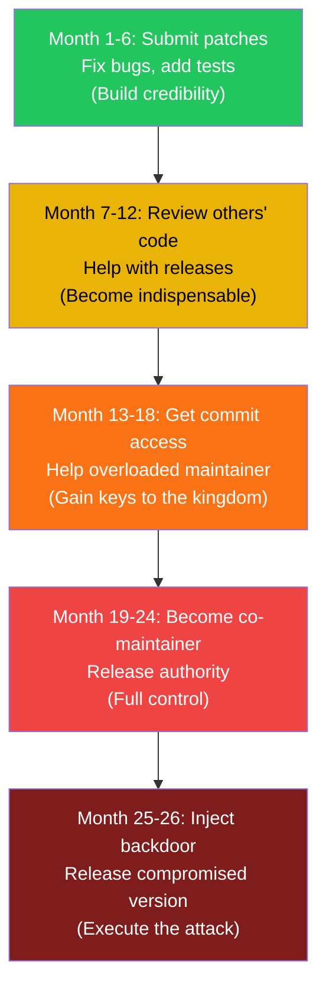
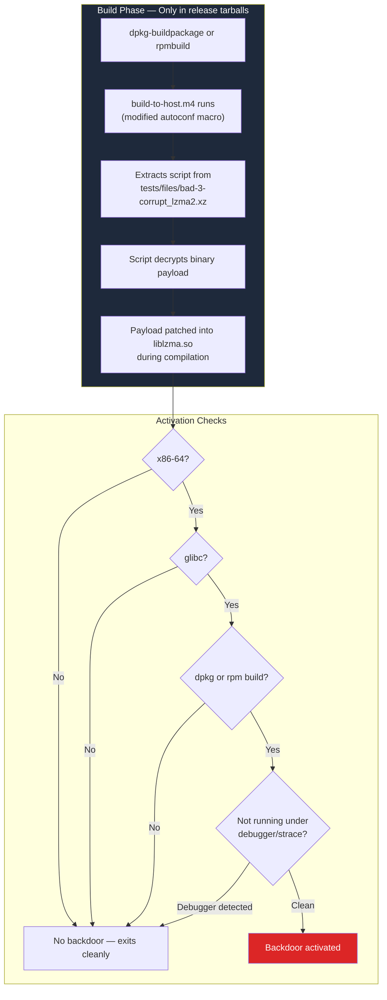
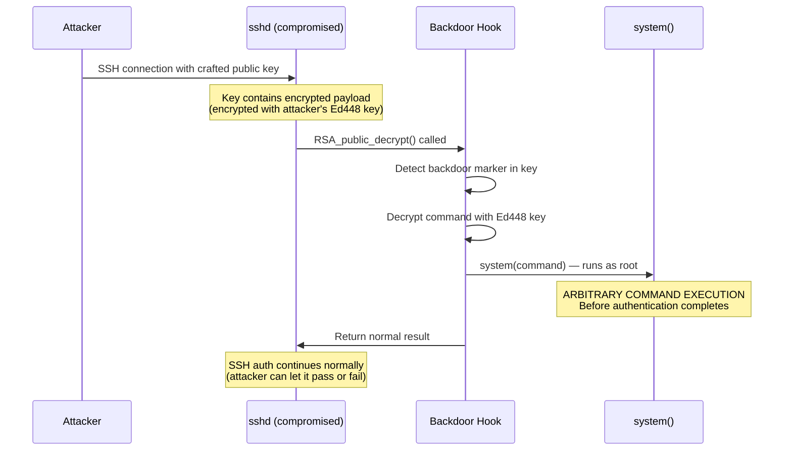

# The XZ Utils Backdoor (CVE-2024-3094)

On March 29, 2024, Microsoft engineer Andres Freund posted to the oss-security mailing list that he had discovered a backdoor in xz/liblzma — a compression library used by **virtually every Linux distribution on Earth**. The backdoor had been planted by a contributor known as "Jia Tan" who had spent **over two years** building trust, becoming a co-maintainer, and injecting malicious code that would have given attackers **root-level SSH access** to any affected system.

This was not a technical exploit. It was the most sophisticated social engineering attack on open source in history. A patient, likely state-sponsored actor spent 26 months methodically grooming an overworked maintainer, and came **weeks away** from compromising the entire Linux ecosystem.

CVSS Score: **10.0** (maximum severity).

## The Alert

Andres Freund was benchmarking PostgreSQL performance on his Debian Sid machine when he noticed something odd:

- SSH logins were **500 milliseconds slower** than expected
- `sshd` was consuming **unexpected CPU cycles** during authentication
- `valgrind` showed errors originating from liblzma

Most engineers would have ignored a half-second delay. Freund didn't. He dug into why a compression library was doing anything during SSH authentication — and uncovered the biggest supply chain attack in open source history.

::: tip The 500ms That Saved the Internet
The backdoor was caught because one engineer noticed a half-second delay and refused to ignore it. Automation didn't catch it. Code review didn't catch it. Static analysis didn't catch it. **Human curiosity did.**
:::

## Impact

- **CVSS**: 10.0 — Critical, maximum severity
- **Affected versions**: xz 5.6.0 and 5.6.1
- **Attack type**: Remote Code Execution via SSH (pre-authentication)
- **Blast radius**: Every Linux server running affected sshd via systemd
- **Time to compromise**: 2+ years of social engineering
- **Distributions affected**: Debian Sid/testing, Fedora 40/Rawhide, openSUSE Tumbleweed, Kali Linux, Arch Linux
- **Distributions saved**: Ubuntu LTS, Debian stable, RHEL, CentOS — weeks away from inclusion
- **What the attacker could do**: Execute arbitrary commands as root on any affected machine, **without authentication**

::: danger What this means
If the backdoor had reached Debian stable and Ubuntu LTS (it was weeks away), the attacker would have had a root shell on a significant percentage of the internet's servers — cloud VMs, Kubernetes nodes, database servers, web servers, CI/CD runners. All accessible without a password.
:::

## Timeline

```mermaid
timeline
    title The XZ Backdoor — 26 Months of Patience
    section Building Trust (2021-2022)
        2021-10 : Jia Tan's first commit to xz-utils
               : Innocent patch — fixing a CRC test
        2022-01 : Regular contributions begin
               : Bug fixes, test improvements, documentation
        2022-02 : Sock puppet campaign begins
               : Fake accounts pressure Lasse Collin
               : "Progress will not happen until there is new maintainer"
        2022-05 : Pressure escalates
               : Jigar Kumar, krygorin4545 email maintainer
               : "You ignore contributions on this repo"
        2022-09 : Jia Tan gains commit access
               : Lasse grants access, grateful for help
        2022-12 : First release involvement
               : Helps prepare xz 5.4.0
    section Planting the Payload (2023)
        2023-01 : Becomes co-maintainer with release authority
        2023-06 : Introduces IFUNC resolvers
               : crc32_resolve, crc64_resolve
               : Seemingly legitimate performance optimization
        2023-07 : Adds binary test files
               : "Test cases for corrupt LZMA streams"
               : Actually contain encrypted backdoor payload
        2023-10 : Modifies build-to-host.m4
               : "Improve portability across platforms"
               : Actually injects payload during package builds
        2023-12 : Disables OSS-Fuzz integration
               : "Updating fuzzing configuration"
               : Prevents detection of injected code
    section The Attack (2024)
        2024-01-22 : First backdoor commit (obfuscated)
        2024-02-24 : xz 5.6.0 released with backdoor
        2024-03-09 : xz 5.6.1 released — backdoor refined
               : Patches bugs in the malicious code
        2024-03-25 : Jia Tan pressures Ubuntu to include 5.6.1
               : Files Launchpad bug requesting update
    section Discovery & Response
        2024-03-28 : Andres Freund notices 500ms SSH delay
               : Begins investigating liblzma
        2024-03-29 : Public disclosure on oss-security
               : CVE-2024-3094 assigned — CVSS 10.0
        2024-03-30 : All distros roll back to xz 5.4.x
               : Global coordinated response
```



### Detailed Chronology

| Date | Event |
|------|-------|
| **2021-10-29** | Jia Tan's first commit: innocent CRC test fix |
| **2022-01 → 2022-08** | 18 months of legitimate contributions — fixes, tests, docs |
| **2022-02** | Sock puppets "Jigar Kumar" and "Dennis Ens" begin pressuring Lasse Collin |
| **2022-05-19** | Jigar Kumar: *"Is there any progress on this? ... Progress will not happen until there is new maintainer."* |
| **2022-06-07** | Dennis Ens: *"I am mass mass mass mass disappointed at the mass mass mass mass mass mass mass mass mass mass mass mass mass mass mass mass ..."* |
| **2022-06-22** | Lasse Collin responds: *"I haven't lost interest but my ability to care has been limited. It's also good to keep in mind that this is an unpaid hobby project."* |
| **2022-09** | Jia Tan granted commit access |
| **2023-01** | Jia Tan becomes co-maintainer with release authority |
| **2023-06** | IFUNC resolvers introduced (attack vector) |
| **2023-07** | Binary test files added (encrypted payload) |
| **2024-01-22** | First backdoor code committed |
| **2024-02-24** | xz 5.6.0 released — backdoor is live |
| **2024-03-09** | xz 5.6.1 released — backdoor refined |
| **2024-03-25** | Jia Tan pushes Ubuntu to adopt 5.6.1 via Launchpad bug |
| **2024-03-28** | Andres Freund notices 500ms SSH anomaly |
| **2024-03-29 07:40 UTC** | Freund posts to oss-security mailing list |
| **2024-03-29 08:00 UTC** | CVE-2024-3094 assigned — CVSS 10.0 |
| **2024-03-30** | All major distros roll back to xz 5.4.x |

## Root Cause: The Social Engineering Campaign

### The Burned-Out Maintainer

Lasse Collin had been the **sole maintainer** of xz-utils for over a decade. He maintained critical infrastructure used by every Linux distribution, every Mac (via Homebrew), and countless build systems — **as an unpaid hobby**.

This is the structural vulnerability the attacker exploited. Not a buffer overflow. Not a logic bug. **A human who was exhausted and grateful for help.**

### The Sock Puppet Campaign

At least three fake accounts were used to pressure Collin into accepting help:

```
From: Jigar Kumar <jigarkumar17@protonmail.com>
Subject: [xz-devel] XZ for Java: Can't create .xz files with a custom dictionary
Date: 2022-04-19

"Is there any progress on this? Patches spend tokens on a mailing
list without being merged. Time to find a new maintainer or fork."
```

```
From: Dennis Ens <dennis.ens@student.tugraz.at>
Subject: Re: [xz-devel] 5.4.0 release?
Date: 2022-06-07

"... I am mass disappointed at the mass mass mass ..."
(intentionally garbled to seem like an angry user)
```

```
From: krygorin4545
Subject: Re: XZ for Java update?
Date: 2022-05-19

"Progress will not happen until there is new maintainer.
XZ for C has mass mass mass mass mass mass ..."
```

::: danger The Pattern
Multiple fake accounts, different email providers, different writing styles — all delivering the same message: "You need help. Accept Jia Tan." This is textbook **coordinated social engineering**.
:::

### The Trust Ladder



## How the Backdoor Worked

### Phase 1: Build-Time Injection

The backdoor was **not in the Git source code**. It was injected during the package build process via a modified autoconf macro (`build-to-host.m4`) that extracted an encrypted payload from binary test fixture files.



::: warning Why code review didn't catch it
The backdoor existed **only in the release tarballs** (.tar.gz), not in the Git repository. The malicious `build-to-host.m4` and the encrypted payload in test files looked innocent in isolation. Reviewing the Git source would show nothing — you had to diff the tarball against the repo to find the injected code.
:::

### Phase 2: Runtime Hook

Once liblzma was compiled with the backdoor:

1. **systemd** loads liblzma (libsystemd depends on it)
2. **sshd** is launched by systemd, inheriting the compromised liblzma
3. The backdoor uses **IFUNC** (indirect function) to hook `RSA_public_decrypt()` in sshd's process
4. This is the function that verifies SSH public keys during authentication

### Phase 3: Remote Code Execution



The attacker could:
- **Execute any command as root** — without authenticating
- **Leave no trace** — SSH auth logs show nothing unusual
- **Use any SSH server** running the affected version
- **Chain attacks** — pivot from one compromised server to the entire network

### The Concealment Layers

| Layer | What it hid |
|-------|-------------|
| **Binary test files** | Encrypted payload disguised as "corrupt LZMA test data" |
| **build-to-host.m4** | Extraction script disguised as "portability macro" |
| **IFUNC resolvers** | Function hook disguised as "performance optimization" |
| **Tarball-only** | Not in Git source, only in release archives |
| **Architecture checks** | Only activates on x86-64 + glibc + dpkg/rpm |
| **Anti-debugging** | Exits cleanly if debugger, strace, or sanitizers detected |
| **Disabled OSS-Fuzz** | Jia Tan disabled fuzzing that might have detected the anomaly |
| **Ed448 encryption** | Payload encrypted so only attacker's key could trigger it |

## How It Was Discovered

### Andres Freund's Investigation

```
1. Notice: SSH logins are 500ms slower than expected
2. Profile: sshd consuming unexpected CPU during auth
3. Trace: CPU usage comes from liblzma (why is compression running during SSH?)
4. Investigate: liblzma has IFUNC resolvers hooking into RSA functions
5. Diff: Compare release tarball with git source — find injected code
6. Reverse: Decode obfuscated shell scripts in build-to-host.m4
7. Analyze: Trace the full attack chain from test files to RCE
8. Disclose: Post to oss-security mailing list
```

Freund spent roughly **a weekend** reverse-engineering the entire attack chain. His disclosure email is one of the most important security communications in open source history.

::: tip What made discovery possible
Freund was running **Debian Sid** (unstable) — one of the few distros that had the backdoor. He was also doing performance benchmarking, which made the 500ms delay noticeable. If he had been running Debian stable, he would never have encountered the backdoor.
:::

### What If It Had Not Been Caught?

The backdoor was **actively being pushed** into stable distributions:

- **Ubuntu Noble Numbat (24.04 LTS)**: Jia Tan filed a Launchpad bug on March 25 requesting xz 5.6.1 be included
- **Debian stable (Bookworm)**: Would have entered in the next point release
- **Fedora 40**: Already in the pre-release

If it had reached Ubuntu LTS and Debian stable:
- **Millions of servers** worldwide would have been silently compromised
- **Every cloud VM** running these distros would be vulnerable
- **Every Kubernetes node**, **every CI/CD runner**, **every database server**
- The attacker would have had a **root-level backdoor** to a significant percentage of the internet

## Detection Checklist

```bash
# 1. Check your xz version
xz --version
# AFFECTED: 5.6.0, 5.6.1

# 2. Check if sshd links against liblzma
ldd $(which sshd) | grep liblzma
# If liblzma appears AND version is 5.6.0/5.6.1 → COMPROMISED

# 3. Check for the hooked function
strings /usr/lib/liblzma.so.5 | grep -i "rsa_public_decrypt"
# Should NOT match — if it does, backdoor is active

# 4. Verify package integrity
dpkg -V liblzma5         # Debian/Ubuntu
rpm -V xz-libs           # Fedora/RHEL

# 5. Check for the malicious test files
sha256sum /usr/share/doc/xz-utils/tests/files/bad-3-corrupt_lzma2.xz
# Compare against known-good hashes

# 6. Downgrade immediately if affected
apt install liblzma5=5.4.5-0.3    # Debian
dnf downgrade xz-libs-5.4.4       # Fedora
```

## Lessons Learned

### 1. Open Source Sustainability is a Security Issue

Lasse Collin maintained xz-utils as an **unpaid hobby** despite it being critical infrastructure for every Linux distribution. A funded maintainer with a support network would not have been vulnerable to the sock puppet pressure campaign.

### 2. Social Engineering > Technical Exploits

The attacker didn't find a bug. They **became the maintainer**. No amount of code scanning, fuzzing, or static analysis can defend against an insider with commit access who patiently builds trust over 2 years.

### 3. Reproducible Builds are Critical

The backdoor only existed in release tarballs, not in Git source. **Reproducible builds** — where anyone can verify that the binary was built from the claimed source — would have detected the discrepancy.

### 4. Performance Monitoring is Security Monitoring

The backdoor was found because of a **500ms latency anomaly**. Performance regressions after dependency updates should be investigated as potential security incidents, not just bugs.

### 5. The Bus Factor is a Security Factor

A project with a single maintainer is one social engineering campaign away from compromise. Critical infrastructure needs multiple maintainers, formal governance, and funded development.

### What Changed After

| Before XZ | After XZ |
|-----------|----------|
| Tarballs accepted as source of truth | Push for builds from Git source |
| Informal maintainer succession | Formal contributor vetting processes |
| No build provenance | SLSA provenance attestations |
| OSS sustainability ignored | Alpha-Omega, Sovereign Tech Fund, Tidelift funding |
| `.pth` and autoconf trusted blindly | Increased scrutiny of build-time code execution |

## The Bigger Picture

As Andres Freund wrote: *"This might be the best executed supply chain attack we've seen described in the open, and it's a nightmare scenario."*

The XZ attack represents a paradigm shift:
- **Traditional attacks** exploit technical vulnerabilities (bugs, misconfigurations)
- **Supply chain attacks** exploit **trust** — in maintainers, in build systems, in package registries
- **Social engineering at scale** is now the most effective attack vector against open source

The open source ecosystem runs on trust. XZ showed what happens when that trust is weaponized.

## Further Reading

- [Wikipedia: XZ Utils Backdoor](https://en.wikipedia.org/wiki/XZ_Utils_backdoor) — Comprehensive overview
- [Andres Freund's original disclosure](https://www.openwall.com/lists/oss-security/2024/03/29/4) — The email that saved the internet
- [Akamai: XZ Utils Backdoor — Everything You Need to Know](https://www.akamai.com/blog/security-research/critical-linux-backdoor-xz-utils-discovered-what-to-know) — Technical deep dive
- [Datadog Security Labs: XZ Backdoor Analysis](https://securitylabs.datadoghq.com/articles/xz-backdoor-cve-2024-3094/) — Detailed payload analysis
- [JFrog: XZ Backdoor Attack — All You Need To Know](https://jfrog.com/blog/xz-backdoor-attack-cve-2024-3094-all-you-need-to-know/) — Timeline and impact
- [Sam James' comprehensive FAQ](https://gist.github.com/thesamesam/223949d5a074ebc3dce9ee78baad9e27) — The definitive technical FAQ
- [SentinelOne: Threat Actor Planned Further Vulnerabilities](https://www.sentinelone.com/blog/xz-utils-backdoor-threat-actor-planned-to-inject-further-vulnerabilities/) — Evidence of planned future attacks
- [Supply Chain Security](/security/supply-chain/) — SLSA, SBOMs, Sigstore
- [SolarWinds Attack](/security/exploits/solarwinds) — Another supply chain compromise
- [LiteLLM Supply Chain Attack](/war-room/litellm-supply-chain-2026) — 2026 PyPI supply chain attack
