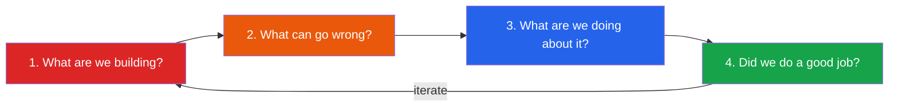

# Security

Security is not a feature you add at the end. It is a property of how you think about every line of code, every API boundary, every deployment pipeline, and every human process in your organization. Most breaches don't come from exotic zero-days — they come from an engineer who hardcoded a database password, a forgotten admin endpoint with no authentication, or a JWT implementation that doesn't validate the algorithm header.

This section teaches you to think like an attacker so you can build like a defender. Every vulnerability is shown with both the **exploitable code** and the **fixed version**, because understanding why something is vulnerable matters more than memorizing a checklist.

## Thinking in Threat Models

Before you can defend a system, you need to understand what you are defending it against. Threat modeling is the practice of systematically asking: *what can go wrong?*

A simple threat model for any system follows these four steps:

**Step 1 — What are we building?** Draw a data flow diagram. Identify every entry point, data store, trust boundary, and external dependency. You cannot secure what you cannot see.

**Step 2 — What can go wrong?** Use the STRIDE framework: **S**poofing (can someone pretend to be someone else?), **T**ampering (can someone modify data in transit or at rest?), **R**epudiation (can someone deny they did something?), **I**nformation disclosure (can someone see data they shouldn't?), **D**enial of service (can someone make the system unavailable?), **E**levation of privilege (can someone gain access they shouldn't have?).

**Step 3 — What are we doing about it?** For each threat, you either mitigate it (apply a control), accept it (document why), transfer it (insurance, third-party service), or eliminate it (remove the feature).

**Step 4 — Did we do a good job?** Review, test, pentest, and repeat. Threat models are living documents.

## Section Map

| Subsection | What You'll Learn | Threat Category |
|---|---|---|
| [OWASP Top 10 (2021)](/security/owasp-top-10) | The ten most critical web application security risks, each with exploit demos and fixes | All categories |
| [Authentication](/security/authentication) | JWT internals (header, payload, signature byte-by-byte), OAuth2/OIDC flows, session management, MFA | Spoofing, Elevation of Privilege |
| [Encryption](/security/encryption) | Symmetric vs asymmetric, TLS 1.3 handshake, hashing, key derivation, encryption at rest and in transit | Information Disclosure, Tampering |
| [Secrets Management](/security/secrets-management) | Vault, AWS Secrets Manager, environment variable anti-patterns, rotation strategies, CI/CD secrets | Information Disclosure |
| [Zero Trust](/security/zero-trust) | Network segmentation, identity-based access, mTLS, BeyondCorp model, policy engines | All categories |
| [API Security](/security/api-security) | Rate limiting, input validation, authz vs authn, CORS, CSRF, API key management, GraphQL-specific risks | Tampering, DoS, Information Disclosure |

## Security Principles

Six principles underpin everything in this section:

1. **Defense in depth** — No single control is sufficient. Layer your defenses so that a failure in one layer does not mean a total breach.
2. **Least privilege** — Every user, service, and process should have the minimum permissions required to do its job, and nothing more.
3. **Fail secure** — When something breaks, it should deny access by default, not grant it.
4. **Zero trust** — Never trust, always verify. Authenticate and authorize every request regardless of network origin.
5. **Secrets are toxic** — Every secret you store is a liability. Minimize them, rotate them, and never put them in source code.
6. **Assume breach** — Design your systems so that when (not if) an attacker gets in, the blast radius is contained.

Start with the OWASP Top 10 for a practical survey of what goes wrong most often, then work through authentication and encryption for the fundamental building blocks, and finish with zero trust and API security to tie it all together at the architectural level.
