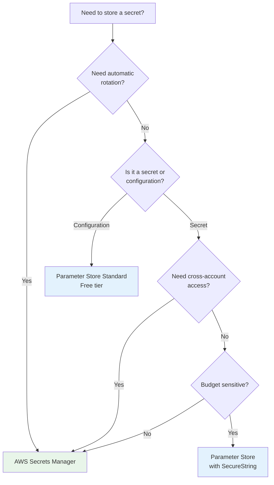
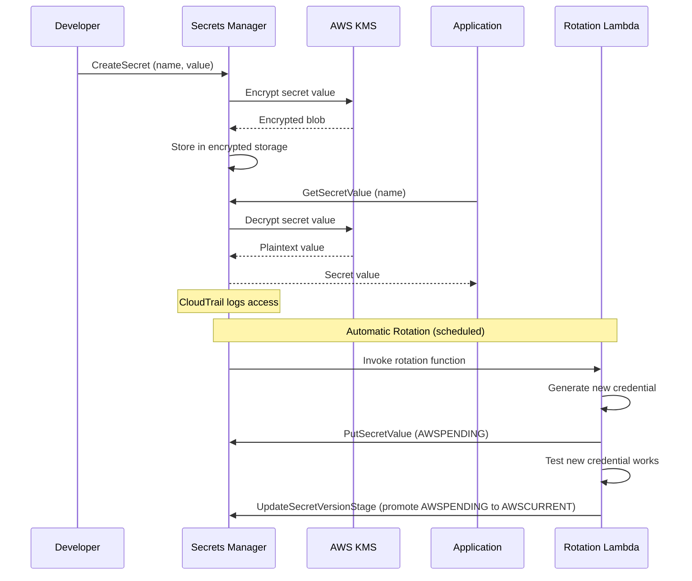
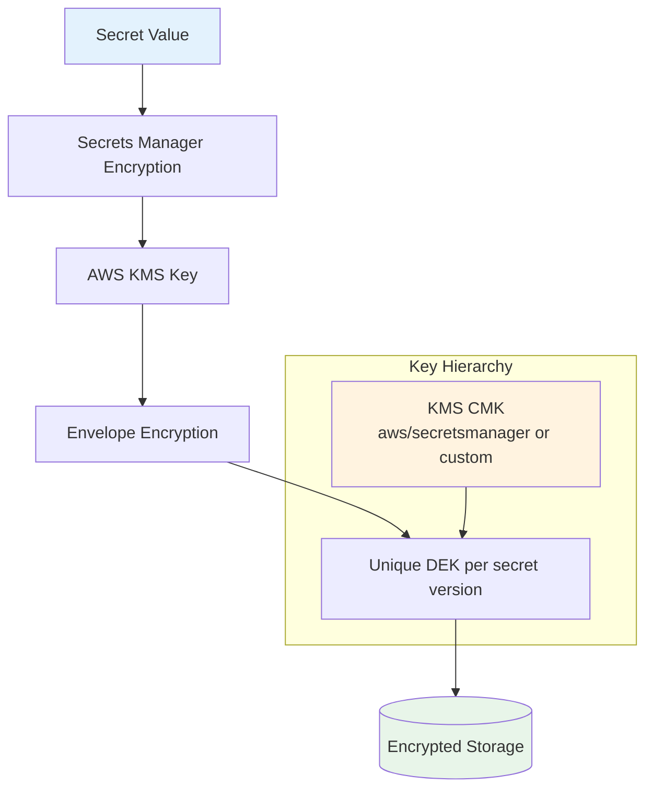
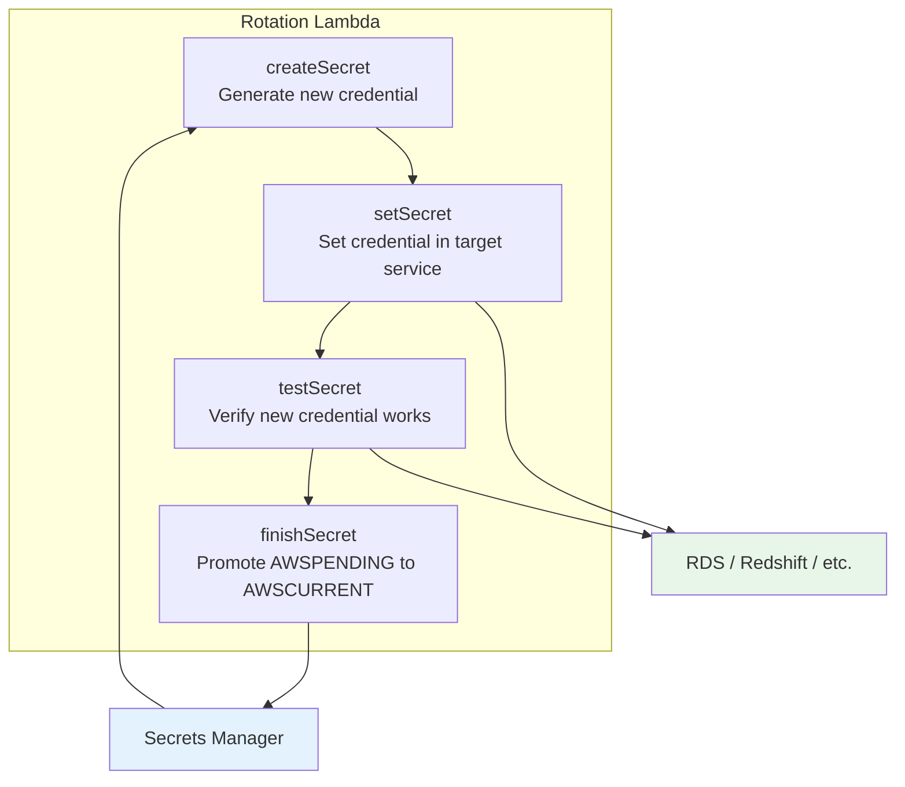

# AWS Secrets Manager

## Why AWS Secrets Manager Exists

AWS Secrets Manager is a fully managed service for storing, rotating, and retrieving secrets. It exists because managing secrets in AWS was historically fragmented — credentials scattered across EC2 user data, S3 buckets, environment variables, and config files. Secrets Manager provides a centralized, encrypted, audited secrets store with built-in rotation support.

It answers the key question for AWS-native applications: "Where do I put my database password so that my application can retrieve it securely, it gets rotated automatically, and I have an audit trail of every access?"

### Secrets Manager vs Parameter Store

AWS offers two services for storing configuration and secrets. The choice between them is one of the most common architectural decisions:

| Feature | Secrets Manager | Parameter Store (Standard) | Parameter Store (Advanced) |
|---------|----------------|--------------------------|---------------------------|
| **Purpose** | Secrets with rotation | Config and secrets | Config and secrets |
| **Max size** | 64 KB | 4 KB | 8 KB |
| **Cost** | $0.40/secret/month + $0.05/10K API calls | Free (up to 10K params) | $0.05/param/month |
| **Rotation** | Built-in Lambda rotation | Manual only | Manual only |
| **Cross-account sharing** | Resource policies | No | No |
| **Versioning** | Automatic with staging labels | Yes | Yes |
| **KMS encryption** | Default (AWS-managed or CMK) | Optional | Optional |
| **CloudFormation** | Dynamic reference | Dynamic reference | Dynamic reference |
| **Throughput** | 10K TPS | 40 TPS (standard), 1K (advanced) | 1K TPS |

### When to Use Which



## First Principles

### Secret Lifecycle in AWS



### Versioning and Staging Labels

Secrets Manager uses staging labels to manage secret versions during rotation:

| Label | Meaning | Usage |
|-------|---------|-------|
| `AWSCURRENT` | Active production version | Applications read this by default |
| `AWSPENDING` | New version being rotated | Created during rotation, promoted after testing |
| `AWSPREVIOUS` | Previous production version | Automatic fallback during rotation window |

This three-version system enables zero-downtime rotation.

## Core Mechanics

### Encryption Architecture



Each secret version is encrypted with a unique DEK, which is itself encrypted with the KMS CMK. This is standard envelope encryption, meaning key rotation at the KMS level doesn't require re-encrypting all secrets.

### Rotation Architecture



The four-step rotation protocol ensures atomicity:

1. **createSecret**: Generate a new credential value, store as `AWSPENDING`
2. **setSecret**: Apply the new credential to the target service (e.g., ALTER USER in RDS)
3. **testSecret**: Verify the new credential works (attempt a connection)
4. **finishSecret**: Promote `AWSPENDING` to `AWSCURRENT`, old becomes `AWSPREVIOUS`

## Implementation

### Terraform Infrastructure

```hcl
# Create a secret with automatic rotation
resource "aws_secretsmanager_secret" "db_credentials" {
  name                    = "production/database/primary"
  description             = "Primary database credentials"
  kms_key_id              = aws_kms_key.secrets_key.arn
  recovery_window_in_days = 30

  tags = {
    Environment = "production"
    ManagedBy   = "terraform"
    Service     = "user-service"
  }
}

resource "aws_secretsmanager_secret_version" "db_credentials" {
  secret_id = aws_secretsmanager_secret.db_credentials.id
  secret_string = jsonencode({
    username = "app_user"
    password = random_password.db_password.result
    engine   = "postgres"
    host     = aws_rds_cluster.main.endpoint
    port     = 5432
    dbname   = "production"
  })
}

resource "random_password" "db_password" {
  length  = 32
  special = true
}

# Configure automatic rotation
resource "aws_secretsmanager_secret_rotation" "db_credentials" {
  secret_id           = aws_secretsmanager_secret.db_credentials.id
  rotation_lambda_arn = aws_lambda_function.secret_rotation.arn

  rotation_rules {
    automatically_after_days = 30
    schedule_expression      = "rate(30 days)"
  }
}

# KMS key for secret encryption
resource "aws_kms_key" "secrets_key" {
  description             = "KMS key for Secrets Manager"
  deletion_window_in_days = 30
  enable_key_rotation     = true

  policy = jsonencode({
    Version = "2012-10-17"
    Statement = [
      {
        Sid    = "AllowSecretsManagerAccess"
        Effect = "Allow"
        Principal = {
          Service = "secretsmanager.amazonaws.com"
        }
        Action = [
          "kms:Encrypt",
          "kms:Decrypt",
          "kms:GenerateDataKey",
        ]
        Resource = "*"
      },
      {
        Sid    = "AllowKeyAdministration"
        Effect = "Allow"
        Principal = {
          AWS = "arn:aws:iam::${data.aws_caller_identity.current.account_id}:root"
        }
        Action   = "kms:*"
        Resource = "*"
      }
    ]
  })
}
```

### TypeScript SDK Integration

```typescript
import {
  SecretsManagerClient,
  GetSecretValueCommand,
  CreateSecretCommand,
  UpdateSecretCommand,
  RotateSecretCommand,
  DescribeSecretCommand,
} from '@aws-sdk/client-secrets-manager';

interface DatabaseSecret {
  username: string;
  password: string;
  engine: string;
  host: string;
  port: number;
  dbname: string;
}

class AWSSecretsService {
  private client: SecretsManagerClient;
  private cache: Map<string, { value: string; expiresAt: number }> = new Map();
  private cacheTTLMs: number;

  constructor(region: string, cacheTTLMs: number = 300_000) {
    this.client = new SecretsManagerClient({ region });
    this.cacheTTLMs = cacheTTLMs;
  }

  /**
   * Get a secret value with caching.
   */
  async getSecret(secretId: string): Promise<string> {
    const cached = this.cache.get(secretId);
    if (cached && cached.expiresAt > Date.now()) {
      return cached.value;
    }

    const response = await this.client.send(
      new GetSecretValueCommand({
        SecretId: secretId,
        VersionStage: 'AWSCURRENT',
      })
    );

    const value = response.SecretString!;
    this.cache.set(secretId, {
      value,
      expiresAt: Date.now() + this.cacheTTLMs,
    });

    return value;
  }

  /**
   * Get typed database credentials.
   */
  async getDatabaseCredentials(secretId: string): Promise<DatabaseSecret> {
    const raw = await this.getSecret(secretId);
    return JSON.parse(raw) as DatabaseSecret;
  }

  /**
   * Create a new secret.
   */
  async createSecret(
    name: string,
    value: string | Record<string, unknown>,
    kmsKeyId?: string
  ): Promise<string> {
    const secretString = typeof value === 'string' ? value : JSON.stringify(value);

    const response = await this.client.send(
      new CreateSecretCommand({
        Name: name,
        SecretString: secretString,
        KmsKeyId: kmsKeyId,
        Tags: [
          { Key: 'CreatedBy', Value: 'secrets-service' },
          { Key: 'CreatedAt', Value: new Date().toISOString() },
        ],
      })
    );

    return response.ARN!;
  }

  /**
   * Trigger immediate rotation.
   */
  async triggerRotation(secretId: string): Promise<void> {
    await this.client.send(
      new RotateSecretCommand({
        SecretId: secretId,
        RotateImmediately: true,
      })
    );

    // Invalidate cache
    this.cache.delete(secretId);
  }

  /**
   * Get secret with automatic retry on rotation (AWSCURRENT might be stale).
   */
  async getSecretWithRotationAwareness(secretId: string): Promise<string> {
    try {
      return await this.getSecret(secretId);
    } catch (error) {
      // If the secret was recently rotated, cache might be stale
      this.cache.delete(secretId);
      return this.getSecret(secretId);
    }
  }
}
```

### Rotation Lambda Function

```typescript
import {
  SecretsManagerClient,
  GetSecretValueCommand,
  PutSecretValueCommand,
  UpdateSecretVersionStageCommand,
  DescribeSecretCommand,
} from '@aws-sdk/client-secrets-manager';
import crypto from 'node:crypto';
import pg from 'pg';

const client = new SecretsManagerClient({});

interface RotationEvent {
  SecretId: string;
  ClientRequestToken: string;
  Step: 'createSecret' | 'setSecret' | 'testSecret' | 'finishSecret';
}

export async function handler(event: RotationEvent): Promise<void> {
  const { SecretId, ClientRequestToken, Step } = event;

  // Verify the secret exists and rotation is enabled
  const metadata = await client.send(
    new DescribeSecretCommand({ SecretId })
  );
  if (!metadata.RotationEnabled) {
    throw new Error('Rotation is not enabled for this secret');
  }

  switch (Step) {
    case 'createSecret':
      await createSecret(SecretId, ClientRequestToken);
      break;
    case 'setSecret':
      await setSecret(SecretId, ClientRequestToken);
      break;
    case 'testSecret':
      await testSecret(SecretId, ClientRequestToken);
      break;
    case 'finishSecret':
      await finishSecret(SecretId, ClientRequestToken);
      break;
    default:
      throw new Error(`Unknown step: ${Step}`);
  }
}

async function createSecret(secretId: string, token: string): Promise<void> {
  // Get the current secret
  const current = await client.send(
    new GetSecretValueCommand({
      SecretId: secretId,
      VersionStage: 'AWSCURRENT',
    })
  );
  const currentSecret = JSON.parse(current.SecretString!);

  // Generate a new password
  const newPassword = crypto.randomBytes(24).toString('base64url');
  const newSecret = { ...currentSecret, password: newPassword };

  // Store as AWSPENDING
  await client.send(
    new PutSecretValueCommand({
      SecretId: secretId,
      ClientRequestToken: token,
      SecretString: JSON.stringify(newSecret),
      VersionStages: ['AWSPENDING'],
    })
  );
}

async function setSecret(secretId: string, token: string): Promise<void> {
  // Get the pending secret
  const pending = await client.send(
    new GetSecretValueCommand({
      SecretId: secretId,
      VersionStage: 'AWSPENDING',
      VersionId: token,
    })
  );
  const secret = JSON.parse(pending.SecretString!);

  // Get the current (admin) credentials to alter the user
  const current = await client.send(
    new GetSecretValueCommand({
      SecretId: secretId,
      VersionStage: 'AWSCURRENT',
    })
  );
  const adminSecret = JSON.parse(current.SecretString!);

  // Connect to database and change the password
  const pool = new pg.Pool({
    host: adminSecret.host,
    port: adminSecret.port,
    database: adminSecret.dbname,
    user: adminSecret.username,
    password: adminSecret.password,
    ssl: { rejectUnauthorized: true },
  });

  try {
    await pool.query(
      `ALTER USER ${pg.escapeIdentifier(secret.username)} WITH PASSWORD $1`,
      [secret.password]
    );
  } finally {
    await pool.end();
  }
}

async function testSecret(secretId: string, token: string): Promise<void> {
  // Get the pending secret
  const pending = await client.send(
    new GetSecretValueCommand({
      SecretId: secretId,
      VersionStage: 'AWSPENDING',
      VersionId: token,
    })
  );
  const secret = JSON.parse(pending.SecretString!);

  // Test the new credentials by connecting to the database
  const pool = new pg.Pool({
    host: secret.host,
    port: secret.port,
    database: secret.dbname,
    user: secret.username,
    password: secret.password,
    ssl: { rejectUnauthorized: true },
  });

  try {
    const result = await pool.query('SELECT 1 as test');
    if (result.rows[0].test !== 1) {
      throw new Error('Test query returned unexpected result');
    }
  } finally {
    await pool.end();
  }
}

async function finishSecret(secretId: string, token: string): Promise<void> {
  // Get current version
  const metadata = await client.send(
    new DescribeSecretCommand({ SecretId: secretId })
  );

  let currentVersionId: string | undefined;
  for (const [versionId, stages] of Object.entries(metadata.VersionIdsToStages ?? {})) {
    if (stages.includes('AWSCURRENT') && versionId !== token) {
      currentVersionId = versionId;
      break;
    }
  }

  // Promote AWSPENDING to AWSCURRENT
  await client.send(
    new UpdateSecretVersionStageCommand({
      SecretId: secretId,
      VersionStage: 'AWSCURRENT',
      MoveToVersionId: token,
      RemoveFromVersionId: currentVersionId,
    })
  );
}
```

## Edge Cases & Failure Modes

### Rotation Failures

| Failure Point | Impact | Auto-Recovery |
|--------------|--------|---------------|
| createSecret fails | No change, old secret still works | Retry on next schedule |
| setSecret fails | Pending version exists but not applied | Old secret still works |
| testSecret fails | New credential doesn't work | Old secret still works, pending not promoted |
| finishSecret fails | New credential works but not promoted | Manual intervention needed |

::: warning
**Multi-user rotation**: If your application uses a single database user, changing the password affects all instances. Use the "alternating users" strategy — two users that alternate, so one is always active while the other rotates.
:::

### Rate Limiting and Throttling

| API | Standard limit | Burst | Cost |
|-----|---------------|-------|------|
| GetSecretValue | 10,000 TPS | 10,000 | $0.05/10K |
| PutSecretValue | 50 TPS | 50 | $0.05/10K |
| CreateSecret | 50 TPS | 50 | $0.05/10K |
| DescribeSecret | 100 TPS | 100 | $0.05/10K |

For high-throughput applications, implement caching and use the Secrets Manager client-side caching library.

## Performance Characteristics

### Cost Optimization Strategies

| Strategy | API Calls/Month | Monthly Cost |
|----------|----------------|-------------|
| Every request (no cache) | 10,000,000 | $50.00 + $0.40/secret |
| 5-minute cache | ~8,640 | $0.04 + $0.40/secret |
| Startup + rotation event | ~2 | $0.00 + $0.40/secret |
| Parameter Store (standard) | 10,000,000 | Free (up to 10K params) |

## Real-World War Stories

::: info War Story
**The RDS Rotation That Took Down Production**

A company configured automatic rotation for their RDS master password. The rotation Lambda updated the password in RDS, but the application's connection pool held connections with the old password. When the pool recycled connections, new connections failed because they used the cached (old) password from the secret cache.

The 5-minute cache TTL meant the application was down for up to 5 minutes after each rotation.

**Resolution**: They implemented a rotation event notification (via SNS) that triggered an immediate cache invalidation and connection pool refresh across all application instances. They also switched to the "alternating users" rotation strategy where two DB users alternate.
:::

::: info War Story
**Cross-Account Secret Sharing Gone Wrong**

A company shared a Secrets Manager secret from their production account to a development account using a resource policy. A developer in the dev account used the production secret by mistake, causing test data to be written to the production database.

**Resolution**: They implemented strict naming conventions (prefixing secrets with account alias), added IAM condition keys to restrict access by source account, and set up CloudTrail alerts for cross-account secret access.
:::

## Decision Framework

### Parameter Store vs Secrets Manager

| If you need... | Use... |
|----------------|--------|
| Automatic credential rotation | Secrets Manager |
| Cross-account secret sharing | Secrets Manager |
| Free secret storage (< 10K) | Parameter Store (Standard) |
| Configuration values (non-secret) | Parameter Store |
| Hierarchical config (paths) | Parameter Store |
| Lambda function secrets | Secrets Manager (with caching extension) |
| ECS task secrets | Either (Secrets Manager for rotation) |

## Advanced Topics

### Secrets Manager Caching Extension for Lambda

```typescript
import { SecretsManagerClient, GetSecretValueCommand } from '@aws-sdk/client-secrets-manager';

// Singleton client and cache (persists across Lambda invocations)
const client = new SecretsManagerClient({});
const secretCache = new Map<string, { value: string; fetchedAt: number }>();
const CACHE_TTL = 300_000; // 5 minutes

async function getCachedSecret(secretId: string): Promise<string> {
  const cached = secretCache.get(secretId);
  if (cached && Date.now() - cached.fetchedAt < CACHE_TTL) {
    return cached.value;
  }

  const response = await client.send(
    new GetSecretValueCommand({ SecretId: secretId })
  );

  const value = response.SecretString!;
  secretCache.set(secretId, { value, fetchedAt: Date.now() });
  return value;
}

export async function handler(event: any) {
  const dbSecret = await getCachedSecret('production/database/primary');
  const creds = JSON.parse(dbSecret);
  // Use creds to connect to database
}
```

### Multi-Region Secret Replication

```hcl
resource "aws_secretsmanager_secret" "multi_region" {
  name = "global/api-key"

  replica {
    region = "eu-west-1"
  }
  replica {
    region = "ap-southeast-1"
  }
}
```

## Cross-References

- [Secrets Management Overview](/security/secrets-management/) — Comparison of approaches
- [Vault Deep Dive](/security/secrets-management/vault-deep-dive) — HashiCorp Vault alternative
- [Rotation Automation](/security/secrets-management/rotation-automation) — Rotation patterns
- [Key Management](/security/encryption/key-management) — KMS key management
- [Envelope Encryption](/security/encryption/envelope-encryption) — How Secrets Manager encrypts
- [Secrets in CI/CD](/security/secrets-management/secrets-in-ci-cd) — Using secrets in pipelines
