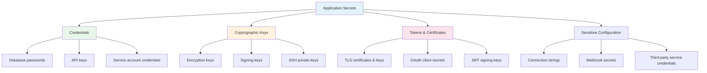
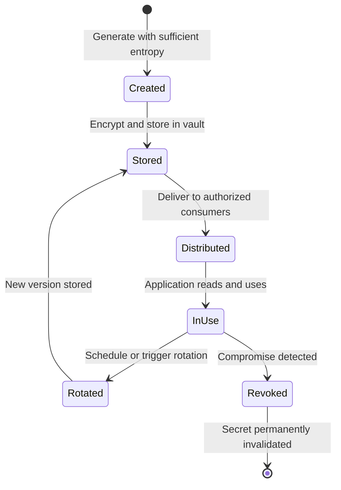
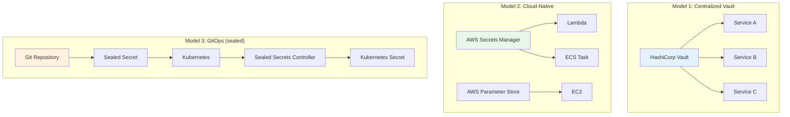

# Secrets Management Overview

## Why Secrets Management Exists

Every application has secrets — database passwords, API keys, TLS certificates, encryption keys, OAuth client secrets, and service account credentials. These secrets are the keys to the kingdom: anyone who obtains them can impersonate services, access databases, and exfiltrate data.

Secrets management is the discipline of securely generating, storing, distributing, rotating, and auditing access to these credentials. Without it, secrets inevitably end up in environment variables on shared servers, committed to git repositories, hardcoded in application code, or shared via Slack and email.

### The Scope of the Problem

In a typical microservices architecture with 50 services:

$$
\text{Total secrets} \approx 50_{\text{services}} \times 5_{\text{secrets/service}} = 250 \text{ secrets}
$$

Each secret needs:
- Secure storage (encrypted at rest)
- Access control (who/what can read it)
- Rotation capability (change without downtime)
- Audit trail (who accessed it when)
- Lifecycle management (creation, rotation, revocation)

Multiply by 3 environments (dev, staging, prod) = **750 secret-environment combinations** to manage.

### Historical Context

| Era | Approach | Problems |
|-----|----------|----------|
| 2000s | Hardcoded in source | Leaked in git, cannot rotate |
| 2005s | Config files on servers | Manual management, inconsistent |
| 2010s | Environment variables | Visible in process lists, logs |
| 2012 | Chef/Puppet encrypted data bags | Complex, vendor-locked |
| 2015 | HashiCorp Vault, AWS Secrets Manager | Purpose-built, dynamic secrets |
| 2018 | Kubernetes Secrets | Base64-only, needs external KMS |
| 2020s | External Secrets Operator, sealed-secrets | GitOps-compatible secrets |

## First Principles

### What Constitutes a Secret?



### The Secret Lifecycle

$$
\text{Create} \rightarrow \text{Store} \rightarrow \text{Distribute} \rightarrow \text{Use} \rightarrow \text{Rotate} \rightarrow \text{Revoke}
$$



### The Five Pillars of Secrets Management

| Pillar | Question | Solution |
|--------|----------|----------|
| **Storage** | Where are secrets stored? | Encrypted vault, never in code |
| **Access control** | Who can read each secret? | Least-privilege policies |
| **Distribution** | How do apps get secrets? | API, sidecar, env injection |
| **Rotation** | How often are secrets changed? | Automated, zero-downtime |
| **Auditing** | Who accessed what, when? | Comprehensive audit logs |

## Core Mechanics

### Secret Storage Models



### Secret Distribution Patterns

| Pattern | How It Works | Pros | Cons |
|---------|-------------|------|------|
| **Pull** | App fetches secret from vault at startup | Simple, app controls timing | Vault must be available at startup |
| **Push (sidecar)** | Sidecar container fetches and injects | App doesn't know about vault | Added complexity, resource usage |
| **Environment injection** | Orchestrator injects at deploy time | Simple for apps | Visible in process list, no rotation |
| **Mounted volume** | Secrets written to in-memory tmpfs | Files auto-update on rotation | Filesystem access control needed |
| **SDK** | App uses vault client library | Dynamic secrets, full control | SDK dependency, connection management |

### Dynamic vs Static Secrets

**Static secrets** are created once and used until rotated:
- Database passwords
- API keys
- TLS certificates

**Dynamic secrets** are generated on-demand with automatic expiration:
- Short-lived database credentials
- AWS STS temporary credentials
- Consul tokens
- PKI certificates

Dynamic secrets are inherently more secure because they:
1. Are unique to each consumer
2. Automatically expire
3. Leave an audit trail tied to a specific identity
4. Cannot be shared or reused

## Implementation

### Secret Management Abstraction Layer

```typescript
interface Secret {
  key: string;
  value: string;
  version: number;
  createdAt: Date;
  expiresAt: Date | null;
  metadata: Record<string, string>;
}

interface SecretProvider {
  getSecret(key: string, version?: number): Promise<Secret>;
  setSecret(key: string, value: string, metadata?: Record<string, string>): Promise<Secret>;
  deleteSecret(key: string): Promise<void>;
  listSecrets(prefix?: string): Promise<string[]>;
  rotateSecret(key: string, newValue: string): Promise<Secret>;
}

/**
 * Multi-provider secret manager with caching, failover, and audit logging.
 */
class SecretManager {
  private providers: SecretProvider[];
  private cache: Map<string, { secret: Secret; expiresAt: number }> = new Map();
  private cacheTTLMs: number;

  constructor(providers: SecretProvider[], cacheTTLMs: number = 300_000) {
    this.providers = providers;
    this.cacheTTLMs = cacheTTLMs;
  }

  async getSecret(key: string): Promise<string> {
    // Check cache
    const cached = this.cache.get(key);
    if (cached && cached.expiresAt > Date.now()) {
      return cached.secret.value;
    }

    // Try providers in order (primary, fallback)
    for (const provider of this.providers) {
      try {
        const secret = await provider.getSecret(key);

        // Cache the result
        this.cache.set(key, {
          secret,
          expiresAt: Date.now() + this.cacheTTLMs,
        });

        this.auditLog('secret_accessed', key, secret.version);
        return secret.value;
      } catch (error) {
        console.warn(`Provider failed for ${key}:`, error);
        continue;
      }
    }

    throw new Error(`Secret not found in any provider: ${key}`);
  }

  async rotateSecret(key: string, generateNewValue: () => string): Promise<void> {
    const newValue = generateNewValue();
    const provider = this.providers[0]; // Primary provider

    await provider.rotateSecret(key, newValue);

    // Invalidate cache
    this.cache.delete(key);

    this.auditLog('secret_rotated', key);
  }

  private auditLog(action: string, key: string, version?: number): void {
    console.log(JSON.stringify({
      timestamp: new Date().toISOString(),
      action,
      secretKey: key,
      version,
      // Never log the secret value!
    }));
  }
}
```

### Environment-Based Configuration with Validation

```typescript
import { z } from 'zod';

const SecretsSchema = z.object({
  DATABASE_URL: z.string().url().startsWith('postgresql://'),
  REDIS_URL: z.string().url().startsWith('redis://'),
  JWT_SECRET: z.string().min(32, 'JWT secret must be at least 32 characters'),
  STRIPE_SECRET_KEY: z.string().startsWith('sk_'),
  AWS_ACCESS_KEY_ID: z.string().regex(/^AKIA[A-Z0-9]{16}$/),
  AWS_SECRET_ACCESS_KEY: z.string().min(40),
  ENCRYPTION_KEY: z.string().length(64, 'Must be 32 bytes hex-encoded'),
  SMTP_PASSWORD: z.string().min(1),
});

type Secrets = z.infer<typeof SecretsSchema>;

function loadAndValidateSecrets(): Secrets {
  const result = SecretsSchema.safeParse(process.env);

  if (!result.success) {
    const missing = result.error.issues.map(
      (issue) => `  ${issue.path.join('.')}: ${issue.message}`
    );
    console.error('Missing or invalid secrets:');
    console.error(missing.join('\n'));
    process.exit(1);
  }

  return result.data;
}

const secrets = loadAndValidateSecrets();
```

### Git Pre-Commit Hook for Secret Detection

```typescript
#!/usr/bin/env node
// .git/hooks/pre-commit or via husky

import { execSync } from 'node:child_process';

const SECRET_PATTERNS = [
  { name: 'AWS Access Key', pattern: /AKIA[0-9A-Z]{16}/ },
  { name: 'AWS Secret Key', pattern: /[0-9a-zA-Z/+=]{40}/ },
  { name: 'Private Key', pattern: /-----BEGIN (RSA |EC |OPENSSH )?PRIVATE KEY-----/ },
  { name: 'Generic Secret', pattern: /(?:password|secret|token|apikey)\s*[:=]\s*['"][^'"]{8,}/i },
  { name: 'Stripe Key', pattern: /sk_(live|test)_[0-9a-zA-Z]{24,}/ },
  { name: 'GitHub Token', pattern: /ghp_[0-9a-zA-Z]{36}/ },
  { name: 'Slack Token', pattern: /xox[baprs]-[0-9a-zA-Z-]+/ },
  { name: 'JWT', pattern: /eyJ[A-Za-z0-9-_]+\.eyJ[A-Za-z0-9-_]+/ },
];

function checkStagedFiles(): { file: string; line: number; pattern: string }[] {
  const diff = execSync('git diff --cached --unified=0', { encoding: 'utf-8' });
  const findings: { file: string; line: number; pattern: string }[] = [];
  let currentFile = '';
  let currentLine = 0;

  for (const line of diff.split('\n')) {
    if (line.startsWith('diff --git')) {
      currentFile = line.split(' b/')[1] ?? '';
    }
    if (line.startsWith('@@')) {
      const match = line.match(/@@ -\d+(?:,\d+)? \+(\d+)/);
      currentLine = match ? parseInt(match[1], 10) : 0;
    }
    if (line.startsWith('+') && !line.startsWith('+++')) {
      for (const { name, pattern } of SECRET_PATTERNS) {
        if (pattern.test(line)) {
          findings.push({ file: currentFile, line: currentLine, pattern: name });
        }
      }
      currentLine++;
    }
  }

  return findings;
}

const findings = checkStagedFiles();
if (findings.length > 0) {
  console.error('Potential secrets detected in staged files:');
  for (const f of findings) {
    console.error(`  ${f.file}:${f.line} — ${f.pattern}`);
  }
  console.error('\nIf these are not secrets, use: git commit --no-verify');
  process.exit(1);
}
```

## Edge Cases & Failure Modes

### Common Secret Leakage Vectors

| Vector | Likelihood | Impact | Prevention |
|--------|-----------|--------|------------|
| Git commit | Very High | Critical | Pre-commit hooks, scanning |
| Environment variables in logs | High | High | Log sanitization |
| Error messages | Medium | Medium | Custom error handlers |
| Docker image layers | Medium | High | Multi-stage builds, .dockerignore |
| CI/CD logs | High | High | Mask outputs, use native secrets |
| Crash dumps / core dumps | Low | High | Disable core dumps in prod |
| Process listing (ps aux) | Medium | Medium | Use files/APIs instead of env vars |

### Secret Sprawl

As organizations grow, secrets multiply uncontrollably:

$$
\text{Secret sprawl} = \text{services} \times \text{environments} \times \text{secret types} \times \text{age factor}
$$

Signs of secret sprawl:
- Nobody knows where all secrets are stored
- Secrets haven't been rotated in years
- Multiple copies of the same secret in different locations
- Decommissioned services still have active credentials

## Performance Characteristics

### Secret Retrieval Latency

| Source | p50 Latency | p99 Latency | Availability |
|--------|------------|-------------|-------------|
| In-memory cache | 0.001ms | 0.01ms | Application uptime |
| HashiCorp Vault (local) | 1ms | 5ms | Vault cluster |
| AWS Secrets Manager | 10ms | 50ms | 99.99% SLA |
| AWS Parameter Store | 5ms | 30ms | 99.99% SLA |
| Kubernetes Secret (mounted) | 0.1ms | 0.5ms | Node uptime |
| Kubernetes Secret (API) | 2ms | 10ms | API server |

### Cost Comparison

| Service | Storage Cost | API Call Cost | Free Tier |
|---------|-------------|-------------|-----------|
| AWS Secrets Manager | $0.40/secret/month | $0.05/10K calls | None |
| AWS Parameter Store | Free (standard) | Free (standard) | 10K params |
| GCP Secret Manager | $0.06/version/month | $0.03/10K calls | 6 versions |
| HashiCorp Vault (HCP) | From $0.03/hr | Included | Dev tier |
| HashiCorp Vault (self-hosted) | Infrastructure cost | N/A | Unlimited |

## Mathematical Foundations

### Secret Entropy Requirements

A secret must have sufficient entropy to resist brute-force attacks:

$$
H_{\text{min}} = \log_2(\text{keyspace}) \geq \lambda
$$

For a random 32-character alphanumeric secret:

$$
H = 32 \times \log_2(62) \approx 32 \times 5.95 = 190.4 \text{ bits}
$$

This is well above the 128-bit security threshold.

### Rotation Interval Optimization

The optimal rotation interval balances security (shorter is better) against operational risk (each rotation is a potential outage):

$$
T_{\text{optimal}} = \min(T_{\text{compliance}}, T_{\text{detection}}, T_{\text{useful\_life}})
$$

where:
- $T_{\text{compliance}}$ = regulatory requirement (e.g., 90 days for PCI DSS)
- $T_{\text{detection}}$ = mean time to detect compromise
- $T_{\text{useful\_life}}$ = how long the secret remains valuable to an attacker

## Real-World War Stories

::: info War Story
**The Uber 2022 Breach — Hardcoded Secrets in PowerShell Scripts**

An attacker gained access to Uber's internal systems through social engineering. Once inside, they found a PowerShell script on a network share containing admin credentials for Uber's Thycotic privileged access management system. This gave them access to DA (domain admin) credentials, AWS, GCP, and internal dashboards.

The root cause: hardcoded credentials in a shared script. Even with a secrets management system in place (Thycotic), one forgotten script with embedded credentials provided a backdoor around all security controls.

**Lesson**: Secrets management tools only work if ALL secrets go through them. A single hardcoded credential can bypass the entire security infrastructure.
:::

::: info War Story
**Codecov Supply Chain Attack (2021)**

Attackers modified Codecov's Bash Uploader script to exfiltrate environment variables from CI/CD pipelines. This captured credentials, API tokens, and secrets from thousands of Codecov customers including Twitch, HashiCorp, and other major companies.

The attack exploited the common practice of setting secrets as environment variables in CI/CD — making them available to any process in the pipeline, including compromised tools.

**Lesson**: CI/CD secrets should be injected at the last possible moment, scoped to the minimum required, and preferably accessed via API rather than environment variables.
:::

## Decision Framework

### Choosing a Secrets Management Solution

| Factor | Vault | AWS Secrets Manager | K8s Secrets + ESO |
|--------|-------|--------------------|--------------------|
| Dynamic secrets | Yes | No | No |
| Multi-cloud | Yes | AWS only | Cloud-agnostic |
| Operational burden | High | Low | Medium |
| Cost at scale | Infrastructure | Per-secret billing | Free (infra cost) |
| Audit logging | Built-in | CloudTrail | API audit logs |
| Encryption | Transit engine | KMS | etcd encryption |
| Best for | Enterprise, multi-cloud | AWS-native | Kubernetes-native |

## Section Index

| Page | Topic |
|------|-------|
| [Vault Deep Dive](/security/secrets-management/vault-deep-dive) | HashiCorp Vault architecture, dynamic secrets, policies |
| [AWS Secrets Manager](/security/secrets-management/aws-secrets-manager) | Secrets Manager vs Parameter Store, Lambda rotation |
| [Rotation Automation](/security/secrets-management/rotation-automation) | Zero-downtime rotation strategies and patterns |
| [Secrets in CI/CD](/security/secrets-management/secrets-in-ci-cd) | GitHub Actions secrets, sealed-secrets, OIDC |

## Cross-References

- [Key Management](/security/encryption/key-management) — Managing encryption keys
- [Envelope Encryption](/security/encryption/envelope-encryption) — Key wrapping patterns
- [API Key Design](/security/authentication/api-key-design) — API key lifecycle
- [Zero Trust Principles](/security/zero-trust/principles) — Secrets in zero-trust
- [Secrets in CI/CD](/security/secrets-management/secrets-in-ci-cd) — Pipeline secrets
