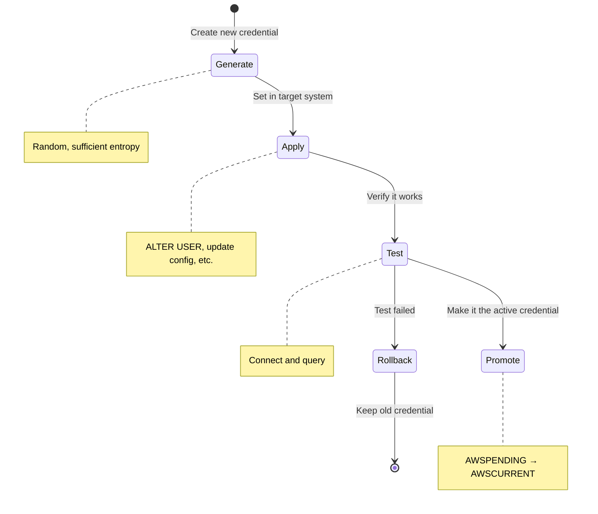
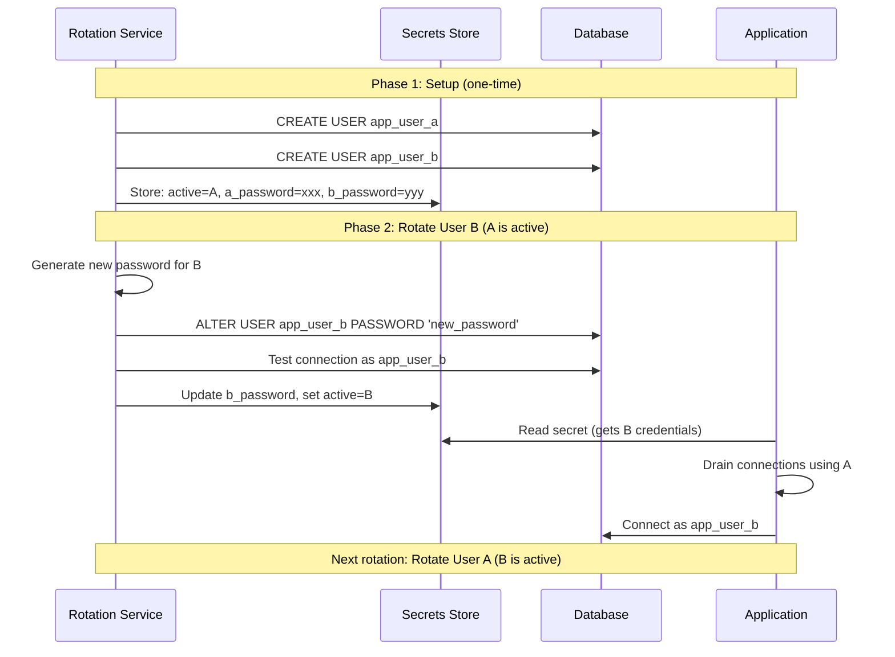
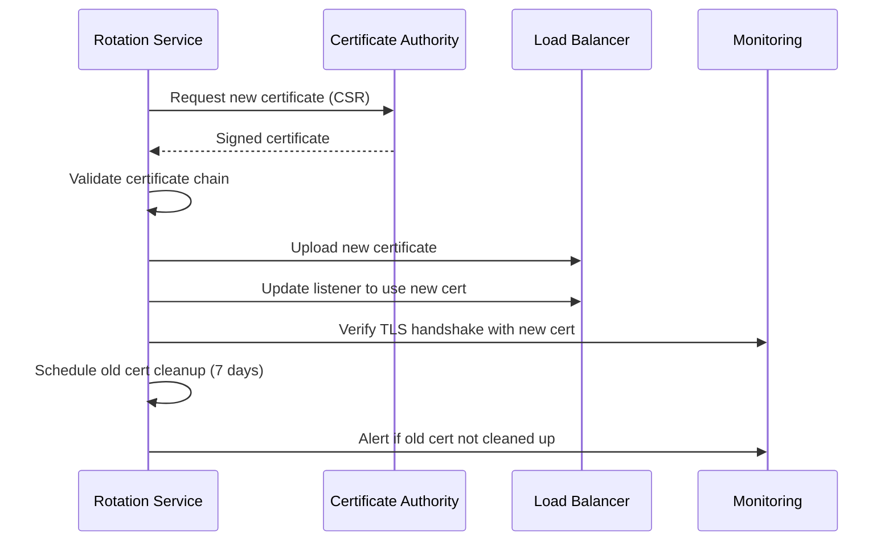

# Secret Rotation Automation

## Why Rotation Automation Exists

Secrets are most dangerous when they are static. A leaked API key that is valid indefinitely gives an attacker unlimited time to exploit it. A database password that never changes means a breach discovered months later has been active the entire time. Rotation limits the blast radius of any compromise by ensuring that even leaked credentials have a limited useful lifetime.

Manual rotation is error-prone and dreaded by operations teams. Automated rotation makes the process reliable, auditable, and invisible to developers. The goal is to make rotation so seamless that it can happen daily without anyone noticing.

### The Rotation Paradox

$$
\text{Rotation frequency} \propto \frac{1}{\text{blast radius}} \propto \frac{1}{\text{risk}}
$$

More frequent rotation = smaller window of vulnerability. But more frequent rotation = more chances for something to go wrong. Automation resolves this paradox by making rotation reliable enough to happen frequently.

## First Principles

### Rotation Strategies

```mermaid
graph TB
    subgraph "Strategy 1: Single User"
        S1[Change password in-place]
        S1 --> S1A[Brief window where old password invalid]
        S1A --> S1B[All connections must reconnect]
    end

    subgraph "Strategy 2: Dual User (Alternating)"
        S2A[User A: active, User B: standby]
        S2A --> S2B[Rotate: Change User B password]
        S2B --> S2C[Switch traffic to User B]
        S2C --> S2D[User A becomes standby]
    end

    subgraph "Strategy 3: Create/Drop"
        S3A[Create new user with new credentials]
        S3A --> S3B[Switch traffic to new user]
        S3B --> S3C[Drop old user after drain period]
    end

    style S1A fill:#ffebee
    style S2A fill:#e8f5e9
    style S3A fill:#e3f2fd
```



| Strategy | Downtime | Complexity | Use Case |
|----------|----------|------------|----------|
| Single User | Brief (ms–seconds) | Low | Simple apps, tolerant of reconnects |
| Dual User | Zero | Medium | Production databases, always-on services |
| Create/Drop | Zero | High | Dynamic secrets, Vault database engine |

### The Four-Phase Rotation Protocol

Every rotation, regardless of the secret type, follows four phases:

$$
\text{Generate} \rightarrow \text{Apply} \rightarrow \text{Test} \rightarrow \text{Promote}
$$



## Core Mechanics

### Database Credential Rotation (Dual-User Strategy)



### Certificate Rotation



## Implementation

### Generic Rotation Framework (TypeScript)

```typescript
interface RotationStep<T> {
  name: string;
  execute: (context: T) => Promise<T>;
  rollback?: (context: T) => Promise<void>;
  timeout: number;
}

interface RotationResult<T> {
  success: boolean;
  context: T;
  completedSteps: string[];
  failedStep?: string;
  error?: Error;
  duration: number;
}

class RotationEngine<T> {
  private steps: RotationStep<T>[] = [];

  addStep(step: RotationStep<T>): this {
    this.steps.push(step);
    return this;
  }

  async execute(initialContext: T): Promise<RotationResult<T>> {
    const start = Date.now();
    let context = initialContext;
    const completedSteps: string[] = [];

    for (const step of this.steps) {
      try {
        const timeoutPromise = new Promise<never>((_, reject) =>
          setTimeout(() => reject(new Error(`Step "${step.name}" timed out after ${step.timeout}ms`)), step.timeout)
        );

        context = await Promise.race([
          step.execute(context),
          timeoutPromise,
        ]);
        completedSteps.push(step.name);
      } catch (error) {
        // Attempt rollback of completed steps in reverse order
        console.error(`Rotation failed at step "${step.name}":`, error);

        for (const completedStep of [...completedSteps].reverse()) {
          const stepDef = this.steps.find((s) => s.name === completedStep);
          if (stepDef?.rollback) {
            try {
              await stepDef.rollback(context);
              console.log(`Rolled back step: ${completedStep}`);
            } catch (rollbackError) {
              console.error(`Rollback failed for ${completedStep}:`, rollbackError);
            }
          }
        }

        return {
          success: false,
          context,
          completedSteps,
          failedStep: step.name,
          error: error as Error,
          duration: Date.now() - start,
        };
      }
    }

    return {
      success: true,
      context,
      completedSteps,
      duration: Date.now() - start,
    };
  }
}
```

### Database Credential Rotation

```typescript
import crypto from 'node:crypto';
import pg from 'pg';

interface DBRotationContext {
  secretId: string;
  host: string;
  port: number;
  database: string;
  activeUser: 'a' | 'b';
  userA: string;
  userB: string;
  passwordA: string;
  passwordB: string;
  newPassword?: string;
}

function createDBRotation(): RotationEngine<DBRotationContext> {
  const engine = new RotationEngine<DBRotationContext>();

  engine.addStep({
    name: 'generatePassword',
    timeout: 5000,
    execute: async (ctx) => {
      ctx.newPassword = crypto.randomBytes(24).toString('base64url');
      return ctx;
    },
  });

  engine.addStep({
    name: 'updateDatabasePassword',
    timeout: 30000,
    execute: async (ctx) => {
      const activeUser = ctx.activeUser === 'a' ? ctx.userA : ctx.userB;
      const activePassword = ctx.activeUser === 'a' ? ctx.passwordA : ctx.passwordB;
      const standbyUser = ctx.activeUser === 'a' ? ctx.userB : ctx.userA;

      const pool = new pg.Pool({
        host: ctx.host,
        port: ctx.port,
        database: ctx.database,
        user: activeUser,
        password: activePassword,
        ssl: { rejectUnauthorized: true },
      });

      try {
        await pool.query(
          `ALTER USER ${pg.escapeIdentifier(standbyUser)} WITH PASSWORD $1`,
          [ctx.newPassword]
        );
      } finally {
        await pool.end();
      }

      return ctx;
    },
    rollback: async (ctx) => {
      console.log('Database password change cannot be easily rolled back, old password still works for active user');
    },
  });

  engine.addStep({
    name: 'testNewCredentials',
    timeout: 15000,
    execute: async (ctx) => {
      const standbyUser = ctx.activeUser === 'a' ? ctx.userB : ctx.userA;

      const pool = new pg.Pool({
        host: ctx.host,
        port: ctx.port,
        database: ctx.database,
        user: standbyUser,
        password: ctx.newPassword!,
        ssl: { rejectUnauthorized: true },
      });

      try {
        const result = await pool.query('SELECT current_user, now()');
        if (result.rows[0].current_user !== standbyUser) {
          throw new Error('Connected as wrong user');
        }
      } finally {
        await pool.end();
      }

      return ctx;
    },
  });

  engine.addStep({
    name: 'updateSecretStore',
    timeout: 10000,
    execute: async (ctx) => {
      const newActiveUser = ctx.activeUser === 'a' ? 'b' : 'a';

      if (newActiveUser === 'a') {
        ctx.passwordA = ctx.newPassword!;
      } else {
        ctx.passwordB = ctx.newPassword!;
      }
      ctx.activeUser = newActiveUser;

      // Update in secrets manager
      // await secretsManager.updateSecret(ctx.secretId, ctx);

      return ctx;
    },
  });

  return engine;
}

// Usage
async function rotateDBCredentials() {
  const engine = createDBRotation();
  const result = await engine.execute({
    secretId: 'production/database/primary',
    host: 'db.example.com',
    port: 5432,
    database: 'production',
    activeUser: 'a',
    userA: 'app_user_a',
    userB: 'app_user_b',
    passwordA: 'current_password_a',
    passwordB: 'current_password_b',
  });

  if (result.success) {
    console.log(`Rotation completed in ${result.duration}ms`);
  } else {
    console.error(`Rotation failed at ${result.failedStep}: ${result.error?.message}`);
  }
}
```

### API Key Rotation with Grace Period

```typescript
interface APIKeyRotationContext {
  serviceName: string;
  currentKey: string;
  newKey?: string;
  gracePeriodMs: number;
}

function createAPIKeyRotation(): RotationEngine<APIKeyRotationContext> {
  const engine = new RotationEngine<APIKeyRotationContext>();

  engine.addStep({
    name: 'generateNewKey',
    timeout: 5000,
    execute: async (ctx) => {
      const bytes = crypto.randomBytes(32);
      ctx.newKey = `sk_live_${bytes.toString('base64url')}`;
      return ctx;
    },
  });

  engine.addStep({
    name: 'registerNewKeyWithProvider',
    timeout: 30000,
    execute: async (ctx) => {
      // Register the new key with the third-party service
      // Both old and new keys are now valid
      await registerAPIKey(ctx.serviceName, ctx.newKey!);
      return ctx;
    },
  });

  engine.addStep({
    name: 'updateApplicationConfig',
    timeout: 15000,
    execute: async (ctx) => {
      // Update the secret store with the new key
      // Application will start using the new key on next read
      await updateSecretStore(`${ctx.serviceName}/api-key`, ctx.newKey!);
      return ctx;
    },
  });

  engine.addStep({
    name: 'waitForGracePeriod',
    timeout: ctx => ctx.gracePeriodMs + 5000,
    execute: async (ctx) => {
      // Wait for grace period to ensure all instances have the new key
      await new Promise((resolve) => setTimeout(resolve, ctx.gracePeriodMs));
      return ctx;
    },
  });

  engine.addStep({
    name: 'revokeOldKey',
    timeout: 15000,
    execute: async (ctx) => {
      await revokeAPIKey(ctx.serviceName, ctx.currentKey);
      return ctx;
    },
  });

  return engine;
}
```

### Cron-Based Rotation Scheduler

```typescript
import cron from 'node-cron';

interface RotationSchedule {
  secretId: string;
  cronExpression: string;
  rotationType: 'database' | 'api-key' | 'certificate' | 'encryption-key';
  config: Record<string, unknown>;
  lastRotated?: Date;
  nextRotation?: Date;
}

class RotationScheduler {
  private schedules: Map<string, cron.ScheduledTask> = new Map();
  private auditLog: Array<{ timestamp: Date; secretId: string; result: string }> = [];

  registerRotation(schedule: RotationSchedule): void {
    const task = cron.schedule(schedule.cronExpression, async () => {
      console.log(`Starting rotation for ${schedule.secretId}`);

      try {
        await this.executeRotation(schedule);
        this.auditLog.push({
          timestamp: new Date(),
          secretId: schedule.secretId,
          result: 'success',
        });
      } catch (error) {
        this.auditLog.push({
          timestamp: new Date(),
          secretId: schedule.secretId,
          result: `failed: ${(error as Error).message}`,
        });
        // Alert on-call
        await this.alertOnFailure(schedule.secretId, error as Error);
      }
    });

    this.schedules.set(schedule.secretId, task);
  }

  private async executeRotation(schedule: RotationSchedule): Promise<void> {
    switch (schedule.rotationType) {
      case 'database':
        await this.rotateDatabaseCredentials(schedule);
        break;
      case 'api-key':
        await this.rotateAPIKey(schedule);
        break;
      case 'certificate':
        await this.rotateCertificate(schedule);
        break;
      case 'encryption-key':
        await this.rotateEncryptionKey(schedule);
        break;
    }
  }

  private async rotateDatabaseCredentials(schedule: RotationSchedule): Promise<void> {
    const engine = createDBRotation();
    const result = await engine.execute(schedule.config as any);
    if (!result.success) {
      throw new Error(`DB rotation failed at ${result.failedStep}: ${result.error?.message}`);
    }
  }

  private async rotateAPIKey(schedule: RotationSchedule): Promise<void> {
    // Implementation
  }

  private async rotateCertificate(schedule: RotationSchedule): Promise<void> {
    // Implementation
  }

  private async rotateEncryptionKey(schedule: RotationSchedule): Promise<void> {
    // Implementation
  }

  private async alertOnFailure(secretId: string, error: Error): Promise<void> {
    // Send to PagerDuty, Slack, etc.
    console.error(`ROTATION FAILURE: ${secretId} - ${error.message}`);
  }
}
```

## Edge Cases & Failure Modes

### Connection Pool Thundering Herd

When a credential rotates, all connections using the old credential break simultaneously. If all application instances reconnect at the same time:

$$
\text{Connections} = \text{instances} \times \text{pool\_size} = 50 \times 20 = 1{,}000 \text{ simultaneous connections}
$$

**Mitigation**: Stagger reconnection with jitter:

```typescript
async function reconnectWithJitter(pool: pg.Pool, maxJitterMs: number = 5000): Promise<void> {
  const jitter = Math.random() * maxJitterMs;
  await new Promise((resolve) => setTimeout(resolve, jitter));
  await pool.connect();
}
```

### Split-Brain During Rotation

If the secret store updates but some application instances haven't received the update:

| Instance | Credential Version | Status |
|----------|-------------------|--------|
| App-1 | New password | Working |
| App-2 | Old password | **Failing** |
| App-3 | New password | Working |

**Mitigation**: Keep both old and new credentials valid during a grace period.

## Performance Characteristics

### Rotation Duration by Secret Type

| Secret Type | Rotation Time | Downtime | Automation Difficulty |
|-------------|---------------|----------|----------------------|
| Database (dual-user) | 5–30 seconds | Zero | Medium |
| Database (single-user) | 2–10 seconds | 1–5 seconds | Low |
| API key (with grace) | 1–30 minutes | Zero | Medium |
| TLS certificate | 5–60 seconds | Zero (SNI) | Medium |
| Encryption key (rewrap) | Varies by data volume | Zero | Low |
| SSH key | 10–60 seconds | Brief | High |

## Mathematical Foundations

### Optimal Rotation Interval

The expected cost of a breach is:

$$
E[\text{cost}] = P(\text{leak}) \times T_{\text{validity}} \times C_{\text{per\_time}}
$$

where $T_{\text{validity}}$ is the time the leaked secret remains valid and $C_{\text{per\_time}}$ is the cost per unit time of unauthorized access.

By rotating every $\Delta t$, the expected validity of a leaked secret is $\frac{\Delta t}{2}$ (uniform distribution of leak time within the rotation interval):

$$
E[\text{cost}] = P(\text{leak}) \times \frac{\Delta t}{2} \times C_{\text{per\_time}}
$$

Halving the rotation interval halves the expected breach cost. The optimal interval balances breach cost against rotation operational cost.

## Real-World War Stories

::: info War Story
**The Database Connection Storm**

A fintech company rotated their PostgreSQL password using the single-user strategy. When the password changed, all 200 application instances lost their database connections simultaneously and attempted to reconnect with the new password. This created a connection storm that overwhelmed PostgreSQL's `max_connections` limit (500), causing cascading failures across all services.

**Resolution**: They switched to the dual-user strategy (alternating users A and B), added exponential backoff with jitter to connection retries, and implemented connection pooling with PgBouncer to absorb the reconnection surge.
:::

::: info War Story
**Certificate Auto-Renewal Race Condition**

A company used Certbot for automatic TLS certificate renewal. Certbot renewed the certificate, but the nginx reload happened asynchronously. During the 2-second window between renewal and reload, some requests received the old (expired) certificate. Browser certificate pinning clients rejected the connection.

**Resolution**: They switched to a synchronous reload (`certbot renew --deploy-hook "nginx -s reload"`) and added a pre-renewal check that ensured the new certificate was valid before triggering the reload. They also set renewal to happen 30 days before expiry instead of 7 days.
:::

## Decision Framework

### Rotation Frequency by Secret Type

| Secret Type | Recommended Interval | PCI DSS | HIPAA | Rationale |
|-------------|---------------------|---------|-------|-----------|
| Database passwords | 30–90 days | 90 days max | Not specified | Balance security vs operational risk |
| API keys | 90 days | 90 days max | Not specified | Longer: external dependencies |
| TLS certificates | 90 days (Let's Encrypt) | Annual | Not specified | Automation makes frequent rotation easy |
| Encryption keys | Annual | Annual | Not specified | Re-wrapping is fast |
| OAuth client secrets | 90–180 days | 90 days max | Not specified | Coordinate with identity provider |
| SSH keys | 90 days | 90 days max | Not specified | Use certificate-based SSH instead |

## Advanced Topics

### Event-Driven Rotation

Instead of scheduled rotation, trigger rotation on events:

```typescript
// Rotate immediately when a security event is detected
const rotationTriggers = {
  'secret.leaked': async (event: SecurityEvent) => {
    await rotateImmediately(event.secretId);
    await notifySecurityTeam(event);
  },
  'employee.departed': async (event: HREvent) => {
    const secrets = await findSecretsAccessibleBy(event.employeeId);
    for (const secret of secrets) {
      await rotateImmediately(secret.id);
    }
  },
  'compliance.audit': async (event: AuditEvent) => {
    const staleSecrets = await findSecretsOlderThan(90);
    for (const secret of staleSecrets) {
      await scheduleRotation(secret.id);
    }
  },
};
```

### Zero-Downtime Certificate Rotation with Multiple Certificates

```typescript
// Serve both old and new certificates during rotation
class MultiCertTLSServer {
  private contexts: Map<string, tls.SecureContext> = new Map();

  addCertificate(domain: string, certPath: string, keyPath: string): void {
    const context = tls.createSecureContext({
      cert: fs.readFileSync(certPath),
      key: fs.readFileSync(keyPath),
    });
    this.contexts.set(domain, context);
  }

  createServer(): https.Server {
    return https.createServer({
      SNICallback: (hostname, callback) => {
        const context = this.contexts.get(hostname);
        callback(context ? null : new Error('No cert for host'), context ?? undefined);
      },
    });
  }
}
```

## Cross-References

- [Secrets Management Overview](/security/secrets-management/) — Secrets lifecycle
- [Vault Deep Dive](/security/secrets-management/vault-deep-dive) — Dynamic secrets (automatic rotation)
- [AWS Secrets Manager](/security/secrets-management/aws-secrets-manager) — Lambda rotation
- [Key Management](/security/encryption/key-management) — Encryption key rotation
- [Envelope Encryption](/security/encryption/envelope-encryption) — Key re-wrapping
- [Secrets in CI/CD](/security/secrets-management/secrets-in-ci-cd) — Pipeline credential rotation
