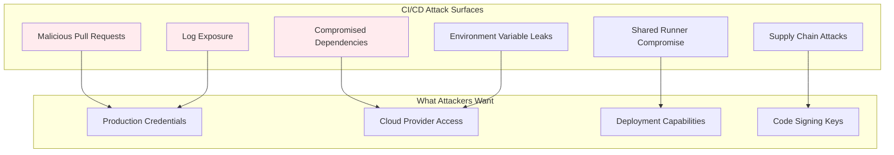
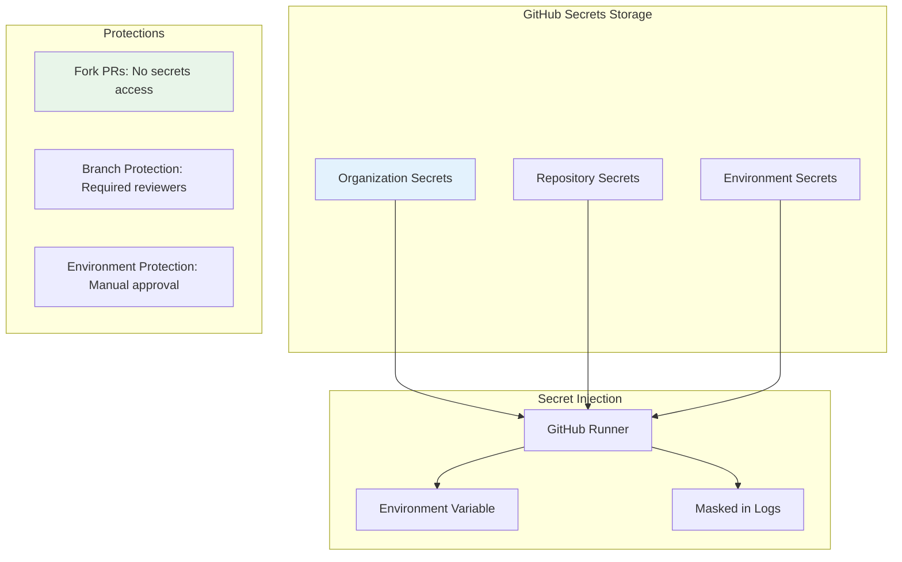
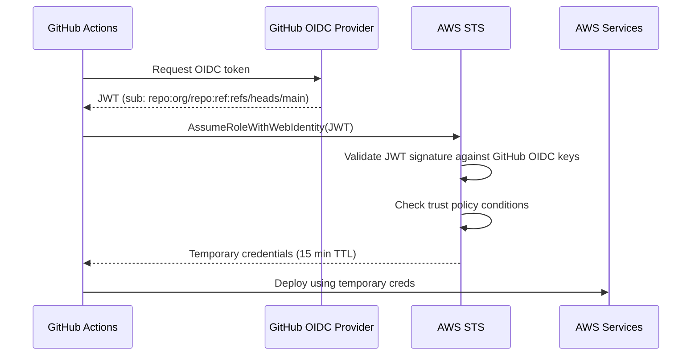
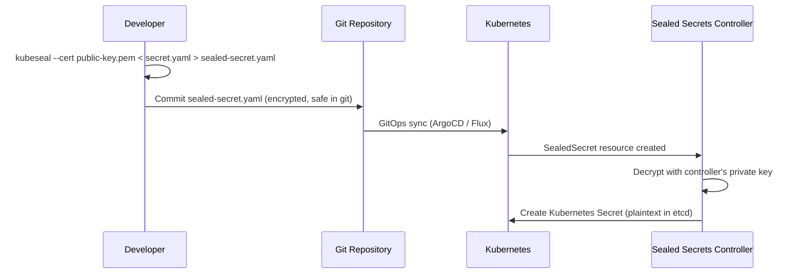
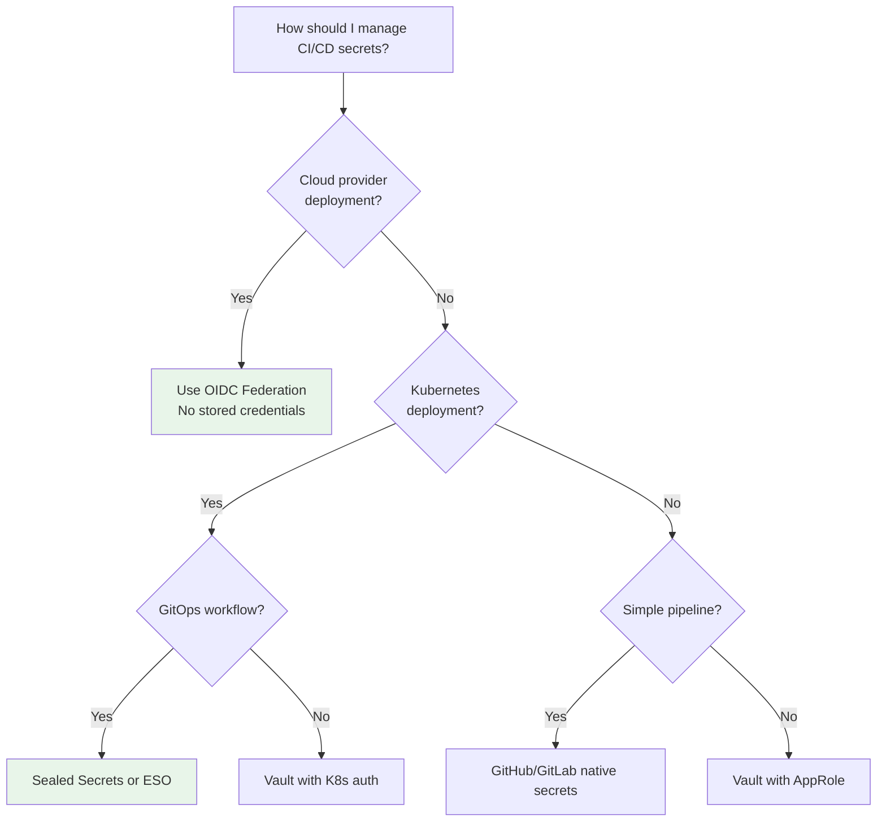

# Secrets in CI/CD

## Why CI/CD Secrets Are Special

CI/CD pipelines are uniquely vulnerable to secret leakage because they combine several high-risk factors: they execute untrusted code (pull requests), produce verbose logs, run in shared infrastructure, and need access to production systems for deployments. A single exposed secret in a CI/CD pipeline can compromise your entire production environment.

The supply chain attacks of 2021–2023 (SolarWinds, Codecov, CircleCI) demonstrated that CI/CD systems are primary targets. Attackers don't need to breach your application — they breach the pipeline that builds and deploys it.

### The Threat Model



## First Principles

### The Principle of Least Privilege in CI/CD

Each pipeline step should have access to only the secrets it needs, for only as long as it needs them:

| Pipeline Stage | Needed Secrets | NOT Needed |
|---------------|---------------|------------|
| Lint/Format | None | Anything |
| Unit Tests | Test DB credentials | Production creds |
| Build | NPM token (private registry) | Deploy keys |
| Integration Tests | Test API keys, test DB | Production anything |
| Deploy to Staging | Staging deploy key, staging DB | Production creds |
| Deploy to Production | Production deploy key | Test creds |
| Post-deploy Verify | Monitoring API key | Deploy keys |

### Static vs Dynamic Credentials in CI/CD

| Type | Example | Risk | Recommendation |
|------|---------|------|----------------|
| Long-lived tokens | GitHub PAT, AWS access keys | High — valid until revoked | Avoid, use OIDC instead |
| OIDC tokens | GitHub Actions OIDC → AWS | Low — valid for minutes | Preferred for cloud access |
| Sealed secrets | Encrypted in git, decrypted in cluster | Low — encrypted at rest | Good for Kubernetes |
| Vault tokens | Short-lived, auto-expired | Low — automatic revocation | Good for Vault environments |

## Core Mechanics

### GitHub Actions Secrets



### OIDC Federation (Keyless Authentication)

OIDC federation eliminates stored cloud credentials entirely:



### Sealed Secrets (Kubernetes)



## Implementation

### GitHub Actions with OIDC (No Stored Secrets)

```yaml
name: Deploy to AWS
on:
  push:
    branches: [main]

permissions:
  id-token: write  # Required for OIDC
  contents: read

jobs:
  deploy:
    runs-on: ubuntu-latest
    environment: production  # Environment protection rules apply

    steps:
      - uses: actions/checkout@v4

      - name: Configure AWS Credentials (OIDC)
        uses: aws-actions/configure-aws-credentials@v4
        with:
          role-to-assume: arn:aws:iam::123456789012:role/github-actions-deploy
          aws-region: us-east-1
          # No access key or secret key needed!

      - name: Deploy
        run: |
          # AWS credentials are automatically available
          aws ecs update-service --cluster prod --service my-app --force-new-deployment
```

### AWS IAM Role for GitHub Actions OIDC (Terraform)

```hcl
# OIDC provider for GitHub
resource "aws_iam_openid_connect_provider" "github" {
  url             = "https://token.actions.githubusercontent.com"
  client_id_list  = ["sts.amazonaws.com"]
  thumbprint_list = ["6938fd4d98bab03faadb97b34396831e3780aea1"]
}

# IAM role that GitHub Actions can assume
resource "aws_iam_role" "github_actions_deploy" {
  name = "github-actions-deploy"

  assume_role_policy = jsonencode({
    Version = "2012-10-17"
    Statement = [
      {
        Effect = "Allow"
        Principal = {
          Federated = aws_iam_openid_connect_provider.github.arn
        }
        Action = "sts:AssumeRoleWithWebIdentity"
        Condition = {
          StringEquals = {
            "token.actions.githubusercontent.com:aud" = "sts.amazonaws.com"
          }
          StringLike = {
            # Only allow main branch of specific repos
            "token.actions.githubusercontent.com:sub" = "repo:my-org/my-app:ref:refs/heads/main"
          }
        }
      }
    ]
  })
}

resource "aws_iam_role_policy_attachment" "deploy_permissions" {
  role       = aws_iam_role.github_actions_deploy.name
  policy_arn = aws_iam_policy.deploy_policy.arn
}
```

### Sealed Secrets Setup and Usage

```bash
#!/bin/bash
# Install Sealed Secrets controller in Kubernetes
helm repo add sealed-secrets https://bitnami-labs.github.io/sealed-secrets
helm install sealed-secrets sealed-secrets/sealed-secrets \
  --namespace kube-system \
  --set-string fullnameOverride=sealed-secrets-controller

# Fetch the public key for sealing
kubeseal --fetch-cert \
  --controller-name=sealed-secrets-controller \
  --controller-namespace=kube-system \
  > pub-cert.pem
```

```typescript
// Create and seal a secret programmatically
import { execSync } from 'node:child_process';
import { writeFileSync } from 'node:fs';
import yaml from 'js-yaml';

function createSealedSecret(
  name: string,
  namespace: string,
  data: Record<string, string>
): string {
  // Create the Kubernetes Secret YAML
  const secret = {
    apiVersion: 'v1',
    kind: 'Secret',
    metadata: { name, namespace },
    type: 'Opaque',
    stringData: data,
  };

  const secretYaml = yaml.dump(secret);
  writeFileSync('/tmp/secret.yaml', secretYaml);

  // Seal it
  const sealed = execSync(
    'kubeseal --cert pub-cert.pem --format yaml < /tmp/secret.yaml',
    { encoding: 'utf-8' }
  );

  return sealed;
}

// Usage
const sealedYaml = createSealedSecret('db-credentials', 'production', {
  DB_HOST: 'db.example.com',
  DB_USER: 'app_user',
  DB_PASSWORD: 'super-secret-password',
});

// This is safe to commit to git
writeFileSync('k8s/sealed-db-credentials.yaml', sealedYaml);
```

### External Secrets Operator (ESO)

```yaml
# ExternalSecret syncs from AWS Secrets Manager to Kubernetes Secret
apiVersion: external-secrets.io/v1beta1
kind: ExternalSecret
metadata:
  name: database-credentials
  namespace: production
spec:
  refreshInterval: 5m  # Sync every 5 minutes
  secretStoreRef:
    name: aws-secrets-manager
    kind: ClusterSecretStore

  target:
    name: database-credentials
    creationPolicy: Owner
    template:
      type: Opaque
      data:
        DB_URL: "postgresql://{​{ .username }}:{​{ .password }}@{​{ .host }}:{​{ .port }}/{​{ .dbname }}"

  data:
    - secretKey: username
      remoteRef:
        key: production/database/primary
        property: username
    - secretKey: password
      remoteRef:
        key: production/database/primary
        property: password
    - secretKey: host
      remoteRef:
        key: production/database/primary
        property: host
    - secretKey: port
      remoteRef:
        key: production/database/primary
        property: port
    - secretKey: dbname
      remoteRef:
        key: production/database/primary
        property: dbname
---
# ClusterSecretStore for AWS Secrets Manager
apiVersion: external-secrets.io/v1beta1
kind: ClusterSecretStore
metadata:
  name: aws-secrets-manager
spec:
  provider:
    aws:
      service: SecretsManager
      region: us-east-1
      auth:
        jwt:
          serviceAccountRef:
            name: external-secrets-sa
            namespace: external-secrets
```

### Secret Scanning in CI

```yaml
# GitHub Actions: Secret scanning with gitleaks
name: Secret Scan
on: [push, pull_request]

jobs:
  gitleaks:
    runs-on: ubuntu-latest
    steps:
      - uses: actions/checkout@v4
        with:
          fetch-depth: 0  # Full history for scanning

      - name: Run Gitleaks
        uses: gitleaks/gitleaks-action@v2
        env:
          GITHUB_TOKEN: ${​{ secrets.GITHUB_TOKEN }}
```

```toml
# .gitleaks.toml - Custom rules
[extend]
useDefault = true

[[rules]]
id = "custom-api-key"
description = "Custom API Key"
regex = '''(?i)(?:api[_-]?key|apikey)\s*[:=]\s*['"]?([a-z0-9]{32,})['"]?'''
tags = ["key", "api"]

[[rules]]
id = "internal-service-token"
description = "Internal service token pattern"
regex = '''svc_[a-zA-Z0-9]{32,}'''
tags = ["token", "internal"]

[allowlist]
paths = [
  '''\.test\.ts$''',
  '''\.spec\.ts$''',
  '''__fixtures__''',
]
```

## Edge Cases & Failure Modes

### Fork PR Secret Exposure

GitHub does not inject repository secrets into workflows triggered by pull requests from forks. This is intentional — a fork could contain malicious code that exfiltrates secrets.

::: danger
**Never use `pull_request_target` with `actions/checkout@v4` of the PR branch.** The `pull_request_target` event has access to repository secrets but runs in the context of the base branch. If you checkout the PR's code and run it with secrets, a malicious PR can steal them.
:::

Safe pattern:
```yaml
# SAFE: Uses pull_request (no secrets for forks)
on: pull_request
jobs:
  test:
    runs-on: ubuntu-latest
    steps:
      - uses: actions/checkout@v4
      - run: npm test
```

Dangerous pattern:
```yaml
# DANGEROUS: pull_request_target with PR checkout exposes secrets
on: pull_request_target
jobs:
  test:
    runs-on: ubuntu-latest
    steps:
      - uses: actions/checkout@v4
        with:
          ref: ${​{ github.event.pull_request.head.sha }}  # DANGER: PR code
      - run: npm test  # PR code runs with secrets access
```

### Log Masking Bypass

GitHub masks secret values in logs, but there are bypass techniques:

```bash
# This will be masked:
echo "${​{ secrets.MY_SECRET }}"  # Output: ***

# These might NOT be masked:
echo "${​{ secrets.MY_SECRET }}" | base64  # Different string, not masked
echo "${​{ secrets.MY_SECRET }}" | rev      # Reversed, not masked
```

**Mitigation**: Never echo secrets. Use `add-mask` for derived values:

```yaml
- name: Derive and mask
  run: |
    DERIVED=$(echo "${​{ secrets.MY_SECRET }}" | sha256sum | cut -d' ' -f1)
    echo "::add-mask::$DERIVED"
    echo "Using derived value: $DERIVED"
```

## Performance Characteristics

### OIDC Token Exchange Latency

| Provider | Token Request | STS Exchange | Total |
|----------|--------------|-------------|-------|
| GitHub → AWS | ~200ms | ~300ms | ~500ms |
| GitHub → GCP | ~200ms | ~400ms | ~600ms |
| GitHub → Azure | ~200ms | ~350ms | ~550ms |
| GitLab → AWS | ~150ms | ~300ms | ~450ms |

### Secret Retrieval During Pipeline

| Method | Latency | Caching | Impact on Pipeline |
|--------|---------|---------|-------------------|
| Environment variable | 0ms | N/A | None |
| Secrets Manager API | 5–50ms | Per-step | Negligible |
| Vault API | 1–20ms | Per-step | Negligible |
| External Secrets Operator | N/A (pre-synced) | 5min refresh | None |
| Sealed Secrets | N/A (at deploy) | N/A | None |

## Real-World War Stories

::: info War Story
**CircleCI Breach (2023)**

In January 2023, CircleCI disclosed a security breach where an attacker compromised an engineer's laptop and used a valid SSO session to access CircleCI's production systems. The attacker extracted customer environment variables and secrets stored in CircleCI's platform. All CircleCI customers were advised to rotate every secret stored in the platform.

**Lesson**: CI/CD platforms are high-value targets. Use OIDC federation instead of stored credentials wherever possible. If you must store secrets in the CI platform, rotate them frequently and monitor for unusual access patterns.
:::

::: info War Story
**Codecov Bash Uploader Supply Chain Attack (2021)**

Attackers modified Codecov's Bash Uploader script to exfiltrate environment variables from CI pipelines. The script ran in thousands of CI environments, capturing credentials for AWS, GitHub, and other services. The attack went undetected for two months.

**Lesson**: Audit all third-party scripts and actions used in CI pipelines. Pin actions to specific commit SHAs, not tags (tags can be moved). Minimize the number of environment variables available during CI steps.
:::

## Decision Framework

### CI/CD Secret Strategy Selection



## Advanced Topics

### Keyless Signing with Sigstore

```yaml
# Sign container images without managing signing keys
- name: Sign Container Image
  uses: sigstore/cosign-installer@v3

- name: Sign
  run: |
    cosign sign \
      --yes \
      --oidc-issuer=https://token.actions.githubusercontent.com \
      ghcr.io/${​{ github.repository }}:${​{ github.sha }}
  env:
    COSIGN_EXPERIMENTAL: 1
```

### Multi-Environment Secret Promotion

```yaml
# Promote secrets through environments with approval gates
jobs:
  deploy-staging:
    environment: staging
    steps:
      - uses: aws-actions/configure-aws-credentials@v4
        with:
          role-to-assume: ${​{ vars.AWS_ROLE_ARN }}  # Staging role
          aws-region: us-east-1

  deploy-production:
    needs: deploy-staging
    environment: production  # Requires manual approval
    steps:
      - uses: aws-actions/configure-aws-credentials@v4
        with:
          role-to-assume: ${​{ vars.AWS_ROLE_ARN }}  # Production role
          aws-region: us-east-1
```

## Cross-References

- [Secrets Management Overview](/security/secrets-management/) — Overall strategy
- [Vault Deep Dive](/security/secrets-management/vault-deep-dive) — Vault AppRole auth for CI
- [AWS Secrets Manager](/security/secrets-management/aws-secrets-manager) — Cloud-native secrets
- [Rotation Automation](/security/secrets-management/rotation-automation) — Automated rotation
- [API Key Design](/security/authentication/api-key-design) — Managing API keys in pipelines
- [Encryption at Rest](/security/encryption/encryption-at-rest) — Sealed secret encryption
