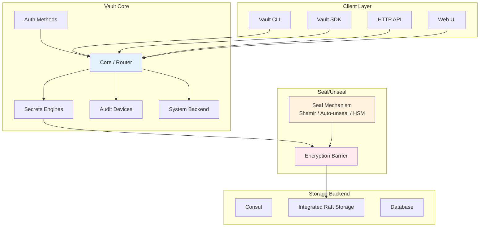
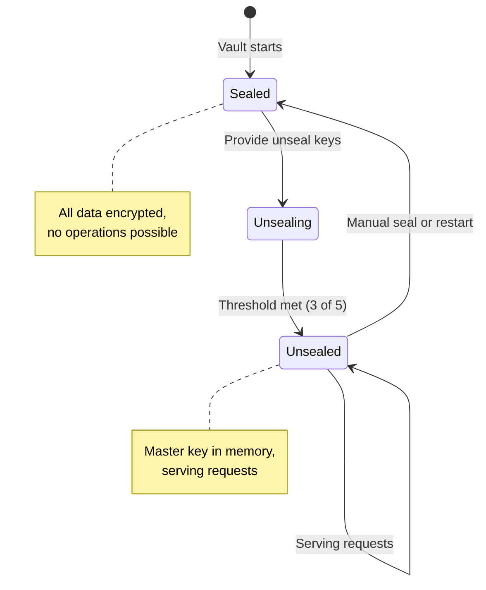
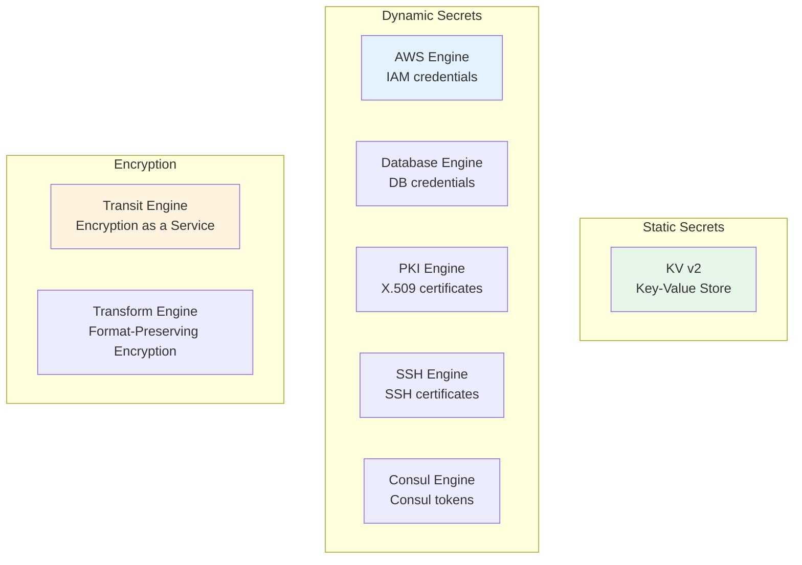
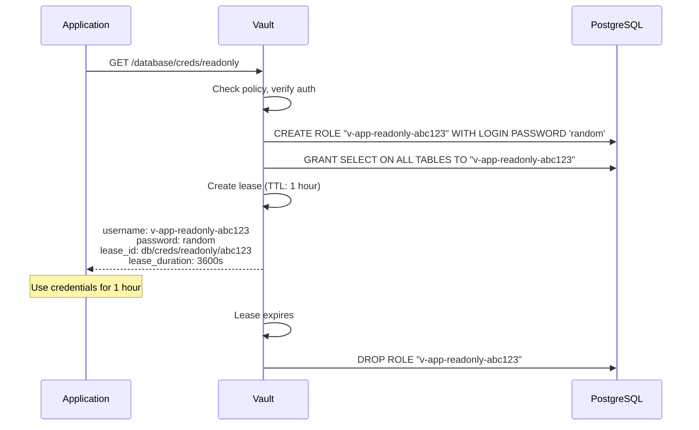
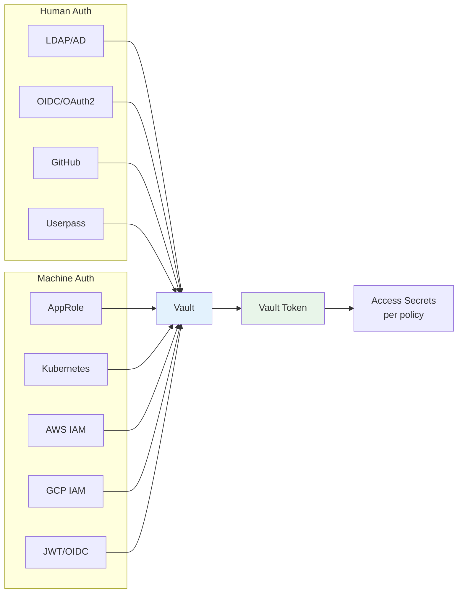
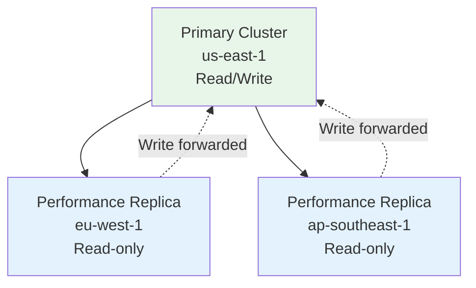

# HashiCorp Vault Deep Dive

## Why Vault Exists

HashiCorp Vault is a secrets management platform that centralizes secret storage, provides dynamic secrets with automatic expiration, handles encryption as a service, and enforces fine-grained access policies. It exists because organizations need a single source of truth for secrets that works across clouds, environments, and teams.

Before Vault, secrets were scattered across environment variables, config files, encrypted data bags, and proprietary cloud services. Each approach had limitations — no dynamic secrets, no unified audit trail, no cross-cloud support, no encryption as a service. Vault brought all of these under one roof.

### Key Differentiators

| Feature | Vault | Cloud KMS/Secrets Manager | Config Files |
|---------|-------|--------------------------|-------------|
| Dynamic secrets | Yes (DB, AWS, PKI) | No | No |
| Encryption as a service | Transit engine | Encrypt/Decrypt API | No |
| Multi-cloud | Yes | Single cloud | Manual |
| Lease management | Automatic expiry | Manual | No |
| Identity-based access | AppRole, K8s, OIDC | IAM | File permissions |
| Audit logging | Comprehensive | Varies | No |

## First Principles

### Vault's Architecture



### The Seal/Unseal Mechanism

Vault encrypts all data with a master key. The master key is protected by the seal mechanism:



**Shamir's Secret Sharing**: The master key is split into N shares, requiring K shares to reconstruct:

$$
\text{Master Key} = f(0) \text{ where } f \text{ is a } (K-1)\text{-degree polynomial}
$$

Typically: 5 shares, threshold of 3. Each share is given to a different operator.

**Auto-unseal**: For automated environments, use cloud KMS (AWS KMS, GCP CKMS, Azure Key Vault) or HSM to unseal automatically.

### Path-Based Access Model

Every secret in Vault has a path, and access is controlled by policies:

```
secret/                          # Root of KV secrets engine
secret/data/production/          # Production secrets
secret/data/production/db        # Database credentials
secret/data/staging/db           # Staging database credentials
aws/creds/my-role               # Dynamic AWS credentials
database/creds/readonly         # Dynamic database credentials
pki/issue/web-server            # Dynamic TLS certificates
```

## Core Mechanics

### Secrets Engines



### Dynamic Secrets — Database Engine

Dynamic database credentials are generated on-demand and automatically revoked:



### Auth Methods



## Implementation

### Vault Setup and Configuration

```bash
#!/bin/bash
# Initialize Vault with Raft storage and auto-unseal

# vault server configuration
cat > /etc/vault.d/vault.hcl << 'EOF'
storage "raft" {
  path    = "/opt/vault/data"
  node_id = "vault-1"

  retry_join {
    leader_api_addr = "https://vault-2:8200"
  }
  retry_join {
    leader_api_addr = "https://vault-3:8200"
  }
}

listener "tcp" {
  address     = "0.0.0.0:8200"
  tls_cert_file = "/opt/vault/tls/vault.crt"
  tls_key_file  = "/opt/vault/tls/vault.key"
}

seal "awskms" {
  region     = "us-east-1"
  kms_key_id = "alias/vault-unseal-key"
}

api_addr     = "https://vault-1:8200"
cluster_addr = "https://vault-1:8201"

ui = true

telemetry {
  prometheus_retention_time = "30s"
  disable_hostname = true
}
EOF

# Initialize Vault
vault operator init -recovery-shares=5 -recovery-threshold=3

# Enable audit logging
vault audit enable file file_path=/var/log/vault/audit.log
```

### Dynamic Database Secrets (TypeScript Client)

```typescript
import Vault from 'node-vault';

interface DatabaseCredentials {
  username: string;
  password: string;
  leaseId: string;
  leaseDuration: number;
}

class VaultDatabaseService {
  private vault: any;
  private activeLeases: Map<string, NodeJS.Timeout> = new Map();

  constructor(vaultAddr: string, token: string) {
    this.vault = Vault({
      apiVersion: 'v1',
      endpoint: vaultAddr,
      token,
    });
  }

  /**
   * Configure the database secrets engine.
   */
  async configureDatabaseEngine(
    connectionName: string,
    connectionUrl: string,
    allowedRoles: string[]
  ): Promise<void> {
    await this.vault.write(`database/config/${connectionName}`, {
      plugin_name: 'postgresql-database-plugin',
      connection_url: connectionUrl,
      allowed_roles: allowedRoles.join(','),
      username: 'vault_admin',
      password: 'initial_password',
    });

    // Rotate the root password so Vault controls it exclusively
    await this.vault.write(`database/rotate-root/${connectionName}`, {});
  }

  /**
   * Create a role that defines what credentials look like.
   */
  async createRole(
    roleName: string,
    dbName: string,
    creationStatements: string[],
    revocationStatements: string[],
    defaultTTL: string = '1h',
    maxTTL: string = '24h'
  ): Promise<void> {
    await this.vault.write(`database/roles/${roleName}`, {
      db_name: dbName,
      creation_statements: creationStatements,
      revocation_statements: revocationStatements,
      default_ttl: defaultTTL,
      max_ttl: maxTTL,
    });
  }

  /**
   * Get dynamic database credentials.
   */
  async getCredentials(roleName: string): Promise<DatabaseCredentials> {
    const result = await this.vault.read(`database/creds/${roleName}`);

    const creds: DatabaseCredentials = {
      username: result.data.username,
      password: result.data.password,
      leaseId: result.lease_id,
      leaseDuration: result.lease_duration,
    };

    // Schedule lease renewal before expiry
    this.scheduleRenewal(creds.leaseId, creds.leaseDuration);

    return creds;
  }

  /**
   * Renew a lease to extend credential lifetime.
   */
  async renewLease(leaseId: string, increment?: number): Promise<number> {
    const result = await this.vault.write('sys/leases/renew', {
      lease_id: leaseId,
      increment: increment ?? 3600,
    });
    return result.lease_duration;
  }

  /**
   * Revoke credentials immediately.
   */
  async revokeLease(leaseId: string): Promise<void> {
    await this.vault.write('sys/leases/revoke', {
      lease_id: leaseId,
    });

    const timer = this.activeLeases.get(leaseId);
    if (timer) {
      clearTimeout(timer);
      this.activeLeases.delete(leaseId);
    }
  }

  private scheduleRenewal(leaseId: string, ttl: number): void {
    // Renew at 2/3 of the lease duration
    const renewAt = Math.floor(ttl * 0.66) * 1000;

    const timer = setTimeout(async () => {
      try {
        const newTTL = await this.renewLease(leaseId);
        this.scheduleRenewal(leaseId, newTTL);
      } catch (error) {
        console.error(`Failed to renew lease ${leaseId}:`, error);
        // Application should handle credential refresh
      }
    }, renewAt);

    this.activeLeases.set(leaseId, timer);
  }
}
```

### Vault Policies (HCL)

```hcl
# policy: app-production
# Allows reading production secrets and generating database credentials

# KV secrets - read only
path "secret/data/production/*" {
  capabilities = ["read", "list"]
}

# Database dynamic credentials
path "database/creds/app-readonly" {
  capabilities = ["read"]
}

path "database/creds/app-readwrite" {
  capabilities = ["read"]
}

# Transit encryption
path "transit/encrypt/app-key" {
  capabilities = ["update"]
}

path "transit/decrypt/app-key" {
  capabilities = ["update"]
}

# Lease management (own leases only)
path "sys/leases/renew" {
  capabilities = ["update"]
}

# Deny access to other environments
path "secret/data/staging/*" {
  capabilities = ["deny"]
}

path "secret/data/development/*" {
  capabilities = ["deny"]
}
```

### Kubernetes Auth Integration

```typescript
import Vault from 'node-vault';
import fs from 'node:fs';

class VaultKubernetesAuth {
  private vaultAddr: string;
  private role: string;

  constructor(vaultAddr: string, role: string) {
    this.vaultAddr = vaultAddr;
    this.role = role;
  }

  /**
   * Authenticate to Vault using Kubernetes service account token.
   */
  async authenticate(): Promise<string> {
    // Kubernetes injects the service account token at this path
    const jwt = fs.readFileSync(
      '/var/run/secrets/kubernetes.io/serviceaccount/token',
      'utf8'
    );

    const vault = Vault({
      apiVersion: 'v1',
      endpoint: this.vaultAddr,
    });

    const result = await vault.write('auth/kubernetes/login', {
      role: this.role,
      jwt,
    });

    return result.auth.client_token;
  }

  /**
   * Create a Vault client with Kubernetes auth.
   */
  async createClient(): Promise<any> {
    const token = await this.authenticate();

    return Vault({
      apiVersion: 'v1',
      endpoint: this.vaultAddr,
      token,
    });
  }
}
```

### Transit Secrets Engine (Encryption as a Service)

```typescript
class VaultTransitService {
  private vault: any;

  constructor(vault: any) {
    this.vault = vault;
  }

  /**
   * Encrypt data using Vault's Transit engine.
   * The encryption key never leaves Vault.
   */
  async encrypt(keyName: string, plaintext: string): Promise<string> {
    const result = await this.vault.write(`transit/encrypt/${keyName}`, {
      plaintext: Buffer.from(plaintext).toString('base64'),
    });

    return result.data.ciphertext; // vault:v1:base64...
  }

  /**
   * Decrypt data.
   */
  async decrypt(keyName: string, ciphertext: string): Promise<string> {
    const result = await this.vault.write(`transit/decrypt/${keyName}`, {
      ciphertext,
    });

    return Buffer.from(result.data.plaintext, 'base64').toString('utf8');
  }

  /**
   * Rotate the encryption key.
   * Old ciphertext is still decryptable (key versioning).
   */
  async rotateKey(keyName: string): Promise<void> {
    await this.vault.write(`transit/keys/${keyName}/rotate`, {});
  }

  /**
   * Re-wrap ciphertext with the latest key version.
   * This does NOT decrypt — the plaintext never leaves Vault.
   */
  async rewrap(keyName: string, ciphertext: string): Promise<string> {
    const result = await this.vault.write(`transit/rewrap/${keyName}`, {
      ciphertext,
    });
    return result.data.ciphertext;
  }
}
```

## Edge Cases & Failure Modes

### Vault Unavailability

If Vault becomes unavailable, applications cannot fetch new secrets:

| Scenario | Impact | Mitigation |
|----------|--------|------------|
| Vault leader election | Brief write unavailability | Raft consensus handles this (seconds) |
| Vault sealed | All operations blocked | Auto-unseal with cloud KMS |
| Network partition | Clients lose Vault access | Local secret caching |
| Vault cluster down | No new secrets | Pre-fetched secrets, retry logic |

::: warning
**Never cache dynamic database credentials indefinitely.** If Vault revokes a lease but your application uses a cached credential, the database may reject connections. Implement lease renewal and graceful credential refresh.
:::

### Seal/Unseal Failures

| Failure | Cause | Resolution |
|---------|-------|------------|
| Cannot unseal | Lost key shares | Use recovery keys or rebuild |
| Auto-unseal KMS unavailable | Cloud KMS outage | Cross-region KMS, manual unseal backup |
| Seal migration failure | Switching seal types | Follow Vault migration guide carefully |

## Performance Characteristics

### Vault API Latency

| Operation | p50 | p99 | Throughput |
|-----------|-----|-----|-----------|
| KV read | 1ms | 5ms | 20K req/s |
| KV write | 2ms | 10ms | 10K req/s |
| Transit encrypt | 3ms | 15ms | 15K req/s |
| Transit decrypt | 3ms | 15ms | 15K req/s |
| Dynamic DB creds | 50ms | 200ms | 500 req/s |
| PKI certificate | 20ms | 100ms | 2K req/s |
| Auth (AppRole) | 5ms | 20ms | 10K req/s |
| Auth (Kubernetes) | 10ms | 50ms | 5K req/s |

### Resource Requirements

| Cluster Size | CPU | Memory | Storage | Nodes |
|-------------|-----|--------|---------|-------|
| Development | 2 cores | 2 GB | 10 GB | 1 |
| Small production | 4 cores | 8 GB | 50 GB | 3 |
| Medium production | 8 cores | 16 GB | 100 GB | 5 |
| Large production | 16 cores | 32 GB | 500 GB | 5 |

## Mathematical Foundations

### Shamir's Secret Sharing in Vault

Vault uses Shamir's Secret Sharing to split the master key:

$$
f(x) = a_0 + a_1 x + a_2 x^2 + \ldots + a_{k-1} x^{k-1} \pmod{p}
$$

where $a_0$ is the master key, $a_1, \ldots, a_{k-1}$ are random coefficients, and shares are $(i, f(i))$.

Reconstruction uses Lagrange interpolation:

$$
a_0 = \sum_{j=0}^{k-1} y_j \prod_{\substack{m=0 \\ m \neq j}}^{k-1} \frac{x_m}{x_m - x_j} \pmod{p}
$$

With 5 shares and threshold 3, any 3 shares reconstruct the master key, but 2 shares reveal nothing.

### Lease Duration and Security

The probability that a leaked dynamic credential is still valid when discovered:

$$
P(\text{still valid}) = \max\left(0, 1 - \frac{T_{\text{discovery}}}{T_{\text{lease}}}\right)
$$

For a 1-hour lease with 4-hour mean time to discovery:

$$
P = \max(0, 1 - \frac{4}{1}) = 0
$$

The credential has already expired. This is the security power of dynamic secrets with short TTLs.

## Real-World War Stories

::: info War Story
**Vault Auto-Unseal with AWS KMS — The Cross-Region Lesson**

A company used AWS KMS in us-east-1 for Vault auto-unseal. When us-east-1 had a partial KMS outage in 2020, their Vault cluster could not unseal after a routine restart. All 200+ microservices lost access to their secrets for 4 hours.

**Resolution**: They implemented cross-region auto-unseal with a KMS key in both us-east-1 and us-west-2, with automatic failover. They also ensured all services cached their most recent secrets locally with a 1-hour TTL.
:::

::: info War Story
**Dynamic Secrets Credential Storm**

A company configured Vault's database engine to generate dynamic PostgreSQL credentials with a 1-hour TTL. During a deployment that restarted 500 pod replicas simultaneously, each pod requested new credentials, creating 500 PostgreSQL roles in under 30 seconds. PostgreSQL's `pg_authid` catalog table locked up, causing a cascading failure.

**Resolution**: They switched to a credential pool pattern — generating a smaller number of credentials with longer TTLs and sharing them across pods using a sidecar. They also staggered pod restarts to spread the credential generation load.
:::

## Decision Framework

### When to Use Vault

**Use Vault when:**
- You need dynamic secrets (short-lived database credentials)
- Multi-cloud environment requiring unified secrets management
- Encryption as a service (Transit engine)
- Complex access policies with identity-based auth
- PKI certificate issuance

**Consider alternatives when:**
- Single-cloud deployment (use cloud-native secrets manager)
- Small team without dedicated infrastructure operators
- Simple secret storage needs (fewer than 50 secrets)
- Cost sensitivity (Vault requires dedicated infrastructure)

## Advanced Topics

### Vault Agent Sidecar Pattern (Kubernetes)

```yaml
# Vault Agent injector annotations for Kubernetes pods
apiVersion: apps/v1
kind: Deployment
metadata:
  name: my-app
spec:
  template:
    metadata:
      annotations:
        vault.hashicorp.com/agent-inject: "true"
        vault.hashicorp.com/role: "my-app"
        vault.hashicorp.com/agent-inject-secret-db: "database/creds/my-app-readonly"
        vault.hashicorp.com/agent-inject-template-db: |
          {​{ "{​{" }}- with secret "database/creds/my-app-readonly" -{​{ "}}" }}
          export DB_USER="{​{ "{​{" }} .Data.username {​{ "}}" }}"
          export DB_PASS="{​{ "{​{" }} .Data.password {​{ "}}" }}"
          {​{ "{​{" }}- end {​{ "}}" }}
    spec:
      serviceAccountName: my-app
      containers:
        - name: my-app
          image: my-app:latest
          command: ["/bin/sh", "-c", "source /vault/secrets/db && ./start-app"]
```

### Vault Performance Replication

For global deployments, Vault supports performance replication:



## Cross-References

- [Secrets Management Overview](/security/secrets-management/) — Context and comparison
- [AWS Secrets Manager](/security/secrets-management/aws-secrets-manager) — Cloud-native alternative
- [Key Management](/security/encryption/key-management) — Key lifecycle
- [Envelope Encryption](/security/encryption/envelope-encryption) — Transit engine patterns
- [Rotation Automation](/security/secrets-management/rotation-automation) — Automated rotation
- [Zero Trust Principles](/security/zero-trust/principles) — Identity-based access
