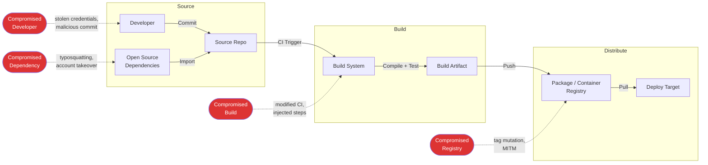
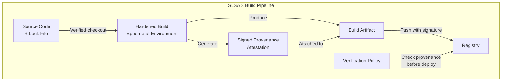
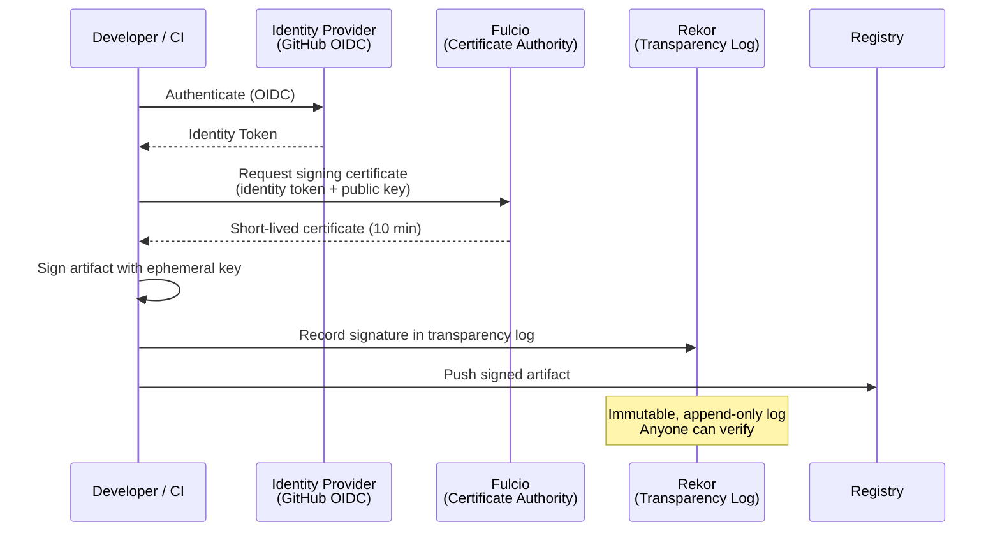
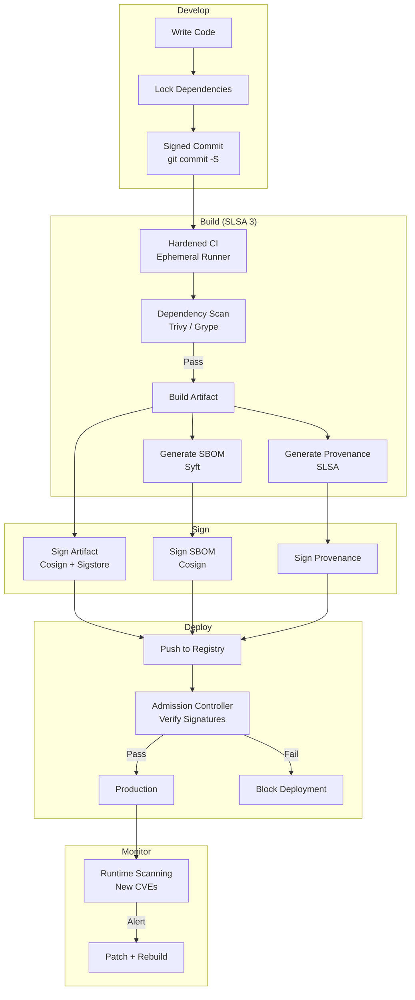

# Supply Chain Security

Supply chain attacks compromise software by targeting its dependencies, build systems, or distribution channels rather than the application itself. SolarWinds (2020), Log4Shell (2021), the xz-utils backdoor (2024) — each exploited a different link in the supply chain. The industry's response is a layered defense: SLSA for build integrity, SBOMs for visibility, Sigstore for signing, and continuous scanning for known vulnerabilities.

This page covers the frameworks, tools, and practices that secure the path from source code to production artifact.

**Related**: [Security Overview](/security/) | [Docker Cheat Sheet](/cheat-sheets/docker) | [Docker Compose Cheat Sheet](/cheat-sheets/docker-compose)

---

## The Attack Surface



### Notable Supply Chain Attacks

| Attack | Year | Vector | Impact |
|--------|------|--------|--------|
| **SolarWinds** | 2020 | Build system compromise | 18,000+ organizations breached |
| **Codecov** | 2021 | CI script tampered | Credentials exfiltrated from CI environments |
| **ua-parser-js** | 2021 | npm account takeover | Cryptominer injected into 7M+ weekly downloads |
| **Log4Shell** | 2021 | Vulnerability in transitive dependency | Billions of devices affected |
| **xz-utils** | 2024 | Multi-year social engineering of maintainer | Backdoor in core Linux utility |
| **tj-actions/changed-files** | 2025 | GitHub Action compromise | Secrets exfiltrated from CI workflows |

---

## SLSA Framework

SLSA (Supply-chain Levels for Software Artifacts, pronounced "salsa") is a security framework by Google that defines increasing levels of supply chain integrity.

### SLSA Levels

| Level | Requirement | What It Prevents |
|-------|-------------|------------------|
| **SLSA 0** | No guarantees | Nothing |
| **SLSA 1** | Build process documented; provenance generated | Ad-hoc builds, unknown build processes |
| **SLSA 2** | Hosted build service; authenticated provenance | Tampering after build |
| **SLSA 3** | Hardened build platform; non-falsifiable provenance | Compromised build platform |
| **SLSA 4** | Two-person review; hermetic, reproducible builds | Insider threats, compromised dependencies |



### Generating SLSA Provenance with GitHub Actions

```yaml
# .github/workflows/build.yml
name: Build with SLSA Provenance

on:
  push:
    tags: ['v*']

permissions:
  contents: read
  id-token: write   # For signing
  attestations: write

jobs:
  build:
    runs-on: ubuntu-latest
    outputs:
      digest: ${{ steps.build.outputs.digest }}

    steps:
      - uses: actions/checkout@v4

      - name: Build container image
        id: build
        run: |
          docker build -t myapp:${{ github.ref_name }} .
          DIGEST=$(docker inspect --format='{{​.Id}}' myapp:${{ github.ref_name }})
          echo "digest=$DIGEST" >> $GITHUB_OUTPUT

      - name: Push to registry
        run: |
          docker tag myapp:${{ github.ref_name }} ghcr.io/myorg/myapp:${{ github.ref_name }}
          docker push ghcr.io/myorg/myapp:${{ github.ref_name }}

      - name: Generate SLSA provenance
        uses: actions/attest-build-provenance@v2
        with:
          subject-name: ghcr.io/myorg/myapp
          subject-digest: ${{ steps.build.outputs.digest }}
          push-to-registry: true
```

::: tip
GitHub Actions natively supports SLSA provenance generation via `actions/attest-build-provenance`. For container images, the provenance is attached as an OCI artifact alongside the image. Consumers can verify it with `gh attestation verify`.
:::

---

## Software Bill of Materials (SBOM)

An SBOM is a machine-readable inventory of every component in a software artifact — direct dependencies, transitive dependencies, their versions, licenses, and known vulnerabilities.

### SBOM Formats

| Format | Maintainer | Focus | Machine-Readable |
|--------|-----------|-------|-------------------|
| **SPDX** | Linux Foundation | License compliance + security | JSON, XML, RDF, Tag-Value |
| **CycloneDX** | OWASP | Security + operations | JSON, XML, Protobuf |
| **SWID** | ISO/IEC | Installed software identification | XML |

### Generating SBOMs

```bash
# === Syft (Anchore) — most popular SBOM generator ===

# From a container image
syft ghcr.io/myorg/myapp:v1.2.3 -o spdx-json > sbom.spdx.json
syft ghcr.io/myorg/myapp:v1.2.3 -o cyclonedx-json > sbom.cdx.json

# From a directory (source code)
syft dir:./my-project -o cyclonedx-json > sbom.cdx.json

# From a lock file
syft file:./package-lock.json -o spdx-json > sbom.spdx.json

# === Trivy — scanner with SBOM generation ===
trivy image --format spdx-json --output sbom.json ghcr.io/myorg/myapp:v1.2.3

# === Docker native (BuildKit) ===
docker buildx build --sbom=true --output type=local,dest=./out .
```

### SBOM in CI Pipeline

```yaml
# .github/workflows/sbom.yml
name: Generate and Scan SBOM

on:
  push:
    branches: [main]

jobs:
  sbom:
    runs-on: ubuntu-latest
    steps:
      - uses: actions/checkout@v4

      - name: Build image
        run: docker build -t myapp:latest .

      - name: Generate SBOM
        uses: anchore/sbom-action@v0
        with:
          image: myapp:latest
          format: cyclonedx-json
          output-file: sbom.cdx.json

      - name: Scan SBOM for vulnerabilities
        uses: anchore/scan-action@v4
        with:
          sbom: sbom.cdx.json
          fail-build: true
          severity-cutoff: high

      - name: Upload SBOM as artifact
        uses: actions/upload-artifact@v4
        with:
          name: sbom
          path: sbom.cdx.json
```

### SBOM Structure (CycloneDX Example)

```json
{
  "bomFormat": "CycloneDX",
  "specVersion": "1.5",
  "serialNumber": "urn:uuid:3e671687-395b-41f5-a30f-a58921a69b79",
  "version": 1,
  "metadata": {
    "timestamp": "2026-03-20T10:00:00Z",
    "tools": [{ "name": "syft", "version": "1.5.0" }],
    "component": {
      "type": "application",
      "name": "myapp",
      "version": "1.2.3"
    }
  },
  "components": [
    {
      "type": "library",
      "name": "express",
      "version": "4.21.0",
      "purl": "pkg:npm/express@4.21.0",
      "licenses": [{ "license": { "id": "MIT" } }]
    },
    {
      "type": "library",
      "name": "lodash",
      "version": "4.17.21",
      "purl": "pkg:npm/lodash@4.17.21",
      "licenses": [{ "license": { "id": "MIT" } }]
    }
  ],
  "dependencies": [
    {
      "ref": "pkg:npm/express@4.21.0",
      "dependsOn": ["pkg:npm/body-parser@1.20.2", "pkg:npm/cookie@0.6.0"]
    }
  ]
}
```

---

## Sigstore: Keyless Code Signing

Sigstore eliminates the key management problem in code signing. Instead of managing long-lived signing keys, it uses short-lived certificates tied to identity providers (GitHub, Google, Microsoft).



### Signing Container Images with Cosign

```bash
# Install cosign
go install github.com/sigstore/cosign/v2/cmd/cosign@latest

# === Keyless signing (recommended for CI) ===
# Uses OIDC identity (GitHub Actions, Google Cloud, etc.)
cosign sign ghcr.io/myorg/myapp@sha256:abc123...

# === Key-based signing (for air-gapped environments) ===
cosign generate-key-pair
cosign sign --key cosign.key ghcr.io/myorg/myapp@sha256:abc123...

# === Verify a signature ===
# Keyless verification
cosign verify \
  --certificate-oidc-issuer=https://token.actions.githubusercontent.com \
  --certificate-identity-regexp='https://github.com/myorg/.*' \
  ghcr.io/myorg/myapp@sha256:abc123...

# === Attach SBOM to image and sign it ===
cosign attach sbom --sbom sbom.cdx.json ghcr.io/myorg/myapp@sha256:abc123...
cosign sign ghcr.io/myorg/myapp:sha256-abc123.sbom

# === Verify SBOM ===
cosign verify-attestation \
  --type cyclonedx \
  ghcr.io/myorg/myapp@sha256:abc123...
```

### Cosign in GitHub Actions

```yaml
jobs:
  sign:
    runs-on: ubuntu-latest
    permissions:
      contents: read
      id-token: write    # OIDC token for keyless signing
      packages: write    # Push signatures to registry

    steps:
      - name: Install cosign
        uses: sigstore/cosign-installer@v3

      - name: Sign image
        env:
          DIGEST: ${{ steps.build.outputs.digest }}
        run: |
          cosign sign --yes ghcr.io/myorg/myapp@${DIGEST}
```

::: warning
Always sign by digest (`@sha256:...`), never by tag (`:latest`). Tags are mutable — an attacker can push a malicious image with the same tag. Digests are content-addressable and immutable.
:::

---

## Dependency Scanning

### Continuous Vulnerability Scanning

```yaml
# .github/workflows/dependency-scan.yml
name: Dependency Scanning

on:
  push:
    branches: [main]
  pull_request:
  schedule:
    - cron: '0 6 * * 1'   # Weekly Monday scan

jobs:
  scan:
    runs-on: ubuntu-latest
    steps:
      - uses: actions/checkout@v4

      # Scan source dependencies
      - name: Run Trivy vulnerability scanner
        uses: aquasecurity/trivy-action@master
        with:
          scan-type: 'fs'
          scan-ref: '.'
          format: 'sarif'
          output: 'trivy-results.sarif'
          severity: 'CRITICAL,HIGH'

      # Upload results to GitHub Security tab
      - name: Upload to GitHub Security
        uses: github/codeql-action/upload-sarif@v3
        with:
          sarif_file: 'trivy-results.sarif'
```

### Scanner Comparison

| Tool | Languages | Container Scan | License Check | IaC Scan | Free |
|------|-----------|---------------|---------------|----------|------|
| **Trivy** | All major | Yes | Yes | Yes | Yes |
| **Grype** | All major | Yes | No | No | Yes |
| **Snyk** | All major | Yes | Yes | Yes | Freemium |
| **Dependabot** | All major | No | No | No | Yes (GitHub) |
| **Renovate** | All major | No | No | No | Yes |
| **npm audit** | Node.js | No | No | No | Yes |
| **pip-audit** | Python | No | No | No | Yes |
| **govulncheck** | Go | No | No | No | Yes |

### Lock File Hygiene

```bash
# Verify lock file integrity (detects tampering)

# npm
npm ci                          # Fails if lock file does not match package.json

# Go
go mod verify                   # Verify checksums against go.sum

# Python (uv)
uv sync --frozen               # Fails if lock file is stale

# Rust
cargo install --locked          # Uses exact versions from Cargo.lock
```

::: danger
**Never run `npm install` in CI.** Use `npm ci` instead. `npm install` modifies the lock file to resolve version ranges, which means your CI build may use different dependency versions than your local build. `npm ci` fails if the lock file does not exactly match `package.json`, ensuring reproducibility.
:::

---

## Container Signing & Verification

### Admission Controllers (Kubernetes)

Enforce that only signed, verified images can run in your cluster:

```yaml
# Sigstore Policy Controller
apiVersion: policy.sigstore.dev/v1alpha1
kind: ClusterImagePolicy
metadata:
  name: require-signed-images
spec:
  images:
    - glob: "ghcr.io/myorg/**"
  authorities:
    - keyless:
        url: https://fulcio.sigstore.dev
        identities:
          - issuer: https://token.actions.githubusercontent.com
            subjectRegExp: https://github.com/myorg/.*
      ctlog:
        url: https://rekor.sigstore.dev
```

```yaml
# Kyverno alternative
apiVersion: kyverno.io/v1
kind: ClusterPolicy
metadata:
  name: verify-image-signatures
spec:
  validationFailureAction: Enforce
  rules:
    - name: verify-cosign-signature
      match:
        any:
          - resources:
              kinds: ["Pod"]
      verifyImages:
        - imageReferences:
            - "ghcr.io/myorg/*"
          attestors:
            - entries:
                - keyless:
                    subject: "https://github.com/myorg/*"
                    issuer: "https://token.actions.githubusercontent.com"
                    rekor:
                      url: https://rekor.sigstore.dev
```

---

## End-to-End Supply Chain Pipeline



---

## Checklist

| Practice | Priority | Tool |
|----------|----------|------|
| Pin dependency versions (lock files) | Critical | npm ci, uv sync --frozen |
| Enable Dependabot / Renovate | Critical | GitHub, GitLab |
| Scan dependencies for CVEs | Critical | Trivy, Grype, Snyk |
| Sign container images | High | Cosign, Sigstore |
| Generate SBOMs | High | Syft, Trivy |
| Enforce signed images in k8s | High | Kyverno, Sigstore Policy Controller |
| Generate SLSA provenance | Medium | slsa-verifier, GitHub Attestations |
| Verify build provenance before deploy | Medium | slsa-verifier |
| Scan IaC templates | Medium | Trivy, Checkov |
| Use minimal base images | Medium | distroless, chainguard |
| Enable npm provenance | Low | `npm publish --provenance` |
| Reproducible builds | Low | Bazel, Nix |

---

## Further Reading

- [Security Overview](/security/) — broader security practices and threat modeling
- [Docker Cheat Sheet](/cheat-sheets/docker) — container image best practices
- [Docker Compose Cheat Sheet](/cheat-sheets/docker-compose) — local development with signed images
- [Observability Tools](/devops/observability-tools/) — monitoring for anomalous dependency behavior
- [Python Data Ecosystem](/infrastructure/languages/python-data-tools) — securing Python dependencies with uv
