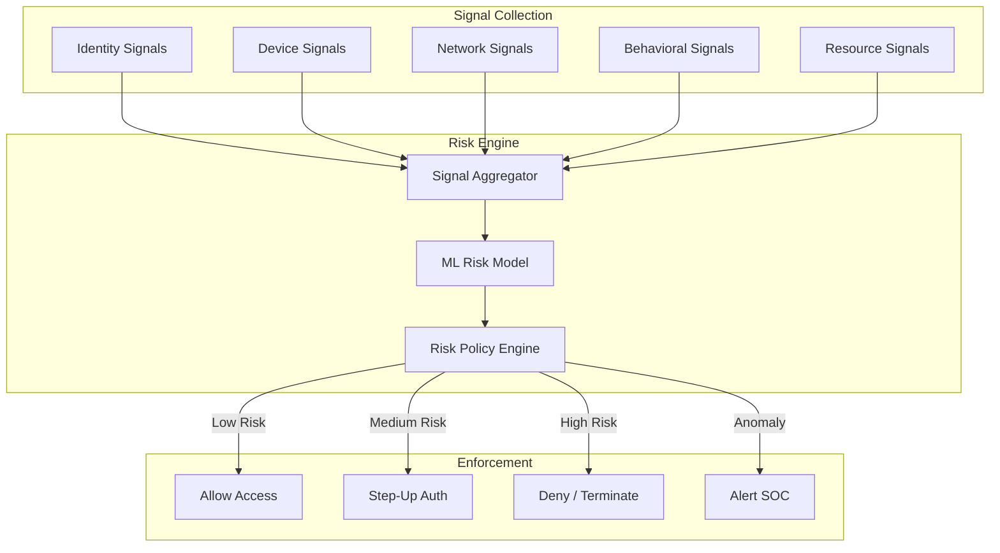
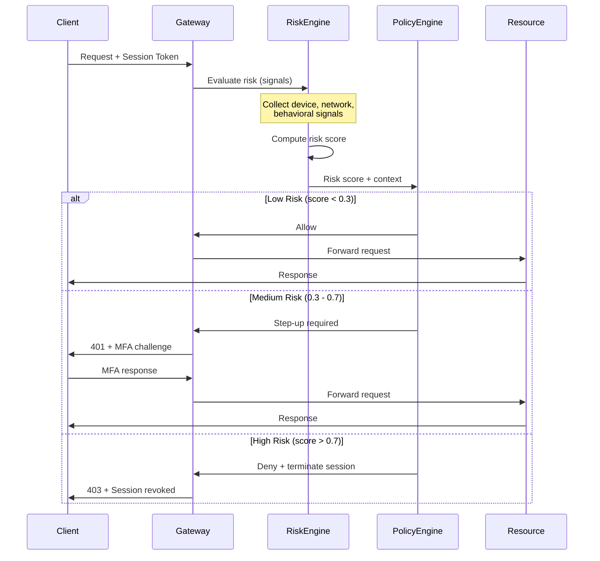
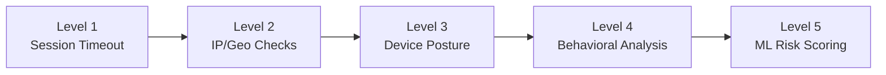
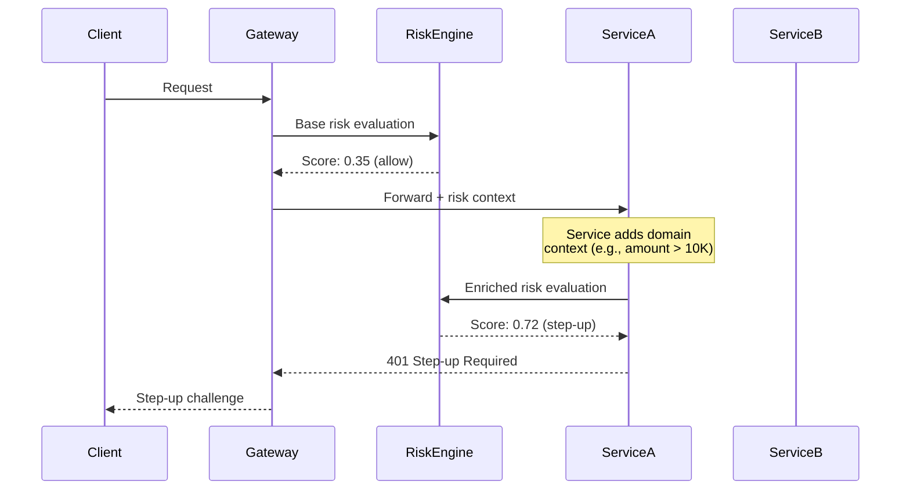

# Continuous Verification

## Why It Exists

Traditional authentication is binary: you prove your identity at login, receive a session token, and that token is trusted until it expires. This "authenticate once, trust forever" model is fundamentally broken in a zero-trust world. An attacker who steals a session token after authentication has full access for hours or days. Session hijacking, token theft, and credential replay attacks all exploit this gap between the moment of authentication and the moment of access.

Continuous verification emerged from the recognition that trust must be re-evaluated with every request — or at minimum, at a frequency that makes session hijacking economically infeasible. Google's BeyondCorp (2014) was the first large-scale implementation, moving from VPN-based perimeter security to per-request device and user verification. NIST SP 800-207 formalized this in 2020 as a core tenet of zero-trust architecture: "Access to individual enterprise resources is granted on a per-session basis" and "access is determined by dynamic policy."

The core insight is that risk is not static. A user who authenticated from a corporate laptop in the office at 9 AM has a very different risk profile than the same session being used from a new IP in a different country at 3 AM. Continuous verification dynamically adjusts trust based on observed behavior.

## First Principles

### The Trust Continuum

Traditional auth treats trust as binary (0 or 1). Continuous verification models trust as a continuous value that decays over time and is influenced by signals:

$$
\text{Trust}(t) = \text{Trust}_0 \cdot e^{-\lambda t} + \sum_{i} w_i \cdot S_i(t)
$$

Where:
- $\text{Trust}_0$ is the initial trust level after authentication
- $\lambda$ is the trust decay rate
- $S_i(t)$ are real-time trust signals (device health, behavior, location)
- $w_i$ are weights for each signal

When $\text{Trust}(t)$ drops below a threshold $\tau$, re-authentication is required:

$$
\text{Action}(t) = \begin{cases}
\text{Allow} & \text{if Trust}(t) \geq \tau_{\text{high}} \\
\text{Step-up Auth} & \text{if } \tau_{\text{low}} \leq \text{Trust}(t) < \tau_{\text{high}} \\
\text{Deny} & \text{if Trust}(t) < \tau_{\text{low}}
\end{cases}
$$

### Signal Categories

Continuous verification consumes multiple signal categories:

1. **Identity signals**: Authentication strength, credential age, MFA status
2. **Device signals**: OS patch level, disk encryption, MDM enrollment, endpoint detection
3. **Network signals**: IP reputation, geolocation, VPN/proxy detection, TLS version
4. **Behavioral signals**: Access patterns, typing cadence, navigation flow, time-of-day
5. **Resource signals**: Data sensitivity, regulatory requirements, blast radius



## Core Mechanics

### Risk Score Computation

The risk engine combines signals into a composite score. Each signal has a weight and a normalization function:



### Bayesian Risk Model

A Bayesian approach to risk scoring uses prior probabilities updated with observed evidence:

$$
P(\text{compromised} \mid \text{signals}) = \frac{P(\text{signals} \mid \text{compromised}) \cdot P(\text{compromised})}{P(\text{signals})}
$$

The posterior probability of compromise given observed signals is computed using Bayes' theorem. The prior $P(\text{compromised})$ is the base rate of session compromise (typically 0.001-0.01 depending on the environment), updated with the likelihood of seeing the observed signal pattern if the session were compromised.

For independent signals:

$$
P(\text{signals} \mid \text{compromised}) = \prod_{i=1}^{n} P(S_i \mid \text{compromised})
$$

### Behavioral Biometrics

Behavioral biometrics analyze patterns that are unique to individual users:

- **Keystroke dynamics**: Inter-key timing, key hold duration
- **Mouse dynamics**: Movement velocity, click patterns, scroll behavior
- **Navigation patterns**: Page visit order, dwell time, interaction depth
- **API call patterns**: Endpoint access frequency, parameter distributions

These signals are difficult for attackers to replicate because they are learned subconsciously and vary with mood, fatigue, and context.

## Implementation

### Production Risk Engine

```typescript
// risk-engine.ts - Continuous verification risk scoring
interface RiskSignal {
  category: 'identity' | 'device' | 'network' | 'behavior' | 'resource';
  name: string;
  value: number; // Normalized 0-1, where 1 = highest risk
  confidence: number; // 0-1, how reliable this signal is
  timestamp: Date;
}

interface RiskAssessment {
  score: number; // 0-1 composite risk
  signals: RiskSignal[];
  action: 'allow' | 'step_up' | 'deny' | 'terminate';
  reasons: string[];
  assessedAt: Date;
  sessionId: string;
}

interface SessionContext {
  sessionId: string;
  userId: string;
  authenticatedAt: Date;
  authStrength: 'password' | 'mfa' | 'passwordless' | 'certificate';
  deviceFingerprint: string;
  initialIp: string;
  initialGeo: { country: string; city: string; lat: number; lon: number };
}

interface RequestContext {
  ip: string;
  userAgent: string;
  geo: { country: string; city: string; lat: number; lon: number };
  timestamp: Date;
  endpoint: string;
  method: string;
  deviceFingerprint?: string;
}

class ContinuousVerificationEngine {
  private sessionHistory: Map<string, RequestContext[]> = new Map();
  private userBaselines: Map<string, UserBaseline> = new Map();

  // Risk thresholds
  private readonly ALLOW_THRESHOLD = 0.3;
  private readonly STEP_UP_THRESHOLD = 0.7;

  // Signal weights (must sum to 1.0)
  private readonly WEIGHTS: Record<RiskSignal['category'], number> = {
    identity: 0.20,
    device: 0.25,
    network: 0.20,
    behavior: 0.25,
    resource: 0.10,
  };

  async assessRisk(
    session: SessionContext,
    request: RequestContext,
    resourceSensitivity: number
  ): Promise<RiskAssessment> {
    const signals: RiskSignal[] = [];
    const reasons: string[] = [];

    // Identity signals
    signals.push(...this.assessIdentitySignals(session));

    // Device signals
    signals.push(...this.assessDeviceSignals(session, request));

    // Network signals
    signals.push(...await this.assessNetworkSignals(session, request));

    // Behavioral signals
    signals.push(...this.assessBehavioralSignals(session, request));

    // Resource signals
    signals.push({
      category: 'resource',
      name: 'sensitivity',
      value: resourceSensitivity,
      confidence: 1.0,
      timestamp: request.timestamp,
    });

    // Compute weighted risk score
    const score = this.computeCompositeScore(signals);

    // Determine action
    let action: RiskAssessment['action'];
    if (score < this.ALLOW_THRESHOLD) {
      action = 'allow';
    } else if (score < this.STEP_UP_THRESHOLD) {
      action = 'step_up';
      reasons.push(`Risk score ${score.toFixed(3)} exceeds allow threshold`);
    } else {
      action = 'deny';
      reasons.push(`Risk score ${score.toFixed(3)} exceeds deny threshold`);
    }

    // Check for hard deny signals (any signal with value > 0.95)
    const criticalSignals = signals.filter(s => s.value > 0.95 && s.confidence > 0.8);
    if (criticalSignals.length > 0) {
      action = 'terminate';
      reasons.push(
        `Critical signals detected: ${criticalSignals.map(s => s.name).join(', ')}`
      );
    }

    // Record request in session history
    this.recordRequest(session.sessionId, request);

    return {
      score,
      signals,
      action,
      reasons,
      assessedAt: new Date(),
      sessionId: session.sessionId,
    };
  }

  private assessIdentitySignals(session: SessionContext): RiskSignal[] {
    const signals: RiskSignal[] = [];
    const now = Date.now();

    // Authentication age decay
    const authAgeMinutes = (now - session.authenticatedAt.getTime()) / 60_000;
    const AUTH_HALFLIFE_MINUTES = 60; // Trust halves every hour
    const authDecay = 1 - Math.exp(-0.693 * authAgeMinutes / AUTH_HALFLIFE_MINUTES);

    signals.push({
      category: 'identity',
      name: 'auth_age',
      value: Math.min(authDecay, 1.0),
      confidence: 1.0,
      timestamp: new Date(),
    });

    // Authentication strength
    const authStrengthScores: Record<string, number> = {
      certificate: 0.0,
      passwordless: 0.1,
      mfa: 0.2,
      password: 0.5,
    };

    signals.push({
      category: 'identity',
      name: 'auth_strength',
      value: authStrengthScores[session.authStrength] ?? 0.5,
      confidence: 1.0,
      timestamp: new Date(),
    });

    return signals;
  }

  private assessDeviceSignals(
    session: SessionContext,
    request: RequestContext
  ): RiskSignal[] {
    const signals: RiskSignal[] = [];

    // Device fingerprint change
    if (request.deviceFingerprint && request.deviceFingerprint !== session.deviceFingerprint) {
      signals.push({
        category: 'device',
        name: 'fingerprint_mismatch',
        value: 0.9,
        confidence: 0.85,
        timestamp: request.timestamp,
      });
    } else {
      signals.push({
        category: 'device',
        name: 'fingerprint_match',
        value: 0.0,
        confidence: 0.85,
        timestamp: request.timestamp,
      });
    }

    // User-Agent change within session
    const history = this.sessionHistory.get(session.sessionId) || [];
    if (history.length > 0) {
      const lastUA = history[history.length - 1].userAgent;
      if (lastUA !== request.userAgent) {
        signals.push({
          category: 'device',
          name: 'user_agent_change',
          value: 0.7,
          confidence: 0.6,
          timestamp: request.timestamp,
        });
      }
    }

    return signals;
  }

  private async assessNetworkSignals(
    session: SessionContext,
    request: RequestContext
  ): Promise<RiskSignal[]> {
    const signals: RiskSignal[] = [];

    // IP change
    if (request.ip !== session.initialIp) {
      signals.push({
        category: 'network',
        name: 'ip_change',
        value: 0.6,
        confidence: 0.7,
        timestamp: request.timestamp,
      });
    }

    // Geo-impossible travel
    if (request.geo && session.initialGeo) {
      const distance = this.haversineDistance(
        session.initialGeo.lat, session.initialGeo.lon,
        request.geo.lat, request.geo.lon
      );

      const timeDiffHours =
        (request.timestamp.getTime() - session.authenticatedAt.getTime()) / 3_600_000;

      // Speed in km/h - anything over 1000 km/h is suspicious
      const speed = timeDiffHours > 0 ? distance / timeDiffHours : Infinity;

      if (speed > 1000) {
        signals.push({
          category: 'network',
          name: 'impossible_travel',
          value: 0.95,
          confidence: 0.9,
          timestamp: request.timestamp,
        });
      } else if (speed > 500) {
        signals.push({
          category: 'network',
          name: 'fast_travel',
          value: 0.5,
          confidence: 0.7,
          timestamp: request.timestamp,
        });
      }

      // Country change
      if (request.geo.country !== session.initialGeo.country) {
        signals.push({
          category: 'network',
          name: 'country_change',
          value: 0.7,
          confidence: 0.85,
          timestamp: request.timestamp,
        });
      }
    }

    // TOR / VPN detection (simplified - production would use an IP reputation service)
    const knownTorExits = await this.checkTorExit(request.ip);
    if (knownTorExits) {
      signals.push({
        category: 'network',
        name: 'tor_exit_node',
        value: 0.8,
        confidence: 0.95,
        timestamp: request.timestamp,
      });
    }

    return signals;
  }

  private assessBehavioralSignals(
    session: SessionContext,
    request: RequestContext
  ): RiskSignal[] {
    const signals: RiskSignal[] = [];
    const history = this.sessionHistory.get(session.sessionId) || [];
    const baseline = this.userBaselines.get(session.userId);

    // Request rate anomaly
    const recentRequests = history.filter(
      r => request.timestamp.getTime() - r.timestamp.getTime() < 60_000
    );

    if (recentRequests.length > 100) {
      signals.push({
        category: 'behavior',
        name: 'high_request_rate',
        value: Math.min(recentRequests.length / 200, 1.0),
        confidence: 0.8,
        timestamp: request.timestamp,
      });
    }

    // Time-of-day anomaly
    if (baseline) {
      const hour = request.timestamp.getHours();
      const isNormalHour = baseline.activeHours.includes(hour);

      if (!isNormalHour) {
        signals.push({
          category: 'behavior',
          name: 'unusual_hour',
          value: 0.4,
          confidence: 0.6,
          timestamp: request.timestamp,
        });
      }

      // Endpoint access anomaly
      const endpointFreq = baseline.endpointFrequency.get(request.endpoint) || 0;
      if (endpointFreq === 0) {
        signals.push({
          category: 'behavior',
          name: 'new_endpoint',
          value: 0.3,
          confidence: 0.5,
          timestamp: request.timestamp,
        });
      }
    }

    // Sensitive operation patterns
    const sensitivePatterns = [
      /\/admin\//,
      /\/users\/.*\/roles/,
      /\/export/,
      /\/bulk-delete/,
      /\/api-keys/,
    ];

    if (sensitivePatterns.some(p => p.test(request.endpoint))) {
      signals.push({
        category: 'behavior',
        name: 'sensitive_operation',
        value: 0.4,
        confidence: 1.0,
        timestamp: request.timestamp,
      });
    }

    return signals;
  }

  private computeCompositeScore(signals: RiskSignal[]): number {
    const categoryScores: Record<string, { weightedSum: number; totalWeight: number }> = {};

    for (const signal of signals) {
      if (!categoryScores[signal.category]) {
        categoryScores[signal.category] = { weightedSum: 0, totalWeight: 0 };
      }
      // Weight each signal by its confidence
      categoryScores[signal.category].weightedSum += signal.value * signal.confidence;
      categoryScores[signal.category].totalWeight += signal.confidence;
    }

    let compositeScore = 0;
    for (const [category, { weightedSum, totalWeight }] of Object.entries(categoryScores)) {
      if (totalWeight > 0) {
        const categoryAvg = weightedSum / totalWeight;
        const categoryWeight = this.WEIGHTS[category as RiskSignal['category']] || 0;
        compositeScore += categoryAvg * categoryWeight;
      }
    }

    return Math.min(Math.max(compositeScore, 0), 1);
  }

  private haversineDistance(
    lat1: number, lon1: number,
    lat2: number, lon2: number
  ): number {
    const R = 6371; // Earth's radius in km
    const dLat = this.toRad(lat2 - lat1);
    const dLon = this.toRad(lon2 - lon1);
    const a =
      Math.sin(dLat / 2) * Math.sin(dLat / 2) +
      Math.cos(this.toRad(lat1)) * Math.cos(this.toRad(lat2)) *
      Math.sin(dLon / 2) * Math.sin(dLon / 2);
    const c = 2 * Math.atan2(Math.sqrt(a), Math.sqrt(1 - a));
    return R * c;
  }

  private toRad(deg: number): number {
    return deg * (Math.PI / 180);
  }

  private async checkTorExit(ip: string): Promise<boolean> {
    // In production, query a Tor exit node list or IP reputation API
    // This is a placeholder
    return false;
  }

  private recordRequest(sessionId: string, request: RequestContext): void {
    const history = this.sessionHistory.get(sessionId) || [];
    history.push(request);

    // Keep only last 1000 requests per session
    if (history.length > 1000) {
      history.splice(0, history.length - 1000);
    }

    this.sessionHistory.set(sessionId, history);
  }
}

interface UserBaseline {
  userId: string;
  activeHours: number[];
  typicalIps: string[];
  typicalLocations: string[];
  endpointFrequency: Map<string, number>;
  avgRequestsPerMinute: number;
  buildDate: Date;
}
```

### Step-Up Authentication Middleware

```typescript
// step-up-auth.ts - Progressive authentication challenges
interface StepUpChallenge {
  type: 'mfa_totp' | 'mfa_push' | 'biometric' | 'email_otp' | 'security_question';
  requiredConfidence: number;
  expiresInSeconds: number;
}

interface StepUpResult {
  challengeId: string;
  type: StepUpChallenge['type'];
  success: boolean;
  completedAt: Date;
  confidenceGain: number;
}

class StepUpAuthManager {
  private pendingChallenges: Map<string, {
    challenge: StepUpChallenge;
    sessionId: string;
    createdAt: Date;
  }> = new Map();

  /**
   * Determine appropriate step-up challenge based on risk level
   * and available authentication methods.
   */
  selectChallenge(
    riskScore: number,
    currentAuthStrength: string,
    availableMethods: string[]
  ): StepUpChallenge {
    // Higher risk requires stronger step-up
    if (riskScore > 0.8 && availableMethods.includes('biometric')) {
      return {
        type: 'biometric',
        requiredConfidence: 0.95,
        expiresInSeconds: 120,
      };
    }

    if (riskScore > 0.6 && availableMethods.includes('mfa_push')) {
      return {
        type: 'mfa_push',
        requiredConfidence: 0.85,
        expiresInSeconds: 180,
      };
    }

    if (riskScore > 0.4 && availableMethods.includes('mfa_totp')) {
      return {
        type: 'mfa_totp',
        requiredConfidence: 0.80,
        expiresInSeconds: 300,
      };
    }

    return {
      type: 'email_otp',
      requiredConfidence: 0.70,
      expiresInSeconds: 600,
    };
  }

  /**
   * Issue a challenge and return its ID for the client to respond to.
   */
  issueChallenge(sessionId: string, challenge: StepUpChallenge): string {
    const challengeId = crypto.randomUUID();
    this.pendingChallenges.set(challengeId, {
      challenge,
      sessionId,
      createdAt: new Date(),
    });
    return challengeId;
  }

  /**
   * Verify a challenge response and return the confidence gain.
   */
  verifyChallenge(challengeId: string, response: string): StepUpResult | null {
    const pending = this.pendingChallenges.get(challengeId);
    if (!pending) return null;

    const now = new Date();
    const elapsed = (now.getTime() - pending.createdAt.getTime()) / 1000;

    if (elapsed > pending.challenge.expiresInSeconds) {
      this.pendingChallenges.delete(challengeId);
      return {
        challengeId,
        type: pending.challenge.type,
        success: false,
        completedAt: now,
        confidenceGain: 0,
      };
    }

    // In production, verify against the actual auth provider
    const verified = this.verifyResponse(pending.challenge.type, response);

    this.pendingChallenges.delete(challengeId);

    return {
      challengeId,
      type: pending.challenge.type,
      success: verified,
      completedAt: now,
      confidenceGain: verified ? pending.challenge.requiredConfidence : 0,
    };
  }

  private verifyResponse(type: StepUpChallenge['type'], response: string): boolean {
    // Placeholder - integrate with actual auth providers
    switch (type) {
      case 'mfa_totp':
        return /^\d{6}$/.test(response); // Verify TOTP code
      case 'email_otp':
        return /^\d{6}$/.test(response);
      case 'mfa_push':
        return response === 'approved';
      case 'biometric':
        return response === 'verified';
      default:
        return false;
    }
  }
}
```

### Express Middleware Integration

```typescript
// continuous-verification-middleware.ts
import { Request, Response, NextFunction } from 'express';

interface VerificationConfig {
  enabled: boolean;
  exemptPaths: string[];
  resourceSensitivityMap: Record<string, number>;
  defaultSensitivity: number;
}

function continuousVerificationMiddleware(
  riskEngine: ContinuousVerificationEngine,
  stepUpManager: StepUpAuthManager,
  config: VerificationConfig
) {
  return async (req: Request, res: Response, next: NextFunction) => {
    if (!config.enabled) return next();

    // Skip exempt paths (health checks, public endpoints)
    if (config.exemptPaths.some(p => req.path.startsWith(p))) {
      return next();
    }

    const session: SessionContext = req.session as any; // From session middleware
    if (!session?.sessionId) {
      return res.status(401).json({ error: 'No session' });
    }

    const requestContext: RequestContext = {
      ip: req.ip || '0.0.0.0',
      userAgent: req.headers['user-agent'] || 'unknown',
      geo: (req as any).geo || { country: 'unknown', city: 'unknown', lat: 0, lon: 0 },
      timestamp: new Date(),
      endpoint: req.path,
      method: req.method,
      deviceFingerprint: req.headers['x-device-fingerprint'] as string,
    };

    const sensitivity =
      config.resourceSensitivityMap[req.path] || config.defaultSensitivity;

    try {
      const assessment = await riskEngine.assessRisk(session, requestContext, sensitivity);

      // Add assessment to request for downstream use
      (req as any).riskAssessment = assessment;

      // Set response headers for observability
      res.setHeader('X-Risk-Score', assessment.score.toFixed(4));
      res.setHeader('X-Risk-Action', assessment.action);

      switch (assessment.action) {
        case 'allow':
          return next();

        case 'step_up': {
          const challenge = stepUpManager.selectChallenge(
            assessment.score,
            session.authStrength,
            ['mfa_totp', 'mfa_push', 'email_otp']
          );
          const challengeId = stepUpManager.issueChallenge(session.sessionId, challenge);

          return res.status(401).json({
            error: 'Step-up authentication required',
            challengeId,
            challengeType: challenge.type,
            expiresIn: challenge.expiresInSeconds,
            riskReasons: assessment.reasons,
          });
        }

        case 'deny':
          return res.status(403).json({
            error: 'Access denied due to risk assessment',
            reasons: assessment.reasons,
          });

        case 'terminate':
          // Destroy the session
          req.session?.destroy?.((err: Error) => {
            if (err) console.error('Session destruction failed:', err);
          });

          return res.status(403).json({
            error: 'Session terminated due to security risk',
            reasons: assessment.reasons,
          });
      }
    } catch (error) {
      // Fail closed - deny on risk engine error
      console.error('Risk engine error:', error);
      return res.status(500).json({ error: 'Security verification unavailable' });
    }
  };
}
```

## Edge Cases & Failure Modes

### False Positives and User Friction

Aggressive risk scoring leads to excessive step-up challenges, frustrating legitimate users. The key metric is the **false positive rate** (FPR):

$$
\text{FPR} = \frac{\text{Legitimate sessions flagged}}{\text{Total legitimate sessions}}
$$

A 1% FPR across 1M daily sessions means 10,000 unnecessary MFA challenges per day. At scale, this erodes user trust and leads to "MFA fatigue" where users approve challenges without verification.

::: warning MFA Fatigue Attacks
In September 2022, an attacker breached Uber by spamming MFA push notifications to an employee until they approved one out of frustration. Continuous verification must include anti-fatigue measures: rate-limit MFA challenges, require number matching, and escalate to stronger methods after repeated challenges.
:::

### Risk Engine Availability

If the risk engine becomes unavailable, the system must decide: fail open (allow all, insecure) or fail closed (deny all, unavailable).

```typescript
// Circuit breaker for risk engine
class RiskEngineCircuitBreaker {
  private failures = 0;
  private lastFailure: Date | null = null;
  private state: 'closed' | 'open' | 'half-open' = 'closed';

  private readonly FAILURE_THRESHOLD = 5;
  private readonly RESET_TIMEOUT_MS = 30_000;
  private readonly FAIL_OPEN_FOR_LOW_SENSITIVITY = true;

  async evaluate(
    engine: ContinuousVerificationEngine,
    session: SessionContext,
    request: RequestContext,
    sensitivity: number
  ): Promise<RiskAssessment> {
    if (this.state === 'open') {
      if (Date.now() - (this.lastFailure?.getTime() || 0) > this.RESET_TIMEOUT_MS) {
        this.state = 'half-open';
      } else {
        return this.fallbackDecision(sensitivity, session);
      }
    }

    try {
      const result = await engine.assessRisk(session, request, sensitivity);
      if (this.state === 'half-open') {
        this.state = 'closed';
        this.failures = 0;
      }
      return result;
    } catch (error) {
      this.failures++;
      this.lastFailure = new Date();
      if (this.failures >= this.FAILURE_THRESHOLD) {
        this.state = 'open';
      }
      return this.fallbackDecision(sensitivity, session);
    }
  }

  private fallbackDecision(sensitivity: number, session: SessionContext): RiskAssessment {
    // For low-sensitivity resources, fail open with logging
    if (this.FAIL_OPEN_FOR_LOW_SENSITIVITY && sensitivity < 0.3) {
      return {
        score: 0,
        signals: [],
        action: 'allow',
        reasons: ['Risk engine unavailable - fail open for low sensitivity resource'],
        assessedAt: new Date(),
        sessionId: session.sessionId,
      };
    }

    // For high-sensitivity resources, always fail closed
    return {
      score: 1.0,
      signals: [],
      action: 'step_up',
      reasons: ['Risk engine unavailable - fail closed for high sensitivity resource'],
      assessedAt: new Date(),
      sessionId: session.sessionId,
    };
  }
}
```

### Clock Skew and Distributed Systems

In distributed environments, risk signals from different services may have inconsistent timestamps. A request might appear to arrive "before" the session was created due to clock skew between services.

**Mitigation**: Use logical clocks (Lamport timestamps) or bounded clock synchronization (NTP with known max drift). Tolerate a configurable skew window (typically 5-30 seconds).

### Privacy and Compliance

Behavioral biometrics collection must comply with GDPR, CCPA, and other privacy regulations:

- **Consent**: Users must be informed about behavioral data collection
- **Data minimization**: Collect only signals necessary for security
- **Right to erasure**: Behavioral baselines must be deletable
- **Purpose limitation**: Risk signals cannot be repurposed for analytics

::: danger GDPR Compliance
Keystroke dynamics and mouse movement patterns are considered biometric data under GDPR Article 9. Processing requires explicit consent, and data must be stored with appropriate safeguards. Many organizations opt for server-side aggregation that discards raw biometric data after computing risk scores.
:::

## Performance Characteristics

### Latency Budget

Continuous verification adds latency to every request. The budget must be carefully managed:

| Component | Target Latency | Notes |
|-----------|---------------|-------|
| Signal collection | < 2ms | Local context extraction |
| IP reputation lookup | < 5ms | Cached, with async refresh |
| Behavioral analysis | < 3ms | Pre-computed baselines |
| Risk score computation | < 1ms | Weighted average |
| Policy evaluation | < 1ms | Pre-compiled rules |
| **Total overhead** | **< 12ms** | p99 target |

### Throughput

The risk engine must handle the full request throughput of the application. At 100K requests/second:

$$
\text{Required evaluation rate} = 100{,}000 \text{ evaluations/second}
$$

With a 12ms evaluation time, minimum parallelism required:

$$
\text{Workers} = \lceil 100{,}000 \times 0.012 \rceil = 1{,}200 \text{ concurrent evaluations}
$$

This is achievable with a horizontally scaled evaluation service and aggressive caching of signals that change infrequently (device posture, IP reputation).

### Memory Requirements

Per-session state for behavioral analysis:

| Data | Size per Session | Notes |
|------|-----------------|-------|
| Request history (last 1000) | ~200 KB | URL, timestamp, IP |
| Behavioral baseline | ~50 KB | Aggregated statistics |
| Signal cache | ~5 KB | Recent signal values |
| **Total** | **~255 KB** | Per active session |

For 1M concurrent sessions: ~255 GB. This demands a distributed store (Redis Cluster) rather than in-process memory.

::: info War Story
A financial services company implemented continuous verification with a 50ms latency budget, but their behavioral analysis module was doing real-time k-nearest-neighbors classification against a full user history database. Under load, p99 latency hit 800ms and caused timeouts across the platform. The fix was a two-tier approach: (1) a fast path using pre-computed feature vectors stored in Redis that completed in 2ms, and (2) an async detailed analysis pipeline that ran on Kafka consumers and updated the Redis features every 30 seconds. The async pipeline also fed into a weekly ML retraining job that improved detection accuracy from 78% to 94% over six months.
:::

## Decision Framework

### When to Implement Continuous Verification

| Scenario | Recommendation | Justification |
|----------|---------------|---------------|
| SaaS with sensitive data | Required | Customer data is the target |
| Internal tools only | Recommended | Insider threats are real |
| Public read-only API | Not needed | No sensitive operations |
| Financial transactions | Required + step-up | Regulatory requirement |
| Healthcare (HIPAA) | Required | PHI access must be audited |
| CI/CD pipelines | Recommended | Supply chain attacks |

### Maturity Model



- **Level 1**: Fixed session timeouts (most organizations today)
- **Level 2**: IP allowlisting, geo-fencing, impossible travel detection
- **Level 3**: Device health checks (MDM enrollment, OS version, disk encryption)
- **Level 4**: Behavioral baselines, anomaly detection, access pattern analysis
- **Level 5**: Real-time ML models, automated response, adaptive thresholds

## Advanced Topics

### Federated Risk Evaluation

In microservice architectures, risk must be evaluated at the edge (API gateway) but enriched by individual services that have domain context:



### Homomorphic Encryption for Privacy-Preserving Risk Scoring

Behavioral signals can be analyzed without the risk engine seeing raw data using homomorphic encryption:

$$
E(x_1) \oplus E(x_2) = E(x_1 + x_2)
$$

The risk engine computes on encrypted signals and returns encrypted results. Only the client-side agent can decrypt. This approach is computationally expensive (100-1000x overhead) but eliminates the privacy concern of centralizing behavioral data.

### Continuous Verification for Machine Identities

Service-to-service communication requires continuous verification too — not just humans. SPIFFE/SPIRE provides:

- **SPIFFE ID**: `spiffe://trust-domain/workload-identifier`
- **Short-lived SVIDs**: X.509 certificates with 1-hour lifetimes
- **Workload attestation**: Verifying the calling process is genuine

```typescript
// SPIFFE-based service identity verification
interface SPIFFEVerifier {
  verifyWorkload(
    spiffeId: string,
    certificate: Buffer,
    expectedTrustDomain: string
  ): Promise<{
    valid: boolean;
    workloadId: string;
    expiresAt: Date;
    attestedProperties: Record<string, string>;
  }>;
}
```

Combined with service-level behavioral analysis (call patterns, payload sizes, error rates), this creates continuous verification for the entire service mesh.

### Research: Context-Aware Authentication Using Transformer Models

Recent research (2025) applies transformer architectures to continuous authentication. The model treats a user's session as a sequence of events and predicts whether the next event is consistent with the user's historical pattern:

$$
P(\text{legitimate} \mid e_1, e_2, ..., e_n) = \text{softmax}(\text{Transformer}(e_1, e_2, ..., e_n))
$$

Key advantages over traditional models:
- Captures temporal dependencies across long sequences
- Self-attention mechanism identifies which events are most relevant
- Transfer learning allows pre-training on general session data, fine-tuning on organization-specific patterns

Early results show 97.3% accuracy with 0.8% false positive rate, compared to 91.2% accuracy with 3.1% FPR for traditional statistical methods.

::: tip Deployment Strategy
Start with Level 2 (IP/geo checks) and measure the false positive rate for 30 days before progressing. Each level should be deployed in "shadow mode" (log but do not enforce) for at least 2 weeks to calibrate thresholds. The behavioral analysis at Level 4+ requires at least 30 days of baseline data per user before enforcement.
:::
