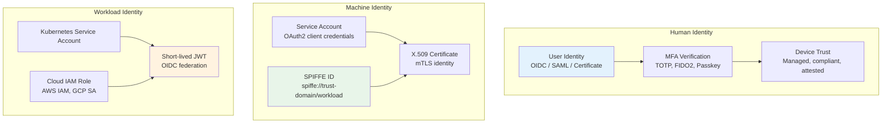
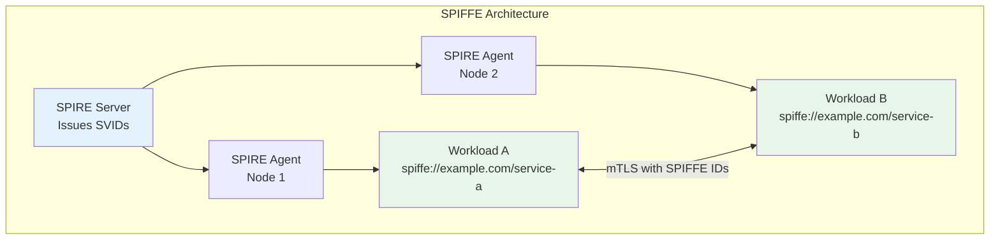
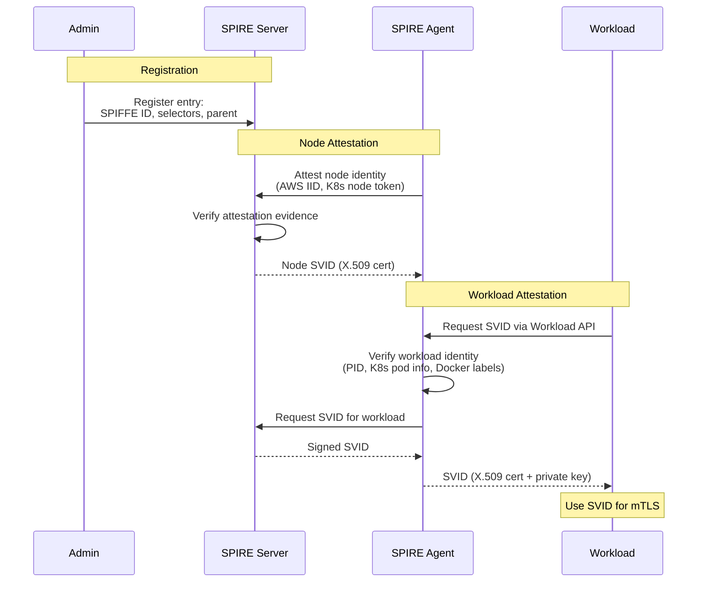

# Identity Verification

## Why Identity Verification Matters in Zero Trust

In a zero-trust world, the network location of a request tells you nothing about its legitimacy. Identity — verified cryptographically — is the foundation of every access decision. This applies to both human users and machine workloads. A Kubernetes pod making an API call needs a verifiable identity just as much as a human logging into a dashboard.

Identity verification answers three questions:
1. **Who** is making this request? (Authentication)
2. **What device** are they using? (Device trust)
3. **Which workload** is calling which service? (Workload identity)

## First Principles

### The Identity Hierarchy



### Device Trust Assessment

Device trust determines whether the device making the request meets security requirements:

| Signal | How Verified | Trust Impact |
|--------|-------------|-------------|
| Device certificate | TPM-backed X.509 | High — cryptographic proof of device identity |
| OS version | MDM agent reporting | Medium — shows patch compliance |
| Disk encryption | OS query via agent | High — protects data at rest |
| Firewall status | Agent check | Medium — network protection |
| Antivirus status | Agent check | Medium — malware protection |
| Jailbreak/root | Agent check | High — indicates compromise |
| Last check-in time | MDM timestamp | Medium — stale data is unreliable |

```typescript
interface DeviceTrustAssessment {
  deviceId: string;
  trustLevel: 'full' | 'partial' | 'untrusted';
  signals: {
    managed: boolean;
    certificateValid: boolean;
    osVersion: string;
    osPatchCurrent: boolean;
    diskEncrypted: boolean;
    firewallEnabled: boolean;
    antivirusActive: boolean;
    jailbroken: boolean;
    lastCheckIn: Date;
  };
  complianceScore: number; // 0-100
}

function assessDeviceTrust(signals: DeviceTrustAssessment['signals']): DeviceTrustAssessment['trustLevel'] {
  // Hard requirements
  if (signals.jailbroken) return 'untrusted';
  if (!signals.certificateValid) return 'untrusted';

  // Score-based assessment
  let score = 0;
  if (signals.managed) score += 25;
  if (signals.osPatchCurrent) score += 20;
  if (signals.diskEncrypted) score += 20;
  if (signals.firewallEnabled) score += 15;
  if (signals.antivirusActive) score += 10;

  // Freshness check
  const hoursSinceCheckIn = (Date.now() - signals.lastCheckIn.getTime()) / 3600000;
  if (hoursSinceCheckIn < 1) score += 10;
  else if (hoursSinceCheckIn > 24) score -= 20;

  if (score >= 80) return 'full';
  if (score >= 50) return 'partial';
  return 'untrusted';
}
```

## Core Mechanics

### SPIFFE (Secure Production Identity Framework for Everyone)

SPIFFE provides a standardized way to identify workloads across platforms:



**SPIFFE ID format**: `spiffe://trust-domain/path`

Examples:
- `spiffe://production.example.com/payment-service`
- `spiffe://staging.example.com/user-api`
- `spiffe://production.example.com/k8s/ns/default/sa/web-frontend`

**SVID (SPIFFE Verifiable Identity Document)**: An X.509 certificate or JWT containing the SPIFFE ID:

```
X.509 SVID:
  Subject: O=SPIRE
  URI SAN: spiffe://production.example.com/payment-service
  Validity: 1 hour (auto-renewed)
  Key: ECDSA P-256
```

### SPIRE Registration and Attestation



### SPIRE Deployment (Kubernetes)

```yaml
# SPIRE Server Deployment
apiVersion: apps/v1
kind: Deployment
metadata:
  name: spire-server
  namespace: spire
spec:
  replicas: 1
  selector:
    matchLabels:
      app: spire-server
  template:
    metadata:
      labels:
        app: spire-server
    spec:
      serviceAccountName: spire-server
      containers:
        - name: spire-server
          image: ghcr.io/spiffe/spire-server:1.9
          args: ["-config", "/run/spire/config/server.conf"]
          ports:
            - containerPort: 8081
          volumeMounts:
            - name: config
              mountPath: /run/spire/config
      volumes:
        - name: config
          configMap:
            name: spire-server-config
---
# SPIRE Server Configuration
apiVersion: v1
kind: ConfigMap
metadata:
  name: spire-server-config
  namespace: spire
data:
  server.conf: |
    server {
      bind_address = "0.0.0.0"
      bind_port = "8081"
      trust_domain = "production.example.com"
      data_dir = "/run/spire/data"
      log_level = "INFO"
      ca_ttl = "24h"
      default_x509_svid_ttl = "1h"
      default_jwt_svid_ttl = "5m"
    }

    plugins {
      DataStore "sql" {
        plugin_data {
          database_type = "sqlite3"
          connection_string = "/run/spire/data/datastore.sqlite3"
        }
      }
      NodeAttestor "k8s_psat" {
        plugin_data {
          clusters = {
            "production" = {
              service_account_allow_list = ["spire:spire-agent"]
            }
          }
        }
      }
      KeyManager "disk" {
        plugin_data {
          keys_path = "/run/spire/data/keys.json"
        }
      }
    }
```

### Workload Identity in Application Code

```typescript
import { SpiffeWorkloadApi } from '@spiffe/workload-api';
import https from 'node:https';
import tls from 'node:tls';

class SPIFFEIdentityClient {
  private workloadApi: SpiffeWorkloadApi;

  constructor(socketPath: string = 'unix:///tmp/spire-agent/public/api.sock') {
    this.workloadApi = new SpiffeWorkloadApi(socketPath);
  }

  /**
   * Get the current workload's SVID for mTLS.
   */
  async getSVID(): Promise<{
    spiffeId: string;
    certificate: Buffer;
    privateKey: Buffer;
    bundle: Buffer;
  }> {
    const svid = await this.workloadApi.fetchX509SVID();
    return {
      spiffeId: svid.spiffeId,
      certificate: svid.certificate,
      privateKey: svid.privateKey,
      bundle: svid.trustBundle,
    };
  }

  /**
   * Create an HTTPS server with SPIFFE mTLS.
   */
  async createMTLSServer(
    handler: (req: any, res: any) => void,
    allowedSpiffeIds: string[]
  ): Promise<https.Server> {
    const svid = await this.getSVID();

    const server = https.createServer({
      cert: svid.certificate,
      key: svid.privateKey,
      ca: svid.bundle,
      requestCert: true,
      rejectUnauthorized: true,
    }, (req, res) => {
      // Verify the caller's SPIFFE ID
      const clientCert = (req.socket as tls.TLSSocket).getPeerCertificate();
      const callerSpiffeId = this.extractSpiffeId(clientCert);

      if (!allowedSpiffeIds.includes(callerSpiffeId)) {
        res.writeHead(403);
        res.end('SPIFFE ID not authorized');
        return;
      }

      handler(req, res);
    });

    // Auto-rotate certificates
    this.watchCertificateRotation(server);

    return server;
  }

  /**
   * Make an mTLS request to another SPIFFE-identified service.
   */
  async makeRequest(url: string): Promise<string> {
    const svid = await this.getSVID();

    return new Promise((resolve, reject) => {
      const req = https.get(url, {
        cert: svid.certificate,
        key: svid.privateKey,
        ca: svid.bundle,
        rejectUnauthorized: true,
      }, (res) => {
        let data = '';
        res.on('data', chunk => data += chunk);
        res.on('end', () => resolve(data));
      });
      req.on('error', reject);
    });
  }

  private extractSpiffeId(cert: any): string {
    const sans = cert.subjectaltname ?? '';
    const uriMatch = sans.match(/URI:spiffe:\/\/[^,]+/);
    return uriMatch ? uriMatch[0].replace('URI:', '') : '';
  }

  private watchCertificateRotation(server: https.Server): void {
    // SPIRE agent rotates SVIDs automatically
    // Watch for new SVIDs and update the server's TLS context
    setInterval(async () => {
      try {
        const newSvid = await this.getSVID();
        const newContext = tls.createSecureContext({
          cert: newSvid.certificate,
          key: newSvid.privateKey,
          ca: newSvid.bundle,
        });
        // Update server context (using SNICallback trick)
        (server as any)._sharedCreds = newContext;
      } catch (error) {
        console.error('Failed to rotate certificate:', error);
      }
    }, 30000); // Check every 30 seconds
  }
}
```

## Edge Cases & Failure Modes

### SPIRE Agent Unavailability

| Scenario | Impact | Mitigation |
|----------|--------|------------|
| SPIRE agent crashes | New SVIDs cannot be fetched | Graceful degradation, cached SVIDs |
| SPIRE server unreachable | Agents cannot renew SVIDs | SVIDs have TTL, agent caches |
| Node attestation failure | New agents cannot join | Alert, manual re-attestation |
| SVID expiry during outage | mTLS connections fail | Monitor SVID expiry, set TTL > outage budget |

::: warning
**SVID TTL planning is critical.** If your SVID TTL is 1 hour and your SPIRE server can be down for up to 2 hours (maintenance window), existing SVIDs will expire, breaking all mTLS connections. Set TTL to at least 2x your maximum expected outage duration.
:::

### Device Certificate Compromise

If a device's TPM-backed certificate is compromised (device stolen):

1. Revoke the device certificate immediately
2. Add the certificate serial number to the CRL/OCSP responder
3. Force re-enrollment for any credentials issued to that device
4. Alert all connected services to reject the certificate

## Performance Characteristics

| Operation | Latency | Notes |
|-----------|---------|-------|
| SVID fetch (cached) | < 1ms | Agent caches current SVID |
| SVID fetch (renewal) | 10–50ms | Agent → Server round trip |
| SVID rotation | Background | No application downtime |
| mTLS handshake | 1–5ms | ECDSA P-256 key exchange |
| Device trust check (cached) | < 1ms | Agent reports periodically |
| SPIFFE ID validation | < 0.1ms | String comparison |

## Mathematical Foundations

### X.509 Certificate Chain Verification

SVID verification follows the standard X.509 chain validation:

$$
\text{Verify}_{CA_{PK}}(\text{Hash}(\text{TBS}), \sigma) = \text{true}
$$

For each certificate in the chain, verify the signature of the issuer. The trust chain terminates at a trust anchor (root CA) that is pre-distributed.

### SVID Freshness

The probability that a stolen SVID is still valid:

$$
P(\text{valid}) = \max\left(0, \frac{T_{\text{TTL}} - T_{\text{stolen}}}{T_{\text{TTL}}}\right)
$$

For a 1-hour SVID TTL, if stolen at a random time during its validity:

$$
E[P(\text{valid})] = \frac{1}{2} = 50\%
$$

Mean time until expiry: 30 minutes. With short TTLs, stolen SVIDs have very limited utility.

## Real-World War Stories

::: info War Story
**A Financial Services SPIFFE Deployment**

A large financial services firm deployed SPIRE across 3,000 microservices. The initial deployment used 24-hour SVID TTLs for operational safety. After 6 months of stability, they reduced TTLs to 1 hour, then to 15 minutes for high-security services.

The key challenge was ensuring that all services could handle certificate rotation without connection drops. They discovered that several legacy services cached TLS connections indefinitely and didn't re-handshake. These services required code changes to implement periodic TLS renegotiation.

**Lesson**: Start with longer SVID TTLs and tighten over time. Ensure all services handle certificate rotation gracefully before reducing TTLs.
:::

::: info War Story
**Device Trust and the COVID Remote Work Surge**

When COVID-19 forced remote work, a tech company's Zero Trust device trust system rejected 40% of employee devices. Home computers were unmanaged, unpatched, and running consumer antivirus (or none). The company had to rapidly deploy a lightweight agent that could assess device health without full MDM enrollment.

**Resolution**: They created a "bring your own device" trust tier with reduced access — employees on unmanaged devices could access email and collaboration tools but not production systems or customer data. Managed devices retained full access.
:::

## Decision Framework

### Choosing a Workload Identity Solution

| Factor | SPIFFE/SPIRE | Kubernetes SA | Cloud IAM | Custom Certificates |
|--------|-------------|---------------|-----------|-------------------|
| Cross-platform | Yes | Kubernetes only | Cloud-specific | Manual |
| Auto-rotation | Yes | Projected tokens | Automatic | Manual |
| mTLS support | Native | Via Istio/Linkerd | Limited | Manual |
| Standardization | CNCF standard | Kubernetes standard | Proprietary | Custom |
| Complexity | Medium | Low | Low | High |

## Advanced Topics

### Federated Identity Across Trust Domains

SPIFFE supports federation between trust domains, enabling cross-organization mTLS:

```
Trust Domain A: spiffe://company-a.com
Trust Domain B: spiffe://company-b.com

Federation bundle exchange:
  Company A publishes its trust bundle at https://company-a.com/.well-known/spiffe-bundle
  Company B publishes its trust bundle at https://company-b.com/.well-known/spiffe-bundle

After federation:
  spiffe://company-a.com/payment-service can authenticate to
  spiffe://company-b.com/merchant-api via mTLS
```

### Hardware-Backed Identity (TPM Attestation)

```typescript
// TPM-based device attestation flow
interface TPMAttestation {
  // Endorsement Key certificate (burned into TPM at manufacture)
  ekCert: Buffer;
  // Attestation Identity Key (derived from EK, per-session)
  aikPublicKey: Buffer;
  // Platform Configuration Registers (PCR values)
  pcrDigest: Buffer;
  // Quote: PCR values signed by AIK
  quote: Buffer;
  quoteSignature: Buffer;
}

async function verifyTPMAttestation(attestation: TPMAttestation): Promise<{
  trusted: boolean;
  deviceId: string;
  bootIntegrity: boolean;
}> {
  // 1. Verify EK certificate chain (manufacturer → TPM)
  const ekValid = await verifyCertificateChain(attestation.ekCert, tpmRootCAs);

  // 2. Verify the quote signature using AIK
  const quoteValid = verifySignature(
    attestation.quote,
    attestation.quoteSignature,
    attestation.aikPublicKey
  );

  // 3. Verify PCR values match expected boot configuration
  const expectedPCRs = getExpectedPCRValues();
  const bootIntegrity = attestation.pcrDigest.equals(expectedPCRs);

  return {
    trusted: ekValid && quoteValid && bootIntegrity,
    deviceId: computeDeviceId(attestation.ekCert),
    bootIntegrity,
  };
}
```

## Cross-References

- [Zero Trust Principles](/security/zero-trust/principles) — Core philosophy
- [Encryption in Transit](/security/encryption/encryption-in-transit) — mTLS details
- [Biometric Auth](/security/authentication/biometric-auth) — Human identity verification
- [Network Segmentation](/security/zero-trust/network-segmentation) — SPIFFE in service mesh
- [Least Privilege](/security/zero-trust/least-privilege) — Access control based on identity
- [Continuous Verification](/security/zero-trust/continuous-verification) — Ongoing trust assessment
