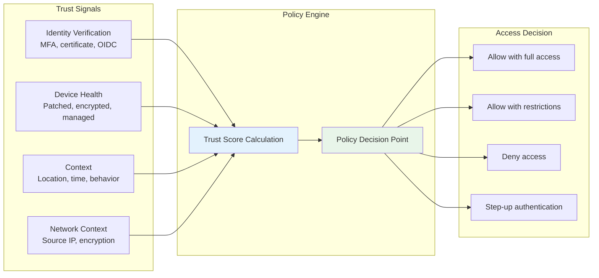
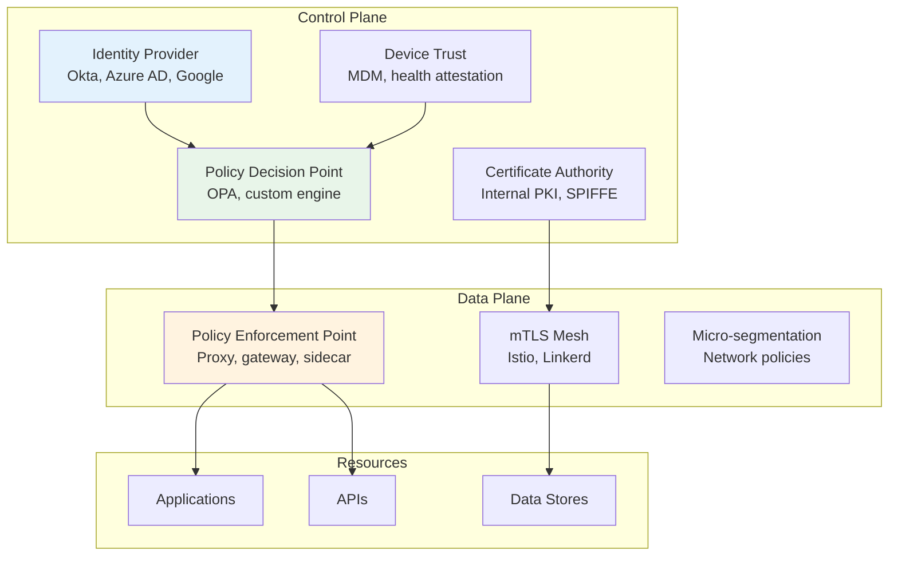
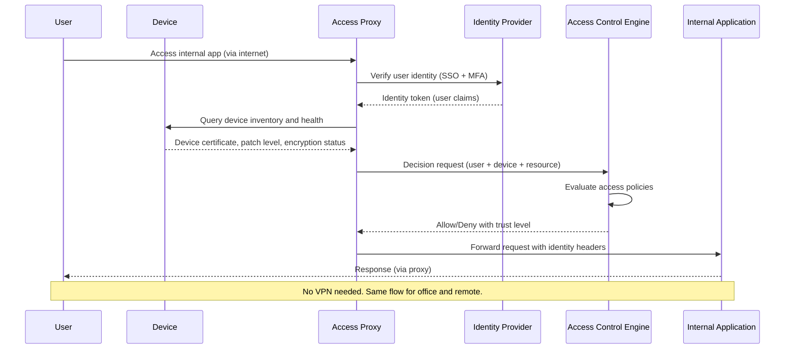
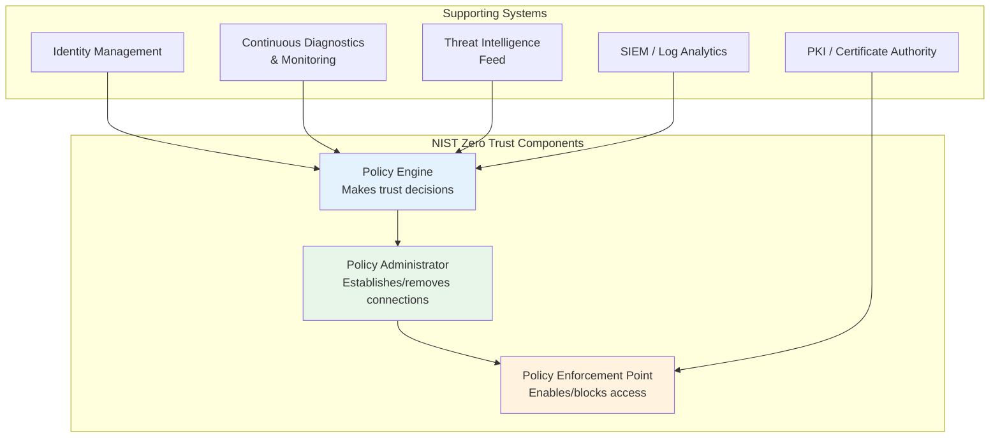

# Zero Trust Overview

## Why Zero Trust Exists

Traditional network security operates on a "castle and moat" model — a hardened perimeter (firewall) protects a trusted internal network. Once inside the perimeter, everything is trusted. This model fails catastrophically in the modern world because:

1. **Cloud computing** dissolves the perimeter — workloads run across multiple clouds and data centers
2. **Remote work** puts users outside the perimeter permanently
3. **Lateral movement** — once an attacker breaches the perimeter, they move freely inside
4. **Supply chain attacks** compromise trusted software inside the perimeter
5. **Insider threats** originate inside the "trusted" network

Zero Trust replaces the perimeter model with a fundamentally different assumption: **never trust, always verify**. Every request is authenticated, authorized, and encrypted regardless of its origin — whether from inside or outside the network.

### Historical Context

| Year | Development |
|------|-------------|
| 2004 | Jericho Forum coins "de-perimeterization" |
| 2010 | Forrester's John Kindervag defines "Zero Trust" |
| 2011 | Google begins BeyondCorp initiative |
| 2014 | Google publishes BeyondCorp research papers |
| 2017 | Gartner introduces CARTA (Continuous Adaptive Risk and Trust Assessment) |
| 2020 | NIST publishes SP 800-207 Zero Trust Architecture |
| 2021 | US Executive Order 14028 mandates federal Zero Trust adoption |
| 2022 | CISA publishes Zero Trust Maturity Model |
| 2023–2025 | Zero Trust becomes the default architecture for new deployments |

## First Principles

### The Zero Trust Axioms

1. **All networks are hostile** — internal networks are as untrusted as the internet
2. **All devices are potentially compromised** — endpoint state must be continuously verified
3. **All users are potentially impersonated** — identity must be cryptographically verified
4. **All communication must be encrypted** — no exceptions for "internal" traffic
5. **Access is granted per-session, per-resource** — no blanket network access
6. **Least privilege** — minimum access needed for the task, no more

### The Core Equation

$$
\text{Trust Level} = f(\text{Identity}, \text{Device Health}, \text{Context}, \text{Time})
$$

Trust is not binary (trusted/untrusted) but a continuous spectrum recalculated for every request:



### Zero Trust Architecture Components



## Core Mechanics

### BeyondCorp Model (Google's Implementation)

Google's BeyondCorp is the most influential Zero Trust implementation:



### NIST SP 800-207 Architecture



## Implementation

### Zero Trust Policy Engine (TypeScript)

```typescript
interface TrustSignals {
  identity: {
    userId: string;
    authMethod: 'password' | 'mfa' | 'passkey' | 'certificate';
    authTime: Date;
    idpProvider: string;
    riskScore: number; // 0-100 from IDP
  };
  device: {
    deviceId: string;
    managed: boolean;
    osVersion: string;
    patchLevel: 'current' | 'behind-1' | 'behind-2+' | 'unknown';
    diskEncrypted: boolean;
    firewallEnabled: boolean;
    complianceStatus: 'compliant' | 'non-compliant' | 'unknown';
  };
  context: {
    sourceIP: string;
    geoLocation: string;
    timeOfDay: number; // 0-23
    isVPN: boolean;
    networkType: 'corporate' | 'home' | 'public' | 'unknown';
  };
  resource: {
    path: string;
    sensitivity: 'public' | 'internal' | 'confidential' | 'restricted';
    action: 'read' | 'write' | 'delete' | 'admin';
  };
}

type AccessDecision = {
  allowed: boolean;
  trustScore: number;
  conditions?: string[];
  reason: string;
};

class ZeroTrustPolicyEngine {
  evaluate(signals: TrustSignals): AccessDecision {
    let trustScore = 100;
    const conditions: string[] = [];

    // Identity scoring
    if (signals.identity.authMethod === 'password') {
      trustScore -= 30; // Passwords are weak
      conditions.push('step-up-auth-recommended');
    }
    if (signals.identity.authMethod === 'passkey' || signals.identity.authMethod === 'certificate') {
      trustScore += 10; // Phishing-resistant
    }

    const authAge = Date.now() - signals.identity.authTime.getTime();
    if (authAge > 8 * 60 * 60 * 1000) { // 8 hours
      trustScore -= 20;
      conditions.push('re-authentication-required');
    }

    trustScore -= signals.identity.riskScore * 0.5;

    // Device scoring
    if (!signals.device.managed) trustScore -= 20;
    if (!signals.device.diskEncrypted) trustScore -= 15;
    if (signals.device.patchLevel === 'behind-2+') trustScore -= 25;
    if (signals.device.patchLevel === 'unknown') trustScore -= 30;
    if (signals.device.complianceStatus === 'non-compliant') trustScore -= 35;

    // Context scoring
    if (signals.context.networkType === 'public') trustScore -= 10;
    if (signals.context.isVPN) trustScore += 5; // Slight bonus

    // Resource sensitivity threshold
    const thresholds: Record<string, number> = {
      'public': 20,
      'internal': 50,
      'confidential': 70,
      'restricted': 85,
    };

    const requiredScore = thresholds[signals.resource.sensitivity] ?? 50;
    if (signals.resource.action === 'write') requiredScore + 10;
    if (signals.resource.action === 'delete') requiredScore + 15;
    if (signals.resource.action === 'admin') requiredScore + 20;

    const allowed = trustScore >= requiredScore;

    return {
      allowed,
      trustScore: Math.max(0, Math.min(100, trustScore)),
      conditions: conditions.length > 0 ? conditions : undefined,
      reason: allowed
        ? `Trust score ${trustScore} meets threshold ${requiredScore}`
        : `Trust score ${trustScore} below threshold ${requiredScore}`,
    };
  }
}
```

### Express Middleware for Zero Trust

```typescript
import { Request, Response, NextFunction } from 'express';

function zeroTrustMiddleware(policyEngine: ZeroTrustPolicyEngine) {
  return async (req: Request, res: Response, next: NextFunction) => {
    const signals = await gatherTrustSignals(req);
    const decision = policyEngine.evaluate(signals);

    // Log the decision for audit
    console.log(JSON.stringify({
      timestamp: new Date().toISOString(),
      action: 'access_decision',
      user: signals.identity.userId,
      device: signals.device.deviceId,
      resource: signals.resource.path,
      trustScore: decision.trustScore,
      allowed: decision.allowed,
      reason: decision.reason,
    }));

    if (!decision.allowed) {
      if (decision.conditions?.includes('re-authentication-required')) {
        res.status(401).json({
          error: 'Re-authentication required',
          challenge: 'step-up',
        });
        return;
      }
      res.status(403).json({
        error: 'Access denied',
        trustScore: decision.trustScore,
      });
      return;
    }

    // Attach trust context for downstream services
    (req as any).trustContext = {
      score: decision.trustScore,
      conditions: decision.conditions,
      identity: signals.identity,
    };

    next();
  };
}
```

## Edge Cases & Failure Modes

### Policy Engine Unavailability

If the policy engine is down, should access be denied (fail-closed) or allowed (fail-open)?

| Approach | Security | Availability | Recommendation |
|----------|----------|-------------|----------------|
| Fail-closed | Secure | Blocks all access | Default for restricted resources |
| Fail-open | Insecure | Maintains access | Only for public/non-sensitive resources |
| Cached decisions | Moderate | Time-limited access | Recommended with short TTL |

### Trust Score Gaming

An attacker who understands the scoring model could manipulate signals:
- Use a VPN to change geo-location
- Spoof device health reports
- Time attacks for favorable context scores

**Mitigation**: Use cryptographic attestation (TPM, Secure Enclave) for device health, and anomaly detection for behavioral signals.

## Performance Characteristics

### Decision Latency

| Component | Latency | Notes |
|-----------|---------|-------|
| Policy evaluation (in-memory) | < 1ms | Rule engine execution |
| Identity verification (cached) | 0ms | Token validation |
| Device health query (cached) | 0ms | Agent reports periodically |
| Full decision (uncached) | 10–50ms | All lookups required |
| Full decision (cached) | 1–5ms | Typical production |

## Mathematical Foundations

### Trust Score as Bayesian Inference

The trust score can be modeled as a posterior probability:

$$
P(\text{legitimate} | \text{signals}) = \frac{P(\text{signals} | \text{legitimate}) \cdot P(\text{legitimate})}{P(\text{signals})}
$$

Each signal updates the prior probability. Strong authentication increases $P(\text{legitimate})$, while anomalous context decreases it.

## Real-World War Stories

::: info War Story
**Google's BeyondCorp Migration**

Google migrated 100,000+ employees from VPN-based access to BeyondCorp over 8 years (2011–2019). The key challenge was that internal applications assumed network-level trust — they accepted any request from the corporate network without additional authentication.

The migration required instrumenting every application with identity-aware access controls, deploying device certificates to every endpoint, and building an access proxy that could handle millions of requests per second.

**Lesson**: Zero Trust is a multi-year journey, not a product you install. Start with your most critical applications and expand incrementally.
:::

::: info War Story
**SolarWinds Attack (2020)**

The SolarWinds breach demonstrated the failure of perimeter-based security. Attackers compromised the SolarWinds Orion build system and inserted malware into a software update. Because the update came from a "trusted" internal source, it was distributed to 18,000 organizations, including multiple US government agencies.

In a Zero Trust model, the malicious update would still need to authenticate to each resource it accessed, and anomalous behavior (beaconing, lateral movement) would trigger alerts.

**Lesson**: Trust should never be granted based on network location or source identity alone. Continuous verification of behavior is essential.
:::

## Decision Framework

### Zero Trust Maturity Model (CISA)

| Level | Identity | Devices | Networks | Apps/Workloads | Data |
|-------|----------|---------|----------|----------------|------|
| **Traditional** | Passwords, basic MFA | Minimal visibility | Perimeter firewall | Monolithic, on-prem | Classification TBD |
| **Initial** | MFA everywhere | Device inventory | Some segmentation | Cloud-ready | Classification exists |
| **Advanced** | Phishing-resistant MFA | Continuous health checks | Micro-segmentation | Identity-aware proxies | Encryption at rest |
| **Optimal** | Continuous auth, risk-based | Real-time compliance | mTLS everywhere | Zero Trust access broker | E2E encryption |

## Section Index

| Page | Topic |
|------|-------|
| [Principles](/security/zero-trust/principles) | Never trust always verify, BeyondCorp deep dive |
| [Identity Verification](/security/zero-trust/identity-verification) | Device trust, SPIFFE/SPIRE |
| [Network Segmentation](/security/zero-trust/network-segmentation) | Micro-segmentation, ZTNA vs VPN |
| [Least Privilege](/security/zero-trust/least-privilege) | RBAC, ABAC, ReBAC |
| [Continuous Verification](/security/zero-trust/continuous-verification) | Continuous auth, behavioral analysis |

## Cross-References

- [Encryption in Transit](/security/encryption/encryption-in-transit) — mTLS as Zero Trust foundation
- [Passwordless Authentication](/security/authentication/passwordless) — Phishing-resistant auth
- [Biometric Auth](/security/authentication/biometric-auth) — Continuous verification
- [Network Segmentation](/security/zero-trust/network-segmentation) — Micro-segmentation
- [API Security](/security/api-security/) — API-level Zero Trust
