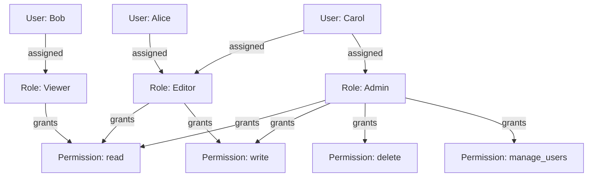
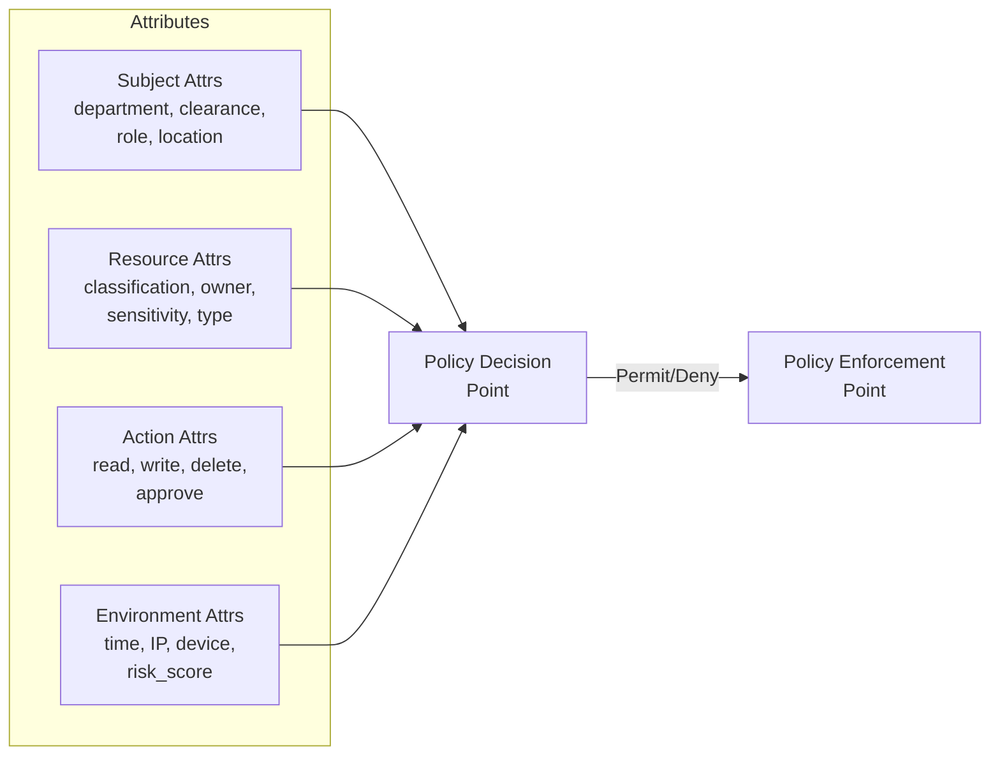
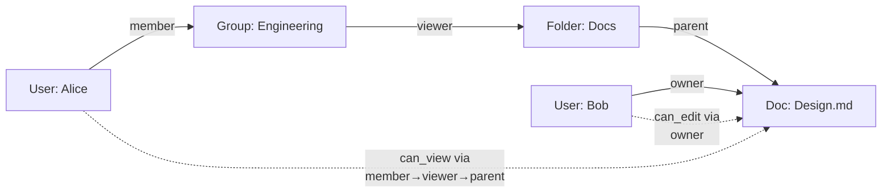
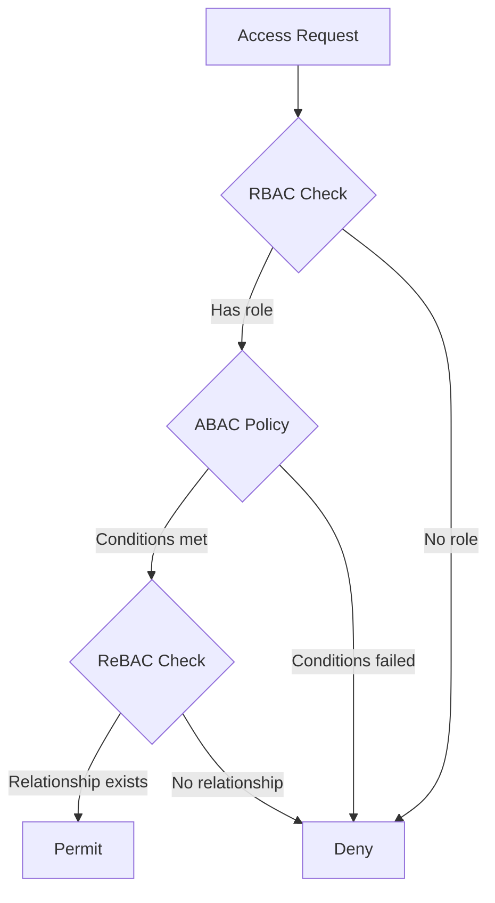

# Least Privilege & Access Control Models

## Why It Exists

The principle of least privilege (PoLP) states that every identity — human or machine — should receive only the minimum permissions necessary to perform its function, and only for the duration needed. Violations of this principle are behind the majority of breaches: the 2020 SolarWinds attack leveraged overprivileged service accounts, the 2019 Capital One breach exploited an IAM role with excessive S3 access, and countless internal incidents trace back to "convenience" permissions that were never revoked.

Historically, access control began with simple access control lists (ACLs) in early Unix systems. As organizations grew, Role-Based Access Control (RBAC) emerged in the 1990s to manage permissions at scale. But RBAC proved too coarse for modern cloud-native environments, leading to Attribute-Based Access Control (ABAC) and Relationship-Based Access Control (ReBAC). Each model trades off simplicity against expressiveness, and choosing the wrong one creates either security gaps or operational nightmares.

In a zero-trust architecture, least privilege is not a suggestion — it is an enforcement requirement at every layer: network, application, data, and infrastructure.

## First Principles

### The Permission Hierarchy

Every access control decision answers three questions:

1. **Who** is requesting access? (Subject/Principal)
2. **What** are they trying to access? (Resource/Object)
3. **How** are they trying to access it? (Action/Operation)

The models differ in how they answer a fourth question: **Why** should access be granted?

- **RBAC**: Because the subject has a role that includes this permission
- **ABAC**: Because the subject's attributes satisfy a policy condition
- **ReBAC**: Because there exists a relationship path between subject and resource

### The Principle Formally Stated

$$
\text{Permissions}(s) = \min\{P \subseteq \mathcal{P} \mid \text{Task}(s) \text{ is completable with } P\}
$$

Where $s$ is a subject, $\mathcal{P}$ is the universe of all permissions, and $\text{Task}(s)$ is the set of operations the subject must perform. The principle demands that we find the minimal subset $P$ that still allows task completion.

### Blast Radius Analysis

The blast radius of a compromised identity is directly proportional to its excess permissions:

$$
\text{BlastRadius}(s) = |\text{Permissions}(s)| - |\text{MinimalPermissions}(s)|
$$

Zero-trust architectures aim to drive this toward zero for every identity.

## Core Mechanics

### RBAC — Role-Based Access Control

RBAC assigns permissions to roles, and roles to users. This indirection simplifies management but creates rigidity.



#### RBAC Formal Model (NIST RBAC)

The NIST RBAC standard defines four levels:

- **Core RBAC**: Users, roles, permissions, sessions
- **Hierarchical RBAC**: Role inheritance (senior roles inherit junior permissions)
- **Constrained RBAC**: Separation of duty (static and dynamic)
- **Symmetric RBAC**: Permission-role review (bidirectional queries)

$$
\text{authorized\_permissions}(s) = \bigcup_{r \in \text{session\_roles}(s)} \text{permissions}(r)
$$

With hierarchical RBAC and role inheritance ($\geq$ denoting seniority):

$$
\text{permissions}(r) = \{p \mid \exists r' \leq r : (p, r') \in PA\}
$$

Where $PA$ is the permission-assignment relation.

### ABAC — Attribute-Based Access Control

ABAC evaluates policies against attributes of the subject, resource, action, and environment. It is far more expressive than RBAC.



#### XACML Policy Structure

ABAC policies follow a hierarchical structure:

1. **PolicySet**: Contains multiple policies, combined via algorithms
2. **Policy**: Contains multiple rules, combined via algorithms
3. **Rule**: A single condition-effect pair (Permit or Deny)

Combining algorithms determine how conflicting rules resolve:
- **Deny-overrides**: Any deny wins (most restrictive)
- **Permit-overrides**: Any permit wins (most permissive)
- **First-applicable**: First matching rule wins
- **Only-one-applicable**: Exactly one policy must match

### ReBAC — Relationship-Based Access Control

ReBAC models permissions as graph traversals. Access is granted if a path exists between the subject and resource through defined relationships.



ReBAC is the model behind Google Zanzibar, which powers authorization for Google Drive, YouTube, and Cloud IAM. It excels at hierarchical, shareable resources.

#### Zanzibar Data Model

Relationships are stored as tuples:

```
<object>#<relation>@<user>
```

For example:
```
doc:design#viewer@user:alice
folder:docs#viewer@group:engineering#member
group:engineering#member@user:alice
```

Permission checks traverse the graph:

$$
\text{check}(u, r, o) = \exists \text{ path } u \xrightarrow{relations} o \text{ granting } r
$$

## Implementation

### Production RBAC System in TypeScript

```typescript
// types.ts - Core RBAC types
interface Permission {
  resource: string;
  action: 'create' | 'read' | 'update' | 'delete' | 'list' | 'manage';
  conditions?: PermissionCondition[];
}

interface PermissionCondition {
  field: string;
  operator: 'eq' | 'neq' | 'in' | 'not_in' | 'gt' | 'lt' | 'contains';
  value: unknown;
}

interface Role {
  name: string;
  description: string;
  permissions: Permission[];
  inherits?: string[];
}

interface RoleAssignment {
  userId: string;
  role: string;
  scope?: string; // e.g., "org:acme" or "project:frontend"
  expiresAt?: Date;
}

// rbac-engine.ts - RBAC enforcement engine
class RBACEngine {
  private roles: Map<string, Role> = new Map();
  private assignments: Map<string, RoleAssignment[]> = new Map();
  private permissionCache: Map<string, Permission[]> = new Map();

  registerRole(role: Role): void {
    this.roles.set(role.name, role);
    this.permissionCache.clear(); // Invalidate cache on role change
  }

  assignRole(assignment: RoleAssignment): void {
    const existing = this.assignments.get(assignment.userId) || [];

    // Check for conflicting assignments (SoD enforcement)
    this.enforceStaticSoD(assignment, existing);

    existing.push(assignment);
    this.assignments.set(assignment.userId, existing);
  }

  private enforceStaticSoD(
    newAssignment: RoleAssignment,
    existing: RoleAssignment[]
  ): void {
    const sodConstraints: [string, string][] = [
      ['finance_approver', 'finance_requester'],
      ['admin', 'auditor'],
      ['developer', 'production_deployer'],
    ];

    for (const [roleA, roleB] of sodConstraints) {
      const hasConflict =
        (newAssignment.role === roleA && existing.some(a => a.role === roleB)) ||
        (newAssignment.role === roleB && existing.some(a => a.role === roleA));

      if (hasConflict) {
        throw new Error(
          `Static SoD violation: ${roleA} and ${roleB} cannot be assigned to the same user`
        );
      }
    }
  }

  /**
   * Resolve all permissions for a role, including inherited permissions.
   * Uses DFS with cycle detection.
   */
  private resolvePermissions(roleName: string, visited = new Set<string>()): Permission[] {
    if (this.permissionCache.has(roleName)) {
      return this.permissionCache.get(roleName)!;
    }

    if (visited.has(roleName)) {
      throw new Error(`Circular role inheritance detected: ${roleName}`);
    }
    visited.add(roleName);

    const role = this.roles.get(roleName);
    if (!role) return [];

    let permissions = [...role.permissions];

    if (role.inherits) {
      for (const parentRole of role.inherits) {
        const inherited = this.resolvePermissions(parentRole, visited);
        permissions = [...permissions, ...inherited];
      }
    }

    // Deduplicate
    const unique = this.deduplicatePermissions(permissions);
    this.permissionCache.set(roleName, unique);
    return unique;
  }

  private deduplicatePermissions(permissions: Permission[]): Permission[] {
    const seen = new Set<string>();
    return permissions.filter(p => {
      const key = `${p.resource}:${p.action}`;
      if (seen.has(key)) return false;
      seen.add(key);
      return true;
    });
  }

  /**
   * Check if a user is authorized for a specific action on a resource.
   */
  check(
    userId: string,
    resource: string,
    action: Permission['action'],
    context?: Record<string, unknown>
  ): AuthzDecision {
    const assignments = this.assignments.get(userId) || [];
    const now = new Date();

    // Filter expired assignments
    const activeAssignments = assignments.filter(
      a => !a.expiresAt || a.expiresAt > now
    );

    for (const assignment of activeAssignments) {
      const permissions = this.resolvePermissions(assignment.role);

      for (const perm of permissions) {
        if (this.matchesPermission(perm, resource, action, context)) {
          return {
            allowed: true,
            reason: `Granted via role '${assignment.role}'`,
            role: assignment.role,
            scope: assignment.scope,
          };
        }
      }
    }

    return {
      allowed: false,
      reason: `No role grants ${action} on ${resource}`,
    };
  }

  private matchesPermission(
    perm: Permission,
    resource: string,
    action: Permission['action'],
    context?: Record<string, unknown>
  ): boolean {
    // Check resource match (supports wildcards)
    if (!this.matchResource(perm.resource, resource)) return false;

    // Check action match
    if (perm.action !== action && perm.action !== 'manage') return false;

    // Check conditions
    if (perm.conditions && context) {
      return perm.conditions.every(c => this.evaluateCondition(c, context));
    }

    return !perm.conditions || perm.conditions.length === 0;
  }

  private matchResource(pattern: string, resource: string): boolean {
    if (pattern === '*') return true;
    if (pattern === resource) return true;

    // Support wildcard patterns like "documents:*"
    if (pattern.endsWith(':*')) {
      const prefix = pattern.slice(0, -2);
      return resource.startsWith(prefix);
    }

    return false;
  }

  private evaluateCondition(
    condition: PermissionCondition,
    context: Record<string, unknown>
  ): boolean {
    const value = context[condition.field];

    switch (condition.operator) {
      case 'eq': return value === condition.value;
      case 'neq': return value !== condition.value;
      case 'in': return Array.isArray(condition.value) && condition.value.includes(value);
      case 'not_in': return Array.isArray(condition.value) && !condition.value.includes(value);
      case 'gt': return typeof value === 'number' && value > (condition.value as number);
      case 'lt': return typeof value === 'number' && value < (condition.value as number);
      case 'contains':
        return typeof value === 'string' && value.includes(condition.value as string);
      default: return false;
    }
  }
}

interface AuthzDecision {
  allowed: boolean;
  reason: string;
  role?: string;
  scope?: string;
}
```

### Production ABAC Policy Engine

```typescript
// abac-engine.ts - Full ABAC policy engine
interface ABACPolicy {
  id: string;
  name: string;
  description: string;
  priority: number;
  target: PolicyTarget;
  rules: PolicyRule[];
  combiningAlgorithm: 'deny-overrides' | 'permit-overrides' | 'first-applicable';
}

interface PolicyTarget {
  subjects?: AttributeMatcher[];
  resources?: AttributeMatcher[];
  actions?: string[];
  environments?: AttributeMatcher[];
}

interface AttributeMatcher {
  attribute: string;
  operator: 'eq' | 'neq' | 'in' | 'contains' | 'matches' | 'gt' | 'lt' | 'between';
  value: unknown;
}

interface PolicyRule {
  id: string;
  effect: 'permit' | 'deny';
  condition?: PolicyCondition;
  obligations?: Obligation[];
}

interface PolicyCondition {
  type: 'and' | 'or' | 'not' | 'comparison';
  children?: PolicyCondition[];
  comparison?: AttributeMatcher & { subjectAttr?: string; resourceAttr?: string };
}

interface Obligation {
  type: 'log' | 'notify' | 'mfa_required' | 'encrypt_response' | 'time_limit';
  parameters: Record<string, unknown>;
}

interface ABACRequest {
  subject: Record<string, unknown>;
  resource: Record<string, unknown>;
  action: string;
  environment: Record<string, unknown>;
}

interface ABACResponse {
  decision: 'permit' | 'deny' | 'not_applicable' | 'indeterminate';
  obligations: Obligation[];
  matchedPolicy?: string;
  evaluationTimeMs: number;
}

class ABACEngine {
  private policies: ABACPolicy[] = [];
  private evaluationMetrics = {
    totalEvaluations: 0,
    avgTimeMs: 0,
    cacheHits: 0,
  };

  // LRU cache for recent decisions
  private decisionCache = new Map<string, { response: ABACResponse; expiry: number }>();
  private readonly CACHE_TTL_MS = 30_000; // 30 seconds
  private readonly MAX_CACHE_SIZE = 10_000;

  addPolicy(policy: ABACPolicy): void {
    this.policies.push(policy);
    this.policies.sort((a, b) => a.priority - b.priority);
    this.decisionCache.clear();
  }

  evaluate(request: ABACRequest): ABACResponse {
    const startTime = performance.now();

    // Check cache
    const cacheKey = this.computeCacheKey(request);
    const cached = this.decisionCache.get(cacheKey);
    if (cached && cached.expiry > Date.now()) {
      this.evaluationMetrics.cacheHits++;
      return cached.response;
    }

    let finalDecision: ABACResponse = {
      decision: 'not_applicable',
      obligations: [],
      evaluationTimeMs: 0,
    };

    for (const policy of this.policies) {
      if (!this.matchesTarget(policy.target, request)) {
        continue;
      }

      const policyResult = this.evaluatePolicy(policy, request);
      if (policyResult.decision !== 'not_applicable') {
        finalDecision = policyResult;
        break; // First applicable matching policy
      }
    }

    finalDecision.evaluationTimeMs = performance.now() - startTime;
    this.updateMetrics(finalDecision.evaluationTimeMs);

    // Cache the decision
    this.cacheDecision(cacheKey, finalDecision);

    return finalDecision;
  }

  private evaluatePolicy(policy: ABACPolicy, request: ABACRequest): ABACResponse {
    const ruleResults: Array<{ effect: 'permit' | 'deny'; obligations: Obligation[] }> = [];

    for (const rule of policy.rules) {
      if (!rule.condition || this.evaluateCondition(rule.condition, request)) {
        ruleResults.push({
          effect: rule.effect,
          obligations: rule.obligations || [],
        });
      }
    }

    if (ruleResults.length === 0) {
      return { decision: 'not_applicable', obligations: [], evaluationTimeMs: 0 };
    }

    return this.combineResults(ruleResults, policy.combiningAlgorithm, policy.id);
  }

  private combineResults(
    results: Array<{ effect: 'permit' | 'deny'; obligations: Obligation[] }>,
    algorithm: ABACPolicy['combiningAlgorithm'],
    policyId: string
  ): ABACResponse {
    const allObligations: Obligation[] = [];

    switch (algorithm) {
      case 'deny-overrides': {
        const hasDeny = results.some(r => r.effect === 'deny');
        if (hasDeny) {
          const denyResult = results.find(r => r.effect === 'deny')!;
          allObligations.push(...denyResult.obligations);
          return { decision: 'deny', obligations: allObligations, matchedPolicy: policyId, evaluationTimeMs: 0 };
        }
        const hasPermit = results.some(r => r.effect === 'permit');
        if (hasPermit) {
          results.filter(r => r.effect === 'permit').forEach(r => allObligations.push(...r.obligations));
          return { decision: 'permit', obligations: allObligations, matchedPolicy: policyId, evaluationTimeMs: 0 };
        }
        return { decision: 'not_applicable', obligations: [], evaluationTimeMs: 0 };
      }

      case 'permit-overrides': {
        const hasPermit = results.some(r => r.effect === 'permit');
        if (hasPermit) {
          results.filter(r => r.effect === 'permit').forEach(r => allObligations.push(...r.obligations));
          return { decision: 'permit', obligations: allObligations, matchedPolicy: policyId, evaluationTimeMs: 0 };
        }
        return { decision: 'deny', obligations: allObligations, matchedPolicy: policyId, evaluationTimeMs: 0 };
      }

      case 'first-applicable':
        return {
          decision: results[0].effect,
          obligations: results[0].obligations,
          matchedPolicy: policyId,
          evaluationTimeMs: 0,
        };

      default:
        return { decision: 'indeterminate', obligations: [], evaluationTimeMs: 0 };
    }
  }

  private evaluateCondition(condition: PolicyCondition, request: ABACRequest): boolean {
    switch (condition.type) {
      case 'and':
        return (condition.children || []).every(c => this.evaluateCondition(c, request));
      case 'or':
        return (condition.children || []).some(c => this.evaluateCondition(c, request));
      case 'not':
        return !(condition.children || []).some(c => this.evaluateCondition(c, request));
      case 'comparison':
        return this.evaluateComparison(condition.comparison!, request);
      default:
        return false;
    }
  }

  private evaluateComparison(
    comparison: AttributeMatcher & { subjectAttr?: string; resourceAttr?: string },
    request: ABACRequest
  ): boolean {
    let actualValue: unknown;

    if (comparison.subjectAttr) {
      actualValue = this.resolveAttribute(request.subject, comparison.subjectAttr);
    } else if (comparison.resourceAttr) {
      actualValue = this.resolveAttribute(request.resource, comparison.resourceAttr);
    } else {
      actualValue = this.resolveAttribute(
        { ...request.subject, ...request.resource, ...request.environment },
        comparison.attribute
      );
    }

    return this.evaluateMatcher(comparison, actualValue);
  }

  private resolveAttribute(obj: Record<string, unknown>, path: string): unknown {
    return path.split('.').reduce((current: any, key) => current?.[key], obj);
  }

  private evaluateMatcher(matcher: AttributeMatcher, actualValue: unknown): boolean {
    switch (matcher.operator) {
      case 'eq': return actualValue === matcher.value;
      case 'neq': return actualValue !== matcher.value;
      case 'in': return Array.isArray(matcher.value) && matcher.value.includes(actualValue);
      case 'gt': return typeof actualValue === 'number' && actualValue > (matcher.value as number);
      case 'lt': return typeof actualValue === 'number' && actualValue < (matcher.value as number);
      case 'contains':
        return typeof actualValue === 'string' && actualValue.includes(matcher.value as string);
      case 'matches':
        return typeof actualValue === 'string' && new RegExp(matcher.value as string).test(actualValue);
      case 'between': {
        const [min, max] = matcher.value as [number, number];
        return typeof actualValue === 'number' && actualValue >= min && actualValue <= max;
      }
      default: return false;
    }
  }

  private matchesTarget(target: PolicyTarget, request: ABACRequest): boolean {
    if (target.actions && !target.actions.includes(request.action)) return false;

    if (target.subjects) {
      const subjectMatch = target.subjects.every(m =>
        this.evaluateMatcher(m, this.resolveAttribute(request.subject, m.attribute))
      );
      if (!subjectMatch) return false;
    }

    if (target.resources) {
      const resourceMatch = target.resources.every(m =>
        this.evaluateMatcher(m, this.resolveAttribute(request.resource, m.attribute))
      );
      if (!resourceMatch) return false;
    }

    return true;
  }

  private computeCacheKey(request: ABACRequest): string {
    return JSON.stringify({
      s: request.subject,
      r: request.resource,
      a: request.action,
    });
  }

  private cacheDecision(key: string, response: ABACResponse): void {
    if (this.decisionCache.size >= this.MAX_CACHE_SIZE) {
      const firstKey = this.decisionCache.keys().next().value;
      if (firstKey !== undefined) {
        this.decisionCache.delete(firstKey);
      }
    }
    this.decisionCache.set(key, { response, expiry: Date.now() + this.CACHE_TTL_MS });
  }

  private updateMetrics(timeMs: number): void {
    this.evaluationMetrics.totalEvaluations++;
    this.evaluationMetrics.avgTimeMs =
      (this.evaluationMetrics.avgTimeMs * (this.evaluationMetrics.totalEvaluations - 1) + timeMs) /
      this.evaluationMetrics.totalEvaluations;
  }
}
```

### Production ReBAC Engine (Zanzibar-style)

```typescript
// rebac-engine.ts - Zanzibar-inspired ReBAC
interface RelationTuple {
  namespace: string;
  objectId: string;
  relation: string;
  subjectNamespace: string;
  subjectId: string;
  subjectRelation?: string; // For userset rewrites
}

interface NamespaceConfig {
  name: string;
  relations: Record<string, RelationDefinition>;
}

interface RelationDefinition {
  union?: RelationRef[];
  intersection?: RelationRef[];
  exclusion?: { base: RelationRef; subtract: RelationRef };
}

interface RelationRef {
  this?: {}; // Direct relationship
  computedUserset?: { relation: string };
  tupleToUserset?: { tupleset: { relation: string }; computedUserset: { relation: string } };
}

class ReBAC {
  private tuples: RelationTuple[] = [];
  private namespaces: Map<string, NamespaceConfig> = new Map();
  private checkCache = new Map<string, boolean>();
  private maxDepth = 25; // Prevent infinite traversal

  configureNamespace(config: NamespaceConfig): void {
    this.namespaces.set(config.name, config);
  }

  writeTuple(tuple: RelationTuple): void {
    // Validate namespace exists
    if (!this.namespaces.has(tuple.namespace)) {
      throw new Error(`Unknown namespace: ${tuple.namespace}`);
    }

    // Validate relation exists in namespace
    const ns = this.namespaces.get(tuple.namespace)!;
    if (!ns.relations[tuple.relation]) {
      throw new Error(`Unknown relation '${tuple.relation}' in namespace '${tuple.namespace}'`);
    }

    this.tuples.push(tuple);
    this.checkCache.clear();
  }

  deleteTuple(tuple: Omit<RelationTuple, 'subjectRelation'> & { subjectRelation?: string }): void {
    this.tuples = this.tuples.filter(t =>
      !(t.namespace === tuple.namespace &&
        t.objectId === tuple.objectId &&
        t.relation === tuple.relation &&
        t.subjectNamespace === tuple.subjectNamespace &&
        t.subjectId === tuple.subjectId)
    );
    this.checkCache.clear();
  }

  /**
   * Check if a subject has a relation to an object.
   * Implements Zanzibar's Check API with cycle detection.
   */
  check(
    subjectNamespace: string,
    subjectId: string,
    relation: string,
    objectNamespace: string,
    objectId: string,
    depth = 0,
    visited = new Set<string>()
  ): boolean {
    if (depth > this.maxDepth) {
      console.warn(`Max depth exceeded checking ${subjectId} -> ${objectId}`);
      return false;
    }

    const cacheKey = `${subjectNamespace}:${subjectId}#${relation}@${objectNamespace}:${objectId}`;
    if (visited.has(cacheKey)) return false; // Cycle detection
    visited.add(cacheKey);

    if (this.checkCache.has(cacheKey)) {
      return this.checkCache.get(cacheKey)!;
    }

    // Direct tuple check
    const directMatch = this.tuples.some(t =>
      t.namespace === objectNamespace &&
      t.objectId === objectId &&
      t.relation === relation &&
      t.subjectNamespace === subjectNamespace &&
      t.subjectId === subjectId &&
      !t.subjectRelation
    );

    if (directMatch) {
      this.checkCache.set(cacheKey, true);
      return true;
    }

    // Check via userset rewrites (group membership)
    const usersetTuples = this.tuples.filter(t =>
      t.namespace === objectNamespace &&
      t.objectId === objectId &&
      t.relation === relation &&
      t.subjectRelation
    );

    for (const ut of usersetTuples) {
      const isMember = this.check(
        subjectNamespace, subjectId,
        ut.subjectRelation!,
        ut.subjectNamespace, ut.subjectId,
        depth + 1, visited
      );
      if (isMember) {
        this.checkCache.set(cacheKey, true);
        return true;
      }
    }

    // Check namespace-defined computed relations
    const ns = this.namespaces.get(objectNamespace);
    if (ns?.relations[relation]) {
      const relDef = ns.relations[relation];

      if (relDef.union) {
        for (const ref of relDef.union) {
          if (ref.computedUserset) {
            const result = this.check(
              subjectNamespace, subjectId,
              ref.computedUserset.relation,
              objectNamespace, objectId,
              depth + 1, visited
            );
            if (result) {
              this.checkCache.set(cacheKey, true);
              return true;
            }
          }
          if (ref.tupleToUserset) {
            const result = this.resolveTupleToUserset(
              subjectNamespace, subjectId,
              ref.tupleToUserset,
              objectNamespace, objectId,
              depth + 1, visited
            );
            if (result) {
              this.checkCache.set(cacheKey, true);
              return true;
            }
          }
        }
      }
    }

    this.checkCache.set(cacheKey, false);
    return false;
  }

  private resolveTupleToUserset(
    subjectNamespace: string,
    subjectId: string,
    tupleToUserset: { tupleset: { relation: string }; computedUserset: { relation: string } },
    objectNamespace: string,
    objectId: string,
    depth: number,
    visited: Set<string>
  ): boolean {
    // Find all tuples matching the tupleset
    const matchingTuples = this.tuples.filter(t =>
      t.namespace === objectNamespace &&
      t.objectId === objectId &&
      t.relation === tupleToUserset.tupleset.relation
    );

    for (const tuple of matchingTuples) {
      const result = this.check(
        subjectNamespace, subjectId,
        tupleToUserset.computedUserset.relation,
        tuple.subjectNamespace, tuple.subjectId,
        depth + 1, visited
      );
      if (result) return true;
    }

    return false;
  }

  /**
   * List all objects a subject can access with a given relation.
   * Implements Zanzibar's ListObjects API.
   */
  listObjects(
    subjectNamespace: string,
    subjectId: string,
    relation: string,
    objectNamespace: string
  ): string[] {
    const allObjects = new Set(
      this.tuples
        .filter(t => t.namespace === objectNamespace)
        .map(t => t.objectId)
    );

    const accessible: string[] = [];
    for (const objectId of allObjects) {
      if (this.check(subjectNamespace, subjectId, relation, objectNamespace, objectId)) {
        accessible.push(objectId);
      }
    }

    return accessible;
  }
}
```

## Edge Cases & Failure Modes

### Role Explosion in RBAC

When organizations create roles per team, per project, per environment, the number of roles can grow combinatorially:

$$
|Roles| = O(|Teams| \times |Projects| \times |Environments| \times |AccessLevels|)
$$

With 10 teams, 50 projects, 3 environments, and 4 access levels: $10 \times 50 \times 3 \times 4 = 6{,}000$ roles. This becomes unmanageable.

**Solution**: Use ABAC for fine-grained conditions, keep RBAC for broad categories. Or adopt ReBAC where relationships naturally model the hierarchy.

### Stale Permissions (Permission Creep)

Users accumulate permissions over time as they change teams or roles but old access is never revoked.

```typescript
// Permission audit system
class PermissionAuditor {
  async findStalePermissions(
    userId: string,
    assignments: RoleAssignment[],
    activityLog: ActivityRecord[]
  ): Promise<StalePermission[]> {
    const staleThresholdDays = 90;
    const cutoffDate = new Date(Date.now() - staleThresholdDays * 86400_000);

    const permissionLastUsed = new Map<string, Date>();

    for (const record of activityLog) {
      const key = `${record.resource}:${record.action}`;
      const existing = permissionLastUsed.get(key);
      if (!existing || record.timestamp > existing) {
        permissionLastUsed.set(key, record.timestamp);
      }
    }

    const stale: StalePermission[] = [];

    for (const assignment of assignments) {
      const key = `${assignment.role}`;
      const lastUsed = permissionLastUsed.get(key);

      if (!lastUsed || lastUsed < cutoffDate) {
        stale.push({
          userId,
          role: assignment.role,
          lastUsed: lastUsed || null,
          daysSinceLastUse: lastUsed
            ? Math.floor((Date.now() - lastUsed.getTime()) / 86400_000)
            : Infinity,
          recommendation: 'revoke',
        });
      }
    }

    return stale;
  }
}

interface ActivityRecord {
  userId: string;
  resource: string;
  action: string;
  timestamp: Date;
}

interface StalePermission {
  userId: string;
  role: string;
  lastUsed: Date | null;
  daysSinceLastUse: number;
  recommendation: 'revoke' | 'review' | 'keep';
}
```

### Negative Authorization and Deny Rules

RBAC traditionally has no concept of "deny." Adding deny rules creates precedence conflicts.

::: danger Deny Rule Pitfall
If you mix allow and deny rules without a clear combining algorithm, you can create situations where access depends on evaluation order. Always use deny-overrides as the default combining algorithm in security-sensitive systems.
:::

### ReBAC Graph Cycles

If relationships form a cycle (A is member of B, B is parent of C, C is member of A), permission checks may loop forever.

**Solution**: Always implement depth limits and visited-set tracking in graph traversals (as shown in the ReBAC implementation above).

## Performance Characteristics

### RBAC Performance

| Operation | Time Complexity | Notes |
|-----------|----------------|-------|
| Check permission | $O(R \cdot P)$ | R=roles assigned, P=permissions per role |
| With inheritance | $O(R \cdot D \cdot P)$ | D=inheritance depth |
| Assign role | $O(S)$ | S=SoD constraints to check |
| List permissions | $O(R \cdot D \cdot P)$ | Same as check (full traversal) |

### ABAC Performance

| Operation | Time Complexity | Notes |
|-----------|----------------|-------|
| Evaluate request | $O(P \cdot R \cdot C)$ | P=policies, R=rules, C=conditions |
| With caching | $O(1)$ amortized | Cache hit path |
| Policy indexing | $O(\log P)$ | With target-based indexing |

### ReBAC Performance

| Operation | Time Complexity | Notes |
|-----------|----------------|-------|
| Check (direct) | $O(T)$ | T=tuples for object |
| Check (recursive) | $O(T^D)$ | D=graph depth, worst case |
| ListObjects | $O(N \cdot T^D)$ | N=objects in namespace |

Real-world numbers from Zanzibar (Google's paper):
- Median check latency: **5ms** at the 50th percentile
- 99th percentile: **40ms**
- 10M+ QPS across all Google services

::: info War Story
At a fintech company, the RBAC system had 4,200 roles after 3 years of operation. Permission checks involved traversing 7 levels of role inheritance, with p99 latency reaching 200ms. The fix was a two-phase approach: (1) flatten the role hierarchy to max 3 levels, and (2) pre-compute and cache the effective permissions for each role in Redis with a 5-minute TTL. This brought p99 down to 2ms. The cleanup also revealed 1,800 roles that had zero active assignments — pure cruft from departed employees and defunct projects.
:::

## Decision Framework

### When to Use Each Model

| Factor | RBAC | ABAC | ReBAC |
|--------|------|------|-------|
| **Best for** | Internal enterprise apps | Complex policy requirements | Document/resource sharing |
| **Complexity** | Low | High | Medium |
| **Expressiveness** | Low | Very High | High |
| **Performance** | Fast | Moderate (needs caching) | Depends on graph depth |
| **Auditability** | Easy (who has what role) | Hard (policies are complex) | Medium (traverse graph) |
| **Dynamic context** | Poor (static roles) | Excellent (runtime attrs) | Good (relationship changes) |
| **Use when** | <100 distinct access patterns | Need IP/time/risk-based rules | Hierarchical shared resources |
| **Avoid when** | Permissions vary by context | Simple access patterns | Flat permission structures |

### Hybrid Approach (Recommended for Production)

Most production systems benefit from combining models:



Use RBAC as the coarse-grained first filter, ABAC for contextual conditions, and ReBAC for resource-specific sharing.

## Advanced Topics

### Open Policy Agent (OPA) Integration

OPA uses the Rego language for policy-as-code. Here is how to integrate it as a sidecar for authorization decisions:

```typescript
// opa-client.ts - OPA integration for externalized policy
import { request } from 'undici';

interface OPAClient {
  evaluate<T = boolean>(
    path: string,
    input: Record<string, unknown>
  ): Promise<OPAResult<T>>;
}

interface OPAResult<T> {
  result: T;
  decisionId: string;
  metrics?: {
    timer_rego_query_eval_ns: number;
    timer_rego_query_compile_ns: number;
  };
}

function createOPAClient(baseUrl: string): OPAClient {
  return {
    async evaluate<T = boolean>(path: string, input: Record<string, unknown>) {
      const url = `${baseUrl}/v1/data/${path}`;
      const { statusCode, body } = await request(url, {
        method: 'POST',
        headers: { 'Content-Type': 'application/json' },
        body: JSON.stringify({ input }),
      });

      if (statusCode !== 200) {
        throw new Error(`OPA returned ${statusCode}`);
      }

      return body.json() as Promise<OPAResult<T>>;
    },
  };
}

// Usage in Express middleware
import { Request, Response, NextFunction } from 'express';

function opaAuthzMiddleware(opaClient: OPAClient) {
  return async (req: Request, res: Response, next: NextFunction) => {
    const input = {
      subject: {
        id: req.user?.id,
        roles: req.user?.roles,
        department: req.user?.department,
      },
      resource: {
        path: req.path,
        method: req.method,
      },
      environment: {
        ip: req.ip,
        timestamp: new Date().toISOString(),
        userAgent: req.headers['user-agent'],
      },
    };

    try {
      const result = await opaClient.evaluate<{ allow: boolean; reasons: string[] }>(
        'authz/allow',
        input
      );

      if (!result.result.allow) {
        res.status(403).json({
          error: 'Forbidden',
          reasons: result.result.reasons,
          decisionId: result.decisionId,
        });
        return;
      }

      next();
    } catch (error) {
      // Fail closed - deny on error
      res.status(500).json({ error: 'Authorization service unavailable' });
    }
  };
}
```

### Just-In-Time (JIT) Access

Modern zero-trust systems replace standing permissions with JIT access that is granted on demand and automatically expires:

```typescript
// jit-access.ts - Just-in-time access provisioning
interface JITAccessRequest {
  requesterId: string;
  targetRole: string;
  scope: string;
  justification: string;
  durationMinutes: number;
  maxDurationMinutes: number;
}

interface JITAccessGrant {
  id: string;
  requesterId: string;
  role: string;
  scope: string;
  grantedAt: Date;
  expiresAt: Date;
  approvedBy: string | 'auto';
  revokedAt?: Date;
}

class JITAccessManager {
  private grants: Map<string, JITAccessGrant> = new Map();
  private rbacEngine: RBACEngine;

  constructor(rbacEngine: RBACEngine) {
    this.rbacEngine = rbacEngine;
    this.startExpirationChecker();
  }

  async requestAccess(request: JITAccessRequest): Promise<JITAccessGrant> {
    // Validate duration
    if (request.durationMinutes > request.maxDurationMinutes) {
      throw new Error(`Duration exceeds maximum of ${request.maxDurationMinutes} minutes`);
    }

    // Auto-approve if risk is low
    const riskScore = await this.assessRisk(request);
    const requiresApproval = riskScore > 0.5;

    if (requiresApproval) {
      // Queue for manual approval
      throw new Error('Manual approval required for high-risk access');
    }

    const grant: JITAccessGrant = {
      id: crypto.randomUUID(),
      requesterId: request.requesterId,
      role: request.targetRole,
      scope: request.scope,
      grantedAt: new Date(),
      expiresAt: new Date(Date.now() + request.durationMinutes * 60_000),
      approvedBy: 'auto',
    };

    // Provision the temporary access
    this.rbacEngine.assignRole({
      userId: request.requesterId,
      role: request.targetRole,
      scope: request.scope,
      expiresAt: grant.expiresAt,
    });

    this.grants.set(grant.id, grant);
    return grant;
  }

  private async assessRisk(request: JITAccessRequest): Promise<number> {
    let riskScore = 0;

    // High-privilege roles increase risk
    const highPrivRoles = ['admin', 'superadmin', 'dba', 'production_deployer'];
    if (highPrivRoles.includes(request.targetRole)) riskScore += 0.4;

    // Long durations increase risk
    if (request.durationMinutes > 120) riskScore += 0.2;
    if (request.durationMinutes > 480) riskScore += 0.3;

    // Production scope increases risk
    if (request.scope.includes('production')) riskScore += 0.3;

    return Math.min(riskScore, 1.0);
  }

  private startExpirationChecker(): void {
    setInterval(() => {
      const now = new Date();
      for (const [id, grant] of this.grants) {
        if (grant.expiresAt <= now && !grant.revokedAt) {
          grant.revokedAt = now;
          // Revocation happens automatically via expiresAt in RBAC engine
          console.log(`JIT access ${id} expired for user ${grant.requesterId}`);
        }
      }
    }, 60_000); // Check every minute
  }
}
```

### Formal Verification of Access Control Policies

Access control policies can be formally verified using satisfiability (SAT) solvers to detect conflicts and ensure completeness:

$$
\text{Policy Safety} \iff \neg\exists(s, r, a) : \text{permit}(s, r, a) \land \text{deny}(s, r, a)
$$

$$
\text{Policy Completeness} \iff \forall(s, r, a) : \text{permit}(s, r, a) \lor \text{deny}(s, r, a)
$$

$$
\text{Least Privilege Compliance} \iff \forall s : |\text{permissions}(s) \setminus \text{usedPermissions}(s)| < \epsilon
$$

Where $\epsilon$ is the acceptable excess permission threshold, ideally zero.

::: tip Policy Testing
Treat access control policies like code: write unit tests for them. Every policy change should be accompanied by test cases covering grant, deny, and edge-case scenarios. Tools like OPA's built-in test framework and Cedar's policy analyzer make this feasible.
:::

### Cedar Policy Language (AWS)

AWS Cedar is a purpose-built policy language that supports both RBAC and ABAC patterns with formal verification guarantees:

```
// Cedar policy example
permit(
  principal in Group::"engineering",
  action in [Action::"read", Action::"list"],
  resource in Folder::"shared-docs"
) when {
  principal.clearanceLevel >= resource.requiredClearance &&
  context.networkZone == "corporate"
};

forbid(
  principal,
  action in [Action::"delete"],
  resource
) unless {
  principal in Group::"admins" &&
  context.mfaVerified == true
};
```

Cedar's formal analysis engine can prove that no policy combination will lead to an unsafe state, which is impossible with general-purpose languages.

### Permission Boundaries

AWS IAM pioneered the concept of permission boundaries — a maximum permissions ceiling that cannot be exceeded regardless of what policies are attached:

$$
\text{EffectivePermissions} = \text{IdentityPolicies} \cap \text{PermissionBoundary} \cap \text{SCPs} \cap \text{SessionPolicies}
$$

This intersection model ensures that even if a role is misconfigured, the boundary prevents escalation beyond intended limits. Implementing this concept application-level:

```typescript
// Permission boundary enforcement
class PermissionBoundary {
  private boundaries: Map<string, Set<string>> = new Map();

  setBoundary(userId: string, maxPermissions: string[]): void {
    this.boundaries.set(userId, new Set(maxPermissions));
  }

  enforce(userId: string, requestedPermission: string): boolean {
    const boundary = this.boundaries.get(userId);
    if (!boundary) return true; // No boundary = no restriction (or deny-by-default)

    return boundary.has(requestedPermission) || boundary.has('*');
  }
}
```

::: info War Story
A major SaaS company discovered that 34% of their IAM roles had `AdministratorAccess` attached — the AWS equivalent of root. During a security audit, they implemented permission boundaries that capped every role to only the services it actually needed. The blast radius analysis showed that a compromise of any single role went from "full account takeover" to "limited to one service." The migration took 6 months because removing permissions from 2,000+ roles required testing each one to ensure no legitimate workflows broke. They built an automated pipeline that analyzed CloudTrail logs to determine actual usage, then proposed a minimal policy — a technique now known as "policy right-sizing."
:::
