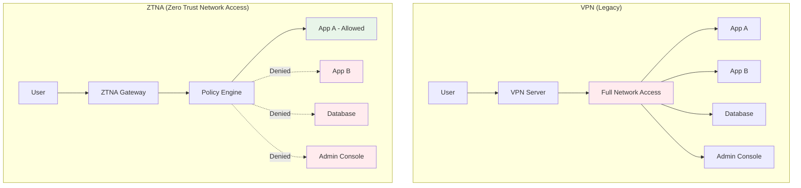

# Network Segmentation

## Why Network Segmentation Exists

Traditional flat networks allow any device to communicate with any other device. Once an attacker gains access to any machine, they can move laterally to reach high-value targets. Network segmentation breaks the network into isolated zones, limiting the blast radius of any compromise.

Micro-segmentation takes this to the extreme — each workload is its own segment, communicating only with explicitly authorized peers. Combined with identity-based access (not IP-based), this forms the network layer of Zero Trust.

### From VLANs to Micro-segmentation

| Generation | Technology | Granularity | Identity Model |
|-----------|-----------|-------------|---------------|
| Gen 1 | VLANs | Network-level | IP-based |
| Gen 2 | Firewall zones | Subnet-level | IP + port |
| Gen 3 | Software-defined | Workload-level | Labels/tags |
| Gen 4 | Service mesh (mTLS) | Process-level | Cryptographic identity |

## First Principles

### The Blast Radius Problem

In a flat network with $N$ services:

$$
\text{Attack surface from any compromised service} = N - 1
$$

With micro-segmentation where each service connects to an average of $k$ other services:

$$
\text{Attack surface} = k \ll N
$$

For a 100-service architecture with $k = 5$:
- Flat network: 99 potential targets per breach
- Micro-segmented: 5 potential targets per breach

$$
\text{Blast radius reduction} = \frac{N - 1}{k} = \frac{99}{5} = 19.8\times
$$

### ZTNA vs VPN



| Feature | VPN | ZTNA |
|---------|-----|------|
| Access model | Network-wide | Per-application |
| Identity check | At VPN login only | Every request |
| Lateral movement | Unrestricted | Blocked |
| Device compliance | Not checked | Continuously verified |
| User experience | Slow, always-on | Transparent, per-app |
| Performance | All traffic through VPN | Direct connections |
| Visibility | IP logs only | Full request audit |

## Core Mechanics

### Kubernetes Network Policies

```yaml
# Default deny all ingress and egress
apiVersion: networking.k8s.io/v1
kind: NetworkPolicy
metadata:
  name: default-deny-all
  namespace: production
spec:
  podSelector: {}
  policyTypes:
    - Ingress
    - Egress

---
# Allow web-frontend to talk to api-server on port 8080
apiVersion: networking.k8s.io/v1
kind: NetworkPolicy
metadata:
  name: allow-frontend-to-api
  namespace: production
spec:
  podSelector:
    matchLabels:
      app: api-server
  policyTypes:
    - Ingress
  ingress:
    - from:
        - podSelector:
            matchLabels:
              app: web-frontend
      ports:
        - protocol: TCP
          port: 8080

---
# Allow api-server to talk to database on port 5432
apiVersion: networking.k8s.io/v1
kind: NetworkPolicy
metadata:
  name: allow-api-to-db
  namespace: production
spec:
  podSelector:
    matchLabels:
      app: database
  policyTypes:
    - Ingress
  ingress:
    - from:
        - podSelector:
            matchLabels:
              app: api-server
      ports:
        - protocol: TCP
          port: 5432

---
# Allow api-server egress to database and external APIs only
apiVersion: networking.k8s.io/v1
kind: NetworkPolicy
metadata:
  name: api-server-egress
  namespace: production
spec:
  podSelector:
    matchLabels:
      app: api-server
  policyTypes:
    - Egress
  egress:
    - to:
        - podSelector:
            matchLabels:
              app: database
      ports:
        - protocol: TCP
          port: 5432
    - to:
        - podSelector:
            matchLabels:
              app: redis
      ports:
        - protocol: TCP
          port: 6379
    # DNS egress (required for service discovery)
    - to: []
      ports:
        - protocol: UDP
          port: 53
        - protocol: TCP
          port: 53
```

### Service Mesh (Istio mTLS)

```yaml
# Enforce strict mTLS across the mesh
apiVersion: security.istio.io/v1
kind: PeerAuthentication
metadata:
  name: default
  namespace: istio-system
spec:
  mtls:
    mode: STRICT

---
# Authorization policy: only allow specific services
apiVersion: security.istio.io/v1
kind: AuthorizationPolicy
metadata:
  name: payment-service-policy
  namespace: production
spec:
  selector:
    matchLabels:
      app: payment-service
  rules:
    - from:
        - source:
            principals:
              - "cluster.local/ns/production/sa/order-service"
              - "cluster.local/ns/production/sa/refund-service"
      to:
        - operation:
            methods: ["POST"]
            paths: ["/api/v1/charge", "/api/v1/refund"]
    - from:
        - source:
            principals:
              - "cluster.local/ns/production/sa/admin-dashboard"
      to:
        - operation:
            methods: ["GET"]
            paths: ["/api/v1/transactions*"]
```

### Micro-segmentation Policy Generator

```typescript
interface ServiceCommunication {
  from: string;
  to: string;
  port: number;
  protocol: 'TCP' | 'UDP';
  description: string;
}

interface NetworkPolicySpec {
  apiVersion: string;
  kind: string;
  metadata: { name: string; namespace: string };
  spec: any;
}

function generateNetworkPolicies(
  namespace: string,
  communications: ServiceCommunication[]
): NetworkPolicySpec[] {
  const policies: NetworkPolicySpec[] = [];

  // Default deny all
  policies.push({
    apiVersion: 'networking.k8s.io/v1',
    kind: 'NetworkPolicy',
    metadata: { name: 'default-deny-all', namespace },
    spec: {
      podSelector: {},
      policyTypes: ['Ingress', 'Egress'],
    },
  });

  // Allow DNS for all pods
  policies.push({
    apiVersion: 'networking.k8s.io/v1',
    kind: 'NetworkPolicy',
    metadata: { name: 'allow-dns', namespace },
    spec: {
      podSelector: {},
      policyTypes: ['Egress'],
      egress: [{
        ports: [
          { protocol: 'UDP', port: 53 },
          { protocol: 'TCP', port: 53 },
        ],
      }],
    },
  });

  // Group communications by destination
  const byDestination = new Map<string, ServiceCommunication[]>();
  for (const comm of communications) {
    const existing = byDestination.get(comm.to) ?? [];
    existing.push(comm);
    byDestination.set(comm.to, existing);
  }

  // Generate ingress policy per destination
  for (const [destination, comms] of byDestination) {
    policies.push({
      apiVersion: 'networking.k8s.io/v1',
      kind: 'NetworkPolicy',
      metadata: {
        name: `allow-ingress-to-${destination}`,
        namespace,
      },
      spec: {
        podSelector: { matchLabels: { app: destination } },
        policyTypes: ['Ingress'],
        ingress: comms.map(comm => ({
          from: [{ podSelector: { matchLabels: { app: comm.from } } }],
          ports: [{ protocol: comm.protocol, port: comm.port }],
        })),
      },
    });
  }

  // Group by source for egress policies
  const bySource = new Map<string, ServiceCommunication[]>();
  for (const comm of communications) {
    const existing = bySource.get(comm.from) ?? [];
    existing.push(comm);
    bySource.set(comm.from, existing);
  }

  for (const [source, comms] of bySource) {
    policies.push({
      apiVersion: 'networking.k8s.io/v1',
      kind: 'NetworkPolicy',
      metadata: { name: `allow-egress-from-${source}`, namespace },
      spec: {
        podSelector: { matchLabels: { app: source } },
        policyTypes: ['Egress'],
        egress: comms.map(comm => ({
          to: [{ podSelector: { matchLabels: { app: comm.to } } }],
          ports: [{ protocol: comm.protocol, port: comm.port }],
        })),
      },
    });
  }

  return policies;
}

// Usage
const communications: ServiceCommunication[] = [
  { from: 'web-frontend', to: 'api-gateway', port: 8080, protocol: 'TCP', description: 'Frontend to API' },
  { from: 'api-gateway', to: 'user-service', port: 3000, protocol: 'TCP', description: 'API to Users' },
  { from: 'api-gateway', to: 'order-service', port: 3001, protocol: 'TCP', description: 'API to Orders' },
  { from: 'order-service', to: 'payment-service', port: 3002, protocol: 'TCP', description: 'Orders to Payments' },
  { from: 'user-service', to: 'postgres', port: 5432, protocol: 'TCP', description: 'Users to DB' },
  { from: 'order-service', to: 'postgres', port: 5432, protocol: 'TCP', description: 'Orders to DB' },
];

const policies = generateNetworkPolicies('production', communications);
```

## Edge Cases & Failure Modes

### Network Policy Ordering and Conflicts

Kubernetes NetworkPolicies are additive — if any policy allows traffic, it's allowed:

```
Policy A: Allow frontend → api (port 8080)
Policy B: Allow monitoring → api (port 9090)

Result: api accepts traffic from frontend:8080 AND monitoring:9090
```

There is no explicit deny in K8s NetworkPolicy. The "deny" comes from having a policy that selects a pod — once selected, all unlisted traffic is denied.

::: danger
**Forgetting to add DNS egress rules after applying a default-deny policy will break all service discovery.** This is the most common micro-segmentation deployment issue.
:::

### Service Mesh Performance Overhead

| Component | Latency Added | Memory per sidecar | CPU per sidecar |
|-----------|--------------|-------------------|-----------------|
| Istio sidecar | 1–5ms (p50), 10–20ms (p99) | 50–100 MB | 0.1–0.5 cores |
| Linkerd sidecar | 0.5–2ms (p50), 5–10ms (p99) | 20–50 MB | 0.05–0.2 cores |
| Cilium (eBPF) | < 0.5ms | 0 (kernel) | Minimal |

For 100 services: Istio sidecars add ~5–10 GB memory and ~10–50 CPU cores of overhead.

## Performance Characteristics

### eBPF vs iptables for Network Policies

| Feature | iptables | eBPF (Cilium) |
|---------|----------|---------------|
| Rule evaluation | O(n) linear scan | O(1) hash lookup |
| Policy update | Full chain rebuild | Incremental |
| Latency at 1K rules | 5–10ms | < 0.1ms |
| Latency at 10K rules | 50–100ms | < 0.1ms |
| Observability | Limited | Deep visibility |

## Mathematical Foundations

### Network Reachability as Graph Theory

Model the network as a directed graph $G = (V, E)$ where vertices are services and edges are allowed connections.

The blast radius from a compromised service $v$ is the set of reachable vertices:

$$
\text{BlastRadius}(v) = \{u \in V : \exists \text{ path from } v \text{ to } u\}
$$

The goal of micro-segmentation is to minimize:

$$
\max_{v \in V} |\text{BlastRadius}(v)|
$$

For a star topology (all services connect through an API gateway):

$$
|\text{BlastRadius}(\text{gateway})| = N - 1
$$

but

$$
|\text{BlastRadius}(\text{service}_i)| = 1 \text{ (only the gateway)}
$$

## Real-World War Stories

::: info War Story
**The Target Breach (2013)**

Attackers gained access to Target's network through a compromised HVAC vendor. Once inside, the flat network allowed lateral movement from the HVAC system to the point-of-sale systems, resulting in 40 million stolen credit card numbers.

With micro-segmentation, the HVAC vendor's access would have been limited to HVAC control systems, with no path to POS systems.

**Lesson**: Third-party access must be segmented from critical systems. Network proximity is not a trust indicator.
:::

::: info War Story
**Kubernetes Default-Deny Incident**

A company applied default-deny NetworkPolicies to their production Kubernetes cluster without first mapping all inter-service communications. This immediately broke 30% of their services, causing a 2-hour outage.

**Resolution**: They implemented a "learning mode" approach: deploy Cilium in monitoring-only mode for 2 weeks, analyze all traffic flows, auto-generate policies based on observed traffic, review and apply policies in staging, then gradually apply to production.
:::

## Decision Framework

### ZTNA Product Selection

| Factor | Cloudflare Access | Zscaler ZPA | Tailscale | WireGuard |
|--------|------------------|-------------|-----------|-----------|
| Architecture | Cloud proxy | Cloud proxy | Mesh P2P | P2P tunnel |
| Device compliance | Optional | Built-in | No | No |
| Per-app access | Yes | Yes | ACLs | Manual |
| Self-hosted option | No | No | Yes (Headscale) | Yes |
| Cost | Free–$7/user/month | Enterprise | Free–$18/user | Free |

## Advanced Topics

### eBPF-Based Micro-segmentation with Cilium

```yaml
# Cilium Network Policy with L7 visibility
apiVersion: cilium.io/v2
kind: CiliumNetworkPolicy
metadata:
  name: api-server-l7-policy
  namespace: production
spec:
  endpointSelector:
    matchLabels:
      app: api-server
  ingress:
    - fromEndpoints:
        - matchLabels:
            app: web-frontend
      toPorts:
        - ports:
            - port: "8080"
              protocol: TCP
          rules:
            http:
              - method: "GET"
                path: "/api/v1/public/.*"
              - method: "POST"
                path: "/api/v1/orders"
                headers:
                  - 'Content-Type: application/json'
```

### Service Communication Graph Discovery

```typescript
// Automatically discover service communication patterns
// from network flow logs or Istio telemetry
interface NetworkFlow {
  sourceService: string;
  destinationService: string;
  destinationPort: number;
  protocol: string;
  requestCount: number;
  lastSeen: Date;
}

async function discoverCommunicationPatterns(
  flowLogs: NetworkFlow[],
  observationPeriod: number = 14 // days
): Promise<ServiceCommunication[]> {
  const cutoff = new Date(Date.now() - observationPeriod * 86400000);

  // Filter to recent, significant flows
  const significantFlows = flowLogs.filter(
    f => f.lastSeen > cutoff && f.requestCount > 10
  );

  // Deduplicate and aggregate
  const uniqueFlows = new Map<string, NetworkFlow>();
  for (const flow of significantFlows) {
    const key = `${flow.sourceService}->${flow.destinationService}:${flow.destinationPort}`;
    const existing = uniqueFlows.get(key);
    if (!existing || flow.requestCount > existing.requestCount) {
      uniqueFlows.set(key, flow);
    }
  }

  return Array.from(uniqueFlows.values()).map(f => ({
    from: f.sourceService,
    to: f.destinationService,
    port: f.destinationPort,
    protocol: f.protocol as 'TCP' | 'UDP',
    description: `Auto-discovered: ${f.requestCount} requests in ${observationPeriod} days`,
  }));
}
```

## Cross-References

- [Zero Trust Principles](/security/zero-trust/principles) — Foundation
- [Identity Verification](/security/zero-trust/identity-verification) — SPIFFE for service identity
- [Encryption in Transit](/security/encryption/encryption-in-transit) — mTLS between segments
- [Least Privilege](/security/zero-trust/least-privilege) — Access control within segments
- [Continuous Verification](/security/zero-trust/continuous-verification) — Monitoring traffic flows
