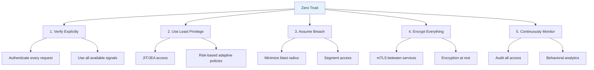
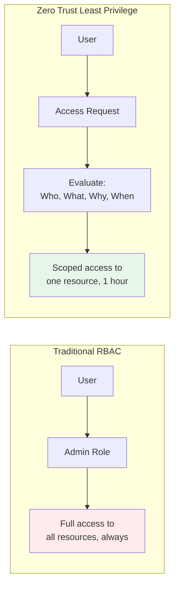
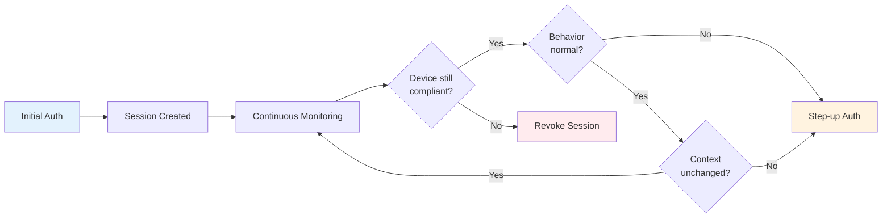
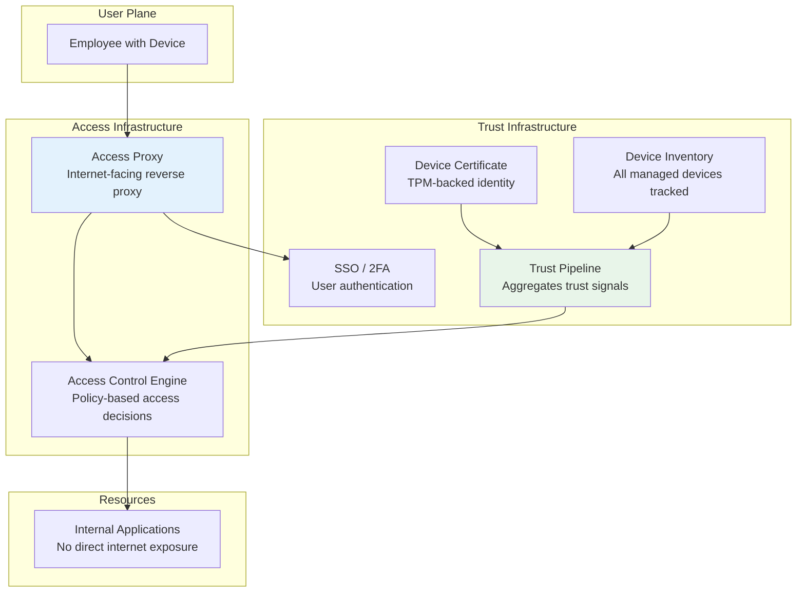
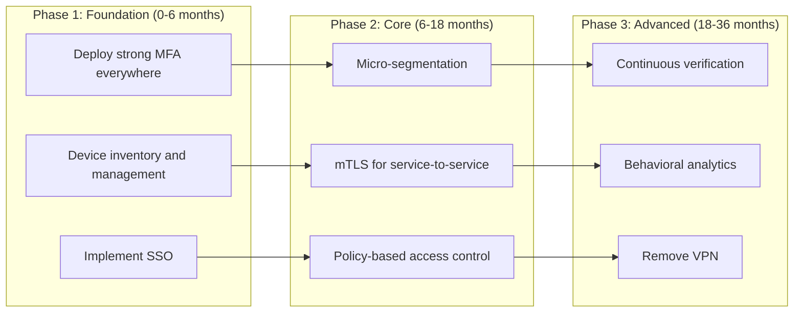

# Zero Trust Principles

## Why Principles Matter

Zero Trust is not a product — it's an architectural philosophy. Without clearly understood principles, organizations buy "Zero Trust" products that are just rebranded VPNs or firewalls. The principles provide a framework for evaluating every architectural decision against the core tenet: **never trust, always verify**.

### The Five Core Principles



## First Principles

### Principle 1: Verify Explicitly

Every access request must be authenticated and authorized based on all available data points:

$$
\text{Decision} = f(\text{identity}, \text{location}, \text{device}, \text{service}, \text{classification}, \text{anomalies})
$$

This is fundamentally different from traditional security where authentication happens once at the perimeter and subsequent requests are trusted:

| Traditional | Zero Trust |
|-------------|-----------|
| Authenticate at VPN login | Authenticate every request |
| Trust based on network location | Trust based on identity + context |
| Session = unlimited access | Session = scoped, time-limited access |
| Binary: inside/outside | Continuous: trust score |

### Principle 2: Use Least Privilege Access

Access should be just enough, just in time:

- **Just Enough Access (JEA)**: Grant the minimum permissions needed for the task
- **Just In Time (JIT)**: Grant access only when needed, automatically revoke when done
- **Risk-based policies**: Higher-risk operations require stronger authentication



### Principle 3: Assume Breach

Design every system assuming that attackers are already inside the network:

| Assumption | Implication |
|-----------|-------------|
| Attackers are inside the network | Encrypt all internal traffic |
| Any credential could be compromised | Use short-lived tokens, require MFA |
| Any device could be compromised | Verify device health continuously |
| Any service could be compromised | Implement micro-segmentation |
| Any data could be exfiltrated | Classify and monitor data access |

### Principle 4: Encrypt Everything

No traffic — internal or external — should be unencrypted:

$$
\text{All traffic} \xrightarrow{\text{mTLS}} \text{Encrypted}
$$

This means:
- Service-to-service: mTLS with short-lived certificates
- User-to-service: TLS 1.3 with strong cipher suites
- Data at rest: AES-256-GCM with managed keys
- Databases: TLS for connections, encryption at rest
- Even localhost: TLS for loopback connections in high-security environments

### Principle 5: Continuously Monitor and Validate

Authentication is not a one-time event — it's continuous:



## Core Mechanics

### BeyondCorp Architecture Deep Dive

Google's BeyondCorp is built on several interconnected systems:



Key BeyondCorp innovations:

1. **No VPN**: All applications are accessed through an internet-facing proxy
2. **Device inventory**: Every device is tracked and must have a valid certificate
3. **Trust tiers**: Devices are classified into trust tiers based on their security posture
4. **Access levels**: Applications define required trust levels, not network locations

### Implementation: Policy Decision Point

```typescript
interface PolicyRule {
  id: string;
  description: string;
  resource: string; // glob pattern
  conditions: PolicyCondition[];
  effect: 'allow' | 'deny';
  priority: number;
}

interface PolicyCondition {
  field: string;
  operator: 'equals' | 'notEquals' | 'greaterThan' | 'in' | 'contains';
  value: unknown;
}

class PolicyDecisionPoint {
  private rules: PolicyRule[] = [];

  addRule(rule: PolicyRule): void {
    this.rules.push(rule);
    this.rules.sort((a, b) => b.priority - a.priority);
  }

  evaluate(request: {
    identity: Record<string, unknown>;
    device: Record<string, unknown>;
    context: Record<string, unknown>;
    resource: string;
    action: string;
  }): { allowed: boolean; matchedRule?: string; reason: string } {
    const allSignals = {
      ...request.identity,
      ...request.device,
      ...request.context,
      resource: request.resource,
      action: request.action,
    };

    for (const rule of this.rules) {
      // Check if rule applies to this resource
      if (!this.matchGlob(request.resource, rule.resource)) continue;

      // Evaluate all conditions
      const allConditionsMet = rule.conditions.every((cond) =>
        this.evaluateCondition(allSignals, cond)
      );

      if (allConditionsMet) {
        return {
          allowed: rule.effect === 'allow',
          matchedRule: rule.id,
          reason: `Matched rule: ${rule.description}`,
        };
      }
    }

    // Default deny
    return { allowed: false, reason: 'No matching policy rule (default deny)' };
  }

  private evaluateCondition(
    signals: Record<string, unknown>,
    condition: PolicyCondition
  ): boolean {
    const actualValue = signals[condition.field];
    switch (condition.operator) {
      case 'equals': return actualValue === condition.value;
      case 'notEquals': return actualValue !== condition.value;
      case 'greaterThan': return (actualValue as number) > (condition.value as number);
      case 'in': return (condition.value as unknown[]).includes(actualValue);
      case 'contains': return String(actualValue).includes(String(condition.value));
      default: return false;
    }
  }

  private matchGlob(path: string, pattern: string): boolean {
    const regexStr = pattern
      .replace(/\*/g, '.*')
      .replace(/\?/g, '.');
    return new RegExp(`^${regexStr}$`).test(path);
  }
}

// Example policies
const pdp = new PolicyDecisionPoint();

pdp.addRule({
  id: 'deny-unmanaged-confidential',
  description: 'Deny unmanaged devices from accessing confidential resources',
  resource: '/api/confidential/*',
  conditions: [
    { field: 'deviceManaged', operator: 'equals', value: false },
  ],
  effect: 'deny',
  priority: 100,
});

pdp.addRule({
  id: 'require-mfa-admin',
  description: 'Require MFA for admin actions',
  resource: '/api/admin/*',
  conditions: [
    { field: 'authMethod', operator: 'in', value: ['mfa', 'passkey', 'certificate'] },
    { field: 'role', operator: 'equals', value: 'admin' },
  ],
  effect: 'allow',
  priority: 90,
});

pdp.addRule({
  id: 'allow-authenticated-internal',
  description: 'Allow authenticated users to access internal resources',
  resource: '/api/internal/*',
  conditions: [
    { field: 'authenticated', operator: 'equals', value: true },
    { field: 'trustScore', operator: 'greaterThan', value: 50 },
  ],
  effect: 'allow',
  priority: 50,
});
```

## Edge Cases & Failure Modes

### Legitimate Access Denied

Zero Trust policies can be too restrictive, blocking legitimate users:

| Scenario | Cause | Mitigation |
|----------|-------|------------|
| New device | Not yet in inventory | Self-enrollment with step-up auth |
| Traveling | Unusual location | Geo-aware policies with exceptions |
| After hours | Time-based restrictions | Emergency access procedures |
| VPN split tunnel | Mixed network signals | Don't rely solely on network location |

### Policy Conflicts

When multiple policies apply:

```
Rule 1: ALLOW engineers to access /api/code/* (priority 50)
Rule 2: DENY unpatched devices from /api/* (priority 100)

Engineer with unpatched device accessing /api/code/build:
→ Rule 2 wins (higher priority) → DENIED
```

::: tip
Always use a **default deny** posture. Only explicitly allowed access is permitted. This ensures that policy gaps result in denied access rather than unauthorized access.
:::

## Performance Characteristics

### Policy Evaluation at Scale

| Metric | Value | Notes |
|--------|-------|-------|
| Policy evaluation time | < 1ms | In-memory rule engine |
| p99 latency (with context lookup) | 5–15ms | Cached identity/device data |
| Throughput (single node) | 50K decisions/sec | CPU-bound |
| Policy rules supported | 10K+ | Indexed by resource path |

## Mathematical Foundations

### Trust Score as a Weighted Sum

$$
S = \sum_{i=1}^{n} w_i \cdot s_i
$$

where $w_i$ are weights and $s_i$ are individual signal scores:

| Signal | Weight | Score Range | Description |
|--------|--------|-------------|-------------|
| Auth method strength | 0.25 | 0–100 | Password=30, MFA=70, Passkey=95 |
| Device compliance | 0.25 | 0–100 | Managed+patched+encrypted=100 |
| Session freshness | 0.15 | 0–100 | Decays linearly with age |
| Network context | 0.10 | 0–100 | Corporate=90, Home=60, Public=30 |
| Behavioral anomaly | 0.15 | 0–100 | Normal=90, Unusual=40, Alert=10 |
| Risk intelligence | 0.10 | 0–100 | Based on threat feeds |

$$
\text{If } S \geq \theta_{\text{resource}}, \text{ access is granted}
$$

where $\theta_{\text{resource}}$ is the minimum trust score for the resource's sensitivity level.

## Real-World War Stories

::: info War Story
**Microsoft's Zero Trust Journey**

Microsoft began its Zero Trust transformation in 2017, migrating from a VPN-centric model to identity-based access for 200,000+ employees and 600,000 devices. The migration took 3 years and involved:

1. Enrolling all devices in Microsoft Endpoint Manager
2. Deploying conditional access policies in Azure AD
3. Removing VPN requirements for 95% of applications
4. Implementing continuous access evaluation

Key metric: security incidents related to lateral movement decreased by 80% after implementing micro-segmentation and identity-based access.

**Lesson**: Zero Trust at scale requires executive sponsorship, a phased approach, and tolerance for temporary productivity disruptions during migration.
:::

::: info War Story
**A Hospital's Zero Trust Emergency Access Problem**

A hospital implemented Zero Trust with strict device compliance requirements. During a ransomware attack, the IT team needed to use personal devices and temporary workstations to restore systems. The Zero Trust policies blocked these unmanaged devices, slowing the recovery.

**Resolution**: They implemented "break-glass" accounts with separate emergency access policies that could be activated by two authorized administrators simultaneously. These accounts had full logging and automatic deactivation after 4 hours.
:::

## Decision Framework

### Zero Trust Implementation Roadmap



## Advanced Topics

### Open Policy Agent (OPA) for Zero Trust

```rego
# Zero Trust access policy in Rego (OPA)
package zerotrust.access

default allow = false

# Allow if all conditions are met
allow {
    input.identity.authenticated == true
    trust_score >= required_score
    device_compliant
}

trust_score = score {
    identity_score := identity_weight * auth_strength
    device_score := device_weight * device_health
    context_score := context_weight * context_trust
    score := identity_score + device_score + context_score
}

auth_strength = 95 { input.identity.auth_method == "passkey" }
auth_strength = 70 { input.identity.auth_method == "mfa" }
auth_strength = 30 { input.identity.auth_method == "password" }

device_compliant {
    input.device.managed == true
    input.device.disk_encrypted == true
    input.device.patch_level != "behind-2+"
}

required_score = 85 { input.resource.sensitivity == "restricted" }
required_score = 70 { input.resource.sensitivity == "confidential" }
required_score = 50 { input.resource.sensitivity == "internal" }
required_score = 20 { input.resource.sensitivity == "public" }

identity_weight = 0.4
device_weight = 0.35
context_weight = 0.25

device_health = 100 { input.device.compliance_status == "compliant" }
device_health = 50 { input.device.compliance_status == "unknown" }
device_health = 0 { input.device.compliance_status == "non-compliant" }

context_trust = 90 { input.context.network_type == "corporate" }
context_trust = 60 { input.context.network_type == "home" }
context_trust = 30 { input.context.network_type == "public" }
```

### Zero Trust for APIs

```typescript
// API gateway implementing Zero Trust
import { Request, Response, NextFunction } from 'express';

interface ZeroTrustAPIConfig {
  requireMTLS: boolean;
  requiredScopes: string[];
  sensitivityLevel: 'public' | 'internal' | 'confidential' | 'restricted';
  rateLimitPerIdentity: number;
  allowedClientCertificates?: string[]; // Allowed SPIFFE IDs
}

function zeroTrustAPI(config: ZeroTrustAPIConfig) {
  return async (req: Request, res: Response, next: NextFunction) => {
    // 1. Verify mTLS identity
    if (config.requireMTLS) {
      const clientCert = (req.socket as any).getPeerCertificate();
      if (!clientCert || !clientCert.subject) {
        res.status(401).json({ error: 'mTLS client certificate required' });
        return;
      }
      const spiffeId = extractSPIFFEId(clientCert);
      if (config.allowedClientCertificates && !config.allowedClientCertificates.includes(spiffeId)) {
        res.status(403).json({ error: 'Client not authorized' });
        return;
      }
    }

    // 2. Verify JWT/bearer token
    const token = extractBearerToken(req);
    if (!token) {
      res.status(401).json({ error: 'Authentication required' });
      return;
    }

    // 3. Verify scopes
    const tokenScopes = decodeTokenScopes(token);
    const hasRequiredScopes = config.requiredScopes.every(s => tokenScopes.includes(s));
    if (!hasRequiredScopes) {
      res.status(403).json({ error: 'Insufficient scopes' });
      return;
    }

    // 4. Apply rate limit per identity
    const identity = extractIdentity(token);
    const limited = await checkRateLimit(identity, config.rateLimitPerIdentity);
    if (limited) {
      res.status(429).json({ error: 'Rate limit exceeded' });
      return;
    }

    next();
  };
}
```

## Cross-References

- [Zero Trust Overview](/security/zero-trust/) — Architecture and context
- [Identity Verification](/security/zero-trust/identity-verification) — Device trust, SPIFFE
- [Least Privilege](/security/zero-trust/least-privilege) — RBAC, ABAC, ReBAC
- [Continuous Verification](/security/zero-trust/continuous-verification) — Behavioral analysis
- [Passwordless Authentication](/security/authentication/passwordless) — Phishing-resistant auth
- [Encryption in Transit](/security/encryption/encryption-in-transit) — mTLS foundations
