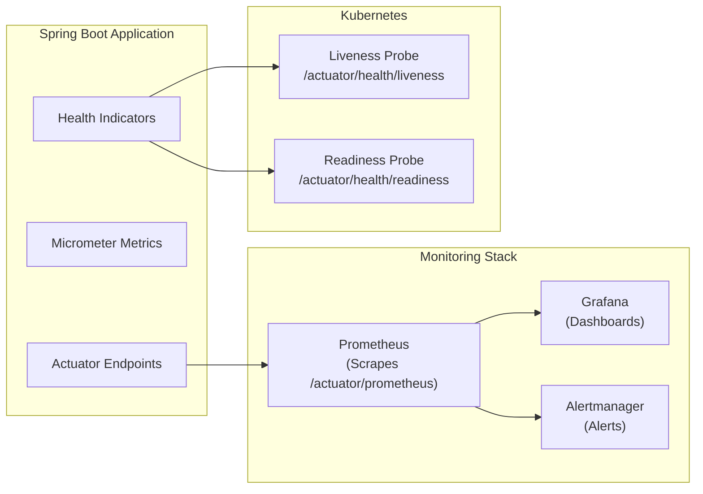

# Actuator & Monitoring

Spring Boot Actuator gives you production-ready endpoints for monitoring your application: health checks, metrics, environment info, and HTTP trace. Combined with Prometheus and Grafana, it forms the standard observability stack for Spring Boot applications. If you deploy to production without Actuator, you are flying blind.

## Setup

```xml
<!-- pom.xml -->
<dependency>
    <groupId>org.springframework.boot</groupId>
    <artifactId>spring-boot-starter-actuator</artifactId>
</dependency>
<!-- Prometheus metrics exporter -->
<dependency>
    <groupId>io.micrometer</groupId>
    <artifactId>micrometer-registry-prometheus</artifactId>
</dependency>
```

```yaml
# application.yml
management:
  endpoints:
    web:
      exposure:
        include: health,info,metrics,prometheus,env,loggers,caches
      base-path: /actuator

  endpoint:
    health:
      show-details: when_authorized   # always | when_authorized | never
      show-components: when_authorized
      probes:
        enabled: true                  # Kubernetes liveness/readiness
    info:
      enabled: true
    loggers:
      enabled: true                    # Change log levels at runtime

  health:
    diskspace:
      enabled: true
      threshold: 1GB
    db:
      enabled: true
    redis:
      enabled: true

  metrics:
    tags:
      application: ${spring.application.name}
      environment: ${spring.profiles.active:default}
    distribution:
      percentiles-histogram:
        http.server.requests: true
      slo:
        http.server.requests: 50ms,100ms,200ms,500ms,1s,5s

  prometheus:
    metrics:
      export:
        enabled: true

  info:
    env:
      enabled: true
    build:
      enabled: true
    git:
      enabled: true
      mode: full

info:
  app:
    name: ${spring.application.name}
    version: '@project.version@'
    description: My Spring Boot application
    java-version: ${java.version}
```

## Actuator Endpoints

| Endpoint | Method | Description |
|---|---|---|
| `/actuator/health` | GET | Application health status |
| `/actuator/health/liveness` | GET | Kubernetes liveness probe |
| `/actuator/health/readiness` | GET | Kubernetes readiness probe |
| `/actuator/info` | GET | Application info (version, git) |
| `/actuator/metrics` | GET | List all available metrics |
| `/actuator/metrics/{name}` | GET | Get specific metric values |
| `/actuator/prometheus` | GET | Prometheus scrape endpoint |
| `/actuator/env` | GET | Environment properties |
| `/actuator/loggers` | GET | Logger configuration |
| `/actuator/loggers/{name}` | POST | Change log level at runtime |
| `/actuator/caches` | GET | Cache statistics |
| `/actuator/caches/{name}` | DELETE | Evict a specific cache |



## Custom Health Indicators

```java
/**
 * Custom health check for an external payment service.
 */
@Component
@RequiredArgsConstructor
public class PaymentGatewayHealthIndicator implements HealthIndicator {

    private final RestClient restClient;

    @Override
    public Health health() {
        try {
            ResponseEntity<String> response = restClient.get()
                    .uri("https://api.stripe.com/v1/health")
                    .retrieve()
                    .toEntity(String.class);

            if (response.getStatusCode().is2xxSuccessful()) {
                return Health.up()
                        .withDetail("service", "Stripe Payment Gateway")
                        .withDetail("status", "reachable")
                        .withDetail("responseTime",
                                response.getHeaders().getFirst("X-Response-Time"))
                        .build();
            } else {
                return Health.down()
                        .withDetail("service", "Stripe Payment Gateway")
                        .withDetail("statusCode", response.getStatusCode().value())
                        .build();
            }
        } catch (Exception e) {
            return Health.down()
                    .withDetail("service", "Stripe Payment Gateway")
                    .withDetail("error", e.getMessage())
                    .withException(e)
                    .build();
        }
    }
}

/**
 * Health check for Kafka connectivity.
 */
@Component
@RequiredArgsConstructor
public class KafkaHealthIndicator implements HealthIndicator {

    private final KafkaAdmin kafkaAdmin;

    @Override
    public Health health() {
        try (AdminClient client = AdminClient.create(
                kafkaAdmin.getConfigurationProperties())) {
            DescribeClusterResult cluster = client.describeCluster();
            int nodeCount = cluster.nodes().get(5, TimeUnit.SECONDS).size();
            String clusterId = cluster.clusterId().get(5, TimeUnit.SECONDS);

            return Health.up()
                    .withDetail("clusterId", clusterId)
                    .withDetail("nodeCount", nodeCount)
                    .build();
        } catch (Exception e) {
            return Health.down()
                    .withDetail("error", "Cannot connect to Kafka")
                    .withException(e)
                    .build();
        }
    }
}

/**
 * Check disk space for file uploads.
 */
@Component
public class StorageHealthIndicator implements HealthIndicator {

    @Value("${app.storage.path:/tmp/uploads}")
    private String storagePath;

    @Override
    public Health health() {
        File storage = new File(storagePath);
        long freeSpace = storage.getFreeSpace();
        long totalSpace = storage.getTotalSpace();
        double usedPercent = (totalSpace - freeSpace) * 100.0 / totalSpace;

        Health.Builder builder = usedPercent > 90
                ? Health.down() : Health.up();

        return builder
                .withDetail("path", storagePath)
                .withDetail("freeSpaceGB", freeSpace / (1024.0 * 1024 * 1024))
                .withDetail("totalSpaceGB", totalSpace / (1024.0 * 1024 * 1024))
                .withDetail("usedPercent", String.format("%.1f%%", usedPercent))
                .build();
    }
}
```

Health response:

```json
{
  "status": "UP",
  "components": {
    "db": {
      "status": "UP",
      "details": {
        "database": "PostgreSQL",
        "validationQuery": "isValid()"
      }
    },
    "diskSpace": {
      "status": "UP",
      "details": {
        "total": 499963174912,
        "free": 245168373760,
        "threshold": 1073741824
      }
    },
    "paymentGateway": {
      "status": "UP",
      "details": {
        "service": "Stripe Payment Gateway",
        "status": "reachable"
      }
    },
    "kafka": {
      "status": "UP",
      "details": {
        "clusterId": "abc123",
        "nodeCount": 3
      }
    }
  }
}
```

## Custom Metrics with Micrometer

```java
@Service
@RequiredArgsConstructor
@Slf4j
public class OrderService {

    private final OrderRepository orderRepository;
    private final MeterRegistry meterRegistry;

    // Counters
    private final Counter ordersPlacedCounter;
    private final Counter ordersFailedCounter;

    // Timer
    private final Timer orderProcessingTimer;

    // Gauge
    private final AtomicInteger activeOrders = new AtomicInteger(0);

    public OrderService(OrderRepository orderRepository,
                         MeterRegistry meterRegistry) {
        this.orderRepository = orderRepository;
        this.meterRegistry = meterRegistry;

        // Register metrics
        this.ordersPlacedCounter = Counter.builder("orders.placed.total")
                .description("Total number of orders placed")
                .tag("service", "order-service")
                .register(meterRegistry);

        this.ordersFailedCounter = Counter.builder("orders.failed.total")
                .description("Total number of failed orders")
                .tag("service", "order-service")
                .register(meterRegistry);

        this.orderProcessingTimer = Timer.builder("orders.processing.duration")
                .description("Time to process an order")
                .publishPercentiles(0.5, 0.95, 0.99)
                .publishPercentileHistogram()
                .sla(Duration.ofMillis(100), Duration.ofMillis(500),
                     Duration.ofSeconds(1), Duration.ofSeconds(5))
                .register(meterRegistry);

        // Gauge — current value (not cumulative)
        Gauge.builder("orders.active.count", activeOrders, AtomicInteger::get)
                .description("Current number of orders being processed")
                .register(meterRegistry);
    }

    @Transactional
    public OrderResponse placeOrder(CreateOrderRequest request) {
        activeOrders.incrementAndGet();

        try {
            return orderProcessingTimer.record(() -> {
                OrderResponse response = processOrderInternal(request);

                ordersPlacedCounter.increment();

                // Tag-based counter for category breakdown
                meterRegistry.counter("orders.placed.by_category",
                        "category", request.category().name())
                        .increment();

                // Distribution summary for order values
                meterRegistry.summary("orders.value",
                        "currency", "USD")
                        .record(response.total().doubleValue());

                return response;
            });
        } catch (Exception e) {
            ordersFailedCounter.increment();
            meterRegistry.counter("orders.failed.by_reason",
                    "reason", e.getClass().getSimpleName())
                    .increment();
            throw e;
        } finally {
            activeOrders.decrementAndGet();
        }
    }
}
```

### @Timed and @Counted Annotations

```java
@Service
public class ProductService {

    @Timed(value = "product.search.duration",
           description = "Product search latency",
           percentiles = {0.5, 0.95, 0.99})
    public Page<ProductResponse> search(String query, Pageable pageable) {
        // Method execution time is automatically recorded
        return productRepository.searchProducts(query, pageable);
    }

    @Counted(value = "product.views.total",
             description = "Total product page views")
    public ProductResponse findById(UUID id) {
        return productRepository.findById(id)
                .map(ProductResponse::from)
                .orElseThrow(() -> new ResourceNotFoundException("Product", id));
    }
}

// Enable @Timed and @Counted
@Configuration
public class MetricsConfig {

    @Bean
    public TimedAspect timedAspect(MeterRegistry registry) {
        return new TimedAspect(registry);
    }

    @Bean
    public CountedAspect countedAspect(MeterRegistry registry) {
        return new CountedAspect(registry);
    }
}
```

## Prometheus Integration

The `/actuator/prometheus` endpoint outputs metrics in Prometheus format:

```
# HELP orders_placed_total Total number of orders placed
# TYPE orders_placed_total counter
orders_placed_total{service="order-service",} 1542.0

# HELP orders_processing_duration_seconds Time to process an order
# TYPE orders_processing_duration_seconds histogram
orders_processing_duration_seconds_bucket{le="0.1",} 1200.0
orders_processing_duration_seconds_bucket{le="0.5",} 1450.0
orders_processing_duration_seconds_bucket{le="1.0",} 1520.0
orders_processing_duration_seconds_bucket{le="5.0",} 1542.0
orders_processing_duration_seconds_bucket{le="+Inf",} 1542.0
orders_processing_duration_seconds_count 1542.0
orders_processing_duration_seconds_sum 234.567

# HELP http_server_requests_seconds HTTP request latency
# TYPE http_server_requests_seconds histogram
http_server_requests_seconds_bucket{method="GET",status="200",uri="/api/v1/products",le="0.05",} 8920.0
```

### Prometheus Configuration

```yaml
# prometheus.yml
global:
  scrape_interval: 15s

scrape_configs:
  - job_name: 'spring-boot'
    metrics_path: '/actuator/prometheus'
    scrape_interval: 10s
    static_configs:
      - targets:
          - 'order-service:8080'
          - 'product-service:8080'
          - 'payment-service:8080'

  # Kubernetes service discovery
  - job_name: 'spring-boot-k8s'
    kubernetes_sd_configs:
      - role: pod
    relabel_configs:
      - source_labels: [__meta_kubernetes_pod_annotation_prometheus_io_scrape]
        action: keep
        regex: true
      - source_labels: [__meta_kubernetes_pod_annotation_prometheus_io_path]
        action: replace
        target_label: __metrics_path__
        regex: (.+)
```

## Runtime Log Level Changes

```bash
# View current log level
curl http://localhost:8080/actuator/loggers/com.example.myapp

# Change log level at runtime (no restart!)
curl -X POST http://localhost:8080/actuator/loggers/com.example.myapp \
     -H 'Content-Type: application/json' \
     -d '{"configuredLevel": "DEBUG"}'

# Reset to default
curl -X POST http://localhost:8080/actuator/loggers/com.example.myapp \
     -H 'Content-Type: application/json' \
     -d '{"configuredLevel": null}'
```

::: tip Debug production issues without restarting
The `/actuator/loggers` endpoint lets you temporarily enable DEBUG logging for a specific package in production, diagnose the issue, then reset to WARN. This is invaluable for debugging issues that only happen in production.
:::

## Security for Actuator

```java
@Configuration
@EnableWebSecurity
public class SecurityConfig {

    @Bean
    public SecurityFilterChain securityFilterChain(HttpSecurity http) throws Exception {
        http.authorizeHttpRequests(auth -> auth
                // Public health endpoint (for load balancers)
                .requestMatchers("/actuator/health").permitAll()
                .requestMatchers("/actuator/health/liveness").permitAll()
                .requestMatchers("/actuator/health/readiness").permitAll()

                // Prometheus (should be restricted in production)
                .requestMatchers("/actuator/prometheus").hasRole("MONITORING")

                // All other actuator endpoints require ADMIN
                .requestMatchers("/actuator/**").hasRole("ADMIN")

                // Application endpoints
                .anyRequest().authenticated()
        );
        return http.build();
    }
}
```

## Docker Compose Monitoring Stack

```yaml
# docker-compose-monitoring.yml
services:
  prometheus:
    image: prom/prometheus:v2.52.0
    ports: ["9090:9090"]
    volumes:
      - ./prometheus.yml:/etc/prometheus/prometheus.yml
      - prometheus-data:/prometheus

  grafana:
    image: grafana/grafana:11.0.0
    ports: ["3000:3000"]
    environment:
      GF_SECURITY_ADMIN_PASSWORD: admin
    volumes:
      - grafana-data:/var/lib/grafana
      - ./grafana/provisioning:/etc/grafana/provisioning

  alertmanager:
    image: prom/alertmanager:v0.27.0
    ports: ["9093:9093"]
    volumes:
      - ./alertmanager.yml:/etc/alertmanager/alertmanager.yml

volumes:
  prometheus-data:
  grafana-data:
```

## Key Metrics to Monitor

| Metric | What It Tells You | Alert Threshold |
|---|---|---|
| `http_server_requests_seconds` | Request latency | p99 > 1s |
| `jvm_memory_used_bytes` | Memory usage | > 80% of max |
| `hikaricp_connections_active` | Active DB connections | > 80% of pool |
| `hikaricp_connections_pending` | Waiting for connection | > 0 for 30s |
| `jvm_threads_live_threads` | Thread count | > 500 |
| `process_cpu_usage` | CPU usage | > 80% |
| `orders.placed.total` | Business throughput | Sudden drop |
| `orders.failed.total` | Error rate | > 5% of total |
| `spring_kafka_consumer_records_lag` | Kafka consumer lag | > 10000 |

## Further Reading

- **[Docker & Deployment](./docker)** — Monitoring in containerized environments
- **[Spring Cloud](./spring-cloud)** — Distributed tracing with Micrometer
- **[Hibernate Performance Tuning](./hibernate-tuning)** — Database-specific metrics
- **[Caching](./caching)** — Cache hit/miss metrics

## Common Pitfalls

::: danger Pitfall 1: Exposing all Actuator endpoints in production
Setting `management.endpoints.web.exposure.include: *` exposes sensitive data like environment variables (which may contain secrets), heap dumps, and thread dumps.
**Fix:** Explicitly list only needed endpoints: `include: health,info,metrics,prometheus`. Protect all other endpoints with role-based authentication (`hasRole('ADMIN')`).
:::

::: danger Pitfall 2: Not configuring health check details visibility
Setting `show-details: always` exposes internal infrastructure details (database host, Redis connection info) to unauthenticated users.
**Fix:** Use `show-details: when_authorized` and require authentication for health detail access. Use `show-details: never` for public-facing health endpoints used by load balancers.
:::

::: danger Pitfall 3: Not creating custom health indicators for critical dependencies
Relying only on default health checks means the application reports UP even when critical external services (payment gateway, email provider) are down.
**Fix:** Implement `HealthIndicator` beans for each critical external dependency. Include response time and reachability status.
:::

::: danger Pitfall 4: Creating high-cardinality metric tags
Using user IDs, request IDs, or other unique values as metric tags creates millions of time series, overwhelming Prometheus and increasing memory usage exponentially.
**Fix:** Use only low-cardinality tags: HTTP method, status code, endpoint pattern (not actual path), service name. Use logs (not metrics) for high-cardinality data like user IDs.
:::

::: danger Pitfall 5: Not enabling Kubernetes liveness and readiness probes
Without probes, Kubernetes cannot detect when your application is stuck (liveness) or not ready to serve traffic (readiness), leading to traffic being sent to unhealthy pods.
**Fix:** Set `management.endpoint.health.probes.enabled: true` and configure `livenessProbe` and `readinessProbe` in your Kubernetes deployment manifest pointing to `/actuator/health/liveness` and `/actuator/health/readiness`.
:::

## Interview Questions

**Q1: What is the difference between liveness and readiness probes in Spring Boot Actuator?**
::: details Answer
The **liveness probe** (`/actuator/health/liveness`) indicates whether the application is alive and should continue running. If it fails, Kubernetes restarts the pod. It should only check for irrecoverable states (deadlocked threads, exhausted memory). The **readiness probe** (`/actuator/health/readiness`) indicates whether the application is ready to accept traffic. If it fails, Kubernetes removes the pod from the Service endpoints (stops sending traffic) but does not restart it. It checks dependencies like database connectivity and cache availability. A pod can be alive but not ready (e.g., during startup or when a database is temporarily unavailable).
:::

**Q2: How do you create custom business metrics with Micrometer?**
::: details Answer
Inject `MeterRegistry` and use its factory methods: `Counter.builder("orders.placed.total").tag("category", category).register(registry).increment()` for event counts. `Timer.builder("order.processing.duration").register(registry).record(duration)` for latency. `Gauge.builder("orders.active", activeOrders, AtomicInteger::get).register(registry)` for current values. `DistributionSummary.builder("order.value").register(registry).record(amount)` for value distributions. Use `@Timed` and `@Counted` annotations for declarative metrics on methods (requires `TimedAspect` and `CountedAspect` beans).
:::

**Q3: How do you change log levels at runtime without restarting the application?**
::: details Answer
Enable the loggers Actuator endpoint with `management.endpoints.web.exposure.include: loggers`. Send a POST request to `/actuator/loggers/{logger-name}` with `{"configuredLevel": "DEBUG"}` to change the level. Send `{"configuredLevel": null}` to reset to the default. This is invaluable for debugging production issues -- enable DEBUG for a specific package, diagnose the issue, then reset to INFO/WARN. Protect this endpoint with authentication in production.
:::

**Q4: What Prometheus metrics should you monitor for a Spring Boot application?**
::: details Answer
Critical metrics: (1) `http_server_requests_seconds` -- request latency per endpoint; alert on p99 > 1s. (2) `jvm_memory_used_bytes` -- memory usage; alert on > 80% of max. (3) `hikaricp_connections_active` -- active DB connections; alert on > 80% of pool size. (4) `hikaricp_connections_pending` -- threads waiting for connections; alert on > 0 for 30s. (5) `process_cpu_usage` -- CPU usage. (6) Business metrics like `orders.placed.total` (sudden drops indicate problems) and `orders.failed.total` (error rate). (7) `jvm_gc_pause_seconds` -- garbage collection pauses.
:::

**Q5: How do you secure Actuator endpoints in production?**
::: details Answer
Configure Spring Security to allow specific endpoints publicly and restrict the rest: allow `/actuator/health` (for load balancers), `/actuator/health/liveness`, and `/actuator/health/readiness` without authentication. Require `ROLE_MONITORING` for `/actuator/prometheus` (for Prometheus scraping with basic auth). Require `ROLE_ADMIN` for all other endpoints (`/actuator/**`). Alternatively, serve actuator endpoints on a different port (`management.server.port: 9090`) and restrict network access at the firewall/security group level.
:::
