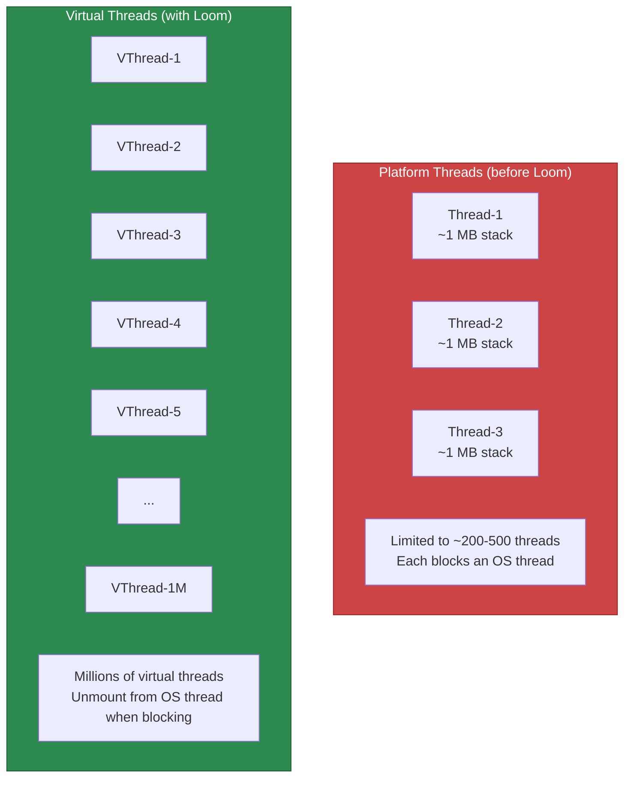

# Async & Scheduling

Not every operation belongs in the request-response cycle. Sending emails, generating reports, processing uploads, syncing with external APIs — these should happen asynchronously. Spring Boot provides `@Async` for offloading work to background threads and `@Scheduled` for cron-like recurring tasks. With Java 21, virtual threads (Project Loom) change the game entirely.

## @Async

### Setup

```java
@Configuration
@EnableAsync
@Slf4j
public class AsyncConfig implements AsyncConfigurer {

    /**
     * Custom thread pool for @Async methods.
     * Without this, Spring uses a SimpleAsyncTaskExecutor (unbounded — dangerous).
     */
    @Override
    @Bean(name = "taskExecutor")
    public Executor getAsyncExecutor() {
        ThreadPoolTaskExecutor executor = new ThreadPoolTaskExecutor();
        executor.setCorePoolSize(5);
        executor.setMaxPoolSize(20);
        executor.setQueueCapacity(100);
        executor.setThreadNamePrefix("async-");
        executor.setRejectedExecutionHandler(new ThreadPoolExecutor.CallerRunsPolicy());
        executor.setWaitForTasksToCompleteOnShutdown(true);
        executor.setAwaitTerminationSeconds(30);
        executor.initialize();
        return executor;
    }

    /**
     * Global exception handler for @Async void methods.
     * Without this, exceptions in fire-and-forget methods are silently swallowed.
     */
    @Override
    public AsyncUncaughtExceptionHandler getAsyncUncaughtExceptionHandler() {
        return (throwable, method, params) -> {
            log.error("Async exception in method {}: {}",
                    method.getName(), throwable.getMessage(), throwable);
            // Send to error tracking (Sentry, Datadog, etc.)
        };
    }
}
```

::: danger Never use @Async without a custom executor
The default `SimpleAsyncTaskExecutor` creates a new thread for every task with no upper bound. Under load, this can create thousands of threads and crash your application with `OutOfMemoryError`. Always configure a bounded `ThreadPoolTaskExecutor`.
:::

### Using @Async

```java
@Service
@RequiredArgsConstructor
@Slf4j
public class NotificationService {

    private final EmailClient emailClient;
    private final SmsClient smsClient;
    private final PushNotificationClient pushClient;

    /**
     * Fire-and-forget: returns void, runs in background.
     * Exceptions are caught by AsyncUncaughtExceptionHandler.
     */
    @Async
    public void sendOrderConfirmationEmail(OrderPlacedEvent event) {
        log.info("Sending order confirmation email to customer {}",
                event.customerId());
        emailClient.send(
                event.customerEmail(),
                "Order Confirmed",
                buildOrderEmailBody(event)
        );
    }

    /**
     * Returns CompletableFuture: caller can wait for result or compose.
     */
    @Async
    public CompletableFuture<NotificationResult> sendSms(
            String phone, String message) {
        log.info("Sending SMS to {}", phone);
        try {
            SmsResponse response = smsClient.send(phone, message);
            return CompletableFuture.completedFuture(
                    new NotificationResult("SMS", true, response.messageId()));
        } catch (Exception e) {
            log.error("Failed to send SMS to {}: {}", phone, e.getMessage());
            return CompletableFuture.completedFuture(
                    new NotificationResult("SMS", false, e.getMessage()));
        }
    }

    /**
     * Send all notifications in parallel, wait for all to complete.
     */
    public AllNotificationsResult sendAllNotifications(
            String email, String phone, String deviceToken, String message) {

        CompletableFuture<NotificationResult> emailFuture =
                sendEmailAsync(email, "Notification", message);
        CompletableFuture<NotificationResult> smsFuture =
                sendSms(phone, message);
        CompletableFuture<NotificationResult> pushFuture =
                sendPushAsync(deviceToken, message);

        // Wait for all three to complete
        CompletableFuture.allOf(emailFuture, smsFuture, pushFuture).join();

        return new AllNotificationsResult(
                emailFuture.join(),
                smsFuture.join(),
                pushFuture.join()
        );
    }
}
```

### Multiple Thread Pools

```java
@Configuration
@EnableAsync
public class AsyncConfig {

    @Bean(name = "emailExecutor")
    public Executor emailExecutor() {
        ThreadPoolTaskExecutor executor = new ThreadPoolTaskExecutor();
        executor.setCorePoolSize(2);
        executor.setMaxPoolSize(5);
        executor.setQueueCapacity(50);
        executor.setThreadNamePrefix("email-");
        executor.initialize();
        return executor;
    }

    @Bean(name = "reportExecutor")
    public Executor reportExecutor() {
        ThreadPoolTaskExecutor executor = new ThreadPoolTaskExecutor();
        executor.setCorePoolSize(1);
        executor.setMaxPoolSize(3);
        executor.setQueueCapacity(10);
        executor.setThreadNamePrefix("report-");
        executor.initialize();
        return executor;
    }

    @Bean(name = "eventExecutor")
    public Executor eventExecutor() {
        ThreadPoolTaskExecutor executor = new ThreadPoolTaskExecutor();
        executor.setCorePoolSize(5);
        executor.setMaxPoolSize(20);
        executor.setQueueCapacity(200);
        executor.setThreadNamePrefix("event-");
        executor.initialize();
        return executor;
    }
}

@Service
public class ReportService {

    @Async("reportExecutor")  // Use the specific executor
    public CompletableFuture<byte[]> generateReport(ReportRequest request) {
        // Long-running report generation
        return CompletableFuture.completedFuture(reportBytes);
    }
}
```

## @Scheduled

```java
@Configuration
@EnableScheduling
public class SchedulingConfig {

    @Bean
    public TaskScheduler taskScheduler() {
        ThreadPoolTaskScheduler scheduler = new ThreadPoolTaskScheduler();
        scheduler.setPoolSize(5);
        scheduler.setThreadNamePrefix("scheduled-");
        scheduler.setErrorHandler(t ->
                log.error("Scheduled task error: {}", t.getMessage(), t));
        scheduler.setWaitForTasksToCompleteOnShutdown(true);
        scheduler.setAwaitTerminationSeconds(30);
        return scheduler;
    }
}
```

```java
@Component
@RequiredArgsConstructor
@Slf4j
public class ScheduledTasks {

    private final OrderRepository orderRepository;
    private final CacheManager cacheManager;
    private final MeterRegistry meterRegistry;

    /**
     * Fixed rate: runs every 5 minutes regardless of previous execution time.
     * Warning: if execution takes > 5 minutes, tasks will overlap!
     */
    @Scheduled(fixedRate = 300_000)  // 5 minutes in ms
    public void cleanupExpiredSessions() {
        log.info("Cleaning up expired sessions...");
        int deleted = sessionRepository.deleteExpired();
        log.info("Deleted {} expired sessions", deleted);
    }

    /**
     * Fixed delay: waits 1 minute AFTER the previous execution completes.
     * Prevents overlap.
     */
    @Scheduled(fixedDelay = 60_000, initialDelay = 10_000)
    public void syncPendingOrders() {
        log.info("Syncing pending orders with external system...");
        List<Order> pending = orderRepository.findByStatus(OrderStatus.PENDING);
        pending.forEach(this::syncOrder);
    }

    /**
     * Cron expression: runs at 2 AM every day.
     */
    @Scheduled(cron = "0 0 2 * * *")
    public void generateDailyReport() {
        log.info("Generating daily report...");
        reportService.generateAndEmailDailyReport();
    }

    /**
     * Cron with timezone.
     */
    @Scheduled(cron = "0 0 9 * * MON-FRI", zone = "America/New_York")
    public void sendWeekdayDigest() {
        log.info("Sending weekday digest...");
    }

    /**
     * Externalized schedule via properties.
     */
    @Scheduled(cron = "${app.jobs.cache-warmup.cron:0 0 */4 * * *}")
    public void warmCaches() {
        log.info("Warming caches...");
        productService.warmProductCache();
    }

    /**
     * ISO 8601 duration for fixedRate.
     */
    @Scheduled(fixedRateString = "${app.jobs.metrics.interval:PT1M}")
    public void reportCustomMetrics() {
        long orderCount = orderRepository.countByCreatedAtAfter(
                Instant.now().minus(Duration.ofHours(1)));
        meterRegistry.gauge("orders.hourly.count", orderCount);
    }
}
```

### Cron Expression Reference

| Expression | Meaning |
|---|---|
| `0 0 * * * *` | Every hour at :00 |
| `0 0 2 * * *` | Every day at 2:00 AM |
| `0 0 2 * * MON-FRI` | Weekdays at 2:00 AM |
| `0 */15 * * * *` | Every 15 minutes |
| `0 0 9-17 * * MON-FRI` | Every hour 9 AM - 5 PM weekdays |
| `0 0 0 1 * *` | First day of every month |
| `0 0 0 * * SUN` | Every Sunday at midnight |

```
┌───────────── second (0 - 59)
│ ┌───────────── minute (0 - 59)
│ │ ┌───────────── hour (0 - 23)
│ │ │ ┌───────────── day of month (1 - 31)
│ │ │ │ ┌───────────── month (1 - 12)
│ │ │ │ │ ┌───────────── day of week (0 - 7, SUN-SAT)
│ │ │ │ │ │
* * * * * *
```

## Virtual Threads (Project Loom)

Java 21 introduced virtual threads — lightweight threads that are cheap to create and block. Spring Boot 3.2+ supports them natively.

```yaml
# application.yml — enable virtual threads globally
spring:
  threads:
    virtual:
      enabled: true  # All request handling uses virtual threads
```



### Virtual Thread Executor for @Async

```java
@Configuration
@EnableAsync
public class VirtualThreadAsyncConfig {

    @Bean(name = "virtualThreadExecutor")
    public Executor virtualThreadExecutor() {
        return Executors.newVirtualThreadPerTaskExecutor();
    }

    // Or configure as the default async executor
    @Bean
    public AsyncTaskExecutor applicationTaskExecutor() {
        return new TaskExecutorAdapter(
                Executors.newVirtualThreadPerTaskExecutor());
    }
}

@Service
public class DataSyncService {

    /**
     * With virtual threads, blocking I/O is fine.
     * Each virtual thread is extremely cheap (~few KB).
     */
    @Async("virtualThreadExecutor")
    public CompletableFuture<SyncResult> syncCustomer(UUID customerId) {
        // These blocking calls are fine with virtual threads
        CustomerData crm = crmClient.getCustomer(customerId);       // HTTP call, blocks
        PaymentHistory billing = billingClient.getHistory(customerId); // HTTP call, blocks
        List<Ticket> tickets = supportClient.getTickets(customerId);   // HTTP call, blocks

        return CompletableFuture.completedFuture(
                new SyncResult(crm, billing, tickets));
    }
}
```

::: tip When to use virtual threads
Virtual threads shine for I/O-bound work: HTTP calls, database queries, file I/O. They are NOT beneficial for CPU-bound work (data processing, encryption) — use platform thread pools for that. The key benefit: you can have millions of concurrent blocking operations without running out of threads.
:::

### Structured Concurrency (Preview in Java 21)

```java
@Service
public class OrderDetailsService {

    /**
     * Fetch order details from multiple services concurrently.
     * Structured concurrency ensures all subtasks complete or fail together.
     */
    public OrderDetails getOrderDetails(UUID orderId) throws Exception {
        try (var scope = new StructuredTaskScope.ShutdownOnFailure()) {

            Subtask<Order> orderTask = scope.fork(() ->
                    orderRepository.findById(orderId).orElseThrow());

            Subtask<Customer> customerTask = scope.fork(() ->
                    customerClient.getCustomer(orderId));

            Subtask<List<TrackingEvent>> trackingTask = scope.fork(() ->
                    trackingClient.getEvents(orderId));

            // Wait for all tasks to complete
            scope.join();
            scope.throwIfFailed();

            return new OrderDetails(
                    orderTask.get(),
                    customerTask.get(),
                    trackingTask.get()
            );
        }
    }
}
```

## Error Handling Patterns

```java
@Service
@Slf4j
public class ResilientAsyncService {

    /**
     * Async with retry using CompletableFuture.
     */
    @Async
    public CompletableFuture<String> fetchWithRetry(String url) {
        return CompletableFuture.supplyAsync(() -> httpClient.get(url))
                .exceptionallyCompose(ex -> {
                    log.warn("First attempt failed: {}. Retrying...", ex.getMessage());
                    return CompletableFuture.supplyAsync(() -> httpClient.get(url));
                })
                .exceptionallyCompose(ex -> {
                    log.warn("Second attempt failed: {}. Retrying...", ex.getMessage());
                    return CompletableFuture.supplyAsync(() -> httpClient.get(url));
                })
                .exceptionally(ex -> {
                    log.error("All retries exhausted for {}: {}", url, ex.getMessage());
                    return "FALLBACK_RESPONSE";
                });
    }

    /**
     * Timeout on async operations.
     */
    @Async
    public CompletableFuture<ReportData> generateReportWithTimeout(
            ReportRequest request) {
        return CompletableFuture.supplyAsync(() -> generateReport(request))
                .orTimeout(5, TimeUnit.MINUTES)
                .exceptionally(ex -> {
                    if (ex instanceof TimeoutException) {
                        log.error("Report generation timed out");
                        return ReportData.timeout();
                    }
                    throw new CompletionException(ex);
                });
    }

    /**
     * Combine multiple async results with error handling.
     */
    public DashboardData loadDashboard(UUID userId) {
        CompletableFuture<UserProfile> profileFuture =
                userService.getProfileAsync(userId)
                        .exceptionally(ex -> UserProfile.empty());

        CompletableFuture<List<Order>> ordersFuture =
                orderService.getRecentOrdersAsync(userId)
                        .exceptionally(ex -> List.of());

        CompletableFuture<AccountBalance> balanceFuture =
                billingService.getBalanceAsync(userId)
                        .exceptionally(ex -> AccountBalance.unknown());

        return CompletableFuture.allOf(profileFuture, ordersFuture, balanceFuture)
                .thenApply(v -> new DashboardData(
                        profileFuture.join(),
                        ordersFuture.join(),
                        balanceFuture.join()))
                .join();
    }
}
```

## Distributed Locking for Scheduled Tasks

When running multiple instances, `@Scheduled` tasks run on every instance. Use ShedLock to ensure only one instance executes:

```xml
<dependency>
    <groupId>net.javacrumbs.shedlock</groupId>
    <artifactId>shedlock-spring</artifactId>
    <version>5.13.0</version>
</dependency>
<dependency>
    <groupId>net.javacrumbs.shedlock</groupId>
    <artifactId>shedlock-provider-jdbc-template</artifactId>
    <version>5.13.0</version>
</dependency>
```

```java
@Configuration
@EnableSchedulerLock(defaultLockAtMostFor = "10m")
public class ShedLockConfig {

    @Bean
    public LockProvider lockProvider(DataSource dataSource) {
        return new JdbcTemplateLockProvider(
                JdbcTemplateLockProvider.Configuration.builder()
                        .withJdbcTemplate(new JdbcTemplate(dataSource))
                        .usingDbTime()
                        .build());
    }
}

@Component
public class ScheduledTasks {

    @Scheduled(cron = "0 0 2 * * *")
    @SchedulerLock(name = "dailyReport",
            lockAtLeastFor = "5m",     // Hold lock for at least 5 min
            lockAtMostFor = "30m")     // Release lock after 30 min even if still running
    public void generateDailyReport() {
        // Only ONE instance across the cluster runs this
        reportService.generateAndEmailDailyReport();
    }
}
```

## Further Reading

- **[Spring Kafka](./kafka)** — Async event processing
- **[Caching](./caching)** — Scheduled cache eviction
- **[Actuator & Monitoring](./actuator)** — Thread pool metrics
- **[Best Practices](./best-practices)** — Concurrency anti-patterns

## Common Pitfalls

::: danger Pitfall 1: Using @Async without a custom executor
The default `SimpleAsyncTaskExecutor` creates a new unbounded thread for every task. Under load, this creates thousands of threads and crashes the application with `OutOfMemoryError`.
**Fix:** Always configure a bounded `ThreadPoolTaskExecutor` with `corePoolSize`, `maxPoolSize`, and `queueCapacity`. Use `CallerRunsPolicy` as the rejection handler.
:::

::: danger Pitfall 2: Calling @Async methods from within the same class
Self-invocation (`this.asyncMethod()`) bypasses the Spring proxy, so the method runs synchronously on the caller's thread.
**Fix:** Inject the bean into itself with `@Lazy @Autowired private MyService self;` and call `self.asyncMethod()`, or extract the async method to a separate bean.
:::

::: danger Pitfall 3: Silently swallowing exceptions in @Async void methods
Exceptions in `@Async void` methods are not propagated to the caller and are silently lost by default.
**Fix:** Implement `AsyncUncaughtExceptionHandler` via `AsyncConfigurer.getAsyncUncaughtExceptionHandler()` to log errors and send alerts. Or return `CompletableFuture` instead of `void` to make errors visible.
:::

::: danger Pitfall 4: @Scheduled tasks running on all instances in a cluster
Without distributed locking, scheduled tasks execute on every application instance simultaneously, causing duplicate processing.
**Fix:** Use ShedLock with `@SchedulerLock` to ensure only one instance runs the task. Configure the lock provider with your database or Redis.
:::

::: danger Pitfall 5: Using fixedRate when task execution exceeds the interval
`fixedRate` triggers the next execution at a fixed interval regardless of whether the previous execution completed, causing task overlap.
**Fix:** Use `fixedDelay` instead, which waits for the specified delay after the previous execution completes. Or add `@SchedulerLock` to prevent overlapping executions.
:::

::: danger Pitfall 6: Losing MDC/SecurityContext in async threads
`MDC` context (correlation IDs, user IDs) and `SecurityContext` are stored in `ThreadLocal`, which is not propagated to async task threads.
**Fix:** Use a `TaskDecorator` on the `ThreadPoolTaskExecutor` that copies the MDC context map and SecurityContext before task execution and clears them after.
:::

## Interview Questions

**Q1: What is the difference between `@Async` with `void` return vs. `CompletableFuture` return?**
::: details Answer
`@Async void` is fire-and-forget: the caller does not know when the task completes or whether it succeeded. Exceptions are silently swallowed unless you configure an `AsyncUncaughtExceptionHandler`. `@Async CompletableFuture<T>` allows the caller to wait for the result, compose multiple async operations, handle errors with `.exceptionally()`, set timeouts with `.orTimeout()`, and combine results with `CompletableFuture.allOf()`. Always prefer returning `CompletableFuture` unless you truly need fire-and-forget semantics.
:::

**Q2: How do virtual threads (Project Loom) change async programming in Spring Boot?**
::: details Answer
Virtual threads are lightweight threads (few KB stack) managed by the JVM, unlike platform threads (1 MB stack) mapped to OS threads. With `spring.threads.virtual.enabled: true` in Spring Boot 3.2+, all request handling uses virtual threads automatically. The key change: blocking I/O (HTTP calls, database queries, file I/O) no longer wastes platform threads because virtual threads unmount from the carrier thread when blocking. This means you can write simple, synchronous code that handles thousands of concurrent connections without the complexity of `@Async`, `CompletableFuture`, or reactive programming. Virtual threads are NOT beneficial for CPU-bound work.
:::

**Q3: How does `@Scheduled` work and what is the difference between `fixedRate`, `fixedDelay`, and `cron`?**
::: details Answer
`@Scheduled` runs methods periodically in a background thread. `fixedRate = 5000` triggers every 5 seconds from the start of the previous execution (can overlap). `fixedDelay = 5000` waits 5 seconds after the previous execution completes (never overlaps). `cron = "0 0 2 * * *"` runs at exactly 2 AM daily using a six-field cron expression (second, minute, hour, day, month, weekday). All values can be externalized with SpEL: `fixedRateString = "${app.job.interval:PT5M}"`. Enable with `@EnableScheduling` and always configure a `TaskScheduler` bean with a thread pool.
:::

**Q4: How do you prevent `@Scheduled` tasks from running on multiple instances simultaneously?**
::: details Answer
Use ShedLock with `@SchedulerLock`: (1) Add `shedlock-spring` and a provider dependency (e.g., `shedlock-provider-jdbc-template`). (2) Create the `shedlock` table in your database. (3) Configure `@EnableSchedulerLock(defaultLockAtMostFor = "10m")`. (4) Annotate scheduled methods with `@SchedulerLock(name = "taskName", lockAtLeastFor = "5m", lockAtMostFor = "30m")`. The first instance to acquire the lock runs the task; other instances skip it. `lockAtLeastFor` prevents rapid re-execution; `lockAtMostFor` ensures the lock is released if the instance crashes.
:::

**Q5: How do you compose multiple async operations and handle partial failures?**
::: details Answer
Use `CompletableFuture.allOf()` to wait for multiple async operations: `CompletableFuture.allOf(future1, future2, future3).join()`. For partial failure handling, add `.exceptionally()` or `.handle()` on each future individually to provide fallback values, so one failure does not cancel the others. Example: `userFuture.exceptionally(ex -> UserProfile.empty())`. Then combine results with `.thenApply()`. For timeout, use `.orTimeout(5, TimeUnit.SECONDS)`. For structured concurrency (Java 21 preview), use `StructuredTaskScope.ShutdownOnFailure` which cancels all subtasks if any one fails.
:::
