# Best Practices & Anti-Patterns

Building a Spring Boot application that works in development is easy. Building one that survives production — high traffic, concurrent users, partial failures, deployment at 3 AM — requires discipline. This page is a distillation of the patterns that work and the anti-patterns that cause 3 AM incidents.

## Project Structure

### DO: Organize by Feature, Not by Layer

```
# BAD: Package-by-layer (common but bad)
com.example.myapp/
├── controller/      # 50 controllers mixed together
├── service/         # 50 services mixed together
├── repository/      # 50 repositories mixed together
├── model/           # 50 entities mixed together
└── dto/             # 100 DTOs mixed together

# GOOD: Package-by-feature
com.example.myapp/
├── order/
│   ├── OrderController.java
│   ├── OrderService.java
│   ├── OrderRepository.java
│   ├── Order.java
│   ├── OrderItem.java
│   ├── CreateOrderRequest.java
│   └── OrderResponse.java
├── product/
│   ├── ProductController.java
│   ├── ProductService.java
│   ├── ProductRepository.java
│   ├── Product.java
│   └── ProductResponse.java
├── user/
│   ├── UserController.java
│   ├── UserService.java
│   └── ...
└── common/
    ├── exception/
    │   ├── GlobalExceptionHandler.java
    │   └── ResourceNotFoundException.java
    ├── config/
    │   ├── SecurityConfig.java
    │   └── CacheConfig.java
    └── util/
        └── DateUtils.java
```

Why package-by-feature is better:

| Aspect | Package-by-layer | Package-by-feature |
|---|---|---|
| **Finding code** | Scattered across packages | All in one place |
| **New feature** | Touch 5+ packages | Touch 1 package |
| **Modularity** | Impossible to enforce | Can use package-private visibility |
| **Extract to microservice** | Major refactor | Copy the package |
| **Code review** | Review across packages | Review one package |

### DO: Keep Controllers Thin

```java
// BAD: Business logic in controller
@RestController
public class OrderController {

    @PostMapping("/orders")
    public OrderResponse createOrder(@RequestBody CreateOrderRequest request) {
        // Validation
        if (request.items().isEmpty()) throw new BadRequestException("No items");

        // Business logic in controller — NO!
        BigDecimal total = request.items().stream()
                .map(item -> {
                    Product p = productRepo.findById(item.productId()).orElseThrow();
                    if (p.getStock() < item.quantity()) throw new RuntimeException("No stock");
                    p.setStock(p.getStock() - item.quantity());
                    productRepo.save(p);
                    return p.getPrice().multiply(BigDecimal.valueOf(item.quantity()));
                })
                .reduce(BigDecimal.ZERO, BigDecimal::add);

        Order order = new Order();
        order.setTotal(total);
        // ... 30 more lines
        return OrderResponse.from(orderRepo.save(order));
    }
}
```

```java
// GOOD: Controller delegates everything to service
@RestController
@RequestMapping("/api/v1/orders")
@RequiredArgsConstructor
public class OrderController {

    private final OrderService orderService;

    @PostMapping
    @ResponseStatus(HttpStatus.CREATED)
    public OrderResponse createOrder(@Valid @RequestBody CreateOrderRequest request) {
        return orderService.create(request);
    }
}
```

## Configuration Management

### DO: Use @ConfigurationProperties

```java
// BAD: Scattered @Value annotations
@Service
public class EmailService {
    @Value("${app.email.host}") private String host;
    @Value("${app.email.port}") private int port;
    @Value("${app.email.from}") private String from;
    @Value("${app.email.username}") private String username;
    @Value("${app.email.password}") private String password;
    // 5 fields, no validation, no grouping
}
```

```java
// GOOD: Type-safe, validated, grouped configuration
@ConfigurationProperties(prefix = "app.email")
@Validated
public record EmailProperties(
        @NotBlank String host,
        @Min(1) @Max(65535) int port,
        @NotBlank @Email String from,
        @NotBlank String username,
        @NotBlank String password,
        @NotNull Duration timeout,
        boolean starttls
) {}

@Service
@RequiredArgsConstructor
public class EmailService {
    private final EmailProperties emailProperties; // One clean dependency
}
```

### DO: Use Profiles Correctly

```yaml
# application.yml — SHARED config (all environments)
spring:
  application:
    name: my-app
  jpa:
    open-in-view: false
server:
  shutdown: graceful

---
# application-dev.yml
spring:
  datasource:
    url: jdbc:postgresql://localhost:5432/myapp_dev
  jpa:
    show-sql: true
logging:
  level:
    root: DEBUG

---
# application-prod.yml
spring:
  datasource:
    url: jdbc:postgresql://${DB_HOST}/myapp
    hikari:
      maximum-pool-size: 20
  jpa:
    show-sql: false
logging:
  level:
    root: WARN
    com.example: INFO
```

::: danger Never commit secrets to application.yml
Database passwords, API keys, JWT secrets — use environment variables (`${DB_PASSWORD}`) or a secret manager (HashiCorp Vault, AWS Secrets Manager). The application.yml should contain only non-sensitive configuration.
:::

## Logging

### DO: Use Structured Logging

```java
// BAD: String concatenation
log.info("Processing order " + orderId + " for customer " + customerId + " total " + total);

// BAD: String.format
log.info(String.format("Processing order %s for customer %s total %s", orderId, customerId, total));

// GOOD: SLF4J parameterized logging (lazy evaluation)
log.info("Processing order {} for customer {} total {}", orderId, customerId, total);

// GOOD: Structured key-value logging with MDC
MDC.put("orderId", orderId.toString());
MDC.put("customerId", customerId.toString());
try {
    log.info("Processing order, total={}", total);
    // All subsequent log lines include orderId and customerId
} finally {
    MDC.clear();
}
```

### DO: Log at the Right Level

```java
@Service
@Slf4j
public class PaymentService {

    public PaymentResult charge(PaymentRequest request) {
        // DEBUG: detailed technical info for developers
        log.debug("Charging payment: method={}, amount={}, currency={}",
                request.method(), request.amount(), request.currency());

        try {
            PaymentResult result = gateway.charge(request);

            // INFO: business events worth knowing about
            log.info("Payment successful: transactionId={}, amount={}",
                    result.transactionId(), request.amount());

            return result;
        } catch (PaymentDeclinedException e) {
            // WARN: something went wrong but it's expected/recoverable
            log.warn("Payment declined for customer {}: reason={}",
                    request.customerId(), e.getReason());
            throw e;
        } catch (Exception e) {
            // ERROR: something unexpected broke — needs attention
            log.error("Payment processing failed for customer {}: {}",
                    request.customerId(), e.getMessage(), e);
            throw new ExternalServiceException("PaymentGateway", e.getMessage(), e);
        }
    }
}
```

| Level | When to Use | Example |
|---|---|---|
| `TRACE` | Extremely detailed debugging | Method entry/exit, variable values |
| `DEBUG` | Detailed technical info | SQL queries, HTTP request details |
| `INFO` | Business events | Order placed, user registered, payment processed |
| `WARN` | Recoverable problems | Retry attempt, degraded mode, deprecated usage |
| `ERROR` | Failures requiring attention | Unhandled exceptions, external service down |

## Database

### DO: Always Use `spring.jpa.open-in-view: false`

```yaml
spring:
  jpa:
    open-in-view: false  # ALWAYS set this
```

Open Session in View (OSIV) keeps the Hibernate session open until the HTTP response is rendered. This means lazy-loaded entities trigger database queries during JSON serialization — outside your transactional boundary, invisible to your code. Disable it.

### DO: Manage Transactions Explicitly

```java
@Service
@Transactional(readOnly = true)  // Class default: read-only
public class OrderService {

    // Read methods use the class-level readOnly = true
    public OrderResponse findById(UUID id) {
        return orderRepository.findById(id)
                .map(OrderResponse::from)
                .orElseThrow(() -> new ResourceNotFoundException("Order", id));
    }

    @Transactional  // Override: this method writes
    public OrderResponse create(CreateOrderRequest request) {
        // ...
    }

    @Transactional(propagation = Propagation.REQUIRES_NEW)
    public void logAuditEvent(AuditEvent event) {
        // Runs in a separate transaction — commits even if parent rolls back
        auditRepository.save(event);
    }
}
```

### DON'T: Use Entity as API Response

```java
// BAD: Entity is the response
@GetMapping("/{id}")
public User getUser(@PathVariable UUID id) {
    return userRepository.findById(id).orElseThrow();
    // Exposes: passwordHash, internalFlags, lazy collections
    // Also: Jackson triggers lazy loading → N+1 queries
}

// GOOD: Use DTOs
@GetMapping("/{id}")
public UserResponse getUser(@PathVariable UUID id) {
    return userService.findById(id);
    // Returns only what the client needs, no lazy loading risk
}
```

## Error Handling

### DO: Use a Global Exception Handler

See the complete implementation on the [Exception Handling](./exception-handling) page. Key rules:

1. **Never expose stack traces** to clients
2. **Always return a consistent error format** (RFC 7807)
3. **Log the full error internally** with a correlation ID
4. **Return the correlation ID to the client** so they can report it to support

### DON'T: Catch and Swallow Exceptions

```java
// BAD: Swallowing exceptions
try {
    paymentGateway.charge(request);
} catch (Exception e) {
    log.error("Payment failed");  // Lost the exception!
    return null;                   // Caller doesn't know it failed!
}

// GOOD: Handle or propagate
try {
    paymentGateway.charge(request);
} catch (PaymentDeclinedException e) {
    throw new BusinessRuleViolationException("PAYMENT_DECLINED", e.getReason());
} catch (Exception e) {
    throw new ExternalServiceException("PaymentGateway", e.getMessage(), e);
}
```

## Performance

### DO: Use Pagination Everywhere

```java
// BAD: Loading all records into memory
List<Product> allProducts = productRepository.findAll();

// GOOD: Paginated
Page<Product> page = productRepository.findAll(
        PageRequest.of(0, 20, Sort.by("createdAt").descending()));
```

### DO: Set Connection Pool Limits

```yaml
spring:
  datasource:
    hikari:
      maximum-pool-size: 10       # NOT 100
      minimum-idle: 5
      connection-timeout: 30000    # Fail fast
      leak-detection-threshold: 60000
```

### DO: Use Async for Non-Critical I/O

```java
@Service
public class OrderService {

    @Transactional
    public OrderResponse placeOrder(CreateOrderRequest request) {
        Order order = createOrder(request);

        // Non-critical: don't block the response
        notificationService.sendOrderConfirmationAsync(order); // @Async
        analyticsService.trackOrderAsync(order);                // @Async

        return OrderResponse.from(order); // Return immediately
    }
}
```

## Security Checklist

| Practice | Implementation |
|---|---|
| Hash passwords | `BCryptPasswordEncoder(12)` |
| Use HTTPS | Force in production, HSTS header |
| Validate all input | `@Valid` on all `@RequestBody` |
| Parameterize queries | Use Spring Data methods, never concatenate SQL |
| Rate limit endpoints | Bucket4j or Spring Cloud Gateway rate limiter |
| Secure actuator | Restrict `/actuator/**` to admin role |
| Disable OSIV | `spring.jpa.open-in-view: false` |
| Set security headers | CSP, X-Frame-Options, HSTS, X-Content-Type-Options |
| Validate file uploads | Check content type, size, filename |
| Log security events | Login attempts, permission denials, password changes |

## Anti-Pattern Summary

```mermaid
graph TB
    subgraph Bad["Anti-Patterns"]
        B1["Field injection<br/>(@Autowired private)"]
        B2["Business logic in controllers"]
        B3["Entity as API response"]
        B4["ddl-auto: update in prod"]
        B5["Swallowing exceptions"]
        B6["open-in-view: true"]
        B7["Unbounded queries<br/>(findAll without pagination)"]
        B8["Secrets in application.yml"]
        B9["No custom thread pool<br/>for @Async"]
        B10["String concatenation<br/>in log statements"]
    end

    subgraph Good["Best Practices"]
        G1["Constructor injection"]
        G2["Thin controllers + service layer"]
        G3["DTOs for API responses"]
        G4["Flyway + ddl-auto: validate"]
        G5["Global exception handler"]
        G6["open-in-view: false"]
        G7["Paginate everything"]
        G8["Environment variables / Vault"]
        G9["Bounded ThreadPoolTaskExecutor"]
        G10["SLF4J parameterized logging"]
    end

    B1 -.->|"fix"| G1
    B2 -.->|"fix"| G2
    B3 -.->|"fix"| G3
    B4 -.->|"fix"| G4
    B5 -.->|"fix"| G5
    B6 -.->|"fix"| G6
    B7 -.->|"fix"| G7
    B8 -.->|"fix"| G8
    B9 -.->|"fix"| G9
    B10 -.->|"fix"| G10

    style Bad fill:#c44,stroke:#922,color:white
    style Good fill:#2d8a4e,stroke:#1a5c32,color:white
```



## Production Readiness Checklist

Before deploying to production, verify:

- [ ] `spring.jpa.open-in-view: false`
- [ ] `spring.jpa.hibernate.ddl-auto: validate`
- [ ] Flyway/Liquibase migrations enabled
- [ ] HikariCP pool properly sized
- [ ] Actuator health endpoint exposed (for load balancer)
- [ ] Prometheus metrics enabled
- [ ] Graceful shutdown configured (`server.shutdown: graceful`)
- [ ] Global exception handler with RFC 7807
- [ ] No secrets in source code
- [ ] Log levels set (WARN for root, INFO for app)
- [ ] Docker health check configured
- [ ] Connection and read timeouts set for all HTTP clients
- [ ] Circuit breakers on external service calls
- [ ] Rate limiting on public endpoints
- [ ] CORS configured for allowed origins only

## Further Reading

- **[Exception Handling](./exception-handling)** — Complete error handling implementation
- **[Hibernate Performance Tuning](./hibernate-tuning)** — Database performance
- **[Spring Security](./security)** — Security configuration
- **[Actuator & Monitoring](./actuator)** — Production monitoring
- **[Docker & Deployment](./docker)** — Container best practices
