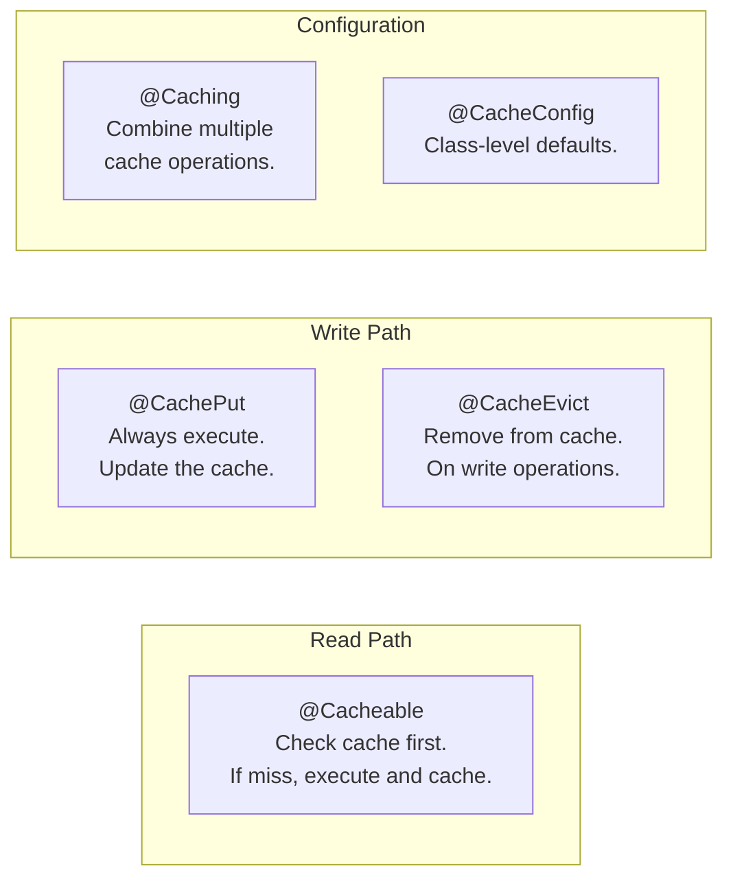
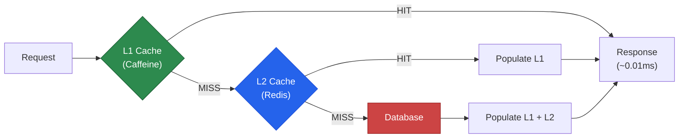

# Caching

Caching is the most impactful performance optimization you can add to a Spring Boot application. A database query that takes 50ms can be served from cache in 0.1ms — a 500x improvement. But caching introduces complexity: stale data, cache invalidation, thundering herd, and memory management. Spring Boot's caching abstraction makes the happy path easy; this page covers the hard parts too.

## Setup

```xml
<!-- pom.xml -->
<dependency>
    <groupId>org.springframework.boot</groupId>
    <artifactId>spring-boot-starter-cache</artifactId>
</dependency>

<!-- Pick ONE cache implementation: -->

<!-- Option 1: Caffeine (in-process, recommended for single-instance) -->
<dependency>
    <groupId>com.github.ben-manes.caffeine</groupId>
    <artifactId>caffeine</artifactId>
</dependency>

<!-- Option 2: Redis (distributed, recommended for multi-instance) -->
<dependency>
    <groupId>org.springframework.boot</groupId>
    <artifactId>spring-boot-starter-data-redis</artifactId>
</dependency>
```

```java
@SpringBootApplication
@EnableCaching  // Activates the caching abstraction
public class MyAppApplication {
    public static void main(String[] args) {
        SpringApplication.run(MyAppApplication.class, args);
    }
}
```

## Cache Abstraction Annotations



### @Cacheable

```java
@Service
@RequiredArgsConstructor
@CacheConfig(cacheNames = "products")  // Default cache name for all methods
@Slf4j
public class ProductService {

    private final ProductRepository productRepository;

    /**
     * First call: executes the method, caches the result.
     * Subsequent calls with same ID: returns cached value, skips DB query.
     */
    @Cacheable(key = "#id")
    public ProductResponse findById(UUID id) {
        log.info("Cache MISS for product: {}", id);
        return productRepository.findById(id)
                .map(ProductResponse::from)
                .orElseThrow(() -> new ResourceNotFoundException("Product", id));
    }

    /**
     * Conditional caching: only cache if the result meets criteria.
     */
    @Cacheable(
            key = "#sku",
            unless = "#result == null",                 // Don't cache null
            condition = "#sku != null && #sku.length() > 0"  // Don't cache empty keys
    )
    public ProductResponse findBySku(String sku) {
        return productRepository.findBySku(sku)
                .map(ProductResponse::from)
                .orElse(null);
    }

    /**
     * Custom key using SpEL.
     */
    @Cacheable(
            cacheNames = "productSearch",
            key = "T(java.lang.String).format('%s_%s_%s', #category, #minPrice, #maxPrice)"
    )
    public List<ProductResponse> findByCategory(
            ProductCategory category, BigDecimal minPrice, BigDecimal maxPrice) {
        return productRepository.findByCategoryAndPriceBetween(category, minPrice, maxPrice)
                .stream().map(ProductResponse::from).toList();
    }
}
```

### @CacheEvict and @CachePut

```java
@Service
@RequiredArgsConstructor
@Slf4j
public class ProductService {

    /**
     * @CachePut: always executes the method and updates the cache.
     * Use for update operations where you want the cache to reflect the new state.
     */
    @CachePut(cacheNames = "products", key = "#id")
    @CacheEvict(cacheNames = "productSearch", allEntries = true)
    @Transactional
    public ProductResponse update(UUID id, UpdateProductRequest request) {
        Product product = productRepository.findById(id)
                .orElseThrow(() -> new ResourceNotFoundException("Product", id));
        product.setName(request.name());
        product.setPrice(request.price());
        return ProductResponse.from(productRepository.save(product));
    }

    /**
     * @CacheEvict: removes entry from cache.
     */
    @CacheEvict(cacheNames = "products", key = "#id")
    @Transactional
    public void delete(UUID id) {
        productRepository.deleteById(id);
    }

    /**
     * @Caching: combine multiple cache operations.
     */
    @Caching(evict = {
            @CacheEvict(cacheNames = "products", key = "#id"),
            @CacheEvict(cacheNames = "productSearch", allEntries = true),
            @CacheEvict(cacheNames = "productsByCategory", allEntries = true)
    })
    @Transactional
    public void deactivate(UUID id) {
        productRepository.deactivateById(id);
    }

    /**
     * Evict all entries in a cache.
     */
    @CacheEvict(cacheNames = "products", allEntries = true)
    @Scheduled(fixedRate = 3600000)  // Every hour
    public void evictAllProductsCache() {
        log.info("Products cache evicted");
    }
}
```

## Caffeine Configuration

Caffeine is the best in-process cache for Java. It uses Window TinyLFU eviction, achieving near-optimal hit rates.

```java
@Configuration
@EnableCaching
public class CacheConfig {

    @Bean
    public CacheManager cacheManager() {
        CaffeineCacheManager manager = new CaffeineCacheManager();
        manager.setCaffeine(Caffeine.newBuilder()
                .maximumSize(10_000)
                .expireAfterWrite(Duration.ofMinutes(30))
                .recordStats());  // Enable cache statistics
        return manager;
    }

    /**
     * Multiple caches with different configurations.
     */
    @Bean
    public CacheManager customCacheManager() {
        SimpleCacheManager manager = new SimpleCacheManager();

        manager.setCaches(List.of(
                buildCache("products", 5000, Duration.ofMinutes(30)),
                buildCache("productSearch", 1000, Duration.ofMinutes(5)),
                buildCache("categories", 100, Duration.ofHours(24)),
                buildCache("userSessions", 10000, Duration.ofMinutes(60)),
                buildCache("rateLimits", 50000, Duration.ofMinutes(1))
        ));

        return manager;
    }

    private CaffeineCache buildCache(String name, int maxSize, Duration ttl) {
        return new CaffeineCache(name,
                Caffeine.newBuilder()
                        .maximumSize(maxSize)
                        .expireAfterWrite(ttl)
                        .recordStats()
                        .build());
    }
}
```

```yaml
# Alternative: YAML-based Caffeine configuration
spring:
  cache:
    type: caffeine
    caffeine:
      spec: maximumSize=10000,expireAfterWrite=30m,recordStats
    cache-names: products,categories,userSessions
```

## Redis Configuration

```yaml
# application.yml
spring:
  data:
    redis:
      host: ${REDIS_HOST:localhost}
      port: ${REDIS_PORT:6379}
      password: ${REDIS_PASSWORD:}
      timeout: 2000ms
      lettuce:
        pool:
          max-active: 20
          max-idle: 10
          min-idle: 5
          max-wait: 2000ms

  cache:
    type: redis
    redis:
      time-to-live: 30m
      cache-null-values: false
      key-prefix: "myapp:"
      use-key-prefix: true
```

```java
@Configuration
@EnableCaching
public class RedisCacheConfig {

    @Bean
    public RedisCacheManager cacheManager(RedisConnectionFactory connectionFactory) {
        RedisCacheConfiguration defaultConfig = RedisCacheConfiguration.defaultCacheConfig()
                .entryTtl(Duration.ofMinutes(30))
                .serializeKeysWith(
                        RedisSerializationContext.SerializationPair.fromSerializer(
                                new StringRedisSerializer()))
                .serializeValuesWith(
                        RedisSerializationContext.SerializationPair.fromSerializer(
                                new GenericJackson2JsonRedisSerializer()))
                .disableCachingNullValues()
                .prefixCacheNameWith("myapp:");

        // Per-cache TTL configuration
        Map<String, RedisCacheConfiguration> cacheConfigs = Map.of(
                "products", defaultConfig.entryTtl(Duration.ofMinutes(30)),
                "categories", defaultConfig.entryTtl(Duration.ofHours(24)),
                "productSearch", defaultConfig.entryTtl(Duration.ofMinutes(5)),
                "userSessions", defaultConfig.entryTtl(Duration.ofHours(1)),
                "rateLimits", defaultConfig.entryTtl(Duration.ofMinutes(1))
        );

        return RedisCacheManager.builder(connectionFactory)
                .cacheDefaults(defaultConfig)
                .withInitialCacheConfigurations(cacheConfigs)
                .transactionAware()
                .build();
    }

    @Bean
    public RedisTemplate<String, Object> redisTemplate(
            RedisConnectionFactory connectionFactory) {
        RedisTemplate<String, Object> template = new RedisTemplate<>();
        template.setConnectionFactory(connectionFactory);
        template.setKeySerializer(new StringRedisSerializer());
        template.setValueSerializer(new GenericJackson2JsonRedisSerializer());
        template.setHashKeySerializer(new StringRedisSerializer());
        template.setHashValueSerializer(new GenericJackson2JsonRedisSerializer());
        template.afterPropertiesSet();
        return template;
    }
}
```

## Cache-Aside Pattern

The cache-aside (lazy-loading) pattern is what `@Cacheable` implements. But sometimes you need manual control:

```java
@Service
@RequiredArgsConstructor
@Slf4j
public class ProductCacheService {

    private final ProductRepository productRepository;
    private final RedisTemplate<String, Object> redisTemplate;
    private final ObjectMapper objectMapper;

    private static final String CACHE_PREFIX = "product:";
    private static final Duration TTL = Duration.ofMinutes(30);

    /**
     * Manual cache-aside: check cache, load from DB on miss, populate cache.
     */
    public ProductResponse findById(UUID id) {
        String key = CACHE_PREFIX + id;

        // 1. Check cache
        Object cached = redisTemplate.opsForValue().get(key);
        if (cached != null) {
            log.debug("Cache HIT: {}", key);
            return objectMapper.convertValue(cached, ProductResponse.class);
        }

        // 2. Cache miss — load from database
        log.debug("Cache MISS: {}", key);
        Product product = productRepository.findById(id)
                .orElseThrow(() -> new ResourceNotFoundException("Product", id));

        ProductResponse response = ProductResponse.from(product);

        // 3. Populate cache
        redisTemplate.opsForValue().set(key, response, TTL);

        return response;
    }

    /**
     * Write-through: update DB and cache atomically.
     */
    @Transactional
    public ProductResponse update(UUID id, UpdateProductRequest request) {
        Product product = productRepository.findById(id)
                .orElseThrow(() -> new ResourceNotFoundException("Product", id));

        product.setName(request.name());
        product.setPrice(request.price());
        Product saved = productRepository.save(product);

        ProductResponse response = ProductResponse.from(saved);

        // Update cache
        String key = CACHE_PREFIX + id;
        redisTemplate.opsForValue().set(key, response, TTL);

        return response;
    }

    /**
     * Cache-aside with distributed lock (prevents thundering herd).
     */
    public ProductResponse findByIdWithLock(UUID id) {
        String key = CACHE_PREFIX + id;
        String lockKey = "lock:" + key;

        Object cached = redisTemplate.opsForValue().get(key);
        if (cached != null) {
            return objectMapper.convertValue(cached, ProductResponse.class);
        }

        // Acquire distributed lock
        Boolean locked = redisTemplate.opsForValue()
                .setIfAbsent(lockKey, "1", Duration.ofSeconds(10));

        if (Boolean.TRUE.equals(locked)) {
            try {
                // Double-check after acquiring lock
                cached = redisTemplate.opsForValue().get(key);
                if (cached != null) {
                    return objectMapper.convertValue(cached, ProductResponse.class);
                }

                // Load from DB and cache
                ProductResponse response = loadFromDb(id);
                redisTemplate.opsForValue().set(key, response, TTL);
                return response;
            } finally {
                redisTemplate.delete(lockKey);
            }
        } else {
            // Another thread is loading — wait and retry
            try {
                Thread.sleep(100);
            } catch (InterruptedException e) {
                Thread.currentThread().interrupt();
            }
            return findByIdWithLock(id);
        }
    }
}
```

## Multi-Layer Caching

Combine Caffeine (L1, in-process) with Redis (L2, distributed):

```java
@Configuration
@EnableCaching
public class MultiLayerCacheConfig {

    @Bean
    @Primary
    public CacheManager multiLayerCacheManager(
            RedisConnectionFactory redisFactory) {

        return new CompositeCacheManager(
                caffeineCacheManager(),     // L1: local, fast
                redisCacheManager(redisFactory)  // L2: distributed, shared
        );
    }

    private CacheManager caffeineCacheManager() {
        CaffeineCacheManager manager = new CaffeineCacheManager("products");
        manager.setCaffeine(Caffeine.newBuilder()
                .maximumSize(1000)
                .expireAfterWrite(Duration.ofMinutes(5)));
        return manager;
    }

    private CacheManager redisCacheManager(RedisConnectionFactory factory) {
        return RedisCacheManager.builder(factory)
                .cacheDefaults(RedisCacheConfiguration.defaultCacheConfig()
                        .entryTtl(Duration.ofMinutes(30)))
                .build();
    }
}
```



## Cache Metrics

```java
@Component
@RequiredArgsConstructor
public class CacheMetricsExporter {

    private final CacheManager cacheManager;
    private final MeterRegistry meterRegistry;

    @Scheduled(fixedRate = 60_000)
    public void exportCacheMetrics() {
        if (cacheManager instanceof CaffeineCacheManager caffeine) {
            caffeine.getCacheNames().forEach(name -> {
                Cache cache = caffeine.getCache(name);
                if (cache != null) {
                    com.github.benmanes.caffeine.cache.Cache<?, ?> nativeCache =
                            (com.github.benmanes.caffeine.cache.Cache<?, ?>)
                                    cache.getNativeCache();
                    CacheStats stats = nativeCache.stats();

                    Gauge.builder("cache.hit.rate", stats, CacheStats::hitRate)
                            .tag("cache", name).register(meterRegistry);
                    Gauge.builder("cache.size", nativeCache, c -> c.estimatedSize())
                            .tag("cache", name).register(meterRegistry);
                    Gauge.builder("cache.eviction.count", stats, CacheStats::evictionCount)
                            .tag("cache", name).register(meterRegistry);
                }
            });
        }
    }
}
```

## Cache Strategy Decision Matrix

| Scenario | Strategy | TTL | Eviction |
|---|---|---|---|
| Product catalog | Cache-aside (Caffeine + Redis) | 30 min | On update + TTL |
| User sessions | Redis only | 1 hour | On logout + TTL |
| Rate limits | Redis (atomic counters) | 1 minute | TTL |
| Config/feature flags | Caffeine | 5 min | On refresh |
| Search results | Redis | 5 min | TTL only |
| Static reference data | Caffeine | 24 hours | TTL + startup |

::: tip When NOT to cache
Do not cache: real-time data (stock prices), highly personalized data (user dashboards with live state), data that changes every request, or data that must be consistent across nodes without any staleness tolerance. Caching adds complexity — only cache when the read-to-write ratio justifies it.
:::

## Further Reading

- **[Hibernate Performance Tuning](./hibernate-tuning)** — Second-level cache
- **[Actuator & Monitoring](./actuator)** — Cache metrics
- **[Async & Scheduling](./async)** — Scheduled cache warming
- **[Best Practices](./best-practices)** — Caching anti-patterns
