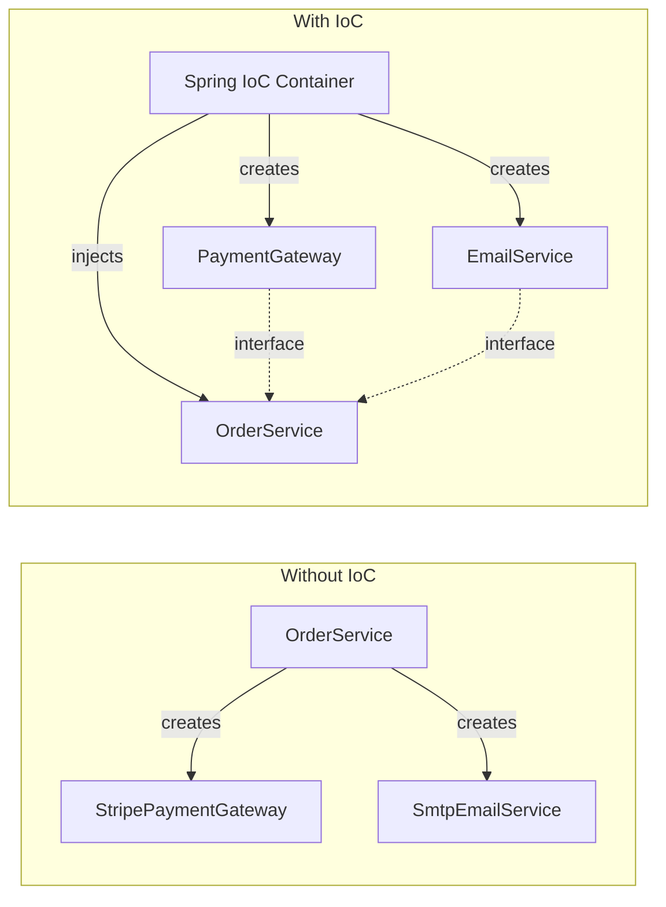
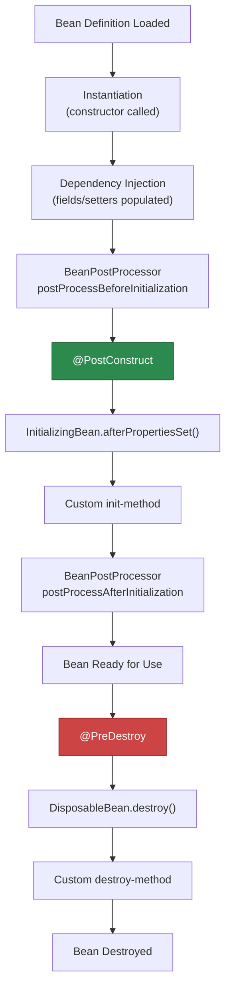
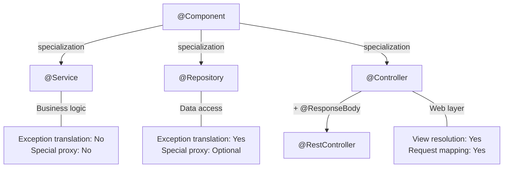
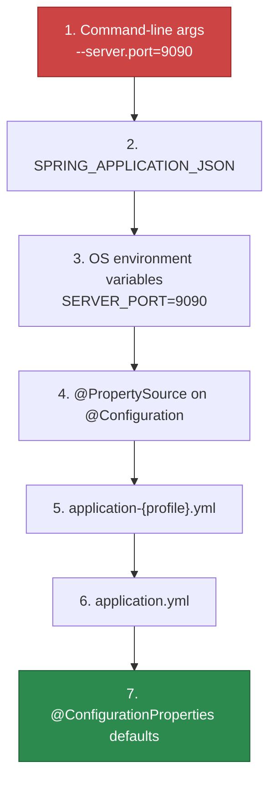

# Core Concepts

Every feature in Spring Boot — from REST controllers to Kafka consumers to scheduled jobs — is built on top of the same foundation: the **Inversion of Control (IoC) container**. If you do not understand how beans are created, wired, scoped, and destroyed, you will spend your career fighting the framework instead of using it.

This page covers the container internals that matter for daily development: how dependency injection actually works, the full bean lifecycle, stereotypes, configuration classes, profiles, and externalized properties.

## Inversion of Control (IoC)

In traditional programming, your code creates its dependencies:

```java
// Tight coupling — you control the dependency
public class OrderService {
    private final PaymentGateway gateway = new StripePaymentGateway();
    private final EmailService email = new SmtpEmailService();
}
```

With IoC, the container creates and injects dependencies:

```java
// Loose coupling — the container controls the dependency
@Service
public class OrderService {
    private final PaymentGateway gateway;   // Interface, not implementation
    private final EmailService email;

    public OrderService(PaymentGateway gateway, EmailService email) {
        this.gateway = gateway;
        this.email = email;
    }
}
```

The difference is not academic. With IoC:

- You can swap implementations without changing the consumer (Stripe -> PayPal)
- You can inject mocks for testing
- The container manages lifecycle (singleton, prototype, request-scoped)
- Circular dependencies are detected at startup, not at runtime



## Dependency Injection Methods

Spring supports three ways to inject dependencies. **Constructor injection is the only one you should use.**

### Constructor Injection (Recommended)

```java
@Service
public class OrderService {

    private final PaymentGateway paymentGateway;
    private final InventoryService inventoryService;
    private final NotificationService notificationService;

    // Spring auto-detects this constructor and injects all parameters
    // @Autowired is optional when there's only one constructor
    public OrderService(
            PaymentGateway paymentGateway,
            InventoryService inventoryService,
            NotificationService notificationService) {
        this.paymentGateway = paymentGateway;
        this.inventoryService = inventoryService;
        this.notificationService = notificationService;
    }

    public OrderResponse placeOrder(OrderRequest request) {
        inventoryService.reserve(request.items());
        PaymentResult result = paymentGateway.charge(request.paymentMethod(), request.total());
        notificationService.sendOrderConfirmation(request.email(), result);
        return new OrderResponse(result.transactionId());
    }
}
```

Why constructor injection wins:

| Property | Constructor | Setter | Field |
|---|---|---|---|
| **Immutability** | Fields can be `final` | Mutable | Mutable |
| **Required deps** | Enforced by compiler | Runtime NPE risk | Runtime NPE risk |
| **Testability** | `new Service(mockA, mockB)` | Must call setters | Requires reflection |
| **Circular detection** | Fails fast at startup | May silently work | May silently work |
| **Framework coupling** | None (plain constructor) | Needs `@Autowired` | Needs `@Autowired` |

::: danger Never use field injection
Field injection (`@Autowired private MyService service;`) is the most common anti-pattern in Spring code. It hides dependencies, makes testing painful (you need reflection or Spring context), and prevents immutability. Constructor injection makes dependencies explicit and testable.
:::

### Setter Injection (Rare, for Optional Dependencies)

```java
@Service
public class ReportService {

    private final DataSource dataSource; // required

    private CacheService cacheService; // optional

    public ReportService(DataSource dataSource) {
        this.dataSource = dataSource;
    }

    @Autowired(required = false)
    public void setCacheService(CacheService cacheService) {
        this.cacheService = cacheService;
    }
}
```

## Bean Lifecycle

Understanding when beans are created, initialized, and destroyed is critical for resource management:



### Lifecycle Hooks in Practice

```java
@Service
@Slf4j
public class CacheWarmingService {

    private final ProductRepository productRepository;
    private final CacheManager cacheManager;

    public CacheWarmingService(ProductRepository productRepository,
                                CacheManager cacheManager) {
        this.productRepository = productRepository;
        this.cacheManager = cacheManager;
        // WARNING: Don't do work here — dependencies may not be fully initialized
        log.info("Constructor called — cache manager is: {}", cacheManager);
    }

    /**
     * Called after all dependencies are injected.
     * Safe to use injected beans here.
     */
    @PostConstruct
    public void warmCache() {
        log.info("Warming product cache on startup...");
        List<Product> topProducts = productRepository.findTop100ByOrderBySalesDesc();
        Cache productCache = cacheManager.getCache("products");
        topProducts.forEach(p -> productCache.put(p.getId(), p));
        log.info("Cache warmed with {} products", topProducts.size());
    }

    /**
     * Called during graceful shutdown.
     * Clean up resources, flush buffers, close connections.
     */
    @PreDestroy
    public void shutdown() {
        log.info("Flushing cache metrics before shutdown...");
        // flush metrics, close connections, etc.
    }
}
```

### Using ApplicationRunner for Startup Logic

```java
@Component
@Slf4j
@Order(1) // Control execution order among multiple runners
public class DatabaseMigrationVerifier implements ApplicationRunner {

    private final DataSource dataSource;

    public DatabaseMigrationVerifier(DataSource dataSource) {
        this.dataSource = dataSource;
    }

    @Override
    public void run(ApplicationArguments args) throws Exception {
        try (Connection conn = dataSource.getConnection()) {
            DatabaseMetaData meta = conn.getMetaData();
            log.info("Connected to {} {}", meta.getDatabaseProductName(),
                    meta.getDatabaseProductVersion());
        }
    }
}
```

## Stereotype Annotations

Spring provides four stereotype annotations. They all register classes as beans, but carry semantic meaning:

```java
/**
 * @Component — Generic bean. Use when nothing else fits.
 */
@Component
public class EmailTemplateEngine {
    public String render(String template, Map<String, Object> vars) { /* ... */ }
}

/**
 * @Service — Business logic layer. No special behavior beyond @Component,
 * but signals that this class contains business rules.
 */
@Service
public class PricingService {
    public BigDecimal calculateDiscount(Customer customer, Order order) { /* ... */ }
}

/**
 * @Repository — Data access layer. Spring adds automatic exception translation:
 * JDBC/JPA exceptions → Spring's DataAccessException hierarchy.
 */
@Repository
public interface OrderRepository extends JpaRepository<Order, UUID> {
    List<Order> findByCustomerIdAndStatus(UUID customerId, OrderStatus status);
}

/**
 * @Controller / @RestController — Web layer.
 * @RestController = @Controller + @ResponseBody on every method.
 */
@RestController
@RequestMapping("/api/v1/orders")
public class OrderController {
    // ...
}
```



## @Configuration and @Bean

When you need to create beans from third-party classes (you cannot annotate their source code) or need complex initialization logic, use `@Configuration`:

```java
@Configuration
public class HttpClientConfig {

    @Bean
    public RestClient restClient(RestClient.Builder builder) {
        return builder
                .baseUrl("https://api.example.com")
                .defaultHeader("Accept", "application/json")
                .requestInterceptor((request, body, execution) -> {
                    log.debug("Request: {} {}", request.getMethod(), request.getURI());
                    return execution.execute(request, body);
                })
                .build();
    }

    @Bean
    public ObjectMapper objectMapper() {
        return JsonMapper.builder()
                .addModule(new JavaTimeModule())
                .disable(SerializationFeature.WRITE_DATES_AS_TIMESTAMPS)
                .enable(DeserializationFeature.FAIL_ON_UNKNOWN_PROPERTIES)
                .serializationInclusion(JsonInclude.Include.NON_NULL)
                .build();
    }

    @Bean
    @ConditionalOnProperty(name = "app.feature.audit", havingValue = "true")
    public AuditService auditService(AuditRepository repository) {
        return new AuditService(repository);
    }
}
```

### @Bean Method Scoping

```java
@Configuration
public class DataSourceConfig {

    @Bean
    @Primary  // Preferred when multiple DataSource beans exist
    public DataSource primaryDataSource(
            @Value("${spring.datasource.url}") String url,
            @Value("${spring.datasource.username}") String username,
            @Value("${spring.datasource.password}") String password) {
        HikariConfig config = new HikariConfig();
        config.setJdbcUrl(url);
        config.setUsername(username);
        config.setPassword(password);
        config.setMaximumPoolSize(20);
        return new HikariDataSource(config);
    }

    @Bean("analyticsDataSource")
    @Qualifier("analytics")
    public DataSource analyticsDataSource(
            @Value("${analytics.datasource.url}") String url) {
        HikariConfig config = new HikariConfig();
        config.setJdbcUrl(url);
        config.setMaximumPoolSize(5);
        config.setReadOnly(true);
        return new HikariDataSource(config);
    }
}
```

Injecting the qualified bean:

```java
@Service
public class AnalyticsService {

    private final DataSource analyticsDataSource;

    public AnalyticsService(@Qualifier("analytics") DataSource analyticsDataSource) {
        this.analyticsDataSource = analyticsDataSource;
    }
}
```

## Bean Scopes

| Scope | Behavior | Use Case |
|---|---|---|
| `singleton` (default) | One instance per ApplicationContext | Stateless services, repositories |
| `prototype` | New instance every injection | Stateful objects, builders |
| `request` | One per HTTP request | Request-scoped data |
| `session` | One per HTTP session | Session-scoped data |
| `application` | One per ServletContext | Shared across contexts |

```java
@Component
@Scope("prototype")
public class ShoppingCart {

    private final List<CartItem> items = new ArrayList<>();

    public void addItem(CartItem item) {
        items.add(item);
    }

    public BigDecimal getTotal() {
        return items.stream()
                .map(CartItem::subtotal)
                .reduce(BigDecimal.ZERO, BigDecimal::add);
    }
}
```

::: warning Prototype beans injected into singletons
If a prototype-scoped bean is injected into a singleton, you get only one instance — the prototype scope is effectively ignored. Use `ObjectProvider<T>` or `@Lookup` to get a new instance each time:
:::

```java
@Service
public class CheckoutService {

    private final ObjectProvider<ShoppingCart> cartProvider;

    public CheckoutService(ObjectProvider<ShoppingCart> cartProvider) {
        this.cartProvider = cartProvider;
    }

    public void checkout(UUID userId) {
        ShoppingCart cart = cartProvider.getObject(); // New instance each call
        // ...
    }
}
```

## Profiles

Profiles let you activate different beans and configurations for different environments:

```yaml
# application.yml (always loaded)
spring:
  application:
    name: my-app

---
# application-dev.yml
spring:
  config:
    activate:
      on-profile: dev
  datasource:
    url: jdbc:postgresql://localhost:5432/myapp_dev
  jpa:
    show-sql: true
    hibernate:
      ddl-auto: create-drop

logging:
  level:
    root: DEBUG

---
# application-prod.yml
spring:
  config:
    activate:
      on-profile: prod
  datasource:
    url: jdbc:postgresql://${DB_HOST}:5432/myapp
    hikari:
      maximum-pool-size: 50
  jpa:
    show-sql: false
    hibernate:
      ddl-auto: validate

logging:
  level:
    root: WARN
    com.example: INFO
```

### Profile-Specific Beans

```java
@Configuration
public class StorageConfig {

    @Bean
    @Profile("dev")
    public StorageService localStorageService() {
        return new LocalFileStorageService("/tmp/uploads");
    }

    @Bean
    @Profile("prod")
    public StorageService s3StorageService(
            @Value("${aws.s3.bucket}") String bucket,
            S3Client s3Client) {
        return new S3StorageService(s3Client, bucket);
    }

    @Bean
    @Profile("test")
    public StorageService inMemoryStorageService() {
        return new InMemoryStorageService();
    }
}
```

### Activating Profiles

```bash
# Environment variable (recommended for production)
export SPRING_PROFILES_ACTIVE=prod

# JVM argument
java -jar myapp.jar --spring.profiles.active=prod

# In application.yml
spring:
  profiles:
    active: dev

# Multiple profiles
java -jar myapp.jar --spring.profiles.active=prod,metrics,kafka

# In tests
@SpringBootTest
@ActiveProfiles("test")
class MyServiceTest {
    // ...
}
```

## Externalized Configuration

Spring Boot resolves properties in a specific order of precedence (highest wins):



### Type-Safe Configuration with @ConfigurationProperties

```java
@ConfigurationProperties(prefix = "app.payment")
@Validated
public record PaymentProperties(
        @NotBlank String apiKey,
        @NotBlank String apiSecret,
        @NotNull URI baseUrl,
        @Min(1) @Max(30) int timeoutSeconds,
        RetryProperties retry
) {
    public record RetryProperties(
            @Min(0) @Max(10) int maxAttempts,
            @Min(100) long initialDelayMs,
            double multiplier
    ) {}
}
```

```yaml
# application.yml
app:
  payment:
    api-key: ${PAYMENT_API_KEY}
    api-secret: ${PAYMENT_API_SECRET}
    base-url: https://api.stripe.com
    timeout-seconds: 10
    retry:
      max-attempts: 3
      initial-delay-ms: 500
      multiplier: 2.0
```

```java
// Enable and use the properties
@Configuration
@EnableConfigurationProperties(PaymentProperties.class)
public class PaymentConfig {

    @Bean
    public PaymentClient paymentClient(PaymentProperties props) {
        return PaymentClient.builder()
                .apiKey(props.apiKey())
                .apiSecret(props.apiSecret())
                .baseUrl(props.baseUrl())
                .timeout(Duration.ofSeconds(props.timeoutSeconds()))
                .maxRetries(props.retry().maxAttempts())
                .build();
    }
}
```

::: tip Use records for @ConfigurationProperties
Since Spring Boot 3.x, `@ConfigurationProperties` works with Java records via constructor binding. Records are immutable and require no getters/setters. This is the cleanest way to handle configuration.
:::

## Event System

Spring's event system enables loose coupling between components:

```java
// Define a custom event
public record OrderPlacedEvent(
        UUID orderId,
        UUID customerId,
        BigDecimal total,
        Instant placedAt
) {}

// Publish events
@Service
@RequiredArgsConstructor
public class OrderService {

    private final ApplicationEventPublisher eventPublisher;
    private final OrderRepository orderRepository;

    @Transactional
    public Order placeOrder(OrderRequest request) {
        Order order = orderRepository.save(Order.from(request));

        eventPublisher.publishEvent(new OrderPlacedEvent(
                order.getId(),
                order.getCustomerId(),
                order.getTotal(),
                Instant.now()
        ));

        return order;
    }
}

// Listen for events
@Component
@Slf4j
public class OrderEventListeners {

    @EventListener
    public void handleOrderPlaced(OrderPlacedEvent event) {
        log.info("Order {} placed for customer {}",
                event.orderId(), event.customerId());
    }

    // Async listener for non-critical work
    @Async
    @EventListener
    public void sendOrderConfirmation(OrderPlacedEvent event) {
        // Send email — runs in a separate thread
    }

    // Transactional listener — runs after commit
    @TransactionalEventListener(phase = TransactionPhase.AFTER_COMMIT)
    public void syncToAnalytics(OrderPlacedEvent event) {
        // Only fires if the transaction commits successfully
    }

    // Conditional listener
    @EventListener(condition = "#event.total.compareTo(T(java.math.BigDecimal).valueOf(1000)) > 0")
    public void handleHighValueOrder(OrderPlacedEvent event) {
        log.warn("High-value order detected: {} — ${}", event.orderId(), event.total());
    }
}
```

## SpEL (Spring Expression Language)

SpEL is used throughout Spring for dynamic expressions in annotations:

```java
@Service
public class FeatureFlagService {

    @Value("${app.feature.dark-mode:false}")
    private boolean darkModeEnabled;

    // SpEL with system properties
    @Value("#{ systemProperties['user.home'] }")
    private String userHome;

    // SpEL with bean reference
    @Value("#{ @environmentService.isProduction() ? 'strict' : 'lenient' }")
    private String validationMode;

    // SpEL in @Cacheable
    @Cacheable(value = "users", key = "#userId",
               condition = "#userId != null",
               unless = "#result == null")
    public User findUser(UUID userId) {
        // ...
    }

    // SpEL in @PreAuthorize
    @PreAuthorize("hasRole('ADMIN') or #userId == authentication.principal.id")
    public void deleteUser(UUID userId) {
        // ...
    }

    // SpEL in @Scheduled
    @Scheduled(fixedDelayString = "${app.cleanup.interval:PT5M}")
    public void cleanupExpiredSessions() {
        // ...
    }
}
```

## Kotlin-Specific Patterns

Spring Boot has first-class Kotlin support. Here is the idiomatic way to write the same patterns:

```kotlin
@Service
class OrderService(
    private val orderRepository: OrderRepository,
    private val paymentGateway: PaymentGateway,
    private val eventPublisher: ApplicationEventPublisher
) {
    @Transactional
    fun placeOrder(request: OrderRequest): OrderResponse {
        val order = orderRepository.save(request.toEntity())

        eventPublisher.publishEvent(
            OrderPlacedEvent(
                orderId = order.id,
                customerId = order.customerId,
                total = order.total
            )
        )

        return order.toResponse()
    }

    fun findById(id: UUID): OrderResponse =
        orderRepository.findByIdOrNull(id)
            ?.toResponse()
            ?: throw ResourceNotFoundException("Order", id)
}

// Configuration with Kotlin DSL
@Configuration
class SecurityConfig {

    @Bean
    fun securityFilterChain(http: HttpSecurity): SecurityFilterChain =
        http {
            csrf { disable() }
            authorizeHttpRequests {
                authorize("/api/public/**", permitAll)
                authorize("/api/admin/**", hasRole("ADMIN"))
                authorize(anyRequest, authenticated)
            }
            oauth2ResourceServer {
                jwt { }
            }
        }
}

// Type-safe configuration
@ConfigurationProperties(prefix = "app.notifications")
data class NotificationProperties(
    val enabled: Boolean = true,
    val email: EmailProperties = EmailProperties(),
    val slack: SlackProperties = SlackProperties()
) {
    data class EmailProperties(
        val from: String = "noreply@example.com",
        val replyTo: String? = null
    )
    data class SlackProperties(
        val webhookUrl: String? = null,
        val channel: String = "#alerts"
    )
}
```

## Common Pitfalls

### Circular Dependencies

```java
// This WILL fail at startup with constructor injection (good!)
@Service
public class ServiceA {
    public ServiceA(ServiceB b) { }
}

@Service
public class ServiceB {
    public ServiceB(ServiceA a) { }
}
```

**Fix:** Refactor to break the cycle. Extract shared logic into a third service, or use `@Lazy` on one dependency as a last resort:

```java
@Service
public class ServiceA {
    public ServiceA(@Lazy ServiceB b) { } // Creates a proxy, resolves later
}
```

### Missing @Transactional Propagation

```java
@Service
public class PaymentService {

    @Transactional
    public void processPayment(PaymentRequest request) {
        // This internal call SKIPS the @Transactional proxy!
        validatePayment(request);
    }

    @Transactional(propagation = Propagation.REQUIRES_NEW)
    public void validatePayment(PaymentRequest request) {
        // This runs in the SAME transaction as processPayment,
        // not a new one, because self-invocation bypasses the proxy
    }
}
```

**Fix:** Inject the service into itself, or better, extract to a separate class.

## Further Reading

- **[REST API Development](./rest-api)** — Build production REST APIs with validation and pagination
- **[Spring Data JPA](./spring-data-jpa)** — Entity mapping and repository patterns
- **[Spring Security](./security)** — Authentication and authorization fundamentals
- **[Testing](./testing)** — How to test beans, services, and controllers
- **[Best Practices](./best-practices)** — Anti-patterns to avoid in production
