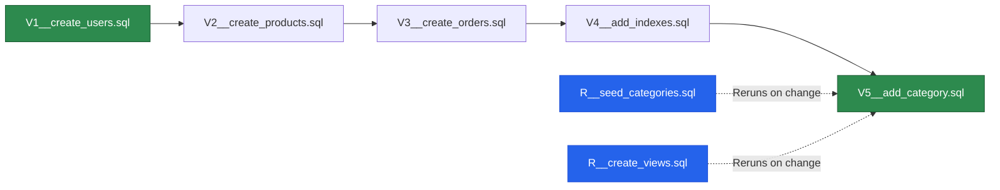
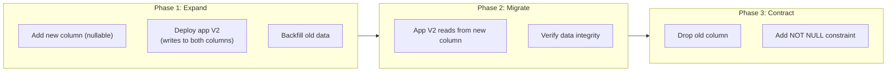

# Database Migrations

Every production database needs versioned, repeatable schema changes. Hibernate's `ddl-auto` is for prototyping — it cannot rename columns, migrate data, or handle the dozens of edge cases that real schema evolution requires. Database migration tools bring version control discipline to your schema: every change is a numbered file, applied once, tracked in a metadata table, and reversible.

This page covers Flyway (the most popular choice in Spring Boot) and Liquibase, along with zero-downtime migration patterns that matter when your database serves millions of requests.

## Flyway Setup

### Dependencies

```xml
<!-- pom.xml -->
<dependency>
    <groupId>org.flywaydb</groupId>
    <artifactId>flyway-core</artifactId>
</dependency>
<!-- For PostgreSQL-specific features -->
<dependency>
    <groupId>org.flywaydb</groupId>
    <artifactId>flyway-database-postgresql</artifactId>
</dependency>
```

### Configuration

```yaml
# application.yml
spring:
  flyway:
    enabled: true
    locations: classpath:db/migration
    baseline-on-migrate: true      # For existing databases without Flyway history
    baseline-version: '0'
    validate-on-migrate: true       # Verify checksums of applied migrations
    out-of-order: false             # Don't allow out-of-order migrations in prod
    clean-disabled: true            # NEVER allow clean in production!
    table: flyway_schema_history
    schemas:
      - public

  jpa:
    hibernate:
      ddl-auto: validate            # Validate schema matches entities AFTER migration

  datasource:
    url: jdbc:postgresql://localhost:5432/myapp
    username: ${DB_USERNAME:postgres}
    password: ${DB_PASSWORD:postgres}
```

::: danger Never set clean-disabled to false in production
`flyway.clean-disabled: false` allows `flyway:clean` to drop ALL objects in the schema. A single accidental command or misconfigured CI pipeline can destroy your entire database. Always keep this `true` in production.
:::

### Migration File Naming

```
src/main/resources/db/migration/
├── V1__create_users_table.sql
├── V2__create_products_table.sql
├── V3__create_orders_table.sql
├── V4__add_email_index_to_users.sql
├── V5__add_category_to_products.sql
├── V6__create_reviews_table.sql
├── V7__add_full_text_search_index.sql
├── R__seed_categories.sql              # Repeatable migration
└── R__create_views.sql                 # Repeatable migration
```

**Naming convention:** `V{version}__{description}.sql`

| Prefix | Meaning | Behavior |
|---|---|---|
| `V` | Versioned | Runs once, in order. Checksum is tracked. |
| `R` | Repeatable | Runs every time the checksum changes. Good for views, functions, seed data. |
| `U` | Undo (paid) | Reverses a versioned migration. Flyway Teams only. |



### Migration Examples

```sql
-- V1__create_users_table.sql
CREATE TABLE users (
    id          UUID PRIMARY KEY DEFAULT gen_random_uuid(),
    email       VARCHAR(255) NOT NULL,
    first_name  VARCHAR(100) NOT NULL,
    last_name   VARCHAR(100) NOT NULL,
    password_hash VARCHAR(255) NOT NULL,
    role        VARCHAR(50) NOT NULL DEFAULT 'USER',
    active      BOOLEAN NOT NULL DEFAULT TRUE,
    created_at  TIMESTAMP WITH TIME ZONE NOT NULL DEFAULT NOW(),
    updated_at  TIMESTAMP WITH TIME ZONE NOT NULL DEFAULT NOW(),
    CONSTRAINT uk_users_email UNIQUE (email)
);

CREATE INDEX idx_users_email ON users (email);
CREATE INDEX idx_users_role ON users (role) WHERE active = TRUE;
```

```sql
-- V2__create_products_table.sql
CREATE TABLE products (
    id              UUID PRIMARY KEY DEFAULT gen_random_uuid(),
    name            VARCHAR(200) NOT NULL,
    description     TEXT,
    price           NUMERIC(12, 2) NOT NULL CHECK (price >= 0),
    sku             VARCHAR(20) NOT NULL,
    category        VARCHAR(50) NOT NULL,
    stock_quantity  INTEGER NOT NULL DEFAULT 0 CHECK (stock_quantity >= 0),
    active          BOOLEAN NOT NULL DEFAULT TRUE,
    version         BIGINT NOT NULL DEFAULT 0,
    created_at      TIMESTAMP WITH TIME ZONE NOT NULL DEFAULT NOW(),
    updated_at      TIMESTAMP WITH TIME ZONE NOT NULL DEFAULT NOW(),
    created_by      VARCHAR(255),
    updated_by      VARCHAR(255),
    CONSTRAINT uk_products_sku UNIQUE (sku)
);

CREATE INDEX idx_products_category ON products (category);
CREATE INDEX idx_products_price ON products (price);
CREATE INDEX idx_products_active ON products (active) WHERE active = TRUE;
```

```sql
-- V3__create_orders_table.sql
CREATE TABLE orders (
    id          UUID PRIMARY KEY DEFAULT gen_random_uuid(),
    customer_id UUID NOT NULL REFERENCES users(id),
    status      VARCHAR(50) NOT NULL DEFAULT 'PENDING',
    total       NUMERIC(12, 2) NOT NULL,
    notes       TEXT,
    created_at  TIMESTAMP WITH TIME ZONE NOT NULL DEFAULT NOW(),
    updated_at  TIMESTAMP WITH TIME ZONE NOT NULL DEFAULT NOW()
);

CREATE TABLE order_items (
    id          UUID PRIMARY KEY DEFAULT gen_random_uuid(),
    order_id    UUID NOT NULL REFERENCES orders(id) ON DELETE CASCADE,
    product_id  UUID NOT NULL REFERENCES products(id),
    quantity    INTEGER NOT NULL CHECK (quantity > 0),
    unit_price  NUMERIC(12, 2) NOT NULL,
    subtotal    NUMERIC(12, 2) NOT NULL
);

CREATE INDEX idx_orders_customer ON orders (customer_id);
CREATE INDEX idx_orders_status ON orders (status);
CREATE INDEX idx_orders_created ON orders (created_at);
CREATE INDEX idx_order_items_order ON order_items (order_id);
CREATE INDEX idx_order_items_product ON order_items (product_id);
```

```sql
-- V4__add_full_text_search.sql
-- PostgreSQL full-text search index
ALTER TABLE products ADD COLUMN search_vector TSVECTOR;

CREATE INDEX idx_products_search ON products USING GIN (search_vector);

-- Trigger to keep search_vector updated
CREATE OR REPLACE FUNCTION products_search_trigger()
RETURNS TRIGGER AS $$
BEGIN
    NEW.search_vector := to_tsvector('english',
        COALESCE(NEW.name, '') || ' ' || COALESCE(NEW.description, ''));
    RETURN NEW;
END;
$$ LANGUAGE plpgsql;

CREATE TRIGGER trg_products_search
    BEFORE INSERT OR UPDATE OF name, description ON products
    FOR EACH ROW
    EXECUTE FUNCTION products_search_trigger();

-- Backfill existing rows
UPDATE products SET search_vector = to_tsvector('english',
    COALESCE(name, '') || ' ' || COALESCE(description, ''));
```

```sql
-- R__seed_categories.sql (Repeatable)
-- Runs every time this file changes
INSERT INTO categories (name, slug, sort_order)
VALUES
    ('Electronics', 'electronics', 1),
    ('Clothing', 'clothing', 2),
    ('Books', 'books', 3),
    ('Home & Garden', 'home-garden', 4),
    ('Sports', 'sports', 5)
ON CONFLICT (slug) DO UPDATE
    SET name = EXCLUDED.name,
        sort_order = EXCLUDED.sort_order;
```

## Java-Based Migrations

For complex data migrations that need application logic:

```java
package db.migration;

import org.flywaydb.core.api.migration.BaseJavaMigration;
import org.flywaydb.core.api.migration.Context;

import java.sql.*;

/**
 * V5: Migrate user full names from single column to first/last name.
 * File: src/main/java/db/migration/V5__split_user_names.java
 */
public class V5__split_user_names extends BaseJavaMigration {

    @Override
    public void migrate(Context context) throws Exception {
        Connection conn = context.getConnection();

        // Add new columns
        try (Statement stmt = conn.createStatement()) {
            stmt.execute("ALTER TABLE users ADD COLUMN IF NOT EXISTS first_name VARCHAR(100)");
            stmt.execute("ALTER TABLE users ADD COLUMN IF NOT EXISTS last_name VARCHAR(100)");
        }

        // Migrate data
        try (Statement select = conn.createStatement();
             PreparedStatement update = conn.prepareStatement(
                     "UPDATE users SET first_name = ?, last_name = ? WHERE id = ?")) {

            ResultSet rs = select.executeQuery("SELECT id, full_name FROM users");
            int batch = 0;

            while (rs.next()) {
                UUID id = (UUID) rs.getObject("id");
                String fullName = rs.getString("full_name");
                String[] parts = splitName(fullName);

                update.setString(1, parts[0]);
                update.setString(2, parts[1]);
                update.setObject(3, id);
                update.addBatch();

                if (++batch % 1000 == 0) {
                    update.executeBatch();
                }
            }
            update.executeBatch();
        }

        // Drop old column
        try (Statement stmt = conn.createStatement()) {
            stmt.execute("ALTER TABLE users DROP COLUMN full_name");
            stmt.execute("ALTER TABLE users ALTER COLUMN first_name SET NOT NULL");
            stmt.execute("ALTER TABLE users ALTER COLUMN last_name SET NOT NULL");
        }
    }

    private String[] splitName(String fullName) {
        if (fullName == null || fullName.isBlank()) {
            return new String[]{"Unknown", "Unknown"};
        }
        int lastSpace = fullName.lastIndexOf(' ');
        if (lastSpace < 0) {
            return new String[]{fullName, ""};
        }
        return new String[]{
                fullName.substring(0, lastSpace),
                fullName.substring(lastSpace + 1)
        };
    }
}
```

## Zero-Downtime Migrations

When your database serves live traffic, you cannot lock tables or make breaking changes. Every migration must be backward-compatible.

### Pattern: Expand-Contract Migration



**Example: Renaming a column from `name` to `title`**

```sql
-- Migration 1: Add new column (backward compatible)
-- V10__add_title_column.sql
ALTER TABLE products ADD COLUMN title VARCHAR(200);

-- Migration 2: Backfill (can run in background)
-- V11__backfill_title.sql
UPDATE products SET title = name WHERE title IS NULL;

-- After deploying code that writes to both columns and reads from 'title':

-- Migration 3: Make title NOT NULL, drop name (breaking for old code)
-- V12__drop_name_column.sql
ALTER TABLE products ALTER COLUMN title SET NOT NULL;
ALTER TABLE products DROP COLUMN name;
```

### Safe vs. Unsafe Operations

| Operation | Safe? | Notes |
|---|---|---|
| ADD COLUMN (nullable) | Safe | No table lock |
| ADD COLUMN (with DEFAULT) | Safe (PG 11+) | PG 11+ does not rewrite table |
| DROP COLUMN | Unsafe | Old code may reference it |
| RENAME COLUMN | Unsafe | Old code breaks immediately |
| ADD INDEX CONCURRENTLY | Safe | Use `CONCURRENTLY` keyword |
| ADD NOT NULL constraint | Risky | Requires full table scan |
| ALTER COLUMN TYPE | Unsafe | May lock table, rewrite data |

::: warning Always use CREATE INDEX CONCURRENTLY
Standard `CREATE INDEX` locks the table for writes. On a 100M row table, this can take minutes. Use `CREATE INDEX CONCURRENTLY` in PostgreSQL — it builds the index without blocking writes. Note: this cannot run inside a transaction, so use Flyway's non-transactional mode.
:::

```sql
-- V15__add_index_concurrently.sql
-- Flyway: disable transaction for CONCURRENTLY
-- flyway:executeInTransaction=false

CREATE INDEX CONCURRENTLY IF NOT EXISTS idx_orders_created_status
    ON orders (created_at, status);
```

## Liquibase Comparison

Liquibase is the main alternative to Flyway. It uses XML/YAML/JSON changelogs instead of raw SQL:

```xml
<!-- db/changelog/db.changelog-master.xml -->
<?xml version="1.0" encoding="UTF-8"?>
<databaseChangeLog
        xmlns="http://www.liquibase.org/xml/ns/dbchangelog"
        xmlns:xsi="http://www.w3.org/2001/XMLSchema-instance"
        xsi:schemaLocation="http://www.liquibase.org/xml/ns/dbchangelog
        http://www.liquibase.org/xml/ns/dbchangelog/dbchangelog-latest.xsd">

    <changeSet id="1" author="dev">
        <createTable tableName="users">
            <column name="id" type="UUID" defaultValueComputed="gen_random_uuid()">
                <constraints primaryKey="true" nullable="false"/>
            </column>
            <column name="email" type="VARCHAR(255)">
                <constraints nullable="false" unique="true"/>
            </column>
            <column name="first_name" type="VARCHAR(100)">
                <constraints nullable="false"/>
            </column>
            <column name="created_at" type="TIMESTAMP WITH TIME ZONE"
                    defaultValueComputed="NOW()">
                <constraints nullable="false"/>
            </column>
        </createTable>
    </changeSet>

    <changeSet id="2" author="dev">
        <addColumn tableName="users">
            <column name="phone" type="VARCHAR(20)"/>
        </addColumn>
        <rollback>
            <dropColumn tableName="users" columnName="phone"/>
        </rollback>
    </changeSet>
</databaseChangeLog>
```

### Flyway vs. Liquibase

| Feature | Flyway | Liquibase |
|---|---|---|
| **Migration format** | Raw SQL (native) | XML/YAML/JSON/SQL |
| **Database portability** | Write SQL per DB | Abstraction layer |
| **Rollback** | Manual (free), auto (paid) | Built-in rollback |
| **Learning curve** | Minimal | Moderate |
| **Diff generation** | No | Yes |
| **Conditional execution** | Limited | Preconditions |
| **Spring Boot support** | Auto-configured | Auto-configured |

::: tip Choose Flyway for Spring Boot
Unless you need database portability or built-in rollback, Flyway is the better choice for Spring Boot projects. Raw SQL migrations are easier to write, review, and debug. You already know SQL — you do not need an abstraction on top of it.
:::

## Multi-Tenant Migrations

For SaaS applications with per-tenant schemas:

```java
@Configuration
public class FlywayMultiTenantConfig {

    @Bean
    public Flyway flyway(DataSource dataSource, TenantRegistry tenantRegistry) {
        // Migrate the shared schema first
        Flyway sharedFlyway = Flyway.configure()
                .dataSource(dataSource)
                .locations("classpath:db/migration/shared")
                .schemas("shared")
                .load();
        sharedFlyway.migrate();

        // Migrate each tenant schema
        for (String tenantId : tenantRegistry.getAllTenantIds()) {
            Flyway tenantFlyway = Flyway.configure()
                    .dataSource(dataSource)
                    .locations("classpath:db/migration/tenant")
                    .schemas("tenant_" + tenantId)
                    .load();
            tenantFlyway.migrate();
        }

        return sharedFlyway;
    }
}
```

## Testing Migrations

```java
@SpringBootTest
@Testcontainers
class FlywayMigrationTest {

    @Container
    static PostgreSQLContainer<?> postgres = new PostgreSQLContainer<>("postgres:16")
            .withDatabaseName("testdb");

    @DynamicPropertySource
    static void configureProperties(DynamicPropertyRegistry registry) {
        registry.add("spring.datasource.url", postgres::getJdbcUrl);
        registry.add("spring.datasource.username", postgres::getUsername);
        registry.add("spring.datasource.password", postgres::getPassword);
    }

    @Autowired
    private Flyway flyway;

    @Test
    void allMigrationsApplyCleanly() {
        // Flyway runs automatically on startup
        // If we get here without exception, all migrations applied successfully
        MigrationInfoService info = flyway.info();
        assertThat(info.applied()).isNotEmpty();
        assertThat(info.pending()).isEmpty();

        // Verify no failed migrations
        for (MigrationInfo migration : info.all()) {
            assertThat(migration.getState())
                    .isNotIn(MigrationState.FAILED, MigrationState.UNDONE);
        }
    }

    @Test
    void entityMappingsMatchSchema() {
        // JPA validate mode checks this at startup
        // If the test context loads, entities match the schema
    }
}
```

## Further Reading

- **[Spring Data JPA](./spring-data-jpa)** — Entity mapping that works with your migrations
- **[Hibernate Performance Tuning](./hibernate-tuning)** — Indexes and query optimization
- **[Docker & Deployment](./docker)** — Running migrations in containers
- **[Testing](./testing)** — Testing with Testcontainers
