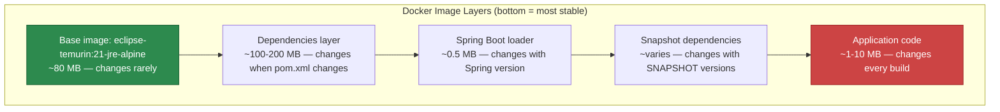

# Dockerization

Spring Boot applications are self-contained JARs with an embedded server — they are already designed for containerization. But there is a significant difference between a Docker image that works and one that is production-grade: image size, startup time, layer caching, security, and resource management all matter.

This page covers every approach to containerizing Spring Boot: multi-stage Dockerfiles, the JIB plugin (no Dockerfile needed), Cloud Native Buildpacks, GraalVM native images, Docker Compose for local development, and Kubernetes manifests.

## Multi-Stage Dockerfile

The standard approach. Two stages: build the JAR, then copy only the runtime artifacts.

```dockerfile
# Stage 1: Build
FROM eclipse-temurin:21-jdk-alpine AS builder

WORKDIR /app

# Cache Maven dependencies
COPY pom.xml .
COPY .mvn .mvn
COPY mvnw .
RUN chmod +x mvnw && ./mvnw dependency:go-offline -B

# Build the application
COPY src ./src
RUN ./mvnw package -DskipTests -B

# Extract layers for better caching
RUN java -Djarmode=layertools -jar target/*.jar extract --destination extracted

# Stage 2: Runtime
FROM eclipse-temurin:21-jre-alpine

# Security: run as non-root
RUN addgroup -S appgroup && adduser -S appuser -G appgroup

WORKDIR /app

# Copy extracted layers (most stable first for cache efficiency)
COPY --from=builder /app/extracted/dependencies/ ./
COPY --from=builder /app/extracted/spring-boot-loader/ ./
COPY --from=builder /app/extracted/snapshot-dependencies/ ./
COPY --from=builder /app/extracted/application/ ./

# Set ownership
RUN chown -R appuser:appgroup /app
USER appuser

# Health check
HEALTHCHECK --interval=30s --timeout=3s --retries=3 \
    CMD wget --no-verbose --tries=1 --spider http://localhost:8080/actuator/health || exit 1

EXPOSE 8080

# JVM tuning for containers
ENV JAVA_OPTS="-XX:+UseContainerSupport \
    -XX:MaxRAMPercentage=75.0 \
    -XX:InitialRAMPercentage=50.0 \
    -XX:+UseG1GC \
    -XX:+UseStringDeduplication \
    -Djava.security.egd=file:/dev/urandom"

ENTRYPOINT ["sh", "-c", "java $JAVA_OPTS org.springframework.boot.loader.launch.JarLauncher"]
```

### Layer Ordering Explained



::: tip Why layer ordering matters
Docker caches layers. If you change application code, only the top layer is rebuilt — the 200 MB dependencies layer is cached. Without layering, changing one line of Java code rebuilds the entire 300 MB image.
:::

## Gradle Dockerfile

```dockerfile
FROM eclipse-temurin:21-jdk-alpine AS builder

WORKDIR /app

COPY build.gradle.kts settings.gradle.kts gradlew ./
COPY gradle ./gradle
RUN chmod +x gradlew && ./gradlew dependencies --no-daemon

COPY src ./src
RUN ./gradlew bootJar --no-daemon -x test

RUN java -Djarmode=layertools -jar build/libs/*.jar extract --destination extracted

FROM eclipse-temurin:21-jre-alpine

RUN addgroup -S appgroup && adduser -S appuser -G appgroup
WORKDIR /app

COPY --from=builder /app/extracted/dependencies/ ./
COPY --from=builder /app/extracted/spring-boot-loader/ ./
COPY --from=builder /app/extracted/snapshot-dependencies/ ./
COPY --from=builder /app/extracted/application/ ./

USER appuser
EXPOSE 8080

ENV JAVA_OPTS="-XX:+UseContainerSupport -XX:MaxRAMPercentage=75.0"
ENTRYPOINT ["sh", "-c", "java $JAVA_OPTS org.springframework.boot.loader.launch.JarLauncher"]
```

## JIB Plugin (No Dockerfile)

Google's JIB builds optimized Docker images without a Dockerfile and without a Docker daemon. It integrates directly into Maven/Gradle.

```xml
<!-- pom.xml -->
<build>
    <plugins>
        <plugin>
            <groupId>com.google.cloud.tools</groupId>
            <artifactId>jib-maven-plugin</artifactId>
            <version>3.4.3</version>
            <configuration>
                <from>
                    <image>eclipse-temurin:21-jre-alpine</image>
                </from>
                <to>
                    <image>ghcr.io/myorg/my-app</image>
                    <tags>
                        <tag>${project.version}</tag>
                        <tag>latest</tag>
                    </tags>
                </to>
                <container>
                    <jvmFlags>
                        <jvmFlag>-XX:+UseContainerSupport</jvmFlag>
                        <jvmFlag>-XX:MaxRAMPercentage=75.0</jvmFlag>
                        <jvmFlag>-XX:+UseG1GC</jvmFlag>
                    </jvmFlags>
                    <ports>
                        <port>8080</port>
                    </ports>
                    <user>1000</user>
                    <creationTime>USE_CURRENT_TIMESTAMP</creationTime>
                    <environment>
                        <SPRING_PROFILES_ACTIVE>prod</SPRING_PROFILES_ACTIVE>
                    </environment>
                </container>
            </configuration>
        </plugin>
    </plugins>
</build>
```

```bash
# Build and push to registry (no Docker daemon needed!)
mvn jib:build

# Build to local Docker daemon
mvn jib:dockerBuild

# Build to tarball
mvn jib:buildTar
```

### JIB vs. Dockerfile vs. Buildpacks

| Feature | Dockerfile | JIB | Buildpacks |
|---|---|---|---|
| **Docker daemon required** | Yes | No | Yes |
| **Build speed** | Medium | Fast (no Docker) | Slow |
| **Layer optimization** | Manual | Automatic | Automatic |
| **Customization** | Full control | Configuration only | Limited |
| **Image size** | Depends on base | Optimized | Varies |
| **Reproducibility** | Depends | Deterministic | Deterministic |
| **CI/CD friendly** | Needs Docker-in-Docker | No Docker needed | Needs Docker |

## Cloud Native Buildpacks

Spring Boot has built-in Buildpack support — no Dockerfile needed:

```bash
# Maven
mvn spring-boot:build-image \
    -Dspring-boot.build-image.imageName=ghcr.io/myorg/my-app:latest

# Gradle
./gradlew bootBuildImage --imageName=ghcr.io/myorg/my-app:latest
```

```xml
<!-- Configure Buildpacks in pom.xml -->
<plugin>
    <groupId>org.springframework.boot</groupId>
    <artifactId>spring-boot-maven-plugin</artifactId>
    <configuration>
        <image>
            <name>ghcr.io/myorg/${project.artifactId}:${project.version}</name>
            <builder>paketobuildpacks/builder-jammy-base</builder>
            <env>
                <BP_JVM_VERSION>21</BP_JVM_VERSION>
                <BPE_JAVA_TOOL_OPTIONS>-XX:MaxRAMPercentage=75.0</BPE_JAVA_TOOL_OPTIONS>
            </env>
        </image>
    </configuration>
</plugin>
```

## GraalVM Native Image

Native images compile Java to machine code. The result: sub-second startup and minimal memory footprint.

```xml
<!-- pom.xml -->
<parent>
    <groupId>org.springframework.boot</groupId>
    <artifactId>spring-boot-starter-parent</artifactId>
    <version>3.4.3</version>
</parent>

<dependencies>
    <dependency>
        <groupId>org.springframework.boot</groupId>
        <artifactId>spring-boot-starter-web</artifactId>
    </dependency>
</dependencies>

<profiles>
    <profile>
        <id>native</id>
        <build>
            <plugins>
                <plugin>
                    <groupId>org.graalvm.buildtools</groupId>
                    <artifactId>native-maven-plugin</artifactId>
                </plugin>
            </plugins>
        </build>
    </profile>
</profiles>
```

```dockerfile
# Native image Dockerfile
FROM ghcr.io/graalvm/native-image-community:21 AS builder

WORKDIR /app
COPY . .
RUN chmod +x mvnw && ./mvnw -Pnative native:compile -DskipTests

FROM debian:bookworm-slim
RUN addgroup --system appgroup && adduser --system --ingroup appgroup appuser

COPY --from=builder /app/target/my-app /app/my-app
RUN chown appuser:appgroup /app/my-app

USER appuser
EXPOSE 8080

ENTRYPOINT ["/app/my-app"]
```

### JVM vs. Native Image

| Metric | JVM | Native Image |
|---|---|---|
| **Startup time** | 2-5 seconds | 0.05-0.2 seconds |
| **Memory at rest** | 150-300 MB | 30-80 MB |
| **Peak throughput** | Higher (JIT) | Lower |
| **Build time** | 30 seconds | 5-10 minutes |
| **Reflection support** | Full | Requires configuration |
| **Use case** | Long-running services | Serverless, CLI tools |

::: warning Native image limitations
Not all Spring libraries work with native images. Reflection-heavy libraries need GraalVM metadata hints. Check compatibility before committing to native. For long-running services where peak throughput matters more than startup time, the JVM mode is often better.
:::

## Docker Compose for Local Development

```yaml
# docker-compose.yml
services:
  app:
    build:
      context: .
      dockerfile: Dockerfile
    ports:
      - "8080:8080"
    environment:
      SPRING_PROFILES_ACTIVE: dev
      SPRING_DATASOURCE_URL: jdbc:postgresql://postgres:5432/myapp
      SPRING_DATASOURCE_USERNAME: postgres
      SPRING_DATASOURCE_PASSWORD: postgres
      SPRING_REDIS_HOST: redis
      SPRING_KAFKA_BOOTSTRAP_SERVERS: kafka:9092
    depends_on:
      postgres:
        condition: service_healthy
      redis:
        condition: service_healthy
      kafka:
        condition: service_healthy

  postgres:
    image: postgres:16-alpine
    ports: ["5432:5432"]
    environment:
      POSTGRES_DB: myapp
      POSTGRES_USER: postgres
      POSTGRES_PASSWORD: postgres
    volumes:
      - postgres-data:/var/lib/postgresql/data
    healthcheck:
      test: ["CMD-SHELL", "pg_isready -U postgres"]
      interval: 5s
      timeout: 5s
      retries: 5

  redis:
    image: redis:7-alpine
    ports: ["6379:6379"]
    healthcheck:
      test: ["CMD", "redis-cli", "ping"]
      interval: 5s
      timeout: 3s
      retries: 5

  kafka:
    image: confluentinc/cp-kafka:7.6.0
    ports: ["9092:9092"]
    environment:
      KAFKA_NODE_ID: 1
      KAFKA_LISTENER_SECURITY_PROTOCOL_MAP: CONTROLLER:PLAINTEXT,PLAINTEXT:PLAINTEXT
      KAFKA_LISTENERS: PLAINTEXT://0.0.0.0:9092,CONTROLLER://0.0.0.0:9093
      KAFKA_ADVERTISED_LISTENERS: PLAINTEXT://kafka:9092
      KAFKA_PROCESS_ROLES: broker,controller
      KAFKA_CONTROLLER_QUORUM_VOTERS: 1@kafka:9093
      KAFKA_CONTROLLER_LISTENER_NAMES: CONTROLLER
      CLUSTER_ID: MkU3OEVBNTcwNTJENDM2Qk
    healthcheck:
      test: kafka-topics --bootstrap-server kafka:9092 --list
      interval: 10s
      timeout: 10s
      retries: 5

volumes:
  postgres-data:
```

## Kubernetes Deployment

```yaml
# k8s/deployment.yaml
apiVersion: apps/v1
kind: Deployment
metadata:
  name: my-app
  labels:
    app: my-app
spec:
  replicas: 3
  selector:
    matchLabels:
      app: my-app
  template:
    metadata:
      labels:
        app: my-app
      annotations:
        prometheus.io/scrape: "true"
        prometheus.io/path: /actuator/prometheus
        prometheus.io/port: "8080"
    spec:
      containers:
        - name: my-app
          image: ghcr.io/myorg/my-app:1.0.0
          ports:
            - containerPort: 8080
          env:
            - name: SPRING_PROFILES_ACTIVE
              value: "prod"
            - name: JAVA_OPTS
              value: "-XX:MaxRAMPercentage=75.0 -XX:+UseG1GC"
            - name: SPRING_DATASOURCE_URL
              valueFrom:
                secretKeyRef:
                  name: db-secret
                  key: url
          resources:
            requests:
              cpu: "250m"
              memory: "512Mi"
            limits:
              cpu: "1000m"
              memory: "1Gi"
          livenessProbe:
            httpGet:
              path: /actuator/health/liveness
              port: 8080
            initialDelaySeconds: 30
            periodSeconds: 10
            failureThreshold: 3
          readinessProbe:
            httpGet:
              path: /actuator/health/readiness
              port: 8080
            initialDelaySeconds: 10
            periodSeconds: 5
          startupProbe:
            httpGet:
              path: /actuator/health/liveness
              port: 8080
            initialDelaySeconds: 10
            periodSeconds: 5
            failureThreshold: 30
          lifecycle:
            preStop:
              exec:
                command: ["sh", "-c", "sleep 10"]
      terminationGracePeriodSeconds: 60
---
apiVersion: v1
kind: Service
metadata:
  name: my-app
spec:
  selector:
    app: my-app
  ports:
    - port: 80
      targetPort: 8080
  type: ClusterIP
```

### Graceful Shutdown Configuration

```yaml
# application-prod.yml
server:
  shutdown: graceful

spring:
  lifecycle:
    timeout-per-shutdown-phase: 30s
```

## Further Reading

- **[Actuator & Monitoring](./actuator)** — Health checks for Kubernetes probes
- **[Spring Cloud](./spring-cloud)** — Microservices in Docker/K8s
- **[Database Migrations](./database-migrations)** — Flyway in containers
- **[Best Practices](./best-practices)** — Production deployment patterns
