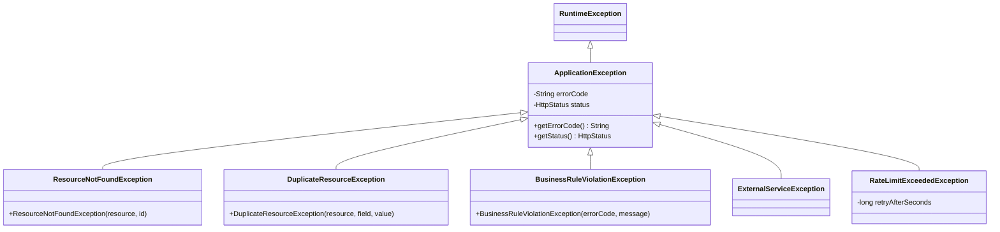
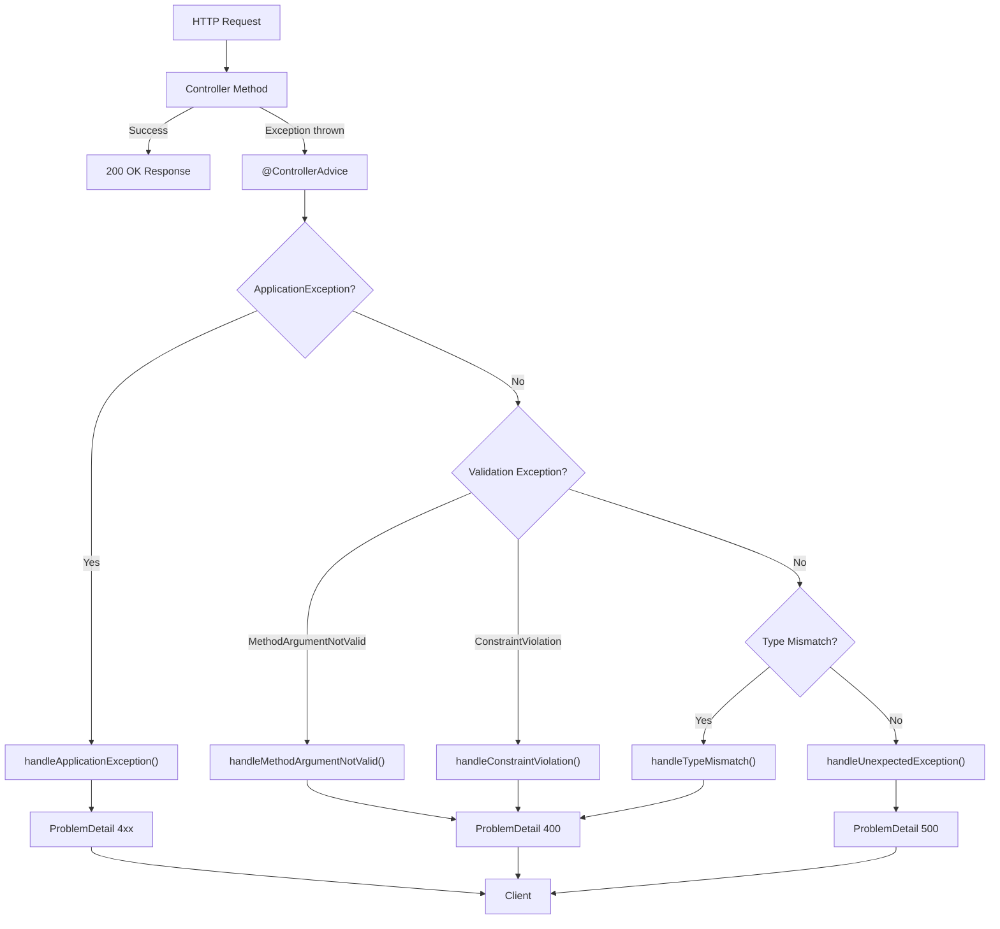

# Exception Handling

Error handling is the difference between an API that developers enjoy using and one that makes them file support tickets. Spring Boot's default error handling returns a generic `WhitelabelError` page or a bare JSON body that exposes internal details. Neither is acceptable for production.

This page covers the complete error-handling architecture: `@ControllerAdvice`, `@ExceptionHandler`, the RFC 7807 Problem Details standard, custom exception hierarchies, validation error formatting, and the patterns that keep your error responses consistent, informative, and secure.

## The Problem with Default Error Handling

Out of the box, Spring Boot returns this when a request fails:

```json
{
  "timestamp": "2026-03-25T10:15:30.000+00:00",
  "status": 500,
  "error": "Internal Server Error",
  "message": "/ by zero",
  "path": "/api/v1/products/123"
}
```

Problems:
- **Leaks implementation details** — stack traces, class names, database errors
- **Inconsistent format** — validation errors look different from business errors
- **No machine-readable error codes** — clients cannot programmatically handle errors
- **No RFC 7807 compliance** — modern APIs use the Problem Details standard

## RFC 7807 Problem Details

RFC 7807 (updated by RFC 9457) defines a standard JSON format for HTTP error responses. Spring Boot 3.x has first-class support for it.

```json
{
  "type": "https://api.example.com/errors/product-not-found",
  "title": "Product Not Found",
  "status": 404,
  "detail": "No product exists with ID 550e8400-e29b-41d4-a716-446655440000",
  "instance": "/api/v1/products/550e8400-e29b-41d4-a716-446655440000",
  "timestamp": "2026-03-25T10:15:30Z",
  "errorCode": "PRODUCT_NOT_FOUND"
}
```

| Field | Required | Description |
|---|---|---|
| `type` | Recommended | URI identifying the error type (can be a docs link) |
| `title` | Recommended | Short human-readable summary |
| `status` | Recommended | HTTP status code |
| `detail` | Optional | Human-readable explanation specific to this occurrence |
| `instance` | Optional | URI identifying this specific occurrence |
| Custom fields | Optional | Add `errorCode`, `timestamp`, `traceId`, etc. |

### Enabling Problem Details in Spring Boot

```yaml
# application.yml
spring:
  mvc:
    problemdetails:
      enabled: true  # Enables RFC 7807 for standard Spring exceptions
```

## Custom Exception Hierarchy

Define a base exception class and specific exceptions for your domain:

```java
package com.example.store.exception;

import org.springframework.http.HttpStatus;

/**
 * Base exception for all application-specific errors.
 * Carries an error code and HTTP status.
 */
public abstract class ApplicationException extends RuntimeException {

    private final String errorCode;
    private final HttpStatus status;

    protected ApplicationException(String message, String errorCode, HttpStatus status) {
        super(message);
        this.errorCode = errorCode;
        this.status = status;
    }

    protected ApplicationException(String message, String errorCode,
                                    HttpStatus status, Throwable cause) {
        super(message, cause);
        this.errorCode = errorCode;
        this.status = status;
    }

    public String getErrorCode() { return errorCode; }
    public HttpStatus getStatus() { return status; }
}
```

```java
// === Specific exceptions ===

public class ResourceNotFoundException extends ApplicationException {

    public ResourceNotFoundException(String resource, Object id) {
        super(
                String.format("%s not found with ID: %s", resource, id),
                resource.toUpperCase().replace(" ", "_") + "_NOT_FOUND",
                HttpStatus.NOT_FOUND
        );
    }
}

public class DuplicateResourceException extends ApplicationException {

    public DuplicateResourceException(String resource, String field, Object value) {
        super(
                String.format("%s already exists with %s: %s", resource, field, value),
                resource.toUpperCase().replace(" ", "_") + "_DUPLICATE",
                HttpStatus.CONFLICT
        );
    }
}

public class BusinessRuleViolationException extends ApplicationException {

    public BusinessRuleViolationException(String errorCode, String message) {
        super(message, errorCode, HttpStatus.UNPROCESSABLE_ENTITY);
    }
}

public class ExternalServiceException extends ApplicationException {

    public ExternalServiceException(String service, String message, Throwable cause) {
        super(
                String.format("External service '%s' failed: %s", service, message),
                "EXTERNAL_SERVICE_FAILURE",
                HttpStatus.BAD_GATEWAY,
                cause
        );
    }
}

public class RateLimitExceededException extends ApplicationException {

    private final long retryAfterSeconds;

    public RateLimitExceededException(long retryAfterSeconds) {
        super(
                "Rate limit exceeded. Try again in " + retryAfterSeconds + " seconds.",
                "RATE_LIMIT_EXCEEDED",
                HttpStatus.TOO_MANY_REQUESTS
        );
        this.retryAfterSeconds = retryAfterSeconds;
    }

    public long getRetryAfterSeconds() { return retryAfterSeconds; }
}
```



## Global Exception Handler with @ControllerAdvice

The `@ControllerAdvice` class catches exceptions thrown from any controller and transforms them into consistent error responses:

```java
package com.example.store.exception;

import jakarta.servlet.http.HttpServletRequest;
import jakarta.validation.ConstraintViolation;
import jakarta.validation.ConstraintViolationException;
import lombok.extern.slf4j.Slf4j;
import org.springframework.http.*;
import org.springframework.validation.FieldError;
import org.springframework.web.bind.MethodArgumentNotValidException;
import org.springframework.web.bind.MissingServletRequestParameterException;
import org.springframework.web.bind.annotation.*;
import org.springframework.web.context.request.WebRequest;
import org.springframework.web.method.annotation.MethodArgumentTypeMismatchException;
import org.springframework.web.servlet.mvc.method.annotation.ResponseEntityExceptionHandler;

import java.net.URI;
import java.time.Instant;
import java.util.*;

@RestControllerAdvice
@Slf4j
public class GlobalExceptionHandler extends ResponseEntityExceptionHandler {

    // ========== Application Exceptions ==========

    /**
     * Handles all custom ApplicationException subclasses.
     */
    @ExceptionHandler(ApplicationException.class)
    public ProblemDetail handleApplicationException(
            ApplicationException ex,
            HttpServletRequest request) {

        log.warn("Application error: [{}] {} — {}",
                ex.getErrorCode(), ex.getStatus(), ex.getMessage());

        ProblemDetail problem = ProblemDetail.forStatusAndDetail(
                ex.getStatus(), ex.getMessage());
        problem.setTitle(formatTitle(ex.getErrorCode()));
        problem.setType(URI.create("https://api.example.com/errors/"
                + ex.getErrorCode().toLowerCase().replace("_", "-")));
        problem.setInstance(URI.create(request.getRequestURI()));
        problem.setProperty("errorCode", ex.getErrorCode());
        problem.setProperty("timestamp", Instant.now());

        return problem;
    }

    /**
     * Handles rate limit exceptions with Retry-After header.
     */
    @ExceptionHandler(RateLimitExceededException.class)
    public ResponseEntity<ProblemDetail> handleRateLimitExceeded(
            RateLimitExceededException ex,
            HttpServletRequest request) {

        ProblemDetail problem = ProblemDetail.forStatusAndDetail(
                HttpStatus.TOO_MANY_REQUESTS, ex.getMessage());
        problem.setTitle("Rate Limit Exceeded");
        problem.setProperty("errorCode", ex.getErrorCode());
        problem.setProperty("retryAfterSeconds", ex.getRetryAfterSeconds());

        return ResponseEntity.status(HttpStatus.TOO_MANY_REQUESTS)
                .header(HttpHeaders.RETRY_AFTER,
                        String.valueOf(ex.getRetryAfterSeconds()))
                .body(problem);
    }

    // ========== Validation Exceptions ==========

    /**
     * Handles @Valid validation failures on @RequestBody.
     * Returns a structured list of field errors.
     */
    @Override
    protected ResponseEntity<Object> handleMethodArgumentNotValid(
            MethodArgumentNotValidException ex,
            HttpHeaders headers,
            HttpStatusCode status,
            WebRequest request) {

        ProblemDetail problem = ProblemDetail.forStatusAndDetail(
                HttpStatus.BAD_REQUEST, "Validation failed");
        problem.setTitle("Validation Error");
        problem.setType(URI.create("https://api.example.com/errors/validation-error"));
        problem.setProperty("errorCode", "VALIDATION_ERROR");
        problem.setProperty("timestamp", Instant.now());

        List<Map<String, Object>> fieldErrors = ex.getBindingResult()
                .getFieldErrors().stream()
                .map(this::mapFieldError)
                .toList();

        List<Map<String, String>> globalErrors = ex.getBindingResult()
                .getGlobalErrors().stream()
                .map(e -> Map.of(
                        "object", e.getObjectName(),
                        "message", Objects.requireNonNullElse(
                                e.getDefaultMessage(), "Invalid")
                ))
                .toList();

        problem.setProperty("fieldErrors", fieldErrors);
        if (!globalErrors.isEmpty()) {
            problem.setProperty("globalErrors", globalErrors);
        }

        return ResponseEntity.badRequest().body(problem);
    }

    /**
     * Handles @Validated on path variables and request params.
     */
    @ExceptionHandler(ConstraintViolationException.class)
    public ProblemDetail handleConstraintViolation(
            ConstraintViolationException ex) {

        ProblemDetail problem = ProblemDetail.forStatusAndDetail(
                HttpStatus.BAD_REQUEST, "Constraint violation");
        problem.setTitle("Validation Error");
        problem.setProperty("errorCode", "CONSTRAINT_VIOLATION");

        List<Map<String, String>> violations = ex.getConstraintViolations().stream()
                .map(v -> Map.of(
                        "field", extractFieldName(v),
                        "message", v.getMessage(),
                        "rejectedValue", String.valueOf(v.getInvalidValue())
                ))
                .toList();

        problem.setProperty("violations", violations);
        return problem;
    }

    // ========== Type Mismatch ==========

    @ExceptionHandler(MethodArgumentTypeMismatchException.class)
    public ProblemDetail handleTypeMismatch(
            MethodArgumentTypeMismatchException ex) {

        String message = String.format(
                "Parameter '%s' should be of type '%s' but received '%s'",
                ex.getName(),
                ex.getRequiredType() != null
                        ? ex.getRequiredType().getSimpleName() : "unknown",
                ex.getValue());

        ProblemDetail problem = ProblemDetail.forStatusAndDetail(
                HttpStatus.BAD_REQUEST, message);
        problem.setTitle("Type Mismatch");
        problem.setProperty("errorCode", "TYPE_MISMATCH");
        return problem;
    }

    // ========== Catch-All ==========

    /**
     * Last resort handler for unexpected exceptions.
     * NEVER expose internal details to the client.
     */
    @ExceptionHandler(Exception.class)
    public ProblemDetail handleUnexpectedException(
            Exception ex, HttpServletRequest request) {

        // Log the full stack trace internally
        String traceId = UUID.randomUUID().toString().substring(0, 8);
        log.error("Unexpected error [traceId={}]: {} {}",
                traceId, request.getMethod(), request.getRequestURI(), ex);

        // Return a safe message to the client
        ProblemDetail problem = ProblemDetail.forStatusAndDetail(
                HttpStatus.INTERNAL_SERVER_ERROR,
                "An unexpected error occurred. Reference: " + traceId);
        problem.setTitle("Internal Server Error");
        problem.setProperty("errorCode", "INTERNAL_ERROR");
        problem.setProperty("traceId", traceId);
        problem.setProperty("timestamp", Instant.now());

        return problem;
    }

    // ========== Helpers ==========

    private Map<String, Object> mapFieldError(FieldError error) {
        Map<String, Object> map = new LinkedHashMap<>();
        map.put("field", error.getField());
        map.put("message", error.getDefaultMessage());
        map.put("rejectedValue", error.getRejectedValue());
        if (error.getCode() != null) {
            map.put("code", error.getCode());
        }
        return map;
    }

    private String extractFieldName(ConstraintViolation<?> violation) {
        String path = violation.getPropertyPath().toString();
        return path.contains(".") ? path.substring(path.lastIndexOf('.') + 1) : path;
    }

    private String formatTitle(String errorCode) {
        return Arrays.stream(errorCode.split("_"))
                .map(w -> w.substring(0, 1).toUpperCase() + w.substring(1).toLowerCase())
                .reduce((a, b) -> a + " " + b)
                .orElse(errorCode);
    }
}
```

## Example Error Responses

### Validation Error (400)

```json
{
  "type": "https://api.example.com/errors/validation-error",
  "title": "Validation Error",
  "status": 400,
  "detail": "Validation failed",
  "errorCode": "VALIDATION_ERROR",
  "timestamp": "2026-03-25T10:15:30Z",
  "fieldErrors": [
    {
      "field": "email",
      "message": "Email must be valid",
      "rejectedValue": "not-an-email",
      "code": "Email"
    },
    {
      "field": "price",
      "message": "Price must be at least 0.01",
      "rejectedValue": -5.00,
      "code": "DecimalMin"
    }
  ]
}
```

### Resource Not Found (404)

```json
{
  "type": "https://api.example.com/errors/product-not-found",
  "title": "Product Not Found",
  "status": 404,
  "detail": "Product not found with ID: 550e8400-e29b-41d4-a716-446655440000",
  "instance": "/api/v1/products/550e8400-e29b-41d4-a716-446655440000",
  "errorCode": "PRODUCT_NOT_FOUND",
  "timestamp": "2026-03-25T10:15:30Z"
}
```

### Business Rule Violation (422)

```json
{
  "type": "https://api.example.com/errors/insufficient-stock",
  "title": "Insufficient Stock",
  "status": 422,
  "detail": "Cannot order 50 units of SKU-12345. Only 12 in stock.",
  "errorCode": "INSUFFICIENT_STOCK",
  "timestamp": "2026-03-25T10:15:30Z"
}
```

### Internal Server Error (500)

```json
{
  "type": "about:blank",
  "title": "Internal Server Error",
  "status": 500,
  "detail": "An unexpected error occurred. Reference: a1b2c3d4",
  "errorCode": "INTERNAL_ERROR",
  "traceId": "a1b2c3d4",
  "timestamp": "2026-03-25T10:15:30Z"
}
```

::: danger Never expose internal details in production
Database errors, stack traces, class names, SQL queries — none of these should appear in error responses. The catch-all handler generates a `traceId` that is logged server-side so support can correlate client reports with internal logs, but the client sees only a safe, generic message.
:::

## Using Exceptions in Service Layer

```java
@Service
@RequiredArgsConstructor
@Transactional(readOnly = true)
public class OrderService {

    private final OrderRepository orderRepository;
    private final ProductRepository productRepository;
    private final PaymentGateway paymentGateway;

    @Transactional
    public OrderResponse placeOrder(CreateOrderRequest request) {
        // 1. Validate product exists
        Product product = productRepository.findById(request.productId())
                .orElseThrow(() -> new ResourceNotFoundException(
                        "Product", request.productId()));

        // 2. Business rule: check stock
        if (product.getStockQuantity() < request.quantity()) {
            throw new BusinessRuleViolationException(
                    "INSUFFICIENT_STOCK",
                    String.format("Cannot order %d units of %s. Only %d in stock.",
                            request.quantity(), product.getSku(),
                            product.getStockQuantity()));
        }

        // 3. Business rule: check order limits
        long todayOrders = orderRepository.countByCustomerIdAndCreatedAtAfter(
                request.customerId(), Instant.now().truncatedTo(ChronoUnit.DAYS));
        if (todayOrders >= 10) {
            throw new BusinessRuleViolationException(
                    "ORDER_LIMIT_EXCEEDED",
                    "Maximum 10 orders per day. You have placed "
                            + todayOrders + " orders today.");
        }

        // 4. External call: process payment
        try {
            paymentGateway.charge(request.paymentMethod(), product.getPrice());
        } catch (PaymentDeclinedException e) {
            throw new BusinessRuleViolationException(
                    "PAYMENT_DECLINED",
                    "Payment was declined: " + e.getReason());
        } catch (Exception e) {
            throw new ExternalServiceException(
                    "PaymentGateway", "Payment processing failed", e);
        }

        // 5. Create order
        product.decrementStock(request.quantity());
        Order order = Order.builder()
                .customerId(request.customerId())
                .product(product)
                .quantity(request.quantity())
                .total(product.getPrice().multiply(BigDecimal.valueOf(request.quantity())))
                .status(OrderStatus.CONFIRMED)
                .build();

        return OrderResponse.from(orderRepository.save(order));
    }
}
```

## Error Flow Diagram



## Testing Error Handling

```java
@WebMvcTest(ProductController.class)
class ProductControllerExceptionTest {

    @Autowired
    private MockMvc mockMvc;

    @MockBean
    private ProductService productService;

    @Test
    void getProduct_NotFound_Returns404ProblemDetail() throws Exception {
        UUID id = UUID.randomUUID();
        given(productService.findById(id))
                .willThrow(new ResourceNotFoundException("Product", id));

        mockMvc.perform(get("/api/v1/products/{id}", id))
                .andExpect(status().isNotFound())
                .andExpect(content().contentType(MediaType.APPLICATION_PROBLEM_JSON))
                .andExpect(jsonPath("$.status").value(404))
                .andExpect(jsonPath("$.errorCode").value("PRODUCT_NOT_FOUND"))
                .andExpect(jsonPath("$.detail").value(
                        containsString(id.toString())));
    }

    @Test
    void createProduct_InvalidBody_Returns400WithFieldErrors() throws Exception {
        String invalidBody = """
                {
                    "name": "",
                    "price": -5,
                    "sku": "!!invalid!!",
                    "category": null
                }
                """;

        mockMvc.perform(post("/api/v1/products")
                        .contentType(MediaType.APPLICATION_JSON)
                        .content(invalidBody))
                .andExpect(status().isBadRequest())
                .andExpect(jsonPath("$.errorCode").value("VALIDATION_ERROR"))
                .andExpect(jsonPath("$.fieldErrors").isArray())
                .andExpect(jsonPath("$.fieldErrors.length()").value(
                        greaterThanOrEqualTo(3)));
    }

    @Test
    void createProduct_DuplicateSku_Returns409() throws Exception {
        String body = """
                {
                    "name": "Widget",
                    "price": 9.99,
                    "sku": "WDG-001",
                    "category": "ELECTRONICS",
                    "stockQuantity": 100
                }
                """;

        given(productService.create(any()))
                .willThrow(new DuplicateResourceException(
                        "Product", "sku", "WDG-001"));

        mockMvc.perform(post("/api/v1/products")
                        .contentType(MediaType.APPLICATION_JSON)
                        .content(body))
                .andExpect(status().isConflict())
                .andExpect(jsonPath("$.errorCode").value("PRODUCT_DUPLICATE"));
    }
}
```

::: tip Always test your error paths
Error handling is critical path code. Test every exception type your API can return. Clients will build logic around your error response format — if it changes accidentally, integrations break silently.
:::

## Further Reading

- **[REST API Development](./rest-api)** — The controllers that throw these exceptions
- **[Testing](./testing)** — Complete testing strategies including error path testing
- **[Best Practices](./best-practices)** — Error handling patterns and anti-patterns
- **[Actuator & Monitoring](./actuator)** — Monitor error rates in production
