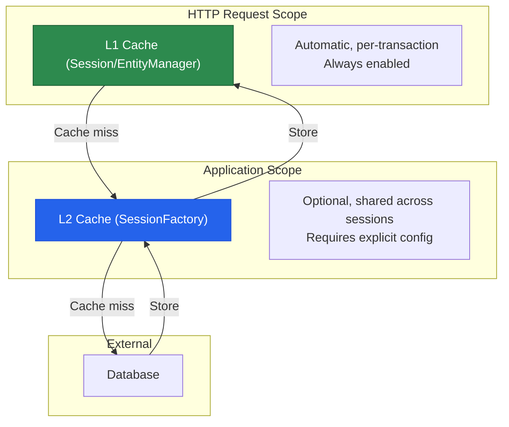
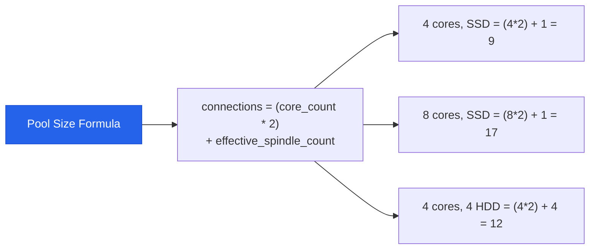

# Hibernate Performance Tuning

Hibernate is the most powerful ORM in the Java ecosystem. It is also the easiest way to accidentally generate hundreds of unnecessary SQL queries per request. The performance problems are never obvious at development time — they appear when your tables grow past a million rows and your p99 latency hits 5 seconds.

This page covers the critical performance issues you will encounter and the patterns to fix them: the N+1 problem, batch fetching, entity graphs, second-level caching, query optimization, and HikariCP connection pool tuning.

## The N+1 Problem

The N+1 problem is the single most common performance issue in Hibernate applications. It happens when loading a list of entities triggers an additional query for each entity's relationship.

### Reproducing the Problem

```java
@Entity
public class Order {
    @Id
    @GeneratedValue(strategy = GenerationType.UUID)
    private UUID id;

    @ManyToOne(fetch = FetchType.LAZY)
    @JoinColumn(name = "customer_id")
    private Customer customer;

    @OneToMany(mappedBy = "order", fetch = FetchType.LAZY)
    private List<OrderItem> items = new ArrayList<>();
}

// Service that triggers N+1
@Service
public class OrderReportService {

    public List<OrderSummary> getOrderSummaries() {
        // Query 1: SELECT * FROM orders (returns 100 orders)
        List<Order> orders = orderRepository.findAll();

        return orders.stream().map(order -> {
            // Query 2..101: SELECT * FROM customers WHERE id = ? (per order!)
            String customerName = order.getCustomer().getName();

            // Query 102..201: SELECT * FROM order_items WHERE order_id = ? (per order!)
            int itemCount = order.getItems().size();

            return new OrderSummary(order.getId(), customerName, itemCount);
        }).toList();
        // Total: 1 + 100 + 100 = 201 queries for 100 orders!
    }
}
```

### Detecting N+1 Queries

```yaml
# application.yml — Enable SQL logging in development
logging:
  level:
    org.hibernate.SQL: DEBUG
    org.hibernate.type.descriptor.sql.BasicBinder: TRACE

spring:
  jpa:
    properties:
      hibernate:
        generate_statistics: true
        session:
          events:
            log:
              LOG_QUERIES_SLOWER_THAN_MS: 25
```

```java
// Programmatic detection with Hibernate Statistics
@Component
@Slf4j
public class QueryCountInspector implements HandlerInterceptor {

    @Override
    public boolean preHandle(HttpServletRequest request,
                              HttpServletResponse response,
                              Object handler) {
        Statistics stats = entityManagerFactory.unwrap(SessionFactory.class)
                .getStatistics();
        request.setAttribute("queryCount", stats.getQueryExecutionCount());
        return true;
    }

    @Override
    public void afterCompletion(HttpServletRequest request,
                                 HttpServletResponse response,
                                 Object handler, Exception ex) {
        Statistics stats = entityManagerFactory.unwrap(SessionFactory.class)
                .getStatistics();
        long before = (long) request.getAttribute("queryCount");
        long queryCount = stats.getQueryExecutionCount() - before;

        if (queryCount > 10) {
            log.warn("Excessive queries detected: {} queries for {} {}",
                    queryCount, request.getMethod(), request.getRequestURI());
        }
    }
}
```

### Fix 1: JOIN FETCH

The most direct fix — fetch related entities in a single query:

```java
public interface OrderRepository extends JpaRepository<Order, UUID> {

    // JOIN FETCH loads customers in the same query
    @Query("""
            SELECT o FROM Order o
            JOIN FETCH o.customer
            WHERE o.status = :status
            """)
    List<Order> findByStatusWithCustomer(@Param("status") OrderStatus status);

    // Multiple JOIN FETCHes
    @Query("""
            SELECT DISTINCT o FROM Order o
            JOIN FETCH o.customer
            JOIN FETCH o.items i
            JOIN FETCH i.product
            WHERE o.id = :id
            """)
    Optional<Order> findByIdWithDetails(@Param("id") UUID id);

    // JOIN FETCH with pagination requires a count query
    @Query(value = """
            SELECT o FROM Order o
            JOIN FETCH o.customer
            WHERE o.status = :status
            """,
            countQuery = "SELECT COUNT(o) FROM Order o WHERE o.status = :status")
    Page<Order> findByStatusWithCustomerPaged(
            @Param("status") OrderStatus status, Pageable pageable);
}
```

::: warning JOIN FETCH with multiple collections
You cannot `JOIN FETCH` more than one collection (bag) in a single query — Hibernate throws `MultipleBagFetchException`. Use `Set` instead of `List` for one of the collections, or split into multiple queries.
:::

### Fix 2: @EntityGraph

`@EntityGraph` is the declarative alternative to `JOIN FETCH`:

```java
public interface OrderRepository extends JpaRepository<Order, UUID> {

    // Named entity graph — defined on the entity
    @EntityGraph(attributePaths = {"customer", "items", "items.product"})
    List<Order> findByStatus(OrderStatus status);

    // Ad-hoc entity graph — defined on the method
    @EntityGraph(attributePaths = {"customer"})
    Optional<Order> findWithCustomerById(UUID id);

    // EntityGraph with JPQL
    @EntityGraph(attributePaths = {"customer", "items"})
    @Query("SELECT o FROM Order o WHERE o.createdAt > :since")
    List<Order> findRecentOrdersWithDetails(@Param("since") Instant since);
}

// Named graph on entity class
@Entity
@NamedEntityGraph(
        name = "Order.withDetails",
        attributeNodes = {
                @NamedAttributeNode("customer"),
                @NamedAttributeNode(value = "items", subgraph = "items-subgraph")
        },
        subgraphs = {
                @NamedSubgraph(
                        name = "items-subgraph",
                        attributeNodes = @NamedAttributeNode("product")
                )
        }
)
public class Order { /* ... */ }
```

### Fix 3: Batch Fetching

When JOIN FETCH is not practical (e.g., you are iterating through a deep object graph), batch fetching reduces N+1 to N/batchSize + 1:

```yaml
# Global batch size in application.yml
spring:
  jpa:
    properties:
      hibernate:
        default_batch_fetch_size: 25
```

```java
// Per-association batch size
@Entity
public class Order {

    @OneToMany(mappedBy = "order")
    @BatchSize(size = 25)  // Load up to 25 orders' items in one query
    private List<OrderItem> items = new ArrayList<>();

    @ManyToOne(fetch = FetchType.LAZY)
    @BatchSize(size = 50)
    private Customer customer;
}
```

How batching works:

```
Without batching (N+1):
  SELECT * FROM orders                                  -- 1 query
  SELECT * FROM order_items WHERE order_id = ?           -- 100 queries

With @BatchSize(size = 25):
  SELECT * FROM orders                                  -- 1 query
  SELECT * FROM order_items WHERE order_id IN (?,?,?...) -- 4 queries (100/25)

Total: 5 queries instead of 101
```

## Second-Level Cache

Hibernate has two cache levels:



### Setting Up Second-Level Cache with Caffeine

```xml
<!-- pom.xml -->
<dependency>
    <groupId>org.hibernate.orm</groupId>
    <artifactId>hibernate-jcache</artifactId>
</dependency>
<dependency>
    <groupId>com.github.ben-manes.caffeine</groupId>
    <artifactId>caffeine</artifactId>
</dependency>
<dependency>
    <groupId>org.ehcache</groupId>
    <artifactId>ehcache</artifactId>
    <classifier>jakarta</classifier>
</dependency>
```

```yaml
# application.yml
spring:
  jpa:
    properties:
      hibernate:
        cache:
          use_second_level_cache: true
          use_query_cache: true
          region:
            factory_class: org.hibernate.cache.jcache.JCacheRegionFactory
      jakarta:
        persistence:
          sharedCache:
            mode: ENABLE_SELECTIVE
```

```java
// Mark entities as cacheable
@Entity
@Table(name = "categories")
@Cacheable
@Cache(usage = CacheConcurrencyStrategy.READ_WRITE)
public class Category {

    @Id
    @GeneratedValue(strategy = GenerationType.UUID)
    private UUID id;

    @Column(unique = true, nullable = false)
    private String name;

    private String description;

    // Cache collections
    @OneToMany(mappedBy = "category")
    @Cache(usage = CacheConcurrencyStrategy.READ_WRITE)
    private List<Product> products = new ArrayList<>();
}
```

### Cache Concurrency Strategies

| Strategy | Use Case | Consistency |
|---|---|---|
| `READ_ONLY` | Reference data that never changes | Perfect |
| `NONSTRICT_READ_WRITE` | Rarely updated, eventual consistency OK | Eventual |
| `READ_WRITE` | Updated moderately, needs strong consistency | Strong |
| `TRANSACTIONAL` | JTA transactions, full ACID on cache | Full ACID |

::: tip When to use second-level cache
Cache entities that are read frequently and updated rarely: categories, configurations, countries, permissions, roles. Do NOT cache entities with high write throughput (orders, logs, events) — the cache invalidation overhead outweighs the read benefit.
:::

### Query Cache

```java
public interface CategoryRepository extends JpaRepository<Category, UUID> {

    @QueryHints(@QueryHint(name = "org.hibernate.cacheable", value = "true"))
    List<Category> findAll();

    @Query("SELECT c FROM Category c WHERE c.active = true")
    @QueryHints(@QueryHint(name = "org.hibernate.cacheable", value = "true"))
    List<Category> findAllActive();
}
```

## Query Optimization

### Avoiding SELECT * with Projections

```java
// BAD: Loads entire entity with all columns
List<Product> products = productRepository.findAll();
return products.stream().map(p -> p.getName()).toList();

// GOOD: Only SELECT the columns you need
@Query("SELECT p.name FROM Product p WHERE p.active = true")
List<String> findAllActiveProductNames();

// GOOD: DTO projection
@Query("""
        SELECT new com.example.dto.ProductListItem(
            p.id, p.name, p.price, p.sku
        )
        FROM Product p
        WHERE p.category = :category
        """)
Page<ProductListItem> findProductListItems(
        @Param("category") ProductCategory category, Pageable pageable);
```

### Bulk Operations

```java
@Service
@RequiredArgsConstructor
public class InventoryService {

    private final EntityManager entityManager;

    /**
     * Bulk insert using JDBC batch.
     * Much faster than saving entities one by one.
     */
    @Transactional
    public void bulkImportProducts(List<CreateProductRequest> requests) {
        int batchSize = 50;

        for (int i = 0; i < requests.size(); i++) {
            Product product = mapToEntity(requests.get(i));
            entityManager.persist(product);

            if (i > 0 && i % batchSize == 0) {
                entityManager.flush();
                entityManager.clear();  // Detach all entities to free memory
            }
        }
        entityManager.flush();
        entityManager.clear();
    }
}
```

```yaml
# Enable JDBC batching
spring:
  jpa:
    properties:
      hibernate:
        jdbc:
          batch_size: 50
          batch_versioned_data: true
        order_inserts: true   # Group INSERTs by entity type
        order_updates: true   # Group UPDATEs by entity type
```

### Read-Only Transactions

```java
@Service
@Transactional(readOnly = true)  // Class-level default: read-only
public class ProductQueryService {

    // Read-only transaction: Hibernate skips dirty checking
    // This is a significant performance boost for read-heavy services
    public Page<ProductResponse> findAll(Pageable pageable) {
        return productRepository.findAll(pageable)
                .map(ProductResponse::from);
    }

    @Transactional  // Override to read-write for mutations
    public Product updatePrice(UUID id, BigDecimal newPrice) {
        Product product = productRepository.findById(id)
                .orElseThrow(() -> new ResourceNotFoundException("Product", id));
        product.setPrice(newPrice);
        return productRepository.save(product);
    }
}
```

## Connection Pooling with HikariCP

HikariCP is Spring Boot's default connection pool. Tuning it correctly is critical:

```yaml
spring:
  datasource:
    hikari:
      # Pool size = (core_count * 2) + number_of_spindles
      # For SSD with 4 cores: (4 * 2) + 1 = 9, round to 10
      maximum-pool-size: 10
      minimum-idle: 5

      # Connection lifetime
      max-lifetime: 1800000          # 30 min (must be less than DB wait_timeout)
      idle-timeout: 600000           # 10 min
      connection-timeout: 30000      # 30 sec (fail fast)

      # Validation
      connection-test-query: SELECT 1
      validation-timeout: 5000

      # Leak detection (logs warning if connection isn't returned)
      leak-detection-threshold: 60000  # 1 minute

      # Metrics
      register-mbeans: true

      pool-name: MyApp-HikariPool

      # PostgreSQL-specific optimizations
      data-source-properties:
        prepStmtCacheSize: 250
        prepStmtCacheSqlLimit: 2048
        cachePrepStmts: true
        useServerPrepStmts: true
```

### Pool Sizing Formula



::: danger Do not set maximum-pool-size to 100
A larger pool does not mean better performance. More connections mean more context switching, more memory, and more lock contention in the database. The formula above from the HikariCP wiki gives you the optimal starting point. Profile and adjust from there.
:::

## Monitoring Hibernate Performance

```java
@Component
@Slf4j
public class HibernateStatsReporter {

    private final EntityManagerFactory emf;

    public HibernateStatsReporter(EntityManagerFactory emf) {
        this.emf = emf;
    }

    @Scheduled(fixedRate = 60_000)
    public void reportStats() {
        Statistics stats = emf.unwrap(SessionFactory.class).getStatistics();

        log.info("Hibernate Stats: queries={}, l2CacheHitRatio={}%, " +
                        "entityLoads={}, entityInserts={}",
                stats.getQueryExecutionCount(),
                calculateHitRatio(stats),
                stats.getEntityLoadCount(),
                stats.getEntityInsertCount());

        if (stats.getQueryExecutionMaxTime() > 1000) {
            log.warn("Slow query detected ({}ms): {}",
                    stats.getQueryExecutionMaxTime(),
                    stats.getQueryExecutionMaxTimeQueryString());
        }
    }

    private double calculateHitRatio(Statistics stats) {
        long hits = stats.getSecondLevelCacheHitCount();
        long misses = stats.getSecondLevelCacheMissCount();
        long total = hits + misses;
        return total == 0 ? 0 : (hits * 100.0 / total);
    }
}
```

## Performance Checklist

| Issue | Symptom | Fix |
|---|---|---|
| N+1 queries | Hundreds of simple SELECT queries | JOIN FETCH, @EntityGraph, @BatchSize |
| Eager fetching | Loading entire object graph | Change to FetchType.LAZY |
| SELECT * | Loading all columns for simple lists | DTO projections |
| No batching | Slow bulk inserts/updates | `hibernate.jdbc.batch_size` |
| Open Session in View | Queries fire during view rendering | `spring.jpa.open-in-view=false` |
| Missing indexes | Full table scans on queries | Add `@Index` on filtered columns |
| Oversized pool | High CPU, lock contention | Reduce `maximum-pool-size` |
| No read-only txn | Dirty checking on read queries | `@Transactional(readOnly = true)` |
| Large result sets | OOM on big queries | Use `Stream<T>` or pagination |

## Further Reading

- **[Spring Data JPA](./spring-data-jpa)** — Entity mapping and repository fundamentals
- **[Database Migrations](./database-migrations)** — Schema management with Flyway
- **[Caching](./caching)** — Application-level caching with Redis and Caffeine
- **[Actuator & Monitoring](./actuator)** — Expose Hibernate metrics via Prometheus
