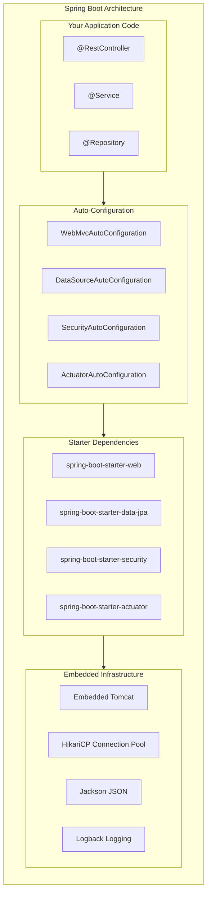
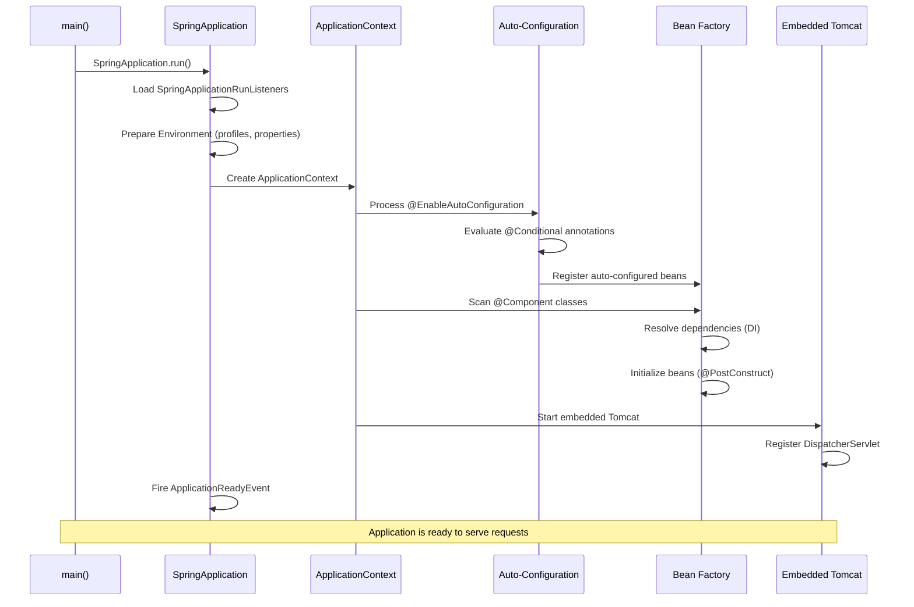

# Spring Boot Overview

Spring Boot is the most widely adopted framework for building Java and Kotlin backend applications. It exists because the original Spring Framework, while powerful, drowned developers in XML configuration, boilerplate wiring, and a brutal learning curve. Spring Boot takes the same powerful Spring ecosystem and wraps it in opinionated defaults that just work. You add a dependency, and things configure themselves. You write a controller, and it is already wired to an embedded web server. You deploy a single JAR, and it runs anywhere.

This is not magic. It is a carefully engineered system of auto-configuration, starter dependencies, and convention-over-configuration principles that has been refined over a decade. Understanding how it works — not just how to use it — is what separates a developer who copies tutorials from one who builds systems that survive production.

## Why Spring Boot

Every backend framework makes promises. Spring Boot delivers on them because of a few key design decisions:

### 1. Opinionated Defaults, Easy Overrides

Spring Boot picks sensible defaults for everything — the embedded server (Tomcat), the connection pool (HikariCP), the JSON serializer (Jackson), the logging framework (Logback). You never configure these for a basic app. But when you need to customize, every default can be overridden through properties, beans, or explicit configuration.

### 2. Starter Dependencies

Instead of hunting for compatible versions of 15 different libraries, you add one starter dependency. `spring-boot-starter-web` pulls in Spring MVC, Jackson, Tomcat, and validation — all at versions that are tested together.

### 3. Auto-Configuration

Spring Boot scans your classpath and configures beans automatically. If it finds HikariCP on the classpath and a `spring.datasource.url` property, it creates a DataSource. If it finds Spring Security, it enables security with default settings. This is not guessing — it is conditional configuration backed by `@Conditional` annotations.

### 4. Production-Ready Features

Actuator endpoints, health checks, metrics, structured logging, graceful shutdown — these are not afterthoughts. They are built-in and enabled with a single dependency.



## Spring Boot vs. Alternatives

| Feature | Spring Boot | Quarkus | Micronaut | Jakarta EE |
|---|---|---|---|---|
| **Startup time** | ~2-4s (JVM), ~0.05s (Native) | ~0.5s (JVM), ~0.01s (Native) | ~1s (JVM), ~0.02s (Native) | ~5-10s |
| **Memory footprint** | ~150-300 MB | ~50-100 MB | ~70-120 MB | ~200-400 MB |
| **Ecosystem size** | Massive | Growing | Growing | Large |
| **Learning resources** | Abundant | Moderate | Moderate | Abundant |
| **GraalVM native** | Supported (3.x) | First-class | First-class | Limited |
| **Reactive support** | WebFlux | Mutiny | Built-in | Limited |
| **Job market** | Dominant | Niche | Niche | Declining |
| **Kotlin support** | Excellent | Good | Good | Limited |

::: tip When to choose Spring Boot
Choose Spring Boot when you need the largest ecosystem, the most library integrations, the best hiring pool, and you are building business applications where developer productivity matters more than squeezing out every last millisecond of startup time. For serverless functions or extreme cold-start scenarios, consider Quarkus or Micronaut.
:::

## Project Structure

A well-organized Spring Boot project follows this layout. This is not just convention — it is how auto-configuration discovers your components:

```
my-app/
├── src/
│   ├── main/
│   │   ├── java/com/example/myapp/
│   │   │   ├── MyAppApplication.java          # Entry point
│   │   │   ├── config/                         # @Configuration classes
│   │   │   │   ├── SecurityConfig.java
│   │   │   │   ├── WebConfig.java
│   │   │   │   └── CacheConfig.java
│   │   │   ├── controller/                     # @RestController classes
│   │   │   │   ├── UserController.java
│   │   │   │   └── OrderController.java
│   │   │   ├── service/                        # @Service classes
│   │   │   │   ├── UserService.java
│   │   │   │   └── OrderService.java
│   │   │   ├── repository/                     # @Repository interfaces
│   │   │   │   ├── UserRepository.java
│   │   │   │   └── OrderRepository.java
│   │   │   ├── model/                          # Entity / domain classes
│   │   │   │   ├── User.java
│   │   │   │   └── Order.java
│   │   │   ├── dto/                            # Data transfer objects
│   │   │   │   ├── UserRequest.java
│   │   │   │   └── UserResponse.java
│   │   │   ├── exception/                      # Custom exceptions
│   │   │   │   ├── ResourceNotFoundException.java
│   │   │   │   └── GlobalExceptionHandler.java
│   │   │   └── util/                           # Utility classes
│   │   │       └── DateUtils.java
│   │   └── resources/
│   │       ├── application.yml                 # Main configuration
│   │       ├── application-dev.yml             # Dev profile
│   │       ├── application-prod.yml            # Prod profile
│   │       ├── db/migration/                   # Flyway migrations
│   │       │   ├── V1__create_users.sql
│   │       │   └── V2__create_orders.sql
│   │       ├── static/                         # Static assets
│   │       └── templates/                      # Thymeleaf templates
│   └── test/
│       └── java/com/example/myapp/
│           ├── MyAppApplicationTests.java
│           ├── controller/
│           │   └── UserControllerTest.java
│           ├── service/
│           │   └── UserServiceTest.java
│           └── repository/
│               └── UserRepositoryTest.java
├── pom.xml                                     # Maven build
├── Dockerfile
├── docker-compose.yml
└── README.md
```

::: warning Package scanning matters
Spring Boot's component scanning starts from the package of the `@SpringBootApplication` class and scans downward. If your main class is in `com.example.myapp`, all components must be in `com.example.myapp` or its sub-packages. Components in `com.example.other` will not be found.
:::

## Your First Spring Boot Application

### Maven Setup (pom.xml)

```xml
<?xml version="1.0" encoding="UTF-8"?>
<project xmlns="http://maven.apache.org/POM/4.0.0"
         xmlns:xsi="http://www.w3.org/2001/XMLSchema-instance"
         xsi:schemaLocation="http://maven.apache.org/POM/4.0.0
         https://maven.apache.org/xsd/maven-4.0.0.xsd">
    <modelVersion>4.0.0</modelVersion>

    <parent>
        <groupId>org.springframework.boot</groupId>
        <artifactId>spring-boot-starter-parent</artifactId>
        <version>3.4.3</version>
        <relativePath/>
    </parent>

    <groupId>com.example</groupId>
    <artifactId>my-app</artifactId>
    <version>0.0.1-SNAPSHOT</version>
    <name>my-app</name>
    <description>Spring Boot application</description>

    <properties>
        <java.version>21</java.version>
    </properties>

    <dependencies>
        <!-- Web (Tomcat + Spring MVC + Jackson) -->
        <dependency>
            <groupId>org.springframework.boot</groupId>
            <artifactId>spring-boot-starter-web</artifactId>
        </dependency>

        <!-- JPA (Hibernate + HikariCP) -->
        <dependency>
            <groupId>org.springframework.boot</groupId>
            <artifactId>spring-boot-starter-data-jpa</artifactId>
        </dependency>

        <!-- Validation (Hibernate Validator) -->
        <dependency>
            <groupId>org.springframework.boot</groupId>
            <artifactId>spring-boot-starter-validation</artifactId>
        </dependency>

        <!-- Actuator (health, metrics, info) -->
        <dependency>
            <groupId>org.springframework.boot</groupId>
            <artifactId>spring-boot-starter-actuator</artifactId>
        </dependency>

        <!-- PostgreSQL Driver -->
        <dependency>
            <groupId>org.postgresql</groupId>
            <artifactId>postgresql</artifactId>
            <scope>runtime</scope>
        </dependency>

        <!-- Lombok (compile-time boilerplate reduction) -->
        <dependency>
            <groupId>org.projectlombok</groupId>
            <artifactId>lombok</artifactId>
            <optional>true</optional>
        </dependency>

        <!-- Test -->
        <dependency>
            <groupId>org.springframework.boot</groupId>
            <artifactId>spring-boot-starter-test</artifactId>
            <scope>test</scope>
        </dependency>
    </dependencies>

    <build>
        <plugins>
            <plugin>
                <groupId>org.springframework.boot</groupId>
                <artifactId>spring-boot-maven-plugin</artifactId>
                <configuration>
                    <excludes>
                        <exclude>
                            <groupId>org.projectlombok</groupId>
                            <artifactId>lombok</artifactId>
                        </exclude>
                    </excludes>
                </configuration>
            </plugin>
        </plugins>
    </build>
</project>
```

### Gradle Alternative (build.gradle.kts)

```kotlin
plugins {
    java
    id("org.springframework.boot") version "3.4.3"
    id("io.spring.dependency-management") version "1.1.7"
}

group = "com.example"
version = "0.0.1-SNAPSHOT"

java {
    toolchain {
        languageVersion = JavaLanguageVersion.of(21)
    }
}

repositories {
    mavenCentral()
}

dependencies {
    implementation("org.springframework.boot:spring-boot-starter-web")
    implementation("org.springframework.boot:spring-boot-starter-data-jpa")
    implementation("org.springframework.boot:spring-boot-starter-validation")
    implementation("org.springframework.boot:spring-boot-starter-actuator")

    runtimeOnly("org.postgresql:postgresql")

    compileOnly("org.projectlombok:lombok")
    annotationProcessor("org.projectlombok:lombok")

    testImplementation("org.springframework.boot:spring-boot-starter-test")
}

tasks.withType<Test> {
    useJUnitPlatform()
}
```

### The Entry Point

```java
package com.example.myapp;

import org.springframework.boot.SpringApplication;
import org.springframework.boot.autoconfigure.SpringBootApplication;

/**
 * @SpringBootApplication is a convenience annotation that combines:
 * - @Configuration: marks this as a source of bean definitions
 * - @EnableAutoConfiguration: enables Spring Boot's auto-configuration
 * - @ComponentScan: scans this package and sub-packages for components
 */
@SpringBootApplication
public class MyAppApplication {

    public static void main(String[] args) {
        SpringApplication.run(MyAppApplication.class, args);
    }
}
```

### Application Configuration

```yaml
# src/main/resources/application.yml
spring:
  application:
    name: my-app

  datasource:
    url: jdbc:postgresql://localhost:5432/myapp
    username: ${DB_USERNAME:postgres}
    password: ${DB_PASSWORD:postgres}
    hikari:
      maximum-pool-size: 20
      minimum-idle: 5
      idle-timeout: 300000
      connection-timeout: 20000

  jpa:
    hibernate:
      ddl-auto: validate  # NEVER use update/create in production
    open-in-view: false    # Disable OSIV anti-pattern
    properties:
      hibernate:
        format_sql: true
        jdbc:
          batch_size: 25
        order_inserts: true
        order_updates: true

  jackson:
    default-property-inclusion: non_null
    serialization:
      write-dates-as-timestamps: false

server:
  port: 8080
  shutdown: graceful

  error:
    include-message: always
    include-binding-errors: always

management:
  endpoints:
    web:
      exposure:
        include: health,info,metrics,prometheus
  endpoint:
    health:
      show-details: when_authorized

logging:
  level:
    com.example.myapp: DEBUG
    org.hibernate.SQL: DEBUG
    org.hibernate.type.descriptor.sql.BasicBinder: TRACE
```

::: danger Never use `ddl-auto: update` in production
Hibernate's DDL auto mode is for prototyping only. In production, use proper migration tools like Flyway or Liquibase. The `update` mode can silently drop columns, corrupt data, or create indexes you did not intend. Set `ddl-auto: validate` in production so Hibernate verifies the schema matches your entities at startup.
:::

### A Complete REST Controller

```java
package com.example.myapp.controller;

import com.example.myapp.dto.CreateUserRequest;
import com.example.myapp.dto.UserResponse;
import com.example.myapp.service.UserService;
import jakarta.validation.Valid;
import lombok.RequiredArgsConstructor;
import org.springframework.data.domain.Page;
import org.springframework.data.domain.Pageable;
import org.springframework.http.HttpStatus;
import org.springframework.http.ResponseEntity;
import org.springframework.web.bind.annotation.*;

import java.util.UUID;

@RestController
@RequestMapping("/api/v1/users")
@RequiredArgsConstructor
public class UserController {

    private final UserService userService;

    @GetMapping
    public Page<UserResponse> listUsers(Pageable pageable) {
        return userService.findAll(pageable);
    }

    @GetMapping("/{id}")
    public UserResponse getUser(@PathVariable UUID id) {
        return userService.findById(id);
    }

    @PostMapping
    @ResponseStatus(HttpStatus.CREATED)
    public UserResponse createUser(@Valid @RequestBody CreateUserRequest request) {
        return userService.create(request);
    }

    @PutMapping("/{id}")
    public UserResponse updateUser(
            @PathVariable UUID id,
            @Valid @RequestBody CreateUserRequest request) {
        return userService.update(id, request);
    }

    @DeleteMapping("/{id}")
    @ResponseStatus(HttpStatus.NO_CONTENT)
    public void deleteUser(@PathVariable UUID id) {
        userService.delete(id);
    }
}
```

### The Service Layer

```java
package com.example.myapp.service;

import com.example.myapp.dto.CreateUserRequest;
import com.example.myapp.dto.UserResponse;
import com.example.myapp.exception.ResourceNotFoundException;
import com.example.myapp.model.User;
import com.example.myapp.repository.UserRepository;
import lombok.RequiredArgsConstructor;
import lombok.extern.slf4j.Slf4j;
import org.springframework.data.domain.Page;
import org.springframework.data.domain.Pageable;
import org.springframework.stereotype.Service;
import org.springframework.transaction.annotation.Transactional;

import java.util.UUID;

@Service
@RequiredArgsConstructor
@Slf4j
@Transactional(readOnly = true)
public class UserService {

    private final UserRepository userRepository;

    public Page<UserResponse> findAll(Pageable pageable) {
        return userRepository.findAll(pageable)
                .map(UserResponse::from);
    }

    public UserResponse findById(UUID id) {
        return userRepository.findById(id)
                .map(UserResponse::from)
                .orElseThrow(() -> new ResourceNotFoundException("User", id));
    }

    @Transactional
    public UserResponse create(CreateUserRequest request) {
        log.info("Creating user with email: {}", request.email());

        User user = User.builder()
                .email(request.email())
                .firstName(request.firstName())
                .lastName(request.lastName())
                .build();

        User saved = userRepository.save(user);
        log.info("Created user with id: {}", saved.getId());
        return UserResponse.from(saved);
    }

    @Transactional
    public UserResponse update(UUID id, CreateUserRequest request) {
        User user = userRepository.findById(id)
                .orElseThrow(() -> new ResourceNotFoundException("User", id));

        user.setEmail(request.email());
        user.setFirstName(request.firstName());
        user.setLastName(request.lastName());

        return UserResponse.from(userRepository.save(user));
    }

    @Transactional
    public void delete(UUID id) {
        if (!userRepository.existsById(id)) {
            throw new ResourceNotFoundException("User", id);
        }
        userRepository.deleteById(id);
    }
}
```

### DTOs

```java
package com.example.myapp.dto;

import jakarta.validation.constraints.Email;
import jakarta.validation.constraints.NotBlank;
import jakarta.validation.constraints.Size;

public record CreateUserRequest(
        @NotBlank(message = "Email is required")
        @Email(message = "Email must be valid")
        String email,

        @NotBlank(message = "First name is required")
        @Size(min = 1, max = 100, message = "First name must be 1-100 characters")
        String firstName,

        @NotBlank(message = "Last name is required")
        @Size(min = 1, max = 100, message = "Last name must be 1-100 characters")
        String lastName
) {}
```

```java
package com.example.myapp.dto;

import com.example.myapp.model.User;

import java.time.Instant;
import java.util.UUID;

public record UserResponse(
        UUID id,
        String email,
        String firstName,
        String lastName,
        Instant createdAt,
        Instant updatedAt
) {
    public static UserResponse from(User user) {
        return new UserResponse(
                user.getId(),
                user.getEmail(),
                user.getFirstName(),
                user.getLastName(),
                user.getCreatedAt(),
                user.getUpdatedAt()
        );
    }
}
```

## Spring Initializr

[Spring Initializr](https://start.spring.io/) generates project scaffolding with your chosen dependencies. You can use the web interface or the command line:

```bash
# Generate a project via curl
curl https://start.spring.io/starter.tgz \
  -d type=maven-project \
  -d language=java \
  -d bootVersion=3.4.3 \
  -d baseDir=my-app \
  -d groupId=com.example \
  -d artifactId=my-app \
  -d name=my-app \
  -d packageName=com.example.myapp \
  -d javaVersion=21 \
  -d dependencies=web,data-jpa,postgresql,validation,actuator,lombok \
  | tar -xzvf -
```

### Common Starter Combinations

| Use Case | Starters |
|---|---|
| REST API with database | `web`, `data-jpa`, `postgresql`, `validation`, `actuator` |
| REST API with security | Above + `security`, `oauth2-resource-server` |
| Kafka consumer | `web`, `kafka`, `actuator`, `data-jpa` |
| Reactive API | `webflux`, `data-r2dbc`, `actuator` |
| Batch processing | `batch`, `data-jpa`, `postgresql`, `actuator` |

## How Auto-Configuration Works

Auto-configuration is not magic. Every auto-configuration class uses `@Conditional` annotations to decide whether to activate:

```java
// Simplified version of what Spring Boot does internally
@AutoConfiguration
@ConditionalOnClass(DataSource.class)       // Only if DataSource is on classpath
@ConditionalOnProperty(
    prefix = "spring.datasource",
    name = "url"                             // Only if this property is set
)
@EnableConfigurationProperties(DataSourceProperties.class)
public class DataSourceAutoConfiguration {

    @Bean
    @ConditionalOnMissingBean                // Only if user hasn't defined their own
    public DataSource dataSource(DataSourceProperties properties) {
        return DataSourceBuilder.create()
                .url(properties.getUrl())
                .username(properties.getUsername())
                .password(properties.getPassword())
                .build();
    }
}
```

The key `@Conditional` annotations:

| Annotation | Activates When |
|---|---|
| `@ConditionalOnClass` | A class exists on the classpath |
| `@ConditionalOnMissingClass` | A class does NOT exist on the classpath |
| `@ConditionalOnBean` | A bean of the specified type exists |
| `@ConditionalOnMissingBean` | No bean of the specified type exists |
| `@ConditionalOnProperty` | A specific property is set |
| `@ConditionalOnWebApplication` | Running in a web application context |
| `@ConditionalOnResource` | A classpath resource exists |

::: tip Debugging auto-configuration
Run your app with `--debug` or set `debug=true` in `application.properties` to get a detailed report of which auto-configurations were applied and which were skipped, along with the reasons.
:::

## The Spring Boot Execution Flow



## What You Should Learn Next

This section covers the entire Spring Boot ecosystem. Here is the recommended learning path:

1. **[Core Concepts](./core-concepts)** — IoC container, dependency injection, bean lifecycle, profiles
2. **[REST API Development](./rest-api)** — Controllers, validation, pagination, HATEOAS
3. **[Exception Handling](./exception-handling)** — Global error handling, Problem Details (RFC 7807)
4. **[Spring Data JPA](./spring-data-jpa)** — Entities, repositories, query methods
5. **[Hibernate Performance Tuning](./hibernate-tuning)** — N+1 problem, batch fetching, caching
6. **[Database Migrations](./database-migrations)** — Flyway, Liquibase, zero-downtime migrations
7. **[Spring Security](./security)** — Authentication, authorization, CORS, CSRF
8. **[JWT Authentication](./jwt-auth)** — Stateless auth, token refresh, filter chain
9. **[OAuth2 & OIDC](./oauth2-oidc)** — Keycloak, social login, resource server
10. **[Spring Cloud](./spring-cloud)** — Config Server, Eureka, API Gateway, circuit breakers
11. **[Spring Kafka](./kafka)** — Producers, consumers, error handling, exactly-once
12. **[Testing](./testing)** — Test slices, MockMvc, Testcontainers
13. **[Actuator & Monitoring](./actuator)** — Health checks, Prometheus, Grafana
14. **[Docker & Deployment](./docker)** — Multi-stage builds, native images, K8s
15. **[Caching](./caching)** — Redis, Caffeine, cache-aside pattern
16. **[Async & Scheduling](./async)** — @Async, virtual threads, scheduling
17. **[Spring AI](./spring-ai)** — LLM integration, RAG, function calling
18. **[Best Practices](./best-practices)** — Patterns, anti-patterns, production tips
19. **[Cheat Sheet](/cheat-sheets/spring-boot)** — Quick reference for all annotations and configs

::: tip Version note
All code examples in this section use **Spring Boot 3.4.x** with **Java 21**. Spring Boot 3.x requires Java 17+ and uses the `jakarta.*` namespace (not `javax.*`). If you are migrating from Spring Boot 2.x, the namespace change is the biggest breaking change.
:::
