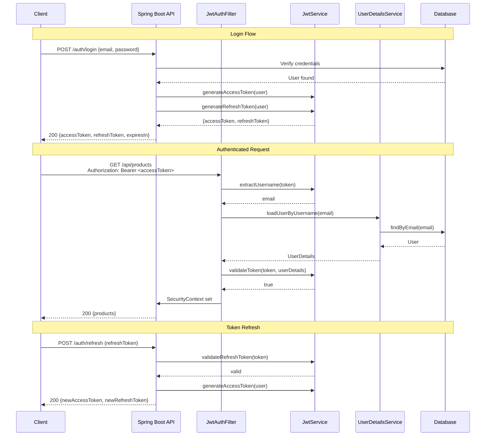

# JWT Authentication

JSON Web Tokens (JWT) are the standard mechanism for stateless authentication in REST APIs. Instead of storing session state on the server, the server issues a signed token that the client sends with every request. The server validates the token's signature, extracts the user identity, and processes the request — no session store, no sticky sessions, no server-side state.

This page provides a complete, production-ready JWT implementation for Spring Boot 3.x: token generation, validation, refresh token rotation, a custom authentication filter, and the full Security configuration.

## Architecture



## Dependencies

```xml
<!-- pom.xml -->
<dependency>
    <groupId>org.springframework.boot</groupId>
    <artifactId>spring-boot-starter-security</artifactId>
</dependency>

<!-- JJWT library (most popular JWT library for Java) -->
<dependency>
    <groupId>io.jsonwebtoken</groupId>
    <artifactId>jjwt-api</artifactId>
    <version>0.12.6</version>
</dependency>
<dependency>
    <groupId>io.jsonwebtoken</groupId>
    <artifactId>jjwt-impl</artifactId>
    <version>0.12.6</version>
    <scope>runtime</scope>
</dependency>
<dependency>
    <groupId>io.jsonwebtoken</groupId>
    <artifactId>jjwt-jackson</artifactId>
    <version>0.12.6</version>
    <scope>runtime</scope>
</dependency>
```

## Configuration Properties

```yaml
# application.yml
app:
  jwt:
    secret: ${JWT_SECRET}  # Must be at least 256 bits (32 chars) for HS256
    access-token-expiration: 15m    # Short-lived
    refresh-token-expiration: 7d    # Long-lived
    issuer: myapp-api
```

```java
@ConfigurationProperties(prefix = "app.jwt")
@Validated
public record JwtProperties(
        @NotBlank String secret,
        @NotNull Duration accessTokenExpiration,
        @NotNull Duration refreshTokenExpiration,
        @NotBlank String issuer
) {}
```

::: danger Generate a strong JWT secret
The secret must be at least 256 bits for HMAC-SHA256. Generate one with: `openssl rand -base64 32`. Never commit secrets to source control — use environment variables or a secret manager (Vault, AWS Secrets Manager).
:::

## JWT Service

```java
@Service
@RequiredArgsConstructor
@Slf4j
public class JwtService {

    private final JwtProperties jwtProperties;
    private SecretKey signingKey;

    @PostConstruct
    public void init() {
        byte[] keyBytes = Decoders.BASE64.decode(jwtProperties.secret());
        this.signingKey = Keys.hmacShaKeyFor(keyBytes);
    }

    /**
     * Generate an access token with user claims.
     */
    public String generateAccessToken(AppUserDetails user) {
        Map<String, Object> claims = new HashMap<>();
        claims.put("userId", user.getId().toString());
        claims.put("email", user.getEmail());
        claims.put("roles", user.getAuthorities().stream()
                .map(GrantedAuthority::getAuthority)
                .toList());

        return buildToken(claims, user.getUsername(),
                jwtProperties.accessTokenExpiration());
    }

    /**
     * Generate a refresh token (minimal claims).
     */
    public String generateRefreshToken(AppUserDetails user) {
        Map<String, Object> claims = Map.of("type", "refresh");
        return buildToken(claims, user.getUsername(),
                jwtProperties.refreshTokenExpiration());
    }

    /**
     * Extract username (subject) from token.
     */
    public String extractUsername(String token) {
        return extractClaim(token, Claims::getSubject);
    }

    /**
     * Extract any claim from token.
     */
    public <T> T extractClaim(String token, Function<Claims, T> claimsResolver) {
        Claims claims = extractAllClaims(token);
        return claimsResolver.apply(claims);
    }

    /**
     * Validate token against UserDetails.
     */
    public boolean isTokenValid(String token, UserDetails userDetails) {
        try {
            String username = extractUsername(token);
            return username.equals(userDetails.getUsername())
                    && !isTokenExpired(token);
        } catch (JwtException | IllegalArgumentException e) {
            log.debug("Invalid JWT token: {}", e.getMessage());
            return false;
        }
    }

    /**
     * Validate a refresh token.
     */
    public boolean isRefreshToken(String token) {
        try {
            Claims claims = extractAllClaims(token);
            return "refresh".equals(claims.get("type", String.class))
                    && !isTokenExpired(token);
        } catch (JwtException e) {
            return false;
        }
    }

    // === Private Helpers ===

    private String buildToken(Map<String, Object> extraClaims,
                               String subject, Duration expiration) {
        Instant now = Instant.now();
        return Jwts.builder()
                .claims(extraClaims)
                .subject(subject)
                .issuer(jwtProperties.issuer())
                .issuedAt(Date.from(now))
                .expiration(Date.from(now.plus(expiration)))
                .id(UUID.randomUUID().toString())    // Unique token ID (jti)
                .signWith(signingKey, Jwts.SIG.HS256)
                .compact();
    }

    private Claims extractAllClaims(String token) {
        return Jwts.parser()
                .verifyWith(signingKey)
                .requireIssuer(jwtProperties.issuer())
                .build()
                .parseSignedClaims(token)
                .getPayload();
    }

    private boolean isTokenExpired(String token) {
        Date expiration = extractClaim(token, Claims::getExpiration);
        return expiration.before(new Date());
    }
}
```

## JWT Authentication Filter

```java
@Component
@RequiredArgsConstructor
@Slf4j
public class JwtAuthenticationFilter extends OncePerRequestFilter {

    private final JwtService jwtService;
    private final UserDetailsService userDetailsService;

    @Override
    protected void doFilterInternal(
            HttpServletRequest request,
            HttpServletResponse response,
            FilterChain filterChain) throws ServletException, IOException {

        // 1. Extract token from Authorization header
        String token = extractToken(request);
        if (token == null) {
            filterChain.doFilter(request, response);
            return;
        }

        try {
            // 2. Extract username from token
            String username = jwtService.extractUsername(token);

            // 3. If username found and no auth in context yet
            if (username != null &&
                    SecurityContextHolder.getContext().getAuthentication() == null) {

                // 4. Load user from database
                UserDetails userDetails = userDetailsService.loadUserByUsername(username);

                // 5. Validate token
                if (jwtService.isTokenValid(token, userDetails)) {
                    // 6. Create auth token and set in SecurityContext
                    UsernamePasswordAuthenticationToken authToken =
                            new UsernamePasswordAuthenticationToken(
                                    userDetails,
                                    null,
                                    userDetails.getAuthorities());

                    authToken.setDetails(
                            new WebAuthenticationDetailsSource()
                                    .buildDetails(request));

                    SecurityContextHolder.getContext().setAuthentication(authToken);
                    log.debug("Authenticated user: {}", username);
                }
            }
        } catch (JwtException e) {
            log.debug("JWT validation failed: {}", e.getMessage());
            // Don't throw — let the request continue without auth.
            // The authorization filter will return 401 if auth is required.
        }

        filterChain.doFilter(request, response);
    }

    @Override
    protected boolean shouldNotFilter(HttpServletRequest request) {
        String path = request.getRequestURI();
        return path.startsWith("/api/v1/auth/")
                || path.startsWith("/actuator/")
                || path.startsWith("/v3/api-docs")
                || path.startsWith("/swagger-ui");
    }

    private String extractToken(HttpServletRequest request) {
        String header = request.getHeader(HttpHeaders.AUTHORIZATION);
        if (header != null && header.startsWith("Bearer ")) {
            return header.substring(7);
        }
        return null;
    }
}
```

## Security Configuration with JWT

```java
@Configuration
@EnableWebSecurity
@EnableMethodSecurity
@RequiredArgsConstructor
public class SecurityConfig {

    private final JwtAuthenticationFilter jwtAuthFilter;
    private final AuthenticationProvider authenticationProvider;

    @Bean
    public SecurityFilterChain securityFilterChain(HttpSecurity http) throws Exception {
        http
            .csrf(csrf -> csrf.disable())
            .cors(cors -> cors.configurationSource(corsConfigurationSource()))
            .sessionManagement(session ->
                    session.sessionCreationPolicy(SessionCreationPolicy.STATELESS))
            .authenticationProvider(authenticationProvider)
            .addFilterBefore(jwtAuthFilter,
                    UsernamePasswordAuthenticationFilter.class)
            .authorizeHttpRequests(auth -> auth
                    .requestMatchers("/api/v1/auth/**").permitAll()
                    .requestMatchers(HttpMethod.GET, "/api/v1/products/**").permitAll()
                    .requestMatchers("/actuator/health").permitAll()
                    .anyRequest().authenticated()
            )
            .exceptionHandling(ex -> ex
                    .authenticationEntryPoint((request, response, authException) -> {
                        response.setContentType(MediaType.APPLICATION_PROBLEM_JSON_VALUE);
                        response.setStatus(HttpStatus.UNAUTHORIZED.value());
                        response.getWriter().write("""
                                {"type":"about:blank","title":"Unauthorized",\
                                "status":401,"detail":"Authentication required"}
                                """);
                    })
            );

        return http.build();
    }

    @Bean
    public CorsConfigurationSource corsConfigurationSource() {
        CorsConfiguration config = new CorsConfiguration();
        config.setAllowedOrigins(List.of("http://localhost:3000", "https://myapp.com"));
        config.setAllowedMethods(List.of("GET", "POST", "PUT", "PATCH", "DELETE"));
        config.setAllowedHeaders(List.of("Authorization", "Content-Type"));
        config.setMaxAge(3600L);

        UrlBasedCorsConfigurationSource source = new UrlBasedCorsConfigurationSource();
        source.registerCorsConfiguration("/api/**", config);
        return source;
    }
}
```

## Auth Controller with Refresh Tokens

```java
@RestController
@RequestMapping("/api/v1/auth")
@RequiredArgsConstructor
@Slf4j
public class AuthController {

    private final AuthenticationManager authenticationManager;
    private final JwtService jwtService;
    private final UserService userService;
    private final RefreshTokenService refreshTokenService;

    @PostMapping("/login")
    public AuthResponse login(@Valid @RequestBody LoginRequest request) {
        Authentication auth = authenticationManager.authenticate(
                new UsernamePasswordAuthenticationToken(
                        request.email(), request.password()));

        AppUserDetails user = (AppUserDetails) auth.getPrincipal();
        String accessToken = jwtService.generateAccessToken(user);
        String refreshToken = refreshTokenService.createRefreshToken(user.getId());

        log.info("User logged in: {}", user.getEmail());
        return new AuthResponse(accessToken, refreshToken, user.getId(),
                jwtService.getAccessTokenExpiration());
    }

    @PostMapping("/refresh")
    public AuthResponse refreshToken(@Valid @RequestBody RefreshTokenRequest request) {
        // Validate and rotate refresh token
        RefreshToken storedToken = refreshTokenService
                .validateAndRotate(request.refreshToken());

        AppUserDetails user = (AppUserDetails)
                userDetailsService.loadUserByUsername(storedToken.getUser().getEmail());

        String newAccessToken = jwtService.generateAccessToken(user);

        return new AuthResponse(newAccessToken, storedToken.getToken(),
                user.getId(), jwtService.getAccessTokenExpiration());
    }

    @PostMapping("/logout")
    public ResponseEntity<Void> logout(
            @AuthenticationPrincipal AppUserDetails user,
            @RequestBody LogoutRequest request) {
        refreshTokenService.revokeByUserId(user.getId());
        log.info("User logged out: {}", user.getEmail());
        return ResponseEntity.noContent().build();
    }
}

// Response DTO
public record AuthResponse(
        String accessToken,
        String refreshToken,
        UUID userId,
        long expiresIn  // seconds until access token expires
) {}
```

## Refresh Token Entity and Service

```java
@Entity
@Table(name = "refresh_tokens", indexes = {
        @Index(name = "idx_refresh_token", columnList = "token", unique = true),
        @Index(name = "idx_refresh_token_user", columnList = "user_id")
})
@Getter
@Setter
@NoArgsConstructor
public class RefreshToken {

    @Id
    @GeneratedValue(strategy = GenerationType.UUID)
    private UUID id;

    @Column(nullable = false, unique = true)
    private String token;

    @ManyToOne(fetch = FetchType.LAZY)
    @JoinColumn(name = "user_id", nullable = false)
    private User user;

    @Column(nullable = false)
    private Instant expiresAt;

    @Column(nullable = false)
    private boolean revoked = false;

    @Column(nullable = false)
    private Instant createdAt = Instant.now();
}
```

```java
@Service
@RequiredArgsConstructor
@Slf4j
public class RefreshTokenService {

    private final RefreshTokenRepository refreshTokenRepository;
    private final UserRepository userRepository;

    @Value("${app.jwt.refresh-token-expiration}")
    private Duration refreshTokenExpiration;

    @Transactional
    public String createRefreshToken(UUID userId) {
        User user = userRepository.findById(userId)
                .orElseThrow(() -> new ResourceNotFoundException("User", userId));

        // Revoke existing refresh tokens for this user
        refreshTokenRepository.revokeAllByUserId(userId);

        RefreshToken token = new RefreshToken();
        token.setUser(user);
        token.setToken(generateSecureToken());
        token.setExpiresAt(Instant.now().plus(refreshTokenExpiration));

        refreshTokenRepository.save(token);
        return token.getToken();
    }

    @Transactional
    public RefreshToken validateAndRotate(String tokenValue) {
        RefreshToken token = refreshTokenRepository.findByToken(tokenValue)
                .orElseThrow(() -> new BusinessRuleViolationException(
                        "INVALID_REFRESH_TOKEN", "Refresh token not found"));

        if (token.isRevoked()) {
            // Possible token theft — revoke ALL tokens for this user
            log.warn("Revoked refresh token used for user {}. "
                    + "Revoking all tokens (possible theft).", token.getUser().getId());
            refreshTokenRepository.revokeAllByUserId(token.getUser().getId());
            throw new BusinessRuleViolationException(
                    "TOKEN_REUSE_DETECTED",
                    "Token reuse detected. All sessions have been invalidated.");
        }

        if (token.getExpiresAt().isBefore(Instant.now())) {
            token.setRevoked(true);
            throw new BusinessRuleViolationException(
                    "REFRESH_TOKEN_EXPIRED", "Refresh token has expired");
        }

        // Rotate: revoke old, create new
        token.setRevoked(true);
        refreshTokenRepository.save(token);

        return createRefreshTokenEntity(token.getUser());
    }

    @Transactional
    public void revokeByUserId(UUID userId) {
        refreshTokenRepository.revokeAllByUserId(userId);
    }

    private String generateSecureToken() {
        byte[] bytes = new byte[64];
        new SecureRandom().nextBytes(bytes);
        return Base64.getUrlEncoder().withoutPadding().encodeToString(bytes);
    }

    private RefreshToken createRefreshTokenEntity(User user) {
        RefreshToken token = new RefreshToken();
        token.setUser(user);
        token.setToken(generateSecureToken());
        token.setExpiresAt(Instant.now().plus(refreshTokenExpiration));
        return refreshTokenRepository.save(token);
    }
}
```

## JWT Token Structure

A JWT has three parts separated by dots: `header.payload.signature`

```
eyJhbGciOiJIUzI1NiJ9.eyJzdWIiOiJhZG1pbkBleGFtcGxlLmNvbSIsInVzZXJJZCI6IjU1MGU4NDAw
LWUyOWItNDFkNC1hNzE2LTQ0NjY1NTQ0MDAwMCIsInJvbGVzIjpbIlJPTEVfQURNSU4iXSwiaXNzIjoi
bXlhcHAtYXBpIiwiaWF0IjoxNzExMzU2MTMwLCJleHAiOjE3MTEzNTcwMzAsImp0aSI6ImFiYzEyMyJ9
.SflKxwRJSMeKKF2QT4fwpMeJf36POk6yJV_adQssw5c
```

Decoded payload:

```json
{
  "sub": "admin@example.com",
  "userId": "550e8400-e29b-41d4-a716-446655440000",
  "roles": ["ROLE_ADMIN"],
  "iss": "myapp-api",
  "iat": 1711356130,
  "exp": 1711357030,
  "jti": "abc123"
}
```

::: warning Do not store sensitive data in JWTs
JWTs are Base64-encoded, not encrypted. Anyone can decode the payload. Never include passwords, API keys, PII, or other sensitive data in JWT claims. Keep the payload minimal: user ID, email, roles.
:::

## Security Best Practices

| Practice | Implementation |
|---|---|
| Short access token lifetime | 15 minutes (`app.jwt.access-token-expiration: 15m`) |
| Refresh token rotation | Generate new refresh token on each refresh |
| Token reuse detection | If revoked token is reused, invalidate all user sessions |
| Secure secret storage | Environment variables or secret manager |
| HTTPS only | Set `Strict-Transport-Security` header |
| Token blacklisting | For logout, store revoked JTIs in Redis with TTL |
| Rate limit auth endpoints | Prevent brute force on login/refresh |

## Further Reading

- **[Spring Security Fundamentals](./security)** — Authentication and authorization basics
- **[OAuth2 & OIDC](./oauth2-oidc)** — OAuth2 as an alternative to custom JWT
- **[Caching](./caching)** — Redis for token blacklisting
- **[Testing](./testing)** — Testing authenticated endpoints
