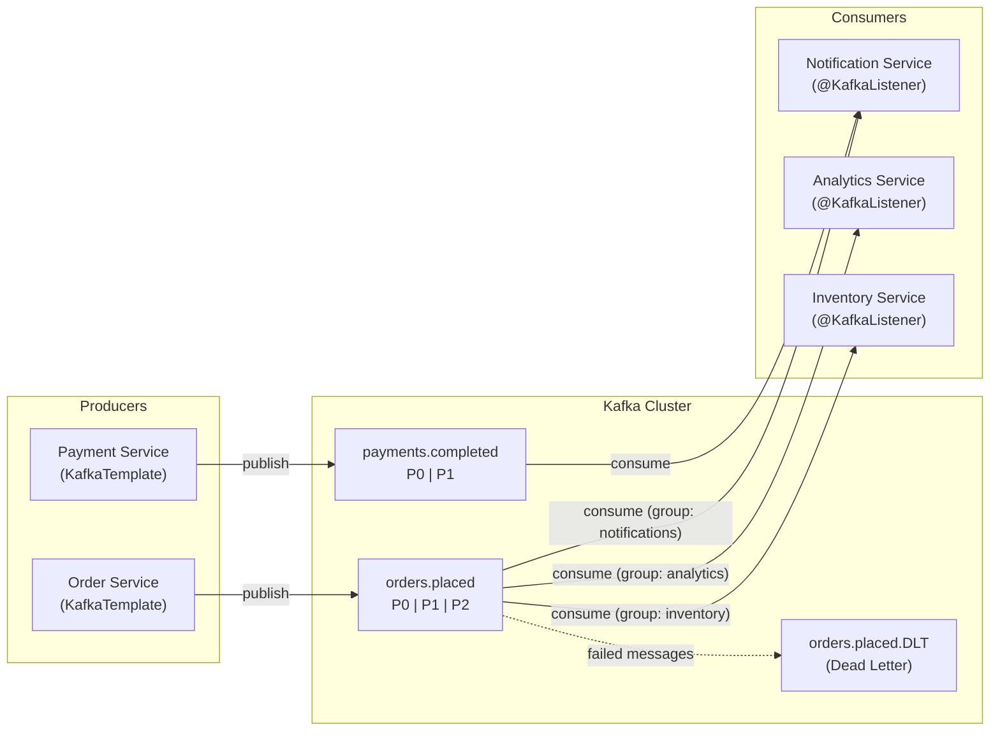

# Spring Kafka

Apache Kafka is the backbone of event-driven architectures. It handles millions of events per second with durable, partitioned, replicated logs. Spring Kafka wraps the Kafka Java client with Spring idioms — auto-configuration, `@KafkaListener`, template-based producing, and integration with Spring's transaction management.

This page covers the complete Spring Kafka lifecycle: producing messages, consuming with `@KafkaListener`, error handling, retry policies, dead letter topics, batch processing, and exactly-once semantics.

## Architecture



## Dependencies and Configuration

```xml
<!-- pom.xml -->
<dependency>
    <groupId>org.springframework.kafka</groupId>
    <artifactId>spring-kafka</artifactId>
</dependency>
<dependency>
    <groupId>org.springframework.kafka</groupId>
    <artifactId>spring-kafka-test</artifactId>
    <scope>test</scope>
</dependency>
```

```yaml
# application.yml
spring:
  kafka:
    bootstrap-servers: localhost:9092

    producer:
      key-serializer: org.apache.kafka.common.serialization.StringSerializer
      value-serializer: org.springframework.kafka.support.serializer.JsonSerializer
      acks: all                    # Wait for all replicas
      retries: 3
      properties:
        enable.idempotence: true   # Exactly-once producer
        max.in.flight.requests.per.connection: 5
        delivery.timeout.ms: 120000
        linger.ms: 5              # Batch for 5ms before sending
        batch.size: 16384
        compression.type: snappy

    consumer:
      group-id: ${spring.application.name}
      auto-offset-reset: earliest
      key-deserializer: org.apache.kafka.common.serialization.StringDeserializer
      value-deserializer: org.springframework.kafka.support.serializer.JsonDeserializer
      properties:
        spring.json.trusted.packages: com.example.*
        max.poll.records: 500
        max.poll.interval.ms: 300000
        session.timeout.ms: 30000
        heartbeat.interval.ms: 10000
      enable-auto-commit: false    # Manual commit for reliability

    listener:
      ack-mode: MANUAL_IMMEDIATE   # Commit after each message
      concurrency: 3               # 3 consumer threads
      type: single                 # or: batch
```

## Event Classes

```java
// Shared event definitions (typically in a shared library)
public sealed interface OrderEvent {

    UUID orderId();
    Instant timestamp();

    record OrderPlaced(
            UUID orderId,
            UUID customerId,
            List<OrderItemDto> items,
            BigDecimal total,
            Instant timestamp
    ) implements OrderEvent {}

    record OrderConfirmed(
            UUID orderId,
            String paymentId,
            Instant timestamp
    ) implements OrderEvent {}

    record OrderCancelled(
            UUID orderId,
            String reason,
            Instant timestamp
    ) implements OrderEvent {}
}

public record OrderItemDto(
        UUID productId,
        String productName,
        int quantity,
        BigDecimal unitPrice
) {}
```

## Producing Messages

```java
@Service
@RequiredArgsConstructor
@Slf4j
public class OrderEventProducer {

    private final KafkaTemplate<String, Object> kafkaTemplate;

    private static final String TOPIC = "orders.events";

    /**
     * Send event with the order ID as the key (ensures ordering per order).
     */
    public CompletableFuture<SendResult<String, Object>> publishOrderPlaced(
            OrderEvent.OrderPlaced event) {

        String key = event.orderId().toString();

        return kafkaTemplate.send(TOPIC, key, event)
                .whenComplete((result, ex) -> {
                    if (ex != null) {
                        log.error("Failed to send OrderPlaced event for order {}: {}",
                                event.orderId(), ex.getMessage());
                    } else {
                        RecordMetadata meta = result.getRecordMetadata();
                        log.info("OrderPlaced sent: topic={}, partition={}, offset={}, key={}",
                                meta.topic(), meta.partition(), meta.offset(), key);
                    }
                });
    }

    /**
     * Send with specific partition and headers.
     */
    public void publishWithHeaders(OrderEvent event) {
        ProducerRecord<String, Object> record = new ProducerRecord<>(
                TOPIC,
                null,                              // partition (null = use key)
                event.orderId().toString(),         // key
                event,                              // value
                List.of(
                        new RecordHeader("event-type",
                                event.getClass().getSimpleName().getBytes()),
                        new RecordHeader("correlation-id",
                                UUID.randomUUID().toString().getBytes()),
                        new RecordHeader("source", "order-service".getBytes())
                )
        );

        kafkaTemplate.send(record);
    }
}
```

### Transactional Producer (Exactly-Once)

```yaml
spring:
  kafka:
    producer:
      transaction-id-prefix: order-tx-  # Enables transactional producer
```

```java
@Service
@RequiredArgsConstructor
public class TransactionalOrderService {

    private final KafkaTemplate<String, Object> kafkaTemplate;
    private final OrderRepository orderRepository;

    /**
     * Database write + Kafka publish in one transaction.
     */
    @Transactional
    public OrderResponse placeOrder(CreateOrderRequest request) {
        Order order = orderRepository.save(Order.from(request));

        // Execute within Kafka transaction
        kafkaTemplate.executeInTransaction(ops -> {
            ops.send("orders.events", order.getId().toString(),
                    new OrderEvent.OrderPlaced(
                            order.getId(),
                            order.getCustomerId(),
                            mapItems(order),
                            order.getTotal(),
                            Instant.now()
                    ));
            return null;
        });

        return OrderResponse.from(order);
    }
}
```

## Consuming Messages

### Basic @KafkaListener

```java
@Component
@Slf4j
public class OrderEventConsumer {

    private final NotificationService notificationService;
    private final InventoryService inventoryService;

    public OrderEventConsumer(NotificationService notificationService,
                               InventoryService inventoryService) {
        this.notificationService = notificationService;
        this.inventoryService = inventoryService;
    }

    @KafkaListener(
            topics = "orders.events",
            groupId = "notification-service",
            containerFactory = "kafkaListenerContainerFactory"
    )
    public void handleOrderEvent(
            @Payload OrderEvent event,
            @Header(KafkaHeaders.RECEIVED_PARTITION) int partition,
            @Header(KafkaHeaders.OFFSET) long offset,
            @Header(KafkaHeaders.RECEIVED_KEY) String key,
            @Header(value = "correlation-id", required = false) byte[] correlationId,
            Acknowledgment ack) {

        String corrId = correlationId != null ? new String(correlationId) : "unknown";
        log.info("Received event: type={}, key={}, partition={}, offset={}, correlationId={}",
                event.getClass().getSimpleName(), key, partition, offset, corrId);

        try {
            switch (event) {
                case OrderEvent.OrderPlaced placed -> {
                    notificationService.sendOrderConfirmation(placed);
                    inventoryService.reserveStock(placed.items());
                }
                case OrderEvent.OrderConfirmed confirmed ->
                    notificationService.sendPaymentConfirmation(confirmed);
                case OrderEvent.OrderCancelled cancelled ->
                    notificationService.sendCancellationNotice(cancelled);
            }

            ack.acknowledge();  // Manual commit
            log.debug("Event processed and acknowledged: offset={}", offset);

        } catch (Exception e) {
            log.error("Failed to process event at offset {}: {}", offset, e.getMessage());
            // Don't acknowledge — message will be redelivered
            throw e;  // Let error handler deal with it
        }
    }
}
```

### Consumer for Specific Event Types

```java
@Component
@Slf4j
public class InventoryEventConsumer {

    @KafkaListener(
            topics = "orders.events",
            groupId = "inventory-service",
            filter = "orderPlacedFilter"
    )
    public void handleOrderPlaced(OrderEvent.OrderPlaced event) {
        log.info("Reserving inventory for order: {}", event.orderId());
        // Reserve stock for each item
        event.items().forEach(item ->
                inventoryService.reserve(item.productId(), item.quantity()));
    }
}

@Component
public class OrderPlacedFilter implements RecordFilterStrategy<String, Object> {
    @Override
    public boolean filter(ConsumerRecord<String, Object> record) {
        // Return true to SKIP (filter out) the record
        return !(record.value() instanceof OrderEvent.OrderPlaced);
    }
}
```

## Error Handling and Retry

```java
@Configuration
public class KafkaConsumerConfig {

    @Bean
    public ConcurrentKafkaListenerContainerFactory<String, Object>
            kafkaListenerContainerFactory(
                    ConsumerFactory<String, Object> consumerFactory,
                    KafkaTemplate<String, Object> kafkaTemplate) {

        ConcurrentKafkaListenerContainerFactory<String, Object> factory =
                new ConcurrentKafkaListenerContainerFactory<>();
        factory.setConsumerFactory(consumerFactory);
        factory.setConcurrency(3);

        // Manual acknowledgment
        factory.getContainerProperties()
                .setAckMode(ContainerProperties.AckMode.MANUAL_IMMEDIATE);

        // Error handler with retry and dead letter
        DefaultErrorHandler errorHandler = new DefaultErrorHandler(
                // Dead letter publisher
                new DeadLetterPublishingRecoverer(kafkaTemplate,
                        (record, ex) -> new TopicPartition(
                                record.topic() + ".DLT", record.partition())),
                // Retry backoff: 1s, 2s, 4s, then DLT
                new ExponentialBackOff(1000L, 2.0)
        );

        // Don't retry these exceptions (they won't succeed on retry)
        errorHandler.addNotRetryableExceptions(
                DeserializationException.class,
                ClassCastException.class,
                NullPointerException.class,
                IllegalArgumentException.class
        );

        // Retry these (transient failures)
        errorHandler.addRetryableExceptions(
                IOException.class,
                DataAccessResourceFailureException.class,
                TransientDataAccessException.class
        );

        factory.setCommonErrorHandler(errorHandler);

        return factory;
    }
}
```

### Dead Letter Topic Consumer

```java
@Component
@Slf4j
public class DeadLetterConsumer {

    @KafkaListener(
            topics = "orders.events.DLT",
            groupId = "dlt-processor"
    )
    public void handleDeadLetter(
            ConsumerRecord<String, Object> record,
            @Header(KafkaHeaders.DLT_EXCEPTION_MESSAGE) String exceptionMessage,
            @Header(KafkaHeaders.DLT_ORIGINAL_TOPIC) String originalTopic,
            @Header(KafkaHeaders.DLT_ORIGINAL_OFFSET) long originalOffset) {

        log.error("Dead letter received: topic={}, originalTopic={}, " +
                        "originalOffset={}, error={}",
                record.topic(), originalTopic, originalOffset, exceptionMessage);

        // Store in database for manual review
        deadLetterRepository.save(DeadLetter.builder()
                .originalTopic(originalTopic)
                .originalOffset(originalOffset)
                .key(record.key())
                .payload(record.value().toString())
                .errorMessage(exceptionMessage)
                .build());

        // Alert ops team
        alertService.sendAlert("Dead letter received from " + originalTopic);
    }
}
```

## Batch Consuming

```yaml
spring:
  kafka:
    listener:
      type: batch   # Enable batch consuming
    consumer:
      max-poll-records: 100
```

```java
@Component
@Slf4j
public class AnalyticsEventConsumer {

    private final AnalyticsRepository analyticsRepository;

    @KafkaListener(
            topics = "orders.events",
            groupId = "analytics-service",
            batch = "true"
    )
    public void handleBatch(
            @Payload List<OrderEvent> events,
            @Header(KafkaHeaders.RECEIVED_PARTITION) List<Integer> partitions,
            @Header(KafkaHeaders.OFFSET) List<Long> offsets,
            Acknowledgment ack) {

        log.info("Received batch of {} events", events.size());

        try {
            List<AnalyticsRecord> records = events.stream()
                    .filter(e -> e instanceof OrderEvent.OrderPlaced)
                    .map(e -> (OrderEvent.OrderPlaced) e)
                    .map(this::toAnalyticsRecord)
                    .toList();

            // Bulk insert for efficiency
            analyticsRepository.saveAll(records);

            ack.acknowledge();
            log.info("Batch of {} analytics records saved", records.size());

        } catch (Exception e) {
            log.error("Failed to process batch: {}", e.getMessage());
            throw e;
        }
    }
}
```

## Topic Configuration

```java
@Configuration
public class KafkaTopicConfig {

    @Bean
    public NewTopic ordersEventsTopic() {
        return TopicBuilder.name("orders.events")
                .partitions(6)              // 6 partitions for parallelism
                .replicas(3)                // 3 replicas for durability
                .config(TopicConfig.RETENTION_MS_CONFIG, "604800000")   // 7 days
                .config(TopicConfig.CLEANUP_POLICY_CONFIG, "delete")
                .config(TopicConfig.MIN_IN_SYNC_REPLICAS_CONFIG, "2")
                .config(TopicConfig.COMPRESSION_TYPE_CONFIG, "snappy")
                .build();
    }

    @Bean
    public NewTopic ordersEventsDLT() {
        return TopicBuilder.name("orders.events.DLT")
                .partitions(3)
                .replicas(3)
                .config(TopicConfig.RETENTION_MS_CONFIG, "2592000000") // 30 days
                .build();
    }

    @Bean
    public NewTopic paymentsCompletedTopic() {
        return TopicBuilder.name("payments.completed")
                .partitions(3)
                .replicas(3)
                .compact()   // Log compaction — keeps latest value per key
                .build();
    }
}
```

## Testing

```java
@SpringBootTest
@EmbeddedKafka(
        partitions = 1,
        topics = {"orders.events", "orders.events.DLT"},
        bootstrapServersProperty = "spring.kafka.bootstrap-servers"
)
class OrderEventIntegrationTest {

    @Autowired
    private KafkaTemplate<String, Object> kafkaTemplate;

    @Autowired
    private OrderEventConsumer consumer;

    @SpyBean
    private NotificationService notificationService;

    @Test
    void orderPlacedEvent_IsConsumedAndProcessed() throws Exception {
        // Given
        var event = new OrderEvent.OrderPlaced(
                UUID.randomUUID(),
                UUID.randomUUID(),
                List.of(new OrderItemDto(UUID.randomUUID(), "Widget", 2,
                        new BigDecimal("9.99"))),
                new BigDecimal("19.98"),
                Instant.now()
        );

        // When
        kafkaTemplate.send("orders.events", event.orderId().toString(), event).get();

        // Then — verify consumer processes the event
        await().atMost(Duration.ofSeconds(10)).untilAsserted(() ->
                verify(notificationService).sendOrderConfirmation(any()));
    }
}
```

::: tip Use Testcontainers for integration tests
`@EmbeddedKafka` is convenient but uses an in-memory broker that may behave differently from real Kafka. For production-grade tests, use Testcontainers with a real Kafka image. See the [Testing](./testing) page.
:::

## Further Reading

- **[Spring Cloud](./spring-cloud)** — Microservice infrastructure around Kafka
- **[Async & Scheduling](./async)** — Async processing patterns
- **[Testing](./testing)** — Kafka testing with Testcontainers
- **[Actuator & Monitoring](./actuator)** — Kafka consumer lag metrics

## Common Pitfalls

::: danger Pitfall 1: Using auto-commit with manual acknowledgment
Enabling `enable-auto-commit: true` while also using `MANUAL` ack mode causes messages to be committed before processing completes, leading to message loss on failures.
**Fix:** Set `spring.kafka.consumer.enable-auto-commit: false` and use `MANUAL_IMMEDIATE` ack mode. Only call `ack.acknowledge()` after successful processing.
:::

::: danger Pitfall 2: Not configuring a Dead Letter Topic (DLT)
Without a DLT, messages that consistently fail processing block the partition (with retries) or are silently lost (without retries).
**Fix:** Configure a `DefaultErrorHandler` with `DeadLetterPublishingRecoverer` and exponential backoff. Monitor the DLT and process failed messages manually or through a retry pipeline.
:::

::: danger Pitfall 3: Not setting trusted packages for JSON deserialization
Spring Kafka's `JsonDeserializer` rejects classes not in trusted packages, causing `ClassNotFoundException` at runtime.
**Fix:** Set `spring.kafka.consumer.properties.spring.json.trusted.packages: com.example.*` in your configuration. Never use `*` in production -- whitelist only your application packages.
:::

::: danger Pitfall 4: Using the same consumer group ID across different services
Two different services with the same `group-id` will compete for partitions, meaning each service only processes a fraction of the messages.
**Fix:** Use unique consumer group IDs per service, typically `${spring.application.name}`. Different services reading the same topic should use different group IDs to each receive all messages.
:::

::: danger Pitfall 5: Not making consumers idempotent
Kafka guarantees at-least-once delivery. Consumers may receive the same message multiple times during rebalancing or retries.
**Fix:** Make consumers idempotent by using unique event IDs for deduplication, upsert operations (INSERT ON CONFLICT), or database constraints that reject duplicate processing.
:::

## Interview Questions

**Q1: What is the difference between Kafka consumer groups and partitions?**
::: details Answer
A topic is divided into partitions for parallelism. Each partition is an ordered, append-only log. A consumer group is a set of consumers that cooperate to consume a topic. Kafka assigns each partition to exactly one consumer within a group, ensuring each message is processed once per group. If a topic has 6 partitions and a consumer group has 3 consumers, each consumer handles 2 partitions. If the group has 6+ consumers, some will be idle. Multiple consumer groups reading the same topic each receive all messages independently -- this enables multiple services to react to the same events.
:::

**Q2: How does Spring Kafka handle error handling and retries?**
::: details Answer
Spring Kafka's `DefaultErrorHandler` provides configurable retry and recovery. You configure a `BackOff` policy (fixed or exponential) that retries failed messages within the same consumer poll cycle. After exhausting retries, a `DeadLetterPublishingRecoverer` sends the failed message to a DLT topic (e.g., `orders.events.DLT`) with error metadata in headers. You can classify exceptions as retryable (transient failures like `IOException`) or not-retryable (serialization errors, validation errors) using `addRetryableExceptions()` and `addNotRetryableExceptions()`.
:::

**Q3: What are the exactly-once semantics in Kafka and how do you achieve them?**
::: details Answer
Exactly-once semantics (EOS) ensures each message is processed exactly once, even with failures and retries. It requires three components: (1) **Idempotent producer**: Set `enable.idempotence: true` so Kafka deduplicates retried sends using sequence numbers. (2) **Transactional producer**: Set `transaction-id-prefix` and use `kafkaTemplate.executeInTransaction()` to atomically commit produces and consumer offsets. (3) **Consumer with read-committed isolation**: Set `isolation.level: read_committed` so consumers only see messages from committed transactions. EOS adds overhead, so use it only when duplicates are unacceptable (financial transactions, inventory updates).
:::

**Q4: How do you ensure message ordering in Kafka?**
::: details Answer
Kafka guarantees ordering only within a single partition. Messages with the same key are sent to the same partition (via hash-based partitioning). To ensure ordering for a specific entity (e.g., all events for order #123), use the entity ID as the message key. For global ordering, use a single-partition topic (but this limits throughput to one consumer). With `max.in.flight.requests.per.connection: 5` and `enable.idempotence: true`, Kafka maintains ordering even with retries on a single partition.
:::

**Q5: What is the difference between `@KafkaListener` and Spring Cloud Stream for Kafka consumption?**
::: details Answer
`@KafkaListener` is Spring Kafka's native annotation that provides direct control over consumer configuration, partition assignment, error handling, and manual acknowledgment. It uses Kafka-specific APIs. Spring Cloud Stream is a higher-level abstraction that uses functional interfaces (`Consumer<T>`, `Function<T,R>`) and provides broker-agnostic programming -- you can switch from Kafka to RabbitMQ by changing a dependency. Use `@KafkaListener` when you need fine-grained Kafka control (manual offsets, partition assignment, headers). Use Spring Cloud Stream when you want broker portability or prefer the functional programming model.
:::
