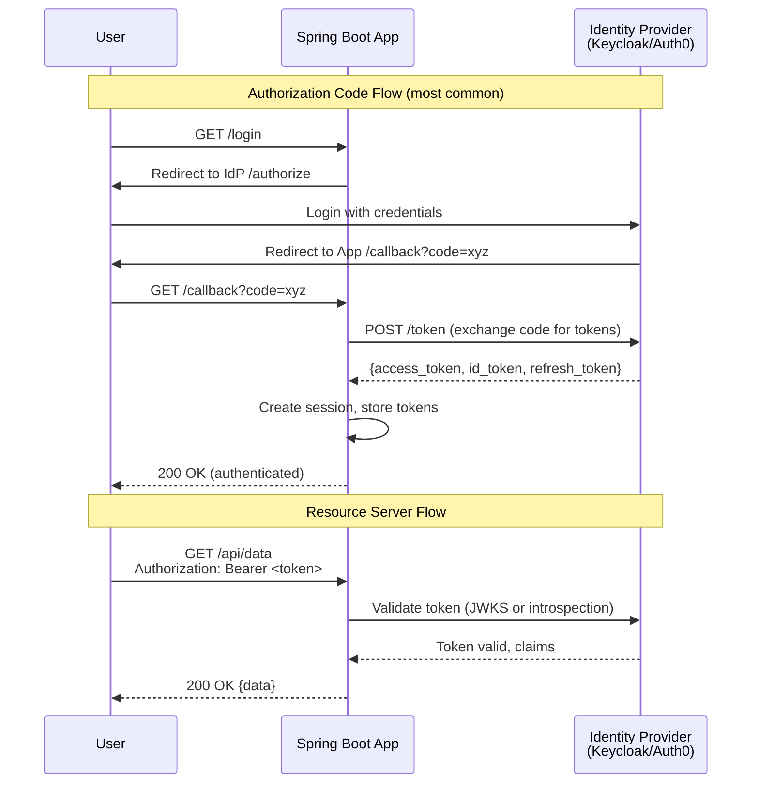
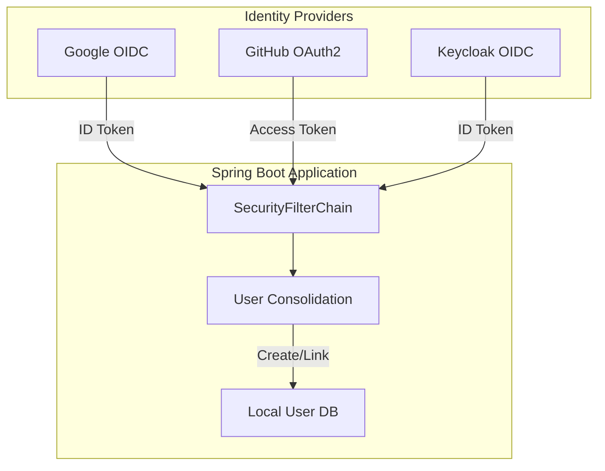

# OAuth2 & OpenID Connect

OAuth2 is the industry standard for delegated authorization. OpenID Connect (OIDC) builds on OAuth2 to add authentication — proving who the user is. Instead of building your own JWT infrastructure, you delegate to an identity provider (IdP) like Keycloak, Auth0, Okta, or the social login providers (Google, GitHub, Apple).

Spring Security has first-class support for both OAuth2 client (your app redirects to an IdP) and OAuth2 resource server (your API validates tokens from an IdP). This page covers both patterns with complete implementations.

## OAuth2 Flows



## Resource Server (API Protection)

The most common pattern: your Spring Boot API validates JWT tokens issued by an external IdP.

### Dependencies

```xml
<dependency>
    <groupId>org.springframework.boot</groupId>
    <artifactId>spring-boot-starter-oauth2-resource-server</artifactId>
</dependency>
<dependency>
    <groupId>org.springframework.boot</groupId>
    <artifactId>spring-boot-starter-security</artifactId>
</dependency>
```

### Configuration

```yaml
# application.yml
spring:
  security:
    oauth2:
      resourceserver:
        jwt:
          # Keycloak JWKS endpoint — Spring auto-fetches public keys
          jwk-set-uri: http://localhost:8180/realms/myapp/protocol/openid-connect/certs
          issuer-uri: http://localhost:8180/realms/myapp

          # For Auth0:
          # jwk-set-uri: https://YOUR_DOMAIN.auth0.com/.well-known/jwks.json
          # issuer-uri: https://YOUR_DOMAIN.auth0.com/
```

### Security Config for Resource Server

```java
@Configuration
@EnableWebSecurity
@EnableMethodSecurity
public class ResourceServerConfig {

    @Bean
    public SecurityFilterChain securityFilterChain(HttpSecurity http) throws Exception {
        http
            .csrf(csrf -> csrf.disable())
            .sessionManagement(session ->
                    session.sessionCreationPolicy(SessionCreationPolicy.STATELESS))
            .authorizeHttpRequests(auth -> auth
                    .requestMatchers("/api/public/**").permitAll()
                    .requestMatchers("/actuator/health").permitAll()
                    .requestMatchers(HttpMethod.GET, "/api/v1/products/**").permitAll()
                    .requestMatchers("/api/v1/admin/**").hasRole("ADMIN")
                    .anyRequest().authenticated()
            )
            .oauth2ResourceServer(oauth2 -> oauth2
                    .jwt(jwt -> jwt
                            .jwtAuthenticationConverter(jwtAuthConverter()))
            );

        return http.build();
    }

    /**
     * Maps JWT claims to Spring Security authorities.
     * Keycloak puts roles in: realm_access.roles and resource_access.{client}.roles
     */
    @Bean
    public JwtAuthenticationConverter jwtAuthConverter() {
        JwtGrantedAuthoritiesConverter grantedAuthoritiesConverter =
                new JwtGrantedAuthoritiesConverter();
        grantedAuthoritiesConverter.setAuthorityPrefix("ROLE_");
        grantedAuthoritiesConverter.setAuthoritiesClaimName("roles");

        JwtAuthenticationConverter converter = new JwtAuthenticationConverter();
        converter.setJwtGrantedAuthoritiesConverter(jwt -> {
            // Extract Keycloak realm roles
            Collection<GrantedAuthority> authorities = new ArrayList<>();

            Map<String, Object> realmAccess = jwt.getClaimAsMap("realm_access");
            if (realmAccess != null) {
                List<String> roles = (List<String>) realmAccess.get("roles");
                if (roles != null) {
                    roles.forEach(role ->
                            authorities.add(new SimpleGrantedAuthority("ROLE_" + role.toUpperCase())));
                }
            }

            // Extract resource-specific roles
            Map<String, Object> resourceAccess = jwt.getClaimAsMap("resource_access");
            if (resourceAccess != null) {
                Map<String, Object> clientAccess =
                        (Map<String, Object>) resourceAccess.get("myapp-client");
                if (clientAccess != null) {
                    List<String> clientRoles = (List<String>) clientAccess.get("roles");
                    if (clientRoles != null) {
                        clientRoles.forEach(role ->
                                authorities.add(new SimpleGrantedAuthority("ROLE_" + role.toUpperCase())));
                    }
                }
            }

            return authorities;
        });

        converter.setPrincipalClaimName("preferred_username");
        return converter;
    }
}
```

### Accessing JWT Claims in Controllers

```java
@RestController
@RequestMapping("/api/v1/profile")
public class ProfileController {

    /**
     * Access the entire JWT token
     */
    @GetMapping
    public Map<String, Object> getProfile(@AuthenticationPrincipal Jwt jwt) {
        return Map.of(
                "sub", jwt.getSubject(),
                "email", jwt.getClaimAsString("email"),
                "name", jwt.getClaimAsString("name"),
                "roles", jwt.getClaimAsStringList("roles"),
                "issuedAt", jwt.getIssuedAt(),
                "expiresAt", jwt.getExpiresAt()
        );
    }

    /**
     * Use with custom principal
     */
    @GetMapping("/orders")
    @PreAuthorize("hasRole('USER')")
    public List<OrderResponse> myOrders(@AuthenticationPrincipal Jwt jwt) {
        String userId = jwt.getSubject();
        return orderService.findByExternalUserId(userId);
    }
}
```

## Keycloak Integration

### Docker Compose Setup

```yaml
# docker-compose.yml
services:
  keycloak:
    image: quay.io/keycloak/keycloak:24.0
    command: start-dev
    ports:
      - "8180:8080"
    environment:
      KEYCLOAK_ADMIN: admin
      KEYCLOAK_ADMIN_PASSWORD: admin
      KC_DB: postgres
      KC_DB_URL: jdbc:postgresql://keycloak-db:5432/keycloak
      KC_DB_USERNAME: keycloak
      KC_DB_PASSWORD: keycloak
    depends_on:
      - keycloak-db

  keycloak-db:
    image: postgres:16
    environment:
      POSTGRES_DB: keycloak
      POSTGRES_USER: keycloak
      POSTGRES_PASSWORD: keycloak
    volumes:
      - keycloak-data:/var/lib/postgresql/data

volumes:
  keycloak-data:
```

### Keycloak Realm Configuration (exportable JSON)

```java
/**
 * Programmatic Keycloak realm setup for testing/development.
 * Uses the Keycloak Admin REST API.
 */
@Component
@Slf4j
@Profile("dev")
public class KeycloakInitializer implements ApplicationRunner {

    @Value("${keycloak.admin.url}")
    private String keycloakUrl;

    @Override
    public void run(ApplicationArguments args) {
        try (Keycloak keycloak = KeycloakBuilder.builder()
                .serverUrl(keycloakUrl)
                .realm("master")
                .clientId("admin-cli")
                .username("admin")
                .password("admin")
                .build()) {

            // Create realm if not exists
            RealmRepresentation realm = new RealmRepresentation();
            realm.setRealm("myapp");
            realm.setEnabled(true);
            realm.setRegistrationAllowed(true);

            try {
                keycloak.realms().create(realm);
                log.info("Keycloak realm 'myapp' created");
            } catch (ClientErrorException e) {
                log.info("Keycloak realm 'myapp' already exists");
            }

            // Create client
            ClientRepresentation client = new ClientRepresentation();
            client.setClientId("myapp-client");
            client.setPublicClient(true);
            client.setRedirectUris(List.of("http://localhost:3000/*"));
            client.setWebOrigins(List.of("http://localhost:3000"));
            client.setDirectAccessGrantsEnabled(true);

            keycloak.realm("myapp").clients().create(client);

            // Create roles
            keycloak.realm("myapp").roles()
                    .create(new RoleRepresentation("USER", "Regular user", false));
            keycloak.realm("myapp").roles()
                    .create(new RoleRepresentation("ADMIN", "Administrator", false));

            log.info("Keycloak realm setup complete");
        }
    }
}
```

## Social Login (OAuth2 Client)

For server-rendered apps or BFF (Backend For Frontend) patterns:

### Dependencies

```xml
<dependency>
    <groupId>org.springframework.boot</groupId>
    <artifactId>spring-boot-starter-oauth2-client</artifactId>
</dependency>
```

### Configuration

```yaml
spring:
  security:
    oauth2:
      client:
        registration:
          google:
            client-id: ${GOOGLE_CLIENT_ID}
            client-secret: ${GOOGLE_CLIENT_SECRET}
            scope: openid, profile, email

          github:
            client-id: ${GITHUB_CLIENT_ID}
            client-secret: ${GITHUB_CLIENT_SECRET}
            scope: read:user, user:email

          keycloak:
            client-id: myapp-client
            client-secret: ${KEYCLOAK_CLIENT_SECRET}
            scope: openid, profile, email
            authorization-grant-type: authorization_code
            redirect-uri: "{baseUrl}/login/oauth2/code/{registrationId}"

        provider:
          keycloak:
            issuer-uri: http://localhost:8180/realms/myapp
            user-name-attribute: preferred_username
```

### OAuth2 Client Security Config

```java
@Configuration
@EnableWebSecurity
public class OAuth2ClientConfig {

    @Bean
    public SecurityFilterChain securityFilterChain(HttpSecurity http) throws Exception {
        http
            .authorizeHttpRequests(auth -> auth
                    .requestMatchers("/", "/login", "/error").permitAll()
                    .anyRequest().authenticated()
            )
            .oauth2Login(oauth2 -> oauth2
                    .loginPage("/login")
                    .defaultSuccessUrl("/dashboard", true)
                    .failureUrl("/login?error=true")
                    .userInfoEndpoint(userInfo -> userInfo
                            .oidcUserService(customOidcUserService())
                            .userService(customOAuth2UserService())
                    )
            )
            .logout(logout -> logout
                    .logoutSuccessUrl("/")
                    .invalidateHttpSession(true)
                    .clearAuthentication(true)
            );

        return http.build();
    }

    /**
     * Custom OIDC user service — maps IdP user to local user
     */
    @Bean
    public OidcUserService customOidcUserService() {
        return new OidcUserService() {
            @Override
            public OidcUser loadUser(OidcUserRequest request)
                    throws OAuth2AuthenticationException {
                OidcUser oidcUser = super.loadUser(request);
                // Map to local user, create if first login
                return processOidcUser(oidcUser, request.getClientRegistration());
            }
        };
    }

    private OidcUser processOidcUser(OidcUser oidcUser,
                                      ClientRegistration registration) {
        String email = oidcUser.getEmail();
        String provider = registration.getRegistrationId();

        // Create or update local user
        User localUser = userRepository.findByEmail(email)
                .orElseGet(() -> {
                    User newUser = new User();
                    newUser.setEmail(email);
                    newUser.setFirstName(oidcUser.getGivenName());
                    newUser.setLastName(oidcUser.getFamilyName());
                    newUser.setProvider(provider);
                    newUser.setProviderId(oidcUser.getSubject());
                    newUser.setRoles(Set.of(UserRole.USER));
                    return userRepository.save(newUser);
                });

        // Add local roles to the OIDC user's authorities
        Set<GrantedAuthority> authorities = new HashSet<>(oidcUser.getAuthorities());
        localUser.getRoles().forEach(role ->
                authorities.add(new SimpleGrantedAuthority("ROLE_" + role.name())));

        return new DefaultOidcUser(authorities, oidcUser.getIdToken(),
                oidcUser.getUserInfo());
    }
}
```

## Token Introspection (Opaque Tokens)

For opaque (non-JWT) tokens, use token introspection:

```yaml
spring:
  security:
    oauth2:
      resourceserver:
        opaquetoken:
          introspection-uri: http://localhost:8180/realms/myapp/protocol/openid-connect/token/introspect
          client-id: myapp-client
          client-secret: ${KEYCLOAK_CLIENT_SECRET}
```

```java
@Bean
public SecurityFilterChain securityFilterChain(HttpSecurity http) throws Exception {
    http
        .oauth2ResourceServer(oauth2 -> oauth2
                .opaqueToken(opaque -> opaque
                        .introspector(customIntrospector()))
        );
    return http.build();
}

@Bean
public OpaqueTokenIntrospector customIntrospector() {
    OpaqueTokenIntrospector delegate = new NimbusOpaqueTokenIntrospector(
            introspectionUri, clientId, clientSecret);

    return token -> {
        OAuth2AuthenticatedPrincipal principal = delegate.introspect(token);
        return new DefaultOAuth2AuthenticatedPrincipal(
                principal.getName(),
                principal.getAttributes(),
                extractAuthorities(principal));
    };
}
```

## Multi-Provider Support



```java
@Service
@RequiredArgsConstructor
public class UserConsolidationService {

    private final UserRepository userRepository;
    private final SocialAccountRepository socialAccountRepository;

    /**
     * Links social login to existing local account or creates new.
     */
    @Transactional
    public User consolidateUser(String provider, String providerId,
                                 String email, String name) {
        // Check if social account already linked
        Optional<SocialAccount> existing =
                socialAccountRepository.findByProviderAndProviderId(provider, providerId);

        if (existing.isPresent()) {
            return existing.get().getUser();
        }

        // Check if user exists by email
        User user = userRepository.findByEmail(email)
                .orElseGet(() -> createUser(email, name));

        // Link social account
        SocialAccount socialAccount = SocialAccount.builder()
                .user(user)
                .provider(provider)
                .providerId(providerId)
                .build();
        socialAccountRepository.save(socialAccount);

        return user;
    }

    private User createUser(String email, String name) {
        String[] parts = name != null ? name.split(" ", 2) : new String[]{"User", ""};
        User user = User.builder()
                .email(email)
                .firstName(parts[0])
                .lastName(parts.length > 1 ? parts[1] : "")
                .roles(Set.of(UserRole.USER))
                .active(true)
                .build();
        return userRepository.save(user);
    }
}
```

## Testing with OAuth2

```java
@WebMvcTest(ProductController.class)
@Import(ResourceServerConfig.class)
class ProductControllerOAuth2Test {

    @Autowired
    private MockMvc mockMvc;

    @MockBean
    private ProductService productService;

    @Test
    void getProducts_WithValidJwt_Returns200() throws Exception {
        mockMvc.perform(get("/api/v1/products")
                        .with(jwt()
                                .jwt(j -> j
                                        .subject("user123")
                                        .claim("email", "user@test.com")
                                        .claim("realm_access", Map.of(
                                                "roles", List.of("USER")))
                                )))
                .andExpect(status().isOk());
    }

    @Test
    void adminEndpoint_WithUserRole_Returns403() throws Exception {
        mockMvc.perform(get("/api/v1/admin/users")
                        .with(jwt().authorities(
                                new SimpleGrantedAuthority("ROLE_USER"))))
                .andExpect(status().isForbidden());
    }

    @Test
    void adminEndpoint_WithAdminRole_Returns200() throws Exception {
        mockMvc.perform(get("/api/v1/admin/users")
                        .with(jwt().authorities(
                                new SimpleGrantedAuthority("ROLE_ADMIN"))))
                .andExpect(status().isOk());
    }
}
```

## Further Reading

- **[Spring Security Fundamentals](./security)** — Core security concepts
- **[JWT Authentication](./jwt-auth)** — Custom JWT implementation
- **[Spring Cloud](./spring-cloud)** — API Gateway with OAuth2 token relay
- **[Docker & Deployment](./docker)** — Keycloak Docker setup

## Common Pitfalls

::: danger Pitfall 1: Confusing OAuth2 roles (Client vs Resource Server)
Using `spring-boot-starter-oauth2-client` when you need `spring-boot-starter-oauth2-resource-server` (or vice versa) leads to incorrect authentication flow.
**Fix:** Use `oauth2-resource-server` for APIs that validate tokens from an IdP. Use `oauth2-client` for server-rendered apps that redirect users to an IdP for login. Backend-for-Frontend (BFF) patterns may need both.
:::

::: danger Pitfall 2: Not mapping IdP roles to Spring Security authorities correctly
Keycloak puts roles in `realm_access.roles`; Auth0 uses custom claims; Google uses scopes. Default Spring Security may not extract them, leaving users without proper authorities.
**Fix:** Implement a custom `JwtAuthenticationConverter` or `JwtGrantedAuthoritiesConverter` that maps your IdP's specific claim structure to Spring Security `GrantedAuthority` objects.
:::

::: danger Pitfall 3: Not validating the token issuer
Without issuer validation, tokens from different Keycloak realms or different Auth0 tenants could be accepted as valid.
**Fix:** Set `spring.security.oauth2.resourceserver.jwt.issuer-uri` to your specific IdP realm/tenant URL. Spring Security will validate the `iss` claim automatically.
:::

::: danger Pitfall 4: Hardcoding IdP URLs in application.yml
Hardcoding the Keycloak or Auth0 URL makes it impossible to switch environments without code changes.
**Fix:** Use environment variables (`${KEYCLOAK_URL}`) or Spring Cloud Config for IdP URLs. Use the `.well-known/openid-configuration` discovery endpoint via `issuer-uri` for automatic configuration.
:::

::: danger Pitfall 5: Not consolidating social login users with local accounts
When a user logs in with Google and later with GitHub using the same email, two separate accounts are created, causing data fragmentation.
**Fix:** Implement a `UserConsolidationService` that links social accounts to a single local user by matching on email. Store provider and provider ID in a `social_accounts` table linked to the user.
:::

## Interview Questions

**Q1: What is the difference between OAuth2 and OpenID Connect (OIDC)?**
::: details Answer
OAuth2 is an authorization framework that grants third-party applications limited access to a user's resources without sharing credentials. It defines flows for obtaining access tokens but does not define how to authenticate users. OIDC is an authentication layer built on top of OAuth2. It adds an ID Token (a JWT containing user identity claims like `sub`, `email`, `name`), a UserInfo endpoint, and standardized scopes (`openid`, `profile`, `email`). In short: OAuth2 answers "what can this app access?" while OIDC answers "who is this user?"
:::

**Q2: Explain the Authorization Code flow in OAuth2.**
::: details Answer
(1) The client redirects the user to the IdP's `/authorize` endpoint with `response_type=code`, `client_id`, `redirect_uri`, `scope`, and a `state` parameter for CSRF protection. (2) The user authenticates at the IdP. (3) The IdP redirects back to the client's `redirect_uri` with an authorization code. (4) The client exchanges the code for tokens by calling the IdP's `/token` endpoint with the code, `client_id`, `client_secret`, and `grant_type=authorization_code`. (5) The IdP returns an access token, refresh token, and optionally an ID token. This flow is the most secure because the access token is never exposed to the browser.
:::

**Q3: How does Spring Security validate JWT tokens from an external IdP?**
::: details Answer
Spring Security uses the JWKS (JSON Web Key Set) endpoint published by the IdP to validate JWT signatures. When configured with `jwk-set-uri`, it fetches the IdP's public keys and caches them. For each incoming request with a `Bearer` token, it: (1) Decodes the JWT header to find the key ID (`kid`). (2) Looks up the matching public key from the JWKS cache. (3) Verifies the signature. (4) Validates claims: `exp` (not expired), `iss` (matches expected issuer), and `aud` (if configured). (5) Converts claims to a `Jwt` authentication object with granted authorities.
:::

**Q4: What is token introspection and when would you use it instead of JWT validation?**
::: details Answer
Token introspection (RFC 7662) is used for opaque (non-JWT) tokens. Instead of validating the token locally, the resource server sends it to the IdP's introspection endpoint, which returns whether the token is active and its associated claims. Use introspection when: (1) The IdP issues opaque tokens instead of JWTs. (2) You need real-time revocation checks (JWTs cannot be revoked until they expire). (3) You want the IdP to remain the single authority on token validity. The tradeoff is a network call for every request, which adds latency.
:::

**Q5: How do you test OAuth2-secured endpoints without a real IdP?**
::: details Answer
Spring Security Test provides `jwt()` request post-processor for MockMvc: `mockMvc.perform(get("/api/data").with(jwt().jwt(j -> j.subject("user123").claim("roles", List.of("USER")))))`. This creates a mock JWT authentication without requiring a real IdP. You can set any claims, authorities, and principal attributes. For `@WithMockUser`, use `@WithMockUser(roles = "ADMIN")` for simple role-based tests. For WebFlux, use `WebTestClient` with `mutateWith(mockJwt())`.
:::
