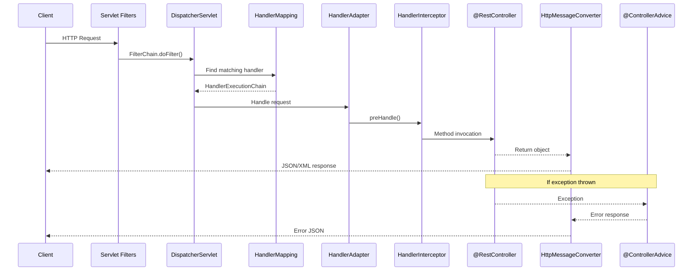

# REST API Development

Spring Boot makes REST API development deceptively easy. You annotate a class with `@RestController`, add a method with `@GetMapping`, and you have an endpoint. But the gap between that first endpoint and a production-quality API is enormous. This page covers everything you need to build APIs that are correct, validated, paginated, documented, and resilient.

## The Request Lifecycle

Before writing a controller, understand what happens when a request arrives:



## @RestController Fundamentals

`@RestController` = `@Controller` + `@ResponseBody`. Every method return value is serialized to JSON (via Jackson) by default.

```java
package com.example.store.controller;

import com.example.store.dto.*;
import com.example.store.service.ProductService;
import jakarta.validation.Valid;
import jakarta.validation.constraints.Min;
import lombok.RequiredArgsConstructor;
import org.springframework.data.domain.Page;
import org.springframework.data.domain.Pageable;
import org.springframework.data.domain.Sort;
import org.springframework.data.web.PageableDefault;
import org.springframework.http.HttpStatus;
import org.springframework.http.ResponseEntity;
import org.springframework.validation.annotation.Validated;
import org.springframework.web.bind.annotation.*;
import org.springframework.web.servlet.support.ServletUriComponentsBuilder;

import java.net.URI;
import java.util.UUID;

@RestController
@RequestMapping("/api/v1/products")
@RequiredArgsConstructor
@Validated  // Enables validation on path variables and request params
public class ProductController {

    private final ProductService productService;

    /**
     * GET /api/v1/products?page=0&size=20&sort=name,asc
     * Pagination is automatic via Pageable parameter resolution
     */
    @GetMapping
    public Page<ProductResponse> listProducts(
            @PageableDefault(size = 20, sort = "createdAt",
                    direction = Sort.Direction.DESC)
            Pageable pageable) {
        return productService.findAll(pageable);
    }

    /**
     * GET /api/v1/products/{id}
     */
    @GetMapping("/{id}")
    public ProductResponse getProduct(@PathVariable UUID id) {
        return productService.findById(id);
    }

    /**
     * GET /api/v1/products/search?q=laptop&minPrice=500&maxPrice=2000
     */
    @GetMapping("/search")
    public Page<ProductResponse> searchProducts(
            @RequestParam String q,
            @RequestParam(required = false) @Min(0) BigDecimal minPrice,
            @RequestParam(required = false) @Min(0) BigDecimal maxPrice,
            @RequestParam(required = false) String category,
            Pageable pageable) {
        return productService.search(q, minPrice, maxPrice, category, pageable);
    }

    /**
     * POST /api/v1/products
     * Returns 201 Created with Location header
     */
    @PostMapping
    public ResponseEntity<ProductResponse> createProduct(
            @Valid @RequestBody CreateProductRequest request) {
        ProductResponse created = productService.create(request);

        URI location = ServletUriComponentsBuilder.fromCurrentRequest()
                .path("/{id}")
                .buildAndExpand(created.id())
                .toUri();

        return ResponseEntity.created(location).body(created);
    }

    /**
     * PUT /api/v1/products/{id}
     * Full replacement of the resource
     */
    @PutMapping("/{id}")
    public ProductResponse updateProduct(
            @PathVariable UUID id,
            @Valid @RequestBody UpdateProductRequest request) {
        return productService.update(id, request);
    }

    /**
     * PATCH /api/v1/products/{id}
     * Partial update — only non-null fields are updated
     */
    @PatchMapping("/{id}")
    public ProductResponse patchProduct(
            @PathVariable UUID id,
            @RequestBody PatchProductRequest request) {
        return productService.patch(id, request);
    }

    /**
     * DELETE /api/v1/products/{id}
     * Returns 204 No Content
     */
    @DeleteMapping("/{id}")
    @ResponseStatus(HttpStatus.NO_CONTENT)
    public void deleteProduct(@PathVariable UUID id) {
        productService.delete(id);
    }

    /**
     * POST /api/v1/products/{id}/images
     * File upload
     */
    @PostMapping("/{id}/images")
    @ResponseStatus(HttpStatus.CREATED)
    public ImageResponse uploadImage(
            @PathVariable UUID id,
            @RequestParam("file") MultipartFile file) {
        return productService.uploadImage(id, file);
    }
}
```

## Request and Response DTOs

Use Java records for immutable DTOs. Separate your request DTOs (what clients send) from response DTOs (what clients receive) and from entities (what the database stores).

```java
// === Request DTOs ===

public record CreateProductRequest(
        @NotBlank(message = "Name is required")
        @Size(min = 2, max = 200, message = "Name must be 2-200 characters")
        String name,

        @Size(max = 5000, message = "Description cannot exceed 5000 characters")
        String description,

        @NotNull(message = "Price is required")
        @DecimalMin(value = "0.01", message = "Price must be at least 0.01")
        @Digits(integer = 10, fraction = 2, message = "Price can have at most 2 decimal places")
        BigDecimal price,

        @NotBlank(message = "SKU is required")
        @Pattern(regexp = "^[A-Z0-9-]{3,20}$",
                message = "SKU must be 3-20 chars: uppercase letters, digits, hyphens")
        String sku,

        @NotNull(message = "Category is required")
        ProductCategory category,

        @Min(value = 0, message = "Stock cannot be negative")
        int stockQuantity,

        @Valid  // Validates nested objects
        List<@Valid ProductAttributeRequest> attributes
) {}

public record ProductAttributeRequest(
        @NotBlank String key,
        @NotBlank String value
) {}

public record PatchProductRequest(
        String name,           // null = don't update
        String description,
        BigDecimal price,
        Integer stockQuantity
) {}

// === Response DTOs ===

public record ProductResponse(
        UUID id,
        String name,
        String description,
        BigDecimal price,
        String sku,
        ProductCategory category,
        int stockQuantity,
        boolean inStock,
        List<ProductAttributeResponse> attributes,
        Instant createdAt,
        Instant updatedAt
) {
    public static ProductResponse from(Product product) {
        return new ProductResponse(
                product.getId(),
                product.getName(),
                product.getDescription(),
                product.getPrice(),
                product.getSku(),
                product.getCategory(),
                product.getStockQuantity(),
                product.getStockQuantity() > 0,
                product.getAttributes().stream()
                        .map(a -> new ProductAttributeResponse(a.getKey(), a.getValue()))
                        .toList(),
                product.getCreatedAt(),
                product.getUpdatedAt()
        );
    }
}
```

::: tip Why separate DTOs from entities?
1. **Security** — Entities may have fields clients should never see (password hash, internal flags)
2. **Stability** — API contracts don't change when the database schema changes
3. **Validation** — Request DTOs have validation annotations; entities have JPA annotations
4. **Flexibility** — Response DTOs can combine data from multiple entities
:::

## Validation Deep Dive

Spring Boot uses Hibernate Validator (the reference implementation of Jakarta Bean Validation) for `@Valid` and constraint annotations.

### Built-in Constraints

| Annotation | Applies To | Validates |
|---|---|---|
| `@NotNull` | Any type | Not null |
| `@NotBlank` | String | Not null, not empty, not whitespace |
| `@NotEmpty` | String, Collection, Map, Array | Not null, not empty |
| `@Size(min, max)` | String, Collection | Length/size in range |
| `@Min(value)` | Number | >= value |
| `@Max(value)` | Number | <= value |
| `@DecimalMin` | Number | >= value (supports BigDecimal) |
| `@Positive` | Number | > 0 |
| `@PositiveOrZero` | Number | >= 0 |
| `@Email` | String | Valid email format |
| `@Pattern(regexp)` | String | Matches regex |
| `@Past` | Date/Time | Before now |
| `@Future` | Date/Time | After now |
| `@Valid` | Object | Cascading validation on nested objects |

### Custom Validator

```java
// 1. Define the constraint annotation
@Documented
@Constraint(validatedBy = UniqueEmailValidator.class)
@Target({ ElementType.FIELD, ElementType.PARAMETER })
@Retention(RetentionPolicy.RUNTIME)
public @interface UniqueEmail {
    String message() default "Email is already registered";
    Class<?>[] groups() default {};
    Class<? extends Payload>[] payload() default {};
}

// 2. Implement the validator
@Component
@RequiredArgsConstructor
public class UniqueEmailValidator
        implements ConstraintValidator<UniqueEmail, String> {

    private final UserRepository userRepository;

    @Override
    public boolean isValid(String email, ConstraintValidatorContext context) {
        if (email == null) return true; // Let @NotNull handle null checks
        return !userRepository.existsByEmailIgnoreCase(email);
    }
}

// 3. Use it
public record RegisterRequest(
        @NotBlank
        @Email
        @UniqueEmail
        String email,

        @NotBlank
        @Size(min = 8, max = 128)
        String password
) {}
```

### Validation Groups

```java
// Define groups
public interface OnCreate {}
public interface OnUpdate {}

// Apply groups to constraints
public record ProductRequest(
        @Null(groups = OnCreate.class, message = "ID must not be provided for creation")
        @NotNull(groups = OnUpdate.class, message = "ID is required for update")
        UUID id,

        @NotBlank(groups = {OnCreate.class, OnUpdate.class})
        String name,

        @NotNull(groups = OnCreate.class)
        BigDecimal price
) {}

// Use in controller
@PostMapping
public ProductResponse create(
        @Validated(OnCreate.class) @RequestBody ProductRequest request) {
    return productService.create(request);
}

@PutMapping("/{id}")
public ProductResponse update(
        @PathVariable UUID id,
        @Validated(OnUpdate.class) @RequestBody ProductRequest request) {
    return productService.update(id, request);
}
```

## ResponseEntity

`ResponseEntity` gives you full control over the HTTP response — status code, headers, and body:

```java
@RestController
@RequestMapping("/api/v1/files")
@RequiredArgsConstructor
public class FileController {

    private final FileStorageService storageService;

    /**
     * Download a file with proper headers
     */
    @GetMapping("/{fileId}")
    public ResponseEntity<Resource> downloadFile(@PathVariable UUID fileId) {
        StoredFile file = storageService.getFile(fileId);
        Resource resource = storageService.loadAsResource(file);

        return ResponseEntity.ok()
                .contentType(MediaType.parseMediaType(file.getContentType()))
                .contentLength(file.getSize())
                .header(HttpHeaders.CONTENT_DISPOSITION,
                        "attachment; filename=\"" + file.getOriginalName() + "\"")
                .header(HttpHeaders.CACHE_CONTROL, "max-age=86400")
                .body(resource);
    }

    /**
     * Conditional GET with ETag
     */
    @GetMapping("/config")
    public ResponseEntity<AppConfig> getConfig(WebRequest request) {
        AppConfig config = configService.getCurrentConfig();
        String etag = config.getVersion();

        if (request.checkNotModified(etag)) {
            return null; // Returns 304 Not Modified
        }

        return ResponseEntity.ok()
                .eTag(etag)
                .cacheControl(CacheControl.maxAge(Duration.ofMinutes(5)))
                .body(config);
    }

    /**
     * Return different status codes
     */
    @PostMapping
    public ResponseEntity<FileResponse> uploadFile(
            @RequestParam("file") MultipartFile file) {

        if (file.isEmpty()) {
            return ResponseEntity.badRequest().build();
        }

        if (file.getSize() > 10_000_000) {
            return ResponseEntity.status(HttpStatus.PAYLOAD_TOO_LARGE).build();
        }

        FileResponse response = storageService.store(file);
        URI location = URI.create("/api/v1/files/" + response.id());

        return ResponseEntity.created(location).body(response);
    }
}
```

## Pagination

Spring Data provides `Pageable` support out of the box. When a controller method accepts a `Pageable` parameter, Spring resolves it from query parameters:

```
GET /api/v1/products?page=0&size=20&sort=price,desc&sort=name,asc
```

```java
// Configure pagination defaults globally
@Configuration
public class WebConfig implements WebMvcConfigurer {

    @Override
    public void addArgumentResolvers(List<HandlerMethodArgumentResolver> resolvers) {
        PageableHandlerMethodArgumentResolver resolver =
                new PageableHandlerMethodArgumentResolver();
        resolver.setMaxPageSize(100);       // Prevent clients requesting 10000 items
        resolver.setFallbackPageable(
                PageRequest.of(0, 20, Sort.by("createdAt").descending()));
        resolvers.add(resolver);
    }
}
```

### Custom Paginated Response

The default `Page<T>` serialization is verbose. Create a cleaner wrapper:

```java
public record PagedResponse<T>(
        List<T> content,
        PageMetadata page
) {
    public record PageMetadata(
            int number,
            int size,
            long totalElements,
            int totalPages,
            boolean first,
            boolean last
    ) {}

    public static <T> PagedResponse<T> from(Page<T> page) {
        return new PagedResponse<>(
                page.getContent(),
                new PageMetadata(
                        page.getNumber(),
                        page.getSize(),
                        page.getTotalElements(),
                        page.getTotalPages(),
                        page.isFirst(),
                        page.isLast()
                )
        );
    }
}

// Usage in controller
@GetMapping
public PagedResponse<ProductResponse> listProducts(Pageable pageable) {
    return PagedResponse.from(productService.findAll(pageable));
}
```

Produces clean JSON:

```json
{
  "content": [
    { "id": "...", "name": "Laptop", "price": 999.99 }
  ],
  "page": {
    "number": 0,
    "size": 20,
    "totalElements": 142,
    "totalPages": 8,
    "first": true,
    "last": false
  }
}
```

## HATEOAS

HATEOAS (Hypermedia as the Engine of Application State) adds navigational links to your responses. Add the dependency:

```xml
<dependency>
    <groupId>org.springframework.boot</groupId>
    <artifactId>spring-boot-starter-hateoas</artifactId>
</dependency>
```

```java
@RestController
@RequestMapping("/api/v1/orders")
@RequiredArgsConstructor
public class OrderController {

    private final OrderService orderService;
    private final OrderModelAssembler assembler;

    @GetMapping("/{id}")
    public EntityModel<OrderResponse> getOrder(@PathVariable UUID id) {
        OrderResponse order = orderService.findById(id);
        return assembler.toModel(order);
    }

    @GetMapping
    public CollectionModel<EntityModel<OrderResponse>> listOrders(Pageable pageable) {
        Page<OrderResponse> page = orderService.findAll(pageable);
        return assembler.toCollectionModel(page);
    }
}

@Component
public class OrderModelAssembler
        implements RepresentationModelAssembler<OrderResponse, EntityModel<OrderResponse>> {

    @Override
    public EntityModel<OrderResponse> toModel(OrderResponse order) {
        EntityModel<OrderResponse> model = EntityModel.of(order);

        model.add(linkTo(methodOn(OrderController.class)
                .getOrder(order.id())).withSelfRel());

        model.add(linkTo(methodOn(CustomerController.class)
                .getCustomer(order.customerId())).withRel("customer"));

        // Conditional links based on state
        if (order.status() == OrderStatus.PENDING) {
            model.add(linkTo(methodOn(OrderController.class)
                    .cancelOrder(order.id())).withRel("cancel"));
            model.add(linkTo(methodOn(OrderController.class)
                    .confirmOrder(order.id())).withRel("confirm"));
        }

        if (order.status() == OrderStatus.SHIPPED) {
            model.add(linkTo(methodOn(OrderController.class)
                    .trackOrder(order.id())).withRel("tracking"));
        }

        return model;
    }
}
```

Response with HATEOAS links:

```json
{
  "id": "550e8400-e29b-41d4-a716-446655440000",
  "status": "PENDING",
  "total": 299.99,
  "_links": {
    "self": { "href": "/api/v1/orders/550e8400-e29b-41d4-a716-446655440000" },
    "customer": { "href": "/api/v1/customers/7c9e6679-7425-40de-944b-e07fc1f90ae7" },
    "cancel": { "href": "/api/v1/orders/550e8400-e29b-41d4-a716-446655440000/cancel" },
    "confirm": { "href": "/api/v1/orders/550e8400-e29b-41d4-a716-446655440000/confirm" }
  }
}
```

## Content Negotiation

Spring Boot supports returning different formats based on the `Accept` header:

```java
@Configuration
public class WebConfig implements WebMvcConfigurer {

    @Override
    public void configureContentNegotiation(ContentNegotiationConfigurer configurer) {
        configurer
                .defaultContentType(MediaType.APPLICATION_JSON)
                .favorParameter(true)                    // ?format=json
                .parameterName("format")
                .mediaType("json", MediaType.APPLICATION_JSON)
                .mediaType("xml", MediaType.APPLICATION_XML)
                .mediaType("csv", MediaType.parseMediaType("text/csv"));
    }
}

// CSV message converter
@Component
public class CsvHttpMessageConverter
        extends AbstractHttpMessageConverter<List<ProductResponse>> {

    public CsvHttpMessageConverter() {
        super(MediaType.parseMediaType("text/csv"));
    }

    @Override
    protected boolean supports(Class<?> clazz) {
        return List.class.isAssignableFrom(clazz);
    }

    @Override
    protected void writeInternal(
            List<ProductResponse> products,
            HttpOutputMessage outputMessage) throws IOException {
        try (PrintWriter writer = new PrintWriter(outputMessage.getBody())) {
            writer.println("id,name,price,sku,category");
            for (ProductResponse p : products) {
                writer.printf("%s,%s,%.2f,%s,%s%n",
                        p.id(), p.name(), p.price(), p.sku(), p.category());
            }
        }
    }

    @Override
    protected List<ProductResponse> readInternal(
            Class<? extends List<ProductResponse>> clazz,
            HttpInputMessage inputMessage) {
        throw new UnsupportedOperationException("CSV read not supported");
    }
}
```

## API Versioning Strategies

| Strategy | Example | Pros | Cons |
|---|---|---|---|
| **URI path** | `/api/v1/products` | Clear, cacheable | URL changes |
| **Header** | `X-API-Version: 1` | Clean URLs | Hidden |
| **Accept header** | `Accept: application/vnd.myapp.v1+json` | RESTful | Complex |
| **Query param** | `/api/products?version=1` | Simple | Not RESTful |

The URI path approach is the most common and the one this guide uses:

```java
// Version 1
@RestController
@RequestMapping("/api/v1/products")
public class ProductControllerV1 {

    @GetMapping("/{id}")
    public ProductResponseV1 getProduct(@PathVariable UUID id) { /* ... */ }
}

// Version 2 — different response shape
@RestController
@RequestMapping("/api/v2/products")
public class ProductControllerV2 {

    @GetMapping("/{id}")
    public ProductResponseV2 getProduct(@PathVariable UUID id) { /* ... */ }
}
```

## Request Interceptors and Filters

```java
@Component
@Slf4j
public class RequestLoggingInterceptor implements HandlerInterceptor {

    @Override
    public boolean preHandle(HttpServletRequest request,
                              HttpServletResponse response,
                              Object handler) {
        String requestId = UUID.randomUUID().toString().substring(0, 8);
        request.setAttribute("requestId", requestId);
        MDC.put("requestId", requestId);

        log.info(">>> {} {} [{}]",
                request.getMethod(), request.getRequestURI(), requestId);
        request.setAttribute("startTime", System.nanoTime());
        return true;
    }

    @Override
    public void afterCompletion(HttpServletRequest request,
                                 HttpServletResponse response,
                                 Object handler, Exception ex) {
        long startTime = (long) request.getAttribute("startTime");
        long duration = TimeUnit.NANOSECONDS.toMillis(System.nanoTime() - startTime);

        log.info("<<< {} {} — {} in {}ms",
                request.getMethod(), request.getRequestURI(),
                response.getStatus(), duration);
        MDC.clear();
    }
}

@Configuration
@RequiredArgsConstructor
public class WebMvcConfig implements WebMvcConfigurer {

    private final RequestLoggingInterceptor loggingInterceptor;

    @Override
    public void addInterceptors(InterceptorRegistry registry) {
        registry.addInterceptor(loggingInterceptor)
                .addPathPatterns("/api/**")
                .excludePathPatterns("/api/health");
    }
}
```

::: warning Filter vs. Interceptor
- **Filters** (`jakarta.servlet.Filter`) run before the DispatcherServlet — use for security, CORS, request wrapping
- **Interceptors** (`HandlerInterceptor`) run after handler mapping — use for logging, timing, header manipulation

Spring Security uses filters. Application logic typically uses interceptors.
:::

## Further Reading

- **[Exception Handling](./exception-handling)** — Global error handling with @ControllerAdvice
- **[Spring Data JPA](./spring-data-jpa)** — The repository layer that powers your controllers
- **[Testing](./testing)** — Test controllers with MockMvc and @WebMvcTest
- **[Spring Security](./security)** — Secure your endpoints with authentication and authorization

## Common Pitfalls

::: danger Pitfall 1: Exposing JPA entities directly in REST responses
Returning JPA entities from controllers leaks internal fields (password hashes, internal flags), couples your API contract to the database schema, and triggers lazy loading exceptions.
**Fix:** Always use separate request and response DTOs (Java records). Map entities to DTOs in the service layer.
:::

::: danger Pitfall 2: Not validating request bodies
Accepting unvalidated input leads to invalid data in the database, NullPointerExceptions, and security vulnerabilities like injection attacks.
**Fix:** Use `@Valid` on `@RequestBody` parameters with Jakarta Bean Validation annotations (`@NotBlank`, `@Size`, `@Email`, etc.) on your request DTOs.
:::

::: danger Pitfall 3: Returning 200 OK for resource creation
Returning `200 OK` when creating a resource is technically valid but violates REST conventions. Clients expect `201 Created` with a `Location` header.
**Fix:** Use `ResponseEntity.created(location).body(response)` for POST endpoints that create resources. Always include the `Location` header pointing to the new resource.
:::

::: danger Pitfall 4: Not limiting page size on paginated endpoints
Allowing clients to request `?size=100000` can cause OOM errors and slow database queries.
**Fix:** Set a maximum page size globally with `PageableHandlerMethodArgumentResolver.setMaxPageSize(100)` and validate `size` parameters.
:::

::: danger Pitfall 5: Inconsistent error response format
Mixing different error response structures across endpoints forces clients to write different error-handling logic for each endpoint.
**Fix:** Use a `@RestControllerAdvice` with `@ExceptionHandler` methods to return consistent RFC 7807 Problem Details for all error types.
:::

::: danger Pitfall 6: Using PUT for partial updates
`PUT` semantics mean full resource replacement. Using it for partial updates confuses API consumers and can null out fields not included in the request.
**Fix:** Use `PATCH` for partial updates (only non-null fields are updated) and `PUT` for full replacement where the entire resource body is required.
:::

## Interview Questions

**Q1: What is the difference between `@Controller` and `@RestController`?**
::: details Answer
`@RestController` is a convenience annotation that combines `@Controller` and `@ResponseBody`. With `@Controller`, methods return view names (for server-side rendering) unless annotated with `@ResponseBody`. With `@RestController`, every method's return value is automatically serialized to the response body (JSON by default via Jackson). Use `@RestController` for REST APIs and `@Controller` for server-rendered HTML applications.
:::

**Q2: How does Spring Boot handle content negotiation?**
::: details Answer
Spring Boot uses the `Accept` header to determine the response format. By default, Jackson serializes to JSON (`application/json`). You can add XML support by including `jackson-dataformat-xml` on the classpath. Custom formats (CSV, PDF) require implementing `HttpMessageConverter`. You can also configure content negotiation via query parameters (`?format=xml`) or URL path extensions using `WebMvcConfigurer.configureContentNegotiation()`.
:::

**Q3: How does pagination work with Spring Data and `@RestController`?**
::: details Answer
When a controller method accepts a `Pageable` parameter, Spring resolves it from query parameters (`?page=0&size=20&sort=name,asc`). Spring Data repositories accept `Pageable` and return `Page<T>`, which includes content, total elements, total pages, and navigation metadata. Configure defaults with `@PageableDefault` on the method parameter, and set global limits with `PageableHandlerMethodArgumentResolver` to prevent clients from requesting excessively large pages.
:::

**Q4: What is the purpose of `ResponseEntity` and when should you use it?**
::: details Answer
`ResponseEntity` gives full control over the HTTP response: status code, headers, and body. Use it when you need to (1) return non-200 status codes like `201 Created` or `204 No Content`, (2) set custom headers like `Location`, `ETag`, or `Cache-Control`, (3) implement conditional GET with `304 Not Modified`, or (4) return different status codes based on business logic. For simple 200 responses, you can skip `ResponseEntity` and return the object directly.
:::

**Q5: How do you implement API versioning in Spring Boot?**
::: details Answer
The four main strategies are: (1) **URI path versioning** (`/api/v1/products`, `/api/v2/products`) -- most common, clear, cacheable. (2) **Request header** (`X-API-Version: 1`) -- clean URLs but hidden. (3) **Accept header** (`Accept: application/vnd.myapp.v1+json`) -- most RESTful but complex. (4) **Query parameter** (`/api/products?version=1`) -- simple but not RESTful. URI path versioning is the industry standard for most Spring Boot APIs. Each version gets its own controller class or uses conditional logic within a single controller.
:::
