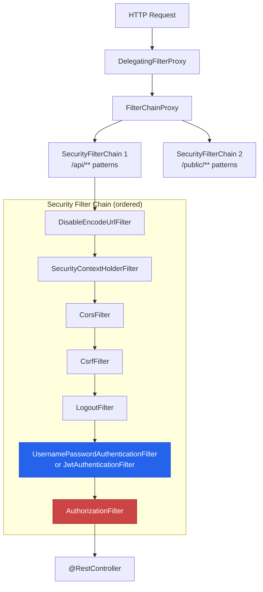

# Spring Security Fundamentals

Spring Security is the most comprehensive security framework in the Java ecosystem. It handles authentication (who are you?), authorization (what can you do?), CSRF protection, CORS, session management, password encoding, and dozens of other concerns. Adding `spring-boot-starter-security` to your project immediately secures every endpoint — which is both a strength and a source of confusion.

This page covers the architecture, filter chain, authentication mechanisms, authorization strategies, and the configuration patterns you need for production REST APIs.

## Security Architecture

Spring Security operates as a chain of servlet filters that intercept every HTTP request before it reaches your controllers:



## Basic Configuration

### Dependencies

```xml
<dependency>
    <groupId>org.springframework.boot</groupId>
    <artifactId>spring-boot-starter-security</artifactId>
</dependency>
<dependency>
    <groupId>org.springframework.security</groupId>
    <artifactId>spring-security-test</artifactId>
    <scope>test</scope>
</dependency>
```

### SecurityFilterChain

Since Spring Security 6.x, configuration is done via `SecurityFilterChain` beans (not extending `WebSecurityConfigurerAdapter`, which is removed):

```java
@Configuration
@EnableWebSecurity
@EnableMethodSecurity  // Enables @PreAuthorize, @PostAuthorize, @Secured
public class SecurityConfig {

    @Bean
    public SecurityFilterChain securityFilterChain(HttpSecurity http) throws Exception {
        http
            // Disable CSRF for stateless REST APIs
            .csrf(csrf -> csrf.disable())

            // CORS configuration
            .cors(cors -> cors.configurationSource(corsConfigurationSource()))

            // Session management: stateless for REST APIs
            .sessionManagement(session ->
                session.sessionCreationPolicy(SessionCreationPolicy.STATELESS))

            // Authorization rules
            .authorizeHttpRequests(auth -> auth
                // Public endpoints
                .requestMatchers("/api/v1/auth/**").permitAll()
                .requestMatchers("/api/v1/public/**").permitAll()
                .requestMatchers("/actuator/health").permitAll()

                // Swagger/OpenAPI
                .requestMatchers("/v3/api-docs/**", "/swagger-ui/**").permitAll()

                // Role-based access
                .requestMatchers(HttpMethod.GET, "/api/v1/products/**").permitAll()
                .requestMatchers(HttpMethod.POST, "/api/v1/products/**").hasRole("ADMIN")
                .requestMatchers(HttpMethod.PUT, "/api/v1/products/**").hasRole("ADMIN")
                .requestMatchers(HttpMethod.DELETE, "/api/v1/products/**").hasRole("ADMIN")

                // Admin endpoints
                .requestMatchers("/api/v1/admin/**").hasRole("ADMIN")

                // Everything else requires authentication
                .anyRequest().authenticated()
            )

            // Exception handling
            .exceptionHandling(ex -> ex
                .authenticationEntryPoint(new HttpStatusEntryPoint(HttpStatus.UNAUTHORIZED))
                .accessDeniedHandler(new CustomAccessDeniedHandler())
            );

        return http.build();
    }

    @Bean
    public CorsConfigurationSource corsConfigurationSource() {
        CorsConfiguration config = new CorsConfiguration();
        config.setAllowedOrigins(List.of(
                "http://localhost:3000",
                "https://myapp.com"
        ));
        config.setAllowedMethods(List.of("GET", "POST", "PUT", "PATCH", "DELETE", "OPTIONS"));
        config.setAllowedHeaders(List.of("*"));
        config.setExposedHeaders(List.of("Authorization", "X-Request-Id"));
        config.setAllowCredentials(true);
        config.setMaxAge(3600L);

        UrlBasedCorsConfigurationSource source = new UrlBasedCorsConfigurationSource();
        source.registerCorsConfiguration("/api/**", config);
        return source;
    }

    @Bean
    public PasswordEncoder passwordEncoder() {
        return new BCryptPasswordEncoder(12); // Cost factor 12
    }
}
```

## Authentication

### UserDetails and UserDetailsService

```java
// Custom UserDetails implementation
@Getter
public class AppUserDetails implements UserDetails {

    private final UUID id;
    private final String email;
    private final String password;
    private final String firstName;
    private final Collection<? extends GrantedAuthority> authorities;
    private final boolean enabled;

    public AppUserDetails(User user) {
        this.id = user.getId();
        this.email = user.getEmail();
        this.password = user.getPasswordHash();
        this.firstName = user.getFirstName();
        this.authorities = user.getRoles().stream()
                .map(role -> new SimpleGrantedAuthority("ROLE_" + role.name()))
                .toList();
        this.enabled = user.isActive();
    }

    @Override
    public String getUsername() { return email; }

    @Override
    public boolean isAccountNonExpired() { return true; }

    @Override
    public boolean isAccountNonLocked() { return true; }

    @Override
    public boolean isCredentialsNonExpired() { return true; }
}
```

```java
@Service
@RequiredArgsConstructor
public class AppUserDetailsService implements UserDetailsService {

    private final UserRepository userRepository;

    @Override
    public UserDetails loadUserByUsername(String email) throws UsernameNotFoundException {
        User user = userRepository.findByEmail(email)
                .orElseThrow(() -> new UsernameNotFoundException(
                        "User not found with email: " + email));
        return new AppUserDetails(user);
    }
}
```

### Authentication Manager

```java
@Configuration
public class AuthenticationConfig {

    @Bean
    public AuthenticationManager authenticationManager(
            AuthenticationConfiguration config) throws Exception {
        return config.getAuthenticationManager();
    }

    @Bean
    public DaoAuthenticationProvider authenticationProvider(
            AppUserDetailsService userDetailsService,
            PasswordEncoder passwordEncoder) {
        DaoAuthenticationProvider provider = new DaoAuthenticationProvider();
        provider.setUserDetailsService(userDetailsService);
        provider.setPasswordEncoder(passwordEncoder);
        return provider;
    }
}
```

### Login/Register Endpoints

```java
@RestController
@RequestMapping("/api/v1/auth")
@RequiredArgsConstructor
public class AuthController {

    private final AuthenticationManager authenticationManager;
    private final UserService userService;
    private final PasswordEncoder passwordEncoder;

    @PostMapping("/register")
    @ResponseStatus(HttpStatus.CREATED)
    public UserResponse register(@Valid @RequestBody RegisterRequest request) {
        return userService.register(request);
    }

    @PostMapping("/login")
    public AuthResponse login(@Valid @RequestBody LoginRequest request) {
        Authentication authentication = authenticationManager.authenticate(
                new UsernamePasswordAuthenticationToken(
                        request.email(), request.password()));

        SecurityContextHolder.getContext().setAuthentication(authentication);
        AppUserDetails user = (AppUserDetails) authentication.getPrincipal();

        // Generate JWT (see jwt-auth page)
        String token = jwtService.generateToken(user);
        return new AuthResponse(token, user.getId(), user.getEmail());
    }
}

// DTOs
public record RegisterRequest(
        @NotBlank @Email String email,
        @NotBlank @Size(min = 8, max = 128) String password,
        @NotBlank String firstName,
        @NotBlank String lastName
) {}

public record LoginRequest(
        @NotBlank @Email String email,
        @NotBlank String password
) {}

public record AuthResponse(
        String accessToken,
        UUID userId,
        String email
) {}
```

## Password Encoding

```java
@Service
@RequiredArgsConstructor
public class UserService {

    private final UserRepository userRepository;
    private final PasswordEncoder passwordEncoder;

    @Transactional
    public UserResponse register(RegisterRequest request) {
        // Check for duplicate email
        if (userRepository.existsByEmailIgnoreCase(request.email())) {
            throw new DuplicateResourceException("User", "email", request.email());
        }

        User user = User.builder()
                .email(request.email().toLowerCase())
                .passwordHash(passwordEncoder.encode(request.password()))
                .firstName(request.firstName())
                .lastName(request.lastName())
                .roles(Set.of(UserRole.USER))
                .active(true)
                .build();

        return UserResponse.from(userRepository.save(user));
    }
}
```

::: warning Never store passwords in plain text
Always use `BCryptPasswordEncoder` or `Argon2PasswordEncoder`. BCrypt with cost factor 10-12 is the minimum. For higher security requirements, use Argon2id. Spring Security's `DelegatingPasswordEncoder` supports multiple encodings for migration:
:::

```java
@Bean
public PasswordEncoder passwordEncoder() {
    // Supports multiple encodings for migration
    return PasswordEncoderFactories.createDelegatingPasswordEncoder();
    // Stored as: {bcrypt}$2a$12$... or {argon2}$argon2id$...
}
```

## Authorization

### URL-Based Authorization

```java
.authorizeHttpRequests(auth -> auth
    // Match by HTTP method + path
    .requestMatchers(HttpMethod.GET, "/api/v1/products/**").permitAll()
    .requestMatchers(HttpMethod.POST, "/api/v1/products").hasRole("ADMIN")

    // Match by path pattern
    .requestMatchers("/api/v1/admin/**").hasRole("ADMIN")
    .requestMatchers("/api/v1/users/me").authenticated()

    // Match by authority (granular permissions)
    .requestMatchers("/api/v1/reports/**").hasAuthority("REPORT_VIEW")

    // Complex authorization with SpEL
    .requestMatchers("/api/v1/internal/**")
        .access(new WebExpressionAuthorizationManager(
            "hasRole('ADMIN') and hasIpAddress('10.0.0.0/8')"))

    .anyRequest().authenticated()
)
```

### Method-Level Security

```java
@Service
@RequiredArgsConstructor
public class OrderService {

    private final OrderRepository orderRepository;

    /**
     * Only admins or the order's owner can view it.
     */
    @PreAuthorize("hasRole('ADMIN') or @orderSecurity.isOwner(#orderId, authentication)")
    public OrderResponse findById(UUID orderId) {
        return orderRepository.findById(orderId)
                .map(OrderResponse::from)
                .orElseThrow(() -> new ResourceNotFoundException("Order", orderId));
    }

    /**
     * Only admins can delete orders.
     */
    @PreAuthorize("hasRole('ADMIN')")
    public void delete(UUID orderId) {
        orderRepository.deleteById(orderId);
    }

    /**
     * Filter results after query — only return user's own orders.
     */
    @PostFilter("filterObject.customerId == authentication.principal.id or hasRole('ADMIN')")
    public List<OrderResponse> findAll() {
        return orderRepository.findAll().stream()
                .map(OrderResponse::from)
                .toList();
    }

    /**
     * Custom security check using a bean.
     */
    @PreAuthorize("@orderSecurity.canCancel(#orderId, authentication)")
    public void cancelOrder(UUID orderId) {
        // ...
    }
}

// Custom security bean
@Component("orderSecurity")
@RequiredArgsConstructor
public class OrderSecurityEvaluator {

    private final OrderRepository orderRepository;

    public boolean isOwner(UUID orderId, Authentication auth) {
        AppUserDetails user = (AppUserDetails) auth.getPrincipal();
        return orderRepository.findById(orderId)
                .map(order -> order.getCustomerId().equals(user.getId()))
                .orElse(false);
    }

    public boolean canCancel(UUID orderId, Authentication auth) {
        AppUserDetails user = (AppUserDetails) auth.getPrincipal();
        return orderRepository.findById(orderId)
                .map(order -> order.getCustomerId().equals(user.getId())
                        && order.getStatus() == OrderStatus.PENDING)
                .orElse(false);
    }
}
```

## CSRF Protection

::: tip When to disable CSRF
CSRF protection is essential for session-based authentication (cookies). For stateless REST APIs using JWT bearer tokens, CSRF is not necessary because the browser does not automatically attach JWTs to requests. Disable CSRF for REST APIs, enable it for server-rendered HTML applications.
:::

```java
// For REST APIs with JWT: disable CSRF
.csrf(csrf -> csrf.disable())

// For web apps with sessions: configure CSRF
.csrf(csrf -> csrf
    .csrfTokenRepository(CookieCsrfTokenRepository.withHttpOnlyFalse())
    .csrfTokenRequestHandler(new CsrfTokenRequestAttributeHandler())
    .ignoringRequestMatchers("/api/webhooks/**")  // Webhooks from external services
)
```

## Custom Access Denied Handler

```java
@Component
@Slf4j
public class CustomAccessDeniedHandler implements AccessDeniedHandler {

    @Override
    public void handle(HttpServletRequest request,
                       HttpServletResponse response,
                       AccessDeniedException ex) throws IOException {

        log.warn("Access denied: {} {} — User: {}, IP: {}",
                request.getMethod(), request.getRequestURI(),
                getCurrentUsername(), request.getRemoteAddr());

        response.setContentType(MediaType.APPLICATION_PROBLEM_JSON_VALUE);
        response.setStatus(HttpStatus.FORBIDDEN.value());

        ProblemDetail problem = ProblemDetail.forStatusAndDetail(
                HttpStatus.FORBIDDEN,
                "You do not have permission to access this resource");
        problem.setTitle("Access Denied");
        problem.setProperty("errorCode", "ACCESS_DENIED");

        ObjectMapper mapper = new ObjectMapper();
        mapper.registerModule(new JavaTimeModule());
        mapper.writeValue(response.getOutputStream(), problem);
    }

    private String getCurrentUsername() {
        Authentication auth = SecurityContextHolder.getContext().getAuthentication();
        return auth != null ? auth.getName() : "anonymous";
    }
}
```

## Accessing the Current User

```java
@RestController
@RequestMapping("/api/v1/users")
public class UserController {

    /**
     * Method 1: @AuthenticationPrincipal
     */
    @GetMapping("/me")
    public UserResponse getCurrentUser(
            @AuthenticationPrincipal AppUserDetails user) {
        return userService.findById(user.getId());
    }

    /**
     * Method 2: SecurityContextHolder (works anywhere, not just controllers)
     */
    public static AppUserDetails getCurrentUserDetails() {
        Authentication auth = SecurityContextHolder.getContext().getAuthentication();
        if (auth == null || !auth.isAuthenticated()) {
            throw new AuthenticationCredentialsNotFoundException("Not authenticated");
        }
        return (AppUserDetails) auth.getPrincipal();
    }

    /**
     * Method 3: Custom annotation (cleanest)
     */
    @GetMapping("/me/orders")
    public List<OrderResponse> myOrders(@CurrentUser AppUserDetails user) {
        return orderService.findByCustomerId(user.getId());
    }
}

// Custom @CurrentUser annotation
@Target(ElementType.PARAMETER)
@Retention(RetentionPolicy.RUNTIME)
@AuthenticationPrincipal
public @interface CurrentUser {}
```

## Security Headers

```java
@Bean
public SecurityFilterChain securityFilterChain(HttpSecurity http) throws Exception {
    http
        .headers(headers -> headers
            // Content Security Policy
            .contentSecurityPolicy(csp -> csp
                .policyDirectives("default-src 'self'; script-src 'self'; style-src 'self'"))
            // Prevent MIME type sniffing
            .contentTypeOptions(Customizer.withDefaults())
            // XSS Protection
            .xssProtection(xss -> xss.headerValue(
                XXssProtectionHeaderWriter.HeaderValue.ENABLED_MODE_BLOCK))
            // Frame options
            .frameOptions(frame -> frame.deny())
            // HSTS
            .httpStrictTransportSecurity(hsts -> hsts
                .maxAgeInSeconds(31536000)
                .includeSubDomains(true))
            // Referrer Policy
            .referrerPolicy(referrer -> referrer
                .policy(ReferrerPolicyHeaderWriter.ReferrerPolicy.STRICT_ORIGIN_WHEN_CROSS_ORIGIN))
            // Permissions Policy
            .permissionsPolicy(permissions -> permissions
                .policy("camera=(), microphone=(), geolocation=()"))
        );

    return http.build();
}
```

## Testing Security

```java
@WebMvcTest(ProductController.class)
@Import(SecurityConfig.class)
class ProductControllerSecurityTest {

    @Autowired
    private MockMvc mockMvc;

    @MockBean
    private ProductService productService;

    @Test
    void getProducts_Unauthenticated_Returns200() throws Exception {
        // GET endpoints are public
        mockMvc.perform(get("/api/v1/products"))
                .andExpect(status().isOk());
    }

    @Test
    void createProduct_Unauthenticated_Returns401() throws Exception {
        mockMvc.perform(post("/api/v1/products")
                        .contentType(MediaType.APPLICATION_JSON)
                        .content("{}"))
                .andExpect(status().isUnauthorized());
    }

    @Test
    @WithMockUser(roles = "USER")
    void createProduct_UserRole_Returns403() throws Exception {
        mockMvc.perform(post("/api/v1/products")
                        .contentType(MediaType.APPLICATION_JSON)
                        .content("{}"))
                .andExpect(status().isForbidden());
    }

    @Test
    @WithMockUser(roles = "ADMIN")
    void createProduct_AdminRole_Returns201() throws Exception {
        String body = """
                {"name": "Widget", "price": 9.99, "sku": "WDG-001",
                 "category": "ELECTRONICS", "stockQuantity": 100}
                """;

        given(productService.create(any())).willReturn(mockProductResponse());

        mockMvc.perform(post("/api/v1/products")
                        .contentType(MediaType.APPLICATION_JSON)
                        .content(body))
                .andExpect(status().isCreated());
    }

    @Test
    @WithUserDetails(value = "admin@test.com",
            userDetailsServiceBeanName = "appUserDetailsService")
    void adminEndpoint_WithRealUser_Returns200() throws Exception {
        mockMvc.perform(get("/api/v1/admin/dashboard"))
                .andExpect(status().isOk());
    }
}
```

## Further Reading

- **[JWT Authentication](./jwt-auth)** — Complete JWT implementation with refresh tokens
- **[OAuth2 & OIDC](./oauth2-oidc)** — OAuth2, Keycloak, social login
- **[Testing](./testing)** — Security testing patterns
- **[REST API Development](./rest-api)** — Securing REST endpoints

## Common Pitfalls

::: danger Pitfall 1: Disabling CSRF for session-based applications
Disabling CSRF is correct for stateless JWT APIs but dangerous for applications using session cookies. Browsers automatically attach cookies, making session-based apps vulnerable to cross-site request forgery.
**Fix:** Only disable CSRF for stateless APIs using bearer tokens. For session-based apps, configure `CookieCsrfTokenRepository.withHttpOnlyFalse()`.
:::

::: danger Pitfall 2: Using permitAll() too broadly
Overly broad permit rules like `.requestMatchers("/api/**").permitAll()` accidentally expose endpoints that should require authentication.
**Fix:** Be explicit with permit rules. List each public endpoint individually. Use `.anyRequest().authenticated()` as the final catch-all to deny unauthenticated access by default.
:::

::: danger Pitfall 3: Storing passwords with weak encoding
Using MD5, SHA-1, or no encoding for passwords is trivially crackable with rainbow tables or brute force.
**Fix:** Use `BCryptPasswordEncoder` with cost factor 10-12, or `Argon2PasswordEncoder` for higher security. Use `DelegatingPasswordEncoder` for migrating from older encodings.
:::

::: danger Pitfall 4: Not returning proper 401/403 responses for APIs
Without custom entry points and access denied handlers, Spring Security redirects API requests to a login page or returns HTML, breaking API clients.
**Fix:** Configure `authenticationEntryPoint` to return JSON 401 responses and `accessDeniedHandler` to return JSON 403 responses for REST APIs.
:::

::: danger Pitfall 5: Forgetting to secure Actuator endpoints
Spring Boot Actuator exposes sensitive information (environment variables, configuration, heap dumps) that can be exploited if left unprotected.
**Fix:** Restrict Actuator endpoints: allow `/actuator/health` publicly for load balancers, require `ADMIN` role for all other actuator endpoints, and disable unnecessary endpoints in production.
:::

::: danger Pitfall 6: Using the deprecated WebSecurityConfigurerAdapter
Extending `WebSecurityConfigurerAdapter` was removed in Spring Security 6.x. Code using it fails with Spring Boot 3.x.
**Fix:** Define `SecurityFilterChain` as a `@Bean` method in a `@Configuration` class. Use the `HttpSecurity` lambda DSL for configuration.
:::

## Interview Questions

**Q1: How does the Spring Security filter chain work?**
::: details Answer
Spring Security operates as a chain of servlet filters intercepting every HTTP request before it reaches controllers. The `DelegatingFilterProxy` delegates to `FilterChainProxy`, which holds one or more `SecurityFilterChain` instances. Each chain contains ordered filters: `SecurityContextHolderFilter` (loads security context), `CorsFilter`, `CsrfFilter`, `LogoutFilter`, authentication filters (e.g., `UsernamePasswordAuthenticationFilter` or a custom JWT filter), and `AuthorizationFilter` (checks access rules). The request passes through each filter in order; any filter can short-circuit the chain by rejecting the request.
:::

**Q2: What is the difference between authentication and authorization in Spring Security?**
::: details Answer
Authentication verifies identity -- "who are you?" It is handled by `AuthenticationManager` and `AuthenticationProvider`, which validate credentials (username/password, JWT, OAuth2 token) and produce an `Authentication` object stored in `SecurityContextHolder`. Authorization verifies permissions -- "what can you do?" It is handled by `AuthorizationManager` and checked via URL-based rules (`.requestMatchers().hasRole()`) or method-level annotations (`@PreAuthorize`, `@PostAuthorize`). Authentication happens first; authorization happens only after successful authentication.
:::

**Q3: How does `@PreAuthorize` work and what can you do with SpEL expressions?**
::: details Answer
`@PreAuthorize` evaluates a SpEL expression before the method executes. If the expression returns `false`, access is denied with a 403 response. You can check roles (`hasRole('ADMIN')`), authorities (`hasAuthority('REPORT_VIEW')`), reference method arguments (`#userId == authentication.principal.id`), call bean methods (`@orderSecurity.isOwner(#orderId, authentication)`), and combine conditions with `and`/`or`. Enable it with `@EnableMethodSecurity` on your configuration class. `@PostAuthorize` evaluates after method execution and can reference the return value with `returnObject`.
:::

**Q4: How do you implement CORS in Spring Security?**
::: details Answer
Configure CORS in the `SecurityFilterChain` with `.cors(cors -> cors.configurationSource(corsConfigurationSource()))`. Define a `CorsConfigurationSource` bean that specifies allowed origins, methods, headers, exposed headers, credentials policy, and max age. Apply it to specific URL patterns. The CORS filter must run before the security filter chain, which Spring Security handles automatically when configured this way. For per-controller CORS, use `@CrossOrigin` on controller classes or methods, but the security-level configuration takes precedence.
:::

**Q5: What is the purpose of `SecurityContextHolder` and how does it work across threads?**
::: details Answer
`SecurityContextHolder` stores the `SecurityContext` (which contains the `Authentication` object) for the current thread using a `ThreadLocal` strategy by default. After a user authenticates, the authentication is set via `SecurityContextHolder.getContext().setAuthentication(auth)`. Any code on the same thread can access the current user with `SecurityContextHolder.getContext().getAuthentication()`. For async processing, the default `ThreadLocal` strategy loses context. Use `SecurityContextHolder.setStrategyName(SecurityContextHolder.MODE_INHERITABLETHREADLOCAL)` or manually propagate the context with `DelegatingSecurityContextExecutorService`.
:::
