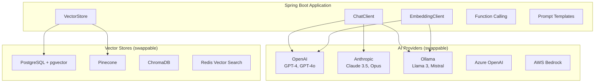
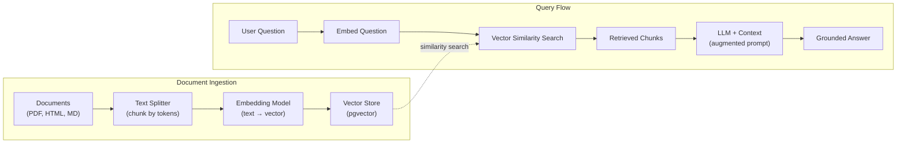

# Spring AI

Spring AI brings the Spring philosophy — portable abstractions, auto-configuration, and convention over configuration — to AI/ML integration. Instead of writing provider-specific code for OpenAI, Anthropic, Ollama, or Azure OpenAI, you program against a unified API. Swap providers by changing a dependency and a property — your code stays the same.

This page covers the complete Spring AI stack: ChatClient for conversations, embedding models for semantic search, Retrieval-Augmented Generation (RAG) with vector stores, function calling for tool use, and prompt engineering patterns.

## Architecture



## Dependencies

```xml
<!-- pom.xml — Spring AI BOM -->
<dependencyManagement>
    <dependencies>
        <dependency>
            <groupId>org.springframework.ai</groupId>
            <artifactId>spring-ai-bom</artifactId>
            <version>1.0.0</version>
            <type>pom</type>
            <scope>import</scope>
        </dependency>
    </dependencies>
</dependencyManagement>

<dependencies>
    <!-- Pick ONE chat model provider: -->

    <!-- OpenAI -->
    <dependency>
        <groupId>org.springframework.ai</groupId>
        <artifactId>spring-ai-openai-spring-boot-starter</artifactId>
    </dependency>

    <!-- OR Anthropic -->
    <dependency>
        <groupId>org.springframework.ai</groupId>
        <artifactId>spring-ai-anthropic-spring-boot-starter</artifactId>
    </dependency>

    <!-- OR Ollama (local models) -->
    <dependency>
        <groupId>org.springframework.ai</groupId>
        <artifactId>spring-ai-ollama-spring-boot-starter</artifactId>
    </dependency>

    <!-- Vector store: pgvector -->
    <dependency>
        <groupId>org.springframework.ai</groupId>
        <artifactId>spring-ai-pgvector-store-spring-boot-starter</artifactId>
    </dependency>
</dependencies>

<repositories>
    <repository>
        <id>spring-milestones</id>
        <url>https://repo.spring.io/milestone</url>
    </repository>
</repositories>
```

## Configuration

```yaml
# application.yml
spring:
  ai:
    openai:
      api-key: ${OPENAI_API_KEY}
      chat:
        options:
          model: gpt-4o
          temperature: 0.7
          max-tokens: 4096
      embedding:
        options:
          model: text-embedding-3-small

    # OR Anthropic config:
    # anthropic:
    #   api-key: ${ANTHROPIC_API_KEY}
    #   chat:
    #     options:
    #       model: claude-sonnet-4-20250514
    #       max-tokens: 4096

    # OR Ollama config:
    # ollama:
    #   base-url: http://localhost:11434
    #   chat:
    #     options:
    #       model: llama3
    #   embedding:
    #     options:
    #       model: nomic-embed-text

    vectorstore:
      pgvector:
        dimensions: 1536
        distance-type: COSINE_DISTANCE
        index-type: HNSW
```

## ChatClient

The `ChatClient` is the primary interface for interacting with LLMs:

```java
@Service
@RequiredArgsConstructor
@Slf4j
public class AIChatService {

    private final ChatClient.Builder chatClientBuilder;

    /**
     * Simple chat completion.
     */
    public String chat(String userMessage) {
        return chatClientBuilder.build()
                .prompt()
                .user(userMessage)
                .call()
                .content();
    }

    /**
     * Chat with system prompt and structured parameters.
     */
    public String chatWithContext(String userMessage, String context) {
        return chatClientBuilder.build()
                .prompt()
                .system(s -> s.text("""
                        You are a helpful customer support assistant for an e-commerce store.
                        Be concise, professional, and helpful.
                        If you don't know the answer, say so honestly.

                        Context about the customer:
                        {context}
                        """)
                        .param("context", context))
                .user(userMessage)
                .call()
                .content();
    }

    /**
     * Structured output: parse LLM response into a Java object.
     */
    public ProductRecommendation getRecommendation(String userPreferences) {
        return chatClientBuilder.build()
                .prompt()
                .system("""
                        You are a product recommendation engine.
                        Analyze the user's preferences and return a structured recommendation.
                        """)
                .user(userPreferences)
                .call()
                .entity(ProductRecommendation.class);
    }

    /**
     * Streaming response for real-time UX.
     */
    public Flux<String> chatStream(String userMessage) {
        return chatClientBuilder.build()
                .prompt()
                .user(userMessage)
                .stream()
                .content();
    }
}

// Structured output DTO
public record ProductRecommendation(
        String productName,
        String category,
        String reason,
        double confidenceScore,
        List<String> alternatives
) {}
```

### Streaming Chat Endpoint

```java
@RestController
@RequestMapping("/api/v1/ai")
@RequiredArgsConstructor
public class AIChatController {

    private final AIChatService chatService;

    @GetMapping(value = "/chat/stream", produces = MediaType.TEXT_EVENT_STREAM_VALUE)
    public Flux<ServerSentEvent<String>> streamChat(
            @RequestParam String message) {

        return chatService.chatStream(message)
                .map(chunk -> ServerSentEvent.<String>builder()
                        .data(chunk)
                        .build())
                .concatWith(Flux.just(
                        ServerSentEvent.<String>builder()
                                .event("done")
                                .data("[DONE]")
                                .build()));
    }

    @PostMapping("/chat")
    public ChatResponse chat(@Valid @RequestBody ChatRequest request) {
        String response = chatService.chat(request.message());
        return new ChatResponse(response);
    }
}
```

## Prompt Templates

```java
@Service
@RequiredArgsConstructor
public class PromptService {

    private final ChatClient.Builder chatClientBuilder;

    /**
     * Reusable prompt template with variables.
     */
    public String summarizeDocument(String document, String language, int maxSentences) {
        PromptTemplate template = new PromptTemplate("""
                Summarize the following document in {language}.
                Keep the summary to {maxSentences} sentences or fewer.
                Focus on the key points and actionable items.

                Document:
                ---
                {document}
                ---

                Summary:
                """);

        Prompt prompt = template.create(Map.of(
                "document", document,
                "language", language,
                "maxSentences", String.valueOf(maxSentences)
        ));

        return chatClientBuilder.build()
                .prompt(prompt)
                .call()
                .content();
    }

    /**
     * Template loaded from classpath resource.
     */
    public String analyzeCode(String code, String language) {
        PromptTemplate template = new PromptTemplate(
                new ClassPathResource("prompts/code-review.st"));

        Prompt prompt = template.create(Map.of(
                "code", code,
                "language", language
        ));

        return chatClientBuilder.build()
                .prompt(prompt)
                .call()
                .content();
    }
}
```

```
# src/main/resources/prompts/code-review.st
You are a senior {language} developer performing a code review.

Analyze the following code and provide:
1. A brief description of what the code does
2. Potential bugs or issues
3. Performance concerns
4. Suggestions for improvement

Code:
```{language}
{code}
```

Review:
```

## RAG (Retrieval-Augmented Generation)

RAG grounds LLM responses in your own data. The flow: embed documents into vectors, store in a vector database, retrieve relevant chunks at query time, and include them in the prompt.



### Document Ingestion Pipeline

```java
@Service
@RequiredArgsConstructor
@Slf4j
public class DocumentIngestionService {

    private final VectorStore vectorStore;
    private final EmbeddingModel embeddingModel;

    /**
     * Ingest a document: read, split into chunks, embed, store.
     */
    public void ingestDocument(Resource resource, Map<String, Object> metadata) {
        // 1. Read document
        DocumentReader reader = switch (getExtension(resource)) {
            case "pdf" -> new PagePdfDocumentReader(resource);
            case "html" -> new JsoupDocumentReader(resource);
            default -> new TextReader(resource);
        };

        List<Document> documents = reader.read();
        log.info("Read {} pages/sections from {}", documents.size(),
                resource.getFilename());

        // 2. Split into chunks
        TokenTextSplitter splitter = new TokenTextSplitter(
                800,    // chunk size (tokens)
                200,    // overlap (tokens)
                5,      // min chunk size
                10000,  // max chunk size
                true    // keep separator
        );

        List<Document> chunks = splitter.apply(documents);
        log.info("Split into {} chunks", chunks.size());

        // 3. Add metadata to each chunk
        chunks.forEach(chunk -> {
            chunk.getMetadata().putAll(metadata);
            chunk.getMetadata().put("source", resource.getFilename());
            chunk.getMetadata().put("ingestedAt", Instant.now().toString());
        });

        // 4. Embed and store (vectorStore handles embedding)
        vectorStore.add(chunks);
        log.info("Ingested {} chunks from {}", chunks.size(),
                resource.getFilename());
    }

    /**
     * Bulk ingest a directory of documents.
     */
    public void ingestDirectory(Path directory) {
        try (Stream<Path> paths = Files.walk(directory)) {
            paths.filter(Files::isRegularFile)
                    .filter(p -> p.toString().matches(".*\\.(pdf|md|html|txt)$"))
                    .forEach(path -> {
                        try {
                            ingestDocument(
                                    new FileSystemResource(path),
                                    Map.of("directory", directory.toString()));
                        } catch (Exception e) {
                            log.error("Failed to ingest {}: {}", path, e.getMessage());
                        }
                    });
        } catch (IOException e) {
            throw new UncheckedIOException(e);
        }
    }

    private String getExtension(Resource resource) {
        String filename = resource.getFilename();
        return filename != null ? filename.substring(filename.lastIndexOf('.') + 1) : "";
    }
}
```

### RAG Query Service

```java
@Service
@RequiredArgsConstructor
@Slf4j
public class RagService {

    private final ChatClient.Builder chatClientBuilder;
    private final VectorStore vectorStore;

    /**
     * Answer a question using RAG: retrieve context from vector store,
     * then generate answer with LLM.
     */
    public RagResponse askQuestion(String question) {
        // 1. Search for relevant documents
        SearchRequest searchRequest = SearchRequest.builder()
                .query(question)
                .topK(5)                              // Top 5 most similar chunks
                .similarityThreshold(0.7)             // Min similarity score
                .build();

        List<Document> relevantDocs = vectorStore.similaritySearch(searchRequest);
        log.info("Found {} relevant documents for query", relevantDocs.size());

        if (relevantDocs.isEmpty()) {
            return new RagResponse(
                    "I don't have enough information to answer that question.",
                    List.of(), 0.0);
        }

        // 2. Build context from retrieved documents
        String context = relevantDocs.stream()
                .map(Document::getContent)
                .collect(Collectors.joining("\n\n---\n\n"));

        // 3. Generate answer with context
        String answer = chatClientBuilder.build()
                .prompt()
                .system("""
                        You are a knowledgeable assistant. Answer the user's question
                        based ONLY on the provided context. If the context doesn't contain
                        enough information, say so clearly. Do not make up information.

                        Context:
                        {context}
                        """)
                .user(question)
                .call()
                .content();

        List<SourceReference> sources = relevantDocs.stream()
                .map(doc -> new SourceReference(
                        (String) doc.getMetadata().get("source"),
                        doc.getContent().substring(0, Math.min(200, doc.getContent().length()))
                ))
                .toList();

        return new RagResponse(answer, sources,
                relevantDocs.getFirst().getMetadata()
                        .getOrDefault("distance", 0.0) instanceof Number n
                        ? n.doubleValue() : 0.0);
    }

    /**
     * Using Spring AI's built-in RAG advisor.
     */
    public String askWithAdvisor(String question) {
        return chatClientBuilder.build()
                .prompt()
                .advisors(new QuestionAnswerAdvisor(vectorStore,
                        SearchRequest.builder().topK(5).build()))
                .user(question)
                .call()
                .content();
    }
}

public record RagResponse(
        String answer,
        List<SourceReference> sources,
        double relevanceScore
) {}

public record SourceReference(
        String document,
        String excerpt
) {}
```

## Function Calling

Function calling lets the LLM invoke your Java methods to get real-time data or perform actions:

```java
@Configuration
public class AIFunctionConfig {

    @Bean
    @Description("Get current weather for a given city")
    public Function<WeatherRequest, WeatherResponse> getWeather() {
        return request -> {
            // Call a real weather API
            return weatherClient.getCurrentWeather(request.city());
        };
    }

    @Bean
    @Description("Search products by name, category, or price range")
    public Function<ProductSearchRequest, List<ProductSummary>> searchProducts(
            ProductService productService) {
        return request -> productService.search(
                request.query(), request.category(),
                request.minPrice(), request.maxPrice());
    }

    @Bean
    @Description("Place an order for a product")
    public Function<PlaceOrderRequest, OrderConfirmation> placeOrder(
            OrderService orderService) {
        return request -> orderService.placeOrderFromAI(
                request.productId(), request.quantity());
    }
}

// Function parameter DTOs
public record WeatherRequest(String city) {}
public record WeatherResponse(String city, double temperature,
                                String conditions, String unit) {}

public record ProductSearchRequest(
        String query,
        String category,
        BigDecimal minPrice,
        BigDecimal maxPrice
) {}
```

```java
@Service
public class AIAssistantService {

    private final ChatClient.Builder chatClientBuilder;

    /**
     * Chat with function calling — LLM can invoke your Java functions.
     */
    public String assistWithFunctions(String userMessage) {
        return chatClientBuilder.build()
                .prompt()
                .system("""
                        You are a helpful shopping assistant.
                        You can search products, check weather, and place orders.
                        Always confirm with the user before placing an order.
                        """)
                .user(userMessage)
                .functions("getWeather", "searchProducts", "placeOrder")
                .call()
                .content();
    }
}
```

## Multi-Provider Support

```java
@Configuration
public class MultiProviderConfig {

    @Bean("openaiChatClient")
    public ChatClient openaiChatClient(
            @Qualifier("openAiChatModel") ChatModel openai) {
        return ChatClient.builder(openai).build();
    }

    @Bean("anthropicChatClient")
    public ChatClient anthropicChatClient(
            @Qualifier("anthropicChatModel") ChatModel anthropic) {
        return ChatClient.builder(anthropic).build();
    }

    @Bean("ollamaChatClient")
    public ChatClient ollamaChatClient(
            @Qualifier("ollamaChatModel") ChatModel ollama) {
        return ChatClient.builder(ollama).build();
    }
}

@Service
public class AIRouterService {

    private final Map<String, ChatClient> providers;

    public AIRouterService(
            @Qualifier("openaiChatClient") ChatClient openai,
            @Qualifier("anthropicChatClient") ChatClient anthropic,
            @Qualifier("ollamaChatClient") ChatClient ollama) {
        this.providers = Map.of(
                "openai", openai,
                "anthropic", anthropic,
                "ollama", ollama
        );
    }

    public String chat(String provider, String message) {
        ChatClient client = providers.getOrDefault(provider,
                providers.get("openai"));
        return client.prompt()
                .user(message)
                .call()
                .content();
    }
}
```

## Further Reading

- **[REST API Development](./rest-api)** — Exposing AI features via REST
- **[Async & Scheduling](./async)** — Async LLM calls and batch processing
- **[Caching](./caching)** — Caching LLM responses for cost savings
- **[Docker & Deployment](./docker)** — Deploying Ollama and vector stores
