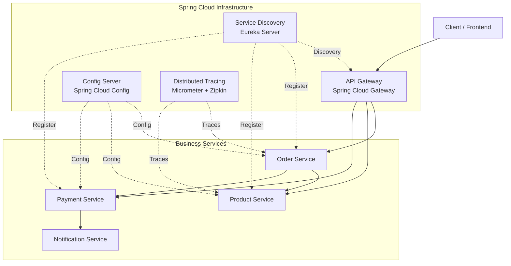
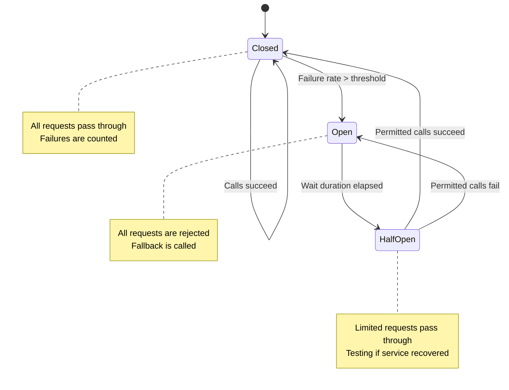

# Spring Cloud Essentials

Spring Cloud provides the infrastructure patterns needed to build distributed systems: service discovery, externalized configuration, circuit breakers, API gateways, and distributed tracing. These are not optional nice-to-haves — they are the mandatory plumbing that keeps microservices from collapsing into a distributed monolith where every service call is a potential failure point.

This page covers the five essential Spring Cloud patterns with complete, runnable examples.

## Microservices Architecture Overview



## 1. Config Server

Centralized configuration management for all microservices. One server, one Git repo, all services pull their config at startup.

### Config Server Application

```xml
<!-- config-server/pom.xml -->
<dependency>
    <groupId>org.springframework.cloud</groupId>
    <artifactId>spring-cloud-config-server</artifactId>
</dependency>
```

```java
@SpringBootApplication
@EnableConfigServer
public class ConfigServerApplication {
    public static void main(String[] args) {
        SpringApplication.run(ConfigServerApplication.class, args);
    }
}
```

```yaml
# config-server/application.yml
server:
  port: 8888

spring:
  cloud:
    config:
      server:
        git:
          uri: https://github.com/myorg/config-repo
          default-label: main
          search-paths: '{application}'
          clone-on-start: true
          timeout: 10

        # Encrypt sensitive values
        encrypt:
          enabled: true

encrypt:
  key: ${CONFIG_ENCRYPT_KEY}
```

### Config Repository Structure

```
config-repo/
├── application.yml              # Shared across all services
├── order-service/
│   ├── application.yml          # Order service defaults
│   ├── application-dev.yml      # Order service dev profile
│   └── application-prod.yml     # Order service prod profile
├── product-service/
│   ├── application.yml
│   └── application-prod.yml
└── payment-service/
    ├── application.yml
    └── application-prod.yml
```

### Config Client

```xml
<!-- order-service/pom.xml -->
<dependency>
    <groupId>org.springframework.cloud</groupId>
    <artifactId>spring-cloud-starter-config</artifactId>
</dependency>
```

```yaml
# order-service/application.yml
spring:
  application:
    name: order-service
  config:
    import: "configserver:http://localhost:8888"
  cloud:
    config:
      fail-fast: true       # Fail at startup if config server unavailable
      retry:
        max-attempts: 5
        initial-interval: 1000
```

### Runtime Config Refresh

```java
@RestController
@RefreshScope  // Re-injects @Value properties on /actuator/refresh
@RequestMapping("/api/v1/features")
public class FeatureController {

    @Value("${app.feature.new-checkout:false}")
    private boolean newCheckoutEnabled;

    @GetMapping("/new-checkout")
    public Map<String, Boolean> checkFeature() {
        return Map.of("newCheckoutEnabled", newCheckoutEnabled);
    }
}
```

```bash
# Trigger refresh for a single service
curl -X POST http://order-service:8080/actuator/refresh

# Or use Spring Cloud Bus for broadcast refresh
curl -X POST http://order-service:8080/actuator/busrefresh
```

## 2. Service Discovery with Eureka

### Eureka Server

```xml
<!-- eureka-server/pom.xml -->
<dependency>
    <groupId>org.springframework.cloud</groupId>
    <artifactId>spring-cloud-starter-netflix-eureka-server</artifactId>
</dependency>
```

```java
@SpringBootApplication
@EnableEurekaServer
public class EurekaServerApplication {
    public static void main(String[] args) {
        SpringApplication.run(EurekaServerApplication.class, args);
    }
}
```

```yaml
# eureka-server/application.yml
server:
  port: 8761

eureka:
  instance:
    hostname: localhost
  client:
    register-with-eureka: false    # Don't register itself
    fetch-registry: false          # Don't fetch registry
  server:
    enable-self-preservation: false  # Disable in dev, enable in prod
    eviction-interval-timer-in-ms: 5000
```

### Eureka Client (Service Registration)

```xml
<!-- order-service/pom.xml -->
<dependency>
    <groupId>org.springframework.cloud</groupId>
    <artifactId>spring-cloud-starter-netflix-eureka-client</artifactId>
</dependency>
```

```yaml
# order-service/application.yml
eureka:
  client:
    service-url:
      defaultZone: http://localhost:8761/eureka/
    registry-fetch-interval-seconds: 5
  instance:
    prefer-ip-address: true
    lease-renewal-interval-in-seconds: 10
    lease-expiration-duration-in-seconds: 30
    metadata-map:
      version: ${app.version:1.0.0}
```

### Service-to-Service Communication

```java
@Configuration
public class RestClientConfig {

    @Bean
    @LoadBalanced  // Enables client-side load balancing via Eureka
    public RestClient.Builder loadBalancedRestClientBuilder() {
        return RestClient.builder();
    }
}

@Service
@RequiredArgsConstructor
@Slf4j
public class ProductServiceClient {

    private final RestClient.Builder restClientBuilder;

    /**
     * Calls product-service using the Eureka service name.
     * Spring Cloud LoadBalancer resolves "product-service" to an actual host:port.
     */
    public ProductResponse getProduct(UUID productId) {
        RestClient client = restClientBuilder
                .baseUrl("http://product-service")  // Eureka service name
                .build();

        return client.get()
                .uri("/api/v1/products/{id}", productId)
                .retrieve()
                .body(ProductResponse.class);
    }

    public List<ProductResponse> getProducts(List<UUID> productIds) {
        RestClient client = restClientBuilder
                .baseUrl("http://product-service")
                .build();

        String ids = productIds.stream()
                .map(UUID::toString)
                .collect(Collectors.joining(","));

        return client.get()
                .uri("/api/v1/products?ids={ids}", ids)
                .retrieve()
                .body(new ParameterizedTypeReference<>() {});
    }
}
```

## 3. API Gateway

Spring Cloud Gateway is the recommended API gateway. It provides routing, rate limiting, circuit breaking, and request/response transformation.

```xml
<!-- gateway/pom.xml -->
<dependency>
    <groupId>org.springframework.cloud</groupId>
    <artifactId>spring-cloud-starter-gateway</artifactId>
</dependency>
<dependency>
    <groupId>org.springframework.cloud</groupId>
    <artifactId>spring-cloud-starter-netflix-eureka-client</artifactId>
</dependency>
```

```yaml
# gateway/application.yml
server:
  port: 8080

spring:
  cloud:
    gateway:
      routes:
        # Order Service
        - id: order-service
          uri: lb://order-service       # lb:// = load-balanced via Eureka
          predicates:
            - Path=/api/v1/orders/**
          filters:
            - StripPrefix=0
            - name: CircuitBreaker
              args:
                name: orderService
                fallbackUri: forward:/fallback/orders
            - name: RequestRateLimiter
              args:
                redis-rate-limiter:
                  replenishRate: 100
                  burstCapacity: 200
                  requestedTokens: 1

        # Product Service
        - id: product-service
          uri: lb://product-service
          predicates:
            - Path=/api/v1/products/**
          filters:
            - StripPrefix=0
            - AddRequestHeader=X-Gateway-Source, spring-cloud-gateway

        # Payment Service (restricted)
        - id: payment-service
          uri: lb://payment-service
          predicates:
            - Path=/api/v1/payments/**
            - Header=Authorization, Bearer (.*)
          filters:
            - StripPrefix=0

      # Global filters
      default-filters:
        - DedupeResponseHeader=Access-Control-Allow-Origin
        - AddResponseHeader=X-Response-Time, %{T}

      # CORS
      globalcors:
        cors-configurations:
          '[/**]':
            allowedOrigins: "http://localhost:3000"
            allowedMethods: "*"
            allowedHeaders: "*"
            maxAge: 3600
```

### Custom Gateway Filter

```java
@Component
@Slf4j
public class RequestLoggingGatewayFilter implements GlobalFilter, Ordered {

    @Override
    public Mono<Void> filter(ServerWebExchange exchange, GatewayFilterChain chain) {
        ServerHttpRequest request = exchange.getRequest();
        String requestId = UUID.randomUUID().toString().substring(0, 8);

        log.info("Gateway >>> {} {} [{}]",
                request.getMethod(), request.getURI().getPath(), requestId);

        long startTime = System.currentTimeMillis();

        // Add request ID header for distributed tracing
        ServerHttpRequest mutatedRequest = request.mutate()
                .header("X-Request-Id", requestId)
                .build();

        return chain.filter(exchange.mutate().request(mutatedRequest).build())
                .then(Mono.fromRunnable(() -> {
                    long duration = System.currentTimeMillis() - startTime;
                    log.info("Gateway <<< {} {} — {} in {}ms",
                            request.getMethod(), request.getURI().getPath(),
                            exchange.getResponse().getStatusCode(), duration);
                }));
    }

    @Override
    public int getOrder() {
        return -1; // Run before other filters
    }
}
```

### Fallback Controller

```java
@RestController
@RequestMapping("/fallback")
public class FallbackController {

    @RequestMapping("/orders")
    public ResponseEntity<Map<String, String>> ordersFallback() {
        return ResponseEntity.status(HttpStatus.SERVICE_UNAVAILABLE)
                .body(Map.of(
                        "error", "SERVICE_UNAVAILABLE",
                        "message", "Order service is temporarily unavailable. Please try again.",
                        "timestamp", Instant.now().toString()
                ));
    }
}
```

## 4. Circuit Breaker with Resilience4j

```xml
<!-- order-service/pom.xml -->
<dependency>
    <groupId>org.springframework.cloud</groupId>
    <artifactId>spring-cloud-starter-circuitbreaker-resilience4j</artifactId>
</dependency>
```

```yaml
# order-service/application.yml
resilience4j:
  circuitbreaker:
    instances:
      productService:
        sliding-window-size: 10
        minimum-number-of-calls: 5
        failure-rate-threshold: 50         # Open at 50% failure rate
        wait-duration-in-open-state: 30s   # Stay open for 30s
        permitted-number-of-calls-in-half-open-state: 3
        slow-call-duration-threshold: 2s
        slow-call-rate-threshold: 80
        record-exceptions:
          - java.io.IOException
          - java.util.concurrent.TimeoutException
          - org.springframework.web.client.HttpServerErrorException

  retry:
    instances:
      productService:
        max-attempts: 3
        wait-duration: 500ms
        exponential-backoff-multiplier: 2
        retry-exceptions:
          - java.io.IOException

  timelimiter:
    instances:
      productService:
        timeout-duration: 3s

  bulkhead:
    instances:
      productService:
        max-concurrent-calls: 25
```

```java
@Service
@RequiredArgsConstructor
@Slf4j
public class ProductServiceClient {

    private final RestClient.Builder restClientBuilder;

    @CircuitBreaker(name = "productService", fallbackMethod = "getProductFallback")
    @Retry(name = "productService")
    @TimeLimiter(name = "productService")
    @Bulkhead(name = "productService")
    public CompletableFuture<ProductResponse> getProduct(UUID productId) {
        return CompletableFuture.supplyAsync(() -> {
            RestClient client = restClientBuilder
                    .baseUrl("http://product-service")
                    .build();

            return client.get()
                    .uri("/api/v1/products/{id}", productId)
                    .retrieve()
                    .body(ProductResponse.class);
        });
    }

    /**
     * Fallback: called when circuit is open or all retries exhausted.
     */
    private CompletableFuture<ProductResponse> getProductFallback(
            UUID productId, Throwable throwable) {
        log.warn("Circuit breaker fallback for product {}: {}",
                productId, throwable.getMessage());

        // Return cached/default response
        return CompletableFuture.completedFuture(
                new ProductResponse(productId, "Product Unavailable",
                        null, BigDecimal.ZERO, null, null, 0,
                        false, List.of(), null, null));
    }
}
```



## 5. Distributed Tracing

```xml
<!-- All services -->
<dependency>
    <groupId>io.micrometer</groupId>
    <artifactId>micrometer-tracing-bridge-otel</artifactId>
</dependency>
<dependency>
    <groupId>io.opentelemetry</groupId>
    <artifactId>opentelemetry-exporter-zipkin</artifactId>
</dependency>
```

```yaml
# application.yml (all services)
management:
  tracing:
    sampling:
      probability: 1.0  # 100% in dev, reduce in prod (0.1 = 10%)
  zipkin:
    tracing:
      endpoint: http://localhost:9411/api/v2/spans

logging:
  pattern:
    level: "%5p [${spring.application.name},%X{traceId:-},%X{spanId:-}]"
```

```java
/**
 * Custom span for business operations
 */
@Service
@RequiredArgsConstructor
public class OrderService {

    private final Tracer tracer;  // Micrometer Tracer

    @Observed(name = "order.process",
              contextualName = "process-order",
              lowCardinalityKeyValues = {"order.type", "standard"})
    public OrderResponse processOrder(CreateOrderRequest request) {
        // Automatic span created by @Observed

        // Create child span for payment processing
        Span paymentSpan = tracer.nextSpan()
                .name("payment.charge")
                .tag("payment.method", request.paymentMethod())
                .start();

        try (Tracer.SpanInScope ws = tracer.withSpan(paymentSpan)) {
            paymentGateway.charge(request);
        } finally {
            paymentSpan.end();
        }

        return createOrder(request);
    }
}
```

### Docker Compose for Full Stack

```yaml
# docker-compose.yml
services:
  config-server:
    build: ./config-server
    ports: ["8888:8888"]

  eureka-server:
    build: ./eureka-server
    ports: ["8761:8761"]
    depends_on: [config-server]

  gateway:
    build: ./gateway
    ports: ["8080:8080"]
    depends_on: [eureka-server]

  order-service:
    build: ./order-service
    depends_on: [eureka-server, config-server]

  product-service:
    build: ./product-service
    depends_on: [eureka-server, config-server]

  zipkin:
    image: openzipkin/zipkin
    ports: ["9411:9411"]
```

::: tip Consider Kubernetes alternatives
If you are already on Kubernetes, you may not need Eureka (use Kubernetes Service discovery), Config Server (use ConfigMaps/Secrets), or Spring Cloud Gateway (use an Ingress controller or Istio). Spring Cloud shines in VM-based deployments and when you want the configuration in Java/Spring rather than YAML manifests.
:::

## Further Reading

- **[Docker & Deployment](./docker)** — Containerizing microservices
- **[Actuator & Monitoring](./actuator)** — Health checks and Prometheus metrics
- **[Spring Kafka](./kafka)** — Event-driven communication between services
- **[Testing](./testing)** — Testing with WireMock for service mocks

## Common Pitfalls

::: danger Pitfall 1: Not configuring fail-fast on Config Client
Without `spring.config.fail-fast: true`, services start with default/empty configuration when the Config Server is unavailable, leading to subtle runtime failures.
**Fix:** Set `spring.cloud.config.fail-fast: true` with retry configuration (`max-attempts: 5`, `initial-interval: 1000ms`). Services should fail loudly at startup rather than run with wrong config.
:::

::: danger Pitfall 2: Disabling Eureka self-preservation in production
Eureka self-preservation mode prevents mass de-registration during network partitions. Disabling it in production causes healthy services to be removed during temporary connectivity issues.
**Fix:** Keep `eureka.server.enable-self-preservation: true` in production. Only disable it in development for faster deregistration during testing.
:::

::: danger Pitfall 3: Not setting timeouts on inter-service calls
Without explicit timeouts, one slow downstream service can exhaust thread pools across the entire call chain, causing cascading failures.
**Fix:** Set timeouts on RestClient/WebClient calls, configure Resilience4j `TimeLimiter`, and set `readTimeout` and `connectTimeout` on HTTP clients. A 3-5 second timeout is a reasonable default.
:::

::: danger Pitfall 4: Using Spring Cloud infrastructure when Kubernetes already provides it
Running Eureka for service discovery and Config Server for configuration when Kubernetes already provides Service DNS and ConfigMaps/Secrets adds unnecessary complexity.
**Fix:** On Kubernetes, use native service discovery (Kubernetes Service DNS), ConfigMaps/Secrets for configuration, and an Ingress controller or Istio for gateway functionality. Spring Cloud infrastructure is for VM-based deployments.
:::

::: danger Pitfall 5: Not implementing circuit breakers on inter-service calls
Calling downstream services without circuit breakers means a single failing service causes cascading failures across all dependent services.
**Fix:** Add Resilience4j circuit breakers to every inter-service call. Configure appropriate failure thresholds, wait durations, and fallback methods that return cached or default data.
:::

## Interview Questions

**Q1: What problems does service discovery solve and how does Eureka work?**
::: details Answer
Service discovery solves the problem of locating service instances in a dynamic environment where IP addresses change (auto-scaling, container orchestration). Eureka consists of a server (registry) and clients (services). Each service registers itself with the Eureka server on startup, sending heartbeats every 30 seconds. Clients fetch the registry and cache it locally for resilience. When making an inter-service call, the client-side load balancer (Spring Cloud LoadBalancer) resolves the service name to an available instance from the cached registry. If Eureka is unavailable, clients use the cached registry.
:::

**Q2: Explain the circuit breaker pattern and its three states.**
::: details Answer
The circuit breaker monitors calls to a downstream service and prevents repeated calls to a failing service. **Closed state**: all calls pass through; failures are counted. When the failure rate exceeds a threshold (e.g., 50%), the circuit transitions to **Open state**: all calls are immediately rejected with a fallback response, preventing resource exhaustion. After a configured wait duration, it enters **Half-Open state**: a limited number of test calls are allowed through. If they succeed, the circuit closes; if they fail, it reopens. Resilience4j implements this with configurable sliding windows (count-based or time-based), failure rate thresholds, and slow call rate thresholds.
:::

**Q3: What is the difference between Spring Cloud Gateway and an API Gateway like Kong or AWS API Gateway?**
::: details Answer
Spring Cloud Gateway is a Java-based, reactive gateway built on Spring WebFlux that runs as part of your application stack. It provides routing, rate limiting, circuit breaking, and request/response transformation with full Spring ecosystem integration. External gateways like Kong or AWS API Gateway are infrastructure-level products that run independently, offering features like developer portals, API key management, OAuth integration, and analytics dashboards. Use Spring Cloud Gateway when you want gateway logic in Java with Spring integration. Use external gateways when you need infrastructure-level API management, multi-language support, or managed service convenience.
:::

**Q4: How does distributed tracing work with Micrometer and Zipkin?**
::: details Answer
Distributed tracing correlates requests across multiple services. Micrometer Tracing (formerly Spring Cloud Sleuth) automatically generates a unique `traceId` for each incoming request and propagates it via HTTP headers to downstream services. Each service operation creates a `span` with the shared `traceId`. Spans are exported to Zipkin (or Jaeger) for visualization. In logs, the pattern `[service-name, traceId, spanId]` enables correlation. This allows you to trace a single user request across gateway, order service, payment service, and notification service, seeing the full call chain with timing data.
:::

**Q5: When should you use Spring Cloud Config Server vs. Kubernetes ConfigMaps?**
::: details Answer
Use Spring Cloud Config Server when: (1) You run on VMs without Kubernetes. (2) You need config versioning in Git with audit trails. (3) You need runtime config refresh with `@RefreshScope` and `/actuator/refresh`. (4) You need config encryption for sensitive values. Use Kubernetes ConfigMaps/Secrets when: (1) You are already on Kubernetes. (2) You want to use Kubernetes-native tooling (kubectl, Helm, ArgoCD). (3) You prefer infrastructure-level config management. (4) You do not need runtime refresh (pod restart is acceptable). Many teams use both -- ConfigMaps for infrastructure config and Config Server for application-specific, frequently-changed config.
:::
