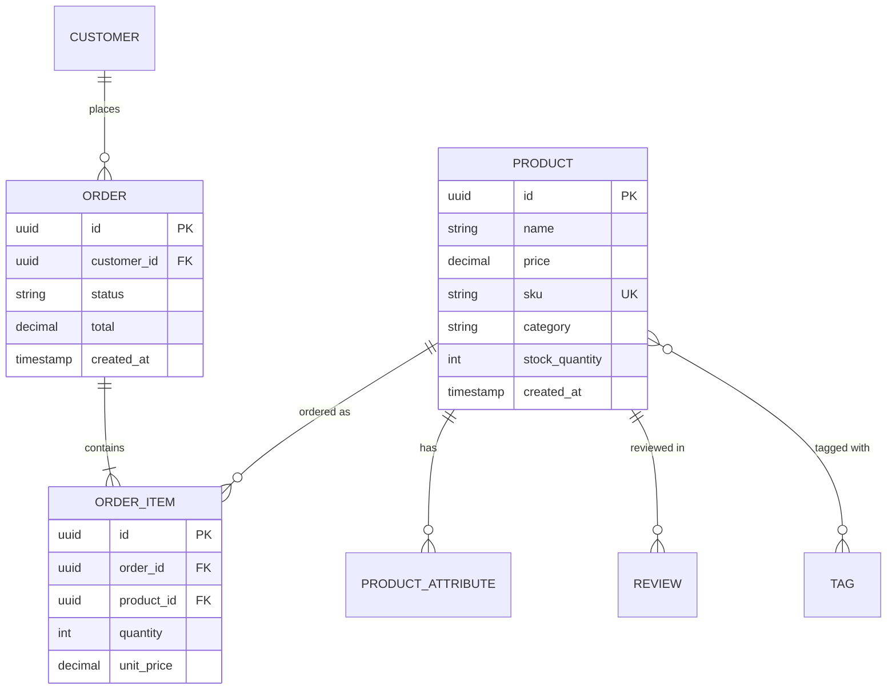

# Spring Data JPA

Spring Data JPA eliminates the tedious boilerplate of data access. Instead of writing DAO classes with CRUD methods, you declare an interface that extends `JpaRepository`, and Spring generates the implementation at runtime. You get pagination, sorting, derived queries, and custom JPQL — all with zero implementation classes.

But Spring Data JPA is not magic. It sits on top of Hibernate (the JPA implementation), which sits on top of JDBC. Understanding the layers matters because performance problems (N+1 queries, lazy loading exceptions, unnecessary fetches) always originate in the gap between what you wrote and what Hibernate generated.

## Entity Mapping

### Basic Entity

```java
package com.example.store.model;

import jakarta.persistence.*;
import lombok.*;
import org.hibernate.annotations.CreationTimestamp;
import org.hibernate.annotations.UpdateTimestamp;

import java.math.BigDecimal;
import java.time.Instant;
import java.util.*;

@Entity
@Table(name = "products", indexes = {
        @Index(name = "idx_products_sku", columnList = "sku", unique = true),
        @Index(name = "idx_products_category", columnList = "category"),
        @Index(name = "idx_products_price", columnList = "price")
})
@Getter
@Setter
@NoArgsConstructor(access = AccessLevel.PROTECTED)  // JPA requires no-arg constructor
@AllArgsConstructor
@Builder
@ToString(exclude = {"orderItems", "reviews"})  // Exclude collections to prevent lazy loading
@EqualsAndHashCode(of = "id")                   // Use only business key or PK
public class Product {

    @Id
    @GeneratedValue(strategy = GenerationType.UUID)
    @Column(name = "id", updatable = false, nullable = false)
    private UUID id;

    @Column(name = "name", nullable = false, length = 200)
    private String name;

    @Column(name = "description", columnDefinition = "TEXT")
    private String description;

    @Column(name = "price", nullable = false, precision = 12, scale = 2)
    private BigDecimal price;

    @Column(name = "sku", nullable = false, unique = true, length = 20)
    private String sku;

    @Enumerated(EnumType.STRING)
    @Column(name = "category", nullable = false, length = 50)
    private ProductCategory category;

    @Column(name = "stock_quantity", nullable = false)
    private int stockQuantity;

    @Column(name = "active", nullable = false)
    @Builder.Default
    private boolean active = true;

    @Version  // Optimistic locking
    private Long version;

    @CreationTimestamp
    @Column(name = "created_at", updatable = false)
    private Instant createdAt;

    @UpdateTimestamp
    @Column(name = "updated_at")
    private Instant updatedAt;

    // === Relationships ===

    @OneToMany(mappedBy = "product", cascade = CascadeType.ALL, orphanRemoval = true)
    @Builder.Default
    private List<ProductAttribute> attributes = new ArrayList<>();

    @OneToMany(mappedBy = "product")
    @Builder.Default
    private List<OrderItem> orderItems = new ArrayList<>();

    @OneToMany(mappedBy = "product")
    @Builder.Default
    private List<Review> reviews = new ArrayList<>();

    // === Business Methods ===

    public void addAttribute(String key, String value) {
        ProductAttribute attr = new ProductAttribute(this, key, value);
        attributes.add(attr);
    }

    public void removeAttribute(String key) {
        attributes.removeIf(a -> a.getKey().equals(key));
    }

    public void decrementStock(int quantity) {
        if (this.stockQuantity < quantity) {
            throw new IllegalStateException(
                    "Insufficient stock: %d available, %d requested"
                            .formatted(this.stockQuantity, quantity));
        }
        this.stockQuantity -= quantity;
    }

    public boolean isInStock() {
        return this.stockQuantity > 0;
    }
}
```

::: warning Entity equals/hashCode rules
Never use `@EqualsAndHashCode` on all fields. Use the primary key (`id`) or a natural business key (`sku`). Using all fields causes issues with collections, detached entities, and proxy objects. If using the `id`, be aware that it is `null` before the entity is persisted.
:::

### Relationship Mappings

```java
// === One-to-Many / Many-to-One ===

@Entity
@Table(name = "orders")
public class Order {

    @Id
    @GeneratedValue(strategy = GenerationType.UUID)
    private UUID id;

    @ManyToOne(fetch = FetchType.LAZY)  // ALWAYS use LAZY for @ManyToOne
    @JoinColumn(name = "customer_id", nullable = false)
    private Customer customer;

    @OneToMany(mappedBy = "order", cascade = CascadeType.ALL, orphanRemoval = true)
    private List<OrderItem> items = new ArrayList<>();

    @Enumerated(EnumType.STRING)
    private OrderStatus status;

    private BigDecimal total;

    // Helper method to maintain bidirectional relationship
    public void addItem(OrderItem item) {
        items.add(item);
        item.setOrder(this);
    }

    public void removeItem(OrderItem item) {
        items.remove(item);
        item.setOrder(null);
    }
}

@Entity
@Table(name = "order_items")
public class OrderItem {

    @Id
    @GeneratedValue(strategy = GenerationType.UUID)
    private UUID id;

    @ManyToOne(fetch = FetchType.LAZY)
    @JoinColumn(name = "order_id", nullable = false)
    private Order order;

    @ManyToOne(fetch = FetchType.LAZY)
    @JoinColumn(name = "product_id", nullable = false)
    private Product product;

    private int quantity;
    private BigDecimal unitPrice;
    private BigDecimal subtotal;
}

// === Many-to-Many ===

@Entity
@Table(name = "tags")
public class Tag {

    @Id
    @GeneratedValue(strategy = GenerationType.UUID)
    private UUID id;

    @Column(unique = true, nullable = false)
    private String name;

    @ManyToMany(mappedBy = "tags")
    private Set<Product> products = new HashSet<>();
}

// In Product entity:
@ManyToMany
@JoinTable(
        name = "product_tags",
        joinColumns = @JoinColumn(name = "product_id"),
        inverseJoinColumns = @JoinColumn(name = "tag_id")
)
private Set<Tag> tags = new HashSet<>();
```



::: danger Always use FetchType.LAZY for @ManyToOne
The JPA default for `@ManyToOne` is `FetchType.EAGER`, which loads the related entity every time the owning entity is fetched. This causes N+1 queries and kills performance. Always set `fetch = FetchType.LAZY` and use `@EntityGraph` or `JOIN FETCH` when you actually need the data. See the [Hibernate Performance Tuning](./hibernate-tuning) page.
:::

## Repository Interface

### JpaRepository Methods

`JpaRepository` extends `ListCrudRepository` and `ListPagingAndSortingRepository`, giving you all of these for free:

```java
public interface ProductRepository extends JpaRepository<Product, UUID> {
    // Inherited methods:
    // save(entity), saveAll(entities)
    // findById(id), findAll(), findAll(Pageable), findAll(Sort)
    // findAllById(ids)
    // existsById(id), count()
    // deleteById(id), delete(entity), deleteAll()
    // flush(), saveAndFlush(entity)
}
```

### Derived Query Methods

Spring generates queries from method names:

```java
public interface ProductRepository extends JpaRepository<Product, UUID> {

    // SELECT * FROM products WHERE category = ? AND active = true
    List<Product> findByCategoryAndActiveTrue(ProductCategory category);

    // SELECT * FROM products WHERE price BETWEEN ? AND ? ORDER BY price ASC
    List<Product> findByPriceBetweenOrderByPriceAsc(BigDecimal min, BigDecimal max);

    // SELECT * FROM products WHERE name LIKE '%?%' (case-insensitive)
    Page<Product> findByNameContainingIgnoreCase(String name, Pageable pageable);

    // SELECT * FROM products WHERE sku = ?
    Optional<Product> findBySku(String sku);

    // SELECT * FROM products WHERE category IN (?) AND stock_quantity > ?
    List<Product> findByCategoryInAndStockQuantityGreaterThan(
            List<ProductCategory> categories, int minStock);

    // EXISTS check
    boolean existsBySku(String sku);

    // COUNT
    long countByCategoryAndActiveTrue(ProductCategory category);

    // DELETE
    void deleteByCategoryAndActiveFalse(ProductCategory category);

    // TOP / FIRST
    List<Product> findTop10ByOrderByCreatedAtDesc();

    // DISTINCT
    List<Product> findDistinctByCategory(ProductCategory category);
}
```

### Query Method Keywords

| Keyword | SQL Equivalent | Example |
|---|---|---|
| `findBy` | `SELECT ... WHERE` | `findByName(String name)` |
| `And` | `AND` | `findByNameAndCategory(...)` |
| `Or` | `OR` | `findByNameOrSku(...)` |
| `Between` | `BETWEEN` | `findByPriceBetween(min, max)` |
| `LessThan` | `<` | `findByPriceLessThan(max)` |
| `GreaterThanEqual` | `>=` | `findByStockGreaterThanEqual(min)` |
| `Like` | `LIKE` | `findByNameLike("%widget%")` |
| `Containing` | `LIKE %...%` | `findByNameContaining("widget")` |
| `StartingWith` | `LIKE ...%` | `findByNameStartingWith("A")` |
| `In` | `IN (...)` | `findByCategoryIn(List<Category>)` |
| `IsNull` | `IS NULL` | `findByDeletedAtIsNull()` |
| `IsNotNull` | `IS NOT NULL` | `findByDeletedAtIsNotNull()` |
| `OrderBy` | `ORDER BY` | `findByActiveOrderByNameAsc()` |
| `Not` | `<>` | `findByCategoryNot(category)` |
| `True`/`False` | `= true`/`= false` | `findByActiveTrue()` |

### Custom Queries with @Query

```java
public interface ProductRepository extends JpaRepository<Product, UUID> {

    // JPQL query
    @Query("SELECT p FROM Product p WHERE p.category = :category AND p.price <= :maxPrice")
    Page<Product> findByCategoryWithMaxPrice(
            @Param("category") ProductCategory category,
            @Param("maxPrice") BigDecimal maxPrice,
            Pageable pageable);

    // JPQL with JOIN FETCH (avoids N+1)
    @Query("""
            SELECT DISTINCT p FROM Product p
            LEFT JOIN FETCH p.attributes
            WHERE p.category = :category AND p.active = true
            """)
    List<Product> findActiveByCategoryWithAttributes(
            @Param("category") ProductCategory category);

    // Native SQL query
    @Query(value = """
            SELECT p.*, COUNT(oi.id) as order_count
            FROM products p
            LEFT JOIN order_items oi ON oi.product_id = p.id
            WHERE p.category = :category
            GROUP BY p.id
            ORDER BY order_count DESC
            LIMIT :limit
            """, nativeQuery = true)
    List<Product> findTopSellingByCategory(
            @Param("category") String category,
            @Param("limit") int limit);

    // Update query
    @Modifying
    @Query("UPDATE Product p SET p.active = false WHERE p.stockQuantity = 0")
    int deactivateOutOfStockProducts();

    // Bulk delete
    @Modifying
    @Query("DELETE FROM Product p WHERE p.active = false AND p.updatedAt < :cutoff")
    int deleteInactiveProductsBefore(@Param("cutoff") Instant cutoff);
}
```

::: warning @Modifying queries need @Transactional
Any `@Modifying` query (UPDATE/DELETE) must be called from a `@Transactional` context. Spring Data will throw an exception otherwise. Also add `clearAutomatically = true` if subsequent reads in the same transaction need to see the updates.
:::

## Projections

When you only need a subset of fields, projections avoid loading entire entities:

```java
// === Interface-based Projection ===
public interface ProductSummary {
    UUID getId();
    String getName();
    BigDecimal getPrice();
    String getCategory();
}

// === Record-based Projection (DTO Projection) ===
public record ProductSearchResult(
        UUID id,
        String name,
        BigDecimal price,
        String sku,
        long reviewCount,
        Double averageRating
) {}

// === In Repository ===
public interface ProductRepository extends JpaRepository<Product, UUID> {

    // Interface projection — Spring generates the SELECT clause
    List<ProductSummary> findByCategoryAndActiveTrue(ProductCategory category);

    // DTO projection via JPQL constructor expression
    @Query("""
            SELECT new com.example.store.dto.ProductSearchResult(
                p.id, p.name, p.price, p.sku,
                COUNT(r), AVG(r.rating)
            )
            FROM Product p
            LEFT JOIN p.reviews r
            WHERE p.active = true AND p.name LIKE %:query%
            GROUP BY p.id, p.name, p.price, p.sku
            """)
    Page<ProductSearchResult> searchProducts(
            @Param("query") String query, Pageable pageable);

    // Dynamic projection — caller decides return type
    <T> List<T> findByCategory(ProductCategory category, Class<T> type);
}

// Usage:
List<ProductSummary> summaries = repo.findByCategory(ELECTRONICS, ProductSummary.class);
List<Product> full = repo.findByCategory(ELECTRONICS, Product.class);
```

## Specifications (Dynamic Queries)

Specifications are perfect when query criteria are optional (search filters):

```java
// Specification builder
public class ProductSpecifications {

    public static Specification<Product> hasCategory(ProductCategory category) {
        return (root, query, cb) ->
                category == null ? null : cb.equal(root.get("category"), category);
    }

    public static Specification<Product> priceBetween(BigDecimal min, BigDecimal max) {
        return (root, query, cb) -> {
            if (min == null && max == null) return null;
            if (min != null && max != null) {
                return cb.between(root.get("price"), min, max);
            }
            if (min != null) {
                return cb.greaterThanOrEqualTo(root.get("price"), min);
            }
            return cb.lessThanOrEqualTo(root.get("price"), max);
        };
    }

    public static Specification<Product> nameContains(String query) {
        return (root, cq, cb) ->
                query == null ? null :
                        cb.like(cb.lower(root.get("name")),
                                "%" + query.toLowerCase() + "%");
    }

    public static Specification<Product> isActive() {
        return (root, query, cb) -> cb.isTrue(root.get("active"));
    }

    public static Specification<Product> inStockOnly() {
        return (root, query, cb) ->
                cb.greaterThan(root.get("stockQuantity"), 0);
    }

    public static Specification<Product> hasMinRating(Double minRating) {
        return (root, query, cb) -> {
            if (minRating == null) return null;
            Subquery<Double> subquery = query.subquery(Double.class);
            Root<Review> review = subquery.from(Review.class);
            subquery.select(cb.avg(review.get("rating")))
                    .where(cb.equal(review.get("product"), root));
            return cb.greaterThanOrEqualTo(subquery, minRating);
        };
    }
}
```

```java
// Repository must extend JpaSpecificationExecutor
public interface ProductRepository extends
        JpaRepository<Product, UUID>,
        JpaSpecificationExecutor<Product> {}

// Service usage
@Service
@RequiredArgsConstructor
public class ProductSearchService {

    private final ProductRepository productRepository;

    public Page<ProductResponse> search(ProductSearchCriteria criteria, Pageable pageable) {
        Specification<Product> spec = Specification
                .where(ProductSpecifications.isActive())
                .and(ProductSpecifications.nameContains(criteria.query()))
                .and(ProductSpecifications.hasCategory(criteria.category()))
                .and(ProductSpecifications.priceBetween(criteria.minPrice(), criteria.maxPrice()))
                .and(criteria.inStockOnly() ? ProductSpecifications.inStockOnly() : null)
                .and(ProductSpecifications.hasMinRating(criteria.minRating()));

        return productRepository.findAll(spec, pageable)
                .map(ProductResponse::from);
    }
}
```

## Auditing

Spring Data JPA can automatically populate `createdBy`, `createdAt`, `lastModifiedBy`, and `lastModifiedAt` fields:

```java
@MappedSuperclass
@EntityListeners(AuditingEntityListener.class)
@Getter
@Setter
public abstract class AuditableEntity {

    @CreatedDate
    @Column(name = "created_at", updatable = false)
    private Instant createdAt;

    @LastModifiedDate
    @Column(name = "updated_at")
    private Instant updatedAt;

    @CreatedBy
    @Column(name = "created_by", updatable = false)
    private String createdBy;

    @LastModifiedBy
    @Column(name = "updated_by")
    private String updatedBy;
}

// Entity extends the auditable base
@Entity
@Table(name = "products")
public class Product extends AuditableEntity {
    // ... fields
}

// Enable auditing and provide the current user
@Configuration
@EnableJpaAuditing
public class JpaConfig {

    @Bean
    public AuditorAware<String> auditorProvider() {
        return () -> Optional.ofNullable(SecurityContextHolder.getContext())
                .map(SecurityContext::getAuthentication)
                .filter(Authentication::isAuthenticated)
                .map(Authentication::getName)
                .or(() -> Optional.of("system"));
    }
}
```

## Soft Deletes

```java
@Entity
@Table(name = "products")
@Where(clause = "deleted_at IS NULL")  // Hibernate filter — excludes soft-deleted rows
@SQLDelete(sql = "UPDATE products SET deleted_at = NOW() WHERE id = ?")
public class Product extends AuditableEntity {

    // ... other fields

    @Column(name = "deleted_at")
    private Instant deletedAt;

    // To query including soft-deleted records, use native query
}

// Repository — all standard queries automatically exclude soft-deleted
public interface ProductRepository extends JpaRepository<Product, UUID> {

    // This automatically filters out soft-deleted products
    List<Product> findByCategory(ProductCategory category);

    // Explicitly include soft-deleted with native query
    @Query(value = "SELECT * FROM products WHERE id = :id", nativeQuery = true)
    Optional<Product> findByIdIncludingDeleted(@Param("id") UUID id);
}
```

## Custom Repository Implementation

When derived queries and `@Query` are not enough:

```java
// Custom interface
public interface ProductRepositoryCustom {
    List<Product> fullTextSearch(String query, Pageable pageable);
    void bulkUpdatePrices(ProductCategory category, BigDecimal percentage);
}

// Implementation — naming convention: <RepositoryName>Impl
@Repository
@RequiredArgsConstructor
public class ProductRepositoryImpl implements ProductRepositoryCustom {

    private final EntityManager entityManager;

    @Override
    public List<Product> fullTextSearch(String query, Pageable pageable) {
        return entityManager.createNativeQuery("""
                SELECT p.* FROM products p
                WHERE to_tsvector('english', p.name || ' ' || COALESCE(p.description, ''))
                      @@ plainto_tsquery('english', :query)
                ORDER BY ts_rank(
                    to_tsvector('english', p.name || ' ' || COALESCE(p.description, '')),
                    plainto_tsquery('english', :query)
                ) DESC
                """, Product.class)
                .setParameter("query", query)
                .setFirstResult((int) pageable.getOffset())
                .setMaxResults(pageable.getPageSize())
                .getResultList();
    }

    @Override
    @Transactional
    public void bulkUpdatePrices(ProductCategory category, BigDecimal percentage) {
        entityManager.createQuery("""
                UPDATE Product p
                SET p.price = p.price * (1 + :percentage / 100)
                WHERE p.category = :category AND p.active = true
                """)
                .setParameter("category", category)
                .setParameter("percentage", percentage)
                .executeUpdate();
    }
}

// Combine standard + custom repository
public interface ProductRepository extends
        JpaRepository<Product, UUID>,
        JpaSpecificationExecutor<Product>,
        ProductRepositoryCustom {

    // Standard derived queries here
}
```

## Further Reading

- **[Hibernate Performance Tuning](./hibernate-tuning)** — N+1 problem, batch fetching, second-level cache
- **[Database Migrations](./database-migrations)** — Flyway and Liquibase for schema management
- **[Testing](./testing)** — @DataJpaTest for repository testing
- **[REST API Development](./rest-api)** — Exposing JPA data through REST endpoints

## Common Pitfalls

::: danger Pitfall 1: Using FetchType.EAGER on @ManyToOne relationships
The JPA default for `@ManyToOne` is `EAGER`, which loads the related entity every time the owning entity is fetched, causing N+1 queries and killing performance.
**Fix:** Always set `fetch = FetchType.LAZY` on `@ManyToOne` and `@OneToOne` relationships. Use `@EntityGraph` or `JOIN FETCH` when you actually need the related data.
:::

::: danger Pitfall 2: Using Lombok's @EqualsAndHashCode on all fields
Using `@EqualsAndHashCode` on all entity fields breaks `Set` and `Map` behavior with detached entities and proxies, because field values change after persist.
**Fix:** Use `@EqualsAndHashCode(of = "id")` for the primary key or a natural business key. Be aware that `id` is null before persist.
:::

::: danger Pitfall 3: Forgetting @Transactional on @Modifying queries
`@Modifying` queries (UPDATE/DELETE) require a transactional context. Without `@Transactional`, Spring Data throws an exception at runtime.
**Fix:** Call `@Modifying` methods from a `@Transactional` service method. Add `clearAutomatically = true` if subsequent reads in the same transaction need to see the changes.
:::

::: danger Pitfall 4: N+1 queries from lazy loading in loops
Iterating over a list of entities and accessing a lazy relationship on each one triggers a separate query per entity.
**Fix:** Use `JOIN FETCH` in JPQL, `@EntityGraph` on repository methods, or set `hibernate.default_batch_fetch_size` to batch lazy loads.
:::

::: danger Pitfall 5: Not using projections for read-only queries
Loading entire entities with all columns when you only need a few fields wastes memory and bandwidth.
**Fix:** Use interface projections or DTO projections (`SELECT new com.example.dto.ProductSummary(...)`) to fetch only the columns you need.
:::

::: danger Pitfall 6: Missing database indexes on queried columns
Derived query methods like `findByEmailAndStatus()` generate SQL with WHERE clauses, but without matching database indexes, queries perform full table scans.
**Fix:** Add `@Index` annotations on your `@Table` or create indexes in your Flyway/Liquibase migrations for all columns used in WHERE, ORDER BY, and JOIN clauses.
:::

## Interview Questions

**Q1: What is the difference between `JpaRepository`, `CrudRepository`, and `Repository`?**
::: details Answer
`Repository` is a marker interface with no methods. `CrudRepository` extends it with basic CRUD operations (`save`, `findById`, `findAll`, `delete`, `count`). `ListCrudRepository` adds `List` return types. `JpaRepository` extends both `ListCrudRepository` and `ListPagingAndSortingRepository`, adding JPA-specific methods like `flush()`, `saveAndFlush()`, `deleteInBatch()`, and `findAll(Example)`. For most Spring Boot applications, extend `JpaRepository` to get the full feature set.
:::

**Q2: How do derived query methods work in Spring Data JPA?**
::: details Answer
Spring Data parses method names and generates JPQL queries at startup. The method name follows a pattern: `findBy` + property name + condition keyword. For example, `findByEmailAndStatusOrderByCreatedAtDesc(String email, Status status)` generates `SELECT e FROM Entity e WHERE e.email = ?1 AND e.status = ?2 ORDER BY e.createdAt DESC`. Keywords include `And`, `Or`, `Between`, `LessThan`, `Like`, `Containing`, `In`, `IsNull`, `OrderBy`, etc. If the method name becomes too complex, use `@Query` with JPQL instead.
:::

**Q3: What are JPA Specifications and when should you use them?**
::: details Answer
Specifications implement the Specification pattern from Domain-Driven Design. They encapsulate query predicates as reusable, composable objects using the JPA Criteria API. Each specification returns a `Predicate` and can be combined with `.and()`, `.or()`, and `.where()`. Use them when query criteria are dynamic -- for example, search filters where users may provide any combination of category, price range, rating, and availability. The repository must extend `JpaSpecificationExecutor<T>`.
:::

**Q4: What is the difference between `@Query` with JPQL and native SQL?**
::: details Answer
JPQL operates on entity classes and field names (e.g., `SELECT p FROM Product p WHERE p.name = :name`), is database-agnostic, and supports JOIN FETCH for eager loading. Native SQL operates on table and column names (e.g., `SELECT * FROM products WHERE name = :name`), is database-specific, and supports database features not available in JPQL (e.g., window functions, CTEs, full-text search). Use JPQL by default for portability; use native SQL when you need database-specific features or for complex queries that JPQL cannot express.
:::

**Q5: How does JPA auditing work with `@CreatedDate`, `@LastModifiedDate`, `@CreatedBy`, and `@LastModifiedBy`?**
::: details Answer
JPA auditing automatically populates timestamp and user fields on entity creation and modification. Enable it with `@EnableJpaAuditing` on a `@Configuration` class. Add `@EntityListeners(AuditingEntityListener.class)` to your entity (or a `@MappedSuperclass`). Annotate fields with `@CreatedDate`, `@LastModifiedDate` for timestamps, and `@CreatedBy`, `@LastModifiedBy` for user tracking. The `@CreatedBy`/`@LastModifiedBy` fields require an `AuditorAware<T>` bean that returns the current user, typically from `SecurityContextHolder`.
:::
