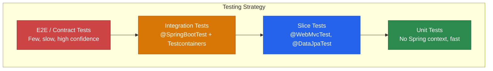

# Testing

Testing Spring Boot applications is fundamentally different from testing plain Java classes. You are not just testing business logic — you are testing how your code interacts with the Spring container, database, HTTP layer, security, and external services. Spring Boot provides **test slices** that load only the parts of the context you need, making tests fast and focused.

This page covers the complete testing toolkit: unit tests, slice tests, integration tests, Testcontainers, WireMock, and the strategies that keep your test suite fast and reliable.

## Testing Pyramid



| Level | Speed | Spring Context | Database | External Services |
|---|---|---|---|---|
| Unit | ~1ms | None | None | None (mocked) |
| @WebMvcTest | ~500ms | Web slice only | None | Mocked (@MockBean) |
| @DataJpaTest | ~2s | JPA slice only | H2/Testcontainers | None |
| @SpringBootTest | ~5-10s | Full context | Testcontainers | WireMock |

## Unit Tests (No Spring)

The fastest tests. No Spring context, no DI container — just plain Java objects with mocks.

```java
class OrderServiceTest {

    private OrderService orderService;

    // Manual mocks — no @MockBean needed
    private OrderRepository orderRepository = mock(OrderRepository.class);
    private ProductServiceClient productClient = mock(ProductServiceClient.class);
    private PaymentGateway paymentGateway = mock(PaymentGateway.class);
    private ApplicationEventPublisher eventPublisher = mock(ApplicationEventPublisher.class);

    @BeforeEach
    void setUp() {
        orderService = new OrderService(
                orderRepository, productClient, paymentGateway, eventPublisher);
    }

    @Test
    void placeOrder_ValidRequest_CreatesOrderAndPublishesEvent() {
        // Given
        UUID productId = UUID.randomUUID();
        var request = new CreateOrderRequest(
                UUID.randomUUID(), productId, 2, "CREDIT_CARD");

        var product = new ProductResponse(productId, "Widget", null,
                new BigDecimal("9.99"), "WDG-001", ProductCategory.ELECTRONICS,
                100, true, List.of(), Instant.now(), Instant.now());

        when(productClient.getProduct(productId)).thenReturn(product);
        when(paymentGateway.charge(any(), any()))
                .thenReturn(new PaymentResult("PAY-123", "SUCCESS"));
        when(orderRepository.save(any(Order.class)))
                .thenAnswer(inv -> {
                    Order order = inv.getArgument(0);
                    ReflectionTestUtils.setField(order, "id", UUID.randomUUID());
                    return order;
                });

        // When
        OrderResponse result = orderService.placeOrder(request);

        // Then
        assertThat(result).isNotNull();
        assertThat(result.total()).isEqualByComparingTo(new BigDecimal("19.98"));

        verify(orderRepository).save(argThat(order ->
                order.getQuantity() == 2
                        && order.getStatus() == OrderStatus.CONFIRMED));
        verify(eventPublisher).publishEvent(any(OrderPlacedEvent.class));
        verify(paymentGateway).charge(eq("CREDIT_CARD"), eq(new BigDecimal("19.98")));
    }

    @Test
    void placeOrder_InsufficientStock_ThrowsException() {
        // Given
        UUID productId = UUID.randomUUID();
        var request = new CreateOrderRequest(
                UUID.randomUUID(), productId, 50, "CREDIT_CARD");

        var product = new ProductResponse(productId, "Widget", null,
                new BigDecimal("9.99"), "WDG-001", ProductCategory.ELECTRONICS,
                5, true, List.of(), Instant.now(), Instant.now()); // Only 5 in stock

        when(productClient.getProduct(productId)).thenReturn(product);

        // When/Then
        assertThatThrownBy(() -> orderService.placeOrder(request))
                .isInstanceOf(BusinessRuleViolationException.class)
                .hasMessageContaining("Insufficient stock");

        verify(orderRepository, never()).save(any());
        verify(paymentGateway, never()).charge(any(), any());
    }

    @Test
    void placeOrder_PaymentFails_ThrowsExternalServiceException() {
        // Given
        UUID productId = UUID.randomUUID();
        var request = new CreateOrderRequest(
                UUID.randomUUID(), productId, 1, "CREDIT_CARD");

        var product = new ProductResponse(productId, "Widget", null,
                new BigDecimal("9.99"), "WDG-001", ProductCategory.ELECTRONICS,
                100, true, List.of(), Instant.now(), Instant.now());

        when(productClient.getProduct(productId)).thenReturn(product);
        when(paymentGateway.charge(any(), any()))
                .thenThrow(new RuntimeException("Gateway timeout"));

        // When/Then
        assertThatThrownBy(() -> orderService.placeOrder(request))
                .isInstanceOf(ExternalServiceException.class)
                .hasMessageContaining("PaymentGateway");
    }
}
```

## @WebMvcTest (Controller Slice)

Tests the web layer in isolation. Only loads controllers, filters, and web-related beans.

```java
@WebMvcTest(ProductController.class)
class ProductControllerTest {

    @Autowired
    private MockMvc mockMvc;

    @Autowired
    private ObjectMapper objectMapper;

    @MockBean
    private ProductService productService;

    @Test
    void listProducts_ReturnsPagedResponse() throws Exception {
        // Given
        var products = List.of(
                new ProductResponse(UUID.randomUUID(), "Widget", "A widget",
                        new BigDecimal("9.99"), "WDG-001", ProductCategory.ELECTRONICS,
                        100, true, List.of(), Instant.now(), Instant.now()));

        Page<ProductResponse> page = new PageImpl<>(products,
                PageRequest.of(0, 20), 1);

        given(productService.findAll(any(Pageable.class))).willReturn(page);

        // When/Then
        mockMvc.perform(get("/api/v1/products")
                        .param("page", "0")
                        .param("size", "20"))
                .andExpect(status().isOk())
                .andExpect(jsonPath("$.content").isArray())
                .andExpect(jsonPath("$.content.length()").value(1))
                .andExpect(jsonPath("$.content[0].name").value("Widget"))
                .andExpect(jsonPath("$.content[0].price").value(9.99))
                .andExpect(jsonPath("$.totalElements").value(1));
    }

    @Test
    void createProduct_ValidBody_Returns201() throws Exception {
        // Given
        var request = new CreateProductRequest("Widget", "A widget",
                new BigDecimal("9.99"), "WDG-001", ProductCategory.ELECTRONICS,
                100, List.of());

        var response = new ProductResponse(UUID.randomUUID(), "Widget", "A widget",
                new BigDecimal("9.99"), "WDG-001", ProductCategory.ELECTRONICS,
                100, true, List.of(), Instant.now(), Instant.now());

        given(productService.create(any())).willReturn(response);

        // When/Then
        mockMvc.perform(post("/api/v1/products")
                        .contentType(MediaType.APPLICATION_JSON)
                        .content(objectMapper.writeValueAsString(request)))
                .andExpect(status().isCreated())
                .andExpect(header().exists("Location"))
                .andExpect(jsonPath("$.name").value("Widget"));
    }

    @Test
    void createProduct_InvalidBody_Returns400WithFieldErrors() throws Exception {
        // Given — invalid: blank name, negative price, no SKU
        String body = """
                {
                    "name": "",
                    "price": -5,
                    "category": "ELECTRONICS",
                    "stockQuantity": 100
                }
                """;

        // When/Then
        mockMvc.perform(post("/api/v1/products")
                        .contentType(MediaType.APPLICATION_JSON)
                        .content(body))
                .andExpect(status().isBadRequest())
                .andExpect(jsonPath("$.fieldErrors").isArray())
                .andExpect(jsonPath("$.fieldErrors[?(@.field == 'name')]").exists())
                .andExpect(jsonPath("$.fieldErrors[?(@.field == 'price')]").exists())
                .andExpect(jsonPath("$.fieldErrors[?(@.field == 'sku')]").exists());
    }

    @Test
    void getProduct_NotFound_Returns404() throws Exception {
        UUID id = UUID.randomUUID();
        given(productService.findById(id))
                .willThrow(new ResourceNotFoundException("Product", id));

        mockMvc.perform(get("/api/v1/products/{id}", id))
                .andExpect(status().isNotFound())
                .andExpect(jsonPath("$.errorCode").value("PRODUCT_NOT_FOUND"));
    }
}
```

## @DataJpaTest (Repository Slice)

Tests JPA repositories with a real database. Uses H2 by default, but Testcontainers is recommended.

```java
@DataJpaTest
@AutoConfigureTestDatabase(replace = AutoConfigureTestDatabase.Replace.NONE)
@Testcontainers
class ProductRepositoryTest {

    @Container
    static PostgreSQLContainer<?> postgres = new PostgreSQLContainer<>("postgres:16")
            .withDatabaseName("testdb");

    @DynamicPropertySource
    static void configureProperties(DynamicPropertyRegistry registry) {
        registry.add("spring.datasource.url", postgres::getJdbcUrl);
        registry.add("spring.datasource.username", postgres::getUsername);
        registry.add("spring.datasource.password", postgres::getPassword);
    }

    @Autowired
    private ProductRepository productRepository;

    @Autowired
    private TestEntityManager entityManager;

    @Test
    void findByCategoryAndActiveTrue_ReturnsOnlyActiveProducts() {
        // Given
        Product active = Product.builder()
                .name("Active Widget")
                .price(new BigDecimal("9.99"))
                .sku("WDG-001")
                .category(ProductCategory.ELECTRONICS)
                .stockQuantity(100)
                .active(true)
                .build();

        Product inactive = Product.builder()
                .name("Inactive Widget")
                .price(new BigDecimal("4.99"))
                .sku("WDG-002")
                .category(ProductCategory.ELECTRONICS)
                .stockQuantity(0)
                .active(false)
                .build();

        Product otherCategory = Product.builder()
                .name("Book")
                .price(new BigDecimal("19.99"))
                .sku("BK-001")
                .category(ProductCategory.BOOKS)
                .stockQuantity(50)
                .active(true)
                .build();

        entityManager.persist(active);
        entityManager.persist(inactive);
        entityManager.persist(otherCategory);
        entityManager.flush();

        // When
        List<Product> results = productRepository
                .findByCategoryAndActiveTrue(ProductCategory.ELECTRONICS);

        // Then
        assertThat(results)
                .hasSize(1)
                .extracting(Product::getName)
                .containsExactly("Active Widget");
    }

    @Test
    void findBySku_ExistingSku_ReturnsProduct() {
        Product product = Product.builder()
                .name("Widget")
                .price(new BigDecimal("9.99"))
                .sku("UNIQUE-SKU")
                .category(ProductCategory.ELECTRONICS)
                .stockQuantity(10)
                .active(true)
                .build();

        entityManager.persist(product);
        entityManager.flush();

        Optional<Product> found = productRepository.findBySku("UNIQUE-SKU");

        assertThat(found).isPresent();
        assertThat(found.get().getName()).isEqualTo("Widget");
    }

    @Test
    void save_DuplicateSku_ThrowsException() {
        Product first = Product.builder()
                .name("First")
                .price(new BigDecimal("9.99"))
                .sku("SAME-SKU")
                .category(ProductCategory.ELECTRONICS)
                .stockQuantity(10)
                .active(true)
                .build();

        Product duplicate = Product.builder()
                .name("Duplicate")
                .price(new BigDecimal("19.99"))
                .sku("SAME-SKU")
                .category(ProductCategory.ELECTRONICS)
                .stockQuantity(5)
                .active(true)
                .build();

        entityManager.persist(first);
        entityManager.flush();

        assertThatThrownBy(() -> {
            entityManager.persist(duplicate);
            entityManager.flush();
        }).isInstanceOf(PersistenceException.class);
    }
}
```

## @SpringBootTest (Full Integration)

Loads the complete application context. Use for end-to-end tests.

```java
@SpringBootTest(webEnvironment = SpringBootTest.WebEnvironment.RANDOM_PORT)
@Testcontainers
@ActiveProfiles("test")
class OrderIntegrationTest {

    @Container
    static PostgreSQLContainer<?> postgres = new PostgreSQLContainer<>("postgres:16");

    @DynamicPropertySource
    static void configure(DynamicPropertyRegistry registry) {
        registry.add("spring.datasource.url", postgres::getJdbcUrl);
        registry.add("spring.datasource.username", postgres::getUsername);
        registry.add("spring.datasource.password", postgres::getPassword);
    }

    @Autowired
    private TestRestTemplate restTemplate;

    @Autowired
    private ProductRepository productRepository;

    @Test
    void fullOrderWorkflow() {
        // 1. Create a product
        Product product = productRepository.save(Product.builder()
                .name("Test Widget")
                .price(new BigDecimal("29.99"))
                .sku("TST-001")
                .category(ProductCategory.ELECTRONICS)
                .stockQuantity(100)
                .active(true)
                .build());

        // 2. Fetch the product via API
        ResponseEntity<ProductResponse> getResponse = restTemplate.getForEntity(
                "/api/v1/products/{id}", ProductResponse.class, product.getId());

        assertThat(getResponse.getStatusCode()).isEqualTo(HttpStatus.OK);
        assertThat(getResponse.getBody()).isNotNull();
        assertThat(getResponse.getBody().name()).isEqualTo("Test Widget");

        // 3. List products
        ResponseEntity<String> listResponse = restTemplate.getForEntity(
                "/api/v1/products", String.class);
        assertThat(listResponse.getStatusCode()).isEqualTo(HttpStatus.OK);
    }
}
```

## WireMock (External Service Mocking)

```xml
<dependency>
    <groupId>org.wiremock</groupId>
    <artifactId>wiremock-standalone</artifactId>
    <version>3.5.4</version>
    <scope>test</scope>
</dependency>
```

```java
@SpringBootTest(webEnvironment = SpringBootTest.WebEnvironment.RANDOM_PORT)
@WireMockTest(httpPort = 8089)
class PaymentServiceClientTest {

    @DynamicPropertySource
    static void configure(DynamicPropertyRegistry registry) {
        registry.add("app.payment.base-url", () -> "http://localhost:8089");
    }

    @Autowired
    private PaymentServiceClient paymentClient;

    @Test
    void chargePayment_Success() {
        // Given
        stubFor(post(urlEqualTo("/v1/charges"))
                .withRequestBody(matchingJsonPath("$.amount", equalTo("29.99")))
                .willReturn(aResponse()
                        .withStatus(200)
                        .withHeader("Content-Type", "application/json")
                        .withBody("""
                                {
                                    "id": "ch_123",
                                    "status": "succeeded",
                                    "amount": 29.99
                                }
                                """)));

        // When
        PaymentResult result = paymentClient.charge(
                new BigDecimal("29.99"), "tok_visa");

        // Then
        assertThat(result.status()).isEqualTo("succeeded");
        verify(postRequestedFor(urlEqualTo("/v1/charges")));
    }

    @Test
    void chargePayment_Timeout_ThrowsException() {
        stubFor(post(urlEqualTo("/v1/charges"))
                .willReturn(aResponse()
                        .withStatus(200)
                        .withFixedDelay(5000))); // 5 second delay

        assertThatThrownBy(() ->
                paymentClient.charge(new BigDecimal("29.99"), "tok_visa"))
                .isInstanceOf(ExternalServiceException.class);
    }

    @Test
    void chargePayment_ServerError_RetriesAndFails() {
        stubFor(post(urlEqualTo("/v1/charges"))
                .willReturn(aResponse().withStatus(500)));

        assertThatThrownBy(() ->
                paymentClient.charge(new BigDecimal("29.99"), "tok_visa"))
                .isInstanceOf(ExternalServiceException.class);

        // Verify retry happened
        verify(3, postRequestedFor(urlEqualTo("/v1/charges")));
    }
}
```

## Testcontainers Reuse

Speed up tests by reusing containers across test classes:

```java
// Base class for all integration tests
@Testcontainers
public abstract class IntegrationTestBase {

    @Container
    @ServiceConnection  // Spring Boot 3.1+ auto-configuration
    static PostgreSQLContainer<?> postgres = new PostgreSQLContainer<>("postgres:16")
            .withReuse(true);  // Reuse across test runs

    @Container
    @ServiceConnection
    static RedisContainer redis = new RedisContainer(
            DockerImageName.parse("redis:7"));

    @Container
    static KafkaContainer kafka = new KafkaContainer(
            DockerImageName.parse("confluentinc/cp-kafka:7.6.0"))
            .withReuse(true);

    @DynamicPropertySource
    static void configure(DynamicPropertyRegistry registry) {
        registry.add("spring.kafka.bootstrap-servers", kafka::getBootstrapServers);
    }
}

// Tests extend the base class
@SpringBootTest
class OrderIntegrationTest extends IntegrationTestBase {
    @Test
    void createOrder() { /* postgres and redis are already running */ }
}
```

## Test Patterns Cheat Sheet

| What to test | Annotation | Loads | Speed |
|---|---|---|---|
| Business logic | None (plain JUnit) | Nothing | Fastest |
| Controllers | `@WebMvcTest` | Web layer | Fast |
| JPA Repositories | `@DataJpaTest` | JPA layer | Medium |
| JSON serialization | `@JsonTest` | Jackson only | Fast |
| Full API workflow | `@SpringBootTest` | Everything | Slow |
| Security rules | `@WebMvcTest` + `@Import(SecurityConfig)` | Web + security | Fast |
| Kafka consumers | `@SpringBootTest` + `@EmbeddedKafka` | Everything | Slow |
| External APIs | `@SpringBootTest` + `@WireMockTest` | Everything | Slow |

::: tip Test naming convention
Use the pattern `methodUnderTest_condition_expectedResult`. Examples: `placeOrder_insufficientStock_throwsException`, `findById_existingId_returnsProduct`, `createUser_duplicateEmail_returns409`. This makes test failures self-documenting.
:::

## Further Reading

- **[REST API Development](./rest-api)** — The controllers being tested
- **[Spring Data JPA](./spring-data-jpa)** — Repository patterns
- **[Exception Handling](./exception-handling)** — Testing error responses
- **[Spring Security](./security)** — Security testing with @WithMockUser
