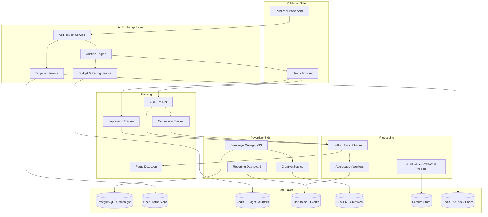
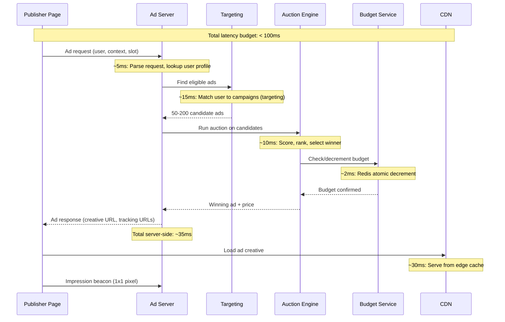
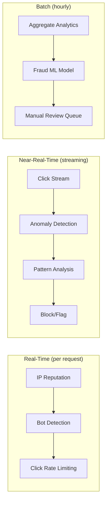
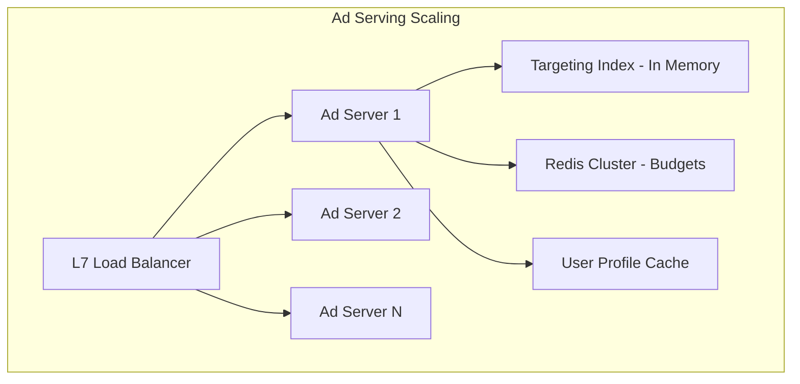

# Design an Ad Serving Platform

An ad serving platform connects advertisers with publishers to deliver targeted ads to users. Designing it covers the real-time bidding (RTB) pipeline, ad targeting and auction mechanics, impression and click tracking, conversion attribution, fraud detection, budget management, and reporting — all under extreme latency constraints (the entire ad decision must happen in < 100ms).

---

## 1. Requirements Clarification

### Functional Requirements

1. **Campaign management** — Advertisers create campaigns with budgets, targeting, creatives, and schedules
2. **Ad targeting** — Target users by demographics, interests, location, device, retargeting
3. **Ad auction** — Run second-price or first-price auction for each ad slot
4. **Ad serving** — Select and deliver the winning ad creative within strict latency budgets
5. **Impression tracking** — Track every ad impression with visibility verification
6. **Click tracking** — Track ad clicks with redirect-based attribution
7. **Conversion tracking** — Track post-click conversions on advertiser sites
8. **Budget pacing** — Distribute daily budget evenly throughout the day
9. **Reporting** — Real-time and historical campaign performance dashboards
10. **Fraud detection** — Detect and filter invalid clicks, bot traffic, and click fraud

### Non-Functional Requirements

1. **Ultra-low latency** — Ad selection and serving < 100ms (p99)
2. **High throughput** — 1M+ ad requests/second globally
3. **High availability** — 99.99% for ad serving (downtime = lost revenue)
4. **Near-real-time reporting** — Campaign metrics updated within 1 minute
5. **Accuracy** — Budget must not be overspent; billing must be exact
6. **Scale** — 10B+ impressions/day, millions of campaigns

### Clarifying Questions

::: tip Questions to Ask
- Are we building a demand-side platform (DSP), supply-side platform (SSP), or ad exchange?
- What ad formats do we support (display, video, native)?
- Do we participate in external RTB exchanges?
- What auction type: first-price or second-price?
- Do we need to support frequency capping?
- Should we support A/B testing of ad creatives?
:::

---

## 2. Back-of-the-Envelope Estimation

### Traffic

- 10B ad impressions/day
- Click-through rate (CTR): ~0.5% average
- Conversion rate: ~2% of clicks

$$
\text{Ad Request QPS} = \frac{10B}{86400} \approx 115{,}741 \text{ QPS}
$$

$$
\text{Peak Ad QPS} \approx 115{,}741 \times 3 = 347{,}222 \text{ QPS}
$$

$$
\text{Click QPS} = 115{,}741 \times 0.005 = 579 \text{ QPS}
$$

$$
\text{Conversion QPS} = 579 \times 0.02 = 12 \text{ QPS}
$$

### Storage

**Event logs:**

$$
\text{Impression event size} \approx 500 \text{ B (user, ad, context, timestamp)}
$$

$$
\text{Daily impression storage} = 10B \times 500 \text{ B} = 5 \text{ TB/day}
$$

$$
\text{Monthly storage} = 5 \times 30 = 150 \text{ TB/month}
$$

**Campaign/ad data:**

$$
\text{Campaigns} = 1M \times 5 \text{ KB} = 5 \text{ GB}
$$

$$
\text{Ad creatives} = 5M \times 2 \text{ KB (metadata)} = 10 \text{ GB}
$$

::: warning
Ad event data grows massively. Retention policies and compression are critical. Keep raw events for 30 days in hot storage, aggregated data for 2 years, then archive to cold storage.
:::

### Bandwidth

$$
\text{Ad creative delivery} = 115K \text{ QPS} \times 50 \text{ KB avg} = 5.8 \text{ GB/s} = 46 \text{ Gbps}
$$

Most ad creatives are served from CDN, so origin bandwidth is much lower.

---

## 3. High-Level Design



---

## 4. Detailed Design

### 4.1 Ad Serving Pipeline (< 100ms)



```typescript
class AdServingService {
  async handleAdRequest(request: AdRequest): Promise<AdResponse> {
    const startTime = Date.now();

    // 1. Parse and validate request
    const { userId, publisherId, adSlot, userAgent, ip, geo, pageUrl } = request;

    // 2. Get user profile (from cache or profile store)
    const userProfile = await this.getUserProfile(userId, {
      demographics: true,
      interests: true,
      retargetingSegments: true,
    });

    // 3. Find eligible campaigns (targeting match)
    const candidates = await this.targetingService.findEligibleAds({
      userProfile,
      geo,
      deviceType: this.parseDevice(userAgent),
      publisherId,
      adSlotSize: adSlot.size,
      adSlotType: adSlot.type,
      pageCategory: adSlot.category,
    });

    if (candidates.length === 0) {
      return this.getBackfillAd(adSlot); // House ad or passback
    }

    // 4. Score candidates (predict CTR and conversion probability)
    const scored = await this.scoreCandidates(candidates, userProfile, adSlot);

    // 5. Run auction
    const auctionResult = await this.auctionEngine.runAuction(scored);

    // 6. Check and decrement budget
    const budgetOk = await this.budgetService.trySpend(
      auctionResult.campaignId,
      auctionResult.chargeAmount
    );
    if (!budgetOk) {
      // Budget exhausted — try next candidate
      return this.handleBudgetExhausted(scored, auctionResult);
    }

    // 7. Generate tracking URLs
    const impressionUrl = this.generateImpressionUrl(auctionResult, request);
    const clickUrl = this.generateClickUrl(auctionResult, request);

    const elapsed = Date.now() - startTime;
    if (elapsed > 80) {
      this.metrics.increment('ad_serving.slow_requests');
    }

    return {
      adId: auctionResult.adId,
      creativeUrl: auctionResult.creativeUrl,
      impressionUrl,
      clickUrl,
      width: adSlot.size.width,
      height: adSlot.size.height,
    };
  }
}
```

### 4.2 Targeting Engine

```typescript
class TargetingService {
  // Pre-built inverted index: targeting criterion -> campaign set
  // Rebuilt every few minutes from campaign database

  private targetingIndex: TargetingIndex;

  async findEligibleAds(context: AdContext): Promise<Campaign[]> {
    // 1. Start with all active campaigns for this ad slot type
    let candidates = this.targetingIndex.getBySlotType(context.adSlotType);

    // 2. Apply targeting filters (each narrows the set)
    candidates = this.filterByGeo(candidates, context.geo);
    candidates = this.filterByDevice(candidates, context.deviceType);
    candidates = this.filterByDayParting(candidates); // Time-of-day targeting
    candidates = this.filterByPublisher(candidates, context.publisherId);

    // 3. Apply audience targeting (interests, demographics, retargeting)
    candidates = this.filterByAudience(candidates, context.userProfile);

    // 4. Apply frequency capping
    candidates = await this.applyFrequencyCap(candidates, context.userProfile.id);

    // 5. Filter campaigns with exhausted budgets
    candidates = await this.filterExhaustedBudgets(candidates);

    return candidates;
  }

  private async applyFrequencyCap(campaigns: Campaign[], userId: string): Promise<Campaign[]> {
    // Check how many times user has seen each campaign
    const pipeline = this.redis.pipeline();
    for (const camp of campaigns) {
      pipeline.get(`freq:${camp.id}:${userId}`);
    }
    const counts = await pipeline.exec();

    return campaigns.filter((camp, i) => {
      const seen = parseInt(counts[i][1] as string || '0');
      return seen < (camp.frequencyCap || Infinity);
    });
  }
}
```

### 4.3 Auction Engine

```typescript
class AuctionEngine {
  async runAuction(scoredCandidates: ScoredCandidate[]): Promise<AuctionResult> {
    // Sort by eCPM (effective cost per mille)
    // eCPM = bid * predicted_CTR * 1000 (for CPC campaigns)
    // eCPM = bid (for CPM campaigns)

    const ranked = scoredCandidates
      .map(candidate => ({
        ...candidate,
        eCPM: this.calculateECPM(candidate),
      }))
      .sort((a, b) => b.eCPM - a.eCPM);

    const winner = ranked[0];
    const runnerUp = ranked[1];

    // Second-price auction: winner pays $0.01 more than second place
    let chargeAmount: number;
    if (winner.campaign.billingType === 'cpm') {
      // Second price: runner-up's eCPM + $0.01
      chargeAmount = runnerUp ? (runnerUp.eCPM / 1000) + 0.01 : winner.campaign.bidFloor;
    } else {
      // CPC: charge on click, but use eCPM for ranking
      chargeAmount = runnerUp
        ? (runnerUp.eCPM / (winner.predictedCTR * 1000)) + 0.01
        : winner.campaign.maxBid;
    }

    return {
      campaignId: winner.campaign.id,
      adId: winner.ad.id,
      creativeUrl: winner.ad.creativeUrl,
      chargeAmount: Math.min(chargeAmount, winner.campaign.maxBid),
      auctionType: 'second_price',
      eCPM: winner.eCPM,
    };
  }

  private calculateECPM(candidate: ScoredCandidate): number {
    const { campaign, predictedCTR, predictedCVR } = candidate;

    switch (campaign.billingType) {
      case 'cpm':
        return campaign.bidAmount; // Already in CPM
      case 'cpc':
        return campaign.bidAmount * predictedCTR * 1000;
      case 'cpa':
        return campaign.bidAmount * predictedCTR * predictedCVR * 1000;
      default:
        return 0;
    }
  }
}
```

### 4.4 Budget & Pacing Service

```typescript
class BudgetPacingService {
  // Uses Redis for real-time budget tracking with atomic operations

  async trySpend(campaignId: string, amount: number): Promise<boolean> {
    // Atomic check-and-decrement using Lua script
    const script = `
      local remaining = tonumber(redis.call('GET', KEYS[1]) or '0')
      local amount = tonumber(ARGV[1])
      if remaining >= amount then
        redis.call('DECRBY', KEYS[1], amount * 100)  -- store in cents
        return 1
      else
        return 0
      end
    `;

    const result = await this.redis.eval(
      script,
      1,
      `budget:${campaignId}:daily`,
      Math.round(amount * 100)
    );

    return result === 1;
  }

  async calculatePacingRate(campaignId: string): Promise<number> {
    // Even pacing: distribute budget evenly throughout the day
    const campaign = await this.getCampaign(campaignId);
    const dailyBudget = campaign.daily_budget;
    const hoursRemaining = this.hoursRemainingInDay();

    // How much should we have spent by now?
    const hoursPassed = 24 - hoursRemaining;
    const expectedSpend = dailyBudget * (hoursPassed / 24);

    // How much have we actually spent?
    const actualSpend = dailyBudget - (await this.getRemainingBudget(campaignId));

    // Adjust pacing
    if (actualSpend > expectedSpend * 1.1) {
      return 0.5; // Slow down — ahead of pace
    } else if (actualSpend < expectedSpend * 0.9) {
      return 1.5; // Speed up — behind pace
    }
    return 1.0; // On track
  }

  // Reset daily budgets at midnight (timezone-aware per campaign)
  async resetDailyBudgets(): Promise<void> {
    const campaigns = await this.db.query(
      `SELECT id, daily_budget FROM campaigns WHERE status = 'active'`
    );

    const pipeline = this.redis.pipeline();
    for (const camp of campaigns) {
      pipeline.set(`budget:${camp.id}:daily`, Math.round(camp.daily_budget * 100));
    }
    await pipeline.exec();
  }
}
```

### 4.5 Click & Impression Tracking

```typescript
class TrackingService {
  async trackImpression(params: ImpressionParams): Promise<void> {
    const { adId, campaignId, userId, publisherId, timestamp, viewability } = params;

    // 1. Write to Kafka (async, non-blocking)
    await this.kafka.send('impressions', {
      key: campaignId,
      value: {
        eventType: 'impression',
        adId,
        campaignId,
        userId,
        publisherId,
        timestamp,
        viewability, // 0.0 to 1.0 (MRC standard: 50% pixels visible for 1+ sec)
        userAgent: params.userAgent,
        ip: params.ip,
        geo: params.geo,
      },
    });

    // 2. Update real-time counters (for reporting dashboard)
    await this.redis.hincrby(`stats:${campaignId}:${this.getHourKey()}`, 'impressions', 1);

    // 3. Update frequency cap counter
    if (userId) {
      await this.redis.incr(`freq:${campaignId}:${userId}`);
      await this.redis.expire(`freq:${campaignId}:${userId}`, 86400); // 24h window
    }
  }

  async trackClick(params: ClickParams): Promise<string> {
    const { adId, campaignId, userId, publisherId, impressionId } = params;

    // 1. Log click event
    await this.kafka.send('clicks', {
      key: campaignId,
      value: {
        eventType: 'click',
        adId,
        campaignId,
        userId,
        publisherId,
        impressionId,
        timestamp: Date.now(),
      },
    });

    // 2. Update counters
    await this.redis.hincrby(`stats:${campaignId}:${this.getHourKey()}`, 'clicks', 1);

    // 3. For CPC campaigns, charge on click
    const campaign = await this.getCampaign(campaignId);
    if (campaign.billing_type === 'cpc') {
      await this.budgetService.trySpend(campaignId, campaign.bid_amount);
    }

    // 4. Return redirect URL (to advertiser's landing page)
    const ad = await this.getAd(adId);
    return ad.landing_url;
  }
}
```

### 4.6 Fraud Detection



```typescript
class FraudDetectionService {
  async evaluateClick(click: ClickEvent): Promise<FraudScore> {
    let score = 0;

    // 1. IP reputation check
    const ipReputation = await this.ipReputationService.check(click.ip);
    if (ipReputation.isDataCenter) score += 40;
    if (ipReputation.isProxy) score += 30;
    if (ipReputation.isTor) score += 50;

    // 2. Click timing analysis
    const recentClicks = await this.redis.lrange(`clicks:${click.userId}`, 0, 10);
    if (recentClicks.length > 5) {
      // More than 5 clicks in the last minute = suspicious
      score += 30;
    }

    // 3. User agent analysis
    if (this.isKnownBot(click.userAgent)) score += 80;
    if (!click.userAgent || click.userAgent.length < 10) score += 40;

    // 4. Click-impression correlation
    const hasImpression = await this.verifyImpression(click.impressionId);
    if (!hasImpression) score += 60; // Click without corresponding impression

    // 5. Behavioral analysis
    const timeSinceImpression = click.timestamp - click.impressionTimestamp;
    if (timeSinceImpression < 100) score += 40;  // Too fast — likely bot
    if (timeSinceImpression > 3600000) score += 20; // Too slow — stale click

    return {
      score,
      isValid: score < 50,
      reason: score >= 50 ? this.getReasons(score) : null,
    };
  }
}
```

---

## 5. Data Model

### PostgreSQL (Campaign Management)

```sql
-- Advertisers
CREATE TABLE advertisers (
    id              BIGSERIAL PRIMARY KEY,
    name            VARCHAR(255) NOT NULL,
    balance         DECIMAL(12, 2) DEFAULT 0,
    billing_email   VARCHAR(255),
    created_at      TIMESTAMP WITH TIME ZONE DEFAULT NOW()
);

-- Campaigns
CREATE TABLE campaigns (
    id              BIGSERIAL PRIMARY KEY,
    advertiser_id   BIGINT NOT NULL,
    name            VARCHAR(255) NOT NULL,
    status          VARCHAR(20) DEFAULT 'draft',   -- draft, active, paused, completed
    billing_type    VARCHAR(10) NOT NULL,           -- cpm, cpc, cpa
    bid_amount      DECIMAL(10, 4),                 -- per unit (per 1000 impressions, per click, per action)
    daily_budget    DECIMAL(10, 2),
    total_budget    DECIMAL(12, 2),
    start_date      TIMESTAMP WITH TIME ZONE,
    end_date        TIMESTAMP WITH TIME ZONE,
    frequency_cap   INT,                            -- max impressions per user per day
    targeting       JSONB NOT NULL,                 -- targeting criteria
    created_at      TIMESTAMP WITH TIME ZONE DEFAULT NOW(),
    updated_at      TIMESTAMP WITH TIME ZONE DEFAULT NOW()
);

CREATE INDEX idx_campaigns_status ON campaigns(status, start_date, end_date)
    WHERE status = 'active';

-- Ad Creatives
CREATE TABLE ad_creatives (
    id              BIGSERIAL PRIMARY KEY,
    campaign_id     BIGINT NOT NULL,
    name            VARCHAR(255),
    creative_type   VARCHAR(20),                   -- banner, native, video
    width           INT,
    height          INT,
    creative_url    VARCHAR(500),                  -- S3/CDN URL
    landing_url     VARCHAR(2000),
    headline        VARCHAR(255),
    body_text       VARCHAR(500),
    status          VARCHAR(20) DEFAULT 'active',
    ctr_score       DECIMAL(8, 6) DEFAULT 0,       -- Historical CTR
    created_at      TIMESTAMP WITH TIME ZONE DEFAULT NOW()
);

CREATE INDEX idx_creatives_campaign ON ad_creatives(campaign_id, status);

-- Campaign Targeting (denormalized for fast lookup)
CREATE TABLE campaign_targeting (
    campaign_id     BIGINT NOT NULL,
    target_type     VARCHAR(50),                   -- 'geo', 'interest', 'device', 'retargeting'
    target_value    VARCHAR(255),
    include         BOOLEAN DEFAULT TRUE,          -- include or exclude
    PRIMARY KEY (campaign_id, target_type, target_value)
);

CREATE INDEX idx_targeting_value ON campaign_targeting(target_type, target_value)
    WHERE include = true;
```

### ClickHouse (Event Analytics)

```sql
-- Impression events (columnar storage, highly compressed)
CREATE TABLE impression_events (
    event_id        UUID,
    timestamp       DateTime,
    campaign_id     UInt64,
    ad_id           UInt64,
    advertiser_id   UInt64,
    publisher_id    UInt64,
    user_id         String,
    country         LowCardinality(String),
    device_type     LowCardinality(String),
    viewability     Float32,
    charge_amount   Float64,
    is_valid        UInt8
) ENGINE = MergeTree()
PARTITION BY toYYYYMM(timestamp)
ORDER BY (campaign_id, timestamp);

-- Click events
CREATE TABLE click_events (
    event_id        UUID,
    timestamp       DateTime,
    impression_id   UUID,
    campaign_id     UInt64,
    ad_id           UInt64,
    user_id         String,
    charge_amount   Float64,
    fraud_score     UInt8,
    is_valid        UInt8
) ENGINE = MergeTree()
PARTITION BY toYYYYMM(timestamp)
ORDER BY (campaign_id, timestamp);
```

---

## 6. API Design

```typescript
// Ad Request (publisher-facing)
// GET /api/v1/ad?slot_id=abc&size=300x250&page_url=...&user_id=...
interface AdResponse {
  adId: string;
  creativeUrl: string;
  impressionUrl: string;     // 1x1 pixel beacon
  clickUrl: string;          // Redirect URL for click tracking
  width: number;
  height: number;
  adType: 'banner' | 'native' | 'video';
  // For native ads:
  headline?: string;
  bodyText?: string;
  iconUrl?: string;
}

// Impression tracking (fire-and-forget)
// GET /api/v1/track/impression?imp_id=xxx&ad_id=yyy&...

// Click tracking (redirect)
// GET /api/v1/track/click?click_id=xxx&ad_id=yyy&...
// Returns 302 redirect to landing page

// Campaign Management (advertiser-facing)
// POST /api/v1/campaigns
interface CreateCampaignRequest {
  name: string;
  billingType: 'cpm' | 'cpc' | 'cpa';
  bidAmount: number;
  dailyBudget: number;
  totalBudget: number;
  startDate: string;
  endDate: string;
  targeting: {
    geos?: string[];            // country/region codes
    interests?: string[];
    ageRange?: { min: number; max: number };
    devices?: string[];
    publishers?: string[];       // whitelist
    excludePublishers?: string[];
    retargetingPixelId?: string;
  };
  frequencyCap?: number;
}

// GET /api/v1/campaigns/:id/stats?from=2026-03-01&to=2026-03-20&granularity=daily
interface CampaignStats {
  impressions: number;
  clicks: number;
  conversions: number;
  spend: number;
  ctr: number;
  cpc: number;
  cpa: number;
  roas: number;              // Return on ad spend
  timeline: {
    date: string;
    impressions: number;
    clicks: number;
    spend: number;
  }[];
}

// POST /api/v1/campaigns/:id/creatives (upload ad creative)
// PUT /api/v1/campaigns/:id/pause
// PUT /api/v1/campaigns/:id/resume
```

---

## 7. Scaling

### Ad Serving Layer (Latency-Critical)

| Component | Scaling Strategy | Target |
|-----------|-----------------|--------|
| Ad request handling | Stateless servers, horizontal scaling | 350K QPS |
| Targeting index | Pre-built in-memory inverted index, replicated | < 15ms lookup |
| Auction engine | CPU-bound, scale by adding servers | < 10ms per auction |
| Budget checks | Redis Cluster (sharded by campaign) | < 2ms per check |
| User profiles | Redis cache + Cassandra fallback | < 5ms per lookup |



- Each ad server holds a **full copy** of the targeting index in memory (~10 GB)
- Index is rebuilt every 5 minutes from the campaign database
- No cross-server coordination during ad serving (shared-nothing)

### Event Processing Scaling

$$
\text{Event throughput} = 10B \text{ impressions} + 50M \text{ clicks} = 10.05B \text{ events/day}
$$

$$
\text{Event QPS} = 116{,}319 \text{ QPS}
$$

```
Kafka: 50+ partitions for impression topic, 10 for clicks
  - Partitioned by campaign_id for ordered per-campaign processing
  - Consumer groups: aggregation, fraud detection, billing

ClickHouse: Sharded by campaign_id, partitioned by month
  - Handles 100K+ inserts/sec with batching
  - Columnar storage: 10:1 compression on event data
  - 5 TB/day raw → ~500 GB/day compressed
```

### CTR/CVR Model Serving

The ML model that predicts click-through rate needs to score 200+ candidates per ad request.

$$
\text{Model inferences} = 350K \text{ QPS} \times 200 = 70M \text{ predictions/sec}
$$

- Use a lightweight model (logistic regression or small gradient-boosted tree)
- Pre-compute user features and campaign features
- Serve the model from the ad server process (no remote call)
- Retrain daily on the latest click/impression data

---

## 8. Trade-offs & Alternatives

### Auction Type: First-Price vs Second-Price

| Aspect | First-Price | Second-Price |
|--------|------------|--------------|
| Winner pays | Their bid | Second-highest bid + $0.01 |
| Bid strategy | Bid shading (bid lower than true value) | Bid true value |
| Revenue for publisher | Higher per auction | Lower per auction but more honest bidding |
| Transparency | Complex (bid shading) | Simple |
| **Industry trend** | Dominant since 2019 | Google used this until 2019 |

**Decision:** First-price auction (industry standard as of 2019). Simpler implementation, but advertisers use bid shading algorithms to optimize their bids.

### Event Storage: ClickHouse vs Druid vs BigQuery

| Aspect | ClickHouse | Druid | BigQuery |
|--------|-----------|-------|----------|
| Query latency | < 1s for most queries | < 1s with pre-aggregation | 1-10s |
| Insert throughput | 100K+ rows/sec | 100K+ rows/sec | Batch/streaming |
| Cost | Self-managed | Self-managed | Managed (pay per query) |
| SQL support | Full SQL | Limited SQL-like | Full SQL |
| **Best for** | Ad analytics (high cardinality) | Real-time dashboards | Batch analytics |

**Decision:** ClickHouse for event storage and analytics. Its columnar storage and vectorized query execution are ideal for ad analytics queries (aggregate by campaign, time, geo, etc.).

### Budget Management: Redis vs Database

| Approach | Latency | Accuracy | Failure Mode |
|----------|---------|----------|--------------|
| **Redis atomic ops (chosen)** | < 1ms | Real-time | Budget may overspend by small amount on Redis failure |
| Database with locks | ~5ms | Exact | Too slow for ad serving |
| Periodic sync | ~1ms | Approximate | May overspend between sync intervals |

::: warning Budget Overspend Risk
Redis provides near-exact budget tracking, but if a Redis node fails, in-flight requests may overspend slightly. Mitigate by: (1) reserving 5% budget headroom, (2) persisting budget state to PostgreSQL every minute, (3) using Redis Cluster with replicas for durability.
:::

---

## 9. Common Interview Questions

::: details "How do you ensure ads are served within 100ms?"
Pre-compute as much as possible: (1) The targeting index is pre-built in memory — no database queries during ad serving. (2) User profiles are cached in Redis — no cold lookups. (3) The CTR model runs locally on the ad server — no remote ML service call. (4) Budget checks use Redis atomic operations — < 2ms. (5) Creative assets are served from CDN. The ad server's job is to combine pre-computed data, run the auction, and return a response — all CPU-bound operations with no blocking I/O in the critical path.
:::

::: details "How do you prevent budget overspend across distributed ad servers?"
Use Redis as the centralized budget store with atomic decrement (Lua script). Every ad server checks and decrements the same Redis key before serving an ad. The Lua script ensures atomicity: check if budget >= charge, then decrement. With Redis Cluster, shard budgets by campaign_id so each campaign's budget lives on a single node. For extremely high-QPS campaigns, use a "budget lease" pattern: each ad server pre-leases a chunk of budget (e.g., $10) and serves from the local allocation, reducing Redis round-trips.
:::

::: details "How does conversion tracking work across devices?"
Use multiple attribution signals: (1) Click ID in the landing page URL — the advertiser's conversion pixel fires with this ID. (2) Cookie-based tracking (same browser). (3) Server-side event matching (advertiser sends conversion data with email/phone, matched to ad exposure). (4) Device graph — probabilistic matching of the same user across devices based on IP, login events, and device fingerprints. Attribution window is typically 7-30 days. Use last-click attribution as default, with multi-touch attribution available for advanced advertisers.
:::

::: details "How do you handle click fraud at scale?"
Three layers: (1) **Real-time filtering** — block known bot IPs, data center IPs, and requests without valid impressions. (2) **Near-real-time streaming** — Kafka consumer applies anomaly detection on click streams: abnormal click rates per user/IP, click-impression timing anomalies, geographic impossibilities. (3) **Batch analysis** — daily ML pipeline identifies sophisticated fraud patterns (click farms, coordinated invalid traffic). Invalid clicks are flagged, the advertiser is not charged, and the publisher's share is clawed back. Transparent invalid traffic reports are provided to advertisers.
:::

::: details "How do you handle ad targeting for users without cookies (privacy regulations)?"
Contextual targeting: instead of targeting the user, target the content. Analyze the publisher's page content, URL, and category to select relevant ads. Use first-party data from the publisher (logged-in user data, with consent). Support Privacy Sandbox APIs (Topics API, FLEDGE/Protected Audience) for privacy-preserving targeting. For aggregated measurement, use differential privacy or aggregated reporting APIs that don't expose individual user data.
:::

### Time Allocation (45-minute interview)

| Phase | Time | Focus |
|-------|------|-------|
| Requirements | 4 min | RTB, targeting, tracking, fraud |
| Estimation | 3 min | 10B impressions/day, 350K QPS, storage |
| High-level design | 8 min | Ad serving pipeline, event processing |
| Ad serving (< 100ms) | 12 min | Targeting index, auction, budget pacing |
| Tracking & analytics | 8 min | Impression/click/conversion, ClickHouse |
| Fraud detection | 5 min | Real-time + batch detection |
| Scaling | 5 min | In-memory index, budget sharding |

---

## Summary

| Component | Technology | Scale |
|-----------|-----------|-------|
| Ad Serving | Stateless servers + in-memory targeting index | 350K QPS, < 100ms |
| Auction | In-process first-price auction | 200 candidates/request |
| CTR Model | Lightweight ML (logistic regression / GBT) | 70M predictions/sec |
| Budget | Redis atomic operations (Lua scripts) | Real-time per-campaign |
| Event Ingestion | Kafka (50+ partitions) | 116K events/sec |
| Event Storage | ClickHouse (columnar, compressed) | 5 TB/day raw |
| Fraud Detection | Real-time + streaming + batch ML | 3-layer defense |
| Campaign DB | PostgreSQL | Millions of campaigns |
| Ad Creatives | S3 + CDN | < 30ms from edge |
| Reporting | ClickHouse + Redis counters | Near-real-time dashboards |
