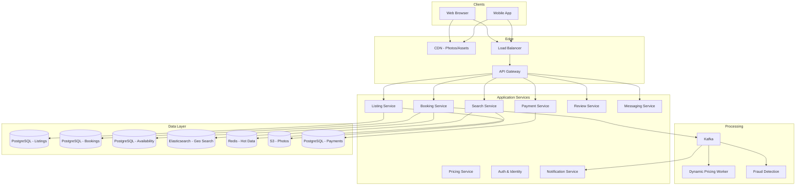
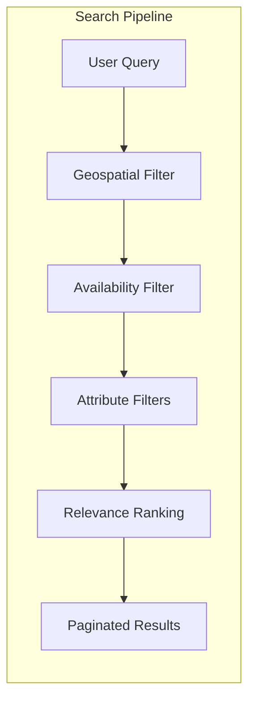
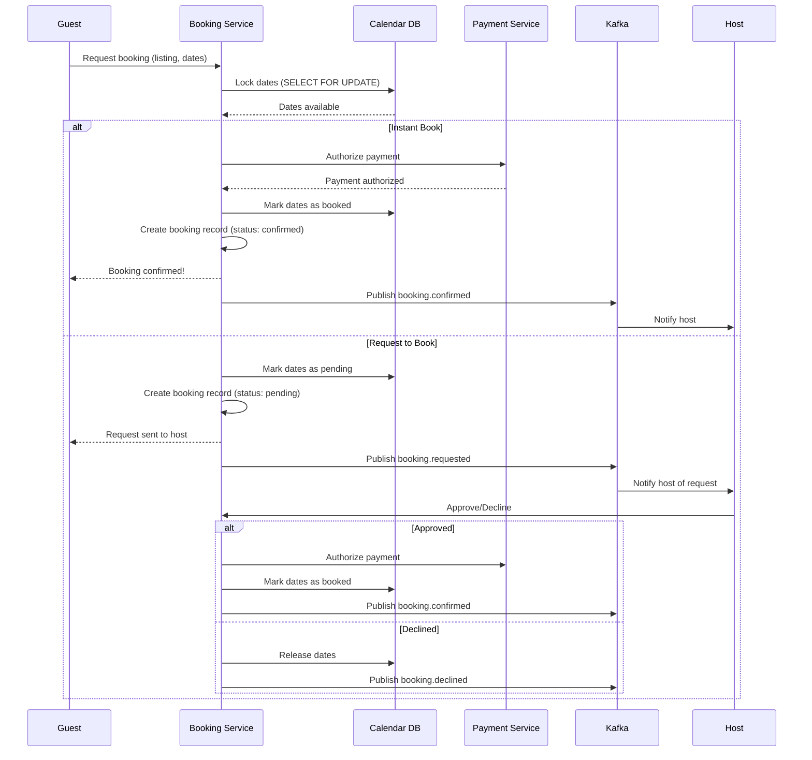
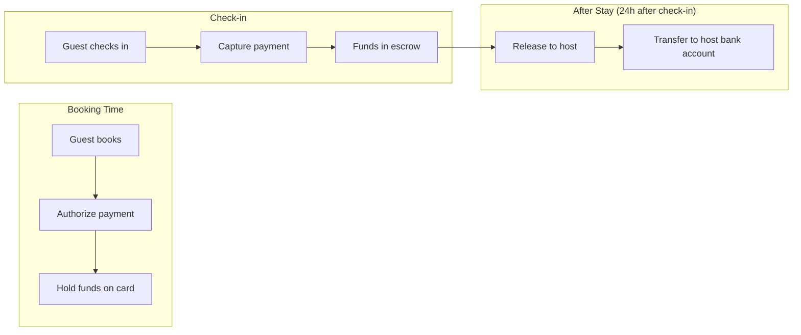

# Design Airbnb

Airbnb is a two-sided marketplace connecting hosts with guests for short-term rentals. Designing it covers listing management, geospatial search with filters, booking with double-booking prevention, payment orchestration (split payments between host and platform), a review system, and dynamic pricing — all at global scale.

---

## 1. Requirements Clarification

### Functional Requirements

1. **Listings** — Hosts create/edit property listings with photos, amenities, pricing, and availability
2. **Search** — Search listings by location, dates, guests, price range, and filters (amenities, property type)
3. **Availability** — Real-time availability calendar per listing
4. **Booking** — Reserve a listing for specific dates with instant book or host approval
5. **Payments** — Guest pays at booking; host is paid after check-in (escrow model)
6. **Reviews** — Mutual reviews (guest reviews host, host reviews guest) after checkout
7. **Messaging** — Host-guest communication before and during booking
8. **Wishlist** — Save listings to wishlists
9. **Host dashboard** — Earnings, calendar management, booking requests
10. **Pricing** — Dynamic pricing suggestions, smart pricing

### Non-Functional Requirements

1. **High availability** — 99.99% for search and booking flows
2. **Low latency** — Search results in < 500ms, booking confirmation in < 2s
3. **Consistency** — Strong consistency for booking (no double-booking)
4. **Scale** — 7M+ listings, 150M users, 2M bookings/night at peak
5. **Global** — Listings in 220+ countries, multi-currency
6. **Fraud prevention** — Detect fraudulent listings and payment fraud

### Clarifying Questions

::: tip Questions to Ask
- Should we support experiences (activities) or just property rentals?
- What payment methods do we need to support?
- Do we need to handle different cancellation policies?
- Should hosts be able to set different prices per night?
- Do we need government ID verification?
- Should we support instant book vs request-to-book?
:::

---

## 2. Back-of-the-Envelope Estimation

### Traffic

- 150M registered users, 30M MAU, 10M DAU
- 7M active listings
- 2M bookings per night (peak season)

$$
\text{Search QPS} = \frac{10M \times 15 \text{ searches/day}}{86400} \approx 1{,}736 \text{ QPS}
$$

$$
\text{Peak Search QPS} \approx 1{,}736 \times 3 = 5{,}208 \text{ QPS}
$$

$$
\text{Booking QPS} = \frac{2M}{86400} \approx 23 \text{ QPS}
$$

$$
\text{Listing View QPS} = \frac{10M \times 30}{86400} \approx 3{,}472 \text{ QPS}
$$

### Storage

**Listings:**

$$
\text{Listing data} = 7M \times 10 \text{ KB} = 70 \text{ GB}
$$

**Photos (average 20 photos per listing, 5 resolutions each):**

$$
\text{Photo storage} = 7M \times 20 \times 5 \times 200 \text{ KB} = 140 \text{ TB}
$$

**Availability calendar (365 days per listing):**

$$
\text{Calendar storage} = 7M \times 365 \times 50 \text{ B} = 127.75 \text{ GB}
$$

**Bookings:**

$$
\text{Annual bookings} = 2M \times 365 = 730M \text{ bookings/year}
$$

$$
\text{Booking storage} = 730M \times 1 \text{ KB} = 730 \text{ GB/year}
$$

### Bandwidth

$$
\text{Search egress} = 5{,}208 \text{ QPS} \times 50 \text{ KB (20 results with thumbnails)} = 260 \text{ MB/s} = 2.1 \text{ Gbps}
$$

---

## 3. High-Level Design



---

## 4. Detailed Design

### 4.1 Geospatial Search

Search is the most critical user-facing flow. Users search by location (city, neighborhood, map viewport), dates, guest count, and numerous filters.



```typescript
class SearchService {
  async searchListings(query: SearchQuery): Promise<SearchResults> {
    const { location, checkIn, checkOut, guests, priceMin, priceMax,
            amenities, propertyType, cursor, limit } = query;

    // 1. Geo search: find listings within the location bounding box
    const geoFilter = location.type === 'city'
      ? { geo_bounding_box: { coordinates: location.bbox } }
      : { geo_distance: { distance: `${location.radius}km`, coordinates: location.center } };

    // 2. Build Elasticsearch query
    const esQuery = {
      bool: {
        must: [
          geoFilter,
          { range: { max_guests: { gte: guests } } },
          { term: { status: 'active' } },
        ],
        filter: [
          ...(priceMin || priceMax ? [{
            range: { price_per_night: {
              ...(priceMin ? { gte: priceMin } : {}),
              ...(priceMax ? { lte: priceMax } : {}),
            }}
          }] : []),
          ...(propertyType ? [{ term: { property_type: propertyType } }] : []),
          ...(amenities?.length ? [{ terms: { amenities: amenities } }] : []),
        ],
      },
    };

    // 3. Execute geo search (returns candidate listing IDs)
    const candidates = await this.elasticsearch.search({
      index: 'listings',
      body: {
        query: esQuery,
        sort: [
          { _score: 'desc' },
          { quality_score: 'desc' },
        ],
        size: limit * 3, // Over-fetch to account for availability filtering
        search_after: cursor ? JSON.parse(cursor) : undefined,
      },
    });

    const candidateIds = candidates.hits.hits.map(h => h._id);

    // 4. Availability filter (check calendar for requested dates)
    const availableIds = await this.checkAvailability(candidateIds, checkIn, checkOut);

    // 5. Fetch full listing data for available listings
    const listings = await this.listingDB.query(`
      SELECT l.*, array_agg(lp.url) as photo_urls,
             COALESCE(r.avg_rating, 0) as avg_rating,
             COALESCE(r.review_count, 0) as review_count
      FROM listings l
      LEFT JOIN listing_photos lp ON l.id = lp.listing_id AND lp.is_primary = true
      LEFT JOIN listing_review_stats r ON l.id = r.listing_id
      WHERE l.id = ANY($1)
    `, [availableIds.slice(0, limit)]);

    // 6. Rank by relevance (combination of quality score, price, rating, distance)
    const ranked = this.rankResults(listings, query);

    return {
      listings: ranked,
      cursor: ranked.length > 0 ? JSON.stringify(candidates.hits.hits[ranked.length - 1].sort) : null,
      totalCount: candidates.hits.total.value,
    };
  }

  private async checkAvailability(listingIds: string[], checkIn: string, checkOut: string): Promise<string[]> {
    // Check the availability calendar for each listing
    const result = await this.calendarDB.query(`
      SELECT listing_id FROM listing_availability
      WHERE listing_id = ANY($1)
        AND date >= $2 AND date < $3
        AND is_available = true
      GROUP BY listing_id
      HAVING COUNT(*) = ($3::date - $2::date)
    `, [listingIds, checkIn, checkOut]);

    return result.map(r => r.listing_id);
  }
}
```

**Geospatial indexing strategy:**

| Approach | Pros | Cons | Best For |
|----------|------|------|----------|
| Geohash | Simple prefix matching, cacheable | Boundary issues | Approximate proximity |
| Quadtree | Adaptive density, efficient | Complex implementation | Variable density regions |
| R-tree | Optimal for range queries | Write-heavy updates | Static datasets |
| Elasticsearch geo | Built-in, battle-tested | Extra infra | **Airbnb's use case** |

### 4.2 Booking System (Double-Booking Prevention)



```typescript
class BookingService {
  async createBooking(params: CreateBookingParams): Promise<Booking> {
    const { listingId, guestId, checkIn, checkOut, guests, totalPrice } = params;

    // Use a database transaction with row-level locking
    return this.db.transaction(async (trx) => {
      // 1. Lock the availability rows for the requested dates
      const availability = await trx.query(`
        SELECT date, is_available, price
        FROM listing_availability
        WHERE listing_id = $1 AND date >= $2 AND date < $3
        FOR UPDATE
      `, [listingId, checkIn, checkOut]);

      // 2. Verify all dates are available
      const requestedNights = this.daysBetween(checkIn, checkOut);
      if (availability.length !== requestedNights) {
        throw new ConflictError('Some dates are not available');
      }
      if (availability.some(d => !d.is_available)) {
        throw new ConflictError('Selected dates are already booked');
      }

      // 3. Calculate total price (sum of nightly rates + cleaning + service fee)
      const nightlyTotal = availability.reduce((sum, d) => sum + d.price, 0);
      const listing = await trx.query('SELECT * FROM listings WHERE id = $1', [listingId]);
      const cleaningFee = listing.cleaning_fee;
      const serviceFee = Math.round(nightlyTotal * 0.12); // 12% service fee
      const hostPayout = nightlyTotal + cleaningFee - Math.round(nightlyTotal * 0.03); // 3% host fee
      const guestTotal = nightlyTotal + cleaningFee + serviceFee;

      // 4. Create booking record
      const booking = await trx.query(`
        INSERT INTO bookings
          (listing_id, guest_id, host_id, check_in, check_out,
           num_guests, nightly_total, cleaning_fee, service_fee,
           guest_total, host_payout, status)
        VALUES ($1, $2, $3, $4, $5, $6, $7, $8, $9, $10, $11, $12)
        RETURNING *
      `, [listingId, guestId, listing.host_id, checkIn, checkOut,
          guests, nightlyTotal, cleaningFee, serviceFee,
          guestTotal, hostPayout, listing.instant_book ? 'confirmed' : 'pending']);

      // 5. Mark dates as booked (or pending)
      await trx.query(`
        UPDATE listing_availability
        SET is_available = false, booking_id = $1
        WHERE listing_id = $2 AND date >= $3 AND date < $4
      `, [booking.id, listingId, checkIn, checkOut]);

      // 6. If instant book, authorize payment immediately
      if (listing.instant_book) {
        await this.paymentService.authorizePayment({
          bookingId: booking.id,
          amount: guestTotal,
          currency: listing.currency,
          guestId,
        });
      }

      return booking;
    });
  }
}
```

::: warning Double-Booking Prevention
The key to preventing double bookings is `SELECT FOR UPDATE` on the availability rows within a transaction. This acquires row-level locks that prevent concurrent bookings for the same dates. Any other transaction trying to book overlapping dates will block until the first transaction commits or rolls back. Use a lock timeout to prevent indefinite waiting.
:::

### 4.3 Payment Flow (Escrow Model)



```typescript
class PaymentService {
  async authorizePayment(params: AuthorizeParams): Promise<PaymentAuth> {
    const { bookingId, amount, currency, guestId } = params;

    // 1. Get guest's payment method
    const paymentMethod = await this.getDefaultPaymentMethod(guestId);

    // 2. Create payment intent with Stripe (authorize, don't capture)
    const paymentIntent = await this.stripe.paymentIntents.create({
      amount: amount * 100, // cents
      currency,
      customer: paymentMethod.stripeCustomerId,
      payment_method: paymentMethod.stripePaymentMethodId,
      capture_method: 'manual',  // Authorize only, capture later
      metadata: { bookingId },
    });

    // 3. Record payment authorization
    await this.db.query(`
      INSERT INTO payments
        (booking_id, stripe_payment_intent_id, amount, currency, status)
      VALUES ($1, $2, $3, $4, 'authorized')
    `, [bookingId, paymentIntent.id, amount, currency]);

    return { paymentIntentId: paymentIntent.id, status: 'authorized' };
  }

  async captureAndPayout(bookingId: string): Promise<void> {
    // Called 24 hours after check-in
    const booking = await this.getBooking(bookingId);
    const payment = await this.getPayment(bookingId);

    // 1. Capture the authorized payment
    await this.stripe.paymentIntents.capture(payment.stripe_payment_intent_id);

    // 2. Schedule payout to host
    await this.stripe.transfers.create({
      amount: booking.host_payout * 100,
      currency: booking.currency,
      destination: booking.host_stripe_account_id,
      metadata: { bookingId },
    });

    // 3. Update payment status
    await this.db.query(
      `UPDATE payments SET status = 'captured', captured_at = NOW() WHERE booking_id = $1`,
      [bookingId]
    );
  }
}
```

### 4.4 Review System

```typescript
class ReviewService {
  async submitReview(params: SubmitReviewParams): Promise<Review> {
    const { bookingId, reviewerId, rating, text, categoryRatings } = params;

    // 1. Verify the booking is complete (past checkout date)
    const booking = await this.bookingService.getBooking(bookingId);
    if (new Date(booking.check_out) > new Date()) {
      throw new Error('Can only review after checkout');
    }

    // 2. Verify reviewer is either the guest or host
    const isGuest = booking.guest_id === reviewerId;
    const isHost = booking.host_id === reviewerId;
    if (!isGuest && !isHost) throw new ForbiddenError();

    // 3. Check review window (14 days after checkout)
    const daysSinceCheckout = this.daysBetween(booking.check_out, new Date());
    if (daysSinceCheckout > 14) throw new Error('Review window has closed');

    // 4. Create review (initially hidden until both parties review or window closes)
    const review = await this.db.query(`
      INSERT INTO reviews
        (booking_id, reviewer_id, reviewee_id, reviewer_type, rating,
         text, cleanliness, communication, check_in, accuracy, location, value)
      VALUES ($1, $2, $3, $4, $5, $6, $7, $8, $9, $10, $11, $12)
      RETURNING *
    `, [bookingId, reviewerId,
        isGuest ? booking.host_id : booking.guest_id,
        isGuest ? 'guest' : 'host',
        rating, text,
        categoryRatings.cleanliness, categoryRatings.communication,
        categoryRatings.checkIn, categoryRatings.accuracy,
        categoryRatings.location, categoryRatings.value]);

    // 5. Check if both parties have reviewed (then reveal both)
    const bothReviewed = await this.checkBothReviewed(bookingId);
    if (bothReviewed) {
      await this.revealReviews(bookingId);
      await this.updateListingRatingStats(booking.listing_id);
    }

    return review;
  }
}
```

---

## 5. Data Model

### PostgreSQL Schema

```sql
-- Listings
CREATE TABLE listings (
    id              BIGSERIAL PRIMARY KEY,
    host_id         BIGINT NOT NULL,
    title           VARCHAR(255) NOT NULL,
    description     TEXT,
    property_type   VARCHAR(50),               -- apartment, house, villa, cabin, etc.
    room_type       VARCHAR(50),               -- entire_place, private_room, shared_room
    max_guests      INT NOT NULL,
    bedrooms        INT,
    beds            INT,
    bathrooms       DECIMAL(3,1),
    amenities       TEXT[],                    -- {'wifi', 'pool', 'kitchen', 'parking'}
    latitude        DECIMAL(10, 7) NOT NULL,
    longitude       DECIMAL(10, 7) NOT NULL,
    address         JSONB,                     -- {street, city, state, country, zip}
    price_per_night DECIMAL(10, 2) NOT NULL,
    cleaning_fee    DECIMAL(10, 2) DEFAULT 0,
    currency        CHAR(3) DEFAULT 'USD',
    min_nights      INT DEFAULT 1,
    max_nights      INT DEFAULT 365,
    instant_book    BOOLEAN DEFAULT FALSE,
    cancellation_policy VARCHAR(20) DEFAULT 'moderate',
    status          VARCHAR(20) DEFAULT 'active',
    quality_score   DECIMAL(5, 3) DEFAULT 0,   -- ML-computed quality score
    created_at      TIMESTAMP WITH TIME ZONE DEFAULT NOW(),
    updated_at      TIMESTAMP WITH TIME ZONE DEFAULT NOW()
);

CREATE INDEX idx_listings_host ON listings(host_id);
CREATE INDEX idx_listings_location ON listings USING GIST (
    ST_SetSRID(ST_MakePoint(longitude, latitude), 4326)
);

-- Listing Availability Calendar
CREATE TABLE listing_availability (
    listing_id      BIGINT NOT NULL,
    date            DATE NOT NULL,
    is_available    BOOLEAN DEFAULT TRUE,
    price           DECIMAL(10, 2),            -- custom price for this date
    min_nights      INT,                       -- custom min nights
    booking_id      BIGINT,
    PRIMARY KEY (listing_id, date)
);

-- Bookings
CREATE TABLE bookings (
    id              BIGSERIAL PRIMARY KEY,
    listing_id      BIGINT NOT NULL,
    guest_id        BIGINT NOT NULL,
    host_id         BIGINT NOT NULL,
    check_in        DATE NOT NULL,
    check_out       DATE NOT NULL,
    num_guests      INT NOT NULL,
    nightly_total   DECIMAL(10, 2),
    cleaning_fee    DECIMAL(10, 2),
    service_fee     DECIMAL(10, 2),
    guest_total     DECIMAL(10, 2),
    host_payout     DECIMAL(10, 2),
    currency        CHAR(3),
    status          VARCHAR(20) DEFAULT 'pending', -- pending, confirmed, cancelled, completed
    cancelled_at    TIMESTAMP WITH TIME ZONE,
    cancellation_reason TEXT,
    created_at      TIMESTAMP WITH TIME ZONE DEFAULT NOW()
);

CREATE INDEX idx_bookings_listing ON bookings(listing_id, check_in);
CREATE INDEX idx_bookings_guest ON bookings(guest_id, created_at DESC);
CREATE INDEX idx_bookings_host ON bookings(host_id, created_at DESC);
CREATE INDEX idx_bookings_status ON bookings(status, check_in)
    WHERE status IN ('confirmed', 'pending');

-- Reviews
CREATE TABLE reviews (
    id              BIGSERIAL PRIMARY KEY,
    booking_id      BIGINT NOT NULL,
    reviewer_id     BIGINT NOT NULL,
    reviewee_id     BIGINT NOT NULL,
    reviewer_type   VARCHAR(10),               -- 'guest' or 'host'
    rating          DECIMAL(2, 1) NOT NULL,    -- 1.0 to 5.0
    text            TEXT,
    cleanliness     DECIMAL(2, 1),
    communication   DECIMAL(2, 1),
    check_in        DECIMAL(2, 1),
    accuracy        DECIMAL(2, 1),
    location        DECIMAL(2, 1),
    value           DECIMAL(2, 1),
    is_visible      BOOLEAN DEFAULT FALSE,     -- revealed when both review
    created_at      TIMESTAMP WITH TIME ZONE DEFAULT NOW()
);

CREATE INDEX idx_reviews_listing ON reviews(booking_id);
CREATE INDEX idx_reviews_reviewee ON reviews(reviewee_id, created_at DESC)
    WHERE is_visible = true;

-- Listing Photos
CREATE TABLE listing_photos (
    id              BIGSERIAL PRIMARY KEY,
    listing_id      BIGINT NOT NULL,
    url             VARCHAR(500) NOT NULL,
    caption         VARCHAR(255),
    display_order   INT DEFAULT 0,
    is_primary      BOOLEAN DEFAULT FALSE,
    width           INT,
    height          INT,
    created_at      TIMESTAMP WITH TIME ZONE DEFAULT NOW()
);

CREATE INDEX idx_photos_listing ON listing_photos(listing_id, display_order);

-- Payments
CREATE TABLE payments (
    id                      BIGSERIAL PRIMARY KEY,
    booking_id              BIGINT NOT NULL UNIQUE,
    stripe_payment_intent_id VARCHAR(255),
    amount                  DECIMAL(10, 2),
    currency                CHAR(3),
    status                  VARCHAR(20),        -- authorized, captured, refunded
    captured_at             TIMESTAMP WITH TIME ZONE,
    created_at              TIMESTAMP WITH TIME ZONE DEFAULT NOW()
);
```

### Elasticsearch Listing Index

```typescript
const listingMapping = {
  properties: {
    coordinates: { type: 'geo_point' },
    title: { type: 'text', analyzer: 'standard' },
    description: { type: 'text' },
    property_type: { type: 'keyword' },
    room_type: { type: 'keyword' },
    max_guests: { type: 'integer' },
    price_per_night: { type: 'float' },
    amenities: { type: 'keyword' },  // array of keywords for term filters
    bedrooms: { type: 'integer' },
    bathrooms: { type: 'float' },
    quality_score: { type: 'float' },
    avg_rating: { type: 'float' },
    review_count: { type: 'integer' },
    instant_book: { type: 'boolean' },
    status: { type: 'keyword' },
    city: { type: 'keyword' },
    country: { type: 'keyword' },
  },
};
```

---

## 6. API Design

```typescript
// Search
// GET /api/v1/search?location=Paris&checkIn=2026-06-01&checkOut=2026-06-05
//   &guests=2&priceMin=50&priceMax=200&amenities=wifi,pool&type=entire_place
//   &cursor=abc&limit=20
interface SearchResponse {
  listings: ListingSummary[];
  cursor: string | null;
  totalCount: number;
  mapBounds: { ne: LatLng; sw: LatLng };
}

// Listing details
// GET /api/v1/listings/:id
// GET /api/v1/listings/:id/availability?startDate=2026-06-01&endDate=2026-07-01
// GET /api/v1/listings/:id/reviews?cursor=abc&limit=10

// Booking
// POST /api/v1/bookings
interface CreateBookingRequest {
  listingId: string;
  checkIn: string;      // YYYY-MM-DD
  checkOut: string;
  guests: number;
  paymentMethodId: string;
  message?: string;     // message to host
}

interface BookingResponse {
  id: string;
  status: 'confirmed' | 'pending';
  listing: ListingSummary;
  checkIn: string;
  checkOut: string;
  pricing: {
    nightlyRate: number;
    nights: number;
    nightlyTotal: number;
    cleaningFee: number;
    serviceFee: number;
    total: number;
    currency: string;
  };
  cancellationPolicy: CancellationPolicy;
}

// GET /api/v1/bookings?status=upcoming&cursor=abc
// POST /api/v1/bookings/:id/cancel
// POST /api/v1/bookings/:id/review

// Host endpoints
// POST /api/v1/listings (create listing)
// PUT /api/v1/listings/:id
// PUT /api/v1/listings/:id/availability (update calendar)
// GET /api/v1/host/earnings?startDate=2026-01-01&endDate=2026-12-31
// POST /api/v1/bookings/:id/approve (for request-to-book)
// POST /api/v1/bookings/:id/decline
```

---

## 7. Scaling

### Search Scaling

| Challenge | Solution |
|-----------|----------|
| Geo query performance | Elasticsearch geo_point with bounding box queries |
| Availability checking | Pre-filter by geo, then batch-check availability in Calendar DB |
| Filter combinations | Denormalize key attributes into Elasticsearch for single-query filtering |
| Search result caching | Cache popular searches (city + dates) in Redis for 5 min |
| Map view performance | Use geohash aggregations for clustered markers |

### Booking Database Scaling

```
Listings table:         Shard by region/country (geo-colocation)
Availability table:     Shard by listing_id (co-locate calendar with listing)
Bookings table:         Shard by listing_id (for availability checks)
                        Secondary index on guest_id (for guest history)

Read replicas: 3 per shard for read-heavy search patterns
```

### Calendar Availability Optimization

```typescript
// Pre-populate 365 days of availability for each listing
// Batch update when host changes pricing or blocks dates
class CalendarService {
  async updateAvailability(listingId: string, updates: DateUpdate[]): Promise<void> {
    // Use UPSERT for bulk calendar updates
    const values = updates.map(u =>
      `(${listingId}, '${u.date}', ${u.available}, ${u.price}, ${u.minNights})`
    ).join(',');

    await this.db.query(`
      INSERT INTO listing_availability (listing_id, date, is_available, price, min_nights)
      VALUES ${values}
      ON CONFLICT (listing_id, date)
      DO UPDATE SET
        is_available = EXCLUDED.is_available,
        price = EXCLUDED.price,
        min_nights = EXCLUDED.min_nights
    `);

    // Invalidate search cache for this listing's region
    await this.invalidateSearchCache(listingId);
  }
}
```

---

## 8. Trade-offs & Alternatives

### Availability Checking: Calendar Table vs Booking Ranges

| Approach | Query Speed | Storage | Flexibility |
|----------|------------|---------|-------------|
| **Calendar table** (one row per date) | Fast — direct lookup | Higher (365 rows/listing) | Easy per-date pricing |
| Booking ranges (start/end only) | Slower — range overlap queries | Lower | Harder per-date pricing |
| Bitmap (bit per day) | Very fast | Minimal | No per-date metadata |

**Decision:** Calendar table. The storage overhead is acceptable (127 GB total), and it enables per-date pricing, minimum night overrides, and simple availability queries.

### Search: Elasticsearch vs PostgreSQL PostGIS

| Aspect | Elasticsearch (chosen) | PostgreSQL + PostGIS |
|--------|----------------------|---------------------|
| Geo queries | Excellent | Excellent |
| Full-text search | Built-in | Requires pg_trgm/tsvector |
| Filtering | Fast faceted filtering | Slower multi-column filters |
| Scalability | Horizontally scalable | Vertical + read replicas |
| Consistency | Eventually consistent | Strongly consistent |
| **Verdict** | Better for search workload | Better for transactional data |

**Decision:** Use both. PostgreSQL as the source of truth for listing data. Elasticsearch as the search index (synced via Kafka). Writes go to PostgreSQL, reads (search) go to Elasticsearch.

### Booking Consistency: Optimistic vs Pessimistic Locking

| Approach | Throughput | Race Conditions | UX |
|----------|-----------|-----------------|-----|
| Pessimistic (SELECT FOR UPDATE) | Lower | Prevented | Brief wait on contention |
| Optimistic (version check) | Higher | Retry on conflict | "Dates no longer available" error |

**Decision:** Pessimistic locking for bookings. The write volume is low (~23 QPS), so lock contention is rare. Correctness (no double-booking) is more important than throughput.

::: warning Critical: No Double Bookings
Double bookings are unacceptable — a guest arriving to find their listing already occupied is a catastrophic failure. Use pessimistic locking within a database transaction. The availability calendar table with row-level locks on the specific date rows ensures exactly one booking succeeds for any given dates.
:::

---

## 9. Common Interview Questions

::: details "How do you handle search ranking when a listing has no reviews?"
Use a quality score model that considers multiple signals beyond reviews: photo quality (ML-scored), listing completeness, host response rate, host response time, booking acceptance rate, and price competitiveness relative to similar listings. New listings get a temporary boost ("new listing" badge) to help them gather initial reviews. This cold-start strategy ensures new hosts can compete with established ones.
:::

::: details "How do you prevent fraud (fake listings, payment fraud)?"
Multi-layered approach: (1) Identity verification — government ID and selfie match for hosts. (2) Listing verification — automated photo analysis for stolen/stock photos. (3) Payment fraud — partner with Stripe for card fraud detection; hold payouts for 24h after check-in. (4) Behavioral signals — flag listings with unusually high cancellation rates. (5) Guest reviews — guests report listing accuracy issues, which affect listing quality score. (6) Price anomaly detection — flag suspiciously low prices that may indicate scams.
:::

::: details "How do you handle cancellations and refunds?"
Support multiple cancellation policies (flexible, moderate, strict) configured per listing. Each policy defines refund percentages based on how far in advance the cancellation occurs. On cancellation: (1) Release the held dates back to available. (2) Process refund based on policy. (3) If the payment was only authorized (not captured), simply cancel the authorization. (4) If already captured, issue a partial/full refund via Stripe. (5) Emit cancellation event for analytics and host notification.
:::

::: details "How do you support dynamic pricing?"
A pricing service analyzes supply and demand signals: (1) Local event calendars (concerts, conferences). (2) Booking velocity (how fast listings in the area are being booked). (3) Seasonal trends (historical data). (4) Competitor pricing (similar listings nearby). (5) Day of week patterns. The ML model suggests optimal nightly prices to hosts. Hosts can accept smart pricing (auto-adjusts) or set their own prices. The pricing worker runs daily to update suggestions.
:::

::: details "How do you implement the map-based search experience?"
When the user pans/zooms the map, send the viewport bounding box coordinates to the search API. Use Elasticsearch geo_bounding_box query to find listings within the viewport. For zoomed-out views with many results, use geohash grid aggregation to cluster listings into groups (show "50+ listings" markers). As the user zooms in, clusters break into individual markers. Cache viewport queries for common zoom levels and popular areas.
:::

### Time Allocation (45-minute interview)

| Phase | Time | Focus |
|-------|------|-------|
| Requirements | 4 min | Two-sided marketplace, search, booking, payments |
| Estimation | 3 min | 7M listings, search QPS, storage |
| High-level design | 8 min | Services, data stores, search pipeline |
| Geo search | 10 min | Elasticsearch, availability filtering, ranking |
| Booking flow | 10 min | Double-booking prevention, locking, payment |
| Payment & reviews | 5 min | Escrow model, mutual reviews |
| Scaling | 5 min | Search caching, calendar optimization |

---

## Summary

| Component | Technology | Scale |
|-----------|-----------|-------|
| Search | Elasticsearch (geo + filters) | 5K peak QPS |
| Listing Data | PostgreSQL | 7M listings |
| Availability | PostgreSQL calendar table (row-level locks) | 2.5B date rows |
| Booking | PostgreSQL with pessimistic locking | 2M bookings/night |
| Payments | Stripe (authorize -> capture -> payout) | Escrow model |
| Photos | S3 + CDN (5 resolutions) | 140 TB |
| Reviews | PostgreSQL + aggregate cache | Mutual reveal model |
| Cache | Redis (search results, listing data) | Hot data caching |
| Pricing | ML model + Kafka workers | Daily price updates |
