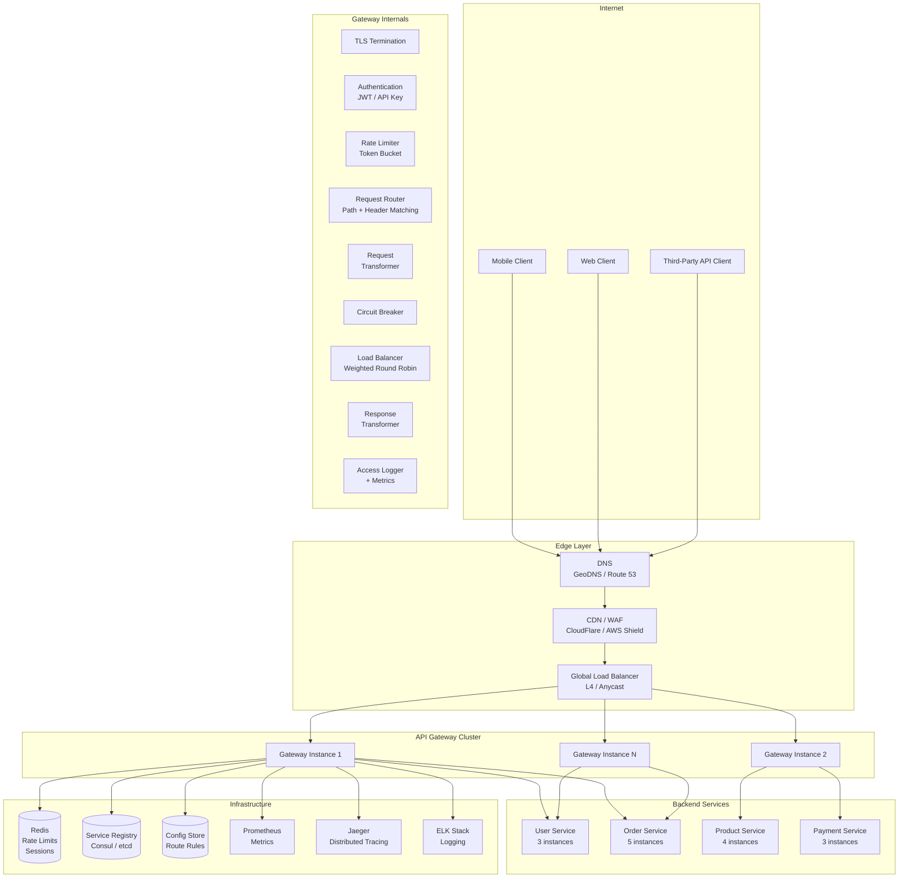
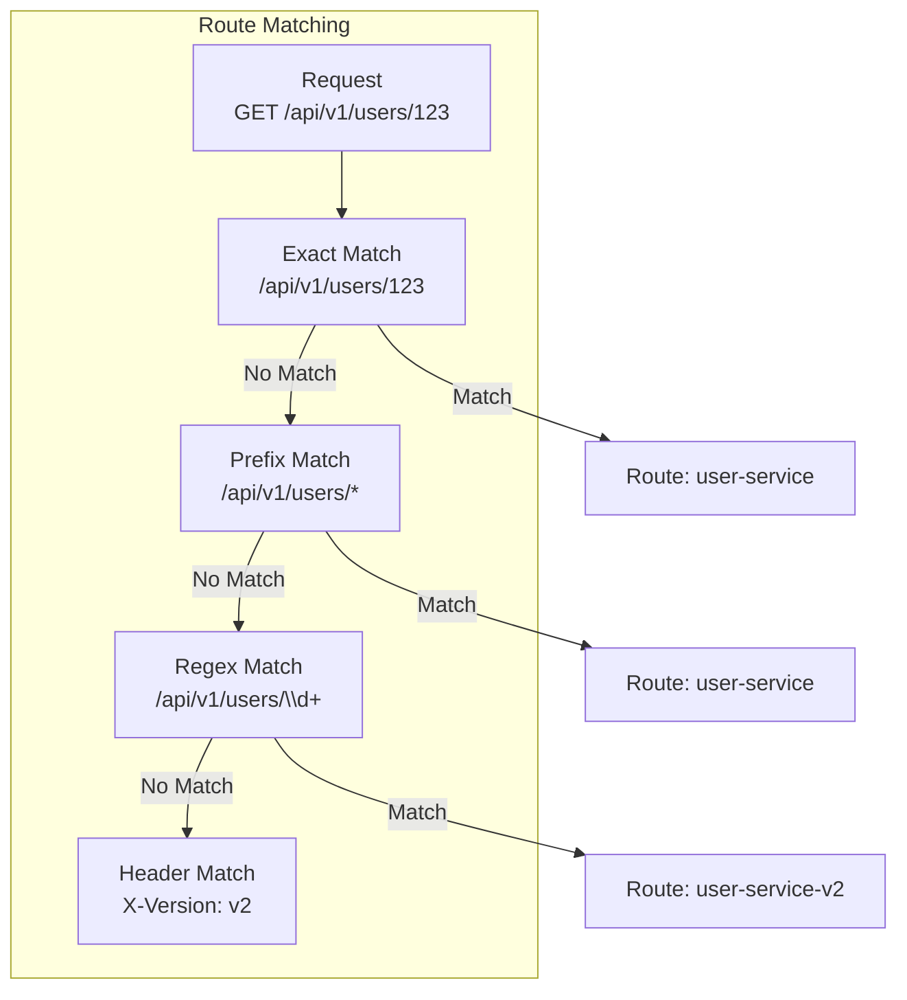
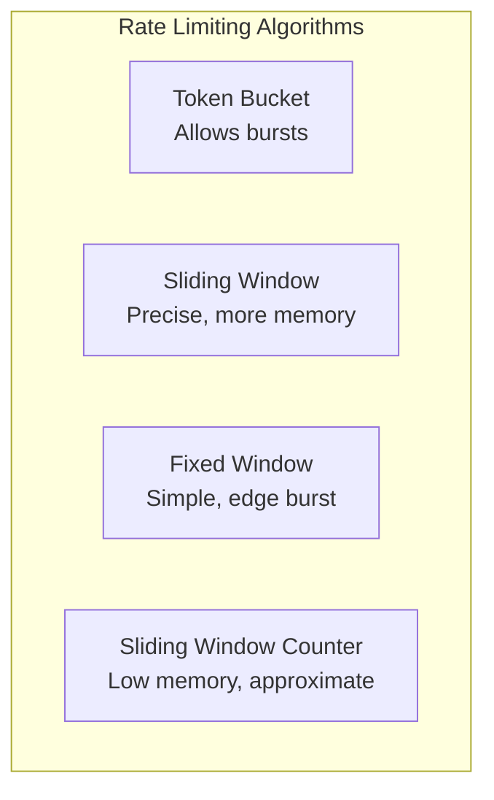
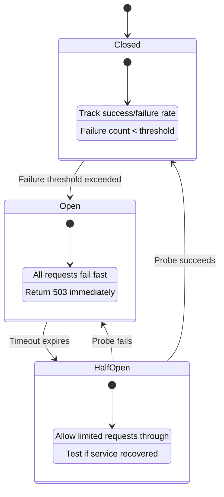
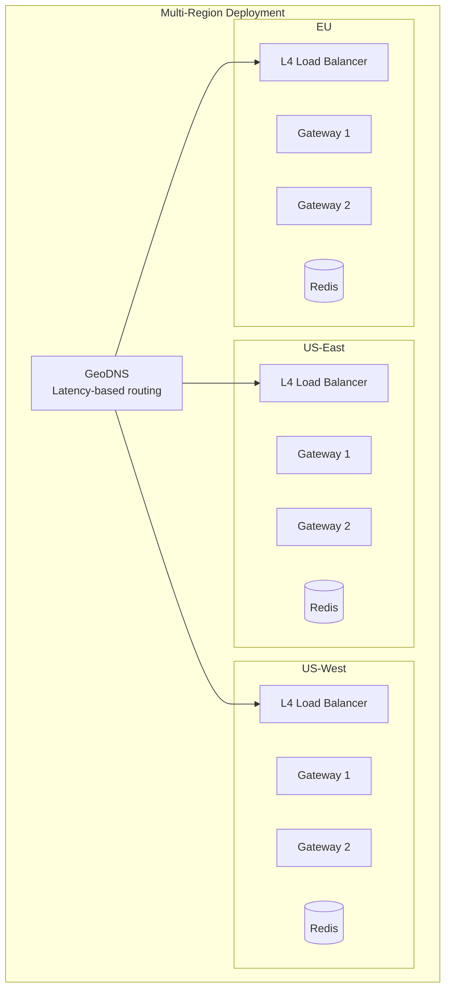

# Design an API Gateway

## 1. Problem Statement & Requirements

### Functional Requirements

| # | Requirement | Details |
|---|-------------|---------|
| FR-1 | Request Routing | Route requests to appropriate backend services based on path, headers, method |
| FR-2 | Rate Limiting | Enforce per-client, per-API, and global rate limits |
| FR-3 | Authentication | Validate JWT tokens, API keys, OAuth 2.0 |
| FR-4 | Authorization | Enforce RBAC/ABAC policies per endpoint |
| FR-5 | Request Transformation | Rewrite paths, add/remove headers, transform payloads |
| FR-6 | Response Transformation | Filter fields, rename fields, aggregate responses |
| FR-7 | Circuit Breaking | Detect failing services and stop routing to them |
| FR-8 | Load Balancing | Distribute traffic across service instances |
| FR-9 | Service Discovery | Dynamically discover backend service instances |
| FR-10 | Observability | Logging, metrics, distributed tracing |

### Non-Functional Requirements

| # | Requirement | Target |
|---|-------------|--------|
| NFR-1 | Latency | < 5ms added latency (P99) |
| NFR-2 | Throughput | 100K+ requests/second per instance |
| NFR-3 | Availability | 99.999% uptime |
| NFR-4 | Scalability | Horizontal scaling, stateless instances |
| NFR-5 | Extensibility | Plugin architecture for custom logic |
| NFR-6 | Security | TLS termination, DDoS protection, WAF |

---

## 2. Back-of-Envelope Estimation

### Traffic Scale

$$
\text{Total API Requests/Day} = 10B
$$

$$
\text{Average QPS} = \frac{10B}{86{,}400} \approx 115{,}740 \text{ req/s}
$$

$$
\text{Peak QPS} = 115{,}740 \times 5 = 578{,}700 \text{ req/s}
$$

### Gateway Instance Count

$$
\text{Capacity per Instance} = 50{,}000 \text{ req/s}
$$

$$
\text{Min Instances} = \lceil 578{,}700 / 50{,}000 \rceil = 12 \text{ instances}
$$

$$
\text{With 50\% headroom} = 12 \times 1.5 = 18 \text{ instances}
$$

### Latency Budget

$$
\text{Total Added Latency Budget} = 5 \text{ ms (P99)}
$$

| Component | Budget |
|-----------|--------|
| TLS termination | 0.5 ms |
| Authentication (JWT validation) | 0.5 ms |
| Rate limit check | 0.2 ms |
| Routing decision | 0.1 ms |
| Request transformation | 0.2 ms |
| Proxy to backend | 2.0 ms |
| Response transformation | 0.2 ms |
| Logging + metrics | 0.3 ms |
| Network overhead | 1.0 ms |

### Rate Limiting Data

$$
\text{Unique API Clients} = 10M
$$

$$
\text{Rate Limit Entry Size} = 50 \text{ bytes (client ID + counter + timestamp)}
$$

$$
\text{Rate Limit Storage} = 10M \times 50 \text{ B} = 500 \text{ MB (fits in Redis)}
$$

---

## 3. High-Level Design

### Architecture Diagram



### Request Processing Pipeline


### API Design (Gateway Configuration)

```typescript
// Route Configuration API
POST /admin/routes
     // Body: { path: "/api/v1/users/*", serviceId: "user-service",
     //         methods: ["GET", "POST"], stripPrefix: true }
GET    /admin/routes
PUT    /admin/routes/{routeId}
DELETE /admin/routes/{routeId}

// Rate Limit Configuration
POST /admin/rate-limits
     // Body: { name: "default", limit: 1000, window: 60, key: "client_id" }
GET  /admin/rate-limits

// Service Registration
POST /admin/services
     // Body: { name: "user-service", instances: ["10.0.1.1:8080", "10.0.1.2:8080"],
     //         healthCheck: { path: "/health", interval: 10 } }

// Plugin Configuration
POST /admin/plugins
     // Body: { name: "jwt-auth", config: { secret: "...", algorithm: "RS256" },
     //         routes: ["user-routes"] }

// Observability
GET /admin/metrics
GET /admin/health
GET /admin/routes/{routeId}/stats
```

---

## 4. Database Schema (Configuration Store)

### Routes Table

```sql
CREATE TABLE routes (
    route_id        UUID PRIMARY KEY DEFAULT gen_random_uuid(),
    name            VARCHAR(100) UNIQUE NOT NULL,
    path_pattern    VARCHAR(500) NOT NULL,   -- "/api/v1/users/*" or regex
    methods         VARCHAR(10)[] NOT NULL,   -- ['GET', 'POST', 'PUT']
    service_id      UUID NOT NULL REFERENCES services(service_id),
    strip_prefix    BOOLEAN DEFAULT TRUE,
    priority        INT DEFAULT 0,           -- Higher = matched first
    timeout_ms      INT DEFAULT 30000,
    retry_count     INT DEFAULT 1,
    retry_on        VARCHAR(20)[] DEFAULT ARRAY['5xx', 'reset', 'connect-failure'],
    enabled         BOOLEAN DEFAULT TRUE,
    created_at      TIMESTAMPTZ DEFAULT NOW(),
    updated_at      TIMESTAMPTZ DEFAULT NOW()
);

CREATE INDEX idx_routes_path ON routes(path_pattern);
CREATE INDEX idx_routes_priority ON routes(priority DESC);
```

### Services Table

```sql
CREATE TABLE services (
    service_id      UUID PRIMARY KEY DEFAULT gen_random_uuid(),
    name            VARCHAR(100) UNIQUE NOT NULL,
    protocol        VARCHAR(10) DEFAULT 'http',  -- http, https, grpc
    discovery_type  VARCHAR(20) DEFAULT 'static', -- static, consul, kubernetes
    instances       JSONB, -- [{"host": "10.0.1.1", "port": 8080, "weight": 100}]
    health_check    JSONB, -- {"path": "/health", "interval": 10, "timeout": 5}
    lb_algorithm    VARCHAR(20) DEFAULT 'round_robin',
    -- round_robin, weighted_round_robin, least_connections, ip_hash
    circuit_breaker JSONB, -- {"threshold": 5, "timeout": 30, "halfOpen": 3}
    created_at      TIMESTAMPTZ DEFAULT NOW()
);
```

### Rate Limit Rules Table

```sql
CREATE TABLE rate_limit_rules (
    rule_id         UUID PRIMARY KEY DEFAULT gen_random_uuid(),
    name            VARCHAR(100) NOT NULL,
    route_id        UUID REFERENCES routes(route_id), -- NULL = global
    key_type        VARCHAR(20) NOT NULL,
    -- client_id, ip, api_key, user_id, header:{name}
    limit_count     INT NOT NULL,           -- Max requests
    window_seconds  INT NOT NULL,           -- Time window
    burst           INT,                    -- Max burst (token bucket)
    action          VARCHAR(20) DEFAULT 'reject', -- reject, queue, throttle
    enabled         BOOLEAN DEFAULT TRUE,
    created_at      TIMESTAMPTZ DEFAULT NOW()
);
```

### API Keys Table

```sql
CREATE TABLE api_keys (
    key_id          UUID PRIMARY KEY DEFAULT gen_random_uuid(),
    key_hash        VARCHAR(64) UNIQUE NOT NULL, -- SHA-256 of API key
    key_prefix      VARCHAR(8) NOT NULL,  -- First 8 chars for identification
    client_id       UUID NOT NULL,
    client_name     VARCHAR(100),
    scopes          TEXT[],               -- ['read:users', 'write:orders']
    rate_limit_tier VARCHAR(20) DEFAULT 'standard', -- free, standard, premium
    expires_at      TIMESTAMPTZ,
    enabled         BOOLEAN DEFAULT TRUE,
    created_at      TIMESTAMPTZ DEFAULT NOW(),
    last_used_at    TIMESTAMPTZ
);

CREATE INDEX idx_api_keys_hash ON api_keys(key_hash);
CREATE INDEX idx_api_keys_client ON api_keys(client_id);
```

---

## 5. Detailed Component Design

### 5.1 Request Routing

The router matches incoming requests to backend services based on configurable rules.



```typescript
interface RouteRule {
  routeId: string;
  pathPattern: string;
  methods: string[];
  serviceId: string;
  priority: number;
  headers?: Record<string, string>;
  queryParams?: Record<string, string>;
  predicates?: RoutePredicate[];
  filters?: RouteFilter[];
  stripPrefix: boolean;
  timeout: number;
}

class RequestRouter {
  private routes: RouteRule[] = [];
  private compiledRoutes: CompiledRoute[] = [];

  // Load routes from config store (cached, refreshed periodically)
  async loadRoutes(): Promise<void> {
    const routes = await this.configStore.getRoutes();
    this.routes = routes.sort((a, b) => b.priority - a.priority);
    this.compiledRoutes = routes.map(r => this.compileRoute(r));
  }

  resolve(request: IncomingRequest): RouteMatch | null {
    for (const route of this.compiledRoutes) {
      if (this.matches(route, request)) {
        return {
          route: route.original,
          pathParams: route.extractParams(request.path),
          targetPath: route.original.stripPrefix
            ? this.stripPrefix(request.path, route.original.pathPattern)
            : request.path,
        };
      }
    }
    return null; // 404
  }

  private matches(route: CompiledRoute, request: IncomingRequest): boolean {
    // Method check
    if (!route.original.methods.includes(request.method)) return false;

    // Path check
    if (!route.pathRegex.test(request.path)) return false;

    // Header check
    if (route.original.headers) {
      for (const [header, value] of Object.entries(route.original.headers)) {
        if (request.headers[header.toLowerCase()] !== value) return false;
      }
    }

    // Custom predicates
    if (route.original.predicates) {
      for (const predicate of route.original.predicates) {
        if (!this.evaluatePredicate(predicate, request)) return false;
      }
    }

    return true;
  }

  private compileRoute(route: RouteRule): CompiledRoute {
    // Convert path pattern to regex
    // /api/v1/users/{userId}/orders -> /api/v1/users/([^/]+)/orders
    const regexStr = route.pathPattern
      .replace(/\{(\w+)\}/g, '(?<$1>[^/]+)')  // Named params
      .replace(/\*/g, '.*');                     // Wildcards

    return {
      original: route,
      pathRegex: new RegExp(`^${regexStr}$`),
      extractParams: (path: string) => {
        const match = new RegExp(`^${regexStr}$`).exec(path);
        return match?.groups ?? {};
      },
    };
  }

  // A/B routing: split traffic between versions
  async resolveWithTrafficSplitting(
    request: IncomingRequest
  ): Promise<RouteMatch> {
    const route = this.resolve(request);
    if (!route) throw new NotFoundError();

    // Check for canary/blue-green configuration
    const splitConfig = await this.getTrafficSplit(route.route.routeId);
    if (splitConfig) {
      const hash = this.hashRequest(request); // Deterministic per client
      const bucket = hash % 100;

      if (bucket < splitConfig.canaryPercentage) {
        route.route.serviceId = splitConfig.canaryServiceId;
      }
    }

    return route;
  }
}
```

### 5.2 Rate Limiting



**Token Bucket Algorithm:**

$$
\text{Tokens} = \min(\text{capacity}, \text{tokens} + \text{rate} \times \Delta t)
$$

```typescript
class TokenBucketRateLimiter {
  // Uses Redis for distributed rate limiting
  async isAllowed(key: string, rule: RateLimitRule): Promise<RateLimitResult> {
    const now = Date.now();
    const redisKey = `ratelimit:${rule.name}:${key}`;

    // Lua script for atomic token bucket in Redis
    const script = `
      local key = KEYS[1]
      local capacity = tonumber(ARGV[1])
      local rate = tonumber(ARGV[2])
      local now = tonumber(ARGV[3])
      local requested = tonumber(ARGV[4])

      local data = redis.call('HMGET', key, 'tokens', 'last_refill')
      local tokens = tonumber(data[1])
      local last_refill = tonumber(data[2])

      if tokens == nil then
        tokens = capacity
        last_refill = now
      end

      -- Refill tokens based on elapsed time
      local elapsed = (now - last_refill) / 1000.0
      tokens = math.min(capacity, tokens + elapsed * rate)

      local allowed = false
      if tokens >= requested then
        tokens = tokens - requested
        allowed = true
      end

      redis.call('HMSET', key, 'tokens', tokens, 'last_refill', now)
      redis.call('EXPIRE', key, math.ceil(capacity / rate) + 1)

      return {allowed and 1 or 0, math.floor(tokens), capacity}
    `;

    const [allowed, remaining, limit] = await this.redis.eval(
      script, 1, redisKey,
      rule.limit_count,                          // capacity
      rule.limit_count / rule.window_seconds,    // rate (tokens per second)
      now,                                        // current time
      1                                           // tokens requested
    ) as [number, number, number];

    return {
      allowed: allowed === 1,
      remaining,
      limit,
      resetAt: new Date(now + (rule.window_seconds * 1000)),
      headers: {
        'X-RateLimit-Limit': limit.toString(),
        'X-RateLimit-Remaining': remaining.toString(),
        'X-RateLimit-Reset': Math.ceil((now + rule.window_seconds * 1000) / 1000).toString(),
      },
    };
  }
}

// Sliding Window Counter: combines fixed window with interpolation
class SlidingWindowCounter {
  async isAllowed(key: string, limit: number, windowSec: number): Promise<boolean> {
    const now = Date.now();
    const currentWindow = Math.floor(now / (windowSec * 1000));
    const previousWindow = currentWindow - 1;
    const windowProgress = (now % (windowSec * 1000)) / (windowSec * 1000);

    const currentKey = `rate:${key}:${currentWindow}`;
    const previousKey = `rate:${key}:${previousWindow}`;

    const [currentCount, previousCount] = await this.redis.mget(currentKey, previousKey);
    const curr = parseInt(currentCount ?? '0');
    const prev = parseInt(previousCount ?? '0');

    // Weighted count: previous window * remaining portion + current window
    const estimatedCount = prev * (1 - windowProgress) + curr;

    if (estimatedCount >= limit) {
      return false;
    }

    // Increment current window
    const pipe = this.redis.pipeline();
    pipe.incr(currentKey);
    pipe.expire(currentKey, windowSec * 2);
    await pipe.exec();

    return true;
  }
}
```

**Multi-tier rate limiting:**

```typescript
class MultiTierRateLimiter {
  private tiers: RateLimitTier[] = [
    { name: 'global',     key: () => 'global',           limit: 1_000_000, window: 60 },
    { name: 'per-api',    key: (r) => r.path,            limit: 100_000,   window: 60 },
    { name: 'per-client', key: (r) => r.clientId,        limit: 1_000,     window: 60 },
    { name: 'per-ip',     key: (r) => r.ip,              limit: 100,       window: 60 },
  ];

  async check(request: IncomingRequest): Promise<RateLimitResult> {
    for (const tier of this.tiers) {
      const key = tier.key(request);
      const result = await this.rateLimiter.isAllowed(key, tier);

      if (!result.allowed) {
        return {
          allowed: false,
          tier: tier.name,
          retryAfter: result.resetAt,
        };
      }
    }

    return { allowed: true };
  }
}
```

### 5.3 Authentication

```typescript
class AuthenticationMiddleware {
  async authenticate(request: IncomingRequest): Promise<AuthResult> {
    // Try multiple authentication methods
    const authHeader = request.headers['authorization'];

    if (authHeader?.startsWith('Bearer ')) {
      return this.validateJWT(authHeader.substring(7));
    }

    if (request.headers['x-api-key']) {
      return this.validateAPIKey(request.headers['x-api-key']);
    }

    if (request.query?.access_token) {
      return this.validateJWT(request.query.access_token as string);
    }

    throw new UnauthorizedError('No valid authentication provided');
  }

  private async validateJWT(token: string): Promise<AuthResult> {
    try {
      // Fast path: check local cache
      const cached = this.tokenCache.get(token);
      if (cached) return cached;

      // Verify JWT signature
      const decoded = jwt.verify(token, this.publicKey, {
        algorithms: ['RS256'],
        issuer: this.expectedIssuer,
        audience: this.expectedAudience,
      });

      const result: AuthResult = {
        authenticated: true,
        userId: decoded.sub as string,
        scopes: decoded.scope?.split(' ') ?? [],
        clientId: decoded.client_id as string,
        expiresAt: new Date((decoded.exp as number) * 1000),
      };

      // Cache valid tokens (with remaining TTL)
      const ttl = (decoded.exp as number) - Math.floor(Date.now() / 1000);
      if (ttl > 0) {
        this.tokenCache.set(token, result, { ttl: Math.min(ttl, 300) * 1000 });
      }

      return result;
    } catch (error) {
      if (error.name === 'TokenExpiredError') {
        throw new UnauthorizedError('Token expired');
      }
      throw new UnauthorizedError('Invalid token');
    }
  }

  private async validateAPIKey(apiKey: string): Promise<AuthResult> {
    // Hash the key and look up in database
    const keyHash = crypto.createHash('sha256').update(apiKey).digest('hex');

    // Check cache first
    const cached = this.apiKeyCache.get(keyHash);
    if (cached) return cached;

    // Query database
    const keyRecord = await this.db.query(
      'SELECT * FROM api_keys WHERE key_hash = $1 AND enabled = true',
      [keyHash]
    );

    if (!keyRecord.rows[0]) {
      throw new UnauthorizedError('Invalid API key');
    }

    const key = keyRecord.rows[0];

    // Check expiry
    if (key.expires_at && new Date(key.expires_at) < new Date()) {
      throw new UnauthorizedError('API key expired');
    }

    const result: AuthResult = {
      authenticated: true,
      clientId: key.client_id,
      scopes: key.scopes,
      rateLimitTier: key.rate_limit_tier,
    };

    // Cache for 5 minutes
    this.apiKeyCache.set(keyHash, result, { ttl: 300_000 });

    // Update last_used_at asynchronously
    this.db.query(
      'UPDATE api_keys SET last_used_at = NOW() WHERE key_id = $1',
      [key.key_id]
    ).catch(() => {}); // Fire and forget

    return result;
  }
}
```

### 5.4 Circuit Breaking



```typescript
interface CircuitBreakerConfig {
  failureThreshold: number;    // Number of failures to open circuit
  successThreshold: number;    // Number of successes to close circuit
  timeout: number;             // Seconds before trying half-open
  halfOpenMaxCalls: number;    // Max concurrent calls in half-open
  failureRateThreshold: number; // Percentage (0-100)
  slidingWindowSize: number;   // Number of calls to track
}

class CircuitBreaker {
  private state: 'CLOSED' | 'OPEN' | 'HALF_OPEN' = 'CLOSED';
  private failureCount: number = 0;
  private successCount: number = 0;
  private lastFailureTime: number = 0;
  private halfOpenCalls: number = 0;
  private slidingWindow: CallResult[] = [];

  constructor(
    private readonly serviceId: string,
    private readonly config: CircuitBreakerConfig
  ) {}

  async execute<T>(fn: () => Promise<T>): Promise<T> {
    if (!this.canExecute()) {
      this.metrics.increment('circuit_breaker.rejected', { service: this.serviceId });
      throw new ServiceUnavailableError(
        `Circuit breaker OPEN for service ${this.serviceId}`
      );
    }

    try {
      const result = await fn();
      this.onSuccess();
      return result;
    } catch (error) {
      this.onFailure(error);
      throw error;
    }
  }

  private canExecute(): boolean {
    switch (this.state) {
      case 'CLOSED':
        return true;
      case 'OPEN':
        // Check if timeout has elapsed
        if (Date.now() - this.lastFailureTime > this.config.timeout * 1000) {
          this.transitionTo('HALF_OPEN');
          return true;
        }
        return false;
      case 'HALF_OPEN':
        // Allow limited calls through
        return this.halfOpenCalls < this.config.halfOpenMaxCalls;
    }
  }

  private onSuccess(): void {
    this.slidingWindow.push({ success: true, timestamp: Date.now() });
    this.trimWindow();

    switch (this.state) {
      case 'HALF_OPEN':
        this.successCount++;
        if (this.successCount >= this.config.successThreshold) {
          this.transitionTo('CLOSED');
        }
        break;
      case 'CLOSED':
        // Reset failure count on success
        this.failureCount = 0;
        break;
    }
  }

  private onFailure(error: Error): void {
    this.slidingWindow.push({ success: false, timestamp: Date.now() });
    this.trimWindow();
    this.lastFailureTime = Date.now();

    switch (this.state) {
      case 'CLOSED':
        this.failureCount++;
        const failureRate = this.getFailureRate();
        if (
          this.failureCount >= this.config.failureThreshold ||
          failureRate >= this.config.failureRateThreshold
        ) {
          this.transitionTo('OPEN');
        }
        break;
      case 'HALF_OPEN':
        this.transitionTo('OPEN');
        break;
    }
  }

  private getFailureRate(): number {
    if (this.slidingWindow.length < this.config.slidingWindowSize) return 0;
    const failures = this.slidingWindow.filter(c => !c.success).length;
    return (failures / this.slidingWindow.length) * 100;
  }

  private transitionTo(newState: 'CLOSED' | 'OPEN' | 'HALF_OPEN'): void {
    const oldState = this.state;
    this.state = newState;

    // Reset counters
    this.failureCount = 0;
    this.successCount = 0;
    this.halfOpenCalls = 0;

    this.metrics.increment('circuit_breaker.state_change', {
      service: this.serviceId,
      from: oldState,
      to: newState,
    });

    // Alert on state changes
    if (newState === 'OPEN') {
      this.alerting.fire(`Circuit breaker OPEN for ${this.serviceId}`);
    }
  }
}
```

### 5.5 Load Balancing

```typescript
interface ServiceInstance {
  host: string;
  port: number;
  weight: number;
  healthy: boolean;
  activeConnections: number;
  responseTimeMs: number; // Exponential moving average
}

class LoadBalancer {
  private instances: ServiceInstance[];
  private roundRobinIndex: number = 0;

  constructor(
    private readonly algorithm: 'round_robin' | 'weighted_round_robin' |
                                'least_connections' | 'ip_hash' | 'random'
  ) {}

  selectInstance(request?: IncomingRequest): ServiceInstance {
    const healthy = this.instances.filter(i => i.healthy);
    if (healthy.length === 0) throw new NoHealthyInstanceError();

    switch (this.algorithm) {
      case 'round_robin':
        return this.roundRobin(healthy);
      case 'weighted_round_robin':
        return this.weightedRoundRobin(healthy);
      case 'least_connections':
        return this.leastConnections(healthy);
      case 'ip_hash':
        return this.ipHash(healthy, request!.ip);
      case 'random':
        return healthy[Math.floor(Math.random() * healthy.length)];
      default:
        return this.roundRobin(healthy);
    }
  }

  private roundRobin(instances: ServiceInstance[]): ServiceInstance {
    const index = this.roundRobinIndex % instances.length;
    this.roundRobinIndex++;
    return instances[index];
  }

  private weightedRoundRobin(instances: ServiceInstance[]): ServiceInstance {
    // Smooth weighted round robin (Nginx algorithm)
    const totalWeight = instances.reduce((sum, i) => sum + i.weight, 0);

    let bestInstance: ServiceInstance | null = null;
    let bestWeight = -Infinity;

    for (const instance of instances) {
      instance['currentWeight'] = (instance['currentWeight'] ?? 0) + instance.weight;

      if (instance['currentWeight'] > bestWeight) {
        bestWeight = instance['currentWeight'];
        bestInstance = instance;
      }
    }

    bestInstance!['currentWeight'] -= totalWeight;
    return bestInstance!;
  }

  private leastConnections(instances: ServiceInstance[]): ServiceInstance {
    return instances.reduce((min, i) =>
      i.activeConnections < min.activeConnections ? i : min
    );
  }

  private ipHash(instances: ServiceInstance[], clientIP: string): ServiceInstance {
    // Consistent hashing for session affinity
    const hash = this.hash(clientIP);
    const index = hash % instances.length;
    return instances[index];
  }
}
```

### 5.6 Service Discovery

```typescript
class ServiceDiscovery {
  private serviceCache: Map<string, ServiceInstance[]> = new Map();

  async discoverInstances(serviceId: string): Promise<ServiceInstance[]> {
    // Check cache first (refreshed every 10 seconds)
    const cached = this.serviceCache.get(serviceId);
    if (cached) return cached;

    // Query service registry (Consul, etcd, Kubernetes)
    const instances = await this.registry.getHealthyInstances(serviceId);

    this.serviceCache.set(serviceId, instances);
    return instances;
  }

  // Consul-based discovery
  async discoverFromConsul(serviceName: string): Promise<ServiceInstance[]> {
    const response = await fetch(
      `${this.consulUrl}/v1/health/service/${serviceName}?passing=true`
    );
    const services = await response.json();

    return services.map((svc: any) => ({
      host: svc.Service.Address,
      port: svc.Service.Port,
      weight: parseInt(svc.Service.Meta?.weight ?? '100'),
      healthy: true,
      metadata: svc.Service.Meta,
    }));
  }

  // Kubernetes-based discovery
  async discoverFromKubernetes(serviceName: string, namespace: string): Promise<ServiceInstance[]> {
    const endpoints = await this.k8sClient.getEndpoints(serviceName, namespace);

    return endpoints.subsets.flatMap(subset =>
      subset.addresses.map(addr => ({
        host: addr.ip,
        port: subset.ports[0].port,
        weight: 100,
        healthy: true,
        nodeName: addr.nodeName,
      }))
    );
  }

  // Watch for changes (event-driven updates)
  async watchService(serviceId: string): Promise<void> {
    const watcher = this.registry.watch(serviceId);

    watcher.on('change', (instances: ServiceInstance[]) => {
      this.serviceCache.set(serviceId, instances);
      this.loadBalancers.get(serviceId)?.updateInstances(instances);
    });
  }
}
```

### 5.7 Request/Response Transformation

```typescript
class RequestTransformer {
  async transform(
    request: IncomingRequest,
    route: RouteRule,
    auth: AuthResult
  ): Promise<TransformedRequest> {
    const transformed = { ...request };

    // Strip path prefix
    if (route.stripPrefix) {
      transformed.path = this.stripPrefix(request.path, route.pathPattern);
    }

    // Add headers
    transformed.headers = {
      ...transformed.headers,
      'X-Request-ID': request.headers['x-request-id'] ?? crypto.randomUUID(),
      'X-Forwarded-For': request.ip,
      'X-Forwarded-Host': request.headers['host'],
      'X-Forwarded-Proto': request.protocol,
      'X-Authenticated-User': auth.userId ?? '',
      'X-Client-ID': auth.clientId ?? '',
    };

    // Remove sensitive headers
    delete transformed.headers['authorization'];
    delete transformed.headers['cookie'];

    // Apply route-specific transformations
    for (const filter of route.filters ?? []) {
      switch (filter.type) {
        case 'add_header':
          transformed.headers[filter.name] = filter.value;
          break;
        case 'remove_header':
          delete transformed.headers[filter.name];
          break;
        case 'rewrite_path':
          transformed.path = request.path.replace(
            new RegExp(filter.from), filter.to
          );
          break;
        case 'add_query_param':
          transformed.queryParams[filter.name] = filter.value;
          break;
      }
    }

    return transformed;
  }
}

class ResponseTransformer {
  async transform(
    response: BackendResponse,
    route: RouteRule
  ): Promise<TransformedResponse> {
    const transformed = { ...response };

    // Add CORS headers
    transformed.headers['access-control-allow-origin'] = '*';
    transformed.headers['access-control-allow-methods'] = route.methods.join(', ');

    // Remove internal headers
    delete transformed.headers['x-internal-trace'];
    delete transformed.headers['server'];

    // Add security headers
    transformed.headers['x-content-type-options'] = 'nosniff';
    transformed.headers['x-frame-options'] = 'DENY';
    transformed.headers['strict-transport-security'] = 'max-age=31536000';

    return transformed;
  }
}
```

### 5.8 Observability

```typescript
class ObservabilityMiddleware {
  async handle(
    request: IncomingRequest,
    next: () => Promise<Response>
  ): Promise<Response> {
    const requestId = request.headers['x-request-id'] ?? crypto.randomUUID();
    const startTime = process.hrtime.bigint();

    // Start distributed trace span
    const span = this.tracer.startSpan('gateway.request', {
      attributes: {
        'http.method': request.method,
        'http.url': request.path,
        'http.client_ip': request.ip,
        'gateway.request_id': requestId,
      },
    });

    try {
      const response = await next();

      // Record metrics
      const durationMs = Number(process.hrtime.bigint() - startTime) / 1_000_000;

      this.metrics.histogram('gateway.request_duration_ms', durationMs, {
        method: request.method,
        path: this.normalizePath(request.path),
        status: response.statusCode.toString(),
        service: request.routedService ?? 'unknown',
      });

      this.metrics.increment('gateway.requests_total', {
        method: request.method,
        status: response.statusCode.toString(),
      });

      // Structured access log
      this.logger.info({
        type: 'access_log',
        requestId,
        method: request.method,
        path: request.path,
        status: response.statusCode,
        durationMs,
        clientIp: request.ip,
        userAgent: request.headers['user-agent'],
        service: request.routedService,
        bytesIn: request.contentLength,
        bytesOut: response.contentLength,
        userId: request.auth?.userId,
        clientId: request.auth?.clientId,
      });

      span.setStatus({ code: response.statusCode < 400 ? 'OK' : 'ERROR' });
      span.end();

      return response;
    } catch (error) {
      span.recordException(error);
      span.setStatus({ code: 'ERROR', message: error.message });
      span.end();

      this.metrics.increment('gateway.errors_total', {
        type: error.constructor.name,
      });

      throw error;
    }
  }

  // Normalize paths for metric cardinality control
  // /api/v1/users/12345 -> /api/v1/users/{id}
  private normalizePath(path: string): string {
    return path
      .replace(/\/[0-9a-f]{8}-[0-9a-f]{4}-[0-9a-f]{4}-[0-9a-f]{4}-[0-9a-f]{12}/gi, '/{uuid}')
      .replace(/\/\d+/g, '/{id}');
  }
}
```

---

## 6. Scaling & Bottlenecks

### What Breaks First

| Component | Bottleneck | Solution |
|-----------|-----------|----------|
| Gateway throughput | CPU-bound (TLS, auth, routing) | Horizontal scaling, TLS offload to L4 LB |
| Rate limiting | Redis single-point bottleneck | Redis Cluster, local approximate counters |
| Service discovery | Config propagation delay | Event-driven watches, DNS TTL reduction |
| Circuit breaker | Per-instance state inconsistency | Share state via Redis, or accept local-only |
| Logging | I/O bottleneck at high QPS | Async logging, sampling, buffer + batch send |
| Connection pool | Backend connection exhaustion | Connection pooling, HTTP/2 multiplexing |

### Deployment Architecture



---

## 7. Trade-offs & Alternatives

### Build vs. Buy

| Approach | Pro | Con |
|----------|-----|-----|
| Build Custom | Full control, optimized for use case | High engineering cost |
| Kong (Open Source) | Plugin ecosystem, Lua extensible | Complex setup |
| AWS API Gateway | Managed, serverless option | Vendor lock-in, latency |
| Envoy + Istio | Cloud-native, service mesh | Steep learning curve |
| NGINX Plus | Proven performance | Less programmable |
| Traefik | Auto-discovery, Docker native | Less feature-rich at scale |

### Rate Limiting: Local vs. Distributed

| Approach | Pro | Con |
|----------|-----|-----|
| Local only | No network call, fastest | Inconsistent across instances |
| Distributed (Redis) | Globally accurate | Redis dependency, +0.5ms latency |
| Hybrid | Fast with eventual consistency | Clients may exceed limit briefly |

### Authentication Location

| Approach | Pro | Con |
|----------|-----|-----|
| At Gateway | Single enforcement point | Gateway becomes bottleneck |
| At Service | Service-specific policies | Duplicated logic |
| Sidecar (Envoy) | Per-service, transparent | Complex mesh setup |

---

## 8. Advanced Topics

### 8.1 API Versioning

```typescript
class APIVersionRouter {
  // Strategy 1: Path-based versioning
  // /api/v1/users -> user-service-v1
  // /api/v2/users -> user-service-v2

  // Strategy 2: Header-based versioning
  // Accept: application/vnd.api+json; version=2

  // Strategy 3: Query parameter
  // /api/users?version=2

  async route(request: IncomingRequest): Promise<RouteMatch> {
    const version = this.extractVersion(request);
    const service = await this.getServiceForVersion(request.path, version);
    return { route: service, version };
  }
}
```

### 8.2 Request Coalescing

When many clients request the same resource simultaneously, the gateway can coalesce these into a single backend request.

```typescript
class RequestCoalescer {
  private inflightRequests: Map<string, Promise<Response>> = new Map();

  async get(cacheKey: string, fetcher: () => Promise<Response>): Promise<Response> {
    const existing = this.inflightRequests.get(cacheKey);
    if (existing) return existing; // Reuse inflight request

    const promise = fetcher().finally(() => {
      this.inflightRequests.delete(cacheKey);
    });

    this.inflightRequests.set(cacheKey, promise);
    return promise;
  }
}
```

### 8.3 GraphQL Gateway

An API Gateway can aggregate multiple REST services into a single GraphQL endpoint.

### 8.4 WebSocket Proxying

The gateway must handle WebSocket upgrade requests and maintain long-lived connections.

```typescript
class WebSocketProxy {
  handleUpgrade(request: IncomingRequest, socket: Socket, head: Buffer): void {
    const route = this.router.resolve(request);
    if (!route) {
      socket.destroy();
      return;
    }

    const instance = this.loadBalancer.selectInstance(request);
    const target = `ws://${instance.host}:${instance.port}${route.targetPath}`;

    // Proxy WebSocket connection
    this.httpProxy.ws(request, socket, head, { target });
  }
}
```

---

## 9. Interview Tips

::: tip Key Points to Emphasize
1. **The gateway is on the critical path** — Every request passes through it. Latency and availability are paramount.
2. **Rate limiting must be distributed** — Use Redis or a similar store for global enforcement.
3. **Circuit breaking protects the entire system** — A failing service should not cascade.
4. **Stateless design enables horizontal scaling** — All state in Redis/config store, gateway instances are interchangeable.
5. **Plugin architecture for extensibility** — New cross-cutting concerns without modifying core logic.
:::

::: warning Common Mistakes
- Making the gateway too "smart" — it should route and enforce policies, not contain business logic.
- Ignoring the latency budget — every middleware adds latency; be explicit about budgets.
- Not discussing single point of failure — the gateway must be highly available itself.
- Forgetting about WebSocket and streaming support — not all traffic is request-response.
- Over-engineering rate limiting — start with simple token bucket before sliding windows.
:::

::: info Follow-Up Questions to Expect
- How would you deploy gateway updates without downtime? (Blue-green deployment, rolling updates with health checks.)
- How would you handle a rogue client sending millions of requests? (WAF, IP-level rate limiting, automatic blocking.)
- How is this different from a service mesh (Istio/Envoy sidecar)? (Gateway is north-south traffic; mesh handles east-west.)
- How would you implement API key rotation without downtime?
- How would you implement request caching at the gateway level?
:::

### Time Allocation in 45-min Interview

| Phase | Time | Focus |
|-------|------|-------|
| Requirements | 3 min | Clarify scope: API Gateway vs. Service Mesh vs. LB |
| High-Level Design | 8 min | Architecture, pipeline, component overview |
| Deep Dive: Routing | 7 min | Path matching, traffic splitting, versioning |
| Deep Dive: Rate Limiting | 10 min | Token bucket, distributed via Redis, multi-tier |
| Deep Dive: Circuit Breaking | 7 min | State machine, failure detection, recovery |
| Scaling | 7 min | Horizontal scaling, multi-region, caching |
| Q&A | 3 min | Build vs. buy, service mesh comparison |
