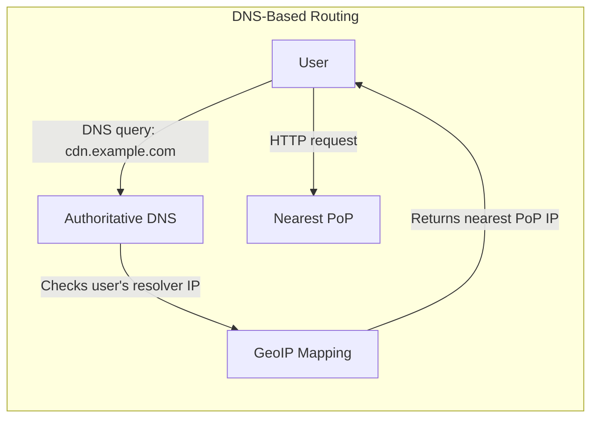
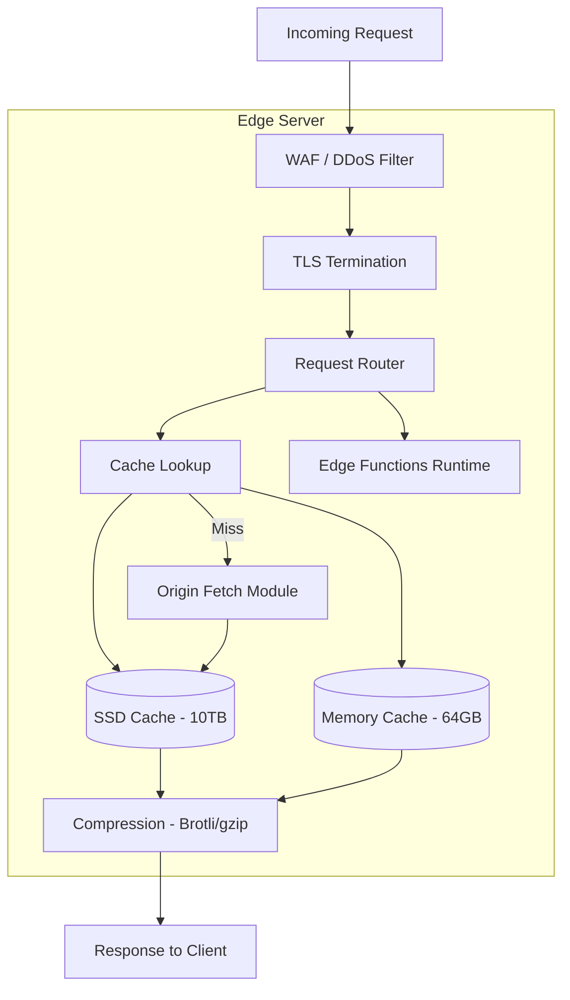
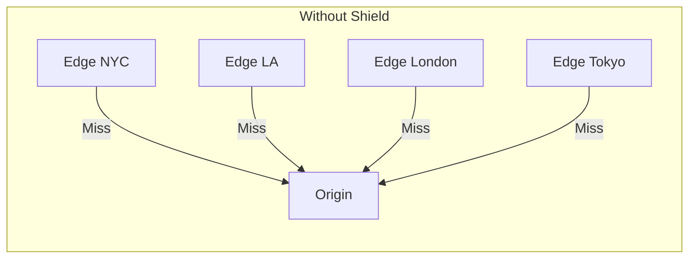
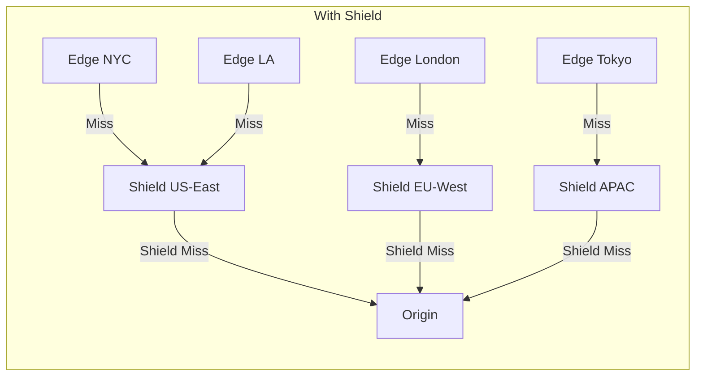
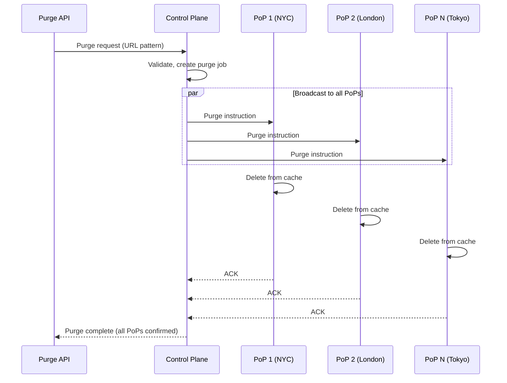
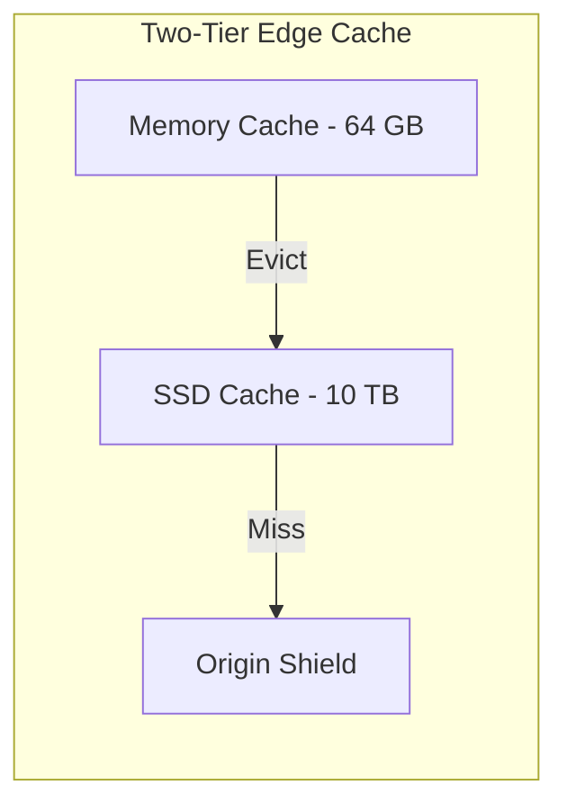

# Design a CDN

A Content Delivery Network (CDN) serves static and dynamic content from edge servers geographically close to users. Designing one covers edge node architecture, caching strategies, cache invalidation, origin shield (mid-tier caching), DNS and anycast-based routing, TLS termination at the edge, cache key design, and handling the full content lifecycle from origin to user.

---

## 1. Requirements Clarification

### Functional Requirements

1. **Content caching** — Cache static assets (images, JS, CSS, video) at edge locations
2. **Content delivery** — Serve cached content to users from the nearest edge
3. **Origin pull** — Fetch content from origin server on cache miss
4. **Cache invalidation** — Purge specific URLs or patterns on demand
5. **Custom cache rules** — Configure TTL, cache-control headers, cache key variations
6. **HTTPS/TLS** — Terminate TLS at the edge with custom domain certificates
7. **Dynamic content** — Support edge-side logic (edge functions/workers)
8. **Video streaming** — Serve HLS/DASH segments with efficient caching
9. **DDoS protection** — Absorb and mitigate DDoS attacks at the edge
10. **Analytics** — Real-time traffic, cache hit rate, bandwidth, and error rate dashboards

### Non-Functional Requirements

1. **Low latency** — Cache hit served in < 10ms, cache miss in < 100ms (including origin fetch)
2. **High availability** — 99.999% uptime for content delivery
3. **Global reach** — 200+ Points of Presence (PoPs) worldwide
4. **High throughput** — Handle 50M+ requests/second globally
5. **Cache hit ratio** — Target > 95% for static content
6. **Scalability** — Handle traffic spikes (10x normal) without degradation
7. **Consistency** — Purged content should be removed within 5 seconds globally

### Clarifying Questions

::: tip Questions to Ask
- What types of content are we serving (static files, video, API responses)?
- What is the expected cache hit ratio?
- How quickly must cache invalidation propagate globally?
- Do we need to support edge computing (serverless at the edge)?
- What DDoS protection capabilities are needed?
- Should we support WebSocket proxying?
:::

---

## 2. Back-of-the-Envelope Estimation

### Traffic

- 50M requests/second globally across all edge nodes
- 200 PoPs worldwide
- Average content size: 100 KB

$$
\text{Requests per PoP} = \frac{50M}{200} = 250{,}000 \text{ req/sec per PoP}
$$

$$
\text{Cache hit ratio} = 95\%
$$

$$
\text{Origin requests} = 50M \times 0.05 = 2.5M \text{ req/sec (cache misses)}
$$

### Bandwidth

$$
\text{Total egress} = 50M \times 100 \text{ KB} = 5 \text{ TB/s} = 40 \text{ Tbps}
$$

$$
\text{Per-PoP egress} = \frac{40 \text{ Tbps}}{200} = 200 \text{ Gbps per PoP}
$$

### Storage

**Per edge node:**

$$
\text{Hot cache (SSD)} = 10 \text{ TB per edge server}
$$

$$
\text{Servers per PoP} = 20\text{-}100 \text{ (depending on traffic)}
$$

$$
\text{Total edge storage} = 200 \text{ PoPs} \times 50 \text{ servers} \times 10 \text{ TB} = 100 \text{ PB}
$$

### Cache Invalidation

$$
\text{Invalidation rate} = 10{,}000 \text{ purge requests/sec (across all customers)}
$$

$$
\text{Propagation target} = \text{All 200 PoPs within 5 seconds}
$$

---

## 3. High-Level Design

```mermaid
graph TB
    subgraph "DNS Layer"
        DNS[Authoritative DNS / GeoDNS]
        Anycast[Anycast IP Routing]
    end

    subgraph "Edge Layer (200+ PoPs)"
        subgraph "PoP 1 - New York"
            E1_LB[L4 Load Balancer]
            E1_S1[Edge Server 1]
            E1_S2[Edge Server 2]
            E1_SN[Edge Server N]
        end
        subgraph "PoP 2 - London"
            E2_LB[L4 Load Balancer]
            E2_S1[Edge Server 1]
            E2_SN[Edge Server N]
        end
        subgraph "PoP N - Tokyo"
            EN_LB[L4 Load Balancer]
            EN_S1[Edge Server 1]
        end
    end

    subgraph "Shield / Mid-Tier (5-10 locations)"
        Shield1[Shield - US East]
        Shield2[Shield - EU West]
        Shield3[Shield - APAC]
    end

    subgraph "Origin"
        Origin[Customer Origin Server]
        OriginS3[Customer S3 Bucket]
    end

    subgraph "Control Plane"
        ConfigAPI[Configuration API]
        PurgeAPI[Purge / Invalidation API]
        Analytics[Analytics Pipeline]
        CertMgr[Certificate Manager]
    end

    DNS --> E1_LB
    DNS --> E2_LB
    DNS --> EN_LB

    E1_LB --> E1_S1
    E1_LB --> E1_S2
    E1_LB --> E1_SN

    E1_S1 -->|Cache Miss| Shield1
    E2_S1 -->|Cache Miss| Shield2
    EN_S1 -->|Cache Miss| Shield3

    Shield1 -->|Shield Miss| Origin
    Shield1 -->|Shield Miss| OriginS3
    Shield2 -->|Shield Miss| Origin
    Shield3 -->|Shield Miss| Origin

    ConfigAPI --> E1_S1
    PurgeAPI --> E1_S1
    PurgeAPI --> E2_S1
    PurgeAPI --> EN_S1
```

---

## 4. Detailed Design

### 4.1 Request Routing (DNS + Anycast)

Users must be directed to the nearest PoP. Two primary approaches:



```typescript
class GeoDNSRouter {
  // Map DNS resolver IP to nearest PoP
  async resolveToNearestPoP(resolverIP: string, domain: string): Promise<string[]> {
    // 1. Determine resolver's geographic location
    const resolverGeo = this.geoIPDatabase.lookup(resolverIP);

    // 2. Find PoPs sorted by distance
    const pops = this.popRegistry.getAllPops();
    const sorted = pops
      .map(pop => ({
        ...pop,
        distance: this.haversineDistance(resolverGeo, pop.location),
      }))
      .filter(pop => pop.healthy && pop.capacityAvailable)
      .sort((a, b) => a.distance - b.distance);

    // 3. Return top 2-3 PoP IPs (for failover)
    return sorted.slice(0, 3).map(p => p.ipAddress);
  }
}
```

**DNS vs Anycast routing:**

| Method | Accuracy | Latency | Failover | Complexity |
|--------|----------|---------|----------|------------|
| DNS (GeoDNS) | Moderate (resolver IP != user IP) | Adds DNS lookup | Slow (TTL-based) | Medium |
| **Anycast** | Excellent (network-level routing) | Fastest (BGP routing) | Fast (BGP reconvergence) | High |
| Hybrid (DNS + Anycast) | Best | Fast | Fast | Highest |

::: tip Anycast in Practice
Major CDNs (Cloudflare, Fastly) use Anycast: they announce the same IP address from all PoPs via BGP. The internet's routing protocol naturally directs packets to the nearest PoP. This is simpler than DNS-based routing and provides automatic failover — if a PoP goes down, BGP reconverges and traffic is routed to the next closest PoP within seconds.
:::

### 4.2 Edge Server Architecture

Each edge server handles the full request lifecycle: TLS termination, cache lookup, origin fetch, and response.



```typescript
class EdgeServer {
  async handleRequest(request: IncomingRequest): Promise<Response> {
    // 1. WAF / DDoS check
    const wafResult = await this.waf.evaluate(request);
    if (wafResult.blocked) {
      return new Response(null, { status: 403 });
    }

    // 2. Build cache key
    const cacheKey = this.buildCacheKey(request);

    // 3. Check memory cache (hot objects, ~64 GB)
    let cached = this.memoryCache.get(cacheKey);
    if (cached) {
      this.metrics.increment('cache.hit.memory');
      return this.buildResponse(cached, request);
    }

    // 4. Check SSD cache (~10 TB)
    cached = await this.ssdCache.get(cacheKey);
    if (cached) {
      this.metrics.increment('cache.hit.disk');
      // Promote to memory cache if frequently accessed
      if (this.isHot(cacheKey)) {
        this.memoryCache.set(cacheKey, cached);
      }
      return this.buildResponse(cached, request);
    }

    // 5. Cache miss — fetch from origin (or shield)
    this.metrics.increment('cache.miss');
    const originResponse = await this.fetchFromOrigin(request, cacheKey);

    // 6. Cache the response (if cacheable)
    if (this.isCacheable(originResponse)) {
      const ttl = this.calculateTTL(originResponse);
      await this.ssdCache.set(cacheKey, originResponse, ttl);
      if (this.isHot(cacheKey)) {
        this.memoryCache.set(cacheKey, originResponse, Math.min(ttl, 60));
      }
    }

    return this.buildResponse(originResponse, request);
  }

  buildCacheKey(request: IncomingRequest): string {
    // Cache key includes: host + path + relevant vary headers
    const vary = this.config.getCacheKeyConfig(request.host);
    let key = `${request.host}${request.path}`;

    // Include query params if configured
    if (vary.includeQueryString) {
      key += `?${this.sortQueryParams(request.queryString)}`;
    }

    // Vary by headers (e.g., Accept-Encoding, Accept-Language)
    for (const header of vary.headers) {
      key += `|${header}:${request.headers[header] || ''}`;
    }

    return this.hashKey(key); // SHA-256 for fixed-length key
  }

  private calculateTTL(response: OriginResponse): number {
    // Respect origin's Cache-Control headers
    const cacheControl = response.headers['cache-control'];

    if (cacheControl) {
      const maxAge = this.parseMaxAge(cacheControl);
      const sMaxAge = this.parseSMaxAge(cacheControl); // CDN-specific TTL
      if (sMaxAge !== null) return sMaxAge;
      if (maxAge !== null) return maxAge;
    }

    // Fall back to customer-configured TTL or default
    return this.config.getDefaultTTL(response.contentType);
  }
}
```

### 4.3 Origin Shield (Mid-Tier Cache)

The origin shield prevents thundering herd on the origin server. Multiple edge PoPs that have cache misses go to the shield instead of all hitting the origin directly.





```typescript
class OriginShield {
  // The shield acts like an edge server but with:
  // 1. Larger cache (100 TB+ per shield)
  // 2. Request coalescing (collapse duplicate origin requests)

  private inflight: Map<string, Promise<OriginResponse>> = new Map();

  async fetch(cacheKey: string, request: Request): Promise<OriginResponse> {
    // Check shield's cache first
    const cached = await this.cache.get(cacheKey);
    if (cached) return cached;

    // Request coalescing: if another request for the same key is in-flight,
    // wait for that result instead of making another origin request
    if (this.inflight.has(cacheKey)) {
      return this.inflight.get(cacheKey)!;
    }

    // Make the origin request
    const fetchPromise = this.fetchFromOrigin(request)
      .then(async (response) => {
        if (this.isCacheable(response)) {
          await this.cache.set(cacheKey, response, this.calculateTTL(response));
        }
        this.inflight.delete(cacheKey);
        return response;
      })
      .catch((error) => {
        this.inflight.delete(cacheKey);
        throw error;
      });

    this.inflight.set(cacheKey, fetchPromise);
    return fetchPromise;
  }
}
```

::: tip Request Coalescing
When a popular asset's cache expires, hundreds of edge servers may simultaneously request it from the origin (thundering herd). The shield collapses these into a single origin request. The first request goes to origin; all subsequent requests for the same key wait for the first to complete and share the result. This can reduce origin load by 100x.
:::

### 4.4 Cache Invalidation (Purge)



```typescript
class PurgeService {
  async purge(request: PurgeRequest): Promise<PurgeResult> {
    const { customerId, type, target } = request;

    switch (type) {
      case 'url':
        // Purge a single URL
        return this.purgeByUrl(customerId, target);

      case 'prefix':
        // Purge all URLs starting with prefix (e.g., /images/*)
        return this.purgeByPrefix(customerId, target);

      case 'tag':
        // Purge all objects tagged with a surrogate key
        // (e.g., "product-123" purges all cached responses for that product)
        return this.purgeBySurrogateKey(customerId, target);

      case 'all':
        // Purge entire customer cache
        return this.purgeAll(customerId);
    }
  }

  private async purgeByUrl(customerId: string, url: string): Promise<PurgeResult> {
    const cacheKey = this.buildCacheKey(customerId, url);

    // Broadcast to all PoPs via the control plane message bus
    const message = {
      type: 'purge',
      cacheKey,
      customerId,
      timestamp: Date.now(),
    };

    // Fan-out to all PoPs (via Kafka or dedicated message bus)
    await this.messageBus.broadcast('purge-commands', message);

    // Wait for confirmation from all PoPs (with timeout)
    const ackCount = await this.waitForAcks(cacheKey, this.popCount, 5000);

    return {
      status: ackCount === this.popCount ? 'complete' : 'partial',
      popsAcked: ackCount,
      totalPops: this.popCount,
    };
  }

  // Surrogate key purging: each cached response can have custom tags
  // When tagged content changes, purge all related cache entries at once
  private async purgeBySurrogateKey(customerId: string, key: string): Promise<PurgeResult> {
    // Each edge server maintains a reverse index: surrogate key -> cache keys
    await this.messageBus.broadcast('purge-commands', {
      type: 'purge_surrogate',
      surrogateKey: key,
      customerId,
      timestamp: Date.now(),
    });

    return this.waitForAllAcks(key);
  }
}
```

**Cache invalidation strategies:**

| Strategy | Propagation Time | Complexity | Use Case |
|----------|-----------------|------------|----------|
| TTL-based expiry | Depends on TTL | Simple | Content that changes infrequently |
| Active purge (push) | < 5 seconds | Medium | Immediate updates needed |
| Surrogate keys/tags | < 5 seconds | Higher | Purge related content together |
| Stale-while-revalidate | Instant (stale), async refresh | Medium | Always-fast, eventual freshness |

### 4.5 TLS at the Edge

```typescript
class TLSManager {
  // Each edge server must terminate TLS for thousands of customer domains

  async loadCertificate(domain: string): Promise<TLSContext> {
    // 1. Check in-memory certificate cache
    let cert = this.certCache.get(domain);
    if (cert && !this.isExpiringSoon(cert)) return cert;

    // 2. Fetch from certificate store
    cert = await this.certStore.getCertificate(domain);
    if (cert) {
      this.certCache.set(domain, cert);
      return cert;
    }

    // 3. Auto-provision via ACME (Let's Encrypt)
    cert = await this.acmeClient.provisionCertificate(domain);
    await this.certStore.saveCertificate(domain, cert);
    this.certCache.set(domain, cert);

    // 4. Distribute to all edge servers
    await this.distributeCertificate(domain, cert);

    return cert;
  }
}
```

- Use TLS 1.3 for reduced handshake latency (1-RTT vs 2-RTT for TLS 1.2)
- 0-RTT resumption for returning visitors
- OCSP stapling to avoid certificate verification round-trips
- SNI (Server Name Indication) to serve multiple domains from one IP
- Auto-provisioning via ACME/Let's Encrypt for customer domains

### 4.6 DDoS Protection

```typescript
class DDoSProtection {
  async evaluateRequest(request: IncomingRequest): Promise<DDoSDecision> {
    // Layer 3/4: Rate limiting by IP at the network level
    const ipRate = await this.rateLimiter.check(request.ip, {
      limit: 1000,       // requests per second
      window: 1,
    });
    if (ipRate.exceeded) return { action: 'block', reason: 'rate_limit' };

    // Layer 7: Analyze HTTP request patterns
    const l7Score = this.analyzeL7(request);
    if (l7Score > 0.9) return { action: 'challenge', reason: 'suspicious_pattern' };

    // Behavioral analysis: is this traffic pattern normal for this customer?
    const baseline = await this.getTrafficBaseline(request.host);
    const currentRate = await this.getCurrentRate(request.host);
    if (currentRate > baseline * 10) {
      // 10x normal traffic — enable challenges
      return { action: 'challenge', reason: 'traffic_spike' };
    }

    return { action: 'allow' };
  }
}
```

---

## 5. Data Model

### Edge Server Cache Metadata

```
# Cache entry structure (SSD-backed key-value store)
Key: SHA-256(host + path + vary_headers)
Value: {
  headers: { content-type, etag, last-modified, ... },
  body: <binary data>,
  bodySize: number,
  createdAt: timestamp,
  expiresAt: timestamp,
  surrogateKeys: ["product-123", "category-electronics"],
  hitCount: number,
}

# Surrogate key reverse index
Key: surrogateKey -> Set of cache keys
```

### Control Plane Database (PostgreSQL)

```sql
-- CDN Customers
CREATE TABLE customers (
    id              BIGSERIAL PRIMARY KEY,
    name            VARCHAR(255) NOT NULL,
    plan            VARCHAR(50),
    origin_url      VARCHAR(2000),
    origin_shield   VARCHAR(50),               -- which shield to use
    created_at      TIMESTAMP WITH TIME ZONE DEFAULT NOW()
);

-- Custom Domains
CREATE TABLE domains (
    id              BIGSERIAL PRIMARY KEY,
    customer_id     BIGINT NOT NULL,
    domain          VARCHAR(255) UNIQUE NOT NULL,
    certificate_id  BIGINT,
    status          VARCHAR(20) DEFAULT 'active',
    created_at      TIMESTAMP WITH TIME ZONE DEFAULT NOW()
);

-- Cache Configuration Rules
CREATE TABLE cache_rules (
    id              BIGSERIAL PRIMARY KEY,
    customer_id     BIGINT NOT NULL,
    path_pattern    VARCHAR(500),              -- /images/*, *.js, etc.
    ttl_seconds     INT,
    cache_key_config JSONB,                    -- which headers/params to include in key
    priority        INT DEFAULT 0,
    created_at      TIMESTAMP WITH TIME ZONE DEFAULT NOW()
);

-- PoP Registry
CREATE TABLE pops (
    id              VARCHAR(50) PRIMARY KEY,    -- e.g., "nyc-01"
    region          VARCHAR(50),
    city            VARCHAR(100),
    latitude        DECIMAL(10, 7),
    longitude       DECIMAL(10, 7),
    capacity_gbps   INT,
    server_count    INT,
    status          VARCHAR(20) DEFAULT 'active',
    last_heartbeat  TIMESTAMP WITH TIME ZONE
);

-- Certificates
CREATE TABLE certificates (
    id              BIGSERIAL PRIMARY KEY,
    domain          VARCHAR(255) NOT NULL,
    certificate     TEXT NOT NULL,              -- PEM-encoded
    private_key     TEXT NOT NULL,              -- encrypted
    issuer          VARCHAR(255),
    expires_at      TIMESTAMP WITH TIME ZONE,
    auto_renew      BOOLEAN DEFAULT TRUE,
    created_at      TIMESTAMP WITH TIME ZONE DEFAULT NOW()
);

-- Purge History
CREATE TABLE purge_history (
    id              BIGSERIAL PRIMARY KEY,
    customer_id     BIGINT NOT NULL,
    purge_type      VARCHAR(20),               -- url, prefix, tag, all
    target          VARCHAR(2000),
    pops_acked      INT,
    total_pops      INT,
    completed_at    TIMESTAMP WITH TIME ZONE,
    created_at      TIMESTAMP WITH TIME ZONE DEFAULT NOW()
);
```

---

## 6. API Design

```typescript
// Content delivery (user-facing — handled by edge server, not REST API)
// GET https://cdn.example.com/path/to/asset.jpg
// Headers: Accept-Encoding, If-None-Match, If-Modified-Since

// Configuration API (customer-facing)

// POST /api/v1/zones (create CDN zone)
interface CreateZoneRequest {
  name: string;
  originUrl: string;
  originShield?: string;      // 'us-east', 'eu-west', 'apac'
  defaultTTL: number;         // seconds
  cacheKeyConfig: {
    includeQueryString: boolean;
    sortQueryParams: boolean;
    varyHeaders: string[];
  };
}

// POST /api/v1/zones/:id/domains
interface AddDomainRequest {
  domain: string;
  autoProvisionCertificate: boolean;
}

// POST /api/v1/zones/:id/cache-rules
interface CacheRuleRequest {
  pathPattern: string;        // glob pattern
  ttl: number;
  browserTTL?: number;
  cacheEverything?: boolean;  // cache even non-cacheable responses
  bypassCacheOnCookie?: string; // regex for cookies that bypass cache
}

// Purge API
// POST /api/v1/zones/:id/purge
interface PurgeRequest {
  type: 'url' | 'prefix' | 'tag' | 'all';
  targets?: string[];         // URLs, prefixes, or surrogate keys
}

interface PurgeResponse {
  purgeId: string;
  status: 'pending' | 'complete' | 'partial';
  popsCompleted: number;
  totalPops: number;
}

// Analytics API
// GET /api/v1/zones/:id/analytics?from=2026-03-19&to=2026-03-20&granularity=hour
interface AnalyticsResponse {
  totalRequests: number;
  cachedRequests: number;
  cacheHitRatio: number;
  bandwidth: {
    total: number;            // bytes
    cached: number;
    uncached: number;
  };
  statusCodes: Record<string, number>;  // {"200": 1M, "304": 500K, "404": 10K}
  topPaths: { path: string; requests: number; bandwidth: number }[];
  timeline: TimeSeriesEntry[];
}
```

---

## 7. Scaling

### Edge Layer Scaling

| Challenge | Solution |
|-----------|----------|
| Traffic growth in a region | Add servers to existing PoP or deploy new PoP |
| Viral content (flash crowd) | Request coalescing at shield; CDN absorbs reads from cache |
| Large file delivery (video) | Serve from SSD cache; pre-warm popular content |
| Geographic coverage gaps | Deploy micro-PoPs in underserved regions |

### Storage Scaling per PoP



- **Memory (L1):** Hot objects, serves < 0.1ms. LRU eviction. ~64 GB per server.
- **SSD (L2):** Warm objects, serves < 1ms. LFU (Least Frequently Used) eviction. ~10 TB per server.
- **Shield (L3):** Regional mid-tier, serves < 20ms. Much larger cache (~100 TB).
- **Origin (L4):** Only hit on shield miss. Target < 5% of total traffic.

### Cache Eviction Strategies

| Strategy | Pros | Cons | Best For |
|----------|------|------|----------|
| LRU (Least Recently Used) | Simple, effective | Doesn't consider frequency | General purpose |
| LFU (Least Frequently Used) | Keeps popular content | Slow to adapt to new content | Long-tail content |
| **ARC (Adaptive Replacement Cache)** | Balances recency and frequency | More complex | CDN edge caches |
| SLRU (Segmented LRU) | Protects frequent items | Two-tier management | Memory caches |

### Global Purge Propagation

```
Purge latency budget: < 5 seconds to all 200 PoPs

Architecture:
  1. Purge API → Control Plane (< 50ms)
  2. Control Plane → Kafka purge topic (< 50ms)
  3. Kafka → 200 PoP consumers (< 2s, parallel)
  4. Each PoP processes purge locally (< 10ms)
  5. ACK back to Control Plane (< 2s)

Total: < 5 seconds end-to-end
```

---

## 8. Trade-offs & Alternatives

### Pull vs Push CDN

| Approach | How It Works | Origin Load | Freshness | Best For |
|----------|-------------|-------------|-----------|----------|
| **Pull (chosen)** | Edge fetches from origin on cache miss | Low (lazy fetch) | Depends on TTL | General-purpose CDN |
| Push | Origin pushes content to all edges | High (push to all PoPs) | Immediate | Known, limited content set |
| Hybrid | Push for critical assets, pull for rest | Medium | Best of both | Video platforms |

### Consistent Hashing vs Random Load Balancing (within PoP)

| Approach | Cache Hit Rate | Load Balance | Failure Handling |
|----------|---------------|-------------|------------------|
| **Consistent hashing by URL** | Higher (same URL -> same server) | Uneven if some URLs are hot | Re-hash on failure |
| Random / round-robin | Lower (duplicated caching) | Even distribution | Automatic |
| Two-choice hashing | Good balance | Good balance | Re-hash on failure |

**Decision:** Consistent hashing by URL within a PoP. This maximizes cache hit rates because the same URL always goes to the same server. The small imbalance from hot URLs is handled by request coalescing.

### Anycast vs DNS Routing

| Aspect | Anycast | DNS GeoDNS |
|--------|---------|------------|
| Routing accuracy | Network-level (excellent) | Resolver IP-based (approximate) |
| Failover speed | Seconds (BGP reconvergence) | Minutes (DNS TTL) |
| Setup complexity | Requires BGP peering | Simpler (DNS records) |
| Connection persistence | Can break on route changes | Stable (IP doesn't change) |
| **Real-world** | Cloudflare, Fastly | AWS CloudFront, Akamai (partially) |

::: warning Connection Persistence with Anycast
Anycast can cause issues with long-lived connections (WebSocket, large file downloads) if BGP routes change mid-connection. The packet may be routed to a different PoP that has no context for the connection. Mitigation: use ECMP (Equal-Cost Multi-Path) pinning, or fall back to DNS routing for long-lived connections.
:::

---

## 9. Common Interview Questions

::: details "How do you handle a cache stampede (thundering herd) when a popular object expires?"
Three techniques: (1) **Request coalescing** — when multiple requests arrive for the same cache miss, only one request goes to origin; the rest wait for the result. (2) **Stale-while-revalidate** — serve the stale cached version while asynchronously fetching a fresh copy from origin. (3) **Background refresh** — proactively refresh cache entries before they expire (e.g., refresh at 80% of TTL). The origin shield also acts as a coalescing layer — if 100 edge PoPs have a simultaneous miss, the shield collapses them into one origin request.
:::

::: details "How does cache invalidation propagate to 200 PoPs within 5 seconds?"
The purge API writes to a Kafka topic. Each PoP runs a consumer that processes purge commands. Within each PoP, the edge servers share a local purge broadcast (UDP multicast or local message bus). The key insight is that Kafka's topic is replicated and consumed in parallel by all PoPs — there's no sequential propagation. For immediate propagation of critical purges, a secondary fast-path uses direct TCP push from the control plane to PoP leaders.
:::

::: details "How do you handle HTTPS for thousands of customer domains on a single IP?"
SNI (Server Name Indication) — the TLS Client Hello includes the requested hostname, allowing the edge server to select the correct certificate before completing the handshake. Certificates are stored in an in-memory cache on each edge server, indexed by domain. For new domains, auto-provision via ACME (Let's Encrypt) and distribute to all PoPs within minutes. Use wildcard certificates where possible to reduce certificate count.
:::

::: details "How do you serve dynamic content through a CDN?"
Multiple approaches: (1) **Cache with short TTL** (1-5 seconds) for semi-dynamic content like API responses. (2) **Edge functions** (Cloudflare Workers, Fastly Compute) — run custom logic at the edge to generate or transform responses. (3) **Personalized content** — cache the base page at the edge, fetch personalized components via client-side JavaScript (edge-side includes or client-side rendering). (4) **Vary header** — cache different versions based on request headers (e.g., Accept-Language, cookie).
:::

::: details "How do you measure and improve cache hit ratio?"
Measure at three levels: (1) **Memory cache hit ratio** — should be > 80% for hot content. (2) **SSD cache hit ratio** — should be > 95% for all content. (3) **Origin offload ratio** — percentage of total requests served from cache. Improve by: increasing cache capacity, using consistent hashing within PoPs, extending TTLs, enabling stale-while-revalidate, warming cache for predictably popular content, and optimizing cache key configuration to avoid unnecessary variations.
:::

### Time Allocation (45-minute interview)

| Phase | Time | Focus |
|-------|------|-------|
| Requirements | 4 min | Edge caching, delivery, invalidation, TLS |
| Estimation | 3 min | 50M req/sec, 40 Tbps egress, cache sizes |
| High-level design | 8 min | DNS routing, edge PoPs, shield, origin |
| Edge server deep-dive | 10 min | Cache lookup, origin fetch, cache key design |
| Origin shield | 5 min | Request coalescing, thundering herd prevention |
| Cache invalidation | 7 min | Purge propagation, surrogate keys |
| Scaling & trade-offs | 8 min | Anycast vs DNS, pull vs push, eviction |

---

## Summary

| Component | Technology | Scale |
|-----------|-----------|-------|
| Edge Servers | Custom HTTP/TLS servers + SSD cache | 200+ PoPs, 50M req/sec |
| Request Routing | Anycast + GeoDNS | Global traffic steering |
| Memory Cache (L1) | In-memory (LRU) | 64 GB per server |
| SSD Cache (L2) | NVMe SSD (ARC/LFU) | 10 TB per server |
| Origin Shield (L3) | Mid-tier cache with request coalescing | 5-10 locations, 100 TB each |
| Cache Invalidation | Kafka broadcast + PoP consumers | < 5 seconds global purge |
| TLS | TLS 1.3 + 0-RTT + OCSP stapling | Auto-provisioned via ACME |
| DDoS Protection | Rate limiting + behavioral analysis | L3/L4/L7 mitigation |
| Control Plane | PostgreSQL + Kafka | Config, certs, purge management |
| Analytics | ClickHouse / time-series DB | Real-time traffic dashboards |
