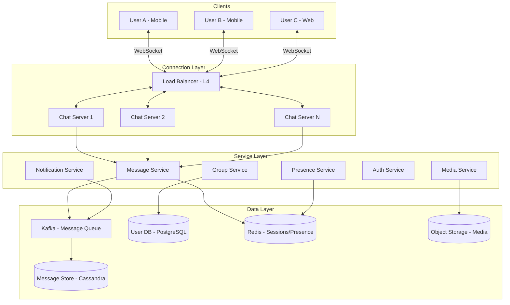
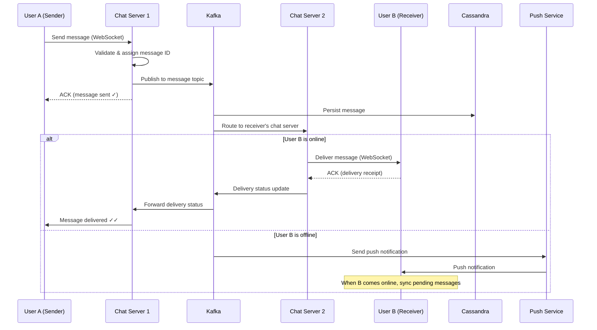
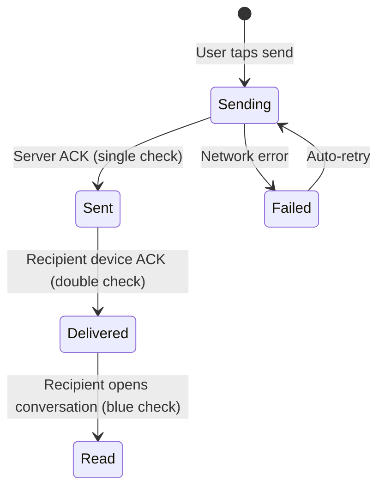
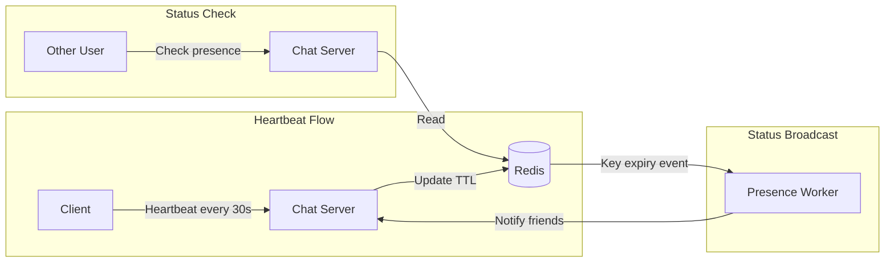
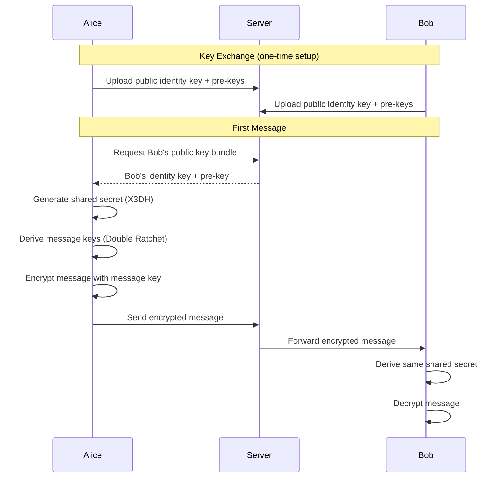
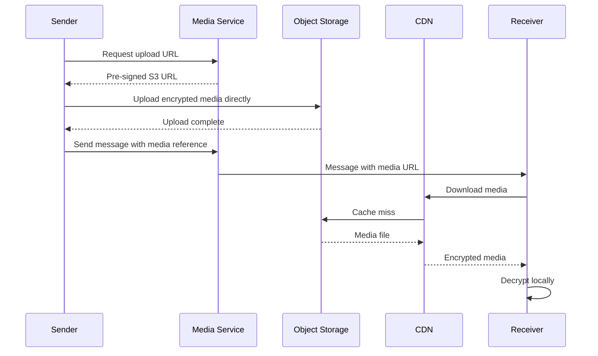
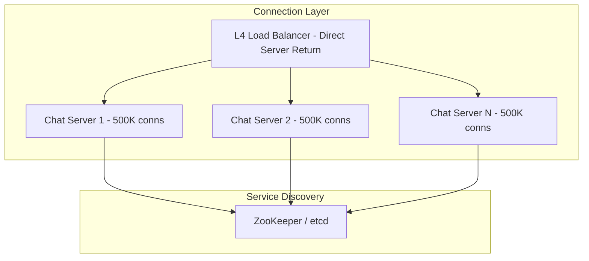
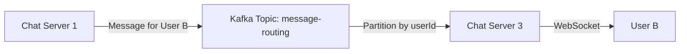
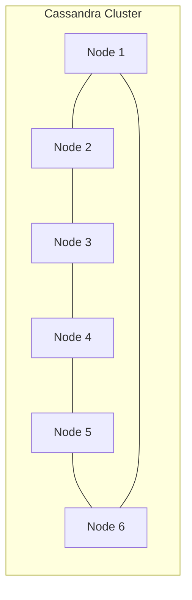

# Design a Chat System (WhatsApp / Messenger)

A chat system enables real-time messaging between users. This design covers WebSocket connection management, message delivery guarantees (sent/delivered/read), group chat, media sharing, end-to-end encryption, presence (online/offline), and message storage at scale.

---

## 1. Problem Statement & Requirements

### Functional Requirements

1. **One-on-one messaging** — Send and receive text messages in real time
2. **Group chat** — Support groups up to 500 members
3. **Message delivery status** — Sent, delivered, read receipts
4. **Media sharing** — Send images, videos, documents, voice messages
5. **Online/offline status** — Show when a user is online or last seen
6. **Push notifications** — Notify offline users of new messages
7. **Message history** — Persist and sync message history across devices
8. **End-to-end encryption** — Messages encrypted so only sender and recipient can read them

### Non-Functional Requirements

1. **Real-time delivery** — Messages delivered within 100ms when both users are online
2. **High availability** — 99.99% uptime
3. **Message ordering** — Messages within a conversation must be ordered
4. **At-least-once delivery** — No messages should be lost
5. **Scale** — 500M DAU, 100B messages per day
6. **Multi-device** — Users can log in from multiple devices simultaneously

### Clarifying Questions

::: tip Questions to Ask
- What is the maximum group size? (WhatsApp: 1024, Messenger: 250)
- Do we need to support voice/video calls? (Usually out of scope)
- Is end-to-end encryption a requirement?
- Do messages expire or are they stored forever?
- What is the maximum message size?
- Do we need message editing and deletion?
:::

---

## 2. Back-of-Envelope Estimation

### Traffic

- 500M DAU
- Each user sends ~40 messages/day on average
- 100B messages per day total

$$
\text{Message QPS} = \frac{100B}{86400} \approx 1.16M \text{ QPS}
$$

$$
\text{Peak QPS} \approx 1.16M \times 3 \approx 3.5M \text{ QPS}
$$

### Connection Count

Each DAU maintains one persistent WebSocket connection:

$$
\text{Concurrent connections} = 500M \times 0.1 \text{ (10% concurrently online)} = 50M
$$

Each WebSocket connection uses ~10KB of memory:

$$
\text{Connection memory} = 50M \times 10KB = 500 \text{ GB}
$$

At ~500K connections per server, we need:

$$
\text{Chat servers} = \frac{50M}{500K} = 100 \text{ servers}
$$

### Storage

Average message size: 100 bytes (text) + 50 bytes (metadata) = 150 bytes

$$
\text{Daily storage (text)} = 100B \times 150 \text{ bytes} = 15 \text{ TB/day}
$$

$$
\text{Annual storage (text)} = 15 \text{ TB} \times 365 = 5.5 \text{ PB/year}
$$

Media messages (assume 10% of messages include media, average 500KB):

$$
\text{Daily media} = 100B \times 0.1 \times 500KB = 5{,}000 \text{ TB/day} = 5 \text{ PB/day}
$$

### Bandwidth

$$
\text{Ingress} = \frac{15 \text{ TB/day}}{86400} \approx 174 \text{ MB/s (text only)}
$$

$$
\text{Media ingress} = \frac{5 \text{ PB/day}}{86400} \approx 58 \text{ GB/s}
$$

---

## 3. High-Level Design



### Connection Model: WebSocket vs Long Polling

| Feature | WebSocket | Long Polling | Server-Sent Events |
|---------|-----------|-------------|-------------------|
| Bidirectional | Yes | Simulated | No (server to client only) |
| Latency | Lowest (~1ms) | Medium (~100ms) | Low (~10ms) |
| Server resources | Persistent connection | Request per poll | Persistent connection |
| Firewall friendly | Moderate | High | High |
| **Best for** | **Chat (primary)** | Fallback | Push notifications |

**Decision:** WebSocket as primary, with long polling as fallback for restrictive networks.

### API Design

```typescript
// WebSocket message protocol
type WebSocketMessage =
  | { type: 'send_message'; data: SendMessagePayload }
  | { type: 'message_received'; data: MessagePayload }
  | { type: 'delivery_ack'; data: { messageId: string; status: 'delivered' | 'read' } }
  | { type: 'typing'; data: { conversationId: string; userId: string; isTyping: boolean } }
  | { type: 'presence'; data: { userId: string; status: 'online' | 'offline'; lastSeen?: number } }
  | { type: 'sync'; data: { lastMessageId: string } };

interface SendMessagePayload {
  tempId: string;          // Client-generated ID for deduplication
  conversationId: string;
  content: string;
  contentType: 'text' | 'image' | 'video' | 'audio' | 'document';
  mediaUrl?: string;       // Pre-uploaded media URL
  replyToMessageId?: string;
  encryptedContent?: string; // E2E encrypted payload
}

interface MessagePayload {
  messageId: string;       // Server-generated ID
  tempId: string;          // Echoed back for client correlation
  conversationId: string;
  senderId: string;
  content: string;
  contentType: string;
  timestamp: number;
  status: 'sent' | 'delivered' | 'read';
}

// REST APIs for non-real-time operations
// GET /api/v1/conversations - List user's conversations
// GET /api/v1/conversations/:id/messages?cursor=xxx&limit=50
// POST /api/v1/conversations - Create new conversation
// POST /api/v1/media/upload - Upload media file
// PUT /api/v1/users/me/settings - Update notification preferences
```

---

## 4. Database Schema

### Message Store (Apache Cassandra)

Cassandra is ideal for chat because:
- Write-optimized (LSM tree)
- Distributed, no single point of failure
- Time-series data pattern (messages ordered by time)
- Tunable consistency

```sql
-- Messages table: partitioned by conversation_id
CREATE TABLE messages (
    conversation_id UUID,
    message_id      TIMEUUID,
    sender_id       BIGINT,
    content         TEXT,
    content_type    TEXT,        -- 'text', 'image', 'video', etc.
    media_url       TEXT,
    reply_to        TIMEUUID,
    status          TEXT,        -- 'sent', 'delivered', 'read'
    created_at      TIMESTAMP,
    PRIMARY KEY (conversation_id, message_id)
) WITH CLUSTERING ORDER BY (message_id DESC)
  AND compaction = {'class': 'TimeWindowCompactionStrategy', 'compaction_window_size': 1, 'compaction_window_unit': 'DAYS'}
  AND default_time_to_live = 0;
```

::: warning Why Cassandra Over PostgreSQL?
At 1.16M writes/sec, a relational database would struggle even with sharding. Cassandra's write-optimized architecture (LSM tree, append-only) handles this write-heavy workload natively. The access pattern (fetch messages by conversation in time order) maps perfectly to Cassandra's partition key + clustering key model.
:::

### User and Conversation Metadata (PostgreSQL)

```sql
CREATE TABLE users (
    id              BIGSERIAL PRIMARY KEY,
    phone_number    VARCHAR(20) UNIQUE NOT NULL,
    display_name    VARCHAR(100),
    avatar_url      VARCHAR(500),
    public_key      TEXT,           -- For E2E encryption
    last_seen       TIMESTAMP WITH TIME ZONE,
    created_at      TIMESTAMP WITH TIME ZONE DEFAULT NOW()
);

CREATE TABLE conversations (
    id              UUID PRIMARY KEY DEFAULT gen_random_uuid(),
    type            VARCHAR(10) NOT NULL,  -- 'direct', 'group'
    name            VARCHAR(255),          -- Group name
    avatar_url      VARCHAR(500),
    created_by      BIGINT REFERENCES users(id),
    created_at      TIMESTAMP WITH TIME ZONE DEFAULT NOW()
);

CREATE TABLE conversation_members (
    conversation_id UUID REFERENCES conversations(id),
    user_id         BIGINT REFERENCES users(id),
    role            VARCHAR(20) DEFAULT 'member', -- 'admin', 'member'
    joined_at       TIMESTAMP WITH TIME ZONE DEFAULT NOW(),
    muted_until     TIMESTAMP WITH TIME ZONE,
    last_read_message_id UUID,
    PRIMARY KEY (conversation_id, user_id)
);

CREATE INDEX idx_conv_members_user ON conversation_members(user_id);

-- Conversation list for a user (denormalized for fast retrieval)
CREATE TABLE user_conversations (
    user_id             BIGINT NOT NULL,
    conversation_id     UUID NOT NULL,
    last_message_preview TEXT,
    last_message_at     TIMESTAMP WITH TIME ZONE,
    unread_count        INT DEFAULT 0,
    is_pinned           BOOLEAN DEFAULT FALSE,
    PRIMARY KEY (user_id, conversation_id)
);

CREATE INDEX idx_user_conv_last_msg ON user_conversations(user_id, last_message_at DESC);
```

### Session/Connection Registry (Redis)

```
# Track which chat server each user is connected to
Key: session:{userId}
Value: { serverId: "chat-server-42", connectedAt: 1710720000, deviceId: "device-abc" }
TTL: heartbeat-based (refresh every 30 seconds)

# For multi-device: store a set of active sessions
Key: sessions:{userId}
Type: Hash
Fields: {deviceId} -> {serverId}

# Online status
Key: presence:{userId}
Value: "online" | timestamp_of_last_seen
TTL: 60 seconds (refreshed by heartbeat)

# Typing indicators (short TTL)
Key: typing:{conversationId}:{userId}
Value: 1
TTL: 3 seconds
```

---

## 5. Detailed Component Design

### 5.1 Message Flow: One-on-One



```typescript
class ChatServer {
  private connections: Map<string, WebSocket> = new Map();
  private kafka: KafkaProducer;
  private redis: RedisClient;
  private serverId: string;

  async handleIncomingMessage(userId: string, payload: SendMessagePayload): Promise<void> {
    // 1. Validate
    const conversation = await this.validateConversation(userId, payload.conversationId);

    // 2. Generate server-side message ID (ULID for time-ordering)
    const messageId = ulid();

    // 3. Deduplicate (check if tempId was already processed)
    const dedupKey = `dedup:${userId}:${payload.tempId}`;
    const alreadyProcessed = await this.redis.set(dedupKey, messageId, 'NX', 'EX', 3600);
    if (!alreadyProcessed) {
      // Duplicate — return the existing message ID
      const existingId = await this.redis.get(dedupKey);
      this.sendToUser(userId, { type: 'message_ack', data: { tempId: payload.tempId, messageId: existingId, status: 'sent' } });
      return;
    }

    // 4. Publish to Kafka for persistence and routing
    await this.kafka.send('messages', {
      key: payload.conversationId,  // Partition by conversation for ordering
      value: {
        messageId,
        tempId: payload.tempId,
        conversationId: payload.conversationId,
        senderId: userId,
        content: payload.content,
        contentType: payload.contentType,
        mediaUrl: payload.mediaUrl,
        timestamp: Date.now(),
      },
    });

    // 5. ACK to sender immediately (message is now durable in Kafka)
    this.sendToUser(userId, {
      type: 'message_ack',
      data: { tempId: payload.tempId, messageId, status: 'sent' },
    });

    // 6. Route to recipients
    await this.routeToRecipients(payload.conversationId, userId, messageId);
  }

  async routeToRecipients(
    conversationId: string,
    senderId: string,
    messageId: string
  ): Promise<void> {
    const members = await this.getConversationMembers(conversationId);

    for (const memberId of members) {
      if (memberId === senderId) continue;

      // Find which chat server this user is connected to
      const session = await this.redis.hgetall(`sessions:${memberId}`);

      if (Object.keys(session).length > 0) {
        // User is online — route to their chat server(s)
        for (const [deviceId, serverId] of Object.entries(session)) {
          if (serverId === this.serverId) {
            // User is on this server — deliver directly
            this.deliverToLocalConnection(memberId, deviceId, messageId);
          } else {
            // User is on a different server — publish routing message
            await this.kafka.send('message-routing', {
              key: memberId,
              value: { targetServer: serverId, userId: memberId, messageId, conversationId },
            });
          }
        }
      } else {
        // User is offline — send push notification
        await this.kafka.send('push-notifications', {
          key: memberId,
          value: { userId: memberId, messageId, conversationId },
        });
      }
    }
  }

  private sendToUser(userId: string, message: any): void {
    const ws = this.connections.get(userId);
    if (ws && ws.readyState === WebSocket.OPEN) {
      ws.send(JSON.stringify(message));
    }
  }
}
```

### 5.2 Message Delivery Guarantees



```typescript
// Message status tracking
class DeliveryTracker {
  // When message is persisted to Kafka
  async markSent(messageId: string): Promise<void> {
    await this.cassandra.execute(
      'UPDATE messages SET status = ? WHERE conversation_id = ? AND message_id = ?',
      ['sent', conversationId, messageId]
    );
  }

  // When recipient's device acknowledges receipt
  async markDelivered(messageId: string, userId: string): Promise<void> {
    await this.cassandra.execute(
      'UPDATE messages SET status = ? WHERE conversation_id = ? AND message_id = ?',
      ['delivered', conversationId, messageId]
    );

    // Notify sender
    await this.notifySender(messageId, 'delivered');
  }

  // When recipient opens the conversation
  async markRead(conversationId: string, userId: string, upToMessageId: string): Promise<void> {
    // Update last_read pointer for this user in this conversation
    await this.db.query(
      `UPDATE conversation_members
       SET last_read_message_id = $1
       WHERE conversation_id = $2 AND user_id = $3`,
      [upToMessageId, conversationId, userId]
    );

    // Notify the other participant(s)
    await this.notifyReadReceipt(conversationId, userId, upToMessageId);
  }
}
```

### 5.3 Group Chat

Group chat adds complexity because messages must be delivered to many recipients:

```typescript
class GroupMessageHandler {
  private readonly MAX_GROUP_SIZE = 500;

  async sendGroupMessage(
    senderId: string,
    groupId: string,
    content: string
  ): Promise<void> {
    const group = await this.getGroup(groupId);

    if (group.members.length > this.MAX_GROUP_SIZE) {
      throw new Error('Group exceeds maximum size');
    }

    // 1. Persist message once (not per member)
    const messageId = ulid();
    await this.persistMessage(groupId, messageId, senderId, content);

    // 2. Fan out to all group members
    const members = group.members.filter(m => m.id !== senderId);

    // Batch into chunks for parallel delivery
    const chunks = this.chunk(members, 50);
    await Promise.all(
      chunks.map(chunk => this.deliverToMembers(chunk, groupId, messageId))
    );
  }

  private async deliverToMembers(
    members: GroupMember[],
    groupId: string,
    messageId: string
  ): Promise<void> {
    for (const member of members) {
      const sessions = await this.redis.hgetall(`sessions:${member.id}`);

      if (Object.keys(sessions).length > 0) {
        // Online — deliver via WebSocket
        for (const [deviceId, serverId] of Object.entries(sessions)) {
          await this.routeToServer(serverId, member.id, groupId, messageId);
        }
      } else if (!member.mutedUntil || member.mutedUntil < Date.now()) {
        // Offline and not muted — push notification
        await this.sendPushNotification(member.id, groupId, messageId);
      }
    }
  }

  private chunk<T>(array: T[], size: number): T[][] {
    const chunks: T[][] = [];
    for (let i = 0; i < array.length; i += size) {
      chunks.push(array.slice(i, i + size));
    }
    return chunks;
  }
}
```

### 5.4 Presence Service (Online/Offline Status)



```typescript
class PresenceService {
  private readonly HEARTBEAT_INTERVAL = 30_000; // 30 seconds
  private readonly PRESENCE_TTL = 60; // 60 seconds

  async handleHeartbeat(userId: string): Promise<void> {
    await this.redis.setEx(`presence:${userId}`, this.PRESENCE_TTL, 'online');
  }

  async handleDisconnect(userId: string): Promise<void> {
    // Check if user has other active sessions
    const sessions = await this.redis.hgetall(`sessions:${userId}`);
    if (Object.keys(sessions).length === 0) {
      // No more active sessions — mark as offline
      const lastSeen = Date.now();
      await this.redis.set(`presence:${userId}`, lastSeen.toString());
      await this.redis.expire(`presence:${userId}`, 86400); // Keep last seen for 24h

      // Notify close friends/recent chat partners
      await this.broadcastPresenceChange(userId, 'offline', lastSeen);
    }
  }

  async getPresence(userId: string): Promise<PresenceStatus> {
    const value = await this.redis.get(`presence:${userId}`);

    if (!value) {
      return { status: 'offline', lastSeen: null };
    }

    if (value === 'online') {
      return { status: 'online', lastSeen: null };
    }

    return { status: 'offline', lastSeen: parseInt(value) };
  }

  // Don't broadcast to ALL contacts — only recent chat partners
  private async broadcastPresenceChange(
    userId: string,
    status: string,
    lastSeen: number
  ): Promise<void> {
    // Get users who recently chatted with this user (last 7 days)
    const recentPartners = await this.getRecentChatPartners(userId, 50);

    for (const partnerId of recentPartners) {
      const sessions = await this.redis.hgetall(`sessions:${partnerId}`);
      for (const [, serverId] of Object.entries(sessions)) {
        await this.kafka.send('presence-updates', {
          key: partnerId,
          value: { userId, status, lastSeen, targetServer: serverId },
        });
      }
    }
  }
}
```

::: warning Presence at Scale
Broadcasting presence changes to all contacts is expensive. WhatsApp limits presence updates to users who have the chat open. A user's online status is only fetched when another user opens the conversation with them, not proactively pushed to everyone.
:::

### 5.5 End-to-End Encryption (Signal Protocol)



```typescript
// Simplified E2E encryption flow (Signal Protocol overview)
class E2EEncryption {
  // Key generation on device registration
  async generateKeyBundle(): Promise<KeyBundle> {
    const identityKey = await crypto.subtle.generateKey(
      { name: 'ECDH', namedCurve: 'P-256' },
      true,
      ['deriveKey']
    );

    const signedPreKey = await crypto.subtle.generateKey(
      { name: 'ECDH', namedCurve: 'P-256' },
      true,
      ['deriveKey']
    );

    // Generate 100 one-time pre-keys
    const oneTimePreKeys = await Promise.all(
      Array.from({ length: 100 }, () =>
        crypto.subtle.generateKey(
          { name: 'ECDH', namedCurve: 'P-256' },
          true,
          ['deriveKey']
        )
      )
    );

    return {
      identityKey,
      signedPreKey,
      oneTimePreKeys,
    };
  }

  // Encrypt a message
  async encryptMessage(
    plaintext: string,
    sessionKey: CryptoKey
  ): Promise<EncryptedMessage> {
    const iv = crypto.getRandomValues(new Uint8Array(12));
    const encoded = new TextEncoder().encode(plaintext);

    const ciphertext = await crypto.subtle.encrypt(
      { name: 'AES-GCM', iv },
      sessionKey,
      encoded
    );

    return {
      ciphertext: new Uint8Array(ciphertext),
      iv,
    };
  }

  // Decrypt a message
  async decryptMessage(
    encrypted: EncryptedMessage,
    sessionKey: CryptoKey
  ): Promise<string> {
    const decrypted = await crypto.subtle.decrypt(
      { name: 'AES-GCM', iv: encrypted.iv },
      sessionKey,
      encrypted.ciphertext
    );

    return new TextDecoder().decode(decrypted);
  }
}
```

::: info Key Insight
With E2E encryption, the server NEVER sees plaintext messages. This means server-side search, content moderation, and spam filtering on message content are impossible. These features must either be sacrificed or implemented on the client side.
:::

### 5.6 Message Sync Across Devices

When a user comes online on a new device or after being offline:

```typescript
class MessageSyncService {
  async syncMessages(userId: string, lastMessageId: string): Promise<SyncResult> {
    // Get all conversations for this user
    const conversations = await this.db.query(
      `SELECT conversation_id, last_message_at
       FROM user_conversations
       WHERE user_id = $1
       ORDER BY last_message_at DESC`,
      [userId]
    );

    const newMessages: Message[] = [];

    for (const conv of conversations) {
      // Fetch messages newer than last synced
      const messages = await this.cassandra.execute(
        `SELECT * FROM messages
         WHERE conversation_id = ?
         AND message_id > ?
         ORDER BY message_id ASC
         LIMIT 100`,
        [conv.conversation_id, lastMessageId]
      );
      newMessages.push(...messages);
    }

    // Sort by timestamp and return
    newMessages.sort((a, b) => a.timestamp - b.timestamp);

    return {
      messages: newMessages,
      hasMore: newMessages.length === 100, // Pagination
    };
  }
}
```

### 5.7 Media Handling



```typescript
class MediaService {
  async getUploadUrl(userId: string, contentType: string, fileSize: number): Promise<UploadInfo> {
    // Validate file size (100MB max)
    if (fileSize > 100 * 1024 * 1024) {
      throw new Error('File too large. Maximum size is 100MB.');
    }

    const mediaId = ulid();
    const key = `media/${userId}/${mediaId}`;

    // Generate pre-signed upload URL (valid for 15 minutes)
    const uploadUrl = await this.s3.getSignedUrl('putObject', {
      Bucket: 'chat-media',
      Key: key,
      ContentType: contentType,
      Expires: 900,
    });

    return {
      mediaId,
      uploadUrl,
      downloadUrl: `https://cdn.chat.com/${key}`,
    };
  }
}
```

---

## 6. Scaling & Bottlenecks

### Connection Scaling

The main bottleneck is managing 50M+ concurrent WebSocket connections:



**Key design decisions:**
- Use L4 (TCP) load balancing, not L7 (HTTP), for WebSocket connections
- Direct Server Return (DSR) mode to avoid LB being a bottleneck for outbound traffic
- Each chat server handles up to 500K connections
- Use consistent hashing to route users to the same server (connection affinity)

### Message Routing Between Servers

When User A (on Chat Server 1) messages User B (on Chat Server 3):



Each chat server subscribes to a Kafka partition mapped to the users it serves.

### Cassandra Scaling



- **Replication factor:** 3 (tolerate 1 node failure per replica set)
- **Consistency level:** LOCAL_QUORUM for writes (2 of 3 replicas), ONE for reads
- **Compaction:** TimeWindowCompactionStrategy (optimized for time-series data)
- **Hot partition prevention:** Use conversation_id as partition key (distributes evenly)

::: danger Hot Partition Warning
A viral group chat with millions of messages could create a hot partition in Cassandra. To prevent this, consider sub-partitioning: `partition_key = (conversation_id, time_bucket)` where `time_bucket` is the day. This spreads a single conversation across multiple partitions at the cost of multi-partition reads.
:::

### Rate Limiting

```typescript
class MessageRateLimiter {
  async checkLimit(userId: string): Promise<boolean> {
    const key = `ratelimit:msg:${userId}`;
    const count = await this.redis.incr(key);
    if (count === 1) await this.redis.expire(key, 60);

    // 200 messages per minute per user
    return count <= 200;
  }

  async checkGroupLimit(groupId: string, userId: string): Promise<boolean> {
    const key = `ratelimit:group:${groupId}:${userId}`;
    const count = await this.redis.incr(key);
    if (count === 1) await this.redis.expire(key, 60);

    // 30 messages per minute per user in a group
    return count <= 30;
  }
}
```

---

## 7. Trade-offs & Alternatives

### Message Storage: Cassandra vs Others

| Criterion | Cassandra | HBase | PostgreSQL | DynamoDB |
|-----------|----------|-------|-----------|----------|
| Write throughput | Very high | Very high | Moderate | High |
| Read pattern | Partition scan | Row scan | Flexible | Key-value |
| Consistency | Tunable | Strong | Strong | Tunable |
| Operations | Moderate | Complex | Simple | Managed |
| Cost | Moderate | High | Low-Moderate | High at scale |
| **Best for** | **Write-heavy, time-series** | Analytical | Small-medium scale | Managed, auto-scale |

### Delivery Guarantee: At-Least-Once vs Exactly-Once

| Guarantee | Implementation | Trade-off |
|-----------|---------------|-----------|
| At-most-once | Fire and forget | Messages can be lost |
| **At-least-once** | **ACK-based, retry on failure** | **Duplicates possible (handle with dedup)** |
| Exactly-once | Two-phase commit or idempotency | Higher complexity, latency |

**Decision:** At-least-once delivery with client-side deduplication using `tempId`. This is the standard approach for chat systems.

### Connection Management: Per-User vs Per-Device

| Approach | Pros | Cons |
|----------|------|------|
| One connection per user | Simple, less resource usage | Can't support multi-device |
| **One connection per device** | **Multi-device support** | **More connections, complexity** |

### Push Notifications vs Pull

For offline users:
- **Push:** Server sends notification via APNS/FCM. User opens app and syncs.
- **Pull:** Client periodically polls for new messages. Wasteful for real-time chat.
- **Decision:** Push for notifications, WebSocket for real-time, HTTP for history sync.

---

## 8. Advanced Topics

### 8.1 Message Ordering

Messages within a conversation must be ordered. Use ULID (Universally Unique Lexicographically Sortable Identifier):

```typescript
import { ulid } from 'ulid';

// ULIDs are lexicographically sortable and contain a timestamp
const messageId = ulid(); // "01ARZ3NDEKTSV4RRFFQ69G5FAV"
// First 10 chars = 48-bit timestamp (ms precision)
// Last 16 chars = 80-bit randomness
```

For multi-server ordering, partition Kafka topics by `conversation_id` so all messages in a conversation go to the same partition, guaranteeing order.

### 8.2 Typing Indicators

```typescript
class TypingIndicatorService {
  async setTyping(userId: string, conversationId: string): Promise<void> {
    // Set with 3-second TTL (auto-expires if user stops typing)
    await this.redis.setEx(`typing:${conversationId}:${userId}`, 3, '1');

    // Broadcast to other members
    const members = await this.getConversationMembers(conversationId);
    for (const memberId of members) {
      if (memberId === userId) continue;
      this.sendToUser(memberId, {
        type: 'typing',
        data: { conversationId, userId, isTyping: true },
      });
    }
  }
}
```

### 8.3 Message Search

Since messages are E2E encrypted, server-side search is impossible. Options:

1. **Client-side search:** Build a local search index on each device. Works for on-device history only.
2. **Metadata search:** Search by sender, date, conversation — metadata is not encrypted.
3. **Opt-in server index:** Users can opt to allow server-side indexing (Telegram's approach for cloud chats).

### 8.4 Abuse Prevention

```typescript
class AbusePreventionService {
  async checkMessage(senderId: string, content: string): Promise<AbuseCheckResult> {
    // Note: With E2E encryption, content checking happens on the client

    // Server-side checks (metadata only):
    // 1. Rate limiting
    if (await this.isRateLimited(senderId)) {
      return { blocked: true, reason: 'rate_limited' };
    }

    // 2. Check if sender is blocked by recipient
    // (done before message is sent)

    // 3. Account age check (new accounts have stricter limits)
    const account = await this.getAccount(senderId);
    const ageHours = (Date.now() - account.createdAt) / 3600000;
    if (ageHours < 24) {
      // New account: limit to 10 unique conversations per day
      const convCount = await this.redis.scard(`new_user_convs:${senderId}`);
      if (convCount > 10) {
        return { blocked: true, reason: 'new_account_limit' };
      }
    }

    return { blocked: false };
  }
}
```

### 8.5 Message Deletion and Ephemeral Messages

```typescript
class MessageDeletionService {
  // Delete for everyone (like WhatsApp "Delete for Everyone")
  async deleteForEveryone(
    messageId: string,
    conversationId: string,
    requesterId: string
  ): Promise<void> {
    // Verify requester is the sender
    const message = await this.getMessage(conversationId, messageId);
    if (message.senderId !== requesterId) {
      throw new Error('Only the sender can delete for everyone');
    }

    // Time limit: 48 hours
    const ageMs = Date.now() - message.timestamp;
    if (ageMs > 48 * 3600 * 1000) {
      throw new Error('Cannot delete messages older than 48 hours');
    }

    // Mark as deleted (don't actually remove — tombstone)
    await this.cassandra.execute(
      `UPDATE messages SET content = '', is_deleted = true
       WHERE conversation_id = ? AND message_id = ?`,
      [conversationId, messageId]
    );

    // Notify all members to remove from their UI
    await this.broadcastToConversation(conversationId, {
      type: 'message_deleted',
      data: { messageId, conversationId },
    });
  }

  // Ephemeral messages (disappear after being read)
  async setEphemeralTimer(conversationId: string, timerSeconds: number): Promise<void> {
    // Timer options: 24h, 7d, 90d
    await this.db.query(
      `UPDATE conversations SET ephemeral_timer = $1 WHERE id = $2`,
      [timerSeconds, conversationId]
    );
  }
}
```

---

## 9. Interview Tips

### What Interviewers Look For

1. **WebSocket understanding** — Can you explain the connection lifecycle and why WebSocket is needed?
2. **Message delivery semantics** — Do you address sent/delivered/read status?
3. **Group chat fan-out** — How do you handle message delivery to many recipients?
4. **Offline handling** — What happens when a user is not connected?
5. **Ordering guarantees** — How do you ensure message ordering?
6. **Scalability of connections** — How many connections per server? How to route between servers?

### Common Follow-Up Questions

::: details "How do you handle message ordering across multiple devices?"
Use a server-assigned monotonically increasing message ID (ULID) per conversation. The server is the authority on ordering. Each device syncs messages in order using cursor-based pagination from the last received message ID.
:::

::: details "What happens if a chat server crashes?"
Users on that server get disconnected and reconnect via the load balancer to a different server. Their session in Redis is cleaned up by TTL. Undelivered messages are still in Kafka and will be delivered when the user reconnects. No messages are lost because Kafka is the durable backbone.
:::

::: details "How do you handle millions of users in a broadcast channel?"
For broadcast channels (1 sender, millions of readers), don't fan out on write. Instead, store the message once and let each subscriber fetch on read. This is similar to the celebrity problem in Instagram's feed design.
:::

::: details "How does E2E encryption work with group chats?"
Each group member has the group's session keys. When a message is sent, it's encrypted once per member using their individual session key (pairwise). For a group of 100, the sender encrypts 99 copies. This is why WhatsApp originally limited groups to 256 members. The Signal protocol's Sender Key optimization reduces this to one encryption plus one key distribution per member.
:::

::: details "How do you handle read receipts in a group?"
Track each member's `last_read_message_id` in the `conversation_members` table. When any member opens the conversation, update their pointer. The sender sees "Read by X of Y" by counting how many members have a `last_read_message_id` >= the message in question. Don't push individual read receipts for each message in a group — only update the pointer.
:::

### Time Allocation (45-minute interview)

| Phase | Time | Focus |
|-------|------|-------|
| Requirements | 4 min | Core features, scale (DAU, messages/day) |
| Estimation | 3 min | QPS, connections, storage |
| High-level design | 10 min | WebSocket, message routing, storage choice |
| Message flow deep-dive | 12 min | Send/receive/ACK, delivery status, ordering |
| Group chat | 5 min | Fan-out, delivery, read receipts |
| Presence + notifications | 5 min | Online status, push for offline users |
| Scaling | 5 min | Connection scaling, Kafka partitioning, Cassandra |
| Q&A | 1 min | E2E encryption, edge cases |

::: info War Story
WhatsApp famously ran on Erlang/OTP, which allowed a single server to handle 2M+ concurrent connections due to Erlang's lightweight process model. When they hit 450M active users with only ~50 engineers, they were processing 50B messages per day. The key insight: Erlang's "let it crash" philosophy and supervision trees made the system incredibly resilient. In a modern design, you'd achieve similar results with Go or Rust for the connection layer, but the principle of lightweight connection handling remains critical.
:::

---

## Summary

| Component | Technology | Scale |
|-----------|-----------|-------|
| Connections | WebSocket (L4 LB) | 50M concurrent, 500K per server |
| Message Routing | Kafka | 3.5M messages/sec peak |
| Message Storage | Cassandra | 15 TB/day text, 5 PB/day media |
| Session Registry | Redis | 50M active sessions |
| Presence | Redis with TTL | 500M users |
| Push Notifications | APNS + FCM | Millions/sec for offline users |
| Media Storage | S3 + CDN | 5 PB/day |
| User Metadata | PostgreSQL (sharded) | 2B user records |
| Encryption | Signal Protocol (E2E) | Client-side only |
