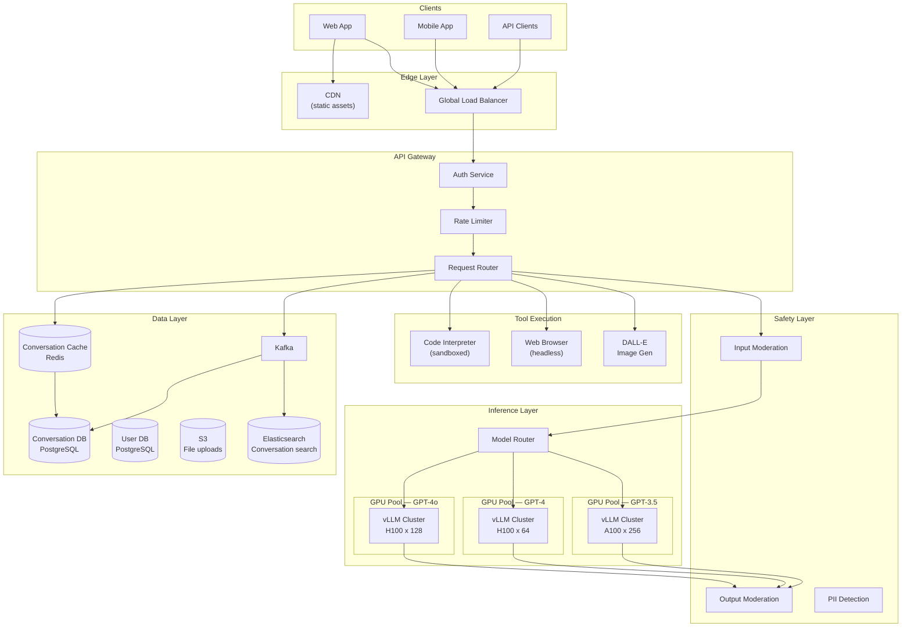
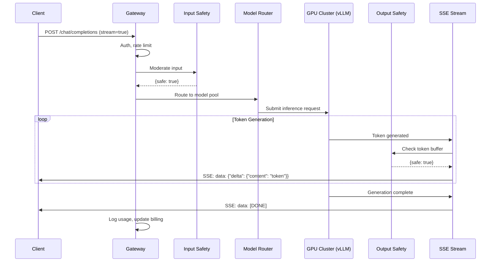
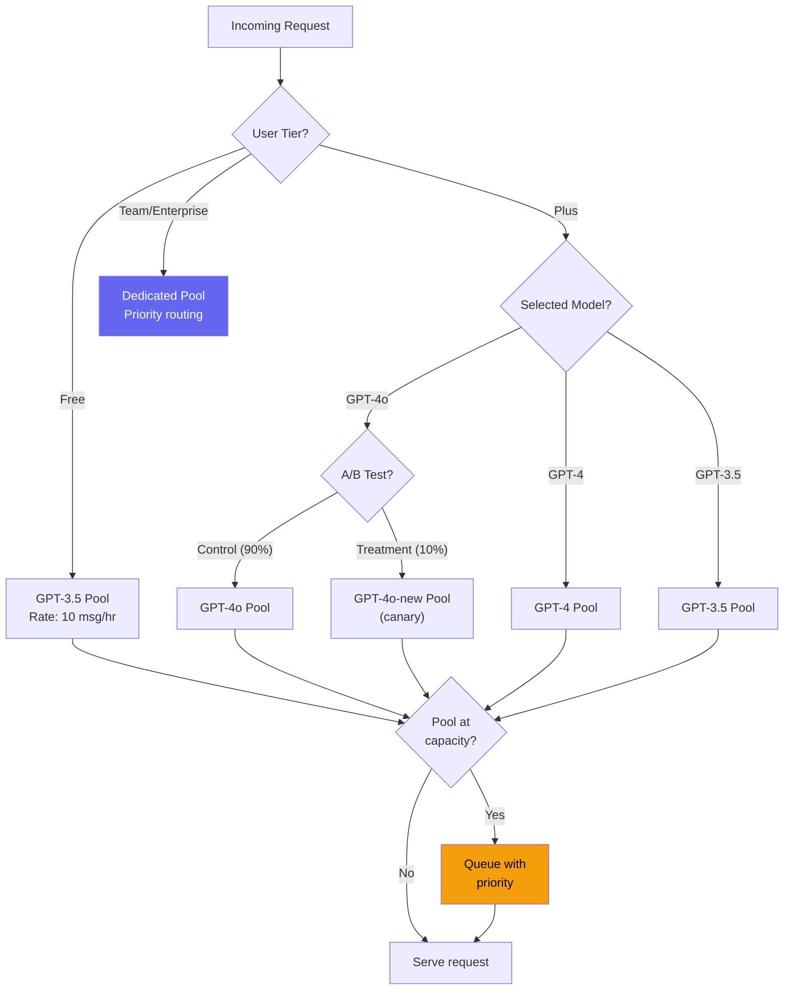
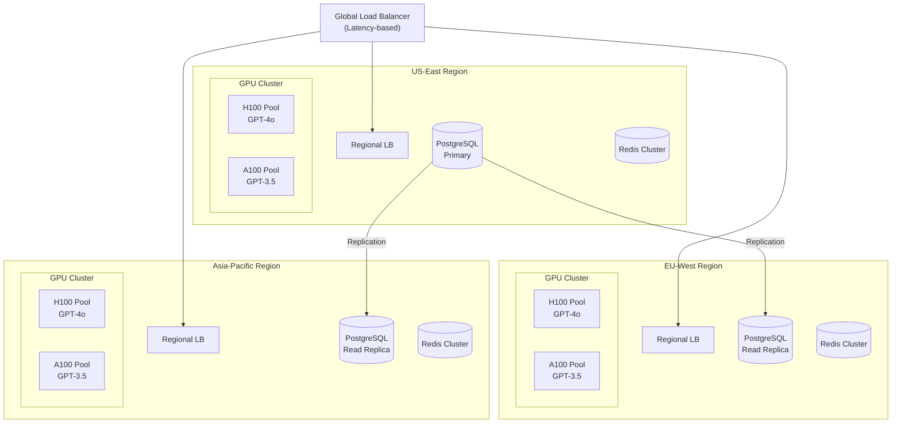

# Design ChatGPT

ChatGPT is a conversational AI product that allows users to interact with large language models through a chat interface. Under the hood, it is a streaming inference system that manages conversations, routes requests to appropriate models, enforces safety policies, and scales to millions of concurrent users — all while maintaining sub-second time-to-first-token latency.

This design covers the core technical challenges: token generation pipeline, conversation state management, model routing and A/B testing, content safety layers, streaming delivery, cost optimization, and horizontal scaling.

---

## 1. Problem Statement & Requirements

### Functional Requirements

1. **Multi-turn chat** — Users send messages and receive streaming responses, with full conversation history maintained
2. **Multiple models** — Support GPT-4o, GPT-4, GPT-3.5, and specialized models with routing
3. **Streaming responses** — Token-by-token delivery via Server-Sent Events (SSE)
4. **Conversation management** — Create, rename, delete, search conversations; persist across sessions
5. **System prompts** — Custom instructions that apply to all conversations
6. **File uploads** — Accept images, PDFs, code files as context
7. **Tool use** — Code interpreter, web browsing, DALL-E image generation
8. **Usage limits** — Rate limiting per tier (free, plus, team, enterprise)
9. **Shared conversations** — Generate shareable links for conversations
10. **Conversation branching** — Edit a previous message and fork the conversation

### Non-Functional Requirements

1. **Low latency** — Time to First Token (TTFT) < 500ms for GPT-4o, < 2s for GPT-4
2. **High availability** — 99.9% for chat, 99.99% for API
3. **Scale** — 200M weekly active users, 10M concurrent sessions, 50K requests/second peak
4. **Streaming** — Real-time token delivery at 30-80 tokens/second
5. **Safety** — Content moderation on both input and output, PII detection, jailbreak prevention
6. **Global** — Multi-region deployment with < 100ms network latency
7. **Cost** — GPU inference cost must be manageable at scale; tiered access

### Clarifying Questions

::: tip Questions to Ask
- What is the average conversation length (messages and tokens)?
- What percentage of traffic goes to each model tier?
- What is the expected input/output token ratio?
- Do we need to support real-time collaboration on conversations?
- What is the maximum context window we need to support?
- How long do we retain conversation history?
- What compliance requirements exist (SOC 2, HIPAA, GDPR)?
:::

---

## 2. Back-of-Envelope Estimation

### Traffic

- 200M weekly active users, ~30M daily active
- Average 10 messages/session, 2 sessions/day per active user
- 30M x 2 x 10 = 600M messages/day

$$
\text{Message QPS} = \frac{600M}{86400} \approx 6{,}944 \text{ QPS}
$$

$$
\text{Peak QPS} \approx 6{,}944 \times 5 \approx 35{,}000 \text{ QPS}
$$

### Token Volume

- Average input: 500 tokens (user message + conversation history)
- Average output: 300 tokens per response
- Daily tokens: 600M x (500 + 300) = 480B tokens/day

### GPU Compute

- Llama-3-70B class model: ~4,000 tokens/sec per A100 (with batching)
- H100 with vLLM: ~8,000 tokens/sec

$$
\text{Total tokens/sec} = \frac{480B}{86400} \approx 5.56M \text{ tokens/sec}
$$

$$
\text{H100s needed} = \frac{5.56M}{8{,}000} \approx 695 \text{ H100 GPUs}
$$

With 50% peak overhead and redundancy:

$$
\text{Total H100s} \approx 695 \times 1.5 \times 1.3 \approx 1{,}355 \text{ H100 GPUs}
$$

### Storage

- Average conversation: 20 messages x 400 tokens x 4 bytes ≈ 32 KB
- 200M users x avg 50 conversations = 10B conversations
- Total: 10B x 32 KB = 320 TB conversation storage
- Daily growth: 600M messages x 400 tokens x 4 bytes = 960 GB/day

### Bandwidth

$$
\text{Streaming output} = 35K \text{ QPS} \times 300 \text{ tokens} \times 4 \text{ bytes} \approx 42 \text{ MB/s}
$$

SSE overhead (headers, framing) adds ~3x: ~126 MB/s egress.

---

## 3. High-Level Design



---

## 4. API Design

```typescript
// Chat Completions — Streaming
// POST /v1/chat/completions
interface ChatCompletionRequest {
  model: 'gpt-4o' | 'gpt-4' | 'gpt-3.5-turbo';
  messages: Message[];
  stream: boolean;
  max_tokens?: number;
  temperature?: number;
  top_p?: number;
  tools?: Tool[];
  response_format?: { type: 'text' | 'json_object' };
}

interface Message {
  role: 'system' | 'user' | 'assistant' | 'tool';
  content: string | ContentPart[];
  name?: string;
  tool_calls?: ToolCall[];
  tool_call_id?: string;
}

// SSE Stream Response
// data: {"id":"chatcmpl-abc","choices":[{"delta":{"content":"Hello"},"index":0}]}
// data: {"id":"chatcmpl-abc","choices":[{"delta":{"content":" world"},"index":0}]}
// data: [DONE]

// Conversation Management
// POST   /v1/conversations
// GET    /v1/conversations?limit=20&before=cursor
// GET    /v1/conversations/:id
// PATCH  /v1/conversations/:id          { title: "New Title" }
// DELETE /v1/conversations/:id
// POST   /v1/conversations/:id/messages  { content: "...", role: "user" }
// POST   /v1/conversations/:id/share     → { share_url: "..." }
// POST   /v1/conversations/:id/branch    { from_message_id: "..." }
```

---

## 5. Data Model

```sql
-- Core conversation storage
CREATE TABLE conversations (
    id              UUID PRIMARY KEY DEFAULT gen_random_uuid(),
    user_id         UUID NOT NULL REFERENCES users(id),
    title           TEXT,
    model           TEXT NOT NULL DEFAULT 'gpt-4o',
    system_prompt   TEXT,
    created_at      TIMESTAMPTZ DEFAULT NOW(),
    updated_at      TIMESTAMPTZ DEFAULT NOW(),
    is_archived     BOOLEAN DEFAULT FALSE,
    share_token     TEXT UNIQUE,           -- For shared conversations
    parent_id       UUID REFERENCES conversations(id),  -- Branching
    branch_point    UUID                   -- Message ID where branched
);

CREATE INDEX idx_conversations_user ON conversations(user_id, updated_at DESC);
CREATE INDEX idx_conversations_share ON conversations(share_token) WHERE share_token IS NOT NULL;

CREATE TABLE messages (
    id              UUID PRIMARY KEY DEFAULT gen_random_uuid(),
    conversation_id UUID NOT NULL REFERENCES conversations(id) ON DELETE CASCADE,
    role            TEXT NOT NULL CHECK (role IN ('system', 'user', 'assistant', 'tool')),
    content         TEXT,
    content_parts   JSONB,                 -- For multi-modal (images, files)
    tool_calls      JSONB,                 -- Tool call requests
    tool_call_id    TEXT,                   -- Tool response reference
    model           TEXT,                   -- Which model generated this
    token_count     JSONB,                 -- {prompt: N, completion: N}
    finish_reason   TEXT,                   -- 'stop', 'length', 'tool_calls'
    created_at      TIMESTAMPTZ DEFAULT NOW(),
    sequence_num    INTEGER NOT NULL        -- Order within conversation
);

CREATE INDEX idx_messages_conversation ON messages(conversation_id, sequence_num);

-- Usage tracking for rate limiting and billing
CREATE TABLE usage_events (
    id              UUID PRIMARY KEY DEFAULT gen_random_uuid(),
    user_id         UUID NOT NULL,
    conversation_id UUID,
    model           TEXT NOT NULL,
    prompt_tokens   INTEGER NOT NULL,
    completion_tokens INTEGER NOT NULL,
    latency_ms      INTEGER,
    ttft_ms         INTEGER,               -- Time to first token
    created_at      TIMESTAMPTZ DEFAULT NOW()
) PARTITION BY RANGE (created_at);

-- Monthly partitions for usage data
CREATE TABLE usage_events_2026_03 PARTITION OF usage_events
    FOR VALUES FROM ('2026-03-01') TO ('2026-04-01');

-- Content moderation log
CREATE TABLE moderation_events (
    id              UUID PRIMARY KEY DEFAULT gen_random_uuid(),
    message_id      UUID REFERENCES messages(id),
    direction       TEXT NOT NULL CHECK (direction IN ('input', 'output')),
    flagged         BOOLEAN NOT NULL,
    categories      JSONB,                 -- {hate: 0.01, violence: 0.95, ...}
    action_taken    TEXT,                   -- 'allowed', 'blocked', 'warning'
    created_at      TIMESTAMPTZ DEFAULT NOW()
);
```

---

## 6. Deep Dive: Token Generation Pipeline

The token generation pipeline is the heart of ChatGPT. Each user message triggers this flow:



### Conversation Context Assembly

The most expensive part of each request is assembling the conversation context. ChatGPT must include the full conversation history (up to the model's context window) in each request:

```python
# context_assembler.py — Build the prompt from conversation history
from dataclasses import dataclass


@dataclass
class ContextConfig:
    max_context_tokens: int = 128000   # GPT-4o context window
    reserved_output_tokens: int = 4096  # Reserve for generation
    system_prompt_tokens: int = 0       # Calculated at runtime


class ContextAssembler:
    def __init__(self, config: ContextConfig):
        self.config = config

    def assemble(
        self,
        system_prompt: str,
        messages: list[dict],
        custom_instructions: str | None = None,
    ) -> list[dict]:
        """Assemble conversation context within token budget."""
        budget = (
            self.config.max_context_tokens
            - self.config.reserved_output_tokens
        )

        result = []

        # 1. System prompt always included
        combined_system = system_prompt
        if custom_instructions:
            combined_system += f"\n\n{custom_instructions}"

        system_tokens = self._count_tokens(combined_system)
        budget -= system_tokens
        result.append({"role": "system", "content": combined_system})

        # 2. Always include the latest user message
        latest = messages[-1]
        latest_tokens = self._count_tokens(latest["content"])
        budget -= latest_tokens

        # 3. Include as many previous messages as fit (most recent first)
        included = [latest]
        for msg in reversed(messages[:-1]):
            msg_tokens = self._count_tokens(msg["content"])
            if msg_tokens <= budget:
                included.insert(0, msg)
                budget -= msg_tokens
            else:
                # Try to include a summary of older messages
                break

        result.extend(included)
        return result

    def _count_tokens(self, text: str) -> int:
        """Approximate token count (use tiktoken in production)."""
        # tiktoken.encoding_for_model("gpt-4o").encode(text)
        return len(text) // 4  # Rough approximation
```

---

## 7. Deep Dive: Model Routing

ChatGPT routes requests to different model pools based on user tier, model selection, system load, and A/B test assignments:



---

## 8. Deep Dive: Safety Layer

Content safety is critical — both for preventing harmful outputs and for protecting the platform from adversarial inputs.

### Multi-Layer Safety Architecture

```mermaid
graph LR
    subgraph Input["Input Safety (Pre-inference)"]
        I1["Blocklist<br/>(known attacks)"]
        I2["Classifier<br/>(content policy)"]
        I3["PII Detection<br/>(SSN, CC, etc.)"]
        I4["Injection Detection<br/>(prompt injection)"]
    end

    subgraph Model["Model Layer"]
        M1["RLHF Alignment<br/>(trained refusals)"]
        M2["System Prompt<br/>(safety instructions)"]
    end

    subgraph Output["Output Safety (Post-inference)"]
        O1["Streaming Filter<br/>(real-time check)"]
        O2["Classifier<br/>(content policy)"]
        O3["PII Scrubber<br/>(remove leaked PII)"]
    end

    I1 --> I2 --> I3 --> I4 --> M1
    M1 --> M2
    M2 --> O1 --> O2 --> O3

    style Input fill:#dc2626,color:#fff
    style Model fill:#f59e0b,color:#000
    style Output fill:#22c55e,color:#fff
```



### Streaming Output Moderation

Output moderation must work on streaming token output without adding perceptible latency:

```python
# streaming_moderator.py — Real-time content filter for SSE streams
import re
from collections import deque
from dataclasses import dataclass


@dataclass
class ModerationResult:
    action: str  # "allow", "buffer", "block", "warn"
    reason: str | None = None


class StreamingModerator:
    """Moderate LLM output token-by-token during streaming."""

    BLOCKED_PATTERNS = [
        r"(?:how\s+to\s+(?:make|build|create)\s+(?:a\s+)?(?:bomb|weapon|explosive))",
        r"(?:synthesize|manufacture)\s+(?:drugs|narcotics|meth)",
    ]

    def __init__(self, buffer_size: int = 50):
        self.buffer = deque(maxlen=buffer_size)
        self.full_text = []
        self.compiled_patterns = [
            re.compile(p, re.IGNORECASE) for p in self.BLOCKED_PATTERNS
        ]

    def check_token(self, token: str) -> ModerationResult:
        """Check each token as it streams. Buffer tokens when
        partial matches are detected."""
        self.buffer.append(token)
        self.full_text.append(token)

        buffer_text = "".join(self.buffer)

        # Check for blocked patterns
        for pattern in self.compiled_patterns:
            if pattern.search(buffer_text):
                return ModerationResult(
                    action="block",
                    reason=f"Matched safety pattern"
                )

            # Check for partial match (beginning of pattern)
            partial = pattern.pattern[:20]
            if re.search(partial, buffer_text, re.IGNORECASE):
                return ModerationResult(
                    action="buffer",
                    reason="Potential partial match — buffering"
                )

        return ModerationResult(action="allow")

    def finalize(self) -> ModerationResult:
        """Final check on complete response."""
        full_text = "".join(self.full_text)

        for pattern in self.compiled_patterns:
            if pattern.search(full_text):
                return ModerationResult(
                    action="block",
                    reason="Blocked content in final review"
                )

        return ModerationResult(action="allow")
```

::: warning Safety Cannot Rely on a Single Layer
Every individual safety layer has bypasses. The defense-in-depth approach (input moderation + RLHF alignment + output filtering + human review for flagged content) makes bypassing all layers simultaneously far more difficult. No single layer is sufficient.
:::

---

## 9. Deep Dive: Streaming Architecture

ChatGPT's streaming uses Server-Sent Events (SSE) to deliver tokens as they are generated:

```
Client ← Gateway ← vLLM GPU
   ↑                    ↑
   └── SSE connection ──┘ (token by token)
```

### SSE Implementation

```python
# streaming_handler.py — SSE stream from vLLM to client
import json
import asyncio
from fastapi import FastAPI, Request
from fastapi.responses import StreamingResponse
import httpx

app = FastAPI()


@app.post("/v1/chat/completions")
async def chat_completions(request: Request):
    body = await request.json()

    if body.get("stream", False):
        return StreamingResponse(
            stream_tokens(body),
            media_type="text/event-stream",
            headers={
                "Cache-Control": "no-cache",
                "Connection": "keep-alive",
                "X-Accel-Buffering": "no",  # Disable nginx buffering
            },
        )
    else:
        return await non_streaming_response(body)


async def stream_tokens(body: dict):
    """Stream tokens from GPU cluster to client via SSE."""
    moderator = StreamingModerator()
    request_id = f"chatcmpl-{generate_id()}"
    token_buffer = []
    usage = {"prompt_tokens": 0, "completion_tokens": 0}

    async with httpx.AsyncClient() as client:
        async with client.stream(
            "POST",
            f"http://vllm-cluster:8000/v1/chat/completions",
            json={**body, "stream": True},
            timeout=120.0,
        ) as response:
            async for line in response.aiter_lines():
                if not line.startswith("data: "):
                    continue

                data = line[6:]
                if data == "[DONE]":
                    # Final moderation check
                    result = moderator.finalize()
                    if result.action == "block":
                        # Replace entire response with safety message
                        yield f"data: {json.dumps(make_safety_chunk(request_id))}\n\n"
                    yield "data: [DONE]\n\n"
                    break

                chunk = json.loads(data)
                token = chunk["choices"][0].get("delta", {}).get("content", "")

                if token:
                    # Moderate each token
                    mod_result = moderator.check_token(token)

                    if mod_result.action == "allow":
                        # Flush any buffered tokens
                        for buffered in token_buffer:
                            yield f"data: {json.dumps(make_chunk(request_id, buffered))}\n\n"
                        token_buffer.clear()

                        yield f"data: {json.dumps(make_chunk(request_id, token))}\n\n"
                        usage["completion_tokens"] += 1

                    elif mod_result.action == "buffer":
                        token_buffer.append(token)

                    elif mod_result.action == "block":
                        yield f"data: {json.dumps(make_safety_chunk(request_id))}\n\n"
                        yield "data: [DONE]\n\n"
                        return


def make_chunk(request_id: str, content: str) -> dict:
    return {
        "id": request_id,
        "object": "chat.completion.chunk",
        "choices": [{
            "index": 0,
            "delta": {"content": content},
            "finish_reason": None,
        }],
    }
```

---

## 10. Scaling Strategies

### Horizontal Scaling Architecture



### Key Scaling Decisions

| Challenge | Solution | Trade-off |
|-----------|----------|-----------|
| **GPU utilization** | Continuous batching (vLLM) | Latency variance increases with batch size |
| **Cold starts** | Warm standby GPU pools | Higher idle cost |
| **Conversation locality** | Sticky sessions by user_id | Uneven load distribution |
| **Peak traffic** | Queue with priority (paid > free) | Free tier degradation |
| **Context assembly** | Cache recent conversations in Redis | Memory cost, cache invalidation |
| **Cost at scale** | Smaller models for simpler queries | Quality reduction risk |
| **Multi-region** | Latency-based DNS routing | Data replication complexity |

---

## 11. Cost Optimization

### Cost Breakdown (Estimated Monthly)

| Component | Unit Cost | Volume | Monthly Cost |
|-----------|----------|--------|-------------|
| **H100 GPUs (GPT-4o)** | $8.76/hr | 128 GPUs | $808K |
| **H100 GPUs (GPT-4)** | $8.76/hr | 64 GPUs | $404K |
| **A100 GPUs (GPT-3.5)** | $3.67/hr | 256 GPUs | $676K |
| **PostgreSQL (RDS)** | $5K/instance | 6 instances | $30K |
| **Redis Cluster** | $3K/cluster | 3 clusters | $9K |
| **S3 Storage** | $0.023/GB | 400 TB | $9.2K |
| **Network egress** | $0.09/GB | 100 TB | $9K |
| **Total** | | | **~$1.95M/month** |

### Optimization Strategies

1. **Prompt caching** — Cache KV states for system prompts (saves 30-50% compute on repeated prefixes)
2. **Model cascading** — Route simple queries to GPT-3.5, complex ones to GPT-4o (saves 60% on routable traffic)
3. **Quantization** — INT8 inference reduces GPU count by ~50%
4. **Spot instances** — Use for batch processing, fine-tuning (saves 60-90%)
5. **Context truncation** — Summarize old messages instead of including full history

::: tip Model Cascading Is the Biggest Lever
Route queries through a lightweight classifier first. Simple questions ("What is the capital of France?") go to GPT-3.5 (~$0.50/M tokens). Complex reasoning, coding, and creative tasks go to GPT-4o (~$5/M tokens). If 70% of queries can be handled by the cheaper model, you save ~60% on inference costs.
:::

---

## 12. Monitoring & Observability

### Key Metrics Dashboard

| Metric | Target | Alert Threshold |
|--------|--------|----------------|
| **TTFT (p50)** | < 200ms | > 500ms |
| **TTFT (p99)** | < 1s | > 3s |
| **Tokens/second** | 30-80 per stream | < 15 per stream |
| **GPU utilization** | 70-90% | < 40% or > 95% |
| **Error rate** | < 0.1% | > 1% |
| **Safety block rate** | 0.01-0.1% | > 1% (possible attack) |
| **Queue depth** | < 100 | > 1000 |
| **Conversation save latency** | < 50ms | > 500ms |

---

## 13. Trade-offs & Alternatives

| Decision | Choice | Alternative | Why |
|----------|--------|-------------|-----|
| **Streaming protocol** | SSE | WebSocket | SSE is simpler, unidirectional (sufficient for chat) |
| **Conversation storage** | PostgreSQL | DynamoDB | Strong consistency for conversation integrity |
| **GPU framework** | vLLM | TGI, Triton | Highest throughput with PagedAttention |
| **Safety architecture** | Multi-layer | Single classifier | Defense in depth required for adversarial users |
| **Caching** | Redis + prefix caching | Memcached | Redis Streams for pub/sub + caching |
| **Context management** | Full history + truncation | RAG on history | Simplicity; RAG adds latency for marginal benefit |

---

## Key Takeaways

1. **The system is fundamentally a streaming inference pipeline.** Every design decision revolves around minimizing time-to-first-token while maximizing GPU utilization.

2. **Safety is not optional — it is architectural.** Input moderation, RLHF alignment, and output filtering must all exist. Each layer catches what others miss.

3. **Model routing is the biggest cost lever.** Routing simple queries to cheaper models saves 60%+ on inference costs without perceptible quality loss.

4. **Conversation context assembly is the main scaling challenge.** As conversations grow, context windows fill up, increasing latency and cost per request. Summarization and caching are essential.

5. **GPU infrastructure dominates cost.** At scale, GPU compute is 95%+ of the bill. Every optimization (quantization, batching, caching) directly impacts profitability.

### Related Pages

- [AI Infrastructure Overview](/infrastructure/ai-infrastructure/) — GPU types, provisioning, cost optimization
- [Model Serving Deep Dive](/infrastructure/ai-infrastructure/model-serving) — vLLM, TGI, Triton comparison
- [Advanced Prompt Engineering](/ai-ml-engineering/prompt-engineering-advanced) — Prompting techniques used in production
- [Design GitHub Copilot](/system-design-interviews/copilot) — Another AI system design
- [Design Recommendation Engine](/system-design-interviews/recommendation-engine) — ML-powered system design
