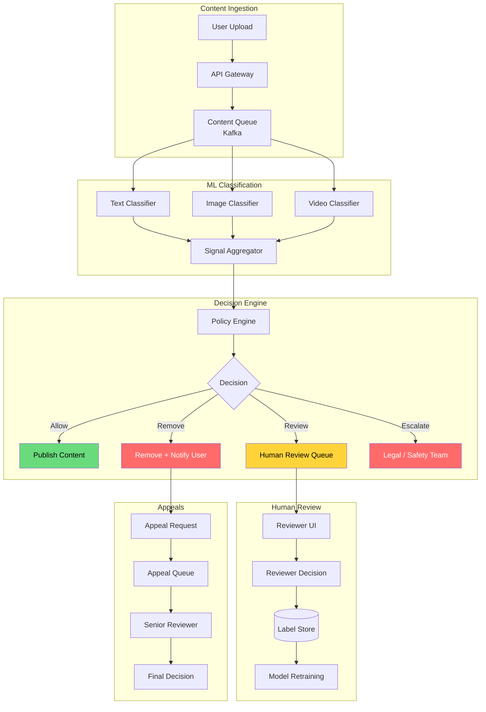
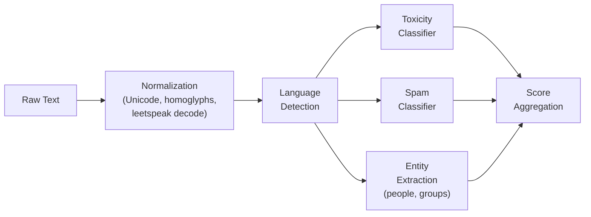
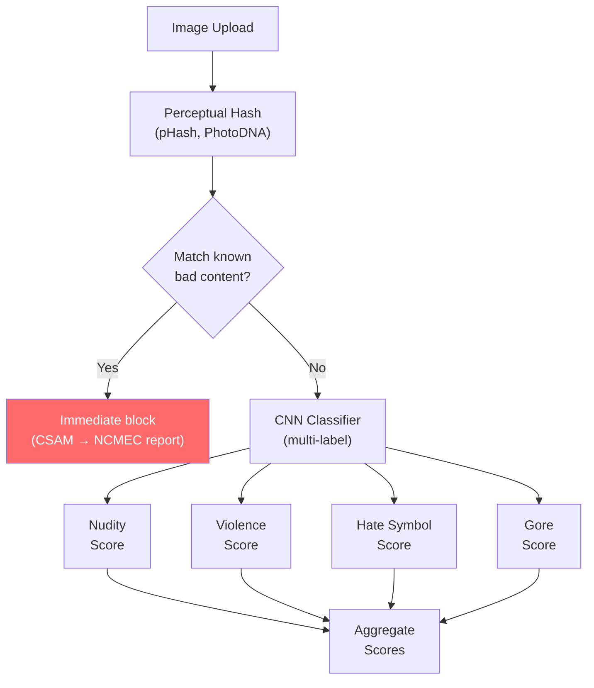
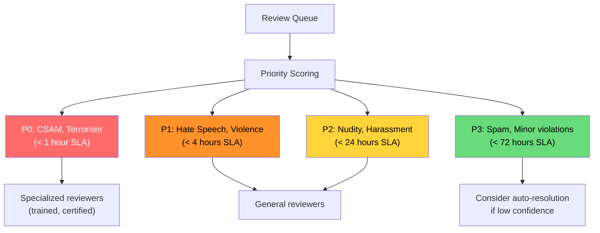
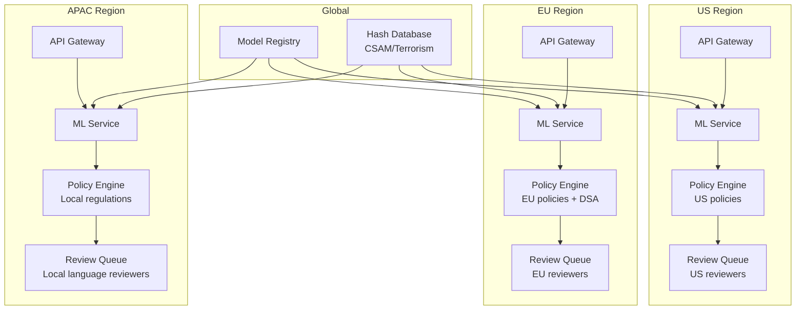

# Design Content Moderation System

Content moderation is the invisible shield between users and the worst content the internet can produce. Every platform with user-generated content — social media, marketplaces, forums, dating apps — needs a moderation system that balances safety with free expression, scales to billions of pieces of content, and makes defensible decisions in milliseconds.

This is a system where both failure modes are catastrophic: missing harmful content causes real-world harm; over-moderating silences legitimate speech and drives users away.

---

## 1. Problem Statement & Requirements

### Functional Requirements

1. **Multi-modal classification** — Classify text, images, and video for policy violations
2. **Policy engine** — Configurable rules that map classification signals to actions
3. **Pre-publish screening** — Score content before it goes live (latency-sensitive)
4. **Post-publish scanning** — Retroactively scan existing content when policies change
5. **Human review queue** — Route borderline cases to trained human reviewers
6. **Appeal flow** — Users can appeal moderation decisions, triggering re-review
7. **Escalation** — Severe content (CSAM, terrorism) triggers immediate action and legal reporting
8. **Audit trail** — Every decision is logged with reasoning, model version, and reviewer ID
9. **Transparency** — Users see why their content was removed and how to appeal

### Non-Functional Requirements

1. **Latency** — Pre-publish scoring < 500 ms (text), < 2 s (image), < 30 s (video)
2. **Throughput** — 500K pieces of content per minute at peak
3. **Availability** — 99.99% (content creation path cannot be blocked)
4. **Accuracy** — Precision > 95% for auto-removal (very few false positives)
5. **Recall** — > 99% for severe categories (CSAM, terrorism)
6. **Consistency** — Same content gets the same decision regardless of timing or reviewer
7. **Adaptability** — New policy categories deployable within hours

### Clarifying Questions

::: tip Questions to Ask
- What content types? Text, images, video, audio, live streams?
- What are the policy categories? (Hate speech, nudity, violence, spam, copyright, CSAM, terrorism)
- Is this pre-publish (before content goes live) or post-publish (retroactive)?
- What is the reviewer workforce size and cost per review?
- What jurisdictions do we operate in? (Different laws per country)
- What is the SLA for human review turnaround?
- Do we need to handle adversarial attacks (text obfuscation, steganography)?
:::

---

## 2. Back-of-Envelope Estimation

### Traffic

- 500K content items per minute at peak = ~8,300 per second
- Mix: 60% text, 30% images, 10% video
- Text: 5K/s, Images: 2.5K/s, Video: 830/s

$$
\text{Daily content volume} = 500K \times 60 \times 24 = 720M \text{ items/day}
$$

### ML Inference

- Text classifier: ~5 ms per item (GPU), 5K QPS = manageable on a few GPUs
- Image classifier: ~50 ms per image, 2.5K QPS = ~125 GPUs needed
- Video: sample 1 frame/second, 30-second average video = 30 frames per video
  - 830 videos/s x 30 frames = 24.9K image classifications/s additional

$$
\text{Total image classifications} = 2{,}500 + 24{,}900 = 27{,}400 \text{/second}
$$

### Human Review

- Assume 2% of content needs human review
- 720M x 2% = 14.4M reviews/day
- At 100 reviews/reviewer/day = 144K reviewers needed (this is why Meta employs 40K+ moderators)
- More realistically: use ML to triage priority, only review highest-impact content

### Storage

- Decision log per item: ~1 KB (scores, policy, action, reviewer, timestamp)
- Daily: 720M x 1 KB = 720 GB/day
- 1-year retention: ~263 TB

---

## 3. High-Level Design



### API Design

```typescript
// POST /api/v1/content/moderate
interface ModerationRequest {
  contentId: string;
  contentType: 'text' | 'image' | 'video';
  text?: string;
  mediaUrls?: string[];
  userId: string;
  context: {
    platform: string;
    contentContext: 'post' | 'comment' | 'message' | 'profile';
    targetAudience?: 'public' | 'friends' | 'private';
  };
}

interface ModerationResponse {
  contentId: string;
  decision: 'ALLOW' | 'REMOVE' | 'REVIEW' | 'ESCALATE';
  scores: {
    category: string;       // 'hate_speech', 'nudity', 'violence', etc.
    score: number;          // 0.0 - 1.0
    subcategory?: string;   // 'racial_slur', 'explicit_nudity'
  }[];
  policyViolations: string[];
  appealEligible: boolean;
  explanation: string;       // Human-readable reason
}

// POST /api/v1/content/{contentId}/appeal
interface AppealRequest {
  contentId: string;
  userId: string;
  reason: string;
}
```

---

## 4. Deep Dive: ML Classification Pipeline

### Text Classification

Text moderation must handle:
- Direct hate speech ("I hate [group]")
- Coded language and dogwhistles ("1488", "globalists")
- Context-dependent meaning ("kill it" in gaming vs. threat)
- Multilingual content (200+ languages)
- Adversarial evasion ("h@te", "s p a c e d", Unicode homoglyphs)



```python
class TextModerationPipeline:
    """Multi-stage text classification pipeline."""

    def __init__(self):
        self.normalizer = TextNormalizer()
        self.lang_detector = LanguageDetector()
        self.toxicity_model = load_model("toxicity_multilingual_v5")
        self.spam_model = load_model("spam_classifier_v3")

    def classify(self, text: str) -> dict:
        # Step 1: Normalize adversarial text
        normalized = self.normalizer.normalize(text)
        # "h@t3 sp33ch" → "hate speech"
        # Unicode homoglyphs resolved
        # Zero-width characters stripped

        # Step 2: Detect language
        lang = self.lang_detector.detect(normalized)

        # Step 3: Run classifiers
        toxicity_scores = self.toxicity_model.predict(normalized)
        # Returns: {
        #   'hate': 0.92, 'harassment': 0.15,
        #   'violence': 0.03, 'sexual': 0.01,
        #   'self_harm': 0.00
        # }

        spam_score = self.spam_model.predict(normalized)

        return {
            'language': lang,
            'toxicity': toxicity_scores,
            'spam': spam_score,
            'text_length': len(text),
            'normalized_text': normalized,
        }


class TextNormalizer:
    """Defeat common text-based evasion techniques."""

    def normalize(self, text: str) -> str:
        text = self.resolve_homoglyphs(text)     # Cyrillic а → Latin a
        text = self.decode_leetspeak(text)        # h@t3 → hate
        text = self.remove_zero_width(text)       # strip ZWJ, ZWNJ, ZWS
        text = self.collapse_whitespace(text)     # "h a t e" → "hate"
        text = self.normalize_unicode(text)       # NFC normalization
        return text
```

### Image Classification



| Technique | Purpose | How |
|-----------|---------|-----|
| **Perceptual hashing** | Match known bad images (CSAM, terrorism) | pHash/dHash/PhotoDNA — robust to resizing, cropping |
| **CNN classifier** | Detect policy violations in new images | Multi-label classification (nudity, violence, hate symbols) |
| **OCR + text classifier** | Detect hateful text in images | Extract text via OCR, run through text pipeline |
| **Object detection** | Identify weapons, drugs, logos | YOLO / Faster R-CNN for specific objects |
| **Face detection** | Age estimation for CSAM, identify public figures | Face detection + age estimation model |

### Video Classification

Video is the most expensive modality — you cannot classify every frame.

```python
class VideoModerationPipeline:
    """Efficient video moderation via keyframe sampling."""

    def classify(self, video_url: str) -> dict:
        # Step 1: Extract keyframes (not every frame)
        keyframes = self.extract_keyframes(video_url, strategy='scene_change')
        # Typically 1-3 frames per second of content change

        # Step 2: Classify each keyframe
        frame_scores = [self.image_classifier.classify(frame) for frame in keyframes]

        # Step 3: Extract audio and transcribe
        audio = self.extract_audio(video_url)
        transcript = self.speech_to_text(audio)
        text_scores = self.text_classifier.classify(transcript)

        # Step 4: Aggregate — take max score per category across all frames
        aggregated = {}
        for category in ['nudity', 'violence', 'hate', 'gore']:
            aggregated[category] = max(
                fs.get(category, 0) for fs in frame_scores
            )

        # Merge text and visual signals
        aggregated['text_toxicity'] = text_scores.get('hate', 0)

        return aggregated

    def extract_keyframes(self, video_url, strategy='scene_change'):
        """Sample frames intelligently instead of uniformly."""
        if strategy == 'scene_change':
            # Detect scene boundaries, sample 1 frame per scene
            return detect_scene_changes(video_url)
        elif strategy == 'uniform':
            # Fall back to 1 frame per second
            return sample_uniform(video_url, fps=1)
```

::: warning
Video moderation latency is measured in seconds, not milliseconds. For pre-publish moderation of video, either accept a processing delay (upload, process, then publish) or use a two-phase approach: quick screening on the first few seconds, then full analysis post-publish.
:::

---

## 5. Deep Dive: Policy Engine

The policy engine decouples ML scores from business decisions. Models output probability scores; the policy engine maps those scores to actions based on configurable rules.

### Policy Configuration

```yaml
# policy_config.yaml
policies:
  - name: nudity_explicit
    category: nudity
    subcategory: explicit
    thresholds:
      auto_remove: 0.95      # Very high confidence → remove
      human_review: 0.70      # Moderate confidence → review
      allow: 0.0              # Below review threshold → allow
    context_overrides:
      - context: profile_photo
        auto_remove: 0.85     # Stricter for profile photos
      - context: private_message
        auto_remove: 0.98     # More lenient for private messages
    jurisdictions:
      - region: DE             # Germany: stricter
        auto_remove: 0.90
      - region: US
        auto_remove: 0.95

  - name: hate_speech
    category: toxicity
    subcategory: hate
    thresholds:
      auto_remove: 0.92
      human_review: 0.60
    recidivism_boost:
      prior_violations: 3     # After 3 violations
      threshold_reduction: 0.15  # Lower thresholds by 15%

  - name: csam
    category: csam
    thresholds:
      auto_remove: 0.50       # Very low threshold — always err on side of removal
      escalate: 0.50          # Always escalate for legal reporting
    legal_reporting: true       # Mandatory NCMEC report
```

```python
class PolicyEngine:
    """Map ML scores to moderation actions."""

    def evaluate(self, scores: dict, context: dict) -> dict:
        decisions = []

        for policy in self.policies:
            category_score = scores.get(policy.category, {}).get(
                policy.subcategory, 0
            )

            # Apply context overrides
            thresholds = self.get_thresholds(policy, context)

            # Apply recidivism boost
            if policy.recidivism_boost:
                user_violations = self.get_violation_count(context['user_id'])
                if user_violations >= policy.recidivism_boost['prior_violations']:
                    thresholds = self.reduce_thresholds(
                        thresholds,
                        policy.recidivism_boost['threshold_reduction']
                    )

            # Determine action
            if category_score >= thresholds['auto_remove']:
                action = 'REMOVE'
            elif category_score >= thresholds['human_review']:
                action = 'REVIEW'
            else:
                action = 'ALLOW'

            # Escalation check
            if policy.legal_reporting and action == 'REMOVE':
                action = 'ESCALATE'

            decisions.append({
                'policy': policy.name,
                'score': category_score,
                'action': action,
                'threshold_used': thresholds,
            })

        # Final decision: most severe action wins
        final_action = max(
            decisions,
            key=lambda d: ['ALLOW', 'REVIEW', 'REMOVE', 'ESCALATE'].index(d['action'])
        )

        return {
            'decision': final_action['action'],
            'policy_violations': [d for d in decisions if d['action'] != 'ALLOW'],
            'all_scores': decisions,
        }
```

::: danger
CSAM (child sexual abuse material) requires mandatory legal reporting in most jurisdictions. Automated detection must have near-zero false negative rate. Use perceptual hashing databases (PhotoDNA, NCMEC hash lists) in addition to ML classifiers. False positives are acceptable for this category — always escalate to human review.
:::

---

## 6. Deep Dive: Human Review System

### Queue Prioritization

Not all review items are equal. Prioritize by severity and reach:



```python
def compute_review_priority(content, scores, context):
    """Score review items for queue ordering."""
    base_priority = {
        'csam': 1000,
        'terrorism': 900,
        'violence_graphic': 800,
        'hate_speech': 700,
        'harassment': 600,
        'nudity': 500,
        'spam': 200,
    }

    # Start with category-based priority
    category = max(scores, key=scores.get)
    priority = base_priority.get(category, 100)

    # Boost for high-reach content
    reach = context.get('author_follower_count', 0)
    if reach > 1_000_000:
        priority += 200
    elif reach > 100_000:
        priority += 100
    elif reach > 10_000:
        priority += 50

    # Boost for viral content
    if context.get('engagement_velocity', 0) > 1000:  # shares/hour
        priority += 150

    # Boost for reports from multiple users
    report_count = context.get('user_report_count', 0)
    priority += min(report_count * 20, 200)

    return priority
```

### Reviewer Quality and Calibration

| Metric | Target | Purpose |
|--------|--------|---------|
| **Inter-rater agreement** | > 85% (Cohen's kappa > 0.7) | Consistency between reviewers |
| **Agreement with gold set** | > 90% | Accuracy against expert-labeled examples |
| **Review throughput** | 80-120 items/day | Productivity (varies by content type) |
| **False overturn rate** | < 5% | Decisions upheld on appeal |
| **Wellness check compliance** | 100% | Reviewer mental health (mandatory breaks) |

::: warning
Reviewer wellness is a first-class concern. Continuous exposure to violent, abusive, and disturbing content causes PTSD, anxiety, and depression. Implement mandatory breaks, content blurring by default, wellness check-ins, and access to counseling. Rotate reviewers across severity levels.
:::

---

## 7. Deep Dive: Appeals Flow

```mermaid
flowchart TD
    A["Content Removed"] --> B["User submits appeal"]
    B --> C{"Auto-review\neligible?"}
    C -->|Yes| D["Re-run latest\nML models"]
    D --> E{"New score\nbelow threshold?"}
    E -->|Yes| F["Auto-reinstate"]
    E -->|No| G["Route to\nsenior reviewer"]
    C -->|No| G
    G --> H{"Upheld or\noverturned?"}
    H -->|Overturned| I["Reinstate content\nApologize to user"]
    H -->|Upheld| J["Notify user\n(final decision)"]

    J --> K{"Eligible for\n2nd appeal?"}
    K -->|Yes\n(policy change)| L["Escalate to\npolicy team"]
    K -->|No| M["Case closed"]

    style F fill:#69db7c,color:#000
    style I fill:#69db7c,color:#000
    style J fill:#ff6b6b,color:#fff
```

### Appeal Auto-Resolution

When models improve, previously borderline content may now score below thresholds:

```python
class AppealProcessor:
    def process_appeal(self, content_id: str, user_id: str):
        # Get original decision
        original = self.decision_store.get(content_id)

        # Re-score with latest models
        content = self.content_store.get(content_id)
        new_scores = self.classify(content)

        # Apply current policy (may have changed since original decision)
        new_decision = self.policy_engine.evaluate(
            new_scores,
            original.context
        )

        if new_decision['decision'] == 'ALLOW':
            # Model improvement or policy change reversed the decision
            self.reinstate(content_id)
            self.notify_user(user_id, "appeal_approved_auto")
            self.log_appeal(content_id, "auto_approved", new_scores)
            return

        # Route to human for manual review
        self.enqueue_for_review(
            content_id,
            priority="appeal",
            original_decision=original,
            new_scores=new_scores
        )
```

---

## 8. Handling Adversarial Content

### Evasion Techniques and Countermeasures

| Evasion Technique | Example | Countermeasure |
|------------------|---------|----------------|
| **Leetspeak** | h@t3, $h!t | Leetspeak decoder in text normalizer |
| **Character spacing** | "h a t e" | Whitespace collapse |
| **Unicode homoglyphs** | Using Cyrillic "a" instead of Latin "a" | Unicode confusable mapping |
| **Text in images** | Hate text rendered as image | OCR pipeline on all images |
| **Steganography** | Hidden content in image pixels | Perceptual hashing still catches visual content |
| **Audio evasion** | Hate speech over music | ASR + text classification |
| **Code switching** | Mixing languages mid-sentence | Multilingual models |
| **Sarcasm/irony** | "Oh great, another [group] person" | Context-aware models, hard problem |
| **Dog whistles** | Coded language for in-group | Continuously updated lexicon + embedding detection |

```python
class HomoglyphResolver:
    """Map Unicode confusables to ASCII equivalents."""

    # Partial mapping — real implementation uses Unicode confusable database
    CONFUSABLES = {
        '\u0430': 'a',  # Cyrillic а
        '\u0435': 'e',  # Cyrillic е
        '\u043e': 'o',  # Cyrillic о
        '\u0440': 'p',  # Cyrillic р
        '\u0441': 'c',  # Cyrillic с
        '\u0443': 'y',  # Cyrillic у
        '\u0445': 'x',  # Cyrillic х
        '\u0456': 'i',  # Ukrainian і
        # ... hundreds more
    }

    def resolve(self, text: str) -> str:
        return ''.join(
            self.CONFUSABLES.get(char, char)
            for char in text
        )
```

---

## 9. Monitoring and Metrics

### Operational Dashboard

| Metric | Formula | Target |
|--------|---------|--------|
| **Auto-remove precision** | True violations / total auto-removed | > 95% |
| **Recall (severe categories)** | Detected / total actual violations | > 99% |
| **Review queue latency** | Time from enqueue to decision | P0 < 1h, P1 < 4h |
| **Appeal overturn rate** | Overturned appeals / total appeals | < 10% |
| **Model latency P99** | Classification time | Text < 500ms, Image < 2s |
| **False positive rate** | Wrongly removed / total processed | < 0.1% |
| **Prevalence** | Violating content seen by users / total content views | < 0.05% |

### Prevalence as the North Star Metric

```python
def compute_prevalence(time_window):
    """
    Prevalence = violating content impressions / total impressions

    This is the metric that matters — not how much bad content exists,
    but how much bad content users actually SEE.
    """
    total_impressions = get_total_impressions(time_window)
    violating_impressions = get_violating_impressions(time_window)

    # Violating impressions include:
    # 1. Content later removed (was seen before removal)
    # 2. Content caught by retroactive scans
    # 3. Estimated from sampling (human review of random sample)

    prevalence = violating_impressions / total_impressions
    return prevalence

# Track per policy category
# Target: < 0.05% prevalence for hate speech
# Target: < 0.01% prevalence for CSAM
```

::: tip
Prevalence-based measurement requires periodic random sampling — take a random sample of published content, send it through human review, and extrapolate. This catches content that the automated system misses entirely. Meta and YouTube publish prevalence metrics in their transparency reports.
:::

---

## 10. Scaling Considerations

### Multi-Region Architecture



### Cost Optimization

| Strategy | Savings | Tradeoff |
|----------|---------|----------|
| **Cascade classifiers** | 60% GPU cost | Simple model screens first, expensive model only for borderline |
| **Batch GPU inference** | 40% GPU cost | Adds 50-100 ms latency for batching |
| **Model distillation** | 50% inference cost | Slightly lower accuracy |
| **Hash-first pipeline** | Skip ML for known content | Only works for exact/near duplicates |
| **Content-type routing** | 30% overall | Text-only posts skip image pipeline |
| **Auto-resolution for low-risk** | 20% review cost | May miss subtle violations |

---

## Key Takeaways

1. **Multi-modal pipeline** — text, image, and video each need specialized classifiers; aggregate signals in a policy engine
2. **Policy engine decouples ML from decisions** — thresholds are configurable per category, context, and jurisdiction
3. **Hash databases first** — perceptual hashing catches known-bad content instantly (especially CSAM) before expensive ML runs
4. **Adversarial resistance** — normalize text (homoglyphs, leetspeak, spacing), OCR images, and continuously update evasion countermeasures
5. **Human review is unavoidable** — ML handles volume, humans handle nuance; queue prioritization by severity and reach is critical
6. **Prevalence over precision** — the real metric is how much violating content users see, not how much exists
7. **Reviewer wellness is non-negotiable** — content moderation causes real psychological harm; build in mandatory safeguards
8. **Appeals must exist** — false positives are inevitable; a transparent appeal process is both ethically and legally required
