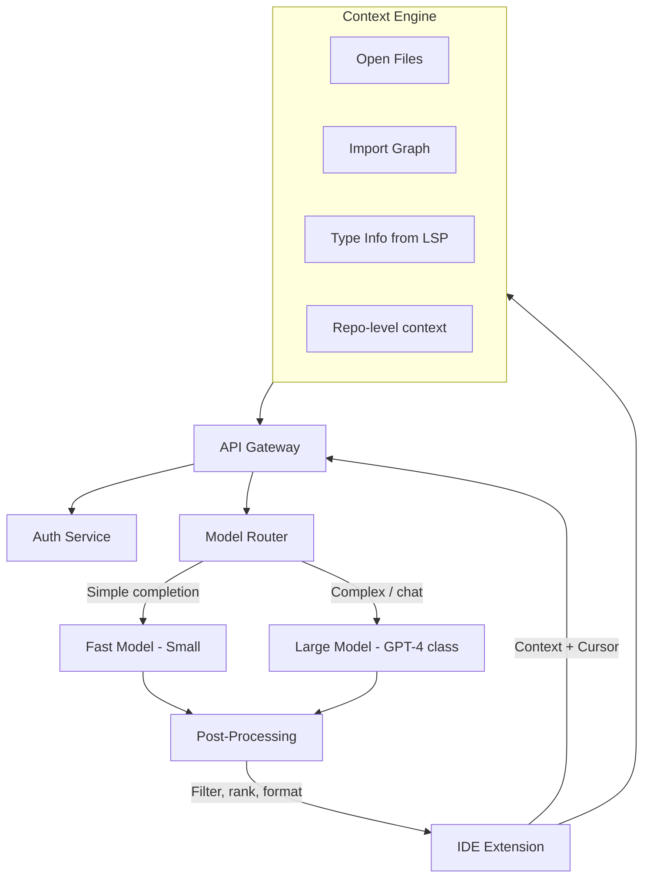
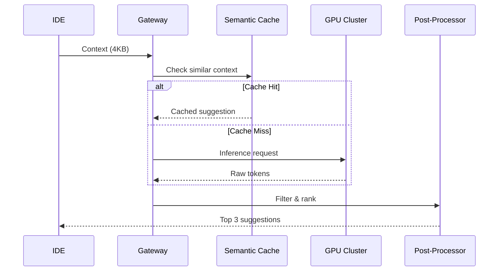

# Design GitHub Copilot

An AI code completion system that suggests code in real-time as developers type — inline completions, multi-line suggestions, and chat-based code generation.

## 1. Requirements Clarification

### Functional Requirements
- Inline code suggestions as user types (ghost text)
- Multi-line / whole-function completion
- Chat interface for code Q&A
- Context-aware (understands open files, imports, project structure)
- Support multiple languages (Python, TypeScript, Go, Java, Rust, etc.)

### Non-Functional Requirements
- **Latency**: < 300ms for inline suggestions (user perception threshold)
- **Availability**: 99.9% (degradation = no suggestions, not broken IDE)
- **Scale**: 1M+ concurrent developers
- **Privacy**: Enterprise customers need code to never leave their network

## 2. Back-of-the-Envelope Estimation

- **DAU**: 5M developers
- **Suggestions/day per user**: ~200 (every few keystrokes trigger)
- **Total requests/day**: 5M × 200 = 1B
- **QPS**: 1B / 86,400 ≈ **11,500 QPS** (peak: ~35K QPS)
- **Average context size**: ~4KB (surrounding code)
- **Average response size**: ~500 bytes (suggestion)
- **Bandwidth**: 35K × 4.5KB ≈ 157 MB/s

## 3. High-Level Design



## 4. Detailed Design

### Context Collection (IDE Side)

The quality of suggestions depends entirely on context quality:

```typescript
interface CopilotContext {
  // Current file
  prefix: string        // Code before cursor
  suffix: string        // Code after cursor
  language: string      // File language
  filePath: string      // Relative path

  // Neighboring files
  openTabs: FileSnippet[]      // Other open files (relevant parts)
  importedFiles: FileSnippet[] // Files referenced by imports

  // Project context
  projectType: string          // package.json, go.mod, etc.
  recentEdits: Edit[]          // Last 5 edits across files
}

interface FileSnippet {
  path: string
  content: string        // Truncated to relevant sections
  relevanceScore: number // How related to current file
}
```

**Context budget**: ~8K tokens total. Must be selective:
1. Current file prefix/suffix: 4K tokens
2. Most relevant open tab: 2K tokens
3. Import signatures: 1K tokens
4. Project metadata: 1K tokens

### Model Router

Not every keystroke needs GPT-4:

| Trigger | Model | Latency Target |
|---------|-------|---------------|
| Single line completion | Small (1-3B params) | < 100ms |
| Multi-line / function body | Medium (7-13B params) | < 300ms |
| Chat / explain / refactor | Large (GPT-4 class) | < 2s |
| Simple bracket/quote close | Rule-based (no model) | < 10ms |

```python
def route_request(context: CopilotContext) -> str:
    # Rule-based completions (no model needed)
    if is_bracket_close(context.prefix):
        return "rule_engine"

    # Analyze complexity
    cursor_position = analyze_cursor(context)

    if cursor_position == "mid_line":
        return "small_model"
    elif cursor_position == "empty_line_in_function":
        return "medium_model"
    elif cursor_position == "new_function" or context.is_chat:
        return "large_model"

    return "small_model"  # Default to fast
```

### Inference Pipeline



### Post-Processing

Raw model output needs filtering:

```python
def post_process(raw_suggestions: list[str], context: CopilotContext) -> list[str]:
    results = []
    for suggestion in raw_suggestions:
        # 1. Syntax validation — must parse
        if not is_valid_syntax(suggestion, context.language):
            continue

        # 2. Security filter — no secrets, no license violations
        if contains_secrets(suggestion) or matches_copyrighted_code(suggestion):
            continue

        # 3. Deduplication — don't suggest what's already there
        if suggestion.strip() in context.prefix:
            continue

        # 4. Trim — stop at natural boundary
        suggestion = trim_at_boundary(suggestion, context.language)

        results.append(suggestion)

    # Rank by confidence score
    return sorted(results, key=lambda s: s.confidence, reverse=True)[:3]
```

### Telemetry & Learning

Track acceptance to improve suggestions:

| Event | What it tells us |
|-------|-----------------|
| `suggestion_shown` | Model produced output |
| `suggestion_accepted` | User pressed Tab — good suggestion |
| `suggestion_partially_accepted` | User took part of it |
| `suggestion_rejected` | User kept typing — bad suggestion |
| `suggestion_accepted_then_deleted` | Looked good but wasn't — worst case |

**Acceptance rate** is the north star metric (~30% is good).

## 5. Data Model

```sql
-- Telemetry events (ClickHouse for analytics)
CREATE TABLE suggestion_events (
    event_id UUID,
    user_id UUID,
    timestamp DateTime64(3),
    language String,
    model_used String,
    latency_ms UInt32,
    tokens_generated UInt16,
    accepted Enum('shown', 'accepted', 'partial', 'rejected', 'deleted'),
    context_hash String  -- For semantic cache
) ENGINE = MergeTree()
ORDER BY (user_id, timestamp);
```

## 6. API Design

```
POST /v1/completions
{
  "prefix": "function fibonacci(n: number): number {\n  ",
  "suffix": "\n}\n",
  "language": "typescript",
  "filePath": "src/utils/math.ts",
  "maxTokens": 128,
  "temperature": 0.0,
  "n": 3
}

Response (streamed):
{
  "suggestions": [
    { "text": "if (n <= 1) return n;\n  return fibonacci(n - 1) + fibonacci(n - 2);", "confidence": 0.92 },
    { "text": "const dp = [0, 1];\n  for (let i = 2; i <= n; i++) dp[i] = dp[i-1] + dp[i-2];\n  return dp[n];", "confidence": 0.87 }
  ],
  "model": "copilot-small-v3",
  "latencyMs": 89
}
```

## 7. Scaling

### GPU Infrastructure
- **Small model**: Deploy on L4 GPUs, batch inference, 8 replicas per region
- **Large model**: A100/H100 clusters, vLLM with continuous batching
- **Regions**: US-East, US-West, EU-West, AP-Southeast (< 50ms network hop)

### Handling 35K QPS
- Semantic cache hit rate ~40% → actual GPU load ~21K QPS
- Speculative decoding for faster generation
- Request coalescing for similar contexts
- Graceful degradation: drop to smaller model under load

### Enterprise (Self-Hosted)
- Deploy model on customer's cloud (Azure, AWS)
- Code never leaves their VPC
- Smaller model (7B) for cost, fine-tuned on their codebase

## 8. Trade-offs

| Decision | Choice | Alternative | Why |
|----------|--------|-------------|-----|
| Multiple models | Yes — small + large | Single model | Latency vs quality trade-off |
| Streaming | No for inline, yes for chat | Always stream | Ghost text needs complete suggestion |
| Context | Selective 8K tokens | Full file | Token budget, latency |
| Caching | Semantic (embedding-based) | Exact match | Similar code patterns reuse |

## 9. Common Interview Questions

1. **How do you handle latency?** → Model routing, semantic cache, edge deployment, speculative decoding
2. **How do you prevent suggesting copyrighted code?** → Code fingerprinting against known OSS, license detection
3. **How do you handle multiple languages?** → Polyglot models trained on all languages, language-specific post-processing
4. **How do you personalize?** → Fine-tune on org's codebase (enterprise), learn from acceptance patterns
5. **What about privacy?** → Self-hosted option, no training on customer code, SOC 2 compliance

## Further Reading

- [LLM Integration Patterns](/ai-ml-engineering/llm-integration)
- [Model Serving Deep Dive](/infrastructure/ai-infrastructure/model-serving)
- [RAG Architecture](/ai-ml-engineering/rag-architecture)
- [Prompt Caching](/ai-ml-engineering/prompt-caching)
