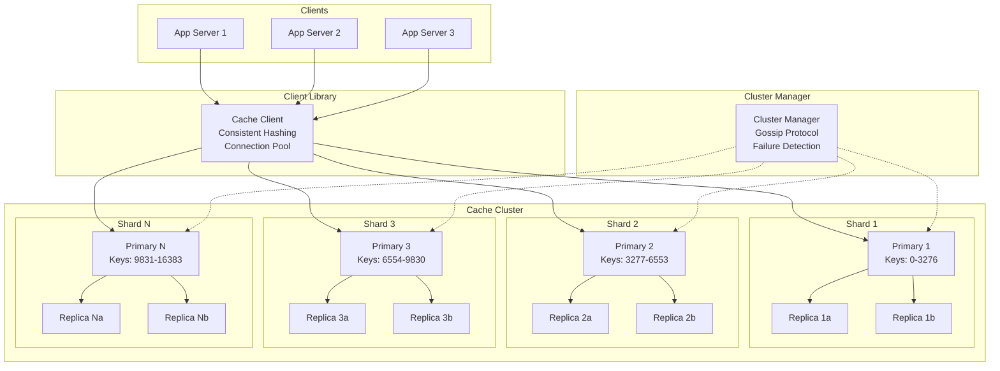
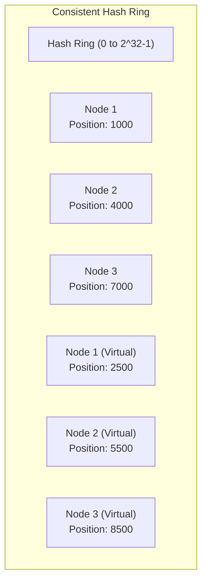
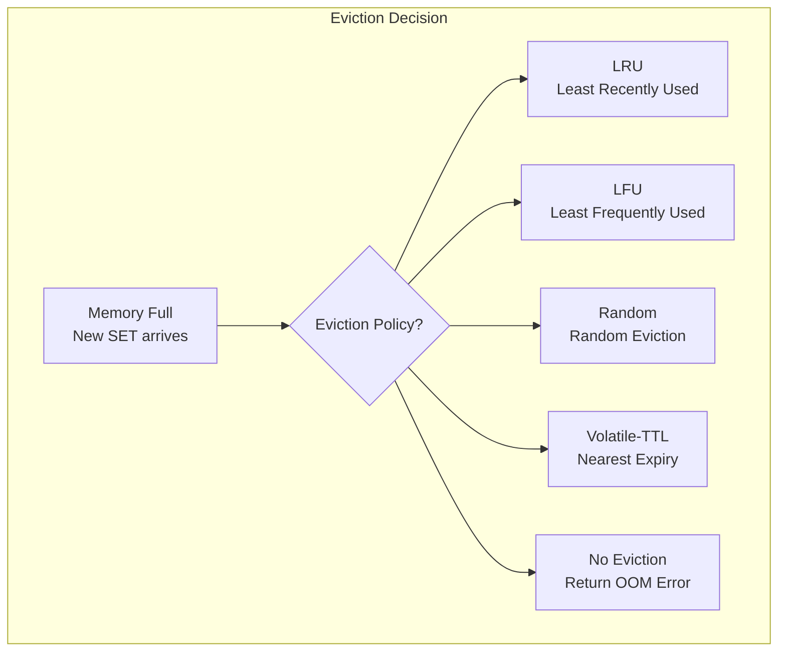
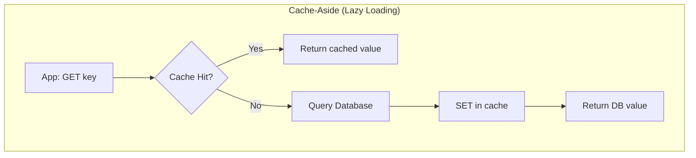
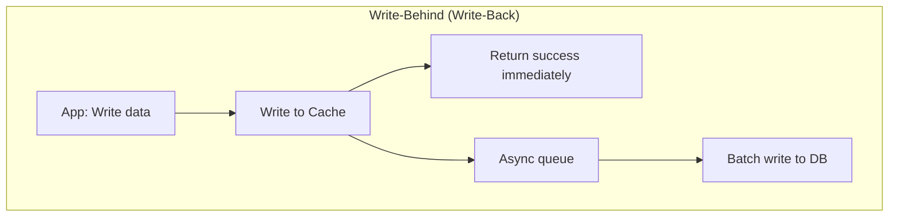
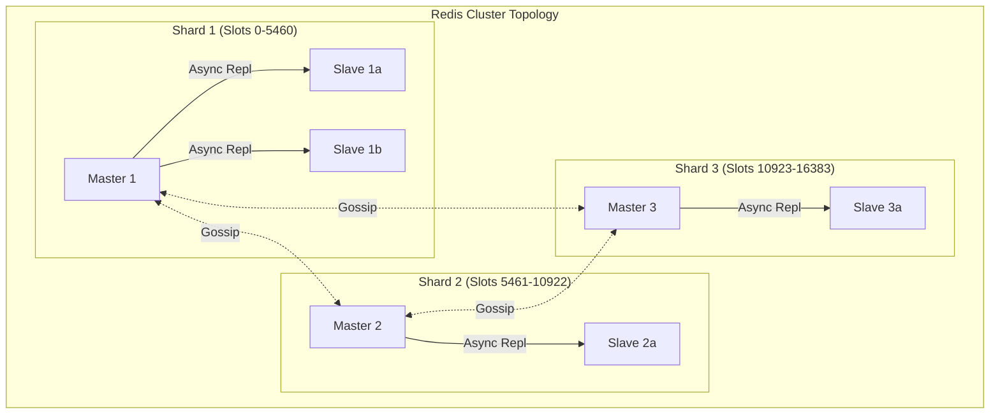
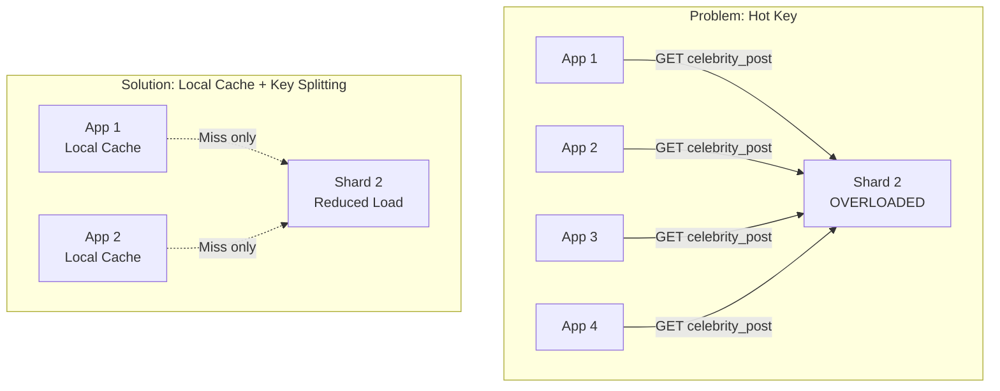

# Design Memcached / Redis — Distributed Cache

## 1. Problem Statement & Requirements

### Functional Requirements

| # | Requirement | Details |
|---|-------------|---------|
| FR-1 | Key-Value Store | GET/SET/DELETE operations on key-value pairs |
| FR-2 | TTL Support | Set expiration time on keys |
| FR-3 | Data Types | String, Hash, List, Set, Sorted Set (Redis-like) |
| FR-4 | Atomic Operations | INCR, DECR, compare-and-swap |
| FR-5 | Eviction Policies | LRU, LFU, Random, TTL-based eviction |
| FR-6 | Clustering | Distribute data across multiple nodes |
| FR-7 | Replication | Primary-replica replication for fault tolerance |
| FR-8 | Pub/Sub | Publish/subscribe messaging |
| FR-9 | Transactions | Multi-key atomic operations (Redis MULTI/EXEC) |
| FR-10 | Persistence | Optional RDB snapshots and AOF logging |

### Non-Functional Requirements

| # | Requirement | Target |
|---|-------------|--------|
| NFR-1 | Latency | GET/SET < 1ms (P99) |
| NFR-2 | Throughput | 100K+ operations/second per node |
| NFR-3 | Availability | 99.999% with automatic failover |
| NFR-4 | Scalability | Linear scaling with nodes (100+ nodes) |
| NFR-5 | Memory Efficiency | < 10% overhead per key-value pair |
| NFR-6 | Consistency | Configurable: strong for single-node, eventual for cluster |

---

## 2. Back-of-Envelope Estimation

### Cluster Scale

$$
\text{Cluster Nodes} = 100 \quad \text{RAM per Node} = 128 \text{ GB}
$$

$$
\text{Total Cache Capacity} = 100 \times 128 = 12.8 \text{ TB}
$$

### Operation Volume

$$
\text{Total Operations/s} = 100 \times 100{,}000 = 10M \text{ ops/s}
$$

$$
\text{Read:Write Ratio} = 10:1
$$

$$
\text{Reads} = 9.1M \text{ ops/s} \quad \text{Writes} = 0.9M \text{ ops/s}
$$

### Key-Value Sizes

$$
\text{Avg Key Size} = 50 \text{ bytes}
$$

$$
\text{Avg Value Size} = 1 \text{ KB}
$$

$$
\text{Avg Entry Size} = 50 + 1024 + 64 \text{ (metadata)} = 1.1 \text{ KB}
$$

### Keys per Node

$$
\text{Usable Memory (80\%)} = 128 \times 0.8 = 102.4 \text{ GB}
$$

$$
\text{Keys per Node} = \frac{102.4 \text{ GB}}{1.1 \text{ KB}} \approx 93M \text{ keys}
$$

$$
\text{Total Keys} = 100 \times 93M = 9.3B \text{ keys}
$$

### Network Bandwidth per Node

$$
\text{Ops/s per Node} = 100{,}000
$$

$$
\text{Avg Response Size} = 1 \text{ KB}
$$

$$
\text{Bandwidth} = 100K \times 1 \text{ KB} = 100 \text{ MB/s} = 800 \text{ Mbps}
$$

---

## 3. High-Level Design

### Architecture Diagram



### API Design

```typescript
// Core Operations
SET    key value [EX seconds] [PX milliseconds] [NX|XX]
GET    key
DEL    key [key ...]
EXISTS key
EXPIRE key seconds
TTL    key
INCR   key
DECR   key

// Hash Operations
HSET   key field value
HGET   key field
HGETALL key
HDEL   key field

// List Operations
LPUSH  key value [value ...]
RPUSH  key value [value ...]
LPOP   key
RPOP   key
LRANGE key start stop

// Set Operations
SADD   key member [member ...]
SREM   key member
SMEMBERS key
SISMEMBER key member

// Sorted Set Operations
ZADD   key score member [score member ...]
ZRANGE key start stop [WITHSCORES]
ZRANGEBYSCORE key min max

// Cluster Operations
CLUSTER INFO
CLUSTER NODES
CLUSTER SLOTS
```

---

## 4. Database Schema (Internal Data Structures)

### Key-Value Entry Structure

```typescript
interface CacheEntry {
  key: string;             // The cache key
  value: Buffer;           // Serialized value
  dataType: DataType;      // STRING, HASH, LIST, SET, ZSET
  encoding: Encoding;      // RAW, INT, ZIPLIST, HASHTABLE, SKIPLIST
  expireAt: number | null; // Unix timestamp in ms, null = no expiry
  lastAccessedAt: number;  // For LRU
  accessFrequency: number; // For LFU
  createdAt: number;
  sizeBytes: number;       // Total memory used
  lruClock: number;        // LRU clock bits (Redis-style approximate)
}

enum DataType {
  STRING = 0,
  HASH = 1,
  LIST = 2,
  SET = 3,
  ZSET = 4,
}

enum Encoding {
  RAW = 0,         // SDS string
  INT = 1,         // Integer encoded in pointer
  ZIPLIST = 2,     // Compact list for small collections
  HASHTABLE = 3,   // Hash table for larger collections
  SKIPLIST = 4,    // Skip list for sorted sets
  LISTPACK = 5,    // Improved ziplist (Redis 7+)
  QUICKLIST = 6,   // Linked list of ziplists
}
```

### Hash Slot Assignment (Redis Cluster Style)

```
Total Slots: 16384

Node 1: slots 0-5460     (5461 slots)
Node 2: slots 5461-10922 (5462 slots)
Node 3: slots 10923-16383 (5461 slots)

Slot = CRC16(key) mod 16384
```

---

## 5. Detailed Component Design

### 5.1 Consistent Hashing

Standard hash-based partitioning breaks when nodes are added or removed (all keys rehash). Consistent hashing minimizes key movement.



**With virtual nodes (vnodes):**

$$
\text{Virtual Nodes per Physical Node} = 150
$$

$$
\text{Std Dev of Load} \propto \frac{1}{\sqrt{\text{vnodes}}}
$$

With 150 vnodes per node, the load imbalance is typically < 5%.

```typescript
class ConsistentHashRing {
  private ring: SortedMap<number, string> = new SortedMap(); // hash -> nodeId
  private readonly virtualNodes: number;

  constructor(virtualNodes: number = 150) {
    this.virtualNodes = virtualNodes;
  }

  addNode(nodeId: string): void {
    for (let i = 0; i < this.virtualNodes; i++) {
      const hash = this.hash(`${nodeId}:${i}`);
      this.ring.set(hash, nodeId);
    }
  }

  removeNode(nodeId: string): void {
    for (let i = 0; i < this.virtualNodes; i++) {
      const hash = this.hash(`${nodeId}:${i}`);
      this.ring.delete(hash);
    }
  }

  getNode(key: string): string {
    if (this.ring.size === 0) throw new Error('No nodes in ring');

    const hash = this.hash(key);

    // Find the first node with hash >= key hash (clockwise walk)
    const entry = this.ring.ceiling(hash);
    if (entry) return entry.value;

    // Wrap around to the first node
    return this.ring.first()!.value;
  }

  // Get N nodes for replication (walk clockwise, skip same physical node)
  getNodes(key: string, count: number): string[] {
    const nodes: string[] = [];
    const seen = new Set<string>();
    const hash = this.hash(key);

    for (const [, nodeId] of this.ring.entriesFrom(hash)) {
      if (!seen.has(nodeId)) {
        nodes.push(nodeId);
        seen.add(nodeId);
        if (nodes.length >= count) return nodes;
      }
    }

    // Wrap around
    for (const [, nodeId] of this.ring.entries()) {
      if (!seen.has(nodeId)) {
        nodes.push(nodeId);
        seen.add(nodeId);
        if (nodes.length >= count) return nodes;
      }
    }

    return nodes;
  }

  // Redis uses CRC16 for slot calculation
  private hash(key: string): number {
    return crc16(key) % 16384; // Redis: 16384 hash slots
  }
}
```

**Redis Cluster approach (hash slots):**

Instead of consistent hashing on a ring, Redis Cluster uses a fixed number of 16384 hash slots. Each node owns a contiguous or scattered range of slots. This makes resharding explicit and controllable.

```typescript
class RedisClusterRouter {
  private slotMap: Map<number, NodeInfo> = new Map(); // slot -> node

  getNodeForKey(key: string): NodeInfo {
    // Extract hash tag if present: {user:123}.session -> hash on "user:123"
    const hashKey = this.extractHashTag(key) ?? key;
    const slot = this.crc16(hashKey) % 16384;
    return this.slotMap.get(slot)!;
  }

  // Hash tags allow related keys to be on the same shard
  private extractHashTag(key: string): string | null {
    const start = key.indexOf('{');
    const end = key.indexOf('}', start + 1);
    if (start !== -1 && end !== -1 && end > start + 1) {
      return key.substring(start + 1, end);
    }
    return null;
  }

  // Handle MOVED redirect (key migrated to different node)
  async executeWithRedirect(key: string, command: CacheCommand): Promise<any> {
    const node = this.getNodeForKey(key);
    try {
      return await node.execute(command);
    } catch (error) {
      if (error.type === 'MOVED') {
        // Update slot mapping
        this.slotMap.set(error.slot, error.newNode);
        return await error.newNode.execute(command);
      }
      if (error.type === 'ASK') {
        // Slot is being migrated; ask new node with ASKING flag
        return await error.newNode.execute(command, { asking: true });
      }
      throw error;
    }
  }
}
```

### 5.2 Eviction Policies

When memory is full, the cache must evict entries to make room for new ones.



**LRU (Least Recently Used) Implementation:**

Full LRU requires a doubly-linked list + hash map — O(1) for all operations but high memory overhead (2 pointers per entry = 16 bytes).

Redis uses an **approximate LRU** with 24-bit clock to save memory.

```typescript
// Exact LRU: Doubly-linked list + HashMap
class ExactLRUCache<K, V> {
  private capacity: number;
  private map: Map<K, DoublyLinkedListNode<K, V>> = new Map();
  private list: DoublyLinkedList<K, V> = new DoublyLinkedList();

  constructor(capacity: number) {
    this.capacity = capacity;
  }

  get(key: K): V | null {
    const node = this.map.get(key);
    if (!node) return null;

    // Move to front (most recently used)
    this.list.moveToFront(node);
    return node.value;
  }

  set(key: K, value: V): void {
    const existing = this.map.get(key);
    if (existing) {
      existing.value = value;
      this.list.moveToFront(existing);
      return;
    }

    // Evict if at capacity
    if (this.map.size >= this.capacity) {
      const evicted = this.list.removeLast(); // Least recently used
      if (evicted) this.map.delete(evicted.key);
    }

    const node = new DoublyLinkedListNode(key, value);
    this.list.addFirst(node);
    this.map.set(key, node);
  }
}

// Redis Approximate LRU: Sample N random keys, evict the one with oldest access time
class ApproximateLRUCache {
  private readonly SAMPLE_SIZE = 5; // Redis default: maxmemory-samples 5

  evict(): string {
    let oldestKey: string | null = null;
    let oldestTime = Infinity;

    // Sample SAMPLE_SIZE random keys
    for (let i = 0; i < this.SAMPLE_SIZE; i++) {
      const key = this.getRandomKey();
      const entry = this.store.get(key);
      if (entry && entry.lruClock < oldestTime) {
        oldestTime = entry.lruClock;
        oldestKey = key;
      }
    }

    if (oldestKey) {
      this.store.delete(oldestKey);
    }

    return oldestKey!;
  }
}
```

**LFU (Least Frequently Used) Implementation:**

Redis LFU uses a logarithmic frequency counter that decays over time.

$$
\text{Frequency Counter} = \min(255, \text{counter} + \frac{1}{\text{counter} \times \text{lfu-log-factor} + 1})
$$

The counter is probabilistic: a key with counter=10 is accessed approximately 10x more than a key with counter=1, but exact counts are not tracked.

$$
\text{Decay: } \text{counter} = \text{counter} - \frac{\text{minutes\_since\_last\_access}}{\text{lfu-decay-time}}
$$

```typescript
class LFUEviction {
  private readonly LOG_FACTOR = 10;
  private readonly DECAY_TIME_MINUTES = 1;

  // Increment access counter (probabilistic)
  incrementCounter(entry: CacheEntry): void {
    const counter = entry.accessFrequency;
    if (counter >= 255) return;

    // Probability decreases as counter increases (logarithmic growth)
    const probability = 1.0 / (counter * this.LOG_FACTOR + 1);
    if (Math.random() < probability) {
      entry.accessFrequency++;
    }

    entry.lastAccessedAt = Date.now();
  }

  // Decay counter based on time since last access
  decayCounter(entry: CacheEntry): number {
    const minutesSinceAccess = (Date.now() - entry.lastAccessedAt) / 60000;
    const decay = Math.floor(minutesSinceAccess / this.DECAY_TIME_MINUTES);

    entry.accessFrequency = Math.max(0, entry.accessFrequency - decay);
    return entry.accessFrequency;
  }

  // Evict: sample random keys, evict lowest frequency
  evict(): string {
    let lowestKey: string | null = null;
    let lowestFreq = Infinity;

    for (let i = 0; i < 5; i++) {
      const key = this.getRandomKey();
      const entry = this.store.get(key);
      if (entry) {
        const freq = this.decayCounter(entry);
        if (freq < lowestFreq) {
          lowestFreq = freq;
          lowestKey = key;
        }
      }
    }

    if (lowestKey) this.store.delete(lowestKey);
    return lowestKey!;
  }
}
```

### 5.3 Cache-Aside / Write-Through Patterns






```typescript
class CacheAsideService {
  async get<T>(key: string, fetcher: () => Promise<T>, ttl: number = 3600): Promise<T> {
    // Try cache first
    const cached = await this.cache.get(key);
    if (cached !== null) {
      return JSON.parse(cached) as T;
    }

    // Cache miss: fetch from source
    const value = await fetcher();

    // Store in cache (non-blocking)
    this.cache.set(key, JSON.stringify(value), 'EX', ttl).catch(err => {
      console.error('Cache set failed:', err);
      // Do not fail the request if cache write fails
    });

    return value;
  }

  async invalidate(key: string): Promise<void> {
    // On write: delete from cache (NOT update)
    // Why delete instead of update? Avoids race condition:
    // 1. Thread A reads DB (old value)
    // 2. Thread B writes DB (new value)
    // 3. Thread B updates cache (new value)
    // 4. Thread A updates cache (old value!) <-- STALE!
    await this.cache.del(key);
  }
}

class WriteThroughService {
  async set<T>(key: string, value: T): Promise<void> {
    // Write to cache first
    await this.cache.set(key, JSON.stringify(value));

    // Then write to database
    await this.db.save(key, value);
  }

  async get<T>(key: string): Promise<T | null> {
    // Always read from cache (it is the source of truth)
    const cached = await this.cache.get(key);
    if (cached !== null) return JSON.parse(cached) as T;

    // Cache miss (data not yet loaded): fetch from DB and populate cache
    const value = await this.db.get(key);
    if (value) {
      await this.cache.set(key, JSON.stringify(value));
    }
    return value;
  }
}

class WriteBehindService {
  private writeBuffer: Map<string, any> = new Map();
  private flushIntervalMs: number = 1000;

  constructor() {
    setInterval(() => this.flush(), this.flushIntervalMs);
  }

  async set<T>(key: string, value: T): Promise<void> {
    // Write to cache immediately
    await this.cache.set(key, JSON.stringify(value));

    // Buffer for async DB write
    this.writeBuffer.set(key, value);
  }

  private async flush(): Promise<void> {
    if (this.writeBuffer.size === 0) return;

    const batch = new Map(this.writeBuffer);
    this.writeBuffer.clear();

    // Batch write to database
    await this.db.batchSave(batch);
  }
}
```

### 5.4 Cluster Topology & Replication



```typescript
class ClusterNode {
  private readonly nodeId: string;
  private role: 'master' | 'slave';
  private masterId: string | null; // If slave, who is my master?
  private slots: Set<number>;      // Hash slots owned
  private replicas: ClusterNode[];  // My replicas
  private clusterNodes: Map<string, ClusterNodeInfo>; // All nodes in cluster

  // Gossip protocol: periodically exchange state with random nodes
  async gossip(): Promise<void> {
    // Select random node to gossip with
    const randomNode = this.selectRandomNode();

    // Send our view of the cluster
    const myView = this.getClusterState();
    const theirView = await randomNode.exchangeGossip(myView);

    // Merge views (latest epoch wins)
    this.mergeClusterState(theirView);
  }

  // Failure detection
  async checkNodeHealth(targetNode: ClusterNodeInfo): Promise<void> {
    try {
      const pong = await this.ping(targetNode, { timeout: 500 });
      targetNode.lastPongReceived = Date.now();
    } catch {
      const timeSincePong = Date.now() - targetNode.lastPongReceived;

      if (timeSincePong > 5000) { // 5 seconds without pong
        targetNode.flags.add('PFAIL'); // Probable failure

        // Ask other nodes if they also see failure
        const failureVotes = await this.requestFailureVotes(targetNode);

        if (failureVotes >= this.quorum()) {
          targetNode.flags.add('FAIL'); // Confirmed failure

          if (targetNode.role === 'master') {
            await this.initiateFailover(targetNode);
          }
        }
      }
    }
  }

  // Automatic failover: promote slave to master
  async initiateFailover(failedMaster: ClusterNodeInfo): Promise<void> {
    // Select the replica with the most up-to-date data
    const replicas = this.getReplicasOf(failedMaster.nodeId);
    const bestReplica = replicas.reduce((best, r) =>
      r.replicationOffset > best.replicationOffset ? r : best
    );

    // Promote replica
    bestReplica.role = 'master';
    bestReplica.slots = new Set(failedMaster.slots);
    bestReplica.masterId = null;

    // Broadcast to cluster
    await this.broadcastConfigUpdate({
      type: 'FAILOVER',
      newMaster: bestReplica.nodeId,
      slots: Array.from(failedMaster.slots),
    });
  }
}
```

**Replication:**

```typescript
class ReplicationManager {
  // Async replication from master to slave
  async replicate(master: CacheNode, slave: CacheNode): Promise<void> {
    // Initial sync: full RDB transfer
    if (slave.replicationOffset === 0) {
      const rdbSnapshot = await master.createRDBSnapshot();
      await slave.loadRDB(rdbSnapshot);
      slave.replicationOffset = master.replicationOffset;
    }

    // Incremental sync: stream replication buffer
    const buffer = await master.getReplicationBuffer(slave.replicationOffset);
    for (const command of buffer) {
      await slave.executeReplicatedCommand(command);
      slave.replicationOffset = command.offset;
    }
  }

  // Replication backlog: circular buffer of recent write commands
  // If slave falls too far behind, full resync is needed
}
```

### 5.5 Hot Key Handling

A "hot key" is a key accessed disproportionately often, creating a bottleneck on the shard that owns it.



```typescript
class HotKeyHandler {
  private localCache: LRUCache<string, Buffer>;
  private hotKeyDetector: HotKeyDetector;

  async get(key: string): Promise<Buffer | null> {
    // Check local (in-process) cache first
    const local = this.localCache.get(key);
    if (local) return local;

    // Check if this is a known hot key
    if (this.hotKeyDetector.isHot(key)) {
      return this.getWithLocalCaching(key);
    }

    // Normal path
    return this.remoteCache.get(key);
  }

  private async getWithLocalCaching(key: string): Promise<Buffer | null> {
    const value = await this.remoteCache.get(key);
    if (value) {
      // Cache locally with short TTL (1-5 seconds)
      this.localCache.set(key, value, { ttl: 2000 });
    }
    return value;
  }

  // Strategy 2: Key splitting (distribute reads across replicas)
  async getWithKeySplitting(key: string): Promise<Buffer | null> {
    // Append random suffix to distribute across shards
    const suffix = Math.floor(Math.random() * 10); // 0-9
    const splitKey = `${key}:${suffix}`;

    const value = await this.remoteCache.get(splitKey);
    if (value) return value;

    // Miss: fetch from primary key and populate split key
    const primary = await this.remoteCache.get(key);
    if (primary) {
      await this.remoteCache.set(splitKey, primary, 'EX', 60);
    }
    return primary;
  }
}

class HotKeyDetector {
  private accessCounts: Map<string, number> = new Map();
  private readonly THRESHOLD = 1000; // Accesses per second
  private readonly WINDOW_MS = 1000;

  recordAccess(key: string): void {
    const count = (this.accessCounts.get(key) ?? 0) + 1;
    this.accessCounts.set(key, count);
  }

  isHot(key: string): boolean {
    return (this.accessCounts.get(key) ?? 0) > this.THRESHOLD;
  }

  // Reset counts every window
  reset(): void {
    this.accessCounts.clear();
  }
}
```

### 5.6 Memory Management

```typescript
class MemoryManager {
  private usedMemory: number = 0;
  private maxMemory: number;
  private policy: EvictionPolicy;

  constructor(maxMemoryBytes: number, policy: EvictionPolicy) {
    this.maxMemory = maxMemoryBytes;
    this.policy = policy;
  }

  async allocate(key: string, value: Buffer): Promise<boolean> {
    const entrySize = this.calculateEntrySize(key, value);

    // Check if we need to evict
    while (this.usedMemory + entrySize > this.maxMemory) {
      if (this.policy === EvictionPolicy.NO_EVICTION) {
        throw new OutOfMemoryError('OOM: maxmemory reached');
      }

      const evicted = await this.evict();
      if (!evicted) {
        throw new OutOfMemoryError('OOM: cannot evict any keys');
      }
    }

    this.usedMemory += entrySize;
    return true;
  }

  private calculateEntrySize(key: string, value: Buffer): number {
    // Key: SDS header (9 bytes) + key bytes + null terminator
    const keySize = 9 + Buffer.byteLength(key) + 1;

    // Value: depends on encoding
    const valueSize = value.length;

    // Dict entry: 3 pointers (key, value, next) = 24 bytes
    const dictEntrySize = 24;

    // Redis object header: 16 bytes (type, encoding, lru, refcount, ptr)
    const objectHeaderSize = 16;

    return keySize + valueSize + dictEntrySize + objectHeaderSize * 2;
  }

  // Memory optimization: compact encodings for small objects
  chooseEncoding(value: any, count: number): Encoding {
    if (typeof value === 'number' && Number.isInteger(value)) {
      return Encoding.INT; // 0 bytes (stored in pointer)
    }

    if (count < 128) {
      return Encoding.ZIPLIST; // Compact linear structure
    }

    return Encoding.HASHTABLE; // Full hash table
  }
}
```

**Memory-efficient encodings:**

| Data Type | Small (< 128 elements) | Large |
|-----------|----------------------|-------|
| String | INT (if integer) or RAW | RAW (SDS) |
| Hash | ZIPLIST/LISTPACK | HASHTABLE |
| List | ZIPLIST/LISTPACK | QUICKLIST |
| Set | INTSET (if all integers) or LISTPACK | HASHTABLE |
| Sorted Set | ZIPLIST/LISTPACK | SKIPLIST + HASHTABLE |

$$
\text{Memory Savings with ZIPLIST} \approx 10\times \text{ vs HASHTABLE for small collections}
$$

### 5.7 Persistence (Optional)

```typescript
class PersistenceManager {
  // RDB: Point-in-time snapshot
  async createRDBSnapshot(): Promise<Buffer> {
    // Fork the process (copy-on-write)
    // Child process serializes entire dataset to disk
    // Parent continues serving requests
    // If a page is modified, OS copies it (COW)

    const snapshot = await this.fork(() => {
      return this.serializeAllKeys();
    });

    await this.writeToFile('dump.rdb', snapshot);
    return snapshot;
  }

  // AOF: Append-Only File (every write command logged)
  async appendToAOF(command: CacheCommand): Promise<void> {
    const line = this.serializeCommand(command);

    switch (this.aofPolicy) {
      case 'always':
        // fsync after every command (safest, slowest)
        await this.aofFile.append(line);
        await this.aofFile.fsync();
        break;
      case 'everysec':
        // Buffer and fsync every second (good balance)
        this.aofBuffer.push(line);
        // Background thread fsyncs every second
        break;
      case 'no':
        // Let OS decide when to flush (fastest, least safe)
        this.aofBuffer.push(line);
        break;
    }
  }

  // AOF rewrite: compact the AOF file
  async rewriteAOF(): Promise<void> {
    // Instead of replaying all historical commands,
    // generate the minimal set of commands to reproduce current state
    // e.g., 1000 INCR commands -> single SET command with final value
  }
}
```

---

## 6. Scaling & Bottlenecks

### What Breaks First

| Component | Bottleneck | Solution |
|-----------|-----------|----------|
| Single node memory | 128 GB max practical | Horizontal sharding (cluster mode) |
| Hot key | Single shard overwhelmed | Local caching, key splitting, read replicas |
| Network bandwidth | 800 Mbps per node | Compress values, pipeline commands |
| Connection count | File descriptor limits | Connection pooling, multiplexing |
| Failover time | Seconds of unavailability | Sentinel/Cluster auto-failover, read from replicas |
| Large values | Block other operations (single-threaded) | Avoid values > 1MB, use chunking |

### Connection Pooling

```typescript
class ConnectionPool {
  private pool: CacheConnection[] = [];
  private waitQueue: Array<(conn: CacheConnection) => void> = [];
  private readonly maxConnections: number;

  constructor(maxConnections: number = 50) {
    this.maxConnections = maxConnections;
  }

  async acquire(): Promise<CacheConnection> {
    const available = this.pool.find(c => !c.inUse);
    if (available) {
      available.inUse = true;
      return available;
    }

    if (this.pool.length < this.maxConnections) {
      const conn = await this.createConnection();
      conn.inUse = true;
      this.pool.push(conn);
      return conn;
    }

    // Wait for a connection to be released
    return new Promise((resolve) => {
      this.waitQueue.push(resolve);
    });
  }

  release(conn: CacheConnection): void {
    conn.inUse = false;
    const waiter = this.waitQueue.shift();
    if (waiter) {
      conn.inUse = true;
      waiter(conn);
    }
  }
}
```

### Pipeline & Batching

```typescript
class CachePipeline {
  private commands: CacheCommand[] = [];

  get(key: string): this {
    this.commands.push({ type: 'GET', key });
    return this;
  }

  set(key: string, value: string, ttl?: number): this {
    this.commands.push({ type: 'SET', key, value, ttl });
    return this;
  }

  async exec(): Promise<any[]> {
    // Send all commands in a single network round-trip
    const connection = await this.pool.acquire();
    try {
      const results = await connection.sendBatch(this.commands);
      return results;
    } finally {
      this.pool.release(connection);
    }
  }
}

// Usage: 10 GET commands in 1 round-trip instead of 10
const pipe = cache.pipeline();
pipe.get('user:1').get('user:2').get('user:3');
const [user1, user2, user3] = await pipe.exec();
```

---

## 7. Trade-offs & Alternatives

### Memcached vs. Redis

| Feature | Memcached | Redis |
|---------|-----------|-------|
| Data Types | String only | String, Hash, List, Set, Sorted Set |
| Persistence | No | RDB + AOF |
| Replication | No (client-side) | Built-in primary-replica |
| Clustering | Client-side consistent hashing | Redis Cluster (server-side) |
| Threading | Multi-threaded | Single-threaded (Redis 7: I/O threads) |
| Memory | Slab allocator (efficient) | jemalloc |
| Max Value Size | 1 MB | 512 MB |
| Pub/Sub | No | Yes |
| Scripting | No | Lua scripting |
| Best For | Simple key-value cache | Rich data structures, persistence needed |

### Eviction Policy Selection

| Policy | Best For | Weakness |
|--------|---------|----------|
| LRU | General purpose, temporal locality | Scan pollution (one-time scans evict hot data) |
| LFU | Stable popularity distribution | Slow to adapt to changing patterns |
| Random | Simple, no bookkeeping | Unpredictable, may evict hot data |
| TTL-based | Time-sensitive data | Does not consider access patterns |
| W-TinyLFU (Caffeine) | Best hit rate overall | Complex implementation |

### Cache Architecture Patterns

| Pattern | Consistency | Performance | Complexity |
|---------|------------|------------|------------|
| Cache-Aside | Eventual | Fast reads, cache misses expensive | Simple |
| Write-Through | Strong | Slower writes | Moderate |
| Write-Behind | Eventual | Fast writes, risk of data loss | Complex |
| Read-Through | Eventual | Transparent to app | Moderate |
| Refresh-Ahead | Strong-ish | Predictive, fewer misses | Complex |

---

## 8. Advanced Topics

### 8.1 Cache Stampede Prevention

When a popular key expires, hundreds of concurrent requests all miss the cache and hit the database simultaneously.

```typescript
class StampedeProtection {
  // Approach 1: Distributed lock
  async getWithLock<T>(key: string, fetcher: () => Promise<T>, ttl: number): Promise<T> {
    const cached = await this.cache.get(key);
    if (cached) return JSON.parse(cached);

    const lockKey = `lock:${key}`;
    const acquired = await this.cache.set(lockKey, '1', 'NX', 'EX', 5);

    if (acquired) {
      try {
        const value = await fetcher();
        await this.cache.set(key, JSON.stringify(value), 'EX', ttl);
        return value;
      } finally {
        await this.cache.del(lockKey);
      }
    } else {
      // Wait and retry
      await new Promise(r => setTimeout(r, 100));
      return this.getWithLock(key, fetcher, ttl);
    }
  }

  // Approach 2: Probabilistic early expiry
  async getWithEarlyExpiry<T>(key: string, fetcher: () => Promise<T>, ttl: number): Promise<T> {
    const result = await this.cache.getWithMeta(key);
    if (!result) {
      const value = await fetcher();
      await this.cache.set(key, JSON.stringify(value), 'EX', ttl);
      return value;
    }

    const { value, remainingTtl } = result;

    // Probabilistically refresh before actual expiry
    // XFetch algorithm: probability increases as TTL approaches 0
    const beta = 1; // Tuning parameter
    const delta = ttl - remainingTtl; // Time since SET
    const random = Math.random();
    const threshold = delta * beta * Math.log(random);

    if (remainingTtl + threshold <= 0) {
      // Early refresh (asynchronous, return stale value)
      fetcher().then(async (newValue) => {
        await this.cache.set(key, JSON.stringify(newValue), 'EX', ttl);
      });
    }

    return JSON.parse(value);
  }
}
```

### 8.2 Cache Consistency with Database

The most common cache invalidation strategies and their trade-offs.

### 8.3 Redis Streams for Event Sourcing

Redis Streams provide an append-only log data structure suitable for event sourcing and message queuing.

### 8.4 Memory Fragmentation

Over time, allocation and deallocation create memory fragmentation. Redis uses jemalloc which handles this well, but monitoring the `mem_fragmentation_ratio` metric is important.

$$
\text{Fragmentation Ratio} = \frac{\text{RSS (OS-reported memory)}}{\text{Used Memory (Redis-reported)}}
$$

- Ratio < 1.0: Redis memory is swapping to disk (bad)
- Ratio = 1.0-1.5: Normal
- Ratio > 1.5: Significant fragmentation (consider `MEMORY DOCTOR`)

---

## 9. Interview Tips

::: tip Key Points to Emphasize
1. **Consistent hashing (or hash slots)** is the partitioning strategy — explain why and how.
2. **Eviction policies matter** — Know LRU vs. LFU trade-offs and Redis's approximate implementations.
3. **Cache-aside is the most common pattern** — But know when to use write-through or write-behind.
4. **Hot keys are a real problem** — Local caching, key splitting, and read replicas are the solutions.
5. **Single-threaded model** — Redis's simplicity comes from single-threaded command execution (no locks needed).
:::

::: warning Common Mistakes
- Not discussing what happens when a cache node fails (failover, data loss, thundering herd).
- Ignoring the cache stampede problem when keys expire.
- Not addressing cache-database consistency (when to invalidate vs. update).
- Assuming infinite memory — eviction policies are critical.
- Proposing multi-threaded access to in-memory data structures without considering locking overhead.
:::

::: info Follow-Up Questions to Expect
- How would you handle a cache node failure without losing data? (Replication + automatic failover via Sentinel or Cluster.)
- How do you ensure cache consistency with the database? (Delete on write, TTL as safety net, CDC for reactive invalidation.)
- How would you migrate from a 3-node to a 5-node cluster without downtime? (Redis Cluster: migrate hash slots incrementally.)
- How would you implement a rate limiter using your cache? (Sliding window counter with INCR + EXPIRE.)
:::

### Time Allocation in 45-min Interview

| Phase | Time | Focus |
|-------|------|-------|
| Requirements | 3 min | Clarify: caching vs. database, scale, consistency needs |
| High-Level Design | 8 min | Cluster topology, consistent hashing, replication |
| Deep Dive: Data Structures | 8 min | Hash table, LRU/LFU, memory layout |
| Deep Dive: Consistency | 8 min | Cache patterns, stampede, invalidation |
| Deep Dive: Hot Keys | 7 min | Detection, local cache, key splitting |
| Scaling | 7 min | Cluster expansion, failover, persistence |
| Q&A | 4 min | Fragmentation, pipeline, eviction tuning |
