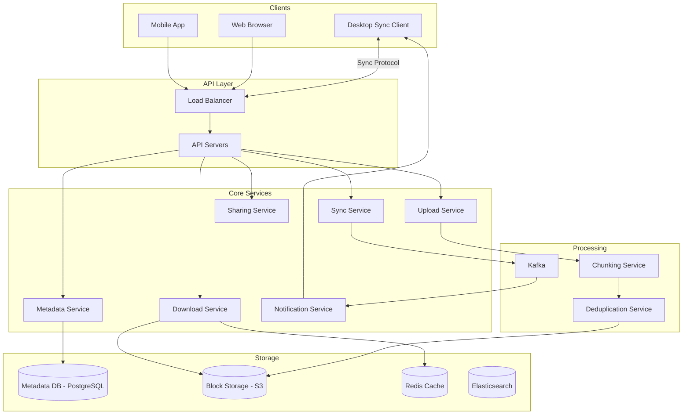
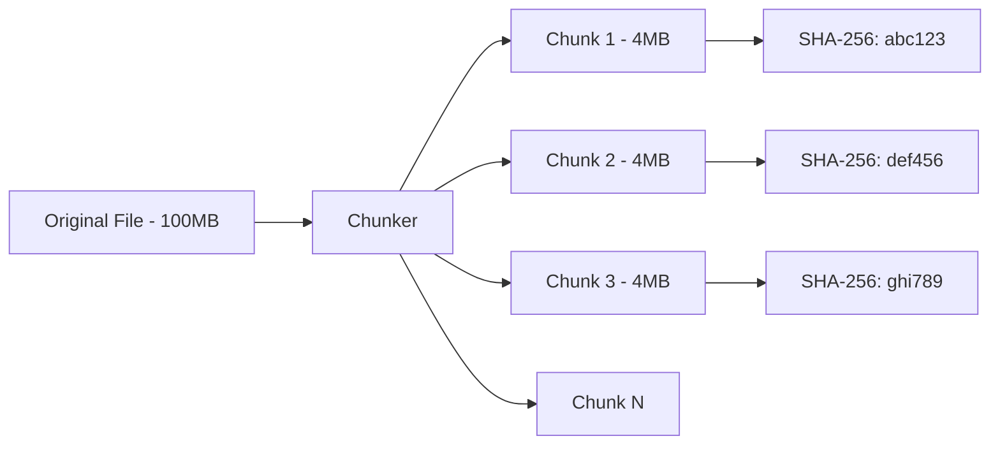
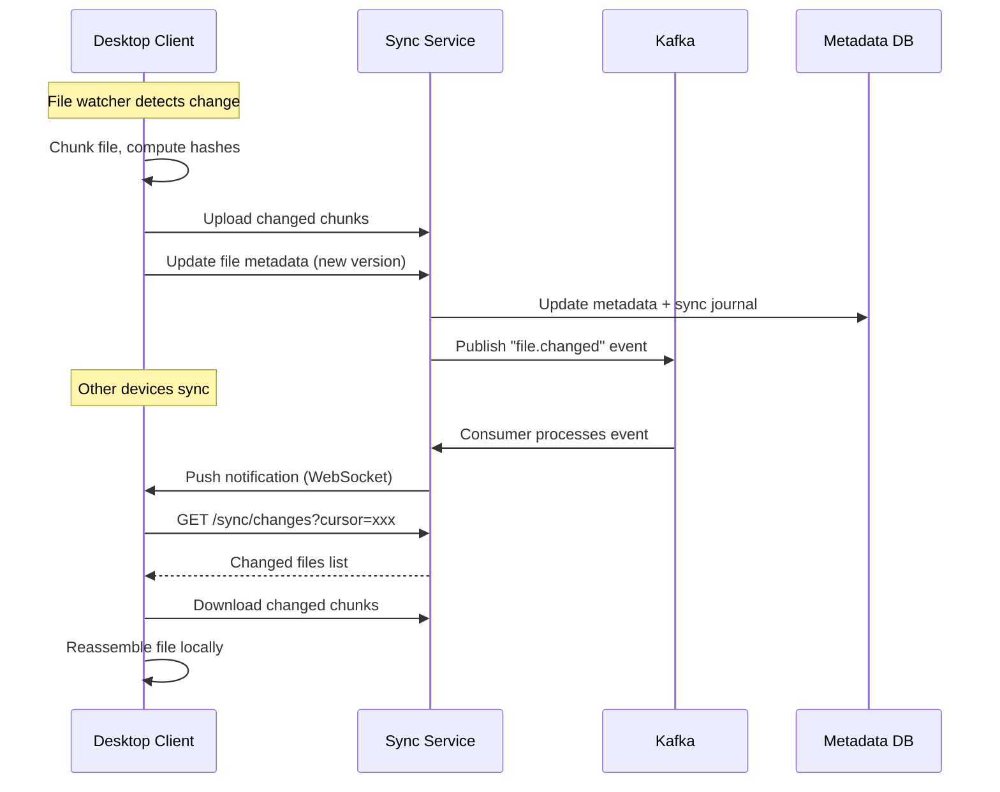
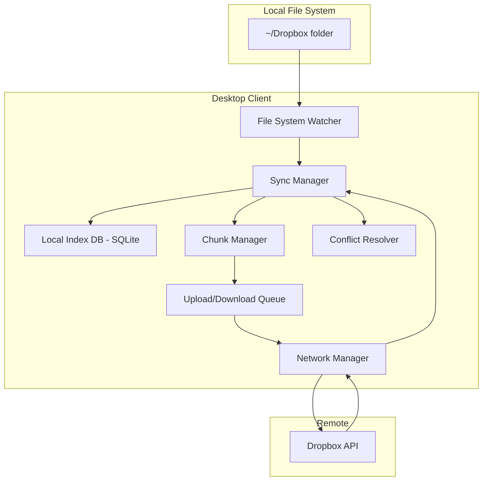
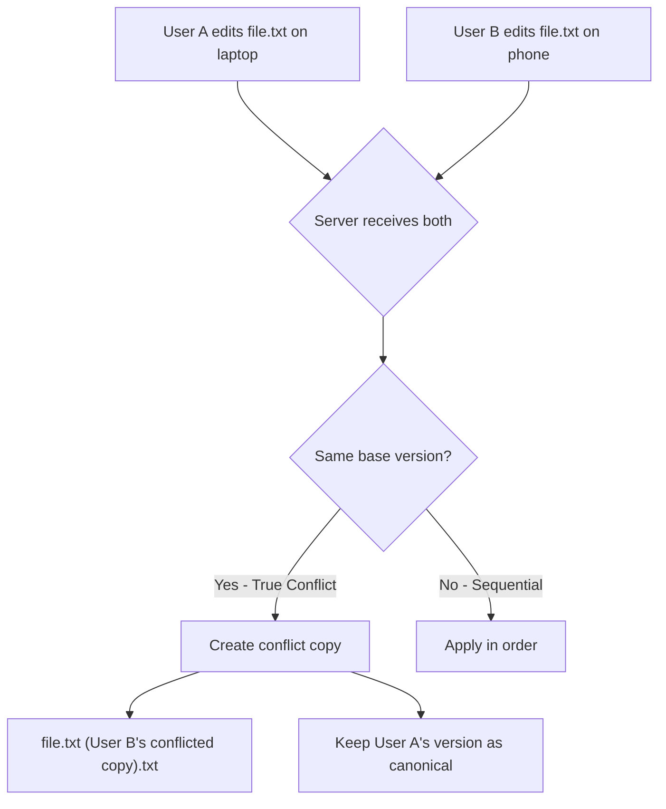
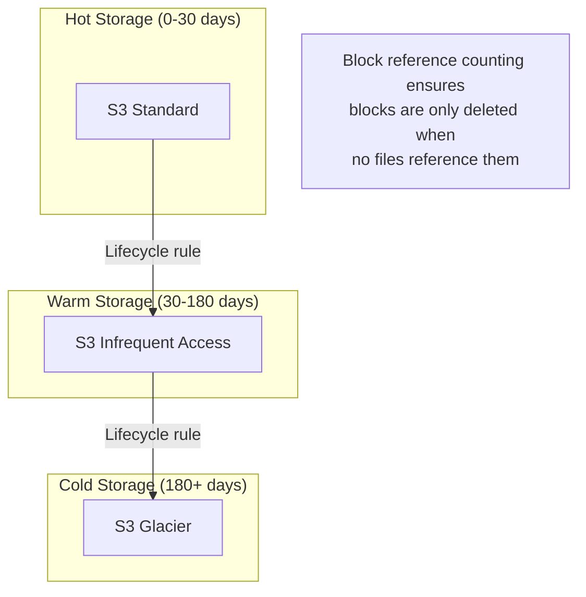

# Design Dropbox / Google Drive

Dropbox is a cloud file storage and synchronization service. Designing it covers file chunking, content-addressable storage, deduplication, conflict resolution, versioning, sharing permissions, and the desktop sync client architecture.

---

## 1. Problem Statement & Requirements

### Functional Requirements

1. **Upload files** — Users can upload files of any size (up to 50GB)
2. **Download files** — Users can download their files from any device
3. **Sync across devices** — File changes on one device appear on all others automatically
4. **File versioning** — Keep version history, revert to previous versions
5. **Sharing** — Share files/folders with other users (view, edit, comment permissions)
6. **Conflict resolution** — Handle concurrent edits to the same file
7. **Offline access** — Work offline, sync when back online
8. **Folder structure** — Organize files in a hierarchical folder structure
9. **Notifications** — Notify users when shared files change

### Non-Functional Requirements

1. **Reliability** — No file data should ever be lost (99.999999999% durability)
2. **Consistency** — Users must see the latest version of their files
3. **Low latency** — Small file changes sync within 5 seconds
4. **Bandwidth efficiency** — Only transfer changed portions of files (delta sync)
5. **Scale** — 500M users, 10B files, 1 exabyte total storage
6. **Availability** — 99.9% (eventual sync is acceptable during brief outages)

### Clarifying Questions

::: tip Questions to Ask
- What is the maximum file size?
- What is the average file size distribution?
- How often do files change?
- Do we need real-time collaborative editing (like Google Docs)?
- What types of files are most common?
- Do we need to support file search?
:::

---

## 2. Back-of-Envelope Estimation

### User and File Scale

- 500M registered users, 100M DAU
- Average user: 200 files, 2GB storage
- Total files: 100B (many accounts accumulate over time)
- Total storage: 500M x 2GB = 1 EB (exabyte)
- Average file size: 200KB (many small files like documents, some large media)

### Sync Traffic

- Average user modifies 5 files/day
- 20% of modifications are to large files (> 1MB)

$$
\text{File modification QPS} = \frac{100M \times 5}{86400} \approx 5{,}787 \text{ QPS}
$$

$$
\text{Peak QPS} \approx 5{,}787 \times 3 \approx 17{,}361 \text{ QPS}
$$

### Bandwidth

$$
\text{Upload bandwidth} = 5{,}787 \times 200KB = 1.16 \text{ GB/s}
$$

$$
\text{Download bandwidth} \approx 1.16 \text{ GB/s} \times 3 \text{ (sync to other devices)} = 3.5 \text{ GB/s}
$$

### Storage Growth

$$
\text{Daily new data} = 100M \times 5 \times 200KB = 100 \text{ TB/day}
$$

With deduplication (estimated 50% reduction):

$$
\text{Daily net storage} \approx 50 \text{ TB/day}
$$

### Metadata

Each file record: ~500 bytes (path, hashes, versions, permissions)

$$
\text{Metadata storage} = 100B \times 500B = 50 \text{ TB}
$$

---

## 3. High-Level Design



### API Design

```typescript
// Upload/update a file
// PUT /api/v1/files/:fileId
// Content-Type: multipart/form-data (for new file)
// Content-Type: application/octet-stream (for chunk upload)

// Initiate chunked upload
// POST /api/v1/uploads/initiate
interface InitiateUploadRequest {
  fileName: string;
  filePath: string;          // Relative path in user's Dropbox
  fileSize: number;
  fileHash: string;          // SHA-256 of entire file
  chunks: Array<{
    index: number;
    hash: string;            // SHA-256 of chunk
    size: number;
  }>;
}

interface InitiateUploadResponse {
  uploadId: string;
  chunksToUpload: number[];  // Only chunks that don't already exist (dedup)
  uploadUrls: Record<number, string>; // Pre-signed URLs for each chunk
}

// Upload a chunk
// PUT /api/v1/uploads/:uploadId/chunks/:chunkIndex
// Body: binary chunk data

// Complete upload
// POST /api/v1/uploads/:uploadId/complete

// Get file metadata
// GET /api/v1/files/:fileId
interface FileMetadata {
  id: string;
  name: string;
  path: string;
  size: number;
  hash: string;
  mimeType: string;
  version: number;
  lastModified: string;
  createdAt: string;
  modifiedBy: string;
  isFolder: boolean;
  sharedWith: SharedUser[];
}

// List folder contents
// GET /api/v1/files?path=/Documents&cursor=xxx

// Get file versions
// GET /api/v1/files/:fileId/versions

// Share a file/folder
// POST /api/v1/sharing
interface ShareRequest {
  fileId: string;
  email: string;
  permission: 'viewer' | 'editor' | 'commenter';
}

// Get sync changes (long polling or WebSocket)
// GET /api/v1/sync/changes?cursor=xxx
interface SyncChangesResponse {
  changes: FileChange[];
  cursor: string;           // Use this cursor for next request
  hasMore: boolean;
}
```

---

## 4. Database Schema

### File Metadata (PostgreSQL, sharded by user_id)

```sql
-- Files and folders (unified table)
CREATE TABLE file_entries (
    id              UUID PRIMARY KEY DEFAULT gen_random_uuid(),
    user_id         BIGINT NOT NULL,
    parent_id       UUID,               -- NULL for root
    name            VARCHAR(255) NOT NULL,
    path            TEXT NOT NULL,       -- Full path: /Documents/report.pdf
    path_hash       VARCHAR(64) NOT NULL, -- SHA-256 of normalized path
    is_folder       BOOLEAN DEFAULT FALSE,
    size            BIGINT DEFAULT 0,
    file_hash       VARCHAR(64),        -- SHA-256 of file content
    mime_type       VARCHAR(100),
    version         INT DEFAULT 1,
    is_deleted       BOOLEAN DEFAULT FALSE,
    created_at      TIMESTAMP WITH TIME ZONE DEFAULT NOW(),
    modified_at     TIMESTAMP WITH TIME ZONE DEFAULT NOW(),
    modified_by     BIGINT
);

-- Unique path per user (no duplicate file paths)
CREATE UNIQUE INDEX idx_file_entries_user_path
    ON file_entries(user_id, path_hash) WHERE is_deleted = FALSE;

CREATE INDEX idx_file_entries_parent ON file_entries(parent_id);
CREATE INDEX idx_file_entries_user_modified ON file_entries(user_id, modified_at DESC);

-- File chunks (content-addressable storage)
CREATE TABLE file_chunks (
    file_id         UUID NOT NULL,
    version         INT NOT NULL,
    chunk_index     INT NOT NULL,
    chunk_hash      VARCHAR(64) NOT NULL,  -- SHA-256 of chunk content
    chunk_size      INT NOT NULL,
    PRIMARY KEY (file_id, version, chunk_index)
);

-- Block reference counting (for deduplication)
CREATE TABLE blocks (
    hash            VARCHAR(64) PRIMARY KEY, -- Content-addressable
    size            INT NOT NULL,
    storage_key     VARCHAR(500) NOT NULL,   -- S3 object key
    reference_count INT DEFAULT 1,
    created_at      TIMESTAMP WITH TIME ZONE DEFAULT NOW()
);

-- File versions
CREATE TABLE file_versions (
    file_id         UUID NOT NULL,
    version         INT NOT NULL,
    file_hash       VARCHAR(64) NOT NULL,
    size            BIGINT NOT NULL,
    modified_at     TIMESTAMP WITH TIME ZONE DEFAULT NOW(),
    modified_by     BIGINT NOT NULL,
    change_type     VARCHAR(20),          -- 'created', 'modified', 'renamed', 'deleted'
    PRIMARY KEY (file_id, version)
);

-- Sharing permissions
CREATE TABLE sharing (
    id              UUID PRIMARY KEY DEFAULT gen_random_uuid(),
    file_id         UUID NOT NULL,
    owner_id        BIGINT NOT NULL,
    shared_with_id  BIGINT NOT NULL,
    permission      VARCHAR(20) NOT NULL,  -- 'viewer', 'editor', 'commenter'
    created_at      TIMESTAMP WITH TIME ZONE DEFAULT NOW(),
    UNIQUE (file_id, shared_with_id)
);

CREATE INDEX idx_sharing_shared_with ON sharing(shared_with_id);

-- Sync journal (ordered change log for each user's namespace)
CREATE TABLE sync_journal (
    id              BIGSERIAL,
    user_id         BIGINT NOT NULL,
    file_id         UUID NOT NULL,
    change_type     VARCHAR(20) NOT NULL,  -- 'add', 'modify', 'delete', 'rename', 'move'
    old_path        TEXT,
    new_path        TEXT,
    version         INT,
    timestamp       TIMESTAMP WITH TIME ZONE DEFAULT NOW(),
    PRIMARY KEY (user_id, id)
);

CREATE INDEX idx_sync_journal_user_ts ON sync_journal(user_id, timestamp);
```

### Partitioning Strategy

- **file_entries:** Shard by `user_id` — all of a user's files on one shard
- **blocks:** Shard by `hash` — even distribution, cross-user deduplication
- **sync_journal:** Shard by `user_id` — sync queries are always per-user
- **sharing:** Shard by `file_id` — all permissions for a file co-located

---

## 5. Detailed Component Design

### 5.1 File Chunking

Files are split into fixed-size or content-defined chunks before upload:



**Fixed-size chunking** (simple but poor delta performance):

```typescript
class FixedSizeChunker {
  private readonly CHUNK_SIZE = 4 * 1024 * 1024; // 4MB

  chunk(fileBuffer: Buffer): ChunkInfo[] {
    const chunks: ChunkInfo[] = [];
    let offset = 0;

    while (offset < fileBuffer.length) {
      const end = Math.min(offset + this.CHUNK_SIZE, fileBuffer.length);
      const chunkData = fileBuffer.subarray(offset, end);
      const hash = crypto.createHash('sha256').update(chunkData).digest('hex');

      chunks.push({
        index: chunks.length,
        offset,
        size: end - offset,
        hash,
        data: chunkData,
      });

      offset = end;
    }

    return chunks;
  }
}
```

**Content-defined chunking** (Rabin fingerprinting — better for delta sync):

```typescript
class ContentDefinedChunker {
  private readonly MIN_CHUNK_SIZE = 512 * 1024;    // 512KB
  private readonly MAX_CHUNK_SIZE = 8 * 1024 * 1024; // 8MB
  private readonly TARGET_CHUNK_SIZE = 4 * 1024 * 1024; // 4MB target
  private readonly FINGERPRINT_MASK = (1 << 22) - 1; // ~4MB average

  chunk(fileBuffer: Buffer): ChunkInfo[] {
    const chunks: ChunkInfo[] = [];
    let offset = 0;

    while (offset < fileBuffer.length) {
      let boundary = this.findBoundary(fileBuffer, offset);
      boundary = Math.min(boundary, offset + this.MAX_CHUNK_SIZE);

      const chunkData = fileBuffer.subarray(offset, boundary);
      const hash = crypto.createHash('sha256').update(chunkData).digest('hex');

      chunks.push({
        index: chunks.length,
        offset,
        size: boundary - offset,
        hash,
        data: chunkData,
      });

      offset = boundary;
    }

    return chunks;
  }

  private findBoundary(buffer: Buffer, start: number): number {
    // Skip minimum chunk size
    let pos = start + this.MIN_CHUNK_SIZE;
    if (pos >= buffer.length) return buffer.length;

    // Use rolling hash (Rabin fingerprint) to find a content-defined boundary
    let fingerprint = 0;
    const WINDOW = 48;

    while (pos < buffer.length && pos < start + this.MAX_CHUNK_SIZE) {
      // Update rolling hash
      fingerprint = ((fingerprint << 1) + buffer[pos]) & 0xFFFFFFFF;

      // Check if fingerprint matches our pattern (content-defined boundary)
      if ((fingerprint & this.FINGERPRINT_MASK) === 0) {
        return pos + 1;
      }

      pos++;
    }

    return pos;
  }
}
```

::: info Why Content-Defined Chunking?
When you insert a single byte at the beginning of a file with fixed-size chunking, ALL chunks shift and need re-uploading. With content-defined chunking (Rabin fingerprinting), boundaries are determined by content, so only the affected chunk changes. This dramatically reduces bandwidth for common edits.
:::

### 5.2 Deduplication

Content-addressable storage means if two users upload the same file (or even the same chunk), it's stored only once:

```typescript
class DeduplicationService {
  async processChunks(
    userId: string,
    fileId: string,
    version: number,
    chunks: ChunkInfo[]
  ): Promise<UploadPlan> {
    const chunksToUpload: ChunkInfo[] = [];
    const existingChunks: ChunkInfo[] = [];

    for (const chunk of chunks) {
      // Check if this content block already exists
      const existing = await this.db.query(
        'SELECT hash, storage_key FROM blocks WHERE hash = $1',
        [chunk.hash]
      );

      if (existing) {
        // Block already exists — increment reference count
        await this.db.query(
          'UPDATE blocks SET reference_count = reference_count + 1 WHERE hash = $1',
          [chunk.hash]
        );
        existingChunks.push(chunk);
      } else {
        // New block — needs upload
        chunksToUpload.push(chunk);
      }
    }

    // Record file -> chunk mapping
    for (const chunk of chunks) {
      await this.db.query(
        `INSERT INTO file_chunks (file_id, version, chunk_index, chunk_hash, chunk_size)
         VALUES ($1, $2, $3, $4, $5)`,
        [fileId, version, chunk.index, chunk.hash, chunk.size]
      );
    }

    return {
      chunksToUpload: chunksToUpload.map(c => c.index),
      chunksExisting: existingChunks.map(c => c.index),
      savedBytes: existingChunks.reduce((sum, c) => sum + c.size, 0),
    };
  }
}
```

**Deduplication levels:**
1. **File-level:** Same SHA-256 for entire file? Don't upload at all.
2. **Block-level:** Same SHA-256 for a chunk? Skip that chunk.
3. **Cross-user:** Same block across different users? Store once.

### 5.3 Sync Protocol



```typescript
class SyncService {
  // Long polling endpoint for sync changes
  async getChanges(userId: string, cursor: string): Promise<SyncChangesResponse> {
    const lastSyncId = cursor ? parseInt(cursor) : 0;

    // Check for new changes
    const changes = await this.db.query(
      `SELECT * FROM sync_journal
       WHERE user_id = $1 AND id > $2
       ORDER BY id ASC
       LIMIT 100`,
      [userId, lastSyncId]
    );

    if (changes.length === 0) {
      // No changes — long poll (wait up to 60 seconds)
      return new Promise((resolve) => {
        const timeout = setTimeout(() => {
          resolve({ changes: [], cursor, hasMore: false });
        }, 60_000);

        // Subscribe to user's change notifications
        this.changeNotifier.subscribe(userId, () => {
          clearTimeout(timeout);
          this.getChanges(userId, cursor).then(resolve);
        });
      });
    }

    const newCursor = changes[changes.length - 1].id.toString();

    return {
      changes: changes.map(c => ({
        fileId: c.file_id,
        changeType: c.change_type,
        path: c.new_path || c.old_path,
        version: c.version,
        timestamp: c.timestamp,
      })),
      cursor: newCursor,
      hasMore: changes.length === 100,
    };
  }

  // Record a file change and notify other devices
  async recordChange(
    userId: string,
    fileId: string,
    changeType: string,
    metadata: ChangeMetadata
  ): Promise<void> {
    // 1. Insert into sync journal
    await this.db.query(
      `INSERT INTO sync_journal (user_id, file_id, change_type, old_path, new_path, version)
       VALUES ($1, $2, $3, $4, $5, $6)`,
      [userId, fileId, changeType, metadata.oldPath, metadata.newPath, metadata.version]
    );

    // 2. Notify all of user's connected devices
    await this.kafka.send('sync-notifications', {
      key: userId,
      value: { userId, fileId, changeType },
    });

    // 3. If file is shared, notify shared users too
    const sharedWith = await this.getSharedUsers(fileId);
    for (const sharedUserId of sharedWith) {
      await this.kafka.send('sync-notifications', {
        key: sharedUserId,
        value: { userId: sharedUserId, fileId, changeType, sharedBy: userId },
      });
    }
  }
}
```

### 5.4 Desktop Sync Client Architecture



```typescript
class DesktopSyncClient {
  private localIndex: SQLiteDB;      // Tracks local file state
  private fileWatcher: FSWatcher;
  private syncQueue: PriorityQueue;

  async initialize(): Promise<void> {
    // 1. Set up file system watcher on ~/Dropbox
    this.fileWatcher = watch(this.dropboxPath, { recursive: true });
    this.fileWatcher.on('change', (event, filename) => {
      this.onLocalChange(event, filename);
    });

    // 2. Start long-polling for remote changes
    this.startRemoteSync();

    // 3. Do initial reconciliation
    await this.reconcile();
  }

  async onLocalChange(event: string, filename: string): Promise<void> {
    // Debounce (wait 500ms for writes to settle)
    await this.debounce(filename, 500);

    const fullPath = path.join(this.dropboxPath, filename);
    const stat = await fs.stat(fullPath).catch(() => null);

    if (!stat) {
      // File deleted
      await this.handleLocalDelete(filename);
      return;
    }

    // Compare with local index
    const localEntry = await this.localIndex.get(filename);
    const currentHash = await this.computeFileHash(fullPath);

    if (localEntry && localEntry.hash === currentHash) {
      return; // No actual change
    }

    // File was created or modified
    await this.handleLocalModification(filename, fullPath, currentHash);
  }

  async handleLocalModification(
    relativePath: string,
    fullPath: string,
    fileHash: string
  ): Promise<void> {
    // 1. Chunk the file
    const fileBuffer = await fs.readFile(fullPath);
    const chunks = this.chunker.chunk(fileBuffer);

    // 2. Check which chunks need uploading (dedup)
    const uploadPlan = await this.api.initiateUpload({
      filePath: relativePath,
      fileHash,
      fileSize: fileBuffer.length,
      chunks: chunks.map(c => ({ index: c.index, hash: c.hash, size: c.size })),
    });

    // 3. Upload only new chunks
    for (const chunkIndex of uploadPlan.chunksToUpload) {
      const chunk = chunks[chunkIndex];
      await this.api.uploadChunk(uploadPlan.uploadId, chunkIndex, chunk.data);
    }

    // 4. Complete upload
    await this.api.completeUpload(uploadPlan.uploadId);

    // 5. Update local index
    await this.localIndex.upsert(relativePath, {
      hash: fileHash,
      chunks: chunks.map(c => c.hash),
      version: uploadPlan.newVersion,
      modifiedAt: Date.now(),
    });
  }

  async startRemoteSync(): Promise<void> {
    let cursor = await this.localIndex.getCursor();

    while (true) {
      try {
        const response = await this.api.getChanges(cursor);

        for (const change of response.changes) {
          await this.applyRemoteChange(change);
        }

        cursor = response.cursor;
        await this.localIndex.setCursor(cursor);

        if (!response.hasMore) {
          // Long poll will block until new changes arrive
          continue;
        }
      } catch (error) {
        // Network error — retry with backoff
        await this.exponentialBackoff();
      }
    }
  }

  async applyRemoteChange(change: FileChange): Promise<void> {
    const localEntry = await this.localIndex.get(change.path);

    if (change.changeType === 'delete') {
      await fs.unlink(path.join(this.dropboxPath, change.path)).catch(() => {});
      await this.localIndex.delete(change.path);
      return;
    }

    // Check for conflict
    if (localEntry && localEntry.hash !== change.previousHash) {
      // Local file was also modified — CONFLICT
      await this.conflictResolver.resolve(change, localEntry);
      return;
    }

    // Download file chunks
    const fileMetadata = await this.api.getFileMetadata(change.fileId);
    const chunks = await this.api.getFileChunks(change.fileId, change.version);

    // Only download chunks we don't have locally
    const localChunks = localEntry?.chunks || [];
    const newChunks = chunks.filter(c => !localChunks.includes(c.hash));

    for (const chunk of newChunks) {
      const data = await this.api.downloadChunk(chunk.hash);
      await this.chunkCache.store(chunk.hash, data);
    }

    // Reassemble file from chunks
    const fileBuffer = await this.reassembleFile(chunks);
    const fullPath = path.join(this.dropboxPath, change.path);

    // Write file (temporarily disable file watcher to avoid feedback loop)
    this.fileWatcher.pause();
    await fs.writeFile(fullPath, fileBuffer);
    this.fileWatcher.resume();

    // Update local index
    await this.localIndex.upsert(change.path, {
      hash: fileMetadata.hash,
      chunks: chunks.map(c => c.hash),
      version: change.version,
      modifiedAt: Date.now(),
    });
  }
}
```

### 5.5 Conflict Resolution



```typescript
class ConflictResolver {
  async resolve(remoteChange: FileChange, localEntry: LocalFileEntry): Promise<void> {
    // Strategy: Last writer wins for the canonical file,
    // but preserve the "losing" version as a conflict copy

    const localModifiedAt = localEntry.modifiedAt;
    const remoteModifiedAt = new Date(remoteChange.timestamp).getTime();

    if (Math.abs(localModifiedAt - remoteModifiedAt) < 5000) {
      // True conflict: both modified within 5 seconds
      // Create a conflict copy of the local version
      const conflictName = this.generateConflictName(
        remoteChange.path,
        localEntry.modifiedBy || 'Unknown'
      );

      // Rename local file to conflict copy
      const originalPath = path.join(this.dropboxPath, remoteChange.path);
      const conflictPath = path.join(this.dropboxPath, conflictName);

      await fs.rename(originalPath, conflictPath);

      // Upload conflict copy as a separate file
      await this.uploadFile(conflictPath, conflictName);

      // Apply remote version as the canonical file
      await this.applyRemoteChange(remoteChange);

      // Notify user of conflict
      this.notifyUser('conflict', {
        originalFile: remoteChange.path,
        conflictCopy: conflictName,
        message: 'A conflicting change was detected. Your version has been saved as a separate file.',
      });
    } else if (localModifiedAt > remoteModifiedAt) {
      // Local is newer — upload local, then apply remote as version history
      await this.uploadLocalFile(localEntry);
    } else {
      // Remote is newer — apply remote
      await this.applyRemoteChange(remoteChange);
    }
  }

  private generateConflictName(originalPath: string, userName: string): string {
    const ext = path.extname(originalPath);
    const base = path.basename(originalPath, ext);
    const dir = path.dirname(originalPath);
    const date = new Date().toISOString().split('T')[0];

    return path.join(dir, `${base} (${userName}'s conflicted copy ${date})${ext}`);
    // Example: "report (John's conflicted copy 2026-03-18).pdf"
  }
}
```

### 5.6 Versioning

```typescript
class VersioningService {
  async getVersions(fileId: string): Promise<FileVersion[]> {
    return this.db.query(
      `SELECT fv.*, u.name as modified_by_name
       FROM file_versions fv
       JOIN users u ON fv.modified_by = u.id
       WHERE fv.file_id = $1
       ORDER BY fv.version DESC
       LIMIT 100`,
      [fileId]
    );
  }

  async restoreVersion(fileId: string, targetVersion: number): Promise<void> {
    // 1. Get the chunk list for the target version
    const targetChunks = await this.db.query(
      'SELECT * FROM file_chunks WHERE file_id = $1 AND version = $2 ORDER BY chunk_index',
      [fileId, targetVersion]
    );

    // 2. Create a new version (restore is a forward action, not a rewrite)
    const currentFile = await this.getFile(fileId);
    const newVersion = currentFile.version + 1;

    // 3. Copy chunk references to new version
    for (const chunk of targetChunks) {
      await this.db.query(
        `INSERT INTO file_chunks (file_id, version, chunk_index, chunk_hash, chunk_size)
         VALUES ($1, $2, $3, $4, $5)`,
        [fileId, newVersion, chunk.chunk_index, chunk.chunk_hash, chunk.chunk_size]
      );

      // Increment block reference count
      await this.db.query(
        'UPDATE blocks SET reference_count = reference_count + 1 WHERE hash = $1',
        [chunk.chunk_hash]
      );
    }

    // 4. Update file metadata
    const targetVersionMeta = await this.db.query(
      'SELECT * FROM file_versions WHERE file_id = $1 AND version = $2',
      [fileId, targetVersion]
    );

    await this.db.query(
      `UPDATE file_entries SET version = $1, file_hash = $2, size = $3, modified_at = NOW()
       WHERE id = $4`,
      [newVersion, targetVersionMeta.file_hash, targetVersionMeta.size, fileId]
    );

    // 5. Record version restore in journal
    await this.syncService.recordChange(currentFile.user_id, fileId, 'restore', {
      newPath: currentFile.path,
      version: newVersion,
    });
  }

  // Version retention policy
  async cleanupOldVersions(): Promise<void> {
    // Free tier: keep versions for 30 days
    // Pro tier: keep versions for 180 days
    // Business tier: keep versions for 365 days

    const expiredVersions = await this.db.query(`
      SELECT fv.*, fe.user_id
      FROM file_versions fv
      JOIN file_entries fe ON fv.file_id = fe.id
      JOIN users u ON fe.user_id = u.id
      WHERE fv.modified_at < NOW() - INTERVAL '1 day' * (
        CASE u.tier
          WHEN 'free' THEN 30
          WHEN 'pro' THEN 180
          WHEN 'business' THEN 365
        END
      )
      AND fv.version < (SELECT MAX(version) FROM file_versions WHERE file_id = fv.file_id)
    `);

    for (const version of expiredVersions) {
      await this.deleteVersion(version);
    }
  }
}
```

### 5.7 Sharing and Permissions

```typescript
class SharingService {
  async shareFile(
    ownerId: string,
    fileId: string,
    email: string,
    permission: Permission
  ): Promise<void> {
    // 1. Look up user by email
    let targetUser = await this.getUserByEmail(email);

    if (!targetUser) {
      // Create pending share (user hasn't signed up yet)
      await this.createPendingShare(fileId, email, permission);
      await this.sendInviteEmail(email, ownerId, fileId);
      return;
    }

    // 2. Verify owner has permission to share
    const ownership = await this.verifyOwnership(ownerId, fileId);
    if (!ownership) throw new ForbiddenError('Not the owner');

    // 3. Create sharing record
    await this.db.query(
      `INSERT INTO sharing (file_id, owner_id, shared_with_id, permission)
       VALUES ($1, $2, $3, $4)
       ON CONFLICT (file_id, shared_with_id)
       DO UPDATE SET permission = $4`,
      [fileId, ownerId, targetUser.id, permission]
    );

    // 4. If sharing a folder, recursively share all contents
    const fileEntry = await this.getFile(fileId);
    if (fileEntry.is_folder) {
      await this.shareSubtree(fileId, targetUser.id, permission);
    }

    // 5. Add to shared user's sync journal
    await this.syncService.recordChange(targetUser.id, fileId, 'shared_with_me', {
      newPath: `Shared/${fileEntry.name}`,
      version: fileEntry.version,
    });

    // 6. Notify shared user
    await this.notificationService.notify(targetUser.id, {
      type: 'file_shared',
      message: `${ownership.ownerName} shared "${fileEntry.name}" with you`,
      fileId,
    });
  }

  async checkPermission(userId: string, fileId: string, requiredPerm: Permission): Promise<boolean> {
    // Check if user is owner
    const file = await this.getFile(fileId);
    if (file.user_id === userId) return true;

    // Check sharing permissions
    const sharing = await this.db.query(
      'SELECT permission FROM sharing WHERE file_id = $1 AND shared_with_id = $2',
      [fileId, userId]
    );

    if (!sharing) return false;

    const permissionHierarchy: Record<Permission, number> = {
      viewer: 1,
      commenter: 2,
      editor: 3,
    };

    return permissionHierarchy[sharing.permission] >= permissionHierarchy[requiredPerm];
  }
}
```

---

## 6. Scaling & Bottlenecks

### What Breaks First?

| Scale | Bottleneck | Solution |
|-------|-----------|----------|
| 1M users | Single metadata DB | Read replicas |
| 10M users | Storage costs | Deduplication, tiered storage |
| 100M users | Sync notification throughput | Kafka + WebSocket clusters |
| 500M users | Metadata queries | Shard by user_id |
| 1B files | Block storage lookups | Content-addressable with bloom filters |

### Storage Architecture



### Metadata Database Scaling

```
Shard 0: Users 0-10M (file_entries, sync_journal)
Shard 1: Users 10M-20M
...
Shard 49: Users 490M-500M

Each shard: 1 leader + 2 read replicas
Total: 50 shards x 3 = 150 database instances

Blocks table: Separate cluster, sharded by hash (32 shards)
```

### Bandwidth Optimization

1. **Delta sync:** Only upload changed chunks (not the entire file)
2. **Compression:** Compress chunks before upload (gzip/zstd)
3. **Deduplication:** Skip chunks that already exist server-side
4. **Bandwidth throttling:** Limit sync bandwidth during peak hours or on metered connections
5. **Prioritization:** Small files and recently accessed files sync first

```typescript
class BandwidthOptimizer {
  async uploadWithOptimization(chunks: ChunkInfo[]): Promise<void> {
    // 1. Sort by priority (small chunks first for responsiveness)
    chunks.sort((a, b) => a.size - b.size);

    // 2. Compress each chunk
    const compressed = await Promise.all(
      chunks.map(async chunk => ({
        ...chunk,
        compressedData: await zstd.compress(chunk.data),
        compressionRatio: chunk.data.length / (await zstd.compress(chunk.data)).length,
      }))
    );

    // 3. Only compress if savings > 10%
    const optimized = compressed.map(chunk => ({
      ...chunk,
      useCompression: chunk.compressionRatio > 1.1,
      uploadData: chunk.compressionRatio > 1.1 ? chunk.compressedData : chunk.data,
    }));

    // 4. Upload with concurrent connections (limit to 4)
    const semaphore = new Semaphore(4);
    await Promise.all(
      optimized.map(async chunk => {
        await semaphore.acquire();
        try {
          await this.uploadChunk(chunk);
        } finally {
          semaphore.release();
        }
      })
    );
  }
}
```

---

## 7. Trade-offs & Alternatives

### Chunking: Fixed vs Content-Defined

| Aspect | Fixed-Size | Content-Defined (CDC) |
|--------|-----------|----------------------|
| Implementation | Simple | Complex (Rabin fingerprint) |
| Insert at beginning | ALL chunks shift | Only 1-2 chunks change |
| Dedup effectiveness | Lower | Higher |
| CPU cost | Minimal | Moderate |
| **Best for** | Simple systems | **Production file sync** |

### Sync Protocol: Polling vs Push

| Approach | Latency | Server Load | Complexity |
|----------|---------|-------------|-----------|
| Short polling (5s) | 0-5s | High | Low |
| **Long polling (60s)** | **Near real-time** | **Low** | **Moderate** |
| WebSocket | Real-time | Persistent connections | High |
| SSE | Real-time (one-way) | Persistent connections | Moderate |

Dropbox uses long polling as the primary sync mechanism, with a WebSocket upgrade for active sessions.

### Consistency vs Availability

| Component | Consistency | Why |
|-----------|------------|-----|
| File metadata | Strong | Users must see latest version |
| Chunk storage | Eventual | Upload can tolerate brief replication lag |
| Sync journal | Strong per user | Must not miss any changes |
| Sharing permissions | Strong | Security-critical |
| Version history | Eventual | Can be slightly stale |

### Conflict Resolution Strategies

| Strategy | Description | User Experience |
|----------|------------|----------------|
| Last writer wins | Latest timestamp wins | Simple, but can lose data |
| **Conflict copy** | **Keep both, user decides** | **Safe, but creates clutter** |
| Operational transform | Merge changes automatically | Complex, best for text docs |
| CRDT | Conflict-free merging | Very complex, limited data types |

Dropbox uses the conflict copy approach. Google Docs uses operational transform for real-time collaborative editing.

---

## 8. Advanced Topics

### 8.1 Delta Sync (rsync-like)

Instead of re-uploading entire changed chunks, compute a delta:

```typescript
class DeltaSyncService {
  async computeDelta(oldChunkHash: string, newChunkData: Buffer): Promise<Buffer> {
    // Fetch old chunk from block store
    const oldChunk = await this.blockStore.get(oldChunkHash);

    // Compute binary delta using xdelta3 or similar
    const delta = await xdelta3.encode(oldChunk, newChunkData);

    // Only use delta if it's significantly smaller
    if (delta.length < newChunkData.length * 0.8) {
      return delta;
    }

    // Full chunk is cheaper — skip delta
    return newChunkData;
  }

  async applyDelta(baseChunkHash: string, delta: Buffer): Promise<Buffer> {
    const baseChunk = await this.blockStore.get(baseChunkHash);
    return xdelta3.decode(baseChunk, delta);
  }
}
```

### 8.2 Smart Sync (Placeholder Files)

Desktop clients don't need to download all files:

```typescript
class SmartSync {
  // Create placeholder files for cloud-only content
  async createPlaceholder(filePath: string, metadata: FileMetadata): Promise<void> {
    // On Windows: use NTFS reparse points (similar to symlinks)
    // On macOS: use extended attributes
    // On Linux: use FUSE filesystem

    const placeholder = {
      fileId: metadata.id,
      size: metadata.size,
      hash: metadata.hash,
      mimeType: metadata.mimeType,
      isPlaceholder: true,
    };

    // Create a small placeholder file with metadata
    await fs.writeFile(
      filePath + '.dropbox.attr',
      JSON.stringify(placeholder)
    );

    // Create zero-length file with original name
    await fs.writeFile(filePath, '', { flag: 'w' });

    // Mark as cloud-only in local index
    await this.localIndex.upsert(filePath, {
      ...metadata,
      isLocal: false,
    });
  }

  // Hydrate (download) when user opens the file
  async onFileAccess(filePath: string): Promise<void> {
    const entry = await this.localIndex.get(filePath);
    if (!entry || entry.isLocal) return;

    // Download the actual file content
    const chunks = await this.api.getFileChunks(entry.fileId, entry.version);
    const fileBuffer = await this.downloadAndAssemble(chunks);
    await fs.writeFile(filePath, fileBuffer);

    // Update local index
    await this.localIndex.upsert(filePath, { ...entry, isLocal: true });
  }
}
```

### 8.3 Selective Sync

Allow users to choose which folders sync to each device:

```typescript
class SelectiveSync {
  async setSyncPreferences(deviceId: string, preferences: SyncPreference[]): Promise<void> {
    // Store per-device sync preferences
    await this.db.query(
      `INSERT INTO device_sync_prefs (device_id, folder_path, should_sync)
       VALUES ($1, $2, $3)
       ON CONFLICT (device_id, folder_path) DO UPDATE SET should_sync = $3`,
      [deviceId, preferences.map(p => [p.folderPath, p.shouldSync])]
    );

    // Remove local copies of excluded folders
    for (const pref of preferences) {
      if (!pref.shouldSync) {
        await this.removeLocalCopy(pref.folderPath);
      }
    }
  }

  // Filter sync changes based on device preferences
  async filterChangesForDevice(deviceId: string, changes: FileChange[]): Promise<FileChange[]> {
    const prefs = await this.getDevicePreferences(deviceId);
    const excludedPaths = prefs.filter(p => !p.shouldSync).map(p => p.folderPath);

    return changes.filter(change => {
      return !excludedPaths.some(excluded =>
        change.path.startsWith(excluded)
      );
    });
  }
}
```

### 8.4 File Search

```typescript
class FileSearchService {
  async indexFile(fileEntry: FileEntry, content?: string): Promise<void> {
    await this.elasticsearch.index({
      index: 'files',
      id: fileEntry.id,
      body: {
        name: fileEntry.name,
        path: fileEntry.path,
        content: content || '', // Full-text content for docs
        mime_type: fileEntry.mimeType,
        size: fileEntry.size,
        user_id: fileEntry.userId,
        modified_at: fileEntry.modifiedAt,
        extension: path.extname(fileEntry.name).toLowerCase(),
      },
    });
  }

  async search(userId: string, query: string): Promise<FileEntry[]> {
    const result = await this.elasticsearch.search({
      index: 'files',
      body: {
        query: {
          bool: {
            must: [
              {
                multi_match: {
                  query,
                  fields: ['name^3', 'path^2', 'content'],
                },
              },
            ],
            filter: [
              { term: { user_id: userId } },
            ],
          },
        },
      },
    });

    return result.hits.hits.map(h => h._source);
  }
}
```

---

## 9. Interview Tips

### What Interviewers Look For

1. **Chunking strategy** — Can you explain why content-defined chunking is better?
2. **Deduplication** — Do you understand content-addressable storage?
3. **Sync protocol** — How does the client detect and propagate changes?
4. **Conflict resolution** — What happens when two users edit the same file?
5. **Bandwidth efficiency** — How do you minimize data transfer?

### Common Follow-Up Questions

::: details "How do you handle a 50GB file upload?"
Resumable chunked upload. Split into 4MB chunks. Upload each chunk with retry logic. If the connection drops, resume from the last successful chunk. Use pre-signed URLs to upload directly to S3, bypassing the API server for the actual data transfer. Content-defined chunking means future edits to this large file only require re-uploading the changed chunks.
:::

::: details "What if two users edit the same file simultaneously?"
The conflict copy strategy: the server accepts the first commit and creates a version. When the second user tries to commit, the server detects a version conflict (expected base version doesn't match current). The second user's changes are saved as a conflict copy file. Both users are notified. For text files, a diff view can be shown to help merge manually.
:::

::: details "How does deduplication work across users?"
Content-addressable storage: each chunk is stored by its SHA-256 hash. If User A uploads a file and User B uploads the same file (or any file containing the same chunks), the blocks already exist. The server just increments the reference count. When both users delete their copies, the reference count drops to zero and the block is garbage collected.
:::

::: details "How do you ensure no data loss?"
Multiple layers: (1) S3 provides 11 nines of durability via cross-AZ replication. (2) Metadata DB uses synchronous replication with at least 2 replicas. (3) Upload confirmation only sent after both chunk storage and metadata write are durable. (4) Version history allows recovery from accidental deletes. (5) Deleted files go to a "trash" folder for 30 days before permanent deletion.
:::

::: details "How does the file system watcher work?"
Platform-specific APIs: inotify on Linux, FSEvents on macOS, ReadDirectoryChangesW on Windows. These kernel APIs notify the application when files in a watched directory are created, modified, or deleted. The sync client debounces rapid changes (e.g., a file being written in multiple flushes) and waits for the file handle to be released before computing the hash and uploading.
:::

### Time Allocation (45-minute interview)

| Phase | Time | Focus |
|-------|------|-------|
| Requirements | 4 min | Features, scale, file size limits |
| Estimation | 3 min | Storage, QPS, bandwidth |
| High-level design | 10 min | Architecture, upload/download/sync paths |
| Chunking + dedup | 10 min | Content-defined chunking, content-addressable storage |
| Sync protocol | 8 min | Client architecture, change detection, long polling |
| Conflict resolution | 5 min | Strategy, conflict copy generation |
| Scaling | 5 min | Sharding, storage tiers, bandwidth optimization |

::: info War Story
Dropbox's early architecture stored file metadata in a single MySQL database. As they grew past 100M users, they migrated to a sharded architecture called Edgestore — a custom metadata store built on top of MySQL with application-level sharding. The key challenge was maintaining the invariant that every file operation (create, rename, move) is atomic within a user's namespace, even when the user's files span millions of chunks across a distributed block storage system. They achieved this with careful transaction design and a per-user lock mechanism in their metadata layer.
:::

---

## Summary

| Component | Technology | Scale |
|-----------|-----------|-------|
| Metadata DB | PostgreSQL (sharded by user_id) | 100B file records |
| Block Storage | S3 with content-addressing | 1 EB total storage |
| Deduplication | SHA-256 content hashing | ~50% storage savings |
| Chunking | Content-defined (Rabin) | 4MB average chunks |
| Sync Protocol | Long polling + WebSocket | 17K QPS sync changes |
| Local DB | SQLite (per device) | Full file index |
| Change Notifications | Kafka | Real-time propagation |
| Search | Elasticsearch | File name + content search |
| Versioning | Version chain + chunk refs | 30-365 day retention |
| File Watcher | inotify/FSEvents/RDCW | Platform-specific |
