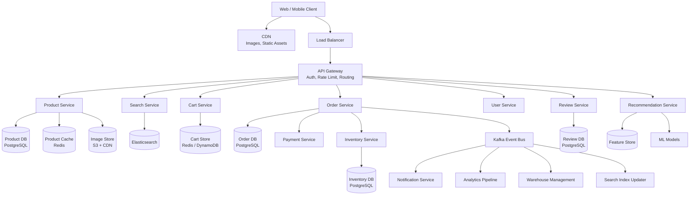
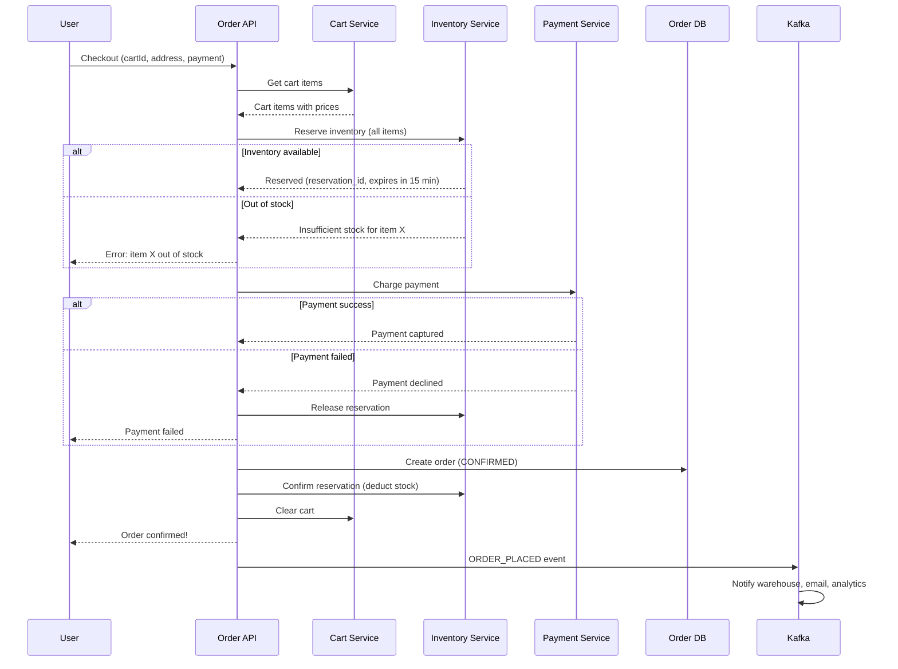
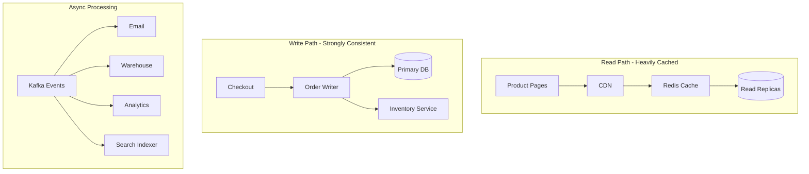

# Design Amazon / E-Commerce Platform

## 1. Problem Statement & Requirements

Design a large-scale e-commerce platform like Amazon that handles product browsing, search, cart management, checkout, and order fulfillment.

### Functional Requirements

| # | Requirement |
|---|-------------|
| FR-1 | Product catalog with categories, search, and filtering |
| FR-2 | Shopping cart (add, remove, update quantity) |
| FR-3 | Checkout with multiple payment methods |
| FR-4 | Order management and tracking |
| FR-5 | Inventory management across warehouses |
| FR-6 | Product reviews and ratings |
| FR-7 | Personalized recommendations |
| FR-8 | Flash sale support (limited inventory, high concurrency) |
| FR-9 | Seller management (marketplace model) |

### Non-Functional Requirements

| # | Requirement | Target |
|---|-------------|--------|
| NFR-1 | Availability | 99.99% |
| NFR-2 | Search latency | p99 < 200 ms |
| NFR-3 | Checkout latency | p99 < 2 s |
| NFR-4 | Browse throughput | 500K QPS |
| NFR-5 | Order throughput | 10K orders/sec peak |
| NFR-6 | Cart consistency | Eventual (5s) |
| NFR-7 | Inventory consistency | Strong |

---

## 2. Back-of-Envelope Estimation

### Traffic

- DAU: 200 million
- Products in catalog: 500 million
- Product views per user per day: 20
- Orders per day: 50 million

$$
\text{Product view QPS} = \frac{200 \times 10^6 \times 20}{86400} \approx 46{,}296 \text{ QPS}
$$

$$
\text{Peak product QPS} \approx 5 \times 46{,}296 \approx 231{,}481 \text{ QPS}
$$

$$
\text{Order TPS} = \frac{50 \times 10^6}{86400} \approx 579 \text{ TPS}
$$

$$
\text{Peak order TPS} \approx 10 \times 579 \approx 5{,}790 \text{ TPS}
$$

### Storage

- Product record: ~10 KB (name, description, images, attributes)
- Product catalog:

$$
500 \times 10^6 \times 10 \text{ KB} = 5 \text{ TB}
$$

- Order record: ~5 KB
- Orders per year:

$$
50 \times 10^6 \times 365 \times 5 \text{ KB} = 91.25 \text{ TB/year}
$$

- Product images: ~5 images x 500 KB = 2.5 MB per product

$$
500 \times 10^6 \times 2.5 \text{ MB} = 1.25 \text{ PB}
$$

### Bandwidth

$$
\text{Product pages (peak)} = 231{,}481 \times 50 \text{ KB} = 11.6 \text{ GB/s}
$$

---

## 3. High-Level Design



### API Design

```typescript
// Product APIs
// GET /v1/products/:productId
// GET /v1/products?category=electronics&sort=price_asc&page=1
// GET /v1/search?q=wireless+headphones&filters=brand:sony,price:50-200

// Cart APIs
// GET /v1/cart
// POST /v1/cart/items { productId, quantity, sellerId }
// PATCH /v1/cart/items/:itemId { quantity }
// DELETE /v1/cart/items/:itemId

// Order APIs
// POST /v1/orders/checkout { cartId, addressId, paymentMethodId }
// GET /v1/orders/:orderId
// GET /v1/orders?status=delivered&page=1

interface ProductResponse {
  productId: string;
  title: string;
  description: string;
  price: PriceInfo;
  images: ImageInfo[];
  attributes: Record<string, string>;
  category: CategoryPath;
  seller: SellerInfo;
  rating: RatingInfo;
  inventory: InventoryStatus;
  shipping: ShippingInfo;
}

interface CartResponse {
  cartId: string;
  items: CartItem[];
  subtotal: number;
  currency: string;
  itemCount: number;
}

interface OrderResponse {
  orderId: string;
  status: OrderStatus;
  items: OrderItem[];
  total: number;
  payment: PaymentInfo;
  shipping: ShippingInfo;
  timeline: OrderEvent[];
}
```

---

## 4. Database Schema

### Products

```sql
CREATE TABLE products (
    product_id      UUID PRIMARY KEY,
    seller_id       UUID NOT NULL REFERENCES sellers(seller_id),
    title           VARCHAR(500) NOT NULL,
    description     TEXT,
    category_id     UUID NOT NULL REFERENCES categories(category_id),
    brand           VARCHAR(200),
    base_price      BIGINT NOT NULL,         -- In cents
    currency        CHAR(3) DEFAULT 'USD',
    attributes      JSONB,                   -- Size, color, weight, etc.
    status          VARCHAR(20) DEFAULT 'ACTIVE',
    created_at      TIMESTAMPTZ DEFAULT NOW(),
    updated_at      TIMESTAMPTZ DEFAULT NOW()
);

CREATE INDEX idx_products_category ON products(category_id, status);
CREATE INDEX idx_products_seller ON products(seller_id);
CREATE INDEX idx_products_search ON products USING GIN (
    to_tsvector('english', title || ' ' || COALESCE(description, ''))
);
CREATE INDEX idx_products_attrs ON products USING GIN (attributes);
```

### Inventory

```sql
CREATE TABLE inventory (
    inventory_id    UUID PRIMARY KEY,
    product_id      UUID NOT NULL REFERENCES products(product_id),
    warehouse_id    UUID NOT NULL REFERENCES warehouses(warehouse_id),
    quantity         INT NOT NULL DEFAULT 0,
    reserved        INT NOT NULL DEFAULT 0, -- Temporarily reserved during checkout
    version         INT NOT NULL DEFAULT 0, -- Optimistic locking
    updated_at      TIMESTAMPTZ DEFAULT NOW(),
    UNIQUE (product_id, warehouse_id)
);

CREATE INDEX idx_inventory_product ON inventory(product_id);
CREATE INDEX idx_inventory_low ON inventory(product_id)
    WHERE quantity - reserved < 10;
```

### Orders

```sql
CREATE TABLE orders (
    order_id        UUID PRIMARY KEY,
    user_id         UUID NOT NULL,
    status          VARCHAR(30) DEFAULT 'PENDING',
    subtotal        BIGINT NOT NULL,
    shipping_fee    BIGINT DEFAULT 0,
    tax             BIGINT DEFAULT 0,
    total           BIGINT NOT NULL,
    currency        CHAR(3) DEFAULT 'USD',
    shipping_address JSONB NOT NULL,
    payment_id      UUID,
    placed_at       TIMESTAMPTZ DEFAULT NOW(),
    shipped_at      TIMESTAMPTZ,
    delivered_at    TIMESTAMPTZ,
    cancelled_at    TIMESTAMPTZ
) PARTITION BY RANGE (placed_at);

CREATE INDEX idx_orders_user ON orders(user_id, placed_at DESC);
CREATE INDEX idx_orders_status ON orders(status, placed_at);

CREATE TABLE order_items (
    order_item_id   UUID PRIMARY KEY,
    order_id        UUID NOT NULL REFERENCES orders(order_id),
    product_id      UUID NOT NULL,
    seller_id       UUID NOT NULL,
    quantity        INT NOT NULL,
    unit_price      BIGINT NOT NULL,
    total_price     BIGINT NOT NULL,
    status          VARCHAR(30) DEFAULT 'PENDING'
);

CREATE INDEX idx_order_items_order ON order_items(order_id);
```

### Reviews

```sql
CREATE TABLE reviews (
    review_id       UUID PRIMARY KEY,
    product_id      UUID NOT NULL,
    user_id         UUID NOT NULL,
    rating          SMALLINT NOT NULL CHECK (rating BETWEEN 1 AND 5),
    title           VARCHAR(200),
    body            TEXT,
    verified_purchase BOOLEAN DEFAULT FALSE,
    helpful_count   INT DEFAULT 0,
    images          JSONB,
    created_at      TIMESTAMPTZ DEFAULT NOW(),
    UNIQUE (product_id, user_id)
);

CREATE INDEX idx_reviews_product ON reviews(product_id, created_at DESC);
CREATE INDEX idx_reviews_rating ON reviews(product_id, rating);
```

---

## 5. Detailed Component Design

### 5.1 Product Catalog Service

```typescript
class ProductService {
  private db: DatabasePool;
  private cache: RedisCluster;
  private searchIndex: ElasticsearchClient;
  private readonly CACHE_TTL = 300; // 5 min

  async getProduct(productId: string): Promise<ProductResponse> {
    // 1. Check cache
    const cached = await this.cache.get(`product:${productId}`);
    if (cached) return JSON.parse(cached);

    // 2. Fetch from DB
    const product = await this.db.query(
      'SELECT * FROM products WHERE product_id = $1 AND status = $2',
      [productId, 'ACTIVE']
    );

    if (!product.rows[0]) {
      throw new NotFoundError('Product not found');
    }

    // 3. Enrich with inventory, ratings
    const [inventory, rating] = await Promise.all([
      this.getInventoryStatus(productId),
      this.getAggregatedRating(productId),
    ]);

    const response = this.buildProductResponse(
      product.rows[0], inventory, rating
    );

    // 4. Cache
    await this.cache.setex(
      `product:${productId}`, this.CACHE_TTL, JSON.stringify(response)
    );

    return response;
  }

  async searchProducts(
    query: string,
    filters: ProductFilters,
    sort: SortOption,
    page: number
  ): Promise<SearchResults> {
    const esQuery = {
      bool: {
        must: [
          {
            multi_match: {
              query,
              fields: ['title^3', 'description', 'brand^2', 'category_name'],
              type: 'best_fields',
              fuzziness: 'AUTO',
            },
          },
        ],
        filter: this.buildFilters(filters),
      },
    };

    const result = await this.searchIndex.search({
      index: 'products',
      body: {
        query: esQuery,
        sort: this.buildSort(sort),
        from: (page - 1) * 20,
        size: 20,
        aggs: this.buildAggregations(filters),
      },
    });

    return {
      products: result.hits.hits.map((h) => h._source),
      totalResults: result.hits.total.value,
      facets: this.parseFacets(result.aggregations),
      page,
    };
  }

  private buildFilters(filters: ProductFilters): any[] {
    const esFilters: any[] = [];

    if (filters.category) {
      esFilters.push({ term: { category_id: filters.category } });
    }
    if (filters.priceMin || filters.priceMax) {
      esFilters.push({
        range: {
          base_price: {
            gte: filters.priceMin,
            lte: filters.priceMax,
          },
        },
      });
    }
    if (filters.brand) {
      esFilters.push({ terms: { brand: filters.brand } });
    }
    if (filters.minRating) {
      esFilters.push({
        range: { avg_rating: { gte: filters.minRating } },
      });
    }

    return esFilters;
  }
}
```

### 5.2 Shopping Cart Service

```typescript
class CartService {
  private redis: RedisCluster;
  private productService: ProductService;
  private readonly CART_TTL = 30 * 24 * 3600; // 30 days

  async getCart(userId: string): Promise<CartResponse> {
    const key = `cart:${userId}`;
    const items = await this.redis.hgetall(key);

    if (!items || Object.keys(items).length === 0) {
      return { cartId: userId, items: [], subtotal: 0, currency: 'USD', itemCount: 0 };
    }

    const cartItems: CartItem[] = [];
    let subtotal = 0;

    for (const [itemId, data] of Object.entries(items)) {
      const item = JSON.parse(data);
      // Refresh product price (prices can change)
      const product = await this.productService.getProduct(item.productId);
      const currentPrice = product.price.current;

      cartItems.push({
        itemId,
        productId: item.productId,
        title: product.title,
        quantity: item.quantity,
        unitPrice: currentPrice,
        totalPrice: currentPrice * item.quantity,
        image: product.images[0]?.url,
        inStock: product.inventory.available > 0,
      });

      subtotal += currentPrice * item.quantity;
    }

    return {
      cartId: userId,
      items: cartItems,
      subtotal,
      currency: 'USD',
      itemCount: cartItems.reduce((sum, i) => sum + i.quantity, 0),
    };
  }

  async addItem(
    userId: string,
    productId: string,
    quantity: number
  ): Promise<void> {
    const key = `cart:${userId}`;
    const itemId = `${productId}`;

    // Check if item already in cart
    const existing = await this.redis.hget(key, itemId);
    if (existing) {
      const item = JSON.parse(existing);
      item.quantity += quantity;
      await this.redis.hset(key, itemId, JSON.stringify(item));
    } else {
      await this.redis.hset(
        key,
        itemId,
        JSON.stringify({
          productId,
          quantity,
          addedAt: Date.now(),
        })
      );
    }

    await this.redis.expire(key, this.CART_TTL);
  }

  async removeItem(userId: string, itemId: string): Promise<void> {
    await this.redis.hdel(`cart:${userId}`, itemId);
  }

  async updateQuantity(
    userId: string,
    itemId: string,
    quantity: number
  ): Promise<void> {
    if (quantity <= 0) {
      return this.removeItem(userId, itemId);
    }

    const key = `cart:${userId}`;
    const existing = await this.redis.hget(key, itemId);
    if (!existing) throw new NotFoundError('Item not in cart');

    const item = JSON.parse(existing);
    item.quantity = quantity;
    await this.redis.hset(key, itemId, JSON.stringify(item));
  }

  /**
   * Merge guest cart into user cart on login.
   */
  async mergeCarts(
    guestId: string,
    userId: string
  ): Promise<void> {
    const guestItems = await this.redis.hgetall(`cart:${guestId}`);
    if (!guestItems) return;

    for (const [itemId, data] of Object.entries(guestItems)) {
      const item = JSON.parse(data);
      await this.addItem(userId, item.productId, item.quantity);
    }

    await this.redis.del(`cart:${guestId}`);
  }
}
```

::: tip Cart Storage Choice
Use **Redis Hash** for carts: each user's cart is a hash where field = productId, value = JSON item data. This allows O(1) add/remove/update and the entire cart can be fetched in one HGETALL call.
:::

### 5.3 Checkout & Order Service



```typescript
class OrderService {
  async checkout(
    userId: string,
    request: CheckoutRequest
  ): Promise<OrderResponse> {
    // 1. Get cart and validate
    const cart = await this.cartService.getCart(userId);
    if (cart.items.length === 0) {
      throw new Error('Cart is empty');
    }

    // Validate all items are in stock
    for (const item of cart.items) {
      if (!item.inStock) {
        throw new Error(`${item.title} is out of stock`);
      }
    }

    // 2. Calculate totals
    const subtotal = cart.subtotal;
    const shippingFee = await this.calculateShipping(
      cart.items, request.addressId
    );
    const tax = await this.calculateTax(subtotal, request.addressId);
    const total = subtotal + shippingFee + tax;

    // 3. Reserve inventory (with timeout)
    const reservations = await this.inventoryService.reserveAll(
      cart.items.map((item) => ({
        productId: item.productId,
        quantity: item.quantity,
      }))
    );

    try {
      // 4. Process payment
      const payment = await this.paymentService.charge({
        amount: total,
        currency: cart.currency,
        paymentMethodId: request.paymentMethodId,
        idempotencyKey: `order:${userId}:${Date.now()}`,
      });

      // 5. Create order in DB
      const order = await this.db.transaction(async (tx) => {
        const orderId = crypto.randomUUID();

        await tx.query(`
          INSERT INTO orders
            (order_id, user_id, subtotal, shipping_fee, tax,
             total, currency, shipping_address, payment_id, status)
          VALUES ($1, $2, $3, $4, $5, $6, $7, $8, $9, 'CONFIRMED')
        `, [orderId, userId, subtotal, shippingFee, tax,
            total, cart.currency, request.address,
            payment.paymentId]);

        for (const item of cart.items) {
          await tx.query(`
            INSERT INTO order_items
              (order_item_id, order_id, product_id, seller_id,
               quantity, unit_price, total_price)
            VALUES ($1, $2, $3, $4, $5, $6, $7)
          `, [crypto.randomUUID(), orderId, item.productId,
              item.sellerId, item.quantity, item.unitPrice,
              item.totalPrice]);
        }

        return orderId;
      });

      // 6. Confirm inventory reservation
      await this.inventoryService.confirmReservations(
        reservations.map((r) => r.reservationId)
      );

      // 7. Clear cart
      await this.cartService.clearCart(userId);

      // 8. Publish event
      await this.kafka.publish('orders', {
        type: 'ORDER_PLACED',
        orderId: order,
        userId,
        items: cart.items,
        total,
      });

      return this.getOrder(order);
    } catch (error) {
      // Rollback: release inventory
      await this.inventoryService.releaseReservations(
        reservations.map((r) => r.reservationId)
      );
      throw error;
    }
  }
}
```

### 5.4 Inventory Management

```typescript
class InventoryService {
  /**
   * Reserve inventory with optimistic locking.
   * Uses version column to prevent lost updates.
   */
  async reserve(
    productId: string,
    quantity: number
  ): Promise<Reservation> {
    const reservationId = crypto.randomUUID();
    const expiresAt = new Date(Date.now() + 15 * 60_000); // 15 min

    // Try to reserve from nearest warehouse first
    const warehouses = await this.getWarehousesByProximity(productId);

    let remaining = quantity;
    const allocations: WarehouseAllocation[] = [];

    for (const warehouse of warehouses) {
      if (remaining <= 0) break;

      const result = await this.db.query(`
        UPDATE inventory
        SET reserved = reserved + $1,
            version = version + 1
        WHERE product_id = $2
          AND warehouse_id = $3
          AND quantity - reserved >= $1
          AND version = $4
        RETURNING quantity, reserved
      `, [Math.min(remaining, 100), productId,
          warehouse.warehouseId, warehouse.version]);

      if (result.rowCount > 0) {
        const allocated = Math.min(remaining, 100);
        allocations.push({
          warehouseId: warehouse.warehouseId,
          quantity: allocated,
        });
        remaining -= allocated;
      }
    }

    if (remaining > 0) {
      // Rollback partial allocations
      await this.releaseAllocations(allocations, productId);
      throw new InsufficientStockError(productId, quantity);
    }

    // Store reservation
    await this.db.query(`
      INSERT INTO reservations
        (reservation_id, product_id, quantity, allocations,
         expires_at, status)
      VALUES ($1, $2, $3, $4, $5, 'ACTIVE')
    `, [reservationId, productId, quantity,
        JSON.stringify(allocations), expiresAt]);

    return { reservationId, expiresAt, allocations };
  }

  /**
   * Confirm reservation (deduct actual stock).
   */
  async confirmReservation(reservationId: string): Promise<void> {
    const reservation = await this.getReservation(reservationId);
    if (!reservation || reservation.status !== 'ACTIVE') {
      throw new Error('Invalid reservation');
    }

    await this.db.transaction(async (tx) => {
      for (const alloc of reservation.allocations) {
        await tx.query(`
          UPDATE inventory
          SET quantity = quantity - $1,
              reserved = reserved - $1,
              version = version + 1
          WHERE product_id = $2 AND warehouse_id = $3
        `, [alloc.quantity, reservation.productId,
            alloc.warehouseId]);
      }

      await tx.query(`
        UPDATE reservations SET status = 'CONFIRMED'
        WHERE reservation_id = $1
      `, [reservationId]);
    });
  }
}
```

::: danger Flash Sale Inventory
During flash sales, thousands of users try to buy the same product simultaneously. Solutions:
1. **Pre-decrement with Redis**: Atomic `DECR` in Redis for fast stock checks, reconcile with DB asynchronously
2. **Queue-based checkout**: Route flash sale orders through a FIFO queue processed at a controlled rate
3. **Oversell buffer**: Allow slight overselling (1-2%), handle edge cases with backorders
:::

### 5.5 Recommendation Engine

```typescript
class RecommendationService {
  private featureStore: FeatureStore;
  private modelClient: MLModelClient;

  /**
   * Get personalized product recommendations.
   */
  async getRecommendations(
    userId: string,
    context: RecommendationContext
  ): Promise<ProductResponse[]> {
    // 1. Collaborative filtering: "Users who bought X also bought Y"
    const cfRecommendations =
      await this.collaborativeFiltering(userId);

    // 2. Content-based: similar to recently viewed products
    const cbRecommendations =
      await this.contentBasedFiltering(userId, context);

    // 3. Trending: popular products in user's category interests
    const trendingRecommendations =
      await this.getTrending(context.category);

    // 4. Merge and re-rank using ML model
    const candidates = [
      ...cfRecommendations.map((r) => ({ ...r, source: 'cf' })),
      ...cbRecommendations.map((r) => ({ ...r, source: 'cb' })),
      ...trendingRecommendations.map((r) => ({ ...r, source: 'trend' })),
    ];

    // Deduplicate
    const uniqueCandidates = this.deduplicate(candidates);

    // Score with ML model
    const userFeatures = await this.featureStore.getUserFeatures(userId);
    const scored = await Promise.all(
      uniqueCandidates.map(async (candidate) => {
        const productFeatures = await this.featureStore
          .getProductFeatures(candidate.productId);
        const score = await this.modelClient.predict({
          userFeatures,
          productFeatures,
          context: {
            hour: new Date().getHours(),
            dayOfWeek: new Date().getDay(),
            source: candidate.source,
          },
        });
        return { ...candidate, score };
      })
    );

    // Return top N
    scored.sort((a, b) => b.score - a.score);
    return scored.slice(0, context.limit ?? 20);
  }

  private async collaborativeFiltering(
    userId: string
  ): Promise<RecommendationCandidate[]> {
    // Item-item collaborative filtering using purchase history
    const purchases = await this.getPurchaseHistory(userId);
    const similarItems = await this.db.query(`
      SELECT oi2.product_id, COUNT(*) as co_purchase_count
      FROM order_items oi1
      JOIN order_items oi2 ON oi1.order_id = oi2.order_id
      WHERE oi1.product_id = ANY($1)
        AND oi2.product_id != ALL($1)
      GROUP BY oi2.product_id
      ORDER BY co_purchase_count DESC
      LIMIT 50
    `, [purchases.map((p) => p.productId)]);

    return similarItems.rows;
  }
}
```

### 5.6 Review System

```typescript
class ReviewService {
  async addReview(
    userId: string,
    productId: string,
    review: CreateReviewRequest
  ): Promise<void> {
    // Verify purchase
    const hasPurchased = await this.verifyPurchase(userId, productId);

    await this.db.transaction(async (tx) => {
      await tx.query(`
        INSERT INTO reviews
          (review_id, product_id, user_id, rating, title, body,
           verified_purchase)
        VALUES ($1, $2, $3, $4, $5, $6, $7)
      `, [crypto.randomUUID(), productId, userId,
          review.rating, review.title, review.body,
          hasPurchased]);

      // Update product rating aggregate
      await tx.query(`
        INSERT INTO product_ratings (product_id, total_ratings,
          sum_ratings, avg_rating)
        VALUES ($1, 1, $2, $2)
        ON CONFLICT (product_id) DO UPDATE SET
          total_ratings = product_ratings.total_ratings + 1,
          sum_ratings = product_ratings.sum_ratings + $2,
          avg_rating = (product_ratings.sum_ratings + $2)::DECIMAL /
                       (product_ratings.total_ratings + 1)
      `, [productId, review.rating]);
    });

    // Update search index
    await this.searchIndex.update(productId, {
      avg_rating: await this.getAvgRating(productId),
    });
  }
}
```

---

## 6. Scaling & Bottlenecks

### What Breaks First?

| Bottleneck | Symptom | Solution |
|-----------|---------|----------|
| Product DB read load | Slow product pages | Heavy Redis caching, read replicas |
| Search index updates lag | Stale search results | Dedicated indexer consumers, near-real-time |
| Flash sale inventory contention | Checkout timeouts | Redis pre-decrement, queue-based ordering |
| Image serving bandwidth | Slow page loads | CDN with edge caching |
| Order DB write throughput | Checkout failures | Shard by user_id |

### Service-Level Architecture



---

## 7. Trade-offs & Alternatives

| Decision | Option A | Option B | Our Choice |
|----------|----------|----------|------------|
| Cart storage | Redis | DynamoDB | **Redis** -- fastest for read/write, TTL for expiry |
| Search | PostgreSQL full-text | Elasticsearch | **Elasticsearch** -- faceted search, fuzzy matching |
| Inventory | Strong consistency | Eventual with oversell buffer | **Strong** for normal, **Redis + queue** for flash sales |
| Recommendations | Real-time ML | Pre-computed batches | **Hybrid** -- batch candidates, real-time ranking |
| Product images | Self-hosted | CDN + S3 | **CDN + S3** -- global distribution |

---

## 8. Advanced Topics

### 8.1 Flash Sale Architecture

```typescript
class FlashSaleService {
  private redis: RedisCluster;

  async initializeFlashSale(
    saleId: string,
    productId: string,
    totalStock: number
  ): Promise<void> {
    // Pre-load stock into Redis
    await this.redis.set(`flash:stock:${saleId}`, totalStock);
    await this.redis.set(`flash:status:${saleId}`, 'UPCOMING');
  }

  async attemptPurchase(
    saleId: string,
    userId: string
  ): Promise<{ success: boolean; queuePosition?: number }> {
    // Atomic decrement
    const remaining = await this.redis.decr(`flash:stock:${saleId}`);

    if (remaining < 0) {
      // Sold out - restore the counter
      await this.redis.incr(`flash:stock:${saleId}`);
      return { success: false };
    }

    // Add to processing queue
    const position = await this.redis.rpush(
      `flash:queue:${saleId}`,
      JSON.stringify({ userId, timestamp: Date.now() })
    );

    return { success: true, queuePosition: position };
  }
}
```

### 8.2 Price Optimization

Dynamic pricing based on demand, competition, inventory levels, and time of day.

### 8.3 Fraud Detection for E-Commerce

Monitor for: fake reviews, account takeover, promo code abuse, returns fraud, payment fraud.

---

## 9. Interview Tips

::: tip Scope Down
E-commerce is a massive system. Ask the interviewer what to focus on:
- **Catalog + Search**: Product data model, Elasticsearch, caching
- **Cart + Checkout**: Cart service, inventory locking, payment flow
- **Flash Sales**: High-concurrency inventory management
- **Recommendations**: ML pipeline, collaborative filtering
:::

::: warning Common Mistakes
- Not separating read path (heavily cached) from write path (strongly consistent)
- Forgetting inventory reservation with timeout (hold stock during checkout)
- Not handling the cart merge scenario (guest -> logged-in user)
- Ignoring flash sale concurrency (normal checkout flow falls apart)
- Not discussing CDN for images (1.25 PB of product images)
:::

::: details Sample Interview Timeline (45 min)
| Time | Phase |
|------|-------|
| 0-5 min | Requirements & scope |
| 5-10 min | Back-of-envelope |
| 10-18 min | High-level microservices architecture |
| 18-25 min | Deep dive: checkout + inventory |
| 25-32 min | Product search + catalog caching |
| 32-38 min | Flash sale handling |
| 38-43 min | Recommendations overview |
| 43-45 min | Trade-offs |
:::

### Key Talking Points

1. **Why microservices?** Each domain (product, cart, order, inventory) has different scaling needs and can be developed independently.
2. **How to handle flash sales?** Pre-decrement stock in Redis (atomic DECR), queue successful claims, process orders asynchronously.
3. **Why Redis for carts?** Low latency, natural TTL for cart expiry, Hash data type maps perfectly to cart items.
4. **How to keep search in sync?** Kafka events from product service trigger Elasticsearch index updates with < 5s delay.
5. **Inventory consistency?** Optimistic locking with version column prevents lost updates. For flash sales, Redis provides the speed needed.
