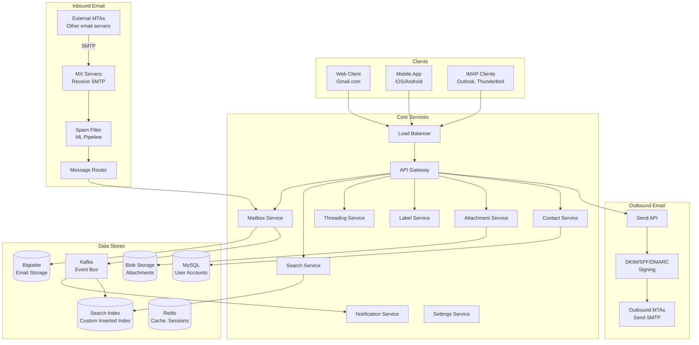
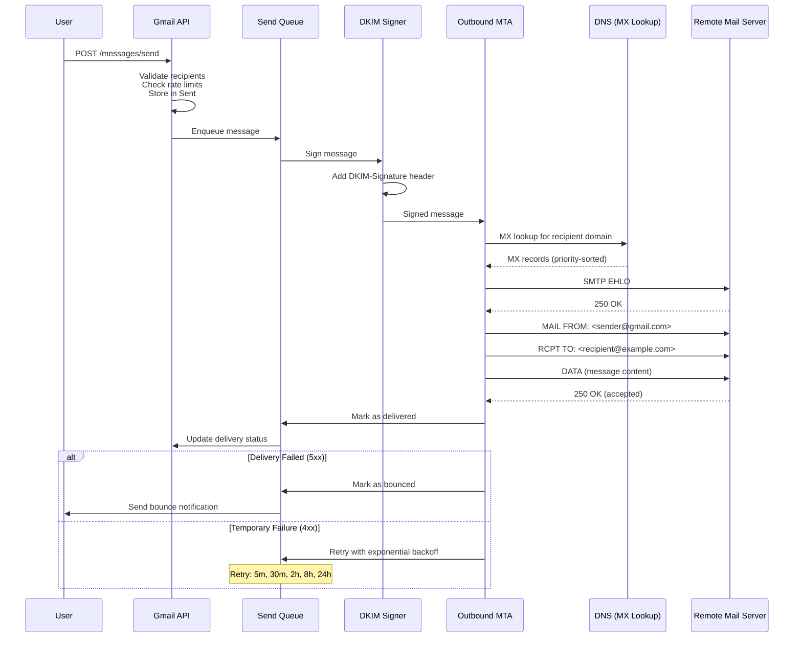
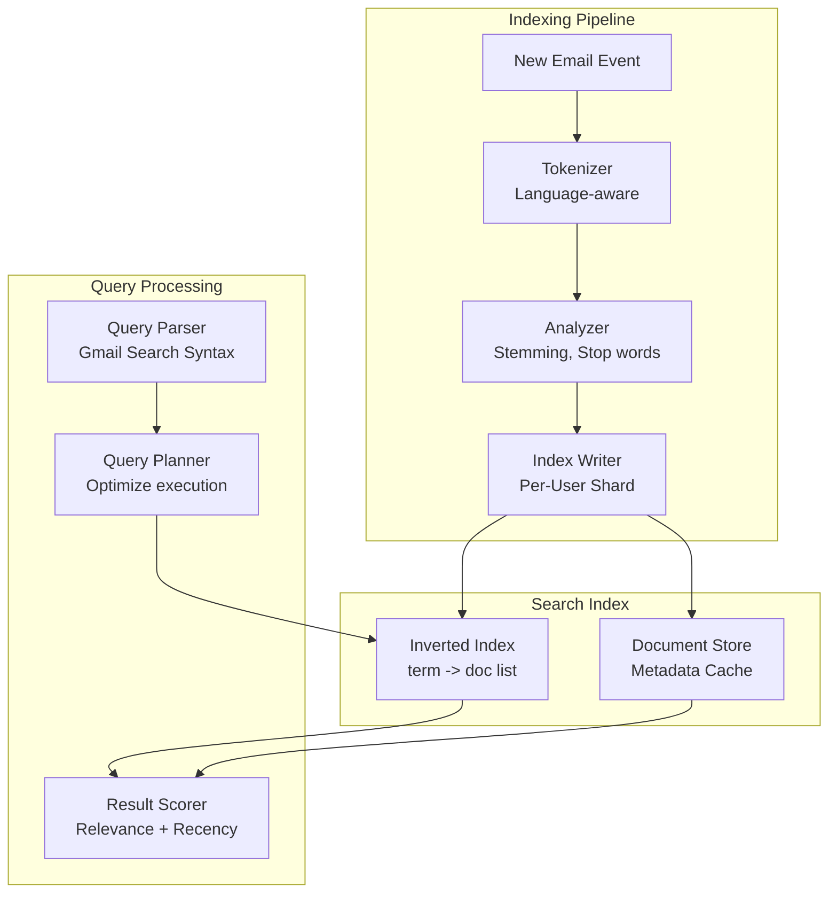
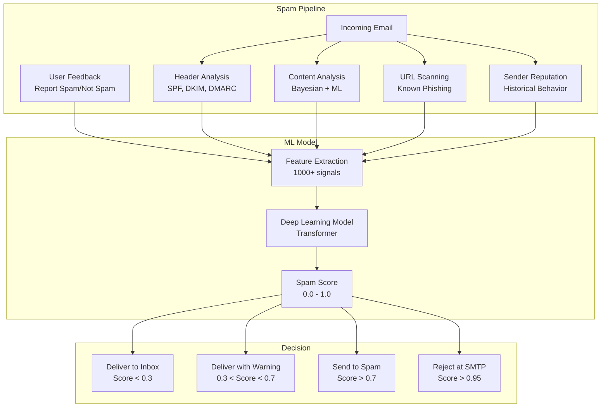

# Design Gmail — Email Service

## 1. Problem Statement & Requirements

### Functional Requirements

| # | Requirement | Details |
|---|-------------|---------|
| FR-1 | Send Email | Compose and send emails via SMTP to any address |
| FR-2 | Receive Email | Receive emails from any SMTP server |
| FR-3 | Storage | Store all emails with unlimited (effectively 15GB free) storage |
| FR-4 | Search | Full-text search across all emails, attachments |
| FR-5 | Threading | Conversation threading (group related messages) |
| FR-6 | Labels & Folders | Organize with labels (multiple per email), folders (Inbox, Sent, etc.) |
| FR-7 | Spam Filtering | Classify and filter spam with high accuracy |
| FR-8 | Attachments | Send/receive attachments up to 25MB |
| FR-9 | Push Notifications | Real-time notifications for new emails |
| FR-10 | Contacts | Address book with auto-complete |

### Non-Functional Requirements

| # | Requirement | Target |
|---|-------------|--------|
| NFR-1 | Availability | 99.99% uptime |
| NFR-2 | Latency | Inbox load < 200ms, search < 500ms |
| NFR-3 | Throughput | 300B+ emails sent globally per day |
| NFR-4 | Durability | Zero email loss |
| NFR-5 | Scale | 1.8B users, 15GB storage per free user |
| NFR-6 | Security | End-to-end encryption, phishing detection, 2FA |

---

## 2. Back-of-Envelope Estimation

### User Scale

$$
\text{Total Users} = 1.8B \quad \text{DAU} = 500M
$$

### Email Volume

$$
\text{Emails Sent/Day (platform)} = 100B
$$

$$
\text{Avg Emails Received/User/Day} = 50
$$

$$
\text{Avg Email Size} = 50 \text{ KB (metadata + body)} + 500 \text{ KB (attachments, avg)}
$$

$$
\text{Receiving QPS} = \frac{1.8B \times 50}{86{,}400} \approx 1{,}041{,}667 \text{ emails/s}
$$

### Storage Estimation

$$
\text{Daily Email Storage} = 100B \times 50 \text{ KB} = 5 \text{ PB/day (metadata + body)}
$$

$$
\text{Daily Attachment Storage} = 100B \times 0.1 \text{ (attach rate)} \times 2 \text{ MB} = 20 \text{ PB/day}
$$

$$
\text{Annual Storage} \approx 9 \text{ EB/year}
$$

### Search Index

$$
\text{Indexed Emails per User} \approx 20{,}000 \text{ (avg)}
$$

$$
\text{Total Indexed Emails} = 1.8B \times 20{,}000 = 36 \text{ trillion documents}
$$

### Search QPS

$$
\text{Search QPS} = \frac{500M \times 5}{86{,}400} \approx 29{,}000 \text{ req/s}
$$

---

## 3. High-Level Design

### Architecture Diagram



### API Design

```typescript
// Mailbox APIs
GET  /api/v1/mailbox?label=INBOX&page_token={token}&limit=50
     // Returns: list of email summaries (subject, from, snippet, date)
GET  /api/v1/messages/{messageId}
     // Returns: full email (headers, body, attachments)
GET  /api/v1/threads/{threadId}
     // Returns: all messages in thread

// Send APIs
POST /api/v1/messages/send
     // Body: { to, cc, bcc, subject, body_html, body_text, attachments[], replyTo? }
POST /api/v1/messages/draft
     // Body: same as send
PUT  /api/v1/messages/draft/{draftId}

// Label/Organization APIs
POST   /api/v1/messages/{messageId}/labels
       // Body: { addLabels: ["STARRED"], removeLabels: ["INBOX"] }
POST   /api/v1/labels
       // Body: { name, color }
DELETE /api/v1/labels/{labelId}
POST   /api/v1/messages/{messageId}/archive  // Remove INBOX label
POST   /api/v1/messages/{messageId}/trash

// Search APIs
GET /api/v1/search?q={query}&from={email}&to={email}&after={date}&before={date}
    &has_attachment=true&label={label}&limit=20

// Contact APIs
GET /api/v1/contacts?q={prefix}
    // Returns: auto-complete suggestions
```

---

## 4. Database Schema

### Email Messages (Bigtable / Wide-Column Store)

```
Row Key: {user_id}#{reverse_timestamp}#{message_id}

Column Families:
  metadata:
    - from: "sender@example.com"
    - to: "recipient@gmail.com"
    - cc: "cc@example.com"
    - bcc: ""
    - subject: "Meeting Tomorrow"
    - date: "2026-03-18T10:30:00Z"
    - message_id_header: "<abc123@example.com>"
    - in_reply_to: "<def456@example.com>"
    - references: "<def456@example.com> <ghi789@example.com>"
    - thread_id: "thread_abc123"
    - snippet: "Hi, just wanted to confirm..."
    - size_bytes: 15234
    - has_attachments: true

  labels:
    - INBOX: ""
    - UNREAD: ""
    - IMPORTANT: ""
    - CATEGORY_PRIMARY: ""
    - label_custom_work: ""

  body:
    - text_plain: "Hi, just wanted to confirm..."
    - text_html: "<html><body>..."

  attachments:
    - att_0_name: "document.pdf"
    - att_0_mime: "application/pdf"
    - att_0_size: 1048576
    - att_0_blob_ref: "blob://attachments/abc123/0"
```

**Why Bigtable?**

| Requirement | Why Bigtable |
|------------|-------------|
| Row key scan | Efficiently scan user's emails by timestamp |
| Column families | Separate metadata (small, always read) from body (large, read on demand) |
| Scale | Handles trillions of rows across petabytes |
| Durability | Multi-region replication, zero data loss |

### User Accounts (MySQL)

```sql
CREATE TABLE users (
    user_id         BIGINT PRIMARY KEY AUTO_INCREMENT,
    email           VARCHAR(255) UNIQUE NOT NULL,
    password_hash   VARCHAR(255) NOT NULL,
    display_name    VARCHAR(100),
    storage_used_bytes BIGINT DEFAULT 0,
    storage_quota_bytes BIGINT DEFAULT 16106127360, -- 15 GB
    plan            ENUM('free', 'workspace_starter', 'workspace_business') DEFAULT 'free',
    language        CHAR(5) DEFAULT 'en',
    timezone        VARCHAR(50) DEFAULT 'UTC',
    two_factor_enabled BOOLEAN DEFAULT FALSE,
    created_at      TIMESTAMP DEFAULT CURRENT_TIMESTAMP,
    last_login_at   TIMESTAMP
);
```

### Labels Table (MySQL)

```sql
CREATE TABLE labels (
    label_id        BIGINT PRIMARY KEY AUTO_INCREMENT,
    user_id         BIGINT NOT NULL REFERENCES users(user_id),
    name            VARCHAR(100) NOT NULL,
    type            ENUM('system', 'user') DEFAULT 'user',
    -- system labels: INBOX, SENT, DRAFTS, SPAM, TRASH, STARRED, IMPORTANT
    color           VARCHAR(7), -- hex color
    unread_count    INT DEFAULT 0,
    total_count     INT DEFAULT 0,
    UNIQUE KEY uk_user_label (user_id, name)
);
```

### Contacts Table (MySQL)

```sql
CREATE TABLE contacts (
    contact_id      BIGINT PRIMARY KEY AUTO_INCREMENT,
    user_id         BIGINT NOT NULL REFERENCES users(user_id),
    email           VARCHAR(255) NOT NULL,
    name            VARCHAR(200),
    frequency       INT DEFAULT 0, -- How often emailed
    last_contacted  TIMESTAMP,
    source          ENUM('manual', 'auto') DEFAULT 'auto',
    UNIQUE KEY uk_user_contact (user_id, email)
);

CREATE INDEX idx_contacts_freq ON contacts(user_id, frequency DESC);
```

---

## 5. Detailed Component Design

### 5.1 Email Sending (SMTP Outbound)



```typescript
class EmailSendingService {
  async sendEmail(userId: string, email: ComposeEmail): Promise<SendResult> {
    // Validate
    this.validateRecipients(email.to, email.cc, email.bcc);
    this.validateSize(email); // Max 25MB total
    this.checkRateLimit(userId); // Max 500 emails/day for free accounts

    // Generate message ID
    const messageId = `<${crypto.randomUUID()}@gmail.com>`;

    // Build MIME message
    const mimeMessage = this.buildMimeMessage({
      from: await this.getUserEmail(userId),
      to: email.to,
      cc: email.cc,
      bcc: email.bcc,
      subject: email.subject,
      bodyHtml: email.bodyHtml,
      bodyText: email.bodyText ?? this.htmlToText(email.bodyHtml),
      messageId,
      inReplyTo: email.inReplyTo,
      references: email.references,
      attachments: email.attachments,
    });

    // Store in sender's Sent folder
    await this.storeEmail(userId, mimeMessage, ['SENT']);

    // Enqueue for delivery
    const destinations = this.groupByDomain([...email.to, ...email.cc, ...email.bcc]);

    for (const [domain, recipients] of destinations) {
      await this.sendQueue.enqueue({
        messageId,
        mimeMessage,
        domain,
        recipients,
        userId,
        retryCount: 0,
      });
    }

    return { messageId, status: 'queued' };
  }

  private buildMimeMessage(params: MimeParams): string {
    const boundary = `----=_Part_${crypto.randomUUID()}`;
    let headers = [
      `From: ${params.from}`,
      `To: ${params.to.join(', ')}`,
      params.cc?.length ? `Cc: ${params.cc.join(', ')}` : '',
      `Subject: ${this.encodeSubject(params.subject)}`,
      `Message-ID: ${params.messageId}`,
      `Date: ${new Date().toUTCString()}`,
      `MIME-Version: 1.0`,
      params.inReplyTo ? `In-Reply-To: ${params.inReplyTo}` : '',
      params.references?.length ? `References: ${params.references.join(' ')}` : '',
    ].filter(Boolean).join('\r\n');

    if (params.attachments?.length) {
      headers += `\r\nContent-Type: multipart/mixed; boundary="${boundary}"`;
      // Build multipart message with attachments
      return this.buildMultipartMessage(headers, boundary, params);
    }

    headers += `\r\nContent-Type: multipart/alternative; boundary="${boundary}"`;
    return this.buildAlternativeMessage(headers, boundary, params);
  }
}
```

**DKIM, SPF, and DMARC:**

```typescript
class EmailAuthService {
  // DKIM: Sign outbound emails
  signWithDKIM(message: string): string {
    const selector = 'google';
    const domain = 'gmail.com';

    // Hash the message body
    const bodyHash = crypto
      .createHash('sha256')
      .update(this.canonicalizeBody(message))
      .digest('base64');

    // Create DKIM-Signature header
    const dkimHeader = [
      `v=1`,
      `a=rsa-sha256`,
      `c=relaxed/relaxed`,
      `d=${domain}`,
      `s=${selector}`,
      `bh=${bodyHash}`,
      `h=from:to:subject:date:message-id`,
    ].join('; ');

    // Sign the header + DKIM header with private key
    const signature = crypto
      .createSign('SHA256')
      .update(this.canonicalizeHeaders(message, dkimHeader))
      .sign(this.privateKey, 'base64');

    return `DKIM-Signature: ${dkimHeader}; b=${signature}\r\n${message}`;
  }
}
```

### 5.2 Email Receiving (SMTP Inbound)

```mermaid
graph LR
    External[External MTA] -->|SMTP| MX[MX Server<br/>Port 25]
    MX --> TLS[TLS Negotiation<br/>STARTTLS]
    TLS --> SPFCheck[SPF Check<br/>Verify sender IP]
    SPFCheck --> DKIMVerify[DKIM Verification<br/>Check signature]
    DKIMVerify --> DMARCCheck[DMARC Policy<br/>Check alignment]
    DMARCCheck --> RateLimit[Rate Limiting<br/>Per sender domain]
    RateLimit --> Antivirus[Virus Scan<br/>Attachments]
    Antivirus --> SpamML[Spam Classifier<br/>ML Model]
    SpamML --> Routing[Route to<br/>User Mailbox]
    Routing --> Store[Store in<br/>Bigtable]
    Store --> Notify[Push Notification<br/>+ Badge Count]
```



```typescript
class InboundMailService {
  async handleIncomingEmail(smtpData: SMTPMessage): Promise<void> {
    // Step 1: Authentication checks
    const authResult = await this.authenticateSender(smtpData);
    if (authResult.reject) {
      throw new SMTPRejectError(550, authResult.reason);
    }

    // Step 2: Parse MIME message
    const parsed = this.parseMimeMessage(smtpData.data);

    // Step 3: Virus scan attachments
    if (parsed.attachments.length > 0) {
      const scanResult = await this.virusScanner.scan(parsed.attachments);
      if (scanResult.infected) {
        throw new SMTPRejectError(550, 'Message contains malware');
      }
    }

    // Step 4: Spam classification
    const spamResult = await this.spamClassifier.classify(parsed, authResult);

    // Step 5: Determine recipient(s)
    const recipients = this.resolveRecipients(smtpData.rcptTo);

    for (const recipient of recipients) {
      // Step 6: Store email
      const labels = this.determineLabels(spamResult, parsed);
      const threadId = await this.threadingService.findOrCreateThread(
        recipient.userId, parsed
      );

      await this.storeEmail(recipient.userId, {
        ...parsed,
        threadId,
        labels,
        spamScore: spamResult.score,
      });

      // Step 7: Send notification (if not spam)
      if (!labels.includes('SPAM')) {
        await this.notificationService.notifyNewEmail(recipient.userId, {
          from: parsed.from,
          subject: parsed.subject,
          snippet: parsed.snippet,
          threadId,
        });
      }

      // Step 8: Update counters
      for (const label of labels) {
        await this.updateLabelCount(recipient.userId, label, 1, 1);
      }
    }
  }

  private determineLabels(spamResult: SpamResult, email: ParsedEmail): string[] {
    const labels: string[] = [];

    if (spamResult.isSpam) {
      labels.push('SPAM');
      return labels;
    }

    labels.push('INBOX');
    labels.push('UNREAD');

    // Category classification (Primary, Social, Promotions, Updates, Forums)
    const category = this.categoryClassifier.classify(email);
    labels.push(`CATEGORY_${category.toUpperCase()}`);

    // Importance detection
    if (this.isImportant(email)) {
      labels.push('IMPORTANT');
    }

    return labels;
  }
}
```

### 5.3 Full-Text Search



```typescript
class EmailSearchService {
  // Gmail search syntax: from:john subject:meeting has:attachment after:2026/01/01
  async search(userId: string, query: string): Promise<SearchResult[]> {
    // Parse Gmail search operators
    const parsed = this.parseSearchQuery(query);

    // Build search query
    const searchQuery = this.buildSearchQuery(userId, parsed);

    // Execute against per-user search index
    const results = await this.searchIndex.query(searchQuery);

    return results.map(r => ({
      messageId: r.messageId,
      threadId: r.threadId,
      from: r.from,
      subject: r.subject,
      snippet: r.highlight ?? r.snippet,
      date: r.date,
      labels: r.labels,
      hasAttachments: r.hasAttachments,
    }));
  }

  private parseSearchQuery(query: string): ParsedQuery {
    const parsed: ParsedQuery = { terms: [], filters: {} };

    // Parse operators
    const operatorRegex = /(\w+):(\S+|"[^"]*")/g;
    let match: RegExpExecArray | null;

    let remainingQuery = query;

    while ((match = operatorRegex.exec(query)) !== null) {
      const [fullMatch, operator, value] = match;
      remainingQuery = remainingQuery.replace(fullMatch, '');

      switch (operator) {
        case 'from':
          parsed.filters.from = value.replace(/"/g, '');
          break;
        case 'to':
          parsed.filters.to = value.replace(/"/g, '');
          break;
        case 'subject':
          parsed.filters.subject = value.replace(/"/g, '');
          break;
        case 'has':
          if (value === 'attachment') parsed.filters.hasAttachment = true;
          break;
        case 'after':
          parsed.filters.after = new Date(value);
          break;
        case 'before':
          parsed.filters.before = new Date(value);
          break;
        case 'label':
          parsed.filters.label = value;
          break;
        case 'is':
          if (value === 'unread') parsed.filters.isUnread = true;
          if (value === 'starred') parsed.filters.isStarred = true;
          break;
        case 'larger':
          parsed.filters.minSize = this.parseSize(value);
          break;
        case 'filename':
          parsed.filters.filename = value;
          break;
      }
    }

    // Remaining text becomes full-text search terms
    parsed.terms = remainingQuery.trim().split(/\s+/).filter(Boolean);

    return parsed;
  }

  // Index a new email
  async indexEmail(userId: string, email: StoredEmail): Promise<void> {
    const tokens = new Set<string>();

    // Tokenize all searchable fields
    this.tokenize(email.subject).forEach(t => tokens.add(t));
    this.tokenize(email.bodyText).forEach(t => tokens.add(t));
    this.tokenize(email.from).forEach(t => tokens.add(t));
    email.to.forEach(addr => this.tokenize(addr).forEach(t => tokens.add(t)));

    // Index attachment filenames
    for (const att of email.attachments) {
      this.tokenize(att.filename).forEach(t => tokens.add(t));
    }

    // Write to inverted index
    for (const token of tokens) {
      await this.searchIndex.addPosting(userId, token, {
        messageId: email.messageId,
        threadId: email.threadId,
        date: email.date,
        labels: email.labels,
      });
    }
  }
}
```

### 5.4 Email Threading

Gmail groups emails into conversations using the `References` and `In-Reply-To` headers defined in RFC 2822.

```typescript
class ThreadingService {
  async findOrCreateThread(
    userId: string,
    email: ParsedEmail
  ): Promise<string> {
    // Strategy 1: Use In-Reply-To header
    if (email.inReplyTo) {
      const thread = await this.findThreadByMessageId(userId, email.inReplyTo);
      if (thread) return thread;
    }

    // Strategy 2: Use References header (walk the chain)
    if (email.references?.length) {
      for (const ref of email.references) {
        const thread = await this.findThreadByMessageId(userId, ref);
        if (thread) return thread;
      }
    }

    // Strategy 3: Subject-based matching (fallback)
    const normalizedSubject = this.normalizeSubject(email.subject);
    const thread = await this.findThreadBySubject(
      userId, normalizedSubject, email.from, 7 // 7-day window
    );
    if (thread) return thread;

    // No existing thread - create new one
    return crypto.randomUUID();
  }

  private normalizeSubject(subject: string): string {
    // Remove Re:, Fwd:, Fw:, and normalize
    return subject
      .replace(/^(Re|Fwd|Fw):\s*/gi, '')
      .replace(/\s+/g, ' ')
      .trim()
      .toLowerCase();
  }

  async getThread(userId: string, threadId: string): Promise<ThreadView> {
    // Fetch all messages in thread, sorted by date
    const messages = await this.bigtable.scan({
      rowKeyPrefix: `${userId}#`,
      filter: { threadId },
      columns: ['metadata', 'body', 'labels'],
    });

    // Sort chronologically (oldest first for conversation view)
    messages.sort((a, b) => a.date.getTime() - b.date.getTime());

    return {
      threadId,
      subject: messages[0]?.subject ?? '',
      messageCount: messages.length,
      participants: [...new Set(messages.flatMap(m => [m.from, ...m.to]))],
      messages: messages.map(m => ({
        messageId: m.messageId,
        from: m.from,
        to: m.to,
        date: m.date,
        bodyHtml: m.bodyHtml,
        bodyText: m.bodyText,
        attachments: m.attachments,
        labels: m.labels,
      })),
      labels: this.mergeLabels(messages),
    };
  }
}
```

### 5.5 Spam Filtering



```typescript
class SpamClassifier {
  async classify(email: ParsedEmail, authResult: AuthResult): Promise<SpamResult> {
    // Extract 1000+ features
    const features = this.extractFeatures(email, authResult);

    // Run ML model
    const score = await this.mlModel.predict(features);

    // Apply user-specific adjustments
    const adjustedScore = await this.applyUserPreferences(email, score);

    return {
      score: adjustedScore,
      isSpam: adjustedScore > 0.7,
      reason: this.getTopReasons(features, score),
      shouldReject: adjustedScore > 0.95,
    };
  }

  private extractFeatures(email: ParsedEmail, authResult: AuthResult): SpamFeatures {
    return {
      // Authentication
      spfPass: authResult.spf === 'pass',
      dkimPass: authResult.dkim === 'pass',
      dmarcPass: authResult.dmarc === 'pass',

      // Sender reputation
      senderDomainAge: this.getDomainAge(email.fromDomain),
      senderFrequency: this.getSenderFrequency(email.from),
      senderPreviousSpam: this.getPreviousSpamCount(email.from),

      // Content features
      subjectAllCaps: email.subject === email.subject.toUpperCase(),
      exclamationCount: (email.subject.match(/!/g) ?? []).length,
      urgencyWords: this.countUrgencyWords(email.bodyText),
      moneyMentions: this.countMoneyMentions(email.bodyText),

      // URL features
      urlCount: this.extractUrls(email.bodyHtml).length,
      suspiciousUrlCount: this.countSuspiciousUrls(email.bodyHtml),
      shortenedUrlCount: this.countShortenedUrls(email.bodyHtml),

      // Structure features
      htmlToTextRatio: email.bodyHtml.length / Math.max(email.bodyText.length, 1),
      imageCount: (email.bodyHtml.match(/ this.isExecutable(a.filename)),

      // Behavioral (aggregated)
      recipientCount: email.to.length + (email.cc?.length ?? 0),
      isToManyRecipients: email.to.length > 50,
    };
  }

  // Learn from user feedback: "Report as Spam" / "Not Spam"
  async handleUserFeedback(
    userId: string,
    messageId: string,
    isSpam: boolean
  ): Promise<void> {
    const email = await this.getEmail(userId, messageId);

    // Update user's personal spam model
    await this.userSpamModel.train(userId, email, isSpam);

    // Contribute to global model (aggregated, anonymized)
    await this.globalFeedback.report({
      senderDomain: email.fromDomain,
      features: this.extractFeatures(email, email.authResult),
      isSpam,
    });

    // Move email
    if (isSpam) {
      await this.moveToSpam(userId, messageId);
    } else {
      await this.moveToInbox(userId, messageId);
    }
  }
}
```

### 5.6 Attachments

```typescript
class AttachmentService {
  private readonly MAX_ATTACHMENT_SIZE = 25 * 1024 * 1024; // 25 MB
  private readonly MAX_TOTAL_SIZE = 25 * 1024 * 1024; // 25 MB total

  async storeAttachments(
    userId: string,
    messageId: string,
    attachments: Attachment[]
  ): Promise<StoredAttachment[]> {
    const totalSize = attachments.reduce((sum, a) => sum + a.size, 0);
    if (totalSize > this.MAX_TOTAL_SIZE) {
      throw new AttachmentTooLargeError('Total attachments exceed 25 MB');
    }

    const stored: StoredAttachment[] = [];

    for (const attachment of attachments) {
      // Virus scan
      const scanResult = await this.virusScanner.scan(attachment.data);
      if (scanResult.infected) {
        throw new MalwareDetectedError(attachment.filename);
      }

      // De-duplicate: if same file already stored, reference it
      const hash = crypto.createHash('sha256').update(attachment.data).digest('hex');
      const existing = await this.findByHash(hash);

      let blobRef: string;
      if (existing) {
        blobRef = existing.blobRef; // Reference existing blob
      } else {
        // Store in blob storage
        blobRef = await this.blobStore.put(
          `attachments/${userId}/${messageId}/${attachment.filename}`,
          attachment.data,
          { contentType: attachment.mimeType }
        );
      }

      stored.push({
        filename: attachment.filename,
        mimeType: attachment.mimeType,
        size: attachment.size,
        blobRef,
        hash,
      });
    }

    // Update user storage quota
    const newStorageUsed = totalSize;
    await this.updateStorageQuota(userId, newStorageUsed);

    return stored;
  }

  async getAttachment(userId: string, messageId: string, attachmentIndex: number): Promise<Buffer> {
    const email = await this.getEmailMetadata(userId, messageId);
    const attachment = email.attachments[attachmentIndex];

    if (!attachment) throw new NotFoundError('Attachment not found');

    return this.blobStore.get(attachment.blobRef);
  }
}
```

### 5.7 Push Notifications

```typescript
class EmailNotificationService {
  async notifyNewEmail(userId: string, email: EmailSummary): Promise<void> {
    // Check user notification preferences
    const prefs = await this.getNotificationPrefs(userId);

    // Do not notify for spam or promotions (unless user opted in)
    if (email.labels.includes('SPAM')) return;
    if (email.labels.includes('CATEGORY_PROMOTIONS') && !prefs.notifyPromotions) return;

    // Check if user is currently active (no notification if reading inbox)
    const isActive = await this.isUserActive(userId);
    if (isActive) {
      // Send in-app real-time update via WebSocket instead
      await this.websocket.send(userId, {
        type: 'new_email',
        ...email,
      });
      return;
    }

    // Send push notification
    const devices = await this.getDeviceTokens(userId);
    for (const device of devices) {
      await this.pushService.send(device.token, {
        title: email.from,
        body: `${email.subject}\n${email.snippet}`,
        badge: await this.getUnreadCount(userId),
        data: { threadId: email.threadId, messageId: email.messageId },
      });
    }
  }
}
```

---

## 6. Scaling & Bottlenecks

### What Breaks First

| Component | Bottleneck | Solution |
|-----------|-----------|----------|
| Inbound SMTP | 1M+ emails/second | Geo-distributed MX servers, horizontal scaling |
| Storage | 9 EB/year | Bigtable with tiered storage, compression |
| Search Index | 36 trillion documents | Per-user sharded index, not global search |
| Spam Classification | ML inference per email | GPU clusters, batch inference, simpler cascade |
| Outbound MTA | IP reputation management | Warm up IPs, dedicated IP pools per sender reputation |
| Push Notifications | 500M DAU | Fan-out via Kafka, prioritize primary category |

### Per-User Sharding

Gmail's critical design decision: search index and storage are **sharded by user**, not globally.

$$
\text{Per-User Index Size} = 20{,}000 \text{ emails} \times 2 \text{ KB index} = 40 \text{ MB}
$$

This means:
- Searches are scoped to one shard (fast)
- User data co-located for reads (no cross-shard joins)
- Easy to migrate users between shards

### Storage Optimization

```typescript
class StorageOptimizer {
  // De-duplicate attachment storage globally
  async deduplicateAttachments(): Promise<StorageSavings> {
    // If 1000 users receive the same newsletter with the same image,
    // store the image once, reference 1000 times
    // Content-addressable storage using SHA-256 hash
  }

  // Compress old emails
  async compressOldEmails(userId: string): Promise<void> {
    // Emails older than 1 year: compress body with zstd
    // Emails older than 3 years: move to cold storage tier
    // Always keep metadata in hot storage for inbox listing
  }
}
```

---

## 7. Trade-offs & Alternatives

### Email Storage Backend

| Approach | Pro | Con | Used By |
|----------|-----|-----|---------|
| Bigtable | Massive scale, sorted scans | No SQL | Gmail |
| Cassandra | Open source, wide-column | No transactions | Yahoo Mail |
| MySQL + Sharding | Familiar, ACID per shard | Complex sharding | Older systems |
| Object Store (S3) | Cheap, durable | No efficient listing | Archive |

### Search Architecture

| Approach | Pro | Con |
|----------|-----|-----|
| Per-user index (Gmail) | Fast, isolated | Duplicate infrastructure per user |
| Global index (Elasticsearch) | Shared infra | Cross-user isolation complex |
| Hybrid | Balances both | Complex routing |

### Spam Detection

| Approach | Pro | Con |
|----------|-----|-----|
| Rule-based (SpamAssassin) | Transparent, fast | Easily gamed |
| Bayesian | Learns from feedback | Cold start |
| Deep Learning (Gmail) | Best accuracy | Black box, GPU cost |
| Ensemble | Combines strengths | Complex to maintain |

---

## 8. Advanced Topics

### 8.1 Email Category Classification

Gmail classifies emails into Primary, Social, Promotions, Updates, and Forums.

### 8.2 Smart Compose & Smart Reply

Using transformer models to suggest completions and quick replies. The model runs on-device (mobile) or on the server (web).

### 8.3 Confidential Mode

Emails that expire after a set time, with optional SMS passcode verification. The actual content is not sent; only a link is embedded in the email, and access is revoked after expiry.

### 8.4 Large Attachment Handling

For attachments over 25MB, Gmail automatically uploads to Google Drive and shares a link instead.

$$
\text{If attachment} > 25 \text{ MB} \rightarrow \text{Upload to Drive} \rightarrow \text{Insert link in email}
$$

### 8.5 Deliverability & IP Reputation

```typescript
class IPReputationManager {
  // Maintain pools of outbound IPs
  private ipPools: Map<string, IPPool> = new Map([
    ['transactional', new IPPool('198.51.100.0/24')],   // High reputation
    ['marketing', new IPPool('203.0.113.0/24')],         // Separate pool
    ['new_sender', new IPPool('192.0.2.0/24')],          // Warming up
  ]);

  // Warm up new IP addresses gradually
  async warmUpIP(ip: string): Promise<void> {
    // Day 1: 50 emails, Day 2: 100, Day 3: 200, ...
    // Double volume daily until reaching target capacity
    const day = await this.getWarmupDay(ip);
    const maxVolume = Math.min(50 * Math.pow(2, day - 1), 100_000);
    await this.setRateLimit(ip, maxVolume);
  }
}
```

---

## 9. Interview Tips

::: tip Key Points to Emphasize
1. **SMTP is the core protocol** — Understand the send/receive flow, MX records, and authentication (SPF/DKIM/DMARC).
2. **Per-user sharding is key** — Gmail does not have a global email search; each user's data is isolated.
3. **Spam filtering is critical** — Multi-layer defense with ML, reputation, and authentication.
4. **Threading uses RFC 2822 headers** — In-Reply-To and References, not just subject matching.
5. **Storage is massive** — 1.8B users x 15GB = 27 EB theoretical max. Compression and dedup are essential.
:::

::: warning Common Mistakes
- Ignoring the SMTP protocol and treating email like a web API.
- Not discussing email authentication (SPF, DKIM, DMARC) — deliverability depends on it.
- Using a global search index — it does not scale for email; per-user sharding is the pattern.
- Forgetting about spam — it is 50%+ of all email traffic.
- Not addressing attachment storage separately from email metadata.
:::

::: info Follow-Up Questions to Expect
- How would you implement "Undo Send"? (Delay actual SMTP delivery by 5-30 seconds, cancel if user undoes.)
- How do you handle mailing list emails efficiently?
- How would you implement email forwarding and aliases?
- How would you design the "Snooze" feature? (Store scheduled re-delivery event, remove from inbox, re-insert at snooze time.)
:::

### Time Allocation in 45-min Interview

| Phase | Time | Focus |
|-------|------|-------|
| Requirements | 5 min | Clarify scale, features (IMAP? Calendar integration?) |
| High-Level Design | 8 min | SMTP inbound/outbound, core services |
| Deep Dive: Send/Receive | 10 min | SMTP protocol, MX resolution, authentication |
| Deep Dive: Search | 8 min | Per-user indexing, Gmail search syntax |
| Deep Dive: Spam | 7 min | ML pipeline, features, feedback loop |
| Scaling | 5 min | Per-user sharding, storage tiers |
| Q&A | 2 min | Threading, attachments, notifications |
